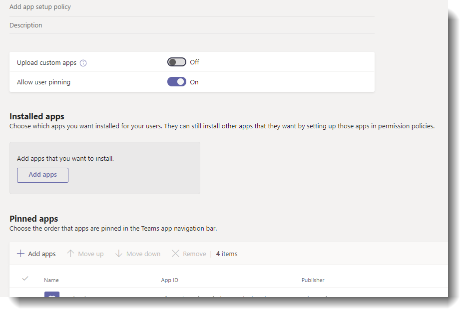

# Microsoft Teams のアプリのセットアップ ポリシーを管理するManage app setup policies in Microsoft Teams

> [!NOTE]
> 組織全体のアプリ設定を有効にしている場合、**カスタムアプリとの対話を許可**すると、Microsoft Teams 管理センターにまだアプリセットアップポリシーが表示されないことがあります。If you enabled the org-wide app setting, **Allow interaction with custom apps**, you may not see app setup policies yet in the Microsoft Teams admin center. この機能は現在展開中であり、間もなく組織内で利用可能になります。It's currently being rolled out and will be available soon in your organization.

管理者は、アプリ セットアップポリシーを使用して、次の操作を行うことができます。As an admin, you can use app setup policies to do the following:

- Teams をカスタマイズして、ユーザーにとって最も重要なアプリを強調表示します。Customize Teams to highlight the apps that are most important for your users. ピン留めするアプリを選択し、表示される順序を設定します。You choose the apps to pin and set the order that they appear. アプリをピン留めすると、サード パーティ製のアプリや組織内の開発者が作成したアプリなど、組織内のユーザーが必要とするアプリを提示できます。Pinning apps lets you showcase apps that users in your organization need, including those built by third parties or by developers in your organization.
- ユーザーがアプリを Teams にピン留めできるかどうかを制御します。Control whether users can pin apps to Teams.
- [ユーザーの代わりにアプリをインストールする **(プレビュー中)**] を選びます。Install apps on behalf of users **(in preview)**. ユーザーが Teams を起動したときに既定でインストールされるアプリを選択します。You choose which apps are installed by default for users when they start Teams. ユーザーに割り当てられている[アプリのアクセス許可のポリシー](teams-app-permission-policies.md)で許可されている場合は、ユーザーがアプリ自体をインストールできることを覚えておいてください。Keep in mind that users can still install apps themselves if the [app permission policy](teams-app-permission-policies.md) that's assigned to them allows it.

アプリは、アプリ バーにピン留めされます。Apps are pinned to the app bar. このバーは、Teams デスクトップ クライアントの横側および Teams モバイル クライアント (iOS および Android) の下側に表示されます。This is the bar on the side of the Teams desktop client and at the bottom of the Teams mobile clients (iOS and Android).

|Teams のデスクトップクライアントTeams desktop client  |Teams モバイルクライアントTeams mobile client |
|---------|---------|
|   |         |

アプリバーでプレインストールされているアプリを確認するには、ユーザーが [...] をクリックします **。** チームのデスクトップと web クライアントでその他のアプリを追加し、モバイルクライアントで上にスワイプします。To see their pre-installed apps, in the app bar, users click **... More apps** in the Teams desktop and web clients and swipe up in the mobile clients.

アプリセットアップポリシーは、Microsoft Teams 管理センターで管理します。You manage app setup policies in the Microsoft Teams admin center. グローバル (組織全体の既定) ポリシーを使用するか、カスタムポリシーを作成して割り当てることができます。You can use the global (Org-wide default) policy or create and assign custom policies.  カスタム ポリシーを作成して割り当てていない場合、組織内のユーザーにはグローバル ポリシーが自動的に適用されます。Users in your organization will automatically get the global policy unless you create and assign a custom policy. これらのポリシーを管理するには、グローバル管理者または Teams サービス管理者である必要があります。You must be a global admin or Teams service admin to manage these policies.

グローバルポリシーの設定を編集して、目的のアプリを含めることができます。You can edit the settings in the global policy to include the apps that you want. 組織内のさまざまなユーザーグループのチームをカスタマイズする場合は、1つ以上のカスタムポリシーを作成して割り当てます。If you want to customize Teams for different groups of users in your organization, create and assign one or more custom policies.

![[アプリセットアップポリシー] ページを示すスクリーンショット](media/app-setup-policies.png)

> [!NOTE]
> 教育機関向けの Teams をお持ちの場合は、現時点ではグローバルポリシーで割り当てアプリが既定で固定されていることを知っておくことが重要です。現在のところ、グローバルポリシーには表示されません。If you have Teams for Education, it's important to know that the Assignments app is pinned by default in the global policy even though currently, you don't see it listed in the global policy. チームクライアントの固定されたアプリの一覧で4番目のアプリになります。It will be the fourth app in the list of pinned apps on Teams clients.

## カスタムアプリセットアップポリシーを作成するCreate a custom app setup policy

Microsoft Teams 管理センターを使用して、カスタムポリシーを作成することができます。You can use the Microsoft Teams admin center to create a custom policy.

1. Microsoft Teams 管理センターの左のナビゲーションで、[ **Teams アプリ**  >  **セットアップポリシー**] に移動します。In the left navigation of the Microsoft Teams admin center, go to **Teams apps** > **Setup policies**.
2. **[追加]** をクリックします。Click **Add**.
    ![[アプリセットアップポリシーの追加] ページを示すスクリーンショット](media/app-setup-policies-add.png)
3. ポリシーの名前と説明を入力します。Enter a name and description for the policy.
4. ユーザーがカスタムアプリをチームにアップロードできるかどうかに応じて、**カスタムアプリのアップロード**を有効または無効にします。Turn on or turn off **Upload custom apps**, depending on whether you want to let users upload custom apps to Teams. [組織全体のアプリ設定](manage-apps.md#manage-org-wide-app-settings)で**サードパーティ製のアプリ**が無効になっている場合、この設定を変更することはできません。You won't be able to change this setting if **Allow third-party apps** is turned off in [org-wide app settings](manage-apps.md#manage-org-wide-app-settings).
5. ユーザーがアプリをカスタマイズ**できる**ようにするかどうかに応じて、ユーザーの固定を有効または無効にします。Turn on or turn off **Allow user pinning**, depending on whether you want to let users personalize their app bar by pinning apps to it.
6. ユーザー用のアプリ **(プレビュー版)** をインストールするには、次の操作を行います。To install apps for users **(in preview)**, do the following:

    1. [**インストールされているアプリ**] で、[**アプリの追加**] をクリックします。Under **Installed apps**, click **Add apps**.
    2. [**インストールされているアプリの追加**] ウィンドウで、ユーザーが Teams を起動したときに自動的にインストールするアプリを検索します。In the **Add installed apps** pane, search for the apps you want to automatically install for users when they start Teams. アプリのアクセス許可ポリシーによってアプリをフィルター処理することもできます。You can also filter apps by app permission policy. アプリの一覧を選択したら、[**追加**] をクリックします。When you've chosen your list of apps, click **Add**.

        ![[インストールされているアプリの追加] ウィンドウを示すスクリーンショット](media/app-setup-policies-add-installed-apps.png)

7. アプリを固定するには、次の操作を行います。To pin apps, do the following:

    1. [**固定**されたアプリ] で、[**アプリの追加**] をクリックします。Under **Pinned apps**, click **Add apps**.
    2. [固定された**アプリの追加**] ウィンドウで、追加するアプリを検索し、[**追加**] をクリックします。In the **Add pinned apps** pane, search for the apps you want to add, and then click **Add**. アプリのアクセス許可ポリシーによってアプリをフィルター処理することもできます。You can also filter apps by app permission policy. ピン留めするアプリのリストを選んだら、[**追加**] をクリックします。When you've chosen your list of apps to pin, click **Add**.

         ![[固定アプリの追加] ウィンドウを示すスクリーンショット](media/app-setup-policies-add-apps.png)

    3. Teams で表示する順序でアプリを配置し、[**保存**] をクリックします。Arrange the apps in the order that you want them to appear in Teams, and then click **Save**.

        

## アプリのセットアップポリシーを編集するEdit an app setup policy

Microsoft Teams 管理センターを使って、作成するグローバル (組織全体の既定) ポリシーやカスタムポリシーなどのポリシーを編集できます。You can use the Microsoft Teams admin center to edit a policy, including the global (Org-wide default) policy and custom policies that you create.

1. Microsoft Teams 管理センターの左のナビゲーションで、[ **Teams アプリ**  >  **セットアップポリシー**] に移動します。In the left navigation of the Microsoft Teams admin center, go to **Teams apps** > **Setup policies**.
2. ポリシー名の左側をクリックしてポリシーを選び、**[編集]** をクリックします。Select the policy by clicking to the left of the policy name, and then click **Edit**.
3. ここで、必要な変更を行います。From here, make the changes that you want.
4. **[保存]** をクリックします。Click **Save**.

## ユーザーにカスタムアプリセットアップポリシーを割り当てるAssign a custom app setup policy to users

[!INCLUDE [assign-policy](includes/assign-policy.md)]

## FAQFAQ

### アプリセットアップポリシーを使用するWorking with app setup policies

#### Microsoft Teams 管理センターには、どのような組み込みのアプリセットアップポリシーが含まれていますか?What built-in app setup policies are included in the Microsoft Teams admin center?

- **グローバル (組織全体の既定)**: この既定のポリシーは、別のポリシーを割り当てない限り、組織内のすべてのユーザーに適用されます。**Global (Org-wide default)**: This default policy applies to all users in your organization unless you assign another policy. グローバルポリシーを編集して、ユーザーにとって最も重要なアプリをピン留めします。Edit the global policy to pin apps that are most important for your users.
- **Firstlineworker**: このポリシーは、firstline worker に対して使用されます。**FirstLineWorker**: This policy is for Firstline Workers. 組織内の Firstline Worker に割り当てることができます。You can assign it to Firstline Workers in your organization. 作成するカスタムポリシーなど、設定をアクティブにするユーザーにポリシーを割り当てる必要があることを知っておくことが重要です。It's important to know that like custom policies that you create, you have to assign the policy to users for the settings to be active. 詳細については、この記事の「[ユーザーにカスタムアプリセットアップポリシーを割り当てる](#assign-a-custom-app-setup-policy-to-users)」セクションを参照してください。For more information, go to the [Assign a custom app setup policy to users](#assign-a-custom-app-setup-policy-to-users) section of this article.

#### [ピン留めしたアプリの追加] ウィンドウでアプリが見つからないのはなぜですか?Why can't I find an app in the Add pinned apps pane?

アプリセットアップポリシーを使用して、すべてのアプリを Teams にピン留めすることはできません。Not all apps can be pinned to Teams through an app setup policy. 一部のアプリでは、この機能がサポートされていない可能性があります。Some apps may not support this functionality. ピン留めできるアプリを見つけるには、[**ピン留め**されたアプリの追加] ウィンドウでアプリを検索します。To find apps that can be pinned, search for the app in the **Add pinned apps** pane. 個人用のスコープ (静的タブ) とボットを含むタブは、Teams のデスクトップクライアントにピン留めすることができます。これらのアプリは、[固定された**アプリの追加**] ウィンドウで利用できます。Tabs that have a personal scope (static tabs) and bots can be pinned to the Teams desktop client and these apps are available in the **Add pinned apps** pane.

Teams app store にはすべての Teams アプリが一覧表示されます。 [**ピン留め**されたアプリの追加] ウィンドウには、ポリシーを通じてチームにピン留めできるアプリのみが含まれていることに注意してください。Keep in mind that the Teams app store lists all Teams apps whereas the **Add pinned apps** pane includes only apps that can be pinned to Teams through a policy. 

#### 私は教育管理者向けのチームです。教育機関向け Teams のアプリセットアップポリシーについて知っておくべきことI'm a Teams for Education admin. What do I need to know about app setup policies in Teams for Education?

通話アプリは、教育担当の Teams では利用できません。The Calling app isn't available in Teams for Education. 新しいカスタムアプリのセットアップポリシーを作成すると、アプリの一覧に呼び出し元のアプリが表示されます。When you create a new custom app setup policy, the Calling app is displayed in the list of apps. ただし、アプリは Teams クライアントにはピン留めされておらず、教育機関のチームではチーム内の通話アプリを見ることはできません。However, the app isn't pinned to Teams clients and Teams for Education users won't see the Calls app in Teams.

#### 固定されたアプリの数をポリシーに追加できますか?How many pinned apps can be added to a policy?

少なくとも2つのアプリが Teams モバイルクライアント (iOS と Android) にピン留めされている必要があります。A minimum of two apps must be pinned to the Teams mobile clients (iOS and Android). ポリシーのアプリが2つ未満の場合、モバイルクライアントはポリシーの設定を反映せず、代わりに既存の構成を使い続けます。If a policy has less than two apps, the mobile clients won't reflect the policy settings and instead will continue to use the existing configuration.

ポリシーに追加できる固定されたアプリの数に制限はありません。There's no limit on the number of pinned apps you can add to a policy.

#### ポリシーの変更が有効になるまでにはどのくらいの時間がかかりますか?How long does it take for policy changes to take effect?

ポリシーを編集または割り当てると、変更が有効になるまでに数時間かかる場合があります。After you edit or assign a policy, it can take a few hours for changes to take effect.

### ユーザー エクスペリエンスUser experience

#### ユーザーが Teams で固定されたすべてのアプリを表示するにはどうすればよいですか?How can users see all their pinned apps in Teams?

ユーザーに対して固定されているすべてのアプリを表示するには、インストールされているアプリの数とチームクライアントウィンドウのサイズに応じて、次の操作が必要になることがあります。To view all apps that are pinned for a user, users may have to do the following depending on the number of installed apps and the size of their Teams client window.

|Teams のデスクトップクライアントTeams desktop client |Teams モバイルクライアントTeams mobile client |
|---------|---------|
|Teams のサイドにあるアプリバーで、[...] をクリックします。 **その他のアプリ**。In the app bar on the side of Teams, click **... More apps**.| チームの下部付近にあるアプリバーで、上にスワイプします。In the app bar near the bottom of Teams, swipe up.|
|    |  

#### Teams のモバイルエクスペリエンスについて知っておくべきことWhat do I need to know about the Teams mobile experience?

現在、Teams モバイルクライアント (iOS と Android) では、静的なタブを持つ個人用アプリはサポートされていません。The Teams mobile clients (iOS and Android) currently don't support personal apps with static tabs. ポリシーに設定されているアプリによっては、Teams のデスクトップクライアントに固定されたアプリが Teams のモバイルクライアントに表示されない場合があります。Depending on the apps set in the policy, apps pinned to the Teams desktop client might not appear in the Teams mobile clients. 携帯電話クライアントのチャットには、個人用のボットが引き続き表示されます。Personal bots will still appear in Chat on mobile clients.

Teams のモバイルクライアントでは、ユーザーにはアクティビティ、チャット、Teams などの主要な Teams アプリが表示され、シフトなどの一部のサードパーティ製アプリを Microsoft からピン留めすることができます。With the Teams mobile clients, users will see core Teams apps such as Activity, Chat, and Teams, and you can pin some first-party apps from Microsoft, such as Shifts.

#### ユーザーはポリシーによって固定されたアプリの順序を変更できますか。Can users change the order of apps pinned through a policy?

ユーザーは、[**ユーザーによる固定**] オプションがオンになっている場合は、チームのデスクトップとモバイルクライアントで固定されたアプリの順序を変更できます。Users can change the order of their pinned apps on Teams desktop and mobile clients if the **Allow user pinning** option is turned on. ユーザーは、Teams web クライアントで固定されたアプリの順序を変更することはできません。Users can't change the order of their pinned apps on Teams web clients.

#### ユーザーのピン留めは優先されますか?Does user pinning take precedence?

ユーザーに割り当てられているアプリセットアップポリシーが、ユーザーアプリの固定をブロックするように変更されている場合、チームはアプリバーに固定されているすべてのアプリを削除します。If the app setup policy assigned to the user is changed to block user app pinning, Teams removes any apps pinned to the app bar. ユーザーアプリの固定を許可するようにポリシーを変更した場合、ユーザーは以前に固定されたアプリを再ピンする必要があります。If the policy is then changed to allow user app pinning, users must re-pin their previously pinned apps.

### カスタム Teams アプリCustom Teams apps

#### 組織では、カスタム Teams アプリを構築し、AppSource またはテナントのアプリカタログに公開していますが、アプリが Teams のアプリバーにピン留めされている場合、アプリのアイコンは期待どおりに表示されません。My organization built a custom Teams app and published it, either to AppSource or the tenant app catalog, but the app icon isn't displayed as expected when the app is pinned to the app bar in Teams. 問題を解決するにはどうすればよいですか?How do I fix it?

アプリを申請する前に、ロゴガイドラインに従っていることを確認してください。Make sure that you follow the logo guidelines before you submit the app. 詳細については、「[販売業者ダッシュボードの申請のチェックリスト](/microsoftteams/platform/concepts/deploy-and-publish/appsource/prepare/overview)」を参照してください。To learn more, see [Checklist for Seller Dashboard submission](/microsoftteams/platform/concepts/deploy-and-publish/appsource/prepare/overview). 

## 関連項目Related topics

[Teams でのアプリの管理設定Admin settings for apps in Teams](admin-settings.md)

[チームのユーザーにポリシーを割り当てるAssign policies to your users in Teams](assign-policies.md)
