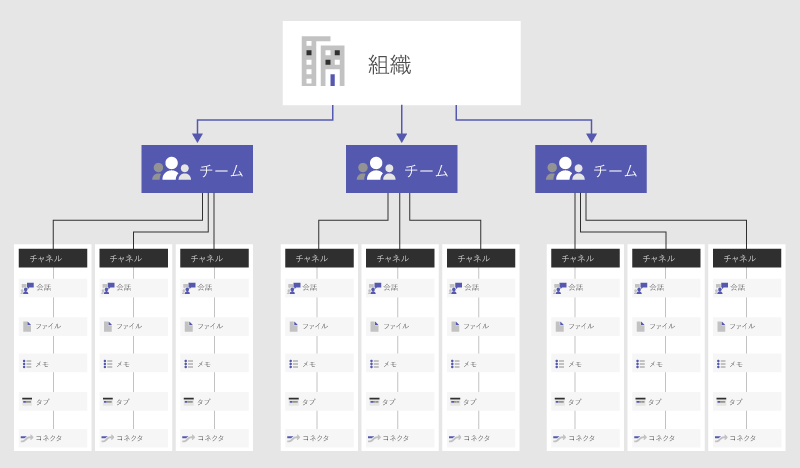

# Microsoft Teams でのチームとチャネルの概要Overview of teams and channels in Microsoft Teams

> [!NOTE]
> 以下の情報を確認して、Teams でのチャット、チーム、チャネル、およびアプリを理解してください。Review the following information to understand chat, teams, channels, & apps in Teams. 次に、[Microsoft Teams のチャット、チーム、チャネル、およびアプリ](deploy-chat-teams-channels-microsoft-teams-landing-page.md)に進み、Teams の立ち上げに重要な決定事項のリストを確認します。Then, go to [Chat, teams, channels, & apps in Teams](deploy-chat-teams-channels-microsoft-teams-landing-page.md) to walk through a list of decisions important to your Teams rollout.

はじめに、Microsoft Teams が各チームの自己組織化と、複数のビジネス シナリオにわたる共同作業をどのように実現しているかについて考えましょう。Let’s get started by thinking about how Microsoft Teams allows individual teams to self-organize and collaborate across business scenarios:

- **Teams** は、組織内のさまざまなプロジェクトや成果を取り巻く人、コンテンツ、およびツールの集合です。**Teams** are a collection of people, content, and tools surrounding different projects and outcomes within an organization.

    - 招待されたユーザーだけが対象の非公開チームを作成することもできます。Teams can be created to be private to only invited users.
    - チームは公開の形で作成することもでき、組織内の誰でも参加できます（最大 10,000 人のメンバー）。Teams can also be created to be public and open and anyone within the organization can join (up to 10,000 members).
    
    チームは、何かの仕事を完成させるために緊密に作業している人たちを 1 つにまとめるために設計されています。A team is designed to bring together a group of people who work closely to get things done. Teams はプロジェクト単位の作業 (製品の立ち上げや、デジタル作戦指令室を作るなど) において、現在進行中の作業も含めて、組織の内部構造 (たとえば、部署やオフィスの場所など) を反映して、動的に機能します。Teams can be dynamic for project-based work (for example, launching a product, creating a digital war room), as well as ongoing, to reflect the internal structure of your organization (for example, departments and office locations). 複数のチーム チャネルにわたる会話、ファイル、ノートはチームのメンバーだけが見ることができます。Conversations, files and notes across team channels are only visible to members of the team.

- **チャネル** は、チーム内の専用セクションで、チームで機能しているすべてのことについて、たとえば特定のトピック、プロジェクト、分野などの別に会話をまとめ、保存します。**Channels** are dedicated sections within a team to keep conversations organized by specific topics, projects, disciplines—-whatever works for your team! ([ファイル] タブで) チャネルで共有するファイルは、SharePoint に保存されます。Files that you share in a channel (on the Files tab) are stored in SharePoint. 詳細については、「[Microsoft Teams との SharePoint Online と OneDrive for Business の連携](SharePoint-OneDrive-interact.md)」をご覧ください。To learn more, read [How SharePoint Online and OneDrive for Business  interact with Teams](SharePoint-OneDrive-interact.md).

    - チャネルは、会話がなされ、実際に作業が行われる場所です。Channels are places where conversations happen and where the work actually gets done. チャネルはすべてのチーム メンバーに公開することができ、対象ユーザーを限定する必要がある場合は、プライベートにすることもできます。Channels can be open to all team members or, if you need a more select audience, they can be private. 標準チャネルは、チーム内のすべてのユーザーが参加できる会話向けであり、[プライベート チャネル](private-channels.md)は、会話をチーム内の少人数のユーザーに限定します。Standard channels are for conversations that everyone in a team can participate in and [private channels](private-channels.md) limit communication to a subset of people in a team.
    - チャネルは、タブ、コネクタ、およびボットを含んでいるアプリで拡張することで最大の価値を発揮するようになり、チームのメンバーにとってのチャネルの価値が高まります。Channels are most valuable when extended with apps that include tabs, connectors, and bots that increase their value to the members of the team. 詳細については、「[Microsoft Teams のアプリ、ボット、およびコネクタ](deploy-apps-microsoft-teams-landing-page.md)」をご覧ください。To learn more, see [Apps, bots, & connectors in Teams](deploy-apps-microsoft-teams-landing-page.md).
    
チームとチャネルの使用に関するヘルプについては、「[チームとチャネル](https://support.office.com/article/teams-and-channels-df38ae23-8f85-46d3-b071-cb11b9de5499)」をご覧ください。For help using teams and channels, check out [Teams and channels](https://support.office.com/article/teams-and-channels-df38ae23-8f85-46d3-b071-cb11b9de5499).

チームとチャネルを作成するためのベストプラクティスの詳細について、この短いビデオをご覧ください。View this short video to learn more about best practices for creating teams and channels.

   > [!VIDEO https://www.youtube.com/embed/WkAVgNKn0hs]

メンバーシップ、ロール、および設定Membership, roles, and settings
------------------------------

**チーム メンバーシップ****Team membership**

Microsoft Teams が組織全体に対してアクティブ化されると、指定されたチーム所有者は、共同で作業する従業員をチームに参加するよう招待できるようになります。When Microsoft Teams is activated for your entire organization, designated team owners can invite any employee they work with to join their team. Microsoft Teams では、チーム所有者が組織内のユーザーを名前に基づいて追加することが簡単に行えます。Microsoft Teams makes it easy for team owners to add people in the organization based on their name. 組織の設定に応じて、組織外のユーザーでありながらチーム メンバーになっているゲストも、チームに追加することができます。Depending on your organization's settings guests who are team members but outside of your organization can also be added to your teams. 詳細については、「[Microsoft Teams でのゲスト アクセス](guest-access.md)」をご覧ください。See [Guest Access in Microsoft Teams](guest-access.md) for more information. 

チーム所有者は、既存の Microsoft 365 グループに基づいてチームを作成することもできます。Team owners can also create a team based on an existing Microsoft 365 group. グループに対するいかなる変更も、Microsoft Teams に自動的に同期されます。Any changes made to the group will be synced with Microsoft Teams automatically. 既存の Microsoft 365 グループに基づいてチームを作成することで、メンバーの招待や管理のプロセスが簡素化されるだけでなく、Microsoft Teams の内部のグループ ファイルの同期も行われます。Creating a team based on an existing Microsoft 365 group not only simplifies the process of inviting and managing members, but also syncs group files inside of Microsoft Teams.

**チームの役割****Team roles**

Microsoft Teams には、次の 2 つの主な役割があります。There are two main roles in Microsoft Teams: 

- **チーム所有者** - チームを作成するユーザーです。**Team owner** - The person who creates the team. チーム所有者は、チームのメンバーをチームに招待した時点またはチームに参加した後に、共同所有者にすることができます。Team owners can make any member of their team a co-owner when they invite them to the team or at any point after they’ve joined the team. 複数のチーム所有者がいると、招待などの設定やメンバーシップの管理の負担を分散できるようになります。Having multiple team owners lets you share the responsibilities of managing settings and membership, including invitations.
- **チーム メンバー** - 所有者が自分のチームに招待したユーザーです。**Team members** - The people who the owners invite to join their team.

また、モデレートが設定されている場合、チームの所有者とメンバーには、チャネルに対するモデレーターの機能を割り当てることができます。In addition, if moderation is set up, team owners and members can have moderator capabilities for a channel. モデレーターは、チャネルで新しい投稿を開始することと、チームのメンバーが既存のチャネル メッセージに返信できるようするかどうかを制御することができます。Moderators can start new posts in the channel and control whether team members can reply to existing channel messages. チーム所有者は、チャネル内にモデレーターを割り当てることができます。Team owners can assign moderators within a channel. (既定では、チーム所有者はモデレーター機能を所有しています。) チャネル内のモデレーターは、チャネル内の他のモデレーターを追加または削除できます。(Team owners have moderator capabilities by default.) Moderators within a channel can add or remove other moderators within that channel. 詳細については、「[Microsoft Teams でチャネル モデレーションをセットアップして管理する](manage-channel-moderation-in-teams.md)」をご覧ください。For more information, see [Set up and manage channel moderation in Microsoft Teams](manage-channel-moderation-in-teams.md).

**チームの設定****Team settings** 

チームの所有者は、チーム全体の設定を直接 Microsoft Teams で管理できます。Team owners can manage team-wide settings directly in Microsoft Teams. この設定には、チームの写真の追加や、標準および[プライベート チャネル](private-channels.md)を作成したり、タブとコネクタを追加したり、チームまたはチャネル全体を @メンションしたりするためのチーム メンバーにわたるアクセス許可の設定や、GIF、ステッカー、ミームの使用が含まれます。Settings include the ability to add a team picture, set permissions across team members for creating standard and [private channels](private-channels.md), adding tabs and connectors, @mentioning the entire team or channel, and the usage of GIFs, stickers, and memes.

3分で、チームオーナー向け必須ガイドのビデオをチェックしましょう。Take three minutes to check out this go-to-guide video for team owners:

   > [!VIDEO https://www.youtube.com/embed/kalV4dG-oFo]

Microsoft 365 または Office 365 での Microsoft Teams 管理者である場合は、Microsoft Teams 管理センターのシステム全体の設定にアクセスすることができます。If you are a Microsoft Teams administrator in Microsoft 365 or Office 365, you have access to system-wide settings in the Microsoft Teams admin center. これらの設定は、チーム設定でチーム所有者に表示されるオプションと既定値に影響します。These settings can impact the options and defaults team owners see under team settings. たとえば、チーム全体の通知、ディスカッション、リソースのために、既定のチャネル「一般」を有効にして、それらがすべてのチームにわたって表示されるようにすることができます。For example, you can enable a default channel, “General”, for team-wide announcements, discussions, and resources, which will appear across all teams.

既定では、すべてのユーザーが Microsoft Teams 内にチームを作成するアクセス許可を持っています (これを変更するには、「[Teams でロールとアクセス許可を割り当てる](assign-roles-permissions.md)」をご覧ください)。By default, all users have permissions to create a team within Microsoft Teams (to modify this, see [Assign roles and permissions in Teams](assign-roles-permissions.md). 既存の Microsoft 365 グループのユーザーは、Teams の機能を利用して自身のアクセス許可を拡張することもできます。Users of an existing Microsoft 365 group can also enhance their permissions with Teams functionality.

ユーザーを Microsoft Teams に関与させるために鍵となる初期段階の計画アクティビティは、日々の生活で Teams がどのようにコラボレーションを深めているのかについて、洞察と理解を促進することです。One key early planning activity to engage users with Microsoft Teams is to help people think and understand how Teams can enhance collaboration in their day to day lives. ユーザーと話し合い、断片的な方法で現在共同作業を行っている状況でビジネス シナリオを選択できるように支援します。Talk with people and help them select business scenarios where they are currently collaborating in fragmented ways. ユーザーたちが作業を完了するために役に立つ関連するタブとともに、それらのユーザーをチャネルに取り込みます。Bring them together in a channel with the relevant tabs that will help them get their work done. Teams の最も強力なユース ケースの 1 つは、あらゆる組織横断型のプロセスです。One of the most powerful use cases of Teams is any cross-organizational process. 

チームの例Example Teams
--------------

以下の表は、さまざまな種類のユーザーが自分のチーム、チャネル、アプリ (タブ/コネクタ/ボット) をセットアップする方法の機能的な例を示しています。Below are a few functional examples of how different types of users may approach setting up their teams, channels, and apps (tabs/connectors/bots). これは、Microsoft Teams に関してユーザー コミュニティと話し合いを始めるのに役立ちます。This may be useful to help kick off a conversation about Microsoft Teams with your user community. 組織で Microsoft Teams を実装する方法について考えている場合は、チームの構造化方法についてガイダンスを提供できることを覚えておいてください。ただし、ユーザーは自己組織化する方法を制御できます。As you think about how to implement Microsoft Teams in your organization, remember that you can provide guidance on how to structure their teams; however, users have control of how they can self-organize. これらは、チームが可能性について考えられるようにするための例にすぎません。These are just examples to help get teams to start thinking through the possibilities.

Microsoft Teams は、縦割り組織を解体して機能横断型チームを促進することに優れています。このため、ユーザーは組織の境界ではなく機能的なチームとして考える意識が高まります。Microsoft Teams is great for breaking down organizational silos and promoting cross-functional teams, so encourage your users to think about functional teams rather than organizational boundaries.

|チームのタイプTypes of Teams  |考えられるチャネルPotential Channels  |アプリ (タブApps (Tabs /コネクタ/Connectors /ボット/Bots ))  |
|---------|---------|---------|
|売上Sales     |年次販売会議Annual Sales Meeting   四半期ビジネス レビューQuarterly Business Review   月次売上パイプライン レビューMonthly Sales Pipeline Review   売上戦略Sales Playbook |Power BIPower BI  TrelloTrello  CRMCRM  サマライズ ボットSummarize Bot         |
|広報活動Public Relations     |プレス リリースPress Releases  ニュースおよび更新情報News and Updates  ファクト チェックFact Checking         |RSS フィードRSS Feed  TwitterTwitter         |
|イベント計画Event Planning     |マーケティングMarketing  物流およびスケジュールLogistics and Scheduling  会場Venue  予算Budget         |TwitterTwitter  FacebookFacebook  プランナーPlanner  PDFPDF         |
|マーケティング/市場開拓Marketing/Go to Market   |市場調査Market Research  メッセージ ピラーMessaging Pillars  コミュニケーション プランCommunications Plan  部品表のマーケティングMarketing Bill of Materials        |YouTubeYouTube  Microsoft StreamMicrosoft Stream  TwitterTwitter  MailChimpMailChimp         |
|技術運用Technical Operations    |インシデント管理Incident Management  スプリント計画Sprint Planning  作業項目Work Items  インフラストラクチャおよび運用Infrastructure and Operations         |チーム サービスTeam Services  JiraJira  AzureBotAzureBot         |
|製品チームProduct Team      |戦略Strategy  マーケティングMarketing  売上Sales  操作Operations  分析情報Insights  サービスとサポートServices & Support         |Power BIPower BI  チーム サービスTeam Services         |
|FinanceFinance    |現会計年度Current Fiscal  年度計画FY Planning  予測Forecasting  売掛金Accounts Receivable  買掛金Accounts Payable         |Power BIPower BI  Google アナリティクスGoogle Analytics         |
|物流Logistics     |倉庫管理Warehouse Operations  車両整備Vehicle Maintenance  ドライバー勤務表Driver Rosters         |気象サービスWeather Service  トラベル/道路混乱Travel / Road Disruptions  プランナーPlanner  TubotTubot  UPS ボットUPS Bot         |
|人事HR     |人材管理Talent Management  採用Recruiting  業績レビュー計画Performance Review Planning  士気Morale         |HR ツールHR Tools  外部の求人サイトExternal Job Posting Sites  GrowbotGrowbot         |
|組織横断型Cross-organizational   仮想チームVirtual Team |戦略Strategy  人材育成Workforce Development  競争と研究Compete & Research         |Power BIPower BI  Microsoft StreamMicrosoft Stream         |

組織構造に整合する Teams を作成することができます。It's possible to create Teams that align with the organizational structure. これは、士気の向上、チーム固有のレビューの実施、従業員のオンボーディング プロセスの明確化、人員の計画についての話し合い、およびさまざまな人員にわたっての視認性の改善を行うことを考えているリーダーにとって最適です。This is best used for leaders who want to drive morale, have team-specific reviews, clarify employee onboarding processes, discuss workforce plans, and increase visibility across a diverse workforce.  

## 組織全体のチームOrg-wide teams

組織のユーザー数が 5,000以下の場合は、組織全体でチームを作成できます。If your organization has no more than 5,000 users, you can create an org-wide team. 組織全体のチームは、組織内の全員がコラボレーションのための単一チームの一部に自動的なれる方法を提供します。Org-wide teams provide an automatic way for everyone in an organization to be a part of a single team for collaboration. 組織全体のチームを作成および管理するための、ベストプラクティスを含む詳細については、[Microsoft Teams で組織全体のチームを作成する](create-an-org-wide-team.md)を参照してください。For more information, including best practices for creating and managing an org-wide team, see [Create an org-wide team in Microsoft Teams](create-an-org-wide-team.md).
