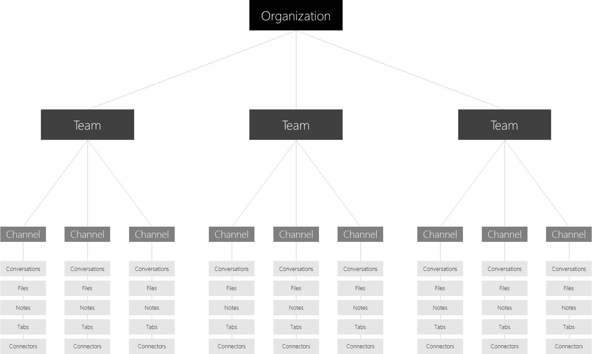

Microsoft Teams でのチームとチャネルの概要
=================================================

はじめに、Microsoft Teams が各チームの自己組織化をどのように実現しているかについて考えましょう。

-   **チーム**は、さまざまなプロジェクトにわたるメンバー、コンテンツ、ツール、組織内のジョブなどの集合体です。

    -   チームは、招待されたユーザーに対してのみ、プライベートとして作成されます。

    -   また、チームは、組織内の参加可能なすべての人 (最大で 2500 人のメンバー) に対して、パブリックでオープンなものとして作成されます。

-   **チャネル**は、チーム内の専用セクションで、チームで機能しているすべてのことについて、たとえば特定のトピック、プロジェクト、分野などの別に会話をまとめ、保存します。

    -   チーム チャネルは、チームの全員がオープンに会話できる場です。プライベート チャットはチャット内のユーザーのみに表示されます。

    -   チャネルは、タブ、コネクタ、ボットを含むアプリにより拡張できます。

ユーザーを Microsoft Teams に関与させるために鍵となる初期段階の計画アクティビティは、日々の生活で Microsoft Teams がどのようにコラボレーションを深めているのかについて、洞察と理解を促進することです。

既定では、すべてのユーザーが Microsoft Teams 内にチームを作成する権限を持っています (これを変更するには、「[Teams で役割と権限を割り当てる](assign-roles-permissions.md)」をご覧ください)。既存の Office 365 グループのユーザーは、Microsoft Teams の機能を利用してそれらを拡張することもできます。

サンプルのチーム セットアップ
------------------

以下に、さまざまなタイプのユーザーが、チーム、チャネルおよびアプリ (タブ/コネクタ/ボット) のセットアップにどのような方法を取ることができるかを示します。これは、Microsoft Teams に関する会話をユーザー コミュニティと開始するにあたってサポートを提供する場合に役立ちます。組織に Microsoft Teams をどのように実装するかを考える場合、提供できるのはチームの構築方法に関するガイダンスであって、自己組織化の方法はユーザーが管理するものであることを念頭に入れてください。以下は、チームが実行可能な方法について考えるにあたって、そのサポートをするサンプルとなります。

Microsoft Teams は、縦割り組織を解体して機能横断型チームを促進することに優れています。このため、ユーザーは縦割り組織ではなく機能的なチームとして考える意識が高まります。

|チームのタイプ  |考えられるチャネル  |アプリ (タブ /コネクタ /ボット )  |
|---------|---------|---------|
|販売     |年次販売会議   四半期ビジネス レビュー   月次売上パイプライン レビュー   売上戦略 |Power BI  Trello  CRM  サマライズ ボット         |
|広報     |プレス リリース  ニュースおよび更新情報  ファクト チェック         |RSS フィード  Twitter         |
|イベント計画     |マーケティング  物流およびスケジュール  会場  予算         |Twitter  Facebook  Planner  PDF         |
|マーケティング/市場開拓   |市場リサーチ  メッセージ ピラー  コミュニケーション プラン  部品表のマーケティング        |YouTube  Microsoft Stream  Twitter  MailChimp         |
|技術運用    |インシデント管理  スプリント計画  作業項目  インフラストラクチャおよび運用         |チーム サービス  Jira  AzureBot         |
|製品チーム      |戦略  マーケティング  販売  運用  洞察  サービスとサポート         |Power BI  チーム サービス         |
|財務    |現会計年度  年度計画  予測  売掛金  買掛金         |Power BI  Google アナリティクス         |
|物流     |倉庫管理  車両整備  ドライバー勤務表         |気象サービス  トラベル/道路混乱  Planner  Tubot  UPS ボット         |
|HR     |人材管理  採用  業績レビュー計画  士気         |HR ツール  外部の求人サイト  Growbot         |
|組織横断型   仮想チーム |戦略  人材育成  競争と研究         |Power BI  Microsoft Stream         |

