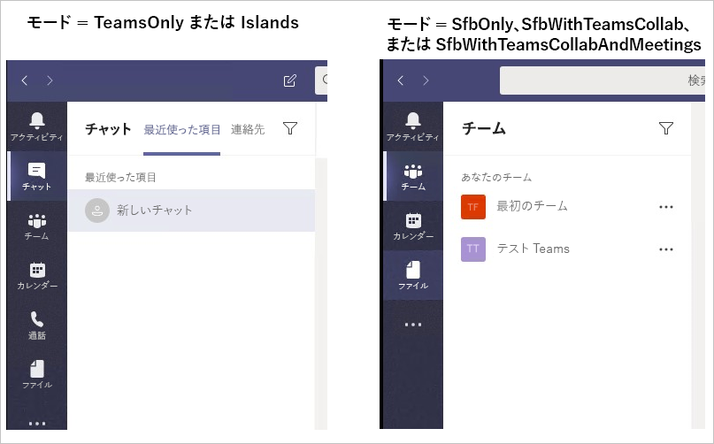

# Teams のクライアント エクスペリエンスおよび共存モードへの準拠Teams client experience and conformance to coexistence modes

> [!NOTE]
> このページは、ユーザーは、Skype のビジネス ・ モード (SfBOnly、SfBWithTeamsCollab、SfBWithTeamsCollabAndMeetings) のいずれかで、時に、チームのクライアントの動作で、最近リリースされた重要な変更の内容を説明します。This page describes important, recently released changes in the behavior of Teams client when users are in any of the Skype for Business modes (SfBOnly, SfBWithTeamsCollab, SfBWithTeamsCollabAndMeetings).

共存モードの目的は、エクスペリエンスを提供する単純かつ予測可能なエンド ・ ユーザーの組織の移行とビジネス用の Skype からのチームには。The purpose of co-existence modes is to provide a simple, predictable experience for end users as organizations transition from Skype for Business to Teams.  チームに移動する組織、TeamsOnly モードは、各ユーザーの最終的な宛先を同時に TeamsOnly (または他のモード) に割り当てられる必要はないすべてのユーザーです。For an organization moving to Teams, the TeamsOnly mode is the final destination for each user, though not all users need to be assigned TeamsOnly (or any other mode) at the same time.  ユーザーが TeamsOnly モードに到達する前に、組織は Skype for Business の任意のモード (SfBOnly、SfBWithTeamsCollab、SfBWithTeamsCollabAndMeetings) を使用して、TeamsOnly であるユーザーとまだ TeamsOnly ではないユーザー間の予測可能な通信を確保することができます。Prior to users reaching TeamsOnly mode, organizations can use any of the Skype for Business modes (SfBOnly, SfBWithTeamsCollab, SfBWithTeamsCollabAndMeetings) to ensure predictable communication between users who are TeamsOnly and those who aren’t yet. 

ユーザーは、Skype のビジネス モードのいずれかでは、ビジネスのクライアントのユーザーの Skype にすべての着信のチャットや通話がルーティングされます。When a user is in any of the Skype for Business modes, all incoming chats and calls are routed to the user’s Skype for Business client. エンド ・ ユーザーの混乱を防止し、適切なルーティングを確保する、ユーザーは、Skype のビジネス モードのいずれかで、チームのクライアントでの通話やチャットの機能が無効になります。To avoid end user confusion and ensure proper routing, calling and chat functionality in the Teams client is disabled when a user is in any of the Skype for Business modes. 同様に、チームでミーティングのスケジュール設定は SfBOnly または SfBWithTeamsCollab モードでは、ユーザーがいる場合は明示的に無効になってし、SfBWithTeamsCollabAndMeetings モードでは、ユーザーとを明示的に有効にします。Similarly, meeting scheduling in Teams is explicitly disabled when users are in the SfBOnly or SfBWithTeamsCollab modes, and explicitly enabled when a user is in the SfBWithTeamsCollabAndMeetings mode.   

## モードに基づくチームのクライアントで利用可能な機能がどのように変化するかHow the available functionality in Teams client changes based on mode
チームで利用可能な機能は、TeamsUpgradePolicy によって設定されるユーザーの共存モードとは異なります。The available functionality in Teams depends on the user's coexistence mode, as set by TeamsUpgradePolicy. 次の表は、動作をまとめたものです。The table below summarizes the  behavior:

|ユーザーの有効なモードUser's effective mode|チームのクライアントで発生します。Experience in Teams client|
|---|---|
|ビジネス モードでは、SkypeAny Skype for Business mode|通話とチャットが無効になります。Calling and Chat are disabled.|
|SfBWithTeamsCollabAndMeetingsSfBWithTeamsCollabAndMeetings|会議のスケジュール設定があります。Meeting scheduling is available|
|SfBWithTeamsCollab または SfBOnly1SfBWithTeamsCollab or SfBOnly1|会議のスケジュール設定は使用できません。Meeting scheduling is not available|
|||

次のスクリーン ショットは、TeamsOnly または島のモードとその他のすべてのモードの違いを示しています。The following screenshots illustrate the difference between TeamsOnly or Islands mode and all other modes. チャットと通話のアイコンは、TeamsOnly または島モード (スクリーン ショットを左)、しない場合は、その他のモード (右のスクリーン ショット) で使用に注意してください。Note that the chat and calling icons are available with TeamsOnly or Islands mode (left screenshot), but not with the other modes (right screenshot):

 
**注:**
ここでは、SfBwithTeamsCollab と SfBOnly1の動作は同じですが、SfBOnly モードでもチームでのチャネル、およびファイルの機能を無効にすることが目的ただし、設定されていない現在無効にするチームでこの機能を可能にします。**Note:**
1 For now, SfBwithTeamsCollab and SfBOnly behave the same, but the intent is for SfBOnly mode to also disable Channels and Files functionality in Teams; however, there is currently no setting that allows this functionality in Teams to be disabled.

## モードの他のポリシー設定への影響Impact of Mode on other policy settings
前述のとおり、ユーザーの共存モードへの影響は、ユーザーのチームのクライアントでどのような機能があります。As described above, a user's coexistence mode impact's what functionality is available in the user's Teams client. これは、あるモードの値が優先モードによって、他のポリシー設定の値を意味します。This means that the value of mode can take precedence over the value of other policy settings, depending on the mode. 具体的には、共存モードは、次のポリシー設定を有効にするかどうか影響します。Specifically,  coexistence mode impacts whether the following policy settings are honored:

|**モーダルかどうか (アプリケーション)****Modality (App)**|**Policy.Setting****Policy.Setting**|
|---|---|
|チャットChat|TeamsMessagingPolicy.AllowUserChatTeamsMessagingPolicy.AllowUserChat|
|通話Calling|TeamsCallingPolicy.AllowPrivateCallingTeamsCallingPolicy.AllowPrivateCalling|
|会議のスケジュールMeeting scheduling|TeamsMeetingPolicy.AllowPrivateMeetingSchedulingTeamsMeetingPolicy.AllowPrivateMeetingScheduling TeamsMeetingPolicy.AllowChannelMeetingSchedulingTeamsMeetingPolicy.AllowChannelMeetingScheduling|
|||

管理者が必要*ない*共存モードが、それが重要であるこれらの設定効果的に動作する次のように特定のモードを理解するときにこれらのポリシー設定を明示的に設定します。Administrators need *not* explicitly set these policy settings when using co-existence mode, but it's important to understand that these settings effectively behave as follows for a given mode. 

|ModeMode|AllowUserChatAllowUserChat|AllowPrivateCallingAllowPrivateCalling|AllowPrivateMeetingSchedulingAllowPrivateMeetingScheduling|AllowChannelMeetingSchedulingAllowChannelMeetingScheduling|
|---|---|---|---|---|
|TeamsOnly または諸島TeamsOnly or Islands|有効Enabled|有効Enabled|有効Enabled|有効Enabled|
|SfBWithTeamsCollabAndMeetingsSfBWithTeamsCollabAndMeetings|無効Disabled|無効Disabled|有効Enabled|有効Enabled|
|SfBWithTeamsCollab または SfBOnlySfBWithTeamsCollab or SfBOnly|無効Disabled|無効Disabled|無効Disabled|無効Disabled|
||||||

PowerShell を使用する場合、`Grant-CsTeamsUpgradePolicy`コマンドレットは、これらの設定は、TeamsUpgradePolicy によって上書きされますが、その場合を決定するには、TeamsMessagingPolicy、TeamsCallingPolicy、および TeamsMeetingPolicy に対応する設定の構成を確認します。PowerShell では、情報メッセージが提供されます。When using PowerShell, the `Grant-CsTeamsUpgradePolicy` cmdlet checks the configuration of the corresponding settings in TeamsMessagingPolicy, TeamsCallingPolicy, and TeamsMeetingPolicy to determine if those settings would be superceded by TeamsUpgradePolicy and if so, an informational message is provided in PowerShell.  上記で述べたようにこれらのポリシー設定を設定する必要はありません。As noted above,  is no longer necessary to set these other policy settings. 以下には、次のようにどのような PowerShell の警告の例を示します。Below is an example of what the PowerShell warning looks like:

`Grant-CsTeamsUpgradePolicy -Identity user1@contoso.com -PolicyName SfBWithTeamsCollab`

`WARNING: The user 'user1@contoso.com' currently has enabled values for: AllowUserChat, AllowPrivateCalling, AllowPrivateMeetingScheduling, AllowChannelMeetingScheduling, however these values will be ignored. This is because you are granting this user TeamsUpgradePolicy with mode=SfBWithTeamsCollab, which causes the Teams client to behave as if they are disabled.`

# 関連トピックRelated topics

[Teams を Skype for Business と一緒に使用する組織向けの移行と相互運用に関するガイダンスMigration and interoperability guidance for organizations using Teams together with Skype for Business](https://docs.microsoft.com/en-us/microsoftteams/migration-interop-guidance-for-teams-with-skype)

