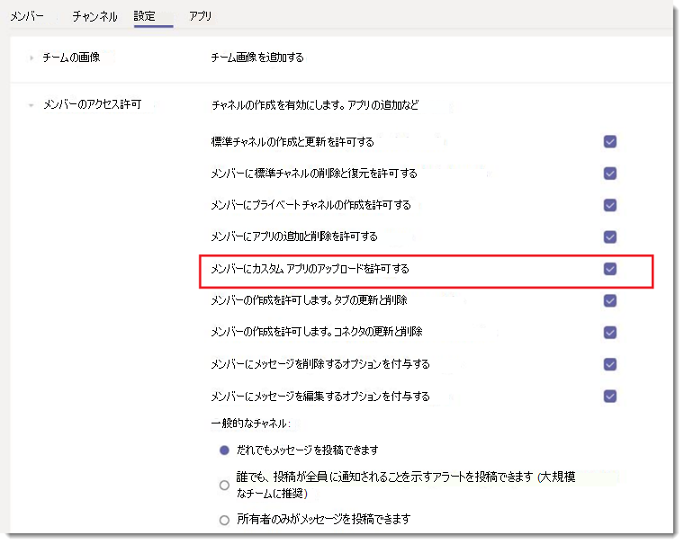

# Microsoft Teams のカスタム アプリのポリシーと設定を管理するManage custom app policies and settings in Microsoft Teams

> [!NOTE]
> アプリ Studio を使うには、「 [C#/.NET とアプリ studio で Microsoft Teams プラットフォーム](https://docs.microsoft.com/microsoftteams/platform/get-started/get-started-dotnet-app-studio)の使用を開始する」を参照してください。最後の手順はまだ機能していないため、zip をダウンロードして、 [microsoft teams にアプリパッケージをアップロード](https://docs.microsoft.com/microsoftteams/platform/concepts/apps/apps-upload)する前の方法でインストールする必要があります。To use App Studio see [Get started on the Microsoft Teams platform with C#/.NET and App Studio](https://docs.microsoft.com/microsoftteams/platform/get-started/get-started-dotnet-app-studio) The last step is not working yet, so you will need to download the zip and install it the old way at [Upload an app package to Microsoft Teams](https://docs.microsoft.com/microsoftteams/platform/concepts/apps/apps-upload).

管理者として、カスタムアプリポリシーと設定を使用して、組織内のユーザーが Microsoft Teams にカスタムアプリをアップロードできるユーザーを制御することができます。As an admin, you can use custom app policies and settings to control who in your organization can upload custom apps to Microsoft Teams. 管理者は、カスタムアプリをアップロードできるユーザーを決定し、管理者とチーム所有者は、組織内の特定のチームに対してカスタムアプリの追加を許可するかどうかを決定できます。Admins decide which users can upload custom apps, and admins and team owners can determine whether specific teams in your organization allow custom apps to be added to them.  カスタムアプリポリシーを編集した後は、変更が有効になるまで最大24時間かかることがあります。After you edit the custom app policy, it can take up to 24 hours for changes to take effect. これらのポリシーを管理するには、グローバル管理者または Teams サービス管理者である必要があります。You must be a global admin or Teams service admin to manage these policies.

## カスタムアプリの概要Overview of custom apps

ユーザーは、アプリパッケージ (.zip ファイル) を直接チームまたは個人用コンテキストでアップロードして、チームにカスタムアプリを追加することができます。Users can add a custom app to Teams by uploading an app package (in a .zip file) directly to a team or in the personal context. これは、Teams app store によってアプリを追加する方法とは異なります。This is different from how apps are added through the Teams app store. サイドローディングとも呼ばれるアプリパッケージをアップロードしてカスタムアプリを追加することで、アプリが開発中であることをテストして、広く配布する準備ができます。Adding a custom app by uploading an app package, also known as sideloading, lets you test an app as it's being developed, before it's ready to be widely distributed. また、内部使用専用のアプリを構築して、Teams app store の Teams アプリカタログに提出することなくチームと共有することもできます。It also lets you build an app for internal use only and share it with your team without submitting it to the Teams app catalog in the Teams app store.

![App store の [カスタムアプリのアップロード] オプションを示すスクリーンショット](media/teams-custom-app-policy-and-settings-upload-app.png)

## カスタムアプリのポリシーと設定Custom app policy and settings

3つのコンポーネントは、ユーザーがカスタムアプリをチームにアップロードできるかどうかを決定し、カスタムアプリをチームに追加できるユーザーと、どのチームカスタムアプリを追加できるかを細かく制御できるようにします。Three components determine whether a user can upload a custom app to a team, giving you granular control over who can add custom apps to a team and which teams custom apps can be added to:

- [ユーザーカスタムアプリポリシーUser custom app policy](#user-custom-app-policy)
- [チームのカスタムアプリの設定Team custom app setting](#team-custom-app-setting)
- [組織全体のカスタムアプリ設定Org-wide custom app setting](#org-wide-custom-app-setting)

これらの設定は、サードパーティ製のアプリをブロックする機能には影響しません。These settings don't affect the ability to block third-party apps.  

### ユーザーカスタムアプリポリシーUser custom app policy

[アプリのセットアップポリシー](teams-app-setup-policies.md)の一部として、管理者は、ポリシー設定を使用し、**カスタムアプリをアップロード**して、ユーザーがカスタムアプリを Teams にアップロードできるかどうかを制御できます。As part of [app setup policies](teams-app-setup-policies.md), admins can use a policy setting, **Upload custom apps**, to control whether a user can upload custom apps to Teams.
 
この設定を無効にする場合は、次の操作を行います。If this setting is turned off:

- ユーザーはカスタムアプリを組織内のチームまたは個人のコンテキストでアップロードすることはできません。The user can't upload a custom app to any team in your organization or in the personal context.
- ユーザーは、組織全体のカスタムアプリの設定に応じて、カスタムアプリを操作できます。The user can interact with custom apps, depending on the org-wide custom app setting.

この設定を有効にする場合は、次の操作を行います。If this setting is turned on:

- ユーザーは、組織全体のカスタムアプリの設定に応じて、ユーザーがアプリを所有しているか、所有者である teams にカスタムアプリをアップロードすることができます。The user can upload custom apps to teams that allow it and to teams for which they are owners, depending on the org-wide custom app setting.
- ユーザーは、カスタムアプリを個人用コンテキストにアップロードできます。The user can upload custom apps to the personal context. 
- ユーザーは、組織全体のカスタムアプリの設定に応じて、カスタムアプリを操作できます。The user can interact with custom apps, depending on the org-wide custom app setting.

グローバルアプリセットアップポリシーの設定を編集して、目的のアプリを含めることができます。You can edit the settings in the global app setup policy to include the apps that you want. 組織内のさまざまなユーザーグループのチームをカスタマイズする場合は、1つまたは複数のカスタムアプリセットアップポリシーを作成して割り当てます。If you want to customize Teams for different groups of users in your organization, create and assign one or more custom app setup policies.

#### ユーザー独自のアプリポリシーを設定するSet a user custom app policy

1. Microsoft Teams 管理センターの左のナビゲーションで、[ **Teams アプリ** > **セットアップポリシー**] に移動します。In the left navigation of the Microsoft Teams admin center, go to **Teams apps** > **Setup policies**.
2. [**追加**] をクリックします。Click **Add**.
3. **カスタムアプリのアップロード**をオンまたはオフにします。Turn on or turn off **Upload custom apps**.
4. ポリシーに対して必要なその他の設定を選びます。Choose any other settings that you want to for the policy.
5. **[保存]** をクリックします。Click **Save**.

### チームのカスタムアプリの設定Team custom app setting

管理者とチーム所有者は、チームがカスタムアプリを追加できるようにするかどうかを制御できます。Admins and team owners can control whether a team allows for custom apps to be added to it. この設定では、メンバーがカスタムアプリを**アップロードする**ことを許可し、ユーザーのカスタムアプリポリシーと共に、特定のチームにカスタムアプリを追加できるユーザーを決定します。This setting, **Allow members to upload custom apps**, together with a user's custom app policy determines who can add custom apps to a particular team.
 
この設定を無効にする場合は、次の操作を行います。If this setting is turned off:

- カスタムアプリポリシーで許可されている場合、チーム所有者はカスタムアプリを追加できます。Team owners can add custom apps, if their custom app policy allows it.
- チームの所有者ではないチームメンバーが、チームにカスタムアプリを追加することはできません。Team members who aren't team owners can't add custom apps to the team.

この設定を有効にする場合は、次の操作を行います。If this setting is turned on:

- カスタムアプリポリシーで許可されている場合は、チーム所有者がカスタムアプリを追加できます。Team owners can add custom apps, if their custom app policy allows for it.
- ユーザー設定のアプリポリシーで許可されている場合は、チームの所有者ではないチームメンバーがカスタムアプリを追加することができます。Team members who aren't team owners can add custom apps, if their custom app policy allows for it.

#### チームカスタムアプリの設定を構成するConfigure the team custom app setting

1. Teams で、チームに移動し、[**その他のオプション̇̇̇** > **管理チーム**] をクリックします。In Teams, go to the team, click **More options ˙˙˙** > **Manage team**.
2. [**設定**] をクリックし、[**メンバーの権限**] を展開します。Click **Settings**, and then expand **Member permissions**.
3. [**メンバーによるカスタムアプリのアップロードを許可**する] チェックボックスをオンまたはオフにします。Select or clear the **Allow members to upload custom apps** check box.

    

### 組織全体のカスタムアプリ設定Org-wide custom app setting

[[アプリの管理](manage-apps.md)] ページの [**カスタムアプリでの操作を許可する**] は、組織内のすべてのユーザーに適用され、ユーザーがカスタムアプリをアップロードまたは操作できるかどうかを制御します。The **Allow interaction with custom apps** org-wide custom app setting on the [Manage apps](manage-apps.md) page applies to everyone in your organization and governs whether they can upload or interact with custom apps. この設定により、ユーザーとチームのカスタムアプリのポリシーと設定が上書きされます。This setting overrides the user and team custom app policy and setting. これは、セキュリティイベント中にマスタオン/オフスイッチとして機能することを目的としています。It's intended to serve as a master on/off switch during security events.

#### 組織全体のカスタムアプリ設定を構成するConfigure the org-wide custom app setting

1. Microsoft Teams 管理センターの左のナビゲーションで、[ **Teams アプリ** > の**管理**] に移動します。In the left navigation of the Microsoft Teams admin center, go to **Teams apps** > **Manage apps**.
2. [**組織全体のアプリの設定**] をクリックします。Click **Org-wide app settings**.
3. [**カスタムアプリ**] で、[**カスタムアプリとの対話を許可する**] をオンまたはオフにします。Under **Custom apps**, turn on or turn off **Allow interaction with custom apps**.

    

## カスタムアプリのポリシーと設定の連携方法How custom app policies and settings work together

次の表は、カスタムアプリのポリシーと設定、それらがどのように連携するか、および組織内のユーザーがカスタムアプリをチームにアップロードできることを制御することによる影響をまとめたものです。This table summarizes the custom app policy and settings, how they work together, and their combined effect on controlling who in your organization can upload custom apps to Teams.

たとえば、チーム所有者だけが、特定のチームにカスタムアプリをアップロードすることを許可するとします。Say, for example, you want to allow only team owners to upload custom apps to specific teams. 次のように設定します。You would set the following:
- Microsoft Teams 管理センターで、[**カスタムアプリでの操作を許可する**] 設定をオンにします。Turn on the **Allow interaction with custom apps** setting in the Microsoft Teams admin center.
- [**メンバーに許可] を**オフにして、アクセスを制限するすべてのチームのカスタムアプリをアップロードします。Turn off the **Allow members to upload custom apps** for every team to which you want to restrict access.
- [**カスタムアプリのアップロード**] 設定をオンにして、Microsoft Teams 管理センターでカスタムアプリセットアップポリシーを作成して割り当て、それをチーム所有者に割り当てます。Create and assign a custom app setup policy in the Microsoft Teams admin center with the **Upload custom apps** setting turned on, and assign it to the team owners.

|組織全体のカスタムアプリ設定Org-wide custom app setting |チームのカスタムアプリの設定Team custom app setting |ユーザーカスタムアプリポリシーUser custom app policy |影響Effect  |
|---------|---------|---------|---------|
| オフOff    | オフOff    | オフOff     |組織では、すべてのカスタムアプリとの相互作用がブロックされます。Interaction with all custom apps is blocked for your organization. カスタムアプリをすべてのユーザーがアップロードすることはできません。Custom apps can't be uploaded by anyone. PowerShell を使用してカスタムアプリを削除できます。You can use PowerShell to remove the custom app.   |
| オフOff     | オフOff     | オンOn        |組織では、すべてのカスタムアプリとの相互作用がブロックされます。Interaction with all custom apps is blocked for your organization. カスタムアプリをすべてのユーザーがアップロードすることはできません。Custom apps can't be uploaded by anyone. PowerShell を使用してカスタムアプリを削除できます。You can use PowerShell to remove the custom app.         |
| オフOff    | オンOn        | オフOff        |組織では、すべてのカスタムアプリとの相互作用がブロックされます。Interaction with all custom apps is blocked for your organization. カスタムアプリをすべてのユーザーがアップロードすることはできません。Custom apps can't be uploaded by anyone. Windows PowerShell を使用して、カスタムアプリを削除できます。You can use Windows PowerShell to delete custom apps.         |
| オフOff    | オンOn      | オンOn       |組織では、すべてのカスタムアプリとの相互作用がブロックされます。Interaction with all custom apps is blocked for your organization. カスタムアプリをすべてのユーザーがアップロードすることはできません。Custom apps can't be uploaded by anyone. PowerShell を使用してカスタムアプリを削除できます。You can use PowerShell to remove the custom app.         |
| オンOn    | オフOff       | オフOff         |  ユーザーがカスタムアプリをアップロードすることはできません。The user can't upload custom apps.      |
| オンOn     | オフOff       | オンOn         | ユーザーがチーム所有者の場合は、チームにカスタムアプリをアップロードできます。If the user is a team owner, they can upload custom apps to the team. ユーザーがチーム所有者ではない場合は、チームにカスタムアプリをアップロードすることはできません。If the user isn't a team owner, they can't upload custom apps to the team. ユーザーは、個人用コンテキストでカスタムアプリをアップロードできます。The user can upload custom apps in the personal context.     |
| オンOn     | オンOn     | オフOff         | ユーザーがカスタムアプリをアップロードすることはできません。The user can't upload custom apps.       |
| オンOn    | オンOn        | オンOn        | ユーザーがチーム所有者であるかどうかに関係なく、ユーザーはカスタムアプリをチームにアップロードできます。The user can upload custom apps to the team, regardless of whether the user is a team owner. ユーザーは、個人用コンテキストでカスタムアプリをアップロードできます。The user can upload custom apps in the personal context.       |

 ## 関連項目Related topics
 
- [Teams でのアプリの管理設定Admin settings for apps in Teams](admin-settings.md)
