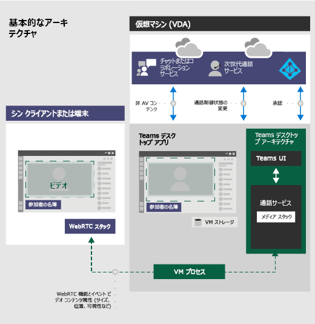

# <a name="teams-for-virtualized-desktop-infrastructure"></a>仮想デスクトップ インフラストラクチャ用の Teams

この記事では、仮想化された環境で Microsoft Teams を使用する場合の要件と制限について説明します。

## <a name="what-is-vdi"></a>VDI とは

仮想デスクトップインフラストラクチャ (VDI) は、デスクトップオペレーティングシステムと、データセンターの中央サーバー上のアプリケーションをホストする仮想化テクノロジです。 これにより、完全にセキュリティが設定された一元的な中央集中ソースを持つユーザーに、完全にカスタマイズされたデスクトップエクスペリエンスを提供できます。
 
仮想環境での Microsoft Teams はチャットと共同作業をサポートしており、Citrix プラットフォームでは、通話と会議機能もサポートされています。

仮想環境の Teams では、複数の構成がサポートされます。 これには、VDI、専用、共有、常設、非永続的モードが含まれます。 機能は継続的な開発中であり、定期的に追加されており、今後数ヶ月にわたって機能が拡張されます。
 
仮想環境で Teams を使用する場合は、仮想化されていない環境での Teams の使用とは多少異なる場合があります。 たとえば、一部の高度な機能は仮想化された環境では使用できず、ビデオ解像度が異なる場合があります。 最適なユーザーエクスペリエンスを実現するには、この記事のガイダンスに従ってください。

## <a name="teams-on-vdi-components"></a>VDI コンポーネントの Teams

仮想環境で Teams を使用するには、次のコンポーネントが必要です。

- **仮想ブローカー**: Azure などの仮想化プロバイダーへのリソースと接続マネージャー
- **仮想デスクトップ**: Microsoft Teams を実行する仮想マシン (VM) スタック
- **シンクライアント**: ユーザーが物理的にインターフェイスを使用するエンドポイント
- **Teams デスクトップアプリ**: これは teams デスクトップクライアントアプリです

## <a name="teams-on-vdi-requirements"></a>VDI の要件に関するチーム

### <a name="virtualization-provider-requirements"></a>仮想化プロバイダーの要件

Teams デスクトップアプリは、主要な仮想化ソリューションプロバイダーと共に検証されました。 市場プロバイダーが複数ある場合は、最小要件が満たされるように仮想化ソリューションプロバイダーに問い合わせることをお勧めします。
  
現時点では、音声/ビデオ (AV) 最適化による VDI 上の Teams は、Citrix で認定されています。 このセクションの情報を確認して、Citrix と Teams の両方の要件が適切に機能するようになっていることを確認します。

### <a name="partners-certified-for-teams"></a>チームの認定パートナー

次のパートナーには、Teams の仮想デスクトップインフラストラクチャソリューションがあります。

|パートナー|パートナーソリューション|
|----|---|
|| <a href="https://www.citrix.com/products/citrix-virtual-apps-and-desktops/" target="_blank">Citrix の仮想アプリとデスクトップ</a> |

### <a name="citrix-virtual-apps-and-desktops-requirements"></a>Citrix の仮想アプリとデスクトップの要件

Citrix の仮想アプリとデスクトップ (以前は XenApp と XenDesktop) は、VDI 上の Teams で AV の最適化を実現します。 Citrix の仮想アプリとデスクトップを使用すると、VDI 上の Teams では、チャットや共同作業に加えて、通話と会議機能がサポートされます。

[このページで](https://www.citrix.com/downloads/citrix-virtual-apps-and-desktops/)は、Citrix の仮想アプリとデスクトップの最新バージョンをダウンロードできます。 (最初にサインインする必要があります。)必要なコンポーネントは、既定で[Citrix Workspace アプリ (CWA)](https://www.citrix.com/downloads/workspace-app/)と仮想配信エージェント (VDA) にまとめられています。 CWA または VDA に追加のコンポーネントまたはプラグインをインストールする必要はありません。

最新のサーバーとクライアントの要件については、[この Citrix の web サイト](https://docs.citrix.com/en-us/citrix-virtual-apps-desktops/multimedia/opt-ms-teams.html)を参照してください。

## <a name="install-or-update-the-teams-desktop-app-on-vdi"></a>VDI で Teams デスクトップアプリをインストールまたは更新する

MSI パッケージを使用してコンピューターごとのインストールまたはユーザーごとのインストールを使用して、VDI 用の Teams デスクトップアプリを展開することができます。 使用する方法を決定するのは、永続的なセットアップと非永続的な設定のどちらを使用するか、または組織に関連する機能のニーズによって異なります。
専用の永続的なセットアップの場合、どちらのアプローチも機能します。  ただし、非永続的なセットアップでは、チームが効率的に作業するために、コンピューターごとにインストールする必要があります。 「[非永続的なセットアップ](#non-persistent-setup)」セクションを参照してください。

コンピューター単位のインストールでは、自動更新が無効になっています。 つまり、Teams アプリを更新するには、現在のバージョンをアンインストールして、新しいバージョンに更新する必要があります。 ユーザーごとのインストールでは、自動更新が有効になっています。 ほとんどの VDI の展開では、コンピューターごとのインストールを使用してチームを展開することをお勧めします。

最新のチームバージョンに更新するには、まずアンインストール手順を実行し、次に最新のチームバージョン展開を実行します。

VDI 環境での Teams の AV 最適化を適切に機能させるには、シンクライアントエンドポイントがインターネットにアクセスできる必要があります。 インターネットアクセスがシンクライアントエンドポイントで利用できない場合、最適化の起動は成功しません。 これは、ユーザーが最適化されていないメディアの状態であることを意味します。

#### <a name="dedicated-persistent-setup"></a>専用の永続的なセットアップ

専用の永続的なセットアップでは、ユーザーのローカルオペレーティングシステムに対する変更は、ユーザーがログオフした後も保持されます。  永続的なセットアップの場合、Teams はユーザーごととコンピューターごとの両方のインストールをサポートします。

推奨される最小の VM 構成は次のとおりです。

|パラメーター  |ワークステーションオペレーティングシステム  |サーバー操作システム  |
|---------|---------|---------|
|vCPU   |    2コア     |  4、6、または8<br>基になる non-uniform memory access (NUMA) 構成を理解し、それに応じて Vm を構成することが重要です。     |
|RAM     |   4 GB      | 512 ~ 1024 MB (ユーザーあたり)        |
|ストレージ    | 8 GB        | 40 ~ 60 GB        |

#### <a name="non-persistent-setup"></a>非永続的なセットアップ

非永続的なセットアップでは、ユーザーのローカルオペレーティングシステムによる変更は、ユーザーがログオフした後も保持されません。 このようなセットアップは、一般的に共有されているマルチユーザーセッションです。 VM 構成は、ユーザー数と利用可能な物理ボックスリソースによって異なります。

非永続的なセットアップの場合、Teams デスクトップアプリはコンピューターごとにゴールデンイメージにインストールする必要があります。 詳細については、「 [VDI 上の Teams デスクトップアプリをインストールまたは更新](#install-or-update-the-teams-desktop-app-on-vdi)する」セクションを参照してください。 これにより、ユーザーセッション中に Teams アプリを効率的に起動することができます。 非永続的なセットアップで Teams を使用する場合も、効率的な Teams のランタイムデータ同期のためのプロファイルキャッシュマネージャーが必要です。これにより、適切なユーザー固有の情報 (ユーザーデータ、プロファイル、設定など) がユーザーセッション中にキャッシュされます。  さまざまなキャッシュマネージャーソリューションを利用できます。 たとえば、 [Fslogix](https://docs.microsoft.com/fslogix/overview)となります。 特定の構成手順については、キャッシュマネージャープロバイダーにお問い合わせください。

##### <a name="teams-cached-content-exclusion-list-for-non-persistent-setup"></a>非永続的なセットアップ用の Teams キャッシュされたコンテンツ除外リスト

[Teams のキャッシュ] フォルダーから次のものを除外します。% appdata%/チーム/teams  これらのヘルプを除外すると、ユーザーのキャッシュサイズが小さくなり、非永続的なセットアップがさらに最適化されます。

- .txt ファイル
- メディアスタックフォルダー

### <a name="office-365-proplus-considerations"></a>Office 365 ProPlus の考慮事項

Office 365 ProPlus で VDI に Teams を展開する場合は、次の点を考慮してください。

#### <a name="new-deployments-of-teams-through-office-365-proplus"></a>Office 365 ProPlus を通じた Teams の新しい展開

Office 365 ProPlus を通じてチームを展開する前に、コンピューターごとのインストールを使用して展開された既存の Teams アプリをアンインストールする必要があります。

Office 365 ProPlus を通じた Teams は、ユーザーごとにインストールされます。 詳細については、「 [VDI 上の Teams デスクトップアプリをインストールまたは更新](#install-or-update-the-teams-desktop-app-on-vdi)する」セクションを参照してください。

#### <a name="teams-deployments-through-office-365-proplus-updates"></a>Office 365 ProPlus の更新プログラムを通じた Teams の展開

Teams は、Office 365 ProPlus の既存のインストールにも追加されています。 Office 365 ProPlus はユーザーごとにチームをインストールするため、「 [VDI 上の teams デスクトップアプリをインストールまたは更新](#install-or-update-the-teams-desktop-app-on-vdi)する」セクションを参照してください。

#### <a name="using-teams-with-per-machine-installation-and-office-365-proplus"></a>コンピューターごとのインストールと Office 365 ProPlus で Teams を使用する

Office 365 ProPlus では、各コンピューターの Teams のインストールをサポートしていません。 コンピューターごとのインストールを使用するには、Office 365 ProPlus から Teams を除外する必要があります。 「 [Teams デスクトップアプリを VM に展開](#deploy-the-teams-desktop-app-to-the-vm)する」と「 [Office 365 ProPlus セクションを通じてチームの展開を除外する方法](#how-to-exclude-teams-deployment-through-office-365-proplus)」を参照してください。

#### <a name="how-to-exclude-teams-deployment-through-office-365-proplus"></a>Office 365 ProPlus を通じてチームの展開を除外する方法

Teams と Office 365 ProPlus の詳細については、「 [office 365 ProPlus の新しいインストールからチームを除外する](https://docs.microsoft.com/DeployOffice/teams-install#how-to-exclude-microsoft-teams-from-new-installations-of-office-365-proplus)」および「[グループポリシーを使って teams のインストールを制御](https://docs.microsoft.com/DeployOffice/teams-install#use-group-policy-to-control-the-installation-of-microsoft-teams)する」を参照してください。

### <a name="deploy-the-teams-desktop-app-to-the-vm"></a>Teams デスクトップアプリを VM に展開する

1. 次のリンクのいずれかを使用して、VDI VM オペレーティングシステムと一致する Teams MSI パッケージをダウンロードします。

    - [32ビット版](https://statics.teams.cdn.office.net/production-windows/1.2.00.32462/Teams_windows.msi)
    - [64ビット版](https://statics.teams.cdn.office.net/production-windows-x64/1.2.00.32462/Teams_windows_x64.msi)

    必要な Teams デスクトップアプリの最小バージョンはバージョン1.2.00.31357 です。 (PSTN 保留は以前のバージョンではサポートされていません)。

2. 次のいずれかのコマンドを実行して、MSI を VDI VM にインストールします。

    - ユーザーごとのインストール (既定)
  
        ```
        msiexec /i <path_to_msi> /l*v <install_logfile_name>
        ```
    
        これは既定のインストールです。チームは、% AppData% ユーザーフォルダーにインストールされます。 この時点で、ゴールデンイメージのセットアップが完了しています。 ユーザー単位のインストールでは、非永続的なセットアップでは、チームは適切に動作しません。
    
    - マシン単位のインストール

        ```
        msiexec /i <path_to_msi> /l*v <install_logfile_name> ALLUSER=1
        ```

        これにより、チームは64ビットオペレーティングシステムの Program Files (x86) フォルダーと、32ビットオペレーティングシステムの Program Files フォルダーにインストールされます。 この時点で、ゴールデンイメージのセットアップが完了しています。 非永続的なセットアップでは、コンピューターごとにチームをインストールする必要があります。
 
        次の対話型ログオンセッションでは、チームが起動し、資格情報を求められます。

3. VDI VM から MSI をアンインストールします。 

    Teams をアンインストールするには、次の2つの方法があります。  
  
    - PowerShell スクリプト (推奨): この[PowerShell スクリプト](scripts/powershell-script-teams-deployment-clean-up.md)を使用して、ターゲットコンピューターまたはユーザーからチームをクリーンアップできます。 ターゲットコンピューター上のすべてのユーザーに対して実行する必要があります。 
    
    - コマンドライン: この方法ではチームが削除されますが、Teams の再インストールはできません。 次のコマンドを実行します。
  
      ```
      msiexec /passive /x <path_to_msi> /l*v <uninstall_logfile_name>
      ```
      これにより、オペレーティングシステムの環境に応じて、Program Files (x86) フォルダーまたは Program Files フォルダーから Teams がアンインストールされます。

## <a name="teams-on-vdi-performance-considerations"></a>VDI のパフォーマンスに関する考慮事項

さまざまな仮想化設定構成があり、それぞれが最適化のために異なるフォーカスが設定されています。 たとえば、ユーザーの密度。 計画するときは、組織の作業負荷のニーズに合わせて、次の点を考慮してセットアップを最適化します。

- 最小要件: 一部のワークロードでは、最小要件を超えるリソースを使用してセットアップを行う必要があります。 たとえば、より多くのコンピューティングリソースを必要とするアプリケーションを使用している開発者向けのワークロード。
- 依存関係: チームデスクトップアプリ以外のインフラストラクチャ、作業負荷、その他の環境配慮への依存関係が含まれます。
- VDI で無効になっている機能: Teams では、VDI による負荷の高い機能を無効にします。これにより、一時的な CPU 使用率の向上に役立ちます。 次の機能は無効になります。
    - Teams CSS アニメーション
    - Giphy 自動開始

## <a name="teams-on-vdi-with-calling-and-meetings"></a>通話と会議を使った VDI 上の Teams

チャットと共同作業に加えて、通話と会議のサポートを備えた VDI の Teams は、Citrix ベースのプラットフォームで利用できます。 サポートされている機能は、WebRTC メディアスタックと Citrix 固有の実装に基づいています。 次の図は、アーキテクチャの概要を示しています。



以下の通話および会議機能はサポートされていません。

- 緊急電話サービスの強化
- Teams アプリとデバイス間の HID ボタンと LED コントロール
- 背景のぼかしと効果
- ブロードキャスト/ライブイベント
- 位置情報に基づくルーティング (LBR)
- コール パーク
- 通話キュー

> [!IMPORTANT]
> 現在、AV を最適化せずに team を VDI で実行していて、最適化のためにまだサポートされていない機能を使用している場合 (アプリの共有時に制御を許可する場合など)、[Teams] ポリシーを設定して Teams のリダイレクションを無効にする必要があります。 これは、Teams メディアセッションが最適化されないことを意味します。 Teams のリダイレクションを無効にするポリシーを設定する手順については、この[Citrix の web サイト](https://docs.citrix.com/en-us/citrix-virtual-apps-desktops/policies/reference/ica-policy-settings/multimedia-policy-settings.html)を参照してください。

現時点では、VDI 以外の環境でのみ利用可能な通話と会議機能の追加に取り組んでいます。 これには、品質、追加の画面共有シナリオ、チームに最近追加された高度な機能など、より多くの管理者の制御が含まれる場合があります。 今後の機能の詳細については、チームの担当者にお問い合わせください。

### <a name="network-requirements"></a>ネットワーク要件

クラウドの全体的な音声とビデオの展開に影響を与える可能性のあるリスクと要件を特定するために、環境を評価することをお勧めします。 [Skype For Business ネットワーク評価ツール](https://www.microsoft.com/download/details.aspx?id=53885)を使用して、自分のネットワークが Teams に対応しているかどうかをテストします。

Teams のネットワークを準備する方法について詳しくは、「 [teams 用に組織のネットワークを準備](prepare-network.md)する」をご覧ください。

### <a name="migrate-from-skype-for-business-on-vdi-to-teams-on-vdi"></a>Vdi での Skype for Business から VDI 上の Teams への移行

Vdi での Skype for Business から VDI 上の Teams への移行を行っている場合、2つのアプリケーションの違いに加えて、VDI も実装するといくつかの違いがあります。 Skype for Business VDI で現在サポートされていない Teams VDI の機能には、次のような機能があります。

- メディアのビットレートを制限するためのポリシーを使った VDI 通話エクスペリエンスの制御
- VDI の一部の AV 機能を無効にするプラットフォームごとのポリシー
- アプリ共有を行うときの制御
- 音声なしのチャットからの画面共有
- 同時にビデオと画面共有の送受信を行うことができる

### <a name="teams-on-chrome-browser-versus-teams-desktop-app-for-vdi"></a>Chrome ブラウザーと VDI 用 Teams デスクトップアプリのチーム

Chrome ブラウザーの teams では、AV の最適化を備えた VDI 用の Teams デスクトップアプリに代わる機能は提供されていません。 チャットと共同作業のエクスペリエンスは期待どおりに動作します。 メディアが必要な場合は、Chrome ブラウザーでユーザーの期待を満たせない場合があります。

- オーディオとビデオのストリーミングのエクスペリエンスが最適でないことがあります。 ユーザーには、遅延または品質の低下が発生する可能性があります。
- [デバイスの設定] は [ブラウザーの設定] では利用できません。
- デバイス管理はブラウザーで処理され、ブラウザーの [サイトの設定] では複数の設定が必要です。
- デバイスの設定は、Windows デバイス管理でも設定する必要があります。

## <a name="teams-on-vdi-with-chat-and-collaboration"></a>チャットと共同作業による VDI on Teams

組織で Teams のチャット機能と共同作業機能のみを使用する場合は、ユーザーレベルのポリシーを設定して、Teams の呼び出しと会議の機能を無効にすることができます。 この機能レベルでは、Citrix 仮想アプリとデスクトップは必要ありません。

### <a name="set-policies-to-turn-off-calling-and-meeting-functionality"></a>通話と会議の機能を無効にするポリシーを設定する

ポリシーを設定するには、Microsoft Teams 管理センターまたは PowerShell を使用します。 ポリシーの変更が反映されるまでには、多少時間がかかることがあります。 特定のアカウントの変更がすぐに表示されない場合は、数時間後にもう一度お試しください。

[**通話ポリシー**](teams-calling-policy.md): Teams には組み込みの DisallowCalling 通話ポリシーが含まれており、すべての通話機能がオフになっています。 仮想化された環境で Teams を使用する組織内のすべてのユーザーに DisallowCalling ポリシーを割り当てます。

[**会議ポリシー**](meeting-policies-in-teams.md): Teams には、すべての会議機能がオフになっている組み込みの "いいね!" の会議ポリシーが含まれています。 仮想化された環境で Teams を使用する組織内のすべてのユーザーに対して、割り当てられた Ff ポリシーを割り当てます。

#### <a name="assign-policies-using-the-microsoft-teams-admin-center"></a>Microsoft Teams 管理センターを使用してポリシーを割り当てる

DisallowCalling の通話ポリシーと、割り当てられているユーザーに割り当てることができる会議ポリシーを割り当てるには、次の手順を実行します。

1. Microsoft Teams 管理センターの左のナビゲーションで、[**ユーザー**] に移動します。
2. ユーザー名の左側をクリックしてユーザーを選び、[**設定の編集**] をクリックします。
3. 次の手順を実行します。
    1.  [**通話ポリシー**] で [ **DisallowCalling**] をクリックします。
    2.  [**会議のポリシー**] で、[割り当てる]**をクリックし**ます。
4. [**適用**] をクリックします。

一度に複数のユーザーにポリシーを割り当てるには、「[チームのユーザー設定を一括](edit-user-settings-in-bulk.md)して編集する」を参照してください。

または、次の操作も行うことができます。

1. Microsoft Teams 管理センターの左のナビゲーションで、割り当てるポリシーに移動します。 次に例を示します。
    - [**音声** > **通話のポリシー**] に移動し、[ **DisallowCalling**] をクリックします。
    - [**会議** > の**ポリシー**] に移動して、[割り当てる**ff**] をクリックします。
3. [**ユーザーの管理**] を選びます。
4. [**ユーザーの管理**] ウィンドウで、[表示名] または [ユーザー名] でユーザーを検索し、名前を選択して [**追加**] をクリックします。 追加するユーザーごとに、この手順を繰り返します。
5. ユーザーの追加が完了したら、[**保存**] をクリックします。

#### <a name="assign-policies-using-powershell"></a>PowerShell を使用してポリシーを割り当てる

次の例は、 [Grant-CsteamDisallowCalling のポリシー](https://docs.microsoft.com/powershell/module/skype/grant-csteamscallingpolicy)を使って、ユーザーにの呼び出しポリシーを割り当てる方法を示しています。

```
Grant-CsTeamsCallingPolicy -PolicyName DisallowCalling -Identity “user email id”
```

PowerShell を使用して通話ポリシーを管理する方法の詳細については、「 [Set-Csteam拡張性のポリシー](https://docs.microsoft.com/powershell/module/skype/set-csteamscallingpolicy)」をご覧ください。

次の例は、CsTeamsMeetingPolicy を使用して、[グラント](https://docs.microsoft.com/powershell/module/skype/grant-csteamsmeetingpolicy)ff 会議ポリシーをユーザーに割り当てる方法を示しています。

```
Grant-CsTeamsMeetingPolicy -PolicyName AllOff -Identity “user email id”
```

PowerShell を使用して会議のポリシーを管理する方法の詳細については、「 [Set-CsTeamsMeetingPolicy](https://docs.microsoft.com/powershell/module/skype/set-csteamsmeetingpolicy)」を参照してください。

## <a name="migrate-teams-on-vdi-with-chat-and-collaboration-to-citrix-with-calling-and-meetings"></a>通話と会議を使って、VDI 上のチームをチャットとコラボレーションで Citrix に移行する

ユーザーレベルのポリシーを設定して、通話と会議機能を無効にしている場合に、チャットと共同作業を行っている VDI 上の Teams の既存の実装がある場合、AV 最適化を有効にして Citrix に移行するには、ポリシーを設定する必要があります。VDI ユーザー向けのチームの会議機能。

### <a name="set-policies-to-turn-on-calling-and-meeting-functionality"></a>通話と会議の機能を有効にするポリシーを設定する

Microsoft Teams 管理センターまたは PowerShell を使用して、通話と会議のポリシーを設定し、ユーザーに割り当てることができます。 ポリシーの変更が反映されるまでには、多少時間がかかることがあります。 特定のアカウントの変更がすぐに表示されない場合は、数時間後にもう一度お試しください。

[**通話**](teams-calling-policy.md)ポリシー: Teams の通話ポリシーは、ユーザーが使用できる通話機能を制御します。 Teams には、組み込みの AllowCalling 通話ポリシーが含まれており、すべての通話機能が有効になっています。 すべての通話機能を有効にするには、AllowCalling ポリシーを割り当てます。 または、カスタム通話ポリシーを作成して、必要な通話機能を有効にし、ユーザーに割り当てます。 

[**会議ポリシー**](meeting-policies-in-teams.md): Teams の会議ポリシーは、ユーザーが作成できる会議の種類と、組織内のユーザーによってスケジュールされている会議の参加者が使用できる機能を制御します。 Teams には、すべての会議機能が有効になっている組み込みのすべての会議のポリシーが含まれています。 すべての会議機能を有効にするには、[すべて] のポリシーを割り当てます。 または、カスタム会議ポリシーを作成して、必要な会議機能を有効にし、ユーザーに割り当てることができます。

#### <a name="assign-policies-using-the-microsoft-teams-admin-center"></a>Microsoft Teams 管理センターを使用してポリシーを割り当てる

AllowCalling の通話ポリシーと [すべての会議] ポリシーをユーザーに割り当てるには、次の手順を実行します。

1. Microsoft Teams 管理センターの左のナビゲーションで、[**ユーザー**] に移動します。
2. ユーザー名の左側をクリックしてユーザーを選び、[**設定の編集**] をクリックします。
3. 次の手順を実行します。
    1.  [**通話ポリシー**] で [ **allowcalling**] をクリックします。
    2.  [**会議のポリシー**] で [**すべて**] をクリックします。
4. [**適用**] をクリックします。

一度に複数のユーザーにポリシーを割り当てるには、「[チームのユーザー設定を一括](edit-user-settings-in-bulk.md)して編集する」を参照してください。

または、次の操作も行うことができます。

1. Microsoft Teams 管理センターの左のナビゲーションで、割り当てるポリシーに移動します。 次に例を示します。
    - [**音声** > **通話のポリシー**] に移動し、[ **allowcalling**] をクリックします。
    - [**会議** > の**ポリシー**] に移動し、[**すべて**] をクリックします。
3. [**ユーザーの管理**] を選びます。
4. [**ユーザーの管理**] ウィンドウで、[表示名] または [ユーザー名] でユーザーを検索し、名前を選択して [**追加**] をクリックします。 追加するユーザーごとに、この手順を繰り返します。
5. ユーザーの追加が完了したら、[**保存**] をクリックします。

#### <a name="assign-policies-using-powershell"></a>PowerShell を使用してポリシーを割り当てる

次の例は、 [Grant-Csteam分解のポリシー](https://docs.microsoft.com/powershell/module/skype/grant-csteamscallingpolicy)を使って、allowcalling 呼び出しポリシーをユーザーに割り当てる方法を示しています。

```
Grant-CsTeamsCallingPolicy -PolicyName AllowCalling -Identity “user email id”
```

PowerShell を使用して通話ポリシーを管理する方法の詳細については、「 [Set-Csteam拡張性のポリシー](https://docs.microsoft.com/powershell/module/skype/set-csteamscallingpolicy)」をご覧ください。

次の例は、 [CsTeamsMeetingPolicy](https://docs.microsoft.com/powershell/module/skype/grant-csteamsmeetingpolicy)を使用して、すべての会議ポリシーをユーザーに割り当てる方法を示しています。

```
Grant-CsTeamsMeetingPolicy -PolicyName AllOn -Identity “user email id”
```

PowerShell を使用して会議のポリシーを管理する方法の詳細については、「 [Set-CsTeamsMeetingPolicy](https://docs.microsoft.com/powershell/module/skype/set-csteamsmeetingpolicy)」を参照してください。

## <a name="known-issues-and-limitations"></a>既知の問題と制限事項

### <a name="client-deployment-installation-and-setup"></a>クライアントの展開、インストール、セットアップ

- コンピューターごとにインストールする場合、vdi の Teams は非 VDI Teams クライアントとして自動的に更新されることはありません。 「 [VDI 上の Teams デスクトップアプリをインストールまたは更新](#install-or-update-the-teams-desktop-app-on-vdi)する」セクションで説明されているように、新しい MSI をインストールして VM イメージを更新する必要があります。 最新バージョンに更新するには、現在のバージョンをアンインストールする必要があります。
- チームは、ユーザーごとまたはコンピューターごとに展開する必要があります。 同時ユーザー数とコンピューター単位のチームの展開はサポートされません。  コンピューターごとまたはユーザーごとに、これらのモードのいずれかに移行するには、アンインストール手順に従い、どちらかのモードに再展開します。
- 現時点では、MacOs および Linux ベースのクライアントは Citrix でサポートされていません。
- Citrix は、エンドポイントで定義された明示的な HTTP プロキシの使用をサポートしていません。 

### <a name="calling-and-meetings"></a>通話と会議

- Skype for Business の相互運用性は音声通話に限定され、ビデオ表示には使用できません。
- デュアルトーンマルチ周波数 (DTMF) テレフォニーシステムとの相互操作は、現在サポートされていません。
- 匿名ユーザーとして Teams 会議に参加することは、AV-最適化されていません。 ユーザーは会議に参加し、最適化されていない操作を行うことができます。
- 会議またはグループ通話でサポートされているビデオストリームは1つだけです。 複数のユーザーがビデオを送信する場合、常に表示されている主要なスピーカーのビデオのみが表示されます。  
- 着信と発信のビデオストリームの解像度は720p の解像度に制限されています。 これは WebRTC の制限です。
- 着信カメラまたは画面共有ストリームのビデオストリームは1つだけです。 受信画面共有が表示されている場合は、その画面共有が、優先スピーカーのビデオではなく、画面上に表示されます。
- 送信画面の共有:
    - アプリケーション共有はサポートされていません。
- コントロールを用意して制御します。  
    - 画面共有またはアプリケーション共有セッション中はサポートされません。
    - PowerPoint 共有セッション中にサポートされます。  
- CWA での高 DPI スケーリングはサポートされていません。

VDI に関連していない Teams の既知の問題については、「 [teams の既知の問題](Known-issues.md)」を参照してください。

## <a name="troubleshooting"></a>トラブルシューティング

#### <a name="troubleshoot-citrix-components"></a>Citrix コンポーネントのトラブルシューティング

VDA と CWA の問題を解決する方法については、[この Citrix の web サイト](https://docs.citrix.com/en-us/citrix-virtual-apps-desktops/multimedia/opt-ms-teams.html)を参照してください。

## <a name="related-topics"></a>関連項目

- [MSI を使用して Microsoft Teams をインストールする](msi-deployment.md)
- [Teams での PowerShell の概要](teams-powershell-overview.md)
