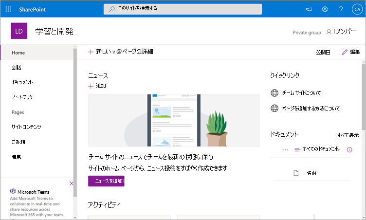

# Microsoft Viva Learning のインストール、管理、アクセス許可の割り当て (プライベート プレビュー)

*この記事には、プライベート プレビューの Microsoft Viva Learning の暫定コンテンツが含まれている。*

Microsoft Viva Learning (プライベート プレビュー) を使用すると、組織内のチームや個人が一日の中で自然に学習することができます。 このアプリでは、Teams の中央ハブが作成され、従業員は組織全体のコンテンツ ライブラリを共有、割り当て、学習できます。

管理者は、権限を設定し、Viva Learning (プライベート プレビュー) の学習コンテンツ ソースを許可します。 学習コンテンツには、LinkedIn ラーニング、Microsoft Learn、Microsoft 365 のトレーニング、SharePoint Online に保存されている組織独自のコンテンツ、およびVv viva Learning (プライベート プレビュー) でサポートされているサードパーティ プロバイダーが含まれます。

## 管理者ロール

Viva Learning (プライベート プレビュー) を設定するには、次のアクセス許可が必要です。

- Microsoft Teams 管理者
- Microsoft 365 グローバル管理者または SharePoint 管理者
- ナレッジ管理者 : これは、組織内のすべてのユーザーに割り当て可能な、Microsoft 365 管理センターの新しい役割です。 この役割は、Microsoft 365 管理センターを通じて組織の学習コンテンツ ソースを管理します。 

> [!TIP]
> 知識管理者は、中程度の技術的な知識を持ち、既存の SharePoint 管理者の資格情報を持っている必要があります。できれば、組織の教育、学習、トレーニング、または従業員の経験に精通しているユーザーが必要です。
 
## Teams 管理センターで Viva Learning (プライベート プレビュー) を管理する

Teams 管理者はアプリ ストアから Viva Learning (プライベート プレビュー) をインストールし、Teams 管理センターからセットアップ、管理、アクセス許可のポリシーを適用します。

### Viva Learning の設定を管理する (プライベート プレビュー)

これらのタスクを実行するには、Teams 管理センターの管理者である必要があります。

Viva Learning の設定を管理するには、次の手順を実行します。

1. Teams 管理センターの左側のナビゲーションで、Teams アプリの **[アプリの管理]**  >  **に移動します**。

   ![Teams アプリと [アプリの管理] セクションが表示されている Teams 管理センターの左側のナビゲーション](media/learning-app-teams-manage-apps-nav.png)

2. [アプリ **の管理] ページ** の検索ボックスに、Teams ラーニング アプリを検索する学習を入力します (プライベート プレビュー)。 

   ![検索ボックスが表示されている Teams 管理センターの [アプリの管理] ページ](media/learning-app-teams-manage-apps-page.png)

3. [学習] **ページで、次の方法を実行** します。
   1. [ **状態]** で[ **許可] を選** び、アプリを有効にできます。
   2. [設定 **] タブ** の [ **アプリの設定** ] セクションで、Microsoft 365 管理センターに移動して、学習コンテンツ ソースを構成します。

   ![[状態] セクションと [アプリの設定] セクションが表示されている Teams 管理センターの [学習] ページ](media/learning-app-teams-learning-page.png)

4. アプリ **の設定を管理** した後、[アクセス許可とセットアップ ポリシー] に移動して、組織がプライベート プレビューに参加する一部としてアプリにアクセスできる必要がある従業員にアクセス許可を付与します。

> [!NOTE]
>  組織が Teams TAP100 プログラムの一部としてリング 4.0 を使用している場合は、次の操作を行って、リング 3.0 の承認済みユーザーが Viva Learning (プライベート プレビュー) にアクセスできる場合があります。

プライベート プレビューの一環として、Viva Learning (プライベート プレビュー) はリング 3.0 でリリースされます。 組織がリング 4.0 の場合、アプリはアプリ ストアに表示されます。 アプリをテストするには、カスタム アプリのアクセス許可ポリシーを作成し、それを[すべてのアプリを許可する] に設定して、承認されたユーザーをリング 3.0 に割り当てる必要があります。

   ![[すべてのアプリを許可する] が選択されている TAP-AppsPermission-Plcy ページ](media/learning-app-tap-appspermission-plcy.png)

## Microsoft 365 管理センターで学習コンテンツ ソースを構成する

Microsoft 365 管理センターの管理者は、自分自身で、または組織内の選択した個人に知識管理者の役割を割り当て、Viva Learning (プライベート プレビュー) に関連する設定を管理し、学習コンテンツ ソースを構成できます。

管理者は、その他の学習コンテンツ ソース (SharePoint、サポートされているサードパーティ コンテンツ プロバイダー ソースなど) を、Viva Learning (プライベート プレビュー) のユーザーが利用できるコンテンツ ソースを選択します。 次に、管理者は、コンテンツが検索と検出が可能であり、Viva Learning (プライベート プレビュー) を使用する従業員が参照できるよう、これらのソースを構成します。

> [!NOTE]
>  ユーザーは、ブラウザーまたは埋め込みビューアーで Microsoft および LinkedIn Learning Pro 以外の学習にサインインします。 この構成済みの学習には、組織と第三者の間の個別のライセンス、プライバシー、サービス条件が適用され、Viva Learning (プライベート プレビュー) の条項は適用されません。 この種類の学習を選択する前に、組織とユーザーに対して契約があることを確認します。

### 知識管理者の役割を割り当てる [オプション]

これらのタスクを実行するには、Microsoft 365 グローバル管理者である必要があります。

Viva Learning の知識管理者を割り当てるには、次の手順を実行します。

1.  Microsoft 365 管理センターの左側のナビゲーションで、[ロール] に移動 **します**。

2.  [ロール **] ページの** **[Azure** AD] タブで、[サポート技術情報の **管理者] を選択します**。
 
3.  [サポート **技術情報の管理**] ページの [割り当てられた管理者] セクションで、[追加] を選択し、役割に選択したユーザーを追加します。

### Viva Learning の学習コンテンツ ソースの設定を構成する (プライベート プレビュー)

これらのタスクを実行するには、Microsoft 365 グローバル管理者または知識管理者である必要があります。

Viva Learning で学習コンテンツ ソースの設定を構成するには、次の手順を実行します。

1.  Microsoft 365 管理センターの左側のナビゲーションで、[組織の設定 **] 設定に**  >  **移動します**。

2.  [組織の **設定] ページ** の [サービス **]** タブで、学習アプリ **(プレビュー) を選択します**。

     ![学習アプリが表示されている Microsoft 365 管理センターの [設定] ページ](media/learning-sharepoint-configure1.png)

3.  学習アプリ **(プレビュー)** パネルで、組織用に構成する学習コンテンツ ソースを選択し、[保存] を選択 **します**。

     ![コンテンツ ソースのオプションを表示する Microsoft 365 管理センターの [学習] パネル](media/learning-sharepoint-configure2.png)

存在するすべての学習ソースの中には、既定で有効になっているものがあります。 これには次のものが含まれます。

- LinkedIn ラーニング (無料コンテンツ)
- Microsoft Learn
- Microsoft 365 トレーニング

> [!NOTE]
> 組織に LinkedIn ラーニング標準または Pro サブスクリプションがある場合、組織内の従業員のコンテンツ リポジトリのロックが解除されます。 アクセス許可を持つ従業員だけがコンテンツ リポジトリ全体を使用できます。  その他のソースは、手動で有効または構成する必要がある場合があります。 Microsoft から提供されていない学習資料のライセンスは、お客様の組織と第三者の間で別途ライセンスされます。 ユーザーの学習にサインアップしたユーザーを確認する必要があります。

学習コンテンツ ソースを有効または無効にするには、ソースの横にあるチェック ボックスをオンにします。 ソースが有効な場合は、チェック マークが表示されます。

## 学習コンテンツ ソースとして SharePoint を構成する

組織独自のコンテンツを Viva Learning (プライベート プレビュー) で利用できるよう、SharePoint を学習コンテンツ ソースとして構成できます。

### 概要

ナレッジ管理者 (またはグローバル管理者) は、ラーニング サービスが構造化された SharePoint リストの形式で空の一元管理された場所 (ラーニング アプリ コンテンツ リポジトリ) を作成できるサイト URL を提供します。 このリストは、組織が学習コンテンツを含む会社間の SharePoint フォルダーへのリンクを格納するために使用できます。 管理者は、フォルダーの URL リストを収集し、管理する必要があります。 これらのフォルダーには、Viva Learning (プライベート プレビュー) で利用できるコンテンツのみを含める必要があります。

Viva Learning (プライベート プレビュー) では、次のドキュメントの種類がサポートされています。

- Word、PowerPoint、Excel、PDF
- オーディオ (.m4a)
- ビデオ (.mov、.mp4、.avi)

詳細については [、SharePoint Online のドキュメントを参照してください](https://docs.microsoft.com/sharepoint/introductionlink)。 

### アクセス許可

ドキュメント ライブラリ フォルダーの URL は、組織内の任意の SharePoint サイトから収集できます。 Viva Learning (プライベート プレビュー) は、既存のすべてのコンテンツのアクセス許可に従います。 そのため、ユーザーがアクセス許可を持っているコンテンツだけが、Viva Learning (プライベート プレビュー) 内で検索および表示できます。 これらのフォルダー内のコンテンツは検索できますが、使用できるのは、個々の従業員がアクセス許可を持っているコンテンツのみです。

現在、組織のリポジトリからのコンテンツの削除はサポートされていません。

意図せず表示されたコンテンツを削除するには、次の手順を実行します。

1.  ドキュメント ライブラリへのアクセスを制限するには、[アクションの表示] **オプションを** 選択し、[アクセスの管理] **を選択します**。
     
     ![SharePoint のドキュメント ライブラリ ページに、[アクセスの管理] が表示された [アクションの表示] オプションが表示されています。](media/learning-sharepoint-permissions2.png)

2.  ドキュメント ライブラリ内の元のドキュメントを削除します。

詳細については、「SharePoint モダン エクスペリエンスでの共有とアクセス許可」 [を参照してください](https://docs.microsoft.com/sharepoint/modern-experience-sharing-permissions)。 

### ラーニング サービス

ラーニング サービスは、提供されたフォルダー URL を使用して、これらのフォルダーに保存されているすべてのコンテンツからメタデータを取得します。 一元管理されたリポジトリにフォルダー URL を指定すると、従業員は 24 時間以内に、Viva Learning (プライベート プレビュー) 内で組織のコンテンツを検索して使用できます。 更新されたメタデータやアクセス許可を含む、コンテンツに対する変更はすべて、24 時間以内にラーニング サービスにも適用されます。

### SharePoint をソースとして構成する

これらのタスクを実行するには、Microsoft 365 グローバル管理者、SharePoint 管理者、または知識管理者である必要があります。

Viva Learning (プライベート プレビュー) の学習コンテンツ ソースとして SharePoint を構成するには、次の手順を実行します。

1.  Microsoft 365 管理センターの左側のナビゲーションで、[組織の設定 **] 設定に**  >  **移動します**。
 
2.  [組織の **設定] ページ** の [サービス **]** タブで、学習アプリ **(プレビュー) を選択します**。

     ![一覧表示されたVv viva Learning を示す Microsoft 365 管理センターの [設定] ページ。](media/learning-sharepoint-configure1.png)

3.  ラーニング アプリ **(プレビュー)** パネルの **SharePoint** で、一元的なリポジトリを作成する SharePoint サイトのサイト URL を指定します。

     ![SharePoint が選択された状態の Microsoft 365 管理センターの [学習] パネル。](media/learning-sharepoint-configure2.png)

4.  SharePoint リストは、指定された SharePoint サイト内に自動的に作成されます。

     

     SharePoint サイトの左側のナビゲーションで、[サイト **コンテンツ学習** アプリ コンテンツ リポジトリ  >  **] を選択します**。 

     ![[サイト コンテンツ] ナビゲーションと [学習アプリ コンテンツ リポジトリ] セクションを示す SharePoint リスト。](media/learning-sharepoint-configure4.png) 

5. [ラーニング アプリ **コンテンツ リポジトリ] ページ** で、SharePoint リストに学習コンテンツ フォルダーの URL を入力します。

   1. [新規 **] を** 選び、[新しい **アイテム] パネルを表示** します。 

       ![[新規] オプションが表示された SharePoint の [ラーニング コンテンツ リポジトリ] ページ。](media/learning-sharepoint-configure5.png)
 
   2. [新 **しいアイテム]** パネルの [ **タイトル** ] フィールドで、選択したディレクトリ名を追加します。 [フォルダー **URL] フィールド** で、学習コンテンツ フォルダーに URL を追加します。 **[保存]** を選択します。

       ![SharePoint の [タイトル] フィールドと [フォルダー URL] フィールドを示す新しいアイテム パネル。](media/learning-sharepoint-configure6.png)

   3. [ **学習アプリ コンテンツ リポジトリ]** ページが更新され、新しい学習コンテンツが表示されます。

       ![更新された情報を表示する SharePoint の [ラーニング コンテンツ リポジトリ] ページ。](media/learning-sharepoint-configure7.png)

> [!NOTE]
> ラーニング アプリ コンテンツ リポジトリへのより広範なアクセスを可能にするために、リストへのリンクは、ユーザーがアクセスを要求し、最終的にリストを作成するのに役立つ、Viva Learning (プライベート プレビュー) インターフェイスで間もなく利用できます。 サイト所有者とグローバル管理者は、リストへのアクセス権を付与する必要があります。 Access はリストにのみ固有であり、リストが保存されているサイトには適用されません。

### フォルダー URL ドキュメント ライブラリのキュレーション

既定のメタデータ (変更日、作成者、ドキュメント名、コンテンツ タイプ、組織名など) は、Microsoft Graph API によって自動的に Viva Learning (プライベート プレビュー) に取り込まれます。
 
コンテンツの全体的な検出と検索の関連性を向上させるために、[説明] 列を追加 **することをお勧** めします。

ドキュメント ライブラリ ページに **[説明]** 列を追加するには、次の手順を実行します。

1.  [ドキュメント] **ページで、[** 列の追加] **を選択します**。

2. [アクションの **表示] オプションを** 選択し、[1 行 **テキスト] を選択します**。

     ![[1 行テキスト] が強調表示された [アクションの表示] オプションを示す SharePoint の [ドキュメント] ページ。](media/learning-sharepoint-curation1.png)

3. [列 **の作成] パネル** の [名前] **フィールドで** 、列のわかりやすい名前を追加します。 **[保存]** を選択します。

     ![SharePoint で列パネルを作成し、[名前] などのフィールドを表示します。](media/learning-sharepoint-curation2.png)
 
4. [ドキュメント **] ページの** [説明] **列** で、アイテムごとにユーザー設定の説明を追加します。 説明が提供されていない場合、Viva Learning (プライベート プレビュー) には、コンテンツを独自の SharePoint ライブラリからの内容として強調表示する既定のメッセージが表示されます。 

     ![SharePoint の [ドキュメント] ページには、[説明] 列の説明が表示されます。](media/learning-sharepoint-curation3.png)
 
