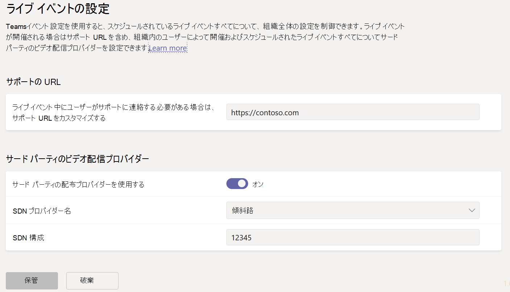
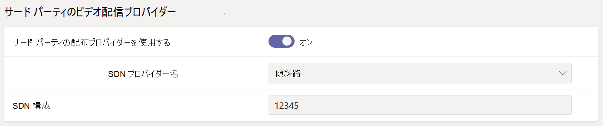

# <a name="configure-live-event-settings-in-microsoft-teams"></a>Microsoft Teams でライブ イベント設定を構成する

Teams のライブ イベント設定を使用して、組織で保持されているライブ イベントの設定を構成します。 サポート URL を設定して、サード パーティ製のビデオ配信プロバイダーを設定できます。 この設定は、組織で作成したすべてのライブ イベントに適用します。

Microsoft Teams 管理センターでこの設定を簡単にできます。 左側のナビゲーションで、[**会議**]  >  [**ライブ イベント設定**] に移動します。



## <a name="set-up-event-support-url"></a>イベントのサポート URL を設定する

この URL は、ライブ イベントの参加者に表示されます。 ライブ イベント中にサポートへの連絡方法を参加者に提供する組織のサポートの URL を追加します。

### <a name="using-the-microsoft-teams-admin-center"></a>Microsoft Teams 管理センターの使用

1. 左側のナビゲーションで、[**会議**]  >  [**ライブ イベント設定**] に移動します。
2. [**サポート URL**] で組織のサポート URL を入力します。

    

### <a name="using-windows-powershell"></a>Windows PowerShell の使用

次のコマンドを実行します。

```PowerShell
Set-CsTeamsMeetingBroadcastConfiguration -SupportURL “{your URL}”
```
詳細については、[CsTeamsMeetingBroadcastConfiguration](/powershell/module/skype/set-csteamsmeetingbroadcastconfiguration?view=skype-ps&preserve-view=true) を参照してください。
## <a name="configure-a-third-party-video-distribution-provider"></a>サード パーティ製のビデオ配信プロバイダーを設定する 

Microsoft ビデオ配信パートナーを通じてソフトウェア定義ネットワーク (SDN) ソリューションまたはエンタープライズ コンテンツ配信ネットワーク (eCDN) ソリューションを購入してセット アップした場合は、Teams でライブ イベント プロバイダーを構成します。 

### <a name="using-the-microsoft-teams-admin-center"></a>Microsoft Teams 管理センターの使用

1. 左側のナビゲーションで、[**会議**]  >  [**ライブ イベント設定**] に移動します。
2. [**サード パーティ製ビデオ配信プロバイダー**] で次を実行します。 

    

    - **サード パーティの配布プロバイダー** サード パーティのビデオ配信プロバイダーを有効にするには、これをオンにします。
    - **SDN プロバイダー名** お使いのプロバイダーを選択します。
    - **SDN 構成** SDN 構成の詳細を入力します。
        
### <a name="using-windows-powershell"></a>Windows PowerShell の使用
プロバイダーの連絡先からのライセンス ID または API トークンと API テンプレートを取得し、お使いのプロバイダーに合わせて次のいずれかを実行します。

**Hive** 
```PowerShell
Set-CsTeamsMeetingBroadcastConfiguration -AllowSdnProviderForBroadcastMeeting $True -SdnProviderName hive -SdnLicenseId {license ID GUID provided by Hive} -SdnApiTemplateUrl “{API template URL provided by Hive}”
```
**Kollective** 
```PowerShell
Set-CsTeamsMeetingBroadcastConfiguration -AllowSdnProviderForBroadcastMeeting $True -SdnProviderName kollective -SdnApiTemplateUrl "{API template URL provided by Kollective}" -SdnApiToken {API token GUID provided by Kollective}
```
**Riverbed** 
```PowerShell
Set-CsTeamsMeetingBroadcastConfiguration -AllowSdnProviderForBroadcastMeeting $True -SdnProviderName riverbed -SdnApiTemplateUrl "{API template URL provided by Riverbed}" -SdnApiToken {API token GUID provided by Riverbed}
```
**Ramp** 
```PowerShell
Set-CsTeamsMeetingBroadcastConfiguration -AllowSdnProviderForBroadcastMeeting $True -SdnProviderName ramp -SdnRuntimeConfiguration "{Configuration provided by RAMP}"
```
**Peer5**
```PowerShell
Set-CsTeamsMeetingBroadcastConfiguration -AllowSdnProviderForBroadcastMeeting $True -SdnProviderName peer5 -SdnLicenseId {peer5CustomerId}
```

詳細については、[CsTeamsMeetingBroadcastConfiguration](/powershell/module/skype/set-csteamsmeetingbroadcastconfiguration?view=skype-ps&preserve-view=true) を参照してください。

> [!NOTE]
> 外部アプリまたはデバイスを使用してライブ イベントを作成する場合は、[Microsoft Streamを使用して eCDN プロバイダーを構成](/stream/network-caching)する必要もあります。 

>[!Note]
> The change from using Microsoft Stream to [OneDrive for Business and SharePoint for meeting recordings](../tmr-meeting-recording-change.md) will be a phased approach. At launch you'll be able to opt-in to this experience, in November you'll have to opt-out if you want to continue using Stream, and some time in early 2021 we'll require all customers to use OneDrive for Business and SharePoint for new meeting recordings.

>[!Note]
> 選択した eCDN ソリューションは、選択したサード パーティ プロバイダーの利用規約とプライバシー ポリシーの対象となります。これにより、eCDN プロバイダーのソリューションの使用が制御されます。 eCDN プロバイダーのソリューションの使用は、Microsoft ボリューム ライセンス条項またはオンライン サービス条項の対象になりません。 サード パーティ プロバイダーの条項に同意しない場合は、Microsoft Teams で eCDN ソリューションを有効にしないでください。

### <a name="related-topics"></a>関連項目
- [Teams のライブ イベントについて](what-are-teams-live-events.md)
- [Teams のライブ イベントの計画](plan-for-teams-live-events.md)
- [Teams のライブ イベントをセットアップする](set-up-for-teams-live-events.md)
