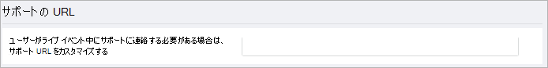
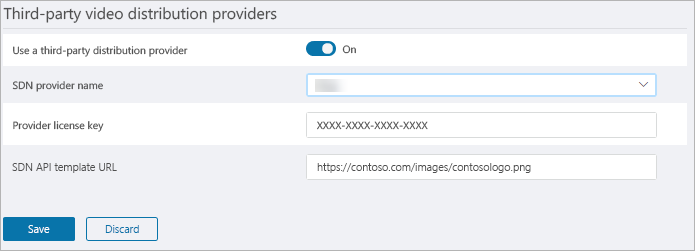

# <a name="configure-live-event-settings-in-microsoft-teams"></a><span data-ttu-id="465ce-103">Microsoft Teams でライブ イベント設定を構成する</span><span class="sxs-lookup"><span data-stu-id="465ce-103">Configure live event settings in Microsoft Teams</span></span>

<span data-ttu-id="465ce-104">Teams のライブ イベント設定を使用して、組織で保持されているライブ イベントの設定を構成します。</span><span class="sxs-lookup"><span data-stu-id="465ce-104">Use Teams live events settings to configure settings for live events that are held in your organization.</span></span> <span data-ttu-id="465ce-105">サポート URL を設定して、サード パーティ製のビデオ配信プロバイダーを設定できます。</span><span class="sxs-lookup"><span data-stu-id="465ce-105">You can set up a support URL and configure a third-party video distribution provider.</span></span> <span data-ttu-id="465ce-106">この設定は、組織で作成したすべてのライブ イベントに適用します。</span><span class="sxs-lookup"><span data-stu-id="465ce-106">These settings apply to all live events that are created in your organization.</span></span> 

<span data-ttu-id="465ce-107">Microsoft Teams 管理センターでこの設定を簡単にできます。</span><span class="sxs-lookup"><span data-stu-id="465ce-107">You can easily manage these settings in the Microsoft Teams admin center.</span></span> <span data-ttu-id="465ce-108">左側のナビゲーションで、[**会議**]  >  [**ライブ イベント設定**] に移動します。</span><span class="sxs-lookup"><span data-stu-id="465ce-108">In the left navigation, go to **Meetings** > **Live events settings**.</span></span> 

<span data-ttu-id="465ce-109"></span><span class="sxs-lookup"><span data-stu-id="465ce-109"></span></span> 

## <a name="set-up-event-support-url"></a><span data-ttu-id="465ce-110">イベントのサポート URL を設定する</span><span class="sxs-lookup"><span data-stu-id="465ce-110">Set up event support URL</span></span>

<span data-ttu-id="465ce-111">この URL は、ライブ イベントの参加者に表示されます。</span><span class="sxs-lookup"><span data-stu-id="465ce-111">This URL is shown to live event attendees.</span></span> <span data-ttu-id="465ce-112">ライブ イベント中にサポートへの連絡方法を参加者に提供する組織のサポートの URL を追加します。</span><span class="sxs-lookup"><span data-stu-id="465ce-112">Add the support URL for your organization to give attendees a way to contact support during a live event.</span></span>

### <a name="an-icon-showing-the-microsoft-teams-logomediateams-logo-30x30png-using-the-microsoft-teams-admin-center"></a> <span data-ttu-id="465ce-114">Microsoft Teams 管理センターの使用</span><span class="sxs-lookup"><span data-stu-id="465ce-114">Using the Microsoft Teams admin center</span></span>

1. <span data-ttu-id="465ce-115">左側のナビゲーションで、[**会議**]  >  [**ライブ イベント設定**] に移動します。</span><span class="sxs-lookup"><span data-stu-id="465ce-115">In the left navigation, go to **Meetings** > **Live event settings**.</span></span>
2. <span data-ttu-id="465ce-116">[**サポート URL**] で組織のサポート URL を入力します。</span><span class="sxs-lookup"><span data-stu-id="465ce-116">Under **Support URL**, enter your organization's support URL.</span></span> 

    <span data-ttu-id="465ce-117"></span><span class="sxs-lookup"><span data-stu-id="465ce-117"></span></span>

### <a name="using-windows-powershell"></a><span data-ttu-id="465ce-118">Windows PowerShell の使用</span><span class="sxs-lookup"><span data-stu-id="465ce-118">Using Windows PowerShell</span></span>
<span data-ttu-id="465ce-119">次のコマンドを実行します。</span><span class="sxs-lookup"><span data-stu-id="465ce-119">Run the following:</span></span>
```
Set-CsTeamsMeetingBroadcastConfiguration -SupportURL “{your URL}” 
```
<span data-ttu-id="465ce-120">詳細については、[CsTeamsMeetingBroadcastConfiguration](https://docs.microsoft.com/powershell/module/skype/set-csteamsmeetingbroadcastconfiguration?view=skype-ps) を参照してください。</span><span class="sxs-lookup"><span data-stu-id="465ce-120">For more information, see [Set-CsTeamsMeetingBroadcastConfiguration](https://docs.microsoft.com/powershell/module/skype/set-csteamsmeetingbroadcastconfiguration?view=skype-ps).</span></span>
## <a name="configure-a-third-party-video-distribution-provider"></a><span data-ttu-id="465ce-121">サード パーティ製のビデオ配信プロバイダーを設定する</span><span class="sxs-lookup"><span data-stu-id="465ce-121">Configure a third-party video distribution provider</span></span> 

<span data-ttu-id="465ce-122">Microsoft ビデオ配信パートナーを通じてソフトウェア定義ネットワーク (SDN) ソリューションまたはエンタープライズ コンテンツ配信ネットワーク (eCDN) ソリューションを購入してセット アップした場合は、Teams でライブ イベント プロバイダーを構成します。</span><span class="sxs-lookup"><span data-stu-id="465ce-122">If you purchased and set up a software defined network (SDN) solution or enterprise content delivery network (eCDN) solution through a Microsoft video delivery partner, configure the provider for live events in Teams.</span></span> 

### <a name="an-icon-showing-the-microsoft-teams-logomediateams-logo-30x30png-using-the-microsoft-teams-admin-center"></a> <span data-ttu-id="465ce-124">Microsoft Teams 管理センターの使用</span><span class="sxs-lookup"><span data-stu-id="465ce-124">Using the Microsoft Teams admin center</span></span>

1. <span data-ttu-id="465ce-125">左側のナビゲーションで、[**会議**]  >  [**ライブ イベント設定**] に移動します。</span><span class="sxs-lookup"><span data-stu-id="465ce-125">In the left navigation, go to **Meetings** > **Live event settings**.</span></span>
2. <span data-ttu-id="465ce-126">[**サード パーティ製ビデオ配信プロバイダー**] で次を実行します。</span><span class="sxs-lookup"><span data-stu-id="465ce-126">Under **Third-party video distribution providers**, complete the following:</span></span> 

    <span data-ttu-id="465ce-127"></span><span class="sxs-lookup"><span data-stu-id="465ce-127"></span></span>

    - <span data-ttu-id="465ce-128">**サード パーティ製配信プロバイダーを使用する** これを選択してサード パーティ製ビデオ配信プロバイダーを有効にします。</span><span class="sxs-lookup"><span data-stu-id="465ce-128">**Use a third-party distribution provider** Turn this on to enable the third-party video distribution provider.</span></span>
    - <span data-ttu-id="465ce-129">**SDN プロバイダー名** お使いのプロバイダーを選択します。</span><span class="sxs-lookup"><span data-stu-id="465ce-129">**SDN provider name** Choose the provider you're using.</span></span>
    - <span data-ttu-id="465ce-130">**プロバイダー ライセンス キー** プロバイダーの連絡先から取得したライセンス ID を入力します。</span><span class="sxs-lookup"><span data-stu-id="465ce-130">**Provider license key** Enter the license ID that you got from your provider contact.</span></span>
    - <span data-ttu-id="465ce-131">**SDN API テンプレート URL** プロバイダーの連絡先から取得した API のテンプレート URL を入力します。</span><span class="sxs-lookup"><span data-stu-id="465ce-131">**SDN API template URL** Enter the API template URL that you got from your provider contact.</span></span>

### <a name="using-windows-powershell"></a><span data-ttu-id="465ce-132">Windows PowerShell の使用</span><span class="sxs-lookup"><span data-stu-id="465ce-132">Using Windows PowerShell</span></span>
<span data-ttu-id="465ce-133">プロバイダーの連絡先からのライセンス ID または API トークンと API テンプレートを取得し、お使いのプロバイダーに合わせて次のいずれかを実行します。</span><span class="sxs-lookup"><span data-stu-id="465ce-133">Get the license ID or API token and API template from your provider contact, and then run one of the following, depending on the provider you're using:</span></span>

<span data-ttu-id="465ce-134">**Hive**</span><span class="sxs-lookup"><span data-stu-id="465ce-134">**Hive**</span></span> 
```
Set-CsTeamsMeetingBroadcastConfiguration -AllowSdnProviderForBroadcastMeeting $True -SdnProviderName hive -SdnLicenseId {license ID GUID provided by Hive} -SdnApiTemplateUrl “{API template URL provided by Hive}”
```
<span data-ttu-id="465ce-135">**Kollective**</span><span class="sxs-lookup"><span data-stu-id="465ce-135">**Kollective**</span></span> 
```
Set-CsTeamsMeetingBroadcastConfiguration -AllowSdnProviderForBroadcastMeeting $True -SdnProviderName kollective -SdnApiTemplateUrl "{API template URL provided by Kollective}" -SdnApiToken {API token GUID provided by Kollective}
```
<span data-ttu-id="465ce-136">詳細については、[CsTeamsMeetingBroadcastConfiguration](https://docs.microsoft.com/powershell/module/skype/set-csteamsmeetingbroadcastconfiguration?view=skype-ps) を参照してください。</span><span class="sxs-lookup"><span data-stu-id="465ce-136">For more information, see [Set-CsTeamsMeetingBroadcastConfiguration](https://docs.microsoft.com/powershell/module/skype/set-csteamsmeetingbroadcastconfiguration?view=skype-ps).</span></span>

> [!NOTE]
> <span data-ttu-id="465ce-137">外部アプリまたはデバイスを使ってライブイベントを作成する予定の場合は、 [Microsoft Stream を使用して eCDN プロバイダーを構成](https://docs.microsoft.com/stream/network-caching)する必要もあります。</span><span class="sxs-lookup"><span data-stu-id="465ce-137">If you plan to create live events using an external app or device, you'll also need to [configure your eCDN provider with Microsoft Stream](https://docs.microsoft.com/stream/network-caching).</span></span> 

### <a name="related-topics"></a><span data-ttu-id="465ce-138">関連トピック</span><span class="sxs-lookup"><span data-stu-id="465ce-138">Related topics</span></span>
- [<span data-ttu-id="465ce-139">Teams のライブ イベントについて</span><span class="sxs-lookup"><span data-stu-id="465ce-139">What are Teams live events?</span></span>](what-are-teams-live-events.md)
- [<span data-ttu-id="465ce-140">Teams のライブ イベントの計画</span><span class="sxs-lookup"><span data-stu-id="465ce-140">Plan for Teams live events</span></span>](plan-for-teams-live-events.md)
- [<span data-ttu-id="465ce-141">Teams のライブ イベントをセットアップする</span><span class="sxs-lookup"><span data-stu-id="465ce-141">Set up for Teams live events</span></span>](set-up-for-teams-live-events.md)