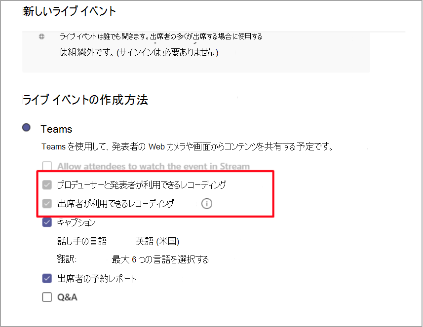

# ライブ イベント記録ポリシー (Microsoft TeamsLive event recording policies in Microsoft Teams

ライブ イベントを記録するためのオプションMicrosoft Teamsがあります。You have several options for recording a Microsoft Teams live event. 記録オプションは、記録ポリシーを使用して設定されます。The recording options are set using recording policies. この記事では、さまざまな設定について説明します。This article describes the various settings.

記録オプションは、PowerShell コマンド [Set-CsTeamsMeetingBroadcastPolicy を使用して設定されます](/powershell/module/skype/set-csteamsmeetingbroadcastpolicy?view=skype-ps)。The recording options are set using the PowerShell command [Set-CsTeamsMeetingBroadcastPolicy](/powershell/module/skype/set-csteamsmeetingbroadcastpolicy?view=skype-ps).

## スケジュールとオプションの動作Scheduling and option behaviors

ライブ イベントの記録をスケジュールする場合、開催者のオプションは 2 つがあります。There are two organizer options while scheduling a live event recording:

- プロデューサーと発表者が使用できるレコーディングRecording available for producers and presenters

  - レコーディング ファイル: プロデューサーと発表者がイベントの終了後にダウンロードできる録音ファイルを提供します。Recording file: Provides a recording file that producers and presenters can download after the event is over.

- 出席者が利用できる記録Recording available for attendees

  - DVR: デジタル ビデオ レコーダー (DVR) を使用すると、出席者はイベント中に巻き戻して一時停止できます。DVR: A digital video recorder (DVR) allows attendees to rewind and pause during the event

  - VOD: ビデオ オン デマンド (VOD) を使用すると、イベントが終わった後に出席者が視聴できます。VOD: A video on demand (VOD) allows attendees to watch after the event is over

## ブロードキャスト録画ポリシーの設定Broadcast recording policy setting

ブロードキャスト ポリシーの一部として、ライブ イベントの記録をオンまたはオフに切り替える設定があります。As part of the broadcast policy, there's a setting that you can toggle to turn recording on or off for a live event.

|                                 | プロデューサーと発表者が使用できるレコーディングRecording available for producers and presenters | 出席者が利用できる記録Recording available for attendees |
| ------------------------------- | ---------------------------------------------------- | ------------------------------------- |
| 常に記録するAlways record               | 無効で選択されているDisabled and selected                                | 有効で選択されているEnabled and selected         |
| オーガナイザーは記録可能か記録しないかOrganizer can record or not | 既定で有効および選択されているEnabled and selected by default                  | 既定で有効および選択されているEnabled and selected by default   |
| 記録しないNever record               | 無効で選択されていないDisabled and not selected                            | 有効で、選択されていないEnabled and not selected      |

ポリシーが Always record に **設定されている場合**、ポリシー ページには次のオプションが選択されています。When the policy is set to **Always record**, the policy page has the following selected options:

## Storageと永続化の動作Storage and persistence behavior

| オプションOption                                       | 都道府県State   | DVRDVR                                                   | VODVOD                                                     | 記録Recording                |
| ------------------------------------------------ | ------------ | --------------------------------------------------------- | ----------------------------------------------------------- | ---------------------------- |
| プロデューサーと発表者が使用できるレコーディングRecording available to producers and presenters | 選択済みSelected     | DVR が使用可能で、Azure Media Services (AMS) 資産は 180 日間保存されます。DVR is available and the Azure Media Services (AMS) asset is stored for 180 days | 出席者はイベントにアクセスして視聴できます。Attendee can access and watch the event                     |                              |
|                                                  | 選択されていないNot Selected | DVR が使用可能で、AMS 資産が 180 日間保存されるDVR is available and the AMS asset is stored for 180 days | イベントが終わった後、出席者はイベントにアクセスできないAttendee won't get access into the event after it's over |                              |
||無効 (選択されていない)Disabled (Not selected)|DVR が使用可能で、イベントの後に AMS 資産が削除されるDVR is available and the AMS asset is deleted after the event|イベントが終わった後、出席者はイベントにアクセスできないAttendee won't get access into the event after it's over||
| プロデューサーと発表者が使用できるレコーディングRecording available to producers and presenters | 選択済みSelected     |                                                           |                                                             | MP4 が作成され、保存されるAn MP4 is created and stored |
|                                                  | 選択されていないNot Selected |                                                           |                                                             | ファイルが作成されませんNo file is created           |

### 関連項目Related topics

- [Teams のライブ イベントについてWhat is Teams live events?](what-are-teams-live-events.md)
- [Teams のライブ イベントの計画Plan for Teams live events](plan-for-teams-live-events.md)
- [Teams でライブ イベント設定を構成するConfigure live events settings in Teams](configure-teams-live-events.md)
- [Teamsクラウド会議の記録Teams clouds meeting recording](../cloud-recording.md)