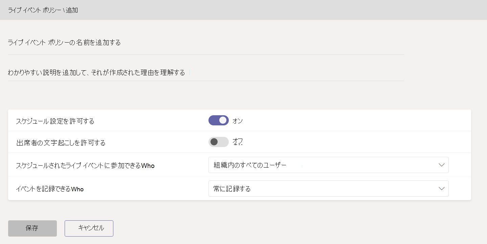

# Microsoft Teams でのライブ イベントのセットアップ

ライブ イベントをセットアップする際は、複数の手順を行う必要があります。

## 手順 1: Teams でのライブ イベント用にネットワークを設定する

Teams で作成したライブ イベントを配信するには、[Teams 用に組織のネットワークを準備する](../prepare-network.md)必要があります。  

## 手順 2: ライセンスを取得して割り当てる

[ライブ イベントの作成とスケジュールを許可するユーザー](plan-for-teams-live-events.md#who-can-attend-create-and-schedule-live-events)と[ライブ イベントの視聴を許可するユーザー](plan-for-teams-live-events.md#who-can-watch-live-events)のそれぞれに適切なライセンスを割り当てるようにします。

## 手順 3: ライブ イベント ポリシーを設定する

ライブ イベント ポリシーを使用して、ライブ イベントの主催が許可される組織内のユーザーと、それらのユーザーが作成するイベントで有効にする機能を制御します。 既定のポリシーを使用することも、1 つ以上のカスタム ライブ イベント ポリシーを作成することもできます。 カスタム ポリシーを作成したら、それを組織内のユーザーまたはユーザーのグループに割り当てます。

> [!NOTE]
> カスタム ポリシーを作成して割り当てていない場合、組織内のユーザーにはグローバル (組織全体の既定) ポリシーが適用されます。 グローバル ポリシーの既定では、Teams ユーザーにはライブ イベントのスケジュールが有効にされ、ライブ キャプションと字幕 (文字起こし) は無効にされます。また、組織内のすべてのユーザーがライブ イベントに参加でき、録画設定は [常に録画] に設定されます。

### ライブ イベント ポリシーを作成または編集する

1. Microsoft Teams 管理センターの左側のナビゲーションで、[**会議** > **ライブ イベント ポリシー****] [ポリシーの** > 管理] タブに移動します。
2. 次のいずれかを行います。

    - 既存の既定のポリシーを編集する場合は、**[グローバル (組織全体の既定値)]** を選択します。
    - 新しいカスタム ポリシーを作成する場合は、[ **+ 追加]** を選択します。
    - カスタム ポリシーを編集する場合は、対象のポリシーを選択してから **[編集]** を選択します。

    組織のニーズに応じて変更できる設定は次のとおりです。

    

|Setting  |説明  |
|---------|---------|
|**タイトル**     |これはライブ イベント ポリシーのページに表示されるポリシーのタイトルです。 64 文字を超えるタイトルは使用できません。また、タイトルに特殊文字を含めることはできません。          |
|**説明**    |この設定を使用して、ポリシーのわかりやすい説明を追加します。         |
|**ライブ イベントのスケジュール設定**     |この設定をオンにすると、組織内のユーザーが Teams でライブ イベントを作成し、スケジュールできるようになります。 ユーザーが外部アプリまたはデバイスで作成されたライブ イベントをスケジュールできるようにする場合は、追加の手順を行う必要がある点にご注意ください。 詳細については、「[ユーザーが外部アプリまたはデバイスで作成されたイベントをスケジュールできるようにする](#enable-users-to-schedule-events-that-were-produced-with-an-external-app-or-device)」を参照してください。     |
|**出席者の文字起こし** |この設定は、Teams で作成されるイベントにのみ適用できます。 この設定をオンにすると、出席者にイベントのライブ キャプションと字幕を表示できます。         |
|**スケジュールされたライブ イベントに参加できるユーザー**    |次のいずれかのオプションを選びます。  **すべてのユーザー**: 組織外部のユーザーを含め、すべてのユーザーが出席できるライブ イベントを作成できます。 この設定では、ユーザーがライブ イベントをスケジュールするときに、Teams で **[パブリック]** タイプのアクセス許可が有効になります。  **組織内のすべてのユーザー**: 組織に追加された [ゲスト ユーザー](../add-guests.md)を含め、組織内のすべてのユーザーが出席できるライブ イベントを作成できます。 匿名ユーザーが出席するライブ イベントを作成することはできません。 この設定では、ユーザーがライブ イベントをスケジュールするときに、Teams で **[組織全体]** タイプのアクセス許可が有効になります。  **特定のユーザーまたはグループ**: 特定のユーザーまたは組織内のグループだけが出席できるライブ イベントを作成できます。 組織内のすべてのユーザーや匿名ユーザーが出席するライブ イベントを作成することはできません。 この設定では、ユーザーがライブ イベントをスケジュールするときに、Teams で **[ユーザーとグループ]** タイプのアクセス許可が有効になります。       |
|**録画設定**        | この設定は、Teams で作成されるイベントにのみ適用できます。 次のいずれかのオプションを選びます。    **常に録画**: ユーザーが作成したライブ イベントは常に録画されます。 イベントの終了後、イベントのチーム メンバーは録画をダウンロードできます。また、出席者はイベントを視聴できます。   **録画しない**: ユーザーが作成したライブ イベントは録画されません。  **開催者が録画可能または不可**: ライブ イベントを録画するかどうかをユーザーが決定できます。 録画する場合は、イベントの終了後、イベントのチーム メンバーは録画をダウンロードできます。また、出席者はイベントを視聴できます。

また、Windows PowerShellを使用してこれを行うこともできます。現在、GCC High および DoD のお客様はこのメソッドを使用する必要があります。 詳細については、「[PowerShell を使用して Microsoft Teams でのライブ イベント ポリシーを設定する](set-teams-live-events-policies-using-powershell.md)」を参照してください。

### ユーザーにライブ イベント ポリシーを割り当てる

カスタム ライブ イベント ポリシーを作成した場合、そのポリシーをユーザーに割り当てるとポリシーが有効になります。   [!INCLUDE [assign-policy](../includes/assign-policy.md)]

### ユーザーが外部アプリまたはデバイスで作成されたイベントをスケジュールできるようにする

ユーザーが外部アプリまたはデバイスで作成されたイベントをスケジュールできるようにするには、次の手順も行う必要があります。

1. 組織内のユーザーに対して Microsoft Stream を有効にします。 Stream は、対象となる Microsoft 365 または Office 365 サブスクリプションの一部として、またはスタンドアロン サービスとして使用できます。 Stream は Business Essentials プランや Business Premium プランには含まれません。 詳細については、「[Microsoft Stream ライセンスの概要](/stream/license-overview)」を参照してください。

   >[!Note]
   > Microsoft Stream の使用から [会議の記録用の OneDrive for Business および SharePoint ](../tmr-meeting-recording-change.md)への変更は段階的なアプローチになります。 リリース時には、この機能にオプトインできるようになります。Stream を使い続けるには、11 月にオプトアウトする必要があります。また、2021 年初頭には、すべてのお客様に、新しい会議の記録に OneDrive と SharePoint を使用するように要請する予定です。 ユーザーが Stream にアクセスできるよう、[**ユーザーにライセンスを割り当てる方法**](https://support.office.com/article/Assign-licenses-to-users-in-Office-365-for-business-997596B5-4173-4627-B915-36ABAC6786DC)をご確認ください。 Stream がそのユーザーに対してブロックされていないことを、[**この記事**](/stream/disable-user-organization)の定義に従って確認します。

2. Stream で、ユーザーにライブ イベント作成の許可が割り当てられるようにします。 既定では、管理者は外部アプリまたはデバイスでイベントを作成できます。 Stream 管理者は、Stream で[ライブ イベントの作成を許可する他のユーザーを追加](/stream/live-event-administration#restrict-who-can-create-events)できます。

3. Stream 管理者によって設定されている会社のポリシーにライブ イベントの開催者が同意していることを確認します。Stream 管理者が[会社のガイドライン ポリシーを設定](/stream/company-policy-and-consent)し、そのポリシーに同意してからでなければ従業員がコンテンツを保存できないようにしている場合、ユーザーは Teams で (外部アプリまたはデバイスを使用して) ライブ イベントを作成する前に、ポリシーに同意する必要があります。 組織でライブ イベント機能を展開する前に、このようなライブ イベントを作成するユーザーがポリシーに同意していることを確認してください。

## 手順 4: Teams でライブ イベント用のビデオ配信ソリューションを設定する

ライブ イベント ビデオの再生ではアダプティブ ビットレート ストリーミング (ABR) が使用されますが、これはユニキャスト ストリーミングであるため、すべての視聴者がインターネットから独自にビデオ ストリーミングを取得することになります。 ライブ イベントまたはビデオを組織の多数のユーザーに送信する場合、視聴者によって大量のインターネット帯域幅が消費される可能性があります。 ライブ イベントのこのインターネット トラフィックを減らしたい組織の場合、Microsoftは [eCDN](/ecdn) (エンタープライズ コンテンツ配信ネットワーク) Microsoftファースト パーティ ソリューションを提供します。 ライブ イベント ソリューションは、ソフトウェア定義ネットワーク (SDN) または eCDN を提供するMicrosoftの信頼できるビデオ配信パートナーとも統合されています。 これらの SDN/eCDN プラットフォームを使用すると、組織はエンド ユーザーの表示エクスペリエンスを犠牲にすることなく、ネットワーク帯域幅を最適化できます。 これらのソリューションは、エンタープライズ ネットワーク全体でよりスケーラブルで効率的なビデオ配信を実現するのに役立ちます。

- **Microsoft eCDN** Microsoft eCDN は Teams に統合されており、Stream および Yammer とも互換性があります。 企業ネットワーク内のピアツーピア テクノロジを使用して、WAN 接続から帯域幅をオフロードします。

- **Teams 外部のソリューションを購入してセットアップする** ビデオ配信をスケーリングする場合、Microsoft の信頼できるビデオ配信パートナーを利用して、エキスパートからのサポートを得ることができます。 

次の SDN/eCDN ソリューションは統合されており、Stream で使用されるように設定できます。

- **Hive Streaming** はライブのオンデマンド エンタープライズ ビデオ配信に対応する、シンプルで強力なソリューションです。 Hive はソフトウェアベースのソリューションであり、ハードウェアや帯域幅を追加する必要はありません。さらに、ネットワークに悪影響を与えることのない安全な方法で、数千人のユーザーが同時にビデオを視聴できるようにします。 SDN/eCDN ソリューションを購入する前にビデオがネットワークに与える影響について理解できるよう、Hive Streaming には Microsoft のお客様向けにブラウザーベースの分析ソリューションも用意されています。 [詳細については、こちらを参照してください](https://www.hivestreaming.com/partners/integration-partners/microsoft/)。

- **Kollective** はクラウドベースのスマート ピアリング配布プラットフォームであり、既存のネットワーク インフラストラクチャを利用して、多くの形式 (ライブ ストリーミング ビデオ、オンデマンド ビデオ、ソフトウェア更新プログラム、セキュリティ パッチなど) で、より高速で信頼性が高く、帯域幅が少ないコンテンツを配信します。 Microsoft のセキュリティで保護されたプラットフォームは、世界中の大手金融機関から信頼を得ています。追加のハードウェアは不要で、簡単にセットアップして保守できます。 [詳細については、こちらを参照してください](https://kollective.com/microsoft-pilot/)。

- **Ramp** は、安全で完璧なビデオ配信のためのユニバーサルeCDNソリューションを提供します。 一流の金融、医療、政府機関から信頼されている Ramp は、オンプレミス、クラウド、またはハイブリッドにデプロイし、ゼロ トラスト環境に最適です。 当社のユニバーサル ライセンスには、3 つの eCDN 配信方法 (P2P、マルチキャスト、キャッシュ) がすべて含まれており、ライブ ストリーミングとオンデマンド ビデオを、企業ネットワークを共有するビジネスクリティカルなアプリケーションを保護するために、帯域幅への影響が最も低い最高品質で配信されます。 [詳細情報を参照してください](https://rampecdn.com/)。

- **リバーベッド** はネットワーク最適化における業界標準で、同社の高速化ソリューションは Microsoft Teams と Stream に展開されています。  これにより、Microsoft 365 のお客様は Teams および Stream を含む 365 のトラフィックをその他さまざまな企業向け SaaS サービスとともに信頼性の高い方法で高速化し、従業員の場所にかかわらず生産性を向上できるようになりました。 簡単なセットアップ作業で有効にすることができる Teams および Stream の高速化は、リバーベッドの世界最高水準のサポートと継続的な投資によって支えられています。

> [!NOTE]
> サード パーティの SDN または eCDN ソリューションを選択した場合は、選択した **サード パーティ プロバイダーのサービス利用規約とプライバシー ポリシー** が適用されます。これにより、プロバイダーのソリューションの使用が管理されます。 プロバイダーのソリューションの使用に対しては、Microsoft ボリューム ライセンス条項やオンライン サービス条項は適用されません。 **サードパーティ プロバイダーの利用規約** に同意しない場合は、Teams でそのソリューションを有効にしないでください。

SDN または eCDN ソリューションをセットアップした後、Teams でのライブ イベント用にプロバイダーを構成できます。

## 次の手順

[Teams でライブ イベント設定を構成する](configure-teams-live-events.md)方法を確認する。

### 関連項目

- [Teams のライブ イベントについて](what-are-teams-live-events.md)
- [Teams のライブ イベントの計画](plan-for-teams-live-events.md)
- [Teams でライブ イベント設定を構成する](configure-teams-live-events.md)
