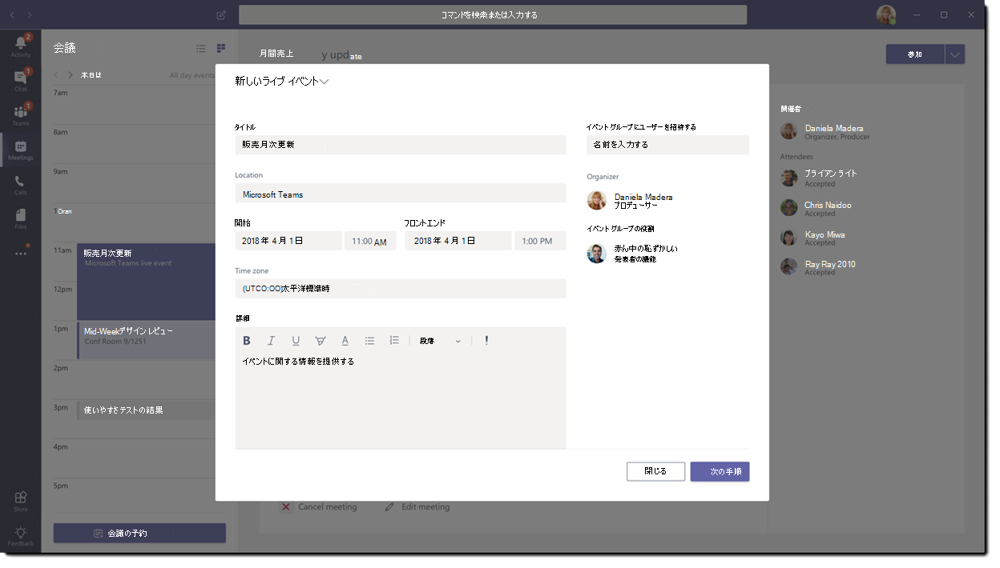

# Microsoft Teams のライブ イベントについて

## 概要

Teams のライブ イベントを使用すると、組織内のユーザーはビデオと会議のコンテンツを多数のオンライン視聴者にブロードキャストできます。

Microsoft 365 ライブ イベントは、ライブ ビデオ ストリーミングを新しいレベルに引き上げます。 ライブイ ベントは、エンゲージメント ライフサイクル全体を通じて、ライブ イベントの前、最中、後の参加者とのつながりを促進します。 ライブ イベントは、対象ユーザー、チーム、またはコミュニティの所在地にかかわらず Microsoft Stream、Teams、または Yammer を使用することで作成できます。  

Teams は、チャット ベースの共同作業、通話、会議、およびライブ イベントを提供するため、会議の参加者を増やすことができます。 Teams ライブ イベントは Teams 会議の延長であり、ユーザーはビデオおよび会議のコンテンツを多数のオンライン視聴者にブロードキャストできます。 ライブ イベントは、イベントのホストがインタラクションを主導し、視聴者の参加が主にホストによって共有されているコンテンツを表示する 1 対多のコミュニケーションを目的としています。 参加者は、Yammer、Teams、または Stream でライブまたは記録されたイベントを視聴でき、モデレートされた Q＆A または Yammer 会話を使用してプレゼンターと対話できます。

Teams ライブ イベントは Skype 会議ブロードキャストの次のバージョンと見なされ、最終的には Skype 会議ブロードキャストで提供される機能に取って代わるものとなります。 この時点で、Microsoft は、新規または将来のイベントに備えてサービスを中断することなく、社内で Skype for Business を使用しているユーザーに対して Skype 会議ブロードキャストを引き続きサポートします。 ただし、Teams ライブ イベントで画面共有や外部ハードウェア/ソフトウェア エンコーダーのサポートなど、すべての新機能を活用することをお勧めします。

では開始します。 まず、Microsoft 365 ライブ イベントに関連する高レベルのコンポーネントと、それらがどのように接続されているかを示す次の図を見てください。

### イベント グループの役割

Teams でのライブ イベントは、複数の役割 (主催者、プロデューサー、発表者、および参加者) がイベントを正常にブロードキャストして参加できるようにします。 詳細については、「[イベント グループの役割](https://support.office.com/article/get-started-with-microsoft-teams-live-events-d077fec2-a058-483e-9ab5-1494afda578a?ui=en-US&rs=en-US&ad=US#bkmk_roles)」を参照してください。

## 主要なコンポーネント

上の図から、Teams のライブ イベントで使用される 5 つの主要コンポーネントが確認できます。

> [!NOTE]
> ライブ イベントの設定方法と参加者の体験の概要は、これらの短い[ビデオ](https://support.office.com/article/video-plan-and-schedule-a-live-event-f92363a0-6d98-46d2-bdd9-f2248075e502)を確認してください。

### スケジュール設定

Teams では、主催者は適切な参加者アクセス許可でイベントを作成すること、イベントのチーム メンバーを指定すること、作成方法を選択すること、および参加者を招待することができます。 ライブ イベントが Yammer グループ内から作成されたものであると、そのライブ イベントの参加者はイベント内のユーザーと Yammer の会話で対話できます。

### 作成

ビデオ入力はライブ イベントの基盤であり、単一の Web カメラからマルチカメラのプロのビデオ作成までさまざまです。 Microsoft 365 のライブ イベントは、Web カメラを使用して Teams で作成されるイベントや、外部アプリまたはデバイスで作成されるイベントなど、さまざまな作成シナリオをサポートします。 これらのオプションは、プロジェクトの要件と予算に応じて選択できます。 イベントを作成するには、次の 2 つの方法があります。

- **Teams**: この作成方法を使用すると、Web カメラまたは Teams ルーム システムからの音声ビデオ入力を使用して、Teams 内でライブ イベントを作成できます。 このオプションは、PC に接続されたオーディオ デバイスとビデオ デバイスを使用する場合、またはリモート発表者をイベントに招待する場合に最適かつ迅速なオプションです。 このオプションを使用すると、Web カメラを簡単に使用して、イベントの入力として画面を共有できます。

- **外部アプリまたはデバイス**: 外部エンコーダーを使用すると、ユーザーが [Stream](https://stream.microsoft.com) の外部ハードウェアまたはソフトウェア ベースのエンコーダーから直接ライブ イベントを作成することができます。 このオプションは、Real-time Messaging Protocol (RTMP) サービスへのストリーミングをサポートするスタジオ品質の機器 (メディア ミキサーなど) がすでにある場合に最適です。 この種類の作成は、一般的にエグゼクティブのタウン ホールなどの大規模なイベントで使用され、メディア ミキサーからの 1 つのストリームが視聴者にブロードキャストされます。

    

>[!Note]
> Microsoft Stream の使用から[会議の記録用の OneDrive for Business および SharePoint ](../tmr-meeting-recording-change.md)への変更は段階的なアプローチになります。リリース時には、この機能にオプトインできるようになります。Stream を使い続けるには、11 月にオプトアウトする必要があります。また、2021 年初頭には、すべてのお客様に、新しい会議の記録に OneDrive と SharePoint を使用するように要請する予定です。

### ストリーミング プラットフォーム

ライブ イベントのストリーミング プラットフォームは、次の要素で構成されます。

- **Azure Media Services**: [Azure Media Services](https://docs.microsoft.com/azure/media-services/previous/) は、現在最も人気のあるモバイル デバイスでより多くの視聴者に提供する放送品質のビデオ ストリーミング サービスを提供しています。 メディア サービスを使用すると、アクセス性、配信性、スケーラビリティが向上し、コンテンツを保護しながら、ローカルまたは世界中の視聴者にコンテンツを簡単かつコスト効率に優れた方法でストリーミングできます。
- **Azure コンテンツ配信ネットワーク (CDN)**: ストリームがアクティブになると、[Azure コンテンツ配信ネットワーク (CDN)](https://docs.microsoft.com/azure/cdn/) を介して配信されます。 Azure Media Services は、ストリーミング エンドポイントに統合 CDN を提供します。 これにより、バッファリングなしで世界中でストリームを見ることができます。

### Enterprise コンテンツ配信ネットワーク (eCDN)

eCDN の目的は、インターネットからビデオ コンテンツを取得し、ネットワーク パフォーマンスに影響を与えることなく企業全体にコンテンツを配信することです。 次の認定 eCDN パートナーのいずれかを使用すると、組織内で開催されるライブ イベント用にネットワークを最適化できます。

- [Hive](https://www.hivestreaming.com/partners/integration-partners/microsoft/)
- [Kollective](https://kollective.com/ecdn-solutions/microsoft-live-events/)
- [Ramp](https://rampecdn.com)
- [Riverbed](https://www.riverbed.com/solutions/office-365.html)

### 参加者の体験

参加者の体験はライブ イベントの最も重要な側面であり、参加者が問題なくライブ イベントに参加できることが重要です。 参加者の体験は、Stream Player (Teams で作成されたイベント) と Azure Media Player (外部アプリまたはデバイスで作成されたイベント) を使用し、デスクトップ、ブラウザー、モバイル (iOS、Android) で動作します。 Microsoft 365 と Office 365 は、Yammer と Teams を 2 つの共同作業ハブとして提供し、ライブ参加者の体験はこれらの共同作業ツールに統合されています。

### ライブ イベントの使用状況レポート

テナント管理者は、Microsoft Teams 管理センターでライブ イベントのリアルタイムの使用状況分析を表示できます。  [ライブ イベントの使用状況レポート](../teams-analytics-and-reports/teams-live-event-usage-report.md)は、組織で開催されているライブ イベントの活動概要を表示します。  管理者は、イベントの状態、開始時刻、閲覧回数、および運用の種類を含むイベントの使用状況情報を表示できます。  

## 次の手順

「[Teams のライブ イベントの計画](plan-for-teams-live-events.md)」に移動します。

### 関連トピック

- [Yammer のMicrosoft 365、Microsoft Teams、および Microsoft Stream 全体のライブ イベント](https://docs.microsoft.com/stream/live-event-m365)
- [Microsoft Teams ライブ イベントの使用を開始する](https://support.office.com/article/d077fec2-a058-483e-9ab5-1494afda578a)
- [Yammer のライブ イベント](https://support.office.com/article/live-events-in-yammer-4ece0ee2-c268-4636-bf2a-16e454befe57)
- [Microsoft Stream でのライブ イベント](https://docs.microsoft.com/stream/live-event-overview)
