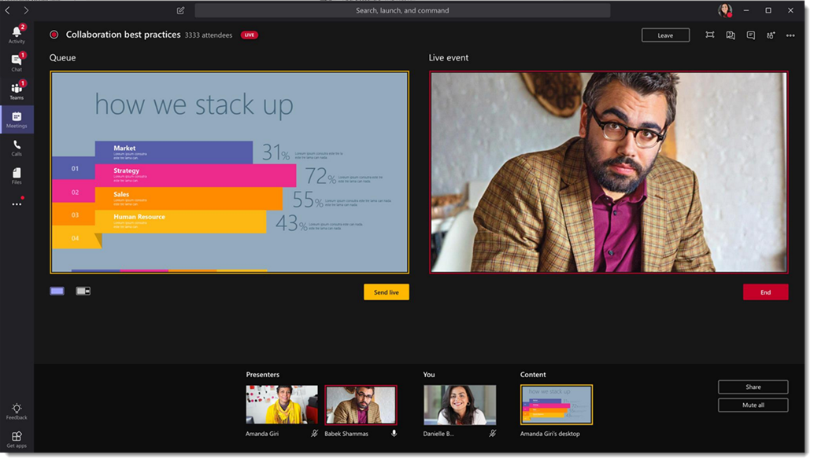
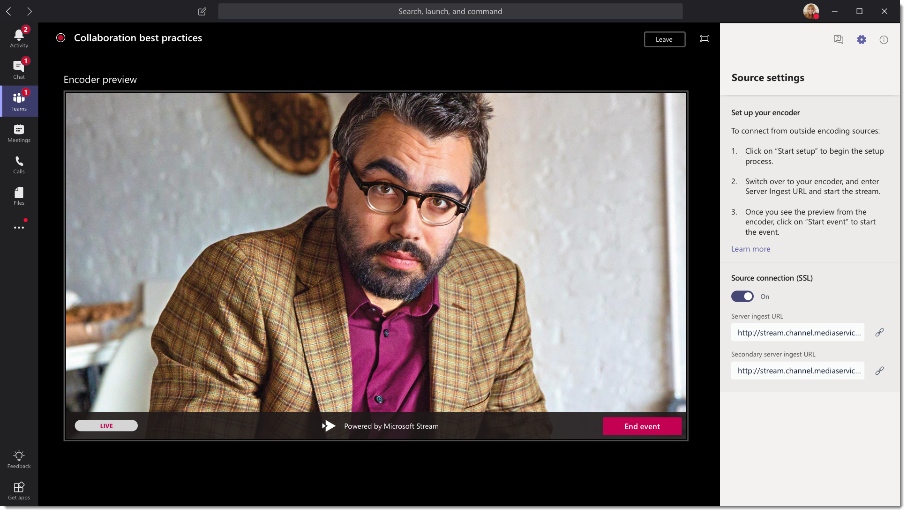

# Microsoft Teams のライブ イベントについて

## 概要

Teams のライブイベントを使うと、組織のユーザーは大規模なオンラインユーザーにビデオと会議コンテンツをブロードキャストできます。 

Microsoft 365 ライブイベントは、リアルタイムのビデオストリーミングを新しいレベルで実現し、参加前、ライブ中、ライブイベント後の参加者と、契約のライフサイクル全体を通じて接続を促進します。 Microsoft Stream、Teams、または Yammer を使用して、対象ユーザー、チーム、またはコミュニティが置かれている場所で、ライブイベントを作成できます。  

チームは、チャットに基づく共同作業、通話、会議、ライブイベントを提供するため、会議の対象ユーザーを広げることができます。 Teams のライブイベントは、チーム会議の拡張機能であり、ユーザーがビデオや会議コンテンツを大規模なオンライン参加者にブロードキャストできるようにします。 これは、イベントのホストが対話式と参加者の参加につながる1対多の通信を目的としています。主には、ホストによって共有されているコンテンツを表示することになります。 出席者は、Yammer、チーム、またはストリームでライブまたは記録されたイベントを視聴することができます。また、モデレートの Q&a & A または Yammer の会話を使って、発表者と連絡を取ることができます。

Teams のライブイベントは、Skype 会議ブロードキャストの次のバージョンと見なされ、最終的には Skype 会議ブロードキャストで提供される機能を置き換えます。 この時点で、Microsoft は組織で Skype for Business を使用しているユーザーのために Skype 会議ブロードキャストを引き続きサポートします。これにより、新規または将来のイベントに対するサービスが中断されることはありません。 ただし、外部のハードウェア/ソフトウェアエンコーダーの画面共有やサポートなど、すべての新機能や魅力的な機能を活用するには、Teams のライブイベントを試すことをお勧めします。

では、始めましょう。 まず、次の図を見て、Microsoft 365 live イベントに関連する上位コンポーネントとその接続方法について説明します。 

### イベントグループの役割
Teams のライブイベントにより、複数の役割 (開催者、プロデューサー、発表者、出席者) が正常にブロードキャストされ、イベントに参加できるようになります。 詳細については、「[イベントグループの役割](https://support.office.com/article/get-started-with-microsoft-teams-live-events-d077fec2-a058-483e-9ab5-1494afda578a?ui=en-US&rs=en-US&ad=US#bkmk_roles)」を参照してください。

## 主要コンポーネント
上の図では、Teams でライブイベントと共に使用される4つの主要コンポーネントがあることがわかります。

> [!NOTE]
> ライブイベントと出席者エクスペリエンスのセットアップ方法の概要については、次の短い[ビデオ](https://support.office.com/en-us/article/video-plan-and-schedule-a-live-event-f92363a0-6d98-46d2-bdd9-f2248075e502)をご覧ください。

### 管理
チームは、開催者が適切な出席者権限を持つイベントを作成し、イベントチームメンバーを指定し、運用方法を選択して、出席者を招待する機能を提供します。 ライブイベントが Yammer グループ内で作成された場合、ライブイベントの出席者は、イベントでのユーザーとのやり取りに Yammer の会話を使用できます。 

![[新しいライブイベント] 画面を示すスクリーンショット](../media/teams-live-events-schedule.png "新しいライブイベントを作成してスケジュールする新しいライブイベント画面を示すスクリーンショット")

### 発行
ビデオ入力は、ライブイベントの基礎であり、1つの web カメラから複数のカメラの専門ビデオ製作まで、さまざまな場合があります。 Microsoft 365 のライブイベントは、一連の運用シナリオをサポートしており、web カメラを使って、または外部のアプリやデバイスで生成されたイベントを使用してチームで生成されたイベントを含めることができます。 プロジェクトの要件と予算に応じて、これらのオプションを選ぶことができます。 イベントを作成するには、次の2つの方法があります。

- **Teams**: この運用方法では、ユーザーが web カメラを使用して、またはチームルームシステムからの A/V の入力を使って、チームでライブイベントを生成できます。 このオプションは、PC に接続されているオーディオデバイスやビデオデバイスを使用する場合や、イベントに参加するためにリモートの発表者を招待する場合に最も簡単なオプションです。 このオプションを使うと、ユーザーは簡単に web カメラを使用して、イベントの入力として画面を共有することができます。 

    

- **外部アプリまたはデバイス**: 外部エンコーダーを使うと、ユーザーは[ストリーム](https://stream.microsoft.com)を使って外部ハードウェアまたはソフトウェアベースのエンコーダーから直接ライブイベントを生成できます。 このオプションは、リアルタイムメッセージングプロトコル (RTMP) サービスへのストリーミングをサポートする、studio 品質機器 (メディアミキサーなど) を既にお持ちの場合に最適です。 通常、この種類の生産は、役員のような大きなイベント (メディアミキサーの1つのストリームが対象ユーザーにブロードキャスト) で使用されます。 

    

### ストリーミングプラットフォーム
ライブイベントストリーミングプラットフォームは、次の要素で構成されています。

- **Azure**media services: [azure media services](https://docs.microsoft.com/azure/media-services/previous/)では、最も人気の高いモバイルデバイスで、ブロードキャスト品質のビデオストリーミングサービスを利用して、多くのユーザーに連絡できます。 メディアサービスは、ユーザー補助機能、配布、スケーラビリティを強化し、コンテンツを保護しながら、ローカルまたは世界中の対象ユーザーにコンテンツをストリーミングするための簡単で費用の高い機能を実現します。
- **Azure コンテンツ配信ネットワーク (cdn)**: ストリームがアクティブになると、 [Azure コンテンツ配信ネットワーク (cdn)](https://docs.microsoft.com/azure/cdn/)を通じて配信されます。 Azure Media Services には、ストリーミングエンドポイント用の統合 CDN が用意されています。 これにより、ストリームはバッファリングせずに世界中で表示することができます。

### エンタープライズコンテンツ配信ネットワーク (eCDN)
ECDN の目標は、ネットワークのパフォーマンスに影響を及ぼすことなく、インターネットからビデオコンテンツを取得し、企業全体にコンテンツを配布することです。 次の認定された eCDN パートナーのいずれかを使用して、組織内で保持されるライブイベントのネットワークを最適化することができます。
- [Hive](https://www.hivestreaming.com/partners/integration-partners/microsoft/)
- [Kollective](https://kollective.com/microsoft-pilot/)
- [見本](http://www.ramp.com)

### 出席者の操作 
出席者のエクスペリエンスは、ライブイベントの最も重要な側面であり、出席者が問題を発生させることなくライブイベントに参加できるようにすることが重要です。 出席者のエクスペリエンスでは、Stream Player (Teams で作成されたイベント用) と Azure Media Player (外部のアプリやデバイスで生成されたイベントの場合) が使用され、デスクトップ、ブラウザー、モバイル (iOS、Android) で動作します。 Office 365 は、Yammer と Teams を2つのコラボレーションハブとして提供しており、live 参加者エクスペリエンスはこれらのコラボレーションツールに統合されています。 

### ライブイベントの使用状況レポート 
テナント管理者は、Microsoft Teams 管理センターでライブイベントのリアルタイムの利用状況分析を表示できます。  [[ライブイベントの使用状況] レポート](../teams-analytics-and-reports/teams-live-event-usage-report.md)には、組織内で保持されているライブイベントのアクティビティの概要が表示されます。  管理者は、イベントの状態、開始時刻、ビュー、および運用の種類などのイベントの利用状況情報を表示できます。  

## 次の手順
「 [Teams ライブイベントのプラン](plan-for-teams-live-events.md)」に移動します。

### 関連項目
- [Yammer、Microsoft Teams、Microsoft Stream の Microsoft 365 全体でのライブイベント](https://docs.microsoft.com/stream/live-event-m365)
- [Microsoft Teams ライブイベントの使用を開始する](https://support.office.com/article/d077fec2-a058-483e-9ab5-1494afda578a)
- [Yammer のライブイベント](https://support.office.com/article/live-events-in-yammer-4ece0ee2-c268-4636-bf2a-16e454befe57)
- [Microsoft Stream のライブイベント](https://docs.microsoft.com/stream/live-event-overview)

 
