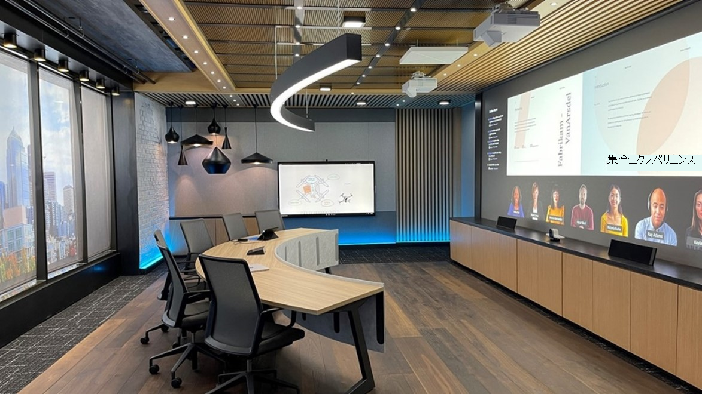

# 会議室に関するガイダンスTeams

この記事は、会議室のソリューションとデバイスを使用して会議スペースを最適化するMicrosoft Teamsをユーザーに提供することを目的としています。 このページには、Teamsデバイスとソリューションの用途、レイアウト、仕様に関する情報が含まれます。

この[記事](#example-spaces)の「スペースの例」セクションには、仕様とレンダリングされたルーム レイアウトが含まれています。Teams デバイスや Teams Rooms ソリューションのデプロイを視覚化して計画する場合に便利です。

## 会議室の用途とレイアウト

Microsoft Teams会議室ソリューションは、目的の柔軟性と、従来の会議室では実現できない空間全体の移動の柔軟性を提供します。 たとえば、Teams Rooms デバイスを使用すると、ユーザーはデジタル ホワイトボードとの共同作業を強化できます。インテリジェントな人追跡カメラを使用すると、部屋のどこにいるかに関係なく、すべてのローカル参加者を見ることができます。 任意の種類のスペースと任意の種類の会議は、会議室デバイスまたは会議室TeamsソリューションTeams最適化できます。

### プレゼンテーションに焦点を当てた会議 

会議と発表の会議は最初のバケットであり、この会議は一般的に正式です。 オーディオ ビジュアルは優先事項であり、コンテンツの表示に重点を置いて行います。 通常、デバイスは固定され、ユーザーは中央のテーブル本体からデバイスを操作しながら座ったままにできます。

スペースを満たして発表すると、プレゼンテーションとディスカッションが優先されます。つまり、レイアウトとテクノロジは、コンテンツ共有とリモート共同作成用に最適化する必要があります。 全員がディスカッションに参加し、共有コンテンツを表示して操作できる必要があります。

**スペース レイアウトの****表示と表示:** 表は固定し、部屋の前のディスプレイに配置する必要があります。 小さな部屋では、テーブルを壁に取り付ける場合がありますが、大きなスペースでは、カメラの考慮事項に対応するためにテーブルを分離する必要があります。

### 共同作成に重点を置く会議

会議と共同作成の会議は、一般に、共同作成、インク、ホワイトボードに優先順位を付け、形式が低くなります。 このバケットでは、個人用ファイルへのアクセスも重要です。 デバイスはモバイルであり、ユーザーにデバイスの立ち上げ、収集、操作を促します。

適切なスペースは、ユーザーとテクノロジをシームレスにブリッジし、最も初心者のユーザーに対する摩擦を排除します。 Teamsデバイスは、若い学生や新しいユーザーが十分に操作し、教育者または管理者が最初の使用から制御およびカスタマイズするのに十分なユーザーに対応するように設計されています。

**スペース レイアウトを見て共同作成する:** テーブルと共同作成機器は柔軟な位置を持つ可能性があり、テーブルまたは機器で作業するユーザーのグループに対応する必要があります。

### プレゼンテーションと共同作成に焦点を当てた会議

どちらのタイプのルームでも、必要に応じて両方の種類のエクスペリエンスを処理できます。 ルームは、使用ごとにテクノロジを使用することで、両方に簡単に対応するように設計できます。 覚えておく必要がある重要な点は、プライベート オフィスから講義ホールまで、どのスペースを備えていTeamsです。

**プレゼンテーションと共同作成スペースレイアウトの組み合わせ:** 他の会議シナリオの使用例の組み合わせを組み合わせて、プレゼンテーションに重点を置く会議と共同作成作業を同時に同じ効率で実現できる多目的ルームを形成できます。

## 会議エクスペリエンスの最適化
会議のエクスペリエンスは、会議スペースに最適なテクノロジを使用して、邪魔にならずにアイデアの交換を容易にした結果です。

### ネイティブ Teams ルーム エクスペリエンスと他のデバイス

Teamsルームは、ワンタッチ参加、インテリジェントな方法で会議に物理的なホワイトボードを共有するコンテンツ カメラ、個人用デバイスから部屋に Teams 会議をシームレスに転送する近接機能など、独自の会議室機能を提供することで、個人用デバイス上の Teams で実行できる機能を超えます。

外部サービスまたは Bring Your-Own-device 接続に依存する非ネイティブおよび自己構築システムは、ネイティブ Teams Room の使いやすさや臨場感のある品質に真に一致しません。

展開の過程で、会議スペース内の完全にネイティブな Teams エクスペリエンスへのパスに実装される中間手順 (デバイス持ち込み会議室の迅速な展開など) が必要になる場合があります。

### 会議Teams使用して、最適な会議エクスペリエンスを作成する

すべての個人用デバイスに Teams を配置し、すべてのスペースに Microsoft Teams 会議室を適切に展開することで、すべてのユーザーに最適な会議エクスペリエンスを提供できます。 可能な限り最高のエクスペリエンスを実現するには、技術的な展開とエンドユーザーのガイダンスとトレーニングの両方の観点から、すべてのスペースに対処する必要があります。

通常、大規模な会社全体のロールアウトを計画すると、一部の会議室でテクノロジが異なる時刻に追加される段階や、特定のコンポーネントが他の部屋よりも早くインストールされている段階で発生します (たとえば、Teams Rooms ソリューションを 1 フロアまたは 1 部屋ごとにインストールしながら、特定のビル内のすべての部屋にスケジュールを設定するために Teams パネルをデプロイするなど)。

ユーザーがこれを行う準備を段階で行い、Teams会議のエクスペリエンスを最大限に高め、

#### 優れたエクスペリエンス – 会議スペース内の個人用デバイス単独

このプランから始めるには、AV 以外の会議スペースまたはコラボレーションに備え付けされていない会議スペースのアドレスを指定します。 会議室にデバイスがTeamsまだインストールされていない場合でも、会議室内のTeams利用できます。

*オーディオ:* Teams 会議室全体への優れた橋渡しは、個々のユーザーに小規模な部屋やグループ用の Teams 認定オーディオ デバイスを提供するか、または小さなデバイスが切断しない大規模なグループ向け大規模なスペース用の完全な Teams 会議室ソリューションの前に会議室に展開することで、会議テクノロジを計画する方法です。

*ビデオ:* これらの会議室を使用すると、個々のユーザーは自分のデバイスを持ち込み、Teams会議コンテンツで共有し、個々のカメラで自分の表情をキャプチャできます。 その後、ユーザーは誰かをローカル グループのオーディオの 1 つのソースとして指定し、その個人デバイスを認定されたオーディオ デバイスに接続して、すべてのユーザー (ローカルとリモートの両方) が音声会議で肯定的なエクスペリエンスを持つ。

*エンゲージメント:* 個人用デバイスや周辺機器を使用する必要がある場合でも、Teams 会議のエクスペリエンスを向上するために会議室を有効にすると、ユーザーは引き続き Teams で実行できる操作を拡張できます。 ユーザーがプライベート オフィスや個々のワークステーションにアクセスしている場合、Teams は、リモート参加者と関わるだけでなく、対人ディスカッションを容易に行います。

#### エクスペリエンスの向上 – Teams会議室ソリューションと個人用デバイスなし

Teams Rooms ソリューションをインストールする場合、またはそれぞれのスペースに適した Teams Rooms デバイスを使用して既に展開されている会議室がある場合は、会議を快適に利用できます。

*オーディオ:* これらの会議スペースのオーディオは、Teams Rooms ソリューションとその Microsoft 認定オーディオ デバイスによって処理されます。

*ビデオ:* これらのスペースのビデオは、Teams Rooms ソリューションとその Microsoft 認定カメラによって処理されます。

*エンゲージメント:* エンド ユーザーは、会議に対して Teams 会議室の完全なエクスペリエンスを利用して、すべてのユーザーが簡単に会議に参加し、音声とビデオを使い続けることができます。

#### 最適なエクスペリエンス – Teamsデバイスと組み合わせて使用される会議室ソリューション

テクノロジを調整して使用するユーザーのトレーニングは、最も効率的で合理化された結果になります。 最適なシナリオは、インストールされているテクノロジと個人用デバイスの組み合わせです。

*オーディオ:* ほとんどの会議室の接続とオーディオ ビデオの作業は Teams Rooms ソリューションによって処理され、個々のユーザーはカメラをオンにし、オーディオオフして完全に臨場感のあるエクスペリエンスを得ながら同じ会議に参加できます。

*ビデオ:* リモート ユーザーは、全員が話し合いやコンテンツ共有を行う以外に会議に参加しているのを確認できます。 リモート ユーザーは、個人のビデオを有効にし、任意の参加者に集中できる機能を備え、部屋のどこからでもビューを取得できます。

*エンゲージメント:* チャットは、ローカルとリモートのすべての参加者が関与し、関与し、関与し続け、動的な状態を維持できます。 ビデオ共有は、Teamsルームと個々のカメラを使用して行います。これにより、リモート参加者は誰とでも参加できます。

すべてのTeamsを使用すると、ローカル ルーム ユーザーとリモート ユーザーが同じように会議に参加できます。

## テクノロジに関する考慮事項

適切なオーディオとビデオのテクノロジの選択は、ユーザーが自分の会議を活用Microsoft Teamsします。

### オーディオ

音声に関する考慮事項は、リモート参加者と部屋内参加者の両方が明確に聞こえ、理解できるよう、重要です。 マイクとスピーカーのカバー範囲には、部屋内のすべてのシートを、ギャップを残さずに含める必要があります。

*各スペースに適切なオーディオ デバイス*

会議室に音声の問題が発生しなかには、1 つのスペースの音声ソースが必要です。

スペースごとに適切なマイクとスピーカーをペアリングすると、注意を散らさずに明らかに聞こえる最良の結果が得られます。

-   共有スペースでは、オプションは拡張されますが、同じ原則が残ります。会議の参加者は、他の参加者の声を聞き、他のユーザーの声をはっきりと聞く必要があります。

    -   1 台のオーディオ デバイスは、オーディオ デバイスに比較的近い場所に座っている参加者の数が限られている、より小さなスペースに対して、簡単に展開できる高品質のオプションです。

    -   より **大きなスペースでは**、マイクとスピーカーは独立して、スペース内のすべての参加者に対して最大のカバレッジを確保します。 中規模から大規模の部屋向けソリューションの多くは、構成を必要とし、マイクとスピーカーの物理的なインストールのみを必要とするキットの一部として利用できます。

    -   非常に大規模で最も複雑な空間では、大規模なホールから集客者と聴衆の声を取り込み、同時に全員に通話を呼び出すなど、さまざまな種類のマイクとスピーカーを組み合わせて使用できるソリューションを利用できます。 これらのソリューションは、技術的に関連するソリューションの設計と展開に関する専門知識を持つ Microsoft パートナーとデプロイする場合に最適です。

### ビデオ

ビデオはオーディオと同様に重要です。 顔の表情やジェスチャーなどの言葉以外の物理的なコミュニケーションをキャプチャすることが、最大の関与と理解を確保するために、教室や会議のコンテンツと同様に重要です。 会議室とリモートのユーザーが会議を適切に体験できるよう、会議室には適切なサイズのディスプレイが必要です。 このため、リモートに参加しているユーザーのために、会議室のすべての会議参加者を効果的にキャプチャするために、適切なカメラカバレッジと視野 (FOV) を部屋に用意する必要があります。

*各スペースの適切なカメラ*

高品質のビデオは、優れたオーディオと同様に、最新のビデオとコラボレーションTeamsです。 カメラのテクノロジは、すべての空間で使用できる高品質のカメラを備え、大幅に高度に開発されました。

-   ノート PC やタブレットのようなデバイスに含まれるカメラは、すべての会議で使用して、すべてのユーザーが見聞き取りを行う必要があります。 より豊富なビデオ エクスペリエンスをパーソナル スペースに取り込もうと考えるユーザーの場合、外部カメラは埋め込みデバイスからのステップアップを表し、より多くのシナリオや構成で使用できます。通話参加者が自分の最高の品質のビューを共有することを保証します。 これらのデバイスは、すべての PC で見つかった単純な USB 接続で簡単にインストールできます。

-   共有スペースでは、オプションと機能が展開されます。 **狭い部屋** は、サウンドバーなどの 1 台のオーディオ デバイスに含まれるカメラで覆われる場合があります。 これらのカメラは通常、広い視野を備え、1 回の撮影で空間内のすべての参加者を確実にキャプチャします。 これらのカメラの多くは、画像のインテリジェントなフレーミングのような機能を備え、空の椅子や数える人ではなく会議のユーザーのみをカメラに表示して、スペース使用率を追跡して理解します。

-   広 **い部屋では**、カメラにはさまざまな場所から離れたさまざまな場所で参加者をキャプチャするために必要なテクノロジが備わります。 これらのカメラは、視覚的な明瞭度を維持しながら、グループをキャプチャしたり、特定の個人に集中することができます。 アクティブなスピーカーのみを追跡して機能できるデバイスは、大規模なスペースで定期的に使用されます。そのため、多くの参加者は、自分の考えを投稿して会議中に個別に取り上めることができます。

## スペースの例

このセクションでは、ほとんどの組織で見つかったさまざまなスペースに取り組む方法の例について説明します。 優れた会議エクスペリエンスを実現するには多くの方法があります。これらの例のスペースは、自分の組織のために構築する際の優れたガイドとして機能します。

## 小規模な会議スペース

### 会議スペースのあるプライベート オフィス

| 使用方法 | レイアウト | オーディオ | ビデオ |
|------------------|----------------------------------------------------|------------------------------------------------------------|------------------------------------------------------------------|
| Meet and Present | 一般的な容量: 3 ~ 4 人                       | 推奨されるオーディオ: 1 台のフロント オブ ルームまたは卓上デバイス | 推奨カメラ: 超広視野の短距離 |
|                  | 一般的な寸法: 10 フィート x 10 フィート                  |                                                            | 最小表示サイズ: 46in                                       |
|                  | 推奨される単一または二重のプライマリ ディスプレイ: 単一 |                                                            |                                                                  |

プライベート オフィスは、多くの場合、小規模な会議をローカル参加者とリモート参加者の組み合わせで開催できるよう、作業領域とは別の会議スペースで設計されています。

 

*表示されるソリューションは次の通りです。*

より大きなプライベート作業空間内のハドルまたはフォーカス ルーム領域。

*このレイアウトとデバイスの種類はなぜですか?*

スペースのレイアウトは、ローカルとリモートの両方の参加者との会議を容易にするように設計されています。

会議テーブルは、プライベート作業空間と会議室テクノロジとは物理的に分離され、ローカルとリモートの両方の参加者との会議を容易にできます。

このルームには、すべての参加者がすべての表示コンテンツとリモート ビデオ参加者を明確に表示できる、1 つのサイズのディスプレイが備わります。 また、インテリジェント カメラが統合されたサウンドバー ベースの Room ソリューションも備えます。 このソリューションは、インストールと操作が簡単で、この種類の空間での会議に優れたオーディオとビデオのカバレッジを提供します。

*次に示します。*

-   1 つのディスプレイ

-   All-in-one サウンドバー ベースの Teams Rooms ソリューション

### 空きスペース

| 使用方法 | レイアウト | オーディオ | ビデオ |
|--------------------|------------------------------------------|-----------------------------------------|--------------------------------------------|
| Meet and Co-create | 一般的な容量: 3 ~ 13 人            | 推奨されるオーディオ: スペースによって異なります | 推奨カメラ: スペースによって異なります   |
|                    | 一般的な寸法: スペースによって異なります |                                         | 最小表示サイズ: スペースによって異なります |
|                    |                                          |                                         |                                            |

多くの場合、空間や共通領域などのオープン スペースには、従来以外の会議用のコラボレーション テクノロジが備わっています。

 

*表示されるソリューションは次の通りです。*

大規模なオープン スペースSurface Hub、対話形式のコラボレーションと作成のオプションに配置された 2 つの領域にデバイスを配置します。

*このレイアウトとデバイスの種類はなぜですか?*

カウンターハイト テーブルは、コンテンツ作成ディスプレイを使用する大規模な Surface Hub デバイスと、小規模な会議用の Teams 会議室ソリューションと一緒に配置されます。 別Surface Hubデバイスは、コンテンツ作成のためにカジュアルな座席エリアに移動するカートに設定されています。 家具は、非公式のオフィスでの会話と一時の共同作業の両方に使用するためにレイアウトされ、すべてのスペースタイプのオプションが提供されます。

*次に示します。*

-   壁に取り付けられた大型Surface Hub

-   カートに取り付けられたモバイル Surface Hub

### フォーカス/ハドル ルーム

| 使用方法 | レイアウト | オーディオ | ビデオ |
|------------------|----------------------------------------------------|------------------------------------------------------------|------------------------------------------------------------------|
| Meet and Present | 一般的な容量: 3 ~ 5 人                       | 推奨されるオーディオ: 1 台のフロント オブ ルームまたは卓上デバイス | 推奨カメラ: 超広視野の短距離 |
|                  | 一般的な寸法: 10 フィート x 10 フィート                  |                                                            | 最小表示サイズ: 46in                                       |
|                  | 推奨される単一または二重のプライマリ ディスプレイ: 単一 |                                                            |                                                                  |

これらのスペースは、小規模なグループでの共同作業やディスカッションに最適です。

 

*表示されるソリューションは次の通りです。*

小規模グループの共同作業のための Microsoft Teams 会議室 ソリューションを備え、ハドルまたはフォーカス ルーム。

*このレイアウトとデバイスの種類はなぜですか?*

テーブルは壁に取り付けられたので、さまざまなレイアウトのスペースの柔軟性が最大になります。 これにより、Teams会議室ソリューションがスペースのフォーカスになります。 会議室用にサイズが設定されたマウントされたディスプレイにより、物理的に存在する全員がリモート会議の参加者や共同作業ドキュメントを確認できます。 部屋のカメラは、リモート参加者の部屋をキャプチャします。 会議室は専用の会議スペースなので、卓上オーディオ デバイスを使用すると、すべてのパーティーが確実に聞こえられます。

*次に示します。*

-   小Teams会議室用の会議室ソリューションで、簡単にインストールできます

-   リモート参加者と共有するコンテンツの 1 つのルーム前面ディスプレイ

### 小規模な従来の会議室

| 使用方法 | レイアウト | オーディオ | ビデオ |
|------------------|----------------------------------------------------|------------------------------------------------------------|------------------------------------------------------------------|
| Meet and Present | 一般的な容量: 5 ~ 7 人                       | 推奨されるオーディオ: 1 台のフロント オブ ルームまたは卓上デバイス | 推奨カメラ: 超広視野の短距離 |
|                  | 一般的な寸法: 10 フィート x 15 フィート                  |                                                            | 最小表示サイズ: 50in                                       |
|                  | 推奨される単一または二重のプライマリ ディスプレイ: 単一 |                                                            |                                                                  |

これらのスペースは、小規模なグループでの共同作業やディスカッションに最適です。

 

*表示されるソリューションは次の通りです。*

Microsoft Teams 会議室 ソリューションを備え、従来はレイアウトされた小さな会議室です。

*このレイアウトとデバイスの種類はなぜですか?*

従来の会議室レイアウトは、リモートの参加者やコンテンツを含む会議と同じだけ、純粋に対する会議用に設計できます。 テーブルは、表示壁と会議室ソリューションTeams分離されています。 会議室用にサイズが設定されたマウントされたディスプレイにより、物理的に存在する全員がリモート会議の参加者や共同作業ドキュメントを確認できます。 部屋のカメラは、リモート参加者の部屋をキャプチャします。 会議室は専用の会議スペースなので、卓上オーディオ デバイスを使用すると、すべてのパーティーが確実に聞こえられます。

*次に示します。*

-   小Teams会議室用の会議室ソリューションで、簡単にインストールできます

-   リモート参加者と共有するコンテンツの 1 つのルーム前面ディスプレイ

## より大きな会議スペース

### 中規模の従来の会議室

| 使用方法 | レイアウト | オーディオ | ビデオ |
|------------------------------|------------------------------------------------------------|-------------------------------------------------------------------------------------------------------------------------------|-----------------------------------------------------------------------------------------------------------------------------|
| Meet and present + co-create | 一般的な容量: 10 ~ 12 人                             | 推奨されるオーディオ: 個別の卓上マイクまたは天井マイクと壁掛けまたは天井に取り付けられたスピーカーを備えたインストール済みオーディオ | 推奨カメラ: パンチルト ズーム機能やインテリジェントなユーザー追跡機能を備える中距離カメラ |
|                              | 一般的な寸法: 15 フィート x 20 フィート                          |                                                                                                                               | 最小表示サイズ: デュアルの場合は 55in、シングルの場合は大きい                                                                      |
|                              | 推奨される単一または二重のプライマリ ディスプレイ: シングルまたはデュアル |                                                                                                                               |                                                                                                                             |

この中規模の会議室は、会議やグループの共同作業に最適です。特に、従来の会議室レイアウトが既に備え付けされている既存のスペースに最適です。

 

*表示されるソリューションは次の通りです。*

会議室 2 のコメントと共同作業を含む、さまざまなレイアウトのユーザーとコンテンツに対して、2 つの会議室の前部が表示される中規模の会議室Surface Hub。

*このレイアウトとデバイスの種類はなぜですか?*

従来の会議室レイアウトは、リモートの参加者やコンテンツを含む会議と同じだけ、純粋に対する会議用に設計できます。 テーブルは、表示壁と会議室ソリューションTeams分離されています。 複数のディスプレイにより、リモート参加者は、物理的な部屋に目立つスペースを確保し、共同作業ドキュメントが表示されます。 マウントされたスピーカーは、リモート出席者に "部屋内" の音声を提供します。 マウントされたカメラにより、すべての物理会議参加者がキャプチャされます。

*次に示します。*

-   Microsoft Teamsリモート参加者と共有コンテンツの可視性を高くする、会議室の前面表示が 2 つの会議室ソリューション

-   注釈とSurface Hub用のオプションの 2

-   より大きなスペースの参加者を最大限にカバーする、より大きな分離されたオーディオおよびカメラ ソリューションがインストールされています。 テーブルマイクと壁掛けスピーカーは、すべてのユーザーが通話中にTeamsします。

### 大規模な従来の会議室

| 使用方法 | レイアウト | オーディオ | ビデオ |
|------------------------------|------------------------------------------------------------|-------------------------------------------------------------------------------------------------------------------------------|-----------------------------------------------------------------------------------------------------------------------------|
| Meet and present + co-create | 一般的な容量: 12 ~ 20 人                             | 推奨されるオーディオ: 個別の卓上マイクまたは天井マイクと壁掛けまたは天井に取り付けられたスピーカーを備えたインストール済みオーディオ | 推奨カメラ: パンチルト ズーム機能やインテリジェントなユーザー追跡機能を備える中距離カメラ |
|                              | 一般的な寸法: 15 フィート x 30 フィート                          |                                                                                                                               | 最小表示サイズ: デュアルの場合は 65in、単一の場合は大きい                                                                      |
|                              | 推奨される単一または二重のプライマリ ディスプレイ: シングルまたはデュアル |                                                                                                                               |                                                                                                                             |

大規模な会議室は、会議やグループの共同作業に最適です。特に、従来の会議室レイアウトが既に備え付けされている既存のスペースでは最適です。

 

*表示されるソリューションは次の通りです。*

Surface Hub 2 のコメントと共同作業を含む、さまざまなレイアウトのユーザーやコンテンツに対して、2 つの会議室の前に 2 つの会議室が表示される大規模な会議室。

*このレイアウトとデバイスの種類はなぜですか?*

従来の会議室レイアウトは、リモートの参加者やコンテンツを含む会議と同じだけ、純粋に対する会議用に設計できます。 テーブルは、表示壁と会議室ソリューションTeams分離されています。 複数のディスプレイにより、リモート参加者は、物理的な部屋に目立つスペースを確保し、共同作業ドキュメントが表示されます。 マウントされたスピーカーは、リモート出席者に "部屋内" の音声を提供します。 マウントされたカメラにより、すべての物理会議参加者がキャプチャされます。

*次に示します。*

-   Microsoft Teamsリモート参加者と共有コンテンツの可視性を高くする、会議室の前面表示が 2 つの会議室ソリューション

-   注釈Surface Hubホワイトボードのオプションの 2

-   より大きなスペース内の参加者の最大カバレッジを得る、より大きな分離されたオーディオおよびカメラ ソリューションがインストールされています。 テーブルマイクと壁掛けスピーカーは、すべてのユーザーが通話中にTeamsします。

### 非常に大規模な従来の会議室/会議室

| 使用方法 | レイアウト | オーディオ | ビデオ |
|------------------------------|------------------------------------------------------------|--------------------------------------------------------------------------------------------------------------|----------------------------------------------------------------------------------------------------------------------|
| Meet and present + co-create | 一般的な容量: 25 ~ 40 人                             | 推奨されるオーディオ: デジタル シグナル プロセッサ (DSP) を使用して、インストールされている天井またはテーブルのマイクとスピーカー | 推奨カメラ: パンチルト ズーム機能やインテリジェントなユーザー追跡機能を備える遠距離カメラ |
|                              | 一般的な寸法: 28 ft x 33 ft                          |                                                                                                              | 最小表示サイズ: デュアルの場合は 75in、単一の場合は大きい                                                               |
|                              | 推奨される単一または二重のプライマリ ディスプレイ: シングルまたはデュアル |                                                                                                              |                                                                                                                      |

通常、この種類のスペースには、会議室のテーブルを備える非常に大きなサイズのレイアウトと、2 つの会議室の前部ディスプレイを備える観客用の座席領域が含まれます。

 

*表示されるソリューションは次の通りです。*

Surface Hub 2 のコメントと共同作業を使用して、さまざまなレイアウトのユーザーやコンテンツの会議室の前に 2 つのディスプレイを備える非常に大きな会議室。

*このレイアウトとデバイスの種類はなぜですか?*

このスペースには、多くの会議参加者用の主要な会議室テーブルと、ローカル会議の出席者のための追加の容量を提供する対象ユーザー用の座席領域があります。 デュアル ラージ ディスプレイは、リモート参加者に部屋内での物理的なプレゼンスを提供します。 天井に設置されたオーディオは、メインの会議テーブルから離れた場所に座っている参加者も含め、部屋のすべての部分のすべての参加者の音声カバレッジを意味します。 共同作業用のホワイトボード画面は、部屋内とリモートの両方の参加者がクリエイティブなアイデアの一部になるコンテンツ専用です。

*次に示します。*

-   Microsoft Teams2 つのディスプレイが分離された会議室ソリューション

-   注釈Surface Hubホワイトボードのオプションの 2

-   天井に取り付けられたオーディオ デバイスとカメラ ソリューションを備えたインストール済みオーディオ ビジュアル コンポーネント。空間全体で参加者の最大カバレッジを得る

### パノラマ会議室

| 使用方法 | レイアウト | オーディオ | ビデオ |
|------------------------------|--------------------------------------------------------------------------------------------------------|-----------------------------------------------------------------------------------------------------------|--------------------------------------------------------------------------------------------------------|
| Meet and present + co-create | 一般的な容量: 6 ~ 12 人                                                                          | 推奨されるオーディオ: 方向オーディオをサポートできる、インストールされている天井またはテーブルのマイクとスピーカー | 推奨されるカメラ: 超ワイドな視野とインテリジェントな人の追跡を備える遠距離カメラ |
|                              | 一般的な寸法: スペースによって異なります                                                               |                                                                                                           | 最小表示サイズ: スペースによって異なります                                                             |
|                              | 推奨される単一または二重のプライマリ ディスプレイ: デュアル トラディショナル ディスプレイまたはデュアル エッジのブレンドされたプロジェクター |                                                                                                           |                                                                                                        |

このスペースは、最も臨場感のある会議Teams専用です。
 

*表示されるソリューションは次の通りです。*

ブレンドされたディスプレイのパノラマに面したテーブルに向いている会議室。すべてのユーザーが会議の参加者とコンテンツを最適に表示できます。

*このレイアウトとデバイスの種類はなぜですか?*

パノラマ テーブル レイアウトは、リモートの参加者やコンテンツを最大限に可視化し、関与するように設計されています。 大きくブレンドされたディスプレイは、すべての椅子がディスプレイに面し、それに従って、臨場感を得るのを可能にしています。 空間オーディオは、リモート参加者が、部屋の前の画面での位置に基づいて、ローカル参加者と一緒に部屋に入っているような気がします。

*次に示します。*

-   Microsoft Teams2 つのエッジ ブレンドされた投影ディスプレイを備えた会議室ソリューション。会議に特化して設計された臨場感のある会議室の前Teamsします。

-   Surface Hubホワイトボード用の Surface Hub 2

-   空間オーディオを考慮して、空間全体の参加者を最大限にカバーするために、天井に取り付けられたオーディオ デバイスと部屋の前部のオーディオ デバイスを備えたインストール済みのオーディオ ビジュアル コンポーネント

-   空間内のすべての参加者をキャプチャするインテリジェントで超広角の部屋の正面カメラ

## 従来以外の会議スペース

### 多目的スペース

| 使用方法 | レイアウト | オーディオ | ビデオ |
|------------------------------|----------------------------------------------------|-----------------------------------------------------------------------------------------------------------|--------------------------------------------------------------------------------------------------------|
| Meet and present + co-create | 一般的な容量: カスタム                           | 推奨されるオーディオ: 方向オーディオをサポートできる、インストールされている天井またはテーブルのマイクとスピーカー | 推奨されるカメラ: 超ワイドな視野とインテリジェントな人の追跡を備える遠距離カメラ |
|                              | 一般的なディメンション: カスタム                         |                                                                                                           | 最小表示サイズ: カスタム                                                                           |
|                              | 推奨される単一または二重のプライマリ ディスプレイ: カスタム |                                                                                                           |                                                                                                        |

Teamsは、考え得るほぼすべての教育または多目的空間に実装できます。 ライブラリ、複合使用のプレゼンテーションスペースとコラボレーション スペース、カフェ スペース、オープン エア スペースはすべて、Teams ソリューションまたは他のデバイスTeamsできます。

 

*多目的スペースの例を次に示します。*

Teams、プロジェクターベースのフロント オブ ルーム ディスプレイ、操作用の複数のタッチ コンソール、さまざまな用途に対応した複数の Surface Hub 2 デバイスを備え、会議室ソリューションです。

*デバイスには次のものが含まれます。*

-   Microsoft Teams複数のタッチ コンソールを備える会議室ソリューション。リモート参加者と共有コンテンツの可視性を高くする、1 つの大きな部屋のフロント オブ ルーム プロジェクターと画面

-   注釈Surface Hubホワイトボードのオプションの 2

-   天井に取り付けられたオーディオ デバイスと、空間全体の参加者を最大限にカバーするカメラ ソリューションを備えた、インストール済みオーディオ ビジュアル コンポーネント

### クラスルーム

| 使用方法 | レイアウト | オーディオ | ビデオ |
|------------------------------|----------------------------------------------------|-------------------------------------------------------------------------------------------------------------------------------|-----------------------------------------------------------------------------------------------------------------------------|
| Meet and present + co-create | 一般的な容量: カスタム                           | 推奨されるオーディオ: 個別の卓上マイクまたは天井マイクと壁掛けまたは天井に取り付けられたスピーカーを備えたインストール済みオーディオ | 推奨カメラ: パンチルト ズーム機能やインテリジェントなユーザー追跡機能を備える中距離カメラ |
|                              | 一般的なディメンション: カスタム                         |                                                                                                                               | 最小表示サイズ: カスタム                                                                                                |
|                              | 推奨される単一または二重のプライマリ ディスプレイ: カスタム |                                                                                                                               |                                                                                                                             |

従来のクラスルームやリバース クラスルームを含むクラスルームでは、発表者全員が積極的に関与する必要があります。 多くの関係者間での効果的な指示、ディスカッション、共同作業が重要です。

 

*表示されるソリューションは次の通りです。*

1 人の教師が両方のグループに同時に対応できるレイアウトを備えた、対人とリモートの両方の学生の参加者用に設計されたクラスルーム。

*このレイアウトとデバイスの種類はなぜですか?*

大きなディスプレイでは、リモート参加者に部屋内の物理的なプレゼンスと、ソースから最も遠く離れた机にいた人も、全員が自分の声を聞き取る、部屋の前の話者が表示されます。 マイクは部屋の前面と空間全体に広がり、教師と学生は部屋内を移動して、聞こえ続けすることができます。 プレゼンテーション画面は、ルーム内参加者とリモート参加者の両方のコンテンツ専用です。

*次に示します。*

-   Microsoft Teams2 つのディスプレイが分離された会議室ソリューション、教師がはっきりと見えるリモート参加者を示す 1 つのカートまたはスタンドベースのディスプレイ、およびローカルとリモートの両方の学生が観察する教育コンテンツ用の個別のプレゼンテーション画面

-   部屋の前面にスピーカーとカメラを備え、前面にマイクを備え、教室全体に配布するキット

### 講義ホールと講堂

| 使用方法 | レイアウト | オーディオ | ビデオ |
|------------------------------|----------------------------------------------------|-------------------------------------------------------------------------------------------------------------------------------|--------------------------------------------------------------------------------------------------------------------------|
| Meet and present + co-create | 一般的な容量: カスタム                           | 推奨されるオーディオ: 個別の卓上マイクまたは天井マイクと壁掛けまたは天井に取り付けられたスピーカーを備えたインストール済みオーディオ | 推奨カメラ: パンチルト ズーム機能やインテリジェントなユーザー追跡機能を備える中距離カメラ |
|                              | 一般的なディメンション: カスタム                         |                                                                                                                               | 最小表示サイズ: カスタム                                                                                             |
|                              | 推奨される単一または二重のプライマリ ディスプレイ: カスタム |                                                                                                                               |                                                                                                                          |

教室と同様に、講義場には、教師や発表している情報に集中する必要がある多数の学生が含まれている。 ただし、講義室では、学生間で同じ量の対話を必要としません。 フォーカスは、コラボレーションではなく情報です。

 

*表示されるソリューションは次の通りです。*

1 人の教師が両方のグループに同時に対応し、タッチ サーフェスからコンテンツを作成して注釈を付けるレイアウトを備えた、対面とリモートの両方の学生のために設計された講義ホール。

*このレイアウトとデバイスの種類はなぜですか?*

リモート参加者は、マウントされたカメラを介して、直接の参加者と同じ視野を表示できます。 カメラを介してリモートの学生をディスプレイ画面に表示できます。 専用のプレゼンテーション画面とホワイトボード用のタッチサーフェス画面には、すべてのユーザー向け教材が表示されます。 天井タイルのマイクと強力なスピーカーを備え、学生の質問や講師の質問がはっきりと聞こえます。

*次に示します。*

-   Microsoft Teams個別のデュアル ディスプレイを備える会議室ソリューション、教師がはっきりと見えるリモート参加者を示す 1 つのカートまたはスタンドベースのディスプレイ、およびローカルとリモートの両方の学生が観察する通話に共有される教育コンテンツの個別のプレゼンテーション画面

-   注釈Surface Hubホワイトボードのオプションの 2

-   天井に取り付けられたオーディオ デバイスと、空間全体の参加者を最大限にカバーするカメラ ソリューションを備えた、インストール済みオーディオ ビジュアル コンポーネント
