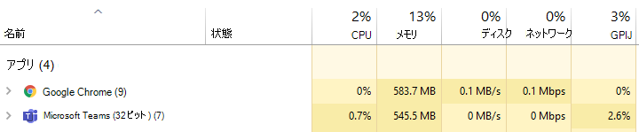
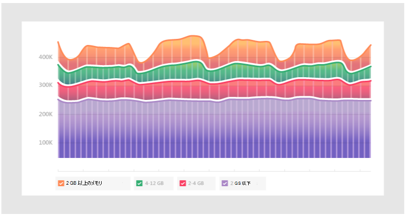
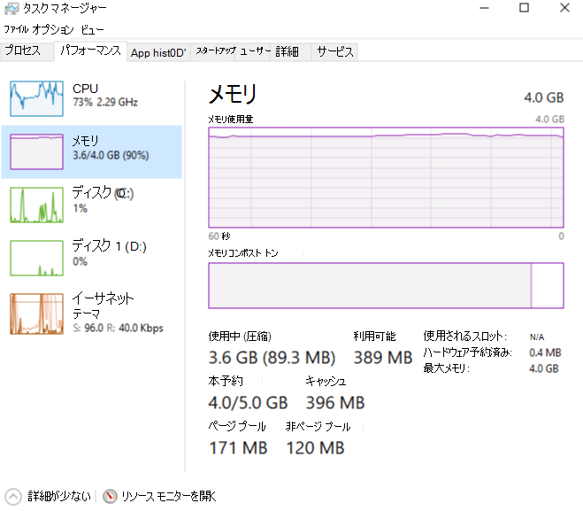

# Microsoft Teams のメモリ使用方法

一部の Microsoft Teams ユーザーは、Teams でのメモリの使い方について質問があります。 この記事では、Teams でメモリがどのように使用されるかについて説明します。また、Teams デスクトップアプリケーション (アプリ) と Teams web アプリでは、同じコンピューター上の他のアプリやワークロードが、適切に実行するために十分なメモリを持つことを防ぐことができません。 Teams は最新の web テクノロジを使用するように設計されています。 これを実現するために、Teams デスクトップクライアントは、Chromium を使ってレンダリングするために、電子に開発されました。 これは、Edge や Chrome など、多くの主要なブラウザーの背後にある同じレンダリングエンジンです。

## Teams のしくみ

電子版のチームでは、より迅速な開発が可能になり、さまざまなオペレーティングシステム (Windows、Mac、Linux) 間で Teams バージョン間のパリティも維持されます。 このパリティは、電子と Chromium がすべてのバージョンで同様のコードベースを維持するために可能です。 このアーキテクチャのもう1つの利点は、Teams web app とデスクトップバージョンの間に同じメモリ使用量プロファイルがあることです。 Web アプリとデスクトップバージョンはどちらも、ブラウザーで使用する場合と同様の方法でメモリを使用します。 電子情報の詳細については[、お客様の Web サイト](https://electronjs.org/)を参照してください。

詳しくは、「 [Chrome メモリの](https://chromium.googlesource.com/chromium/src.git/+/master/docs/memory/key_concepts.md) [Chromium メモリ使用量](https://www.chromium.org/developers/memory-usage-backgrounder)と重要な概念」をご覧ください。

次の画像は、Windows 用 Teams デスクトップアプリと Teams Web アプリ (この例では Google Chrome で実行されています) のメモリ使用量を並べて示しています。

## Teams でのメモリ使用量

システムメモリに含まれているチームの*予期*される動作を理解し、システムメモリの問題が本当に発生したときの症状を把握することが重要です。

### Teams によるメモリ使用量の期待値

Teams デスクトップアプリと Teams web アプリのどちらを実行していても、Chromium は利用可能なシステムメモリの量を検出し、そのメモリを利用してレンダリングエクスペリエンスを最適化します。 他のアプリやサービスがシステムメモリを必要とする場合、Chromium はこれらのプロセスにメモリを解放します。 Chromium は、現在実行されている内容に影響を与えることなくチームのパフォーマンスを最適化するために、チームのメモリ使用量を継続的に調整します。

このように、類似した Chromium のワークロードでは、使用可能なシステムメモリの量に応じて、さまざまな量のメモリを利用できます。

次の図は、4つの異なるシステム上のチームによるメモリ使用量を示しています。各システムでは、それぞれ異なるメモリ容量が使用されています。 各システムは同様のワークロードを処理しています (同じアプリを開いて実行しています)。

コンピューターにメモリが追加されている場合、チームはそのメモリを使用します。 メモリが不足しているシステムでは、チームはあまり使用しません。 

### システムメモリの問題の症状

コンピューターに次のいずれかの現象が表示される場合は、深刻なシステムメモリの問題が発生している可能性があります。

- 複数の大きなアプリケーションが同時に実行されている場合、メモリの使用量が高くなります。
- システムのパフォーマンスが低下したり、アプリケーションがハングしたりする。
- すべてのアプリで、90% 以上の全体的なシステムメモリ使用量が維持されます。 この量のメモリ使用量によって、チームは、他のアプリやワークロードにメモリを戻す必要があります。 90% のメモリ使用量が継続すると、チームはメモリをシステムに戻さないということになります。これは、問題を示します。

次の図は、システムメモリ使用量が異常に高い場合のタスクマネージャーのビューの例を示しています。

![タスクマネージャーの [チームメモリ使用量] ビュー](media/teams-memory-high-mem-process-list.png)

