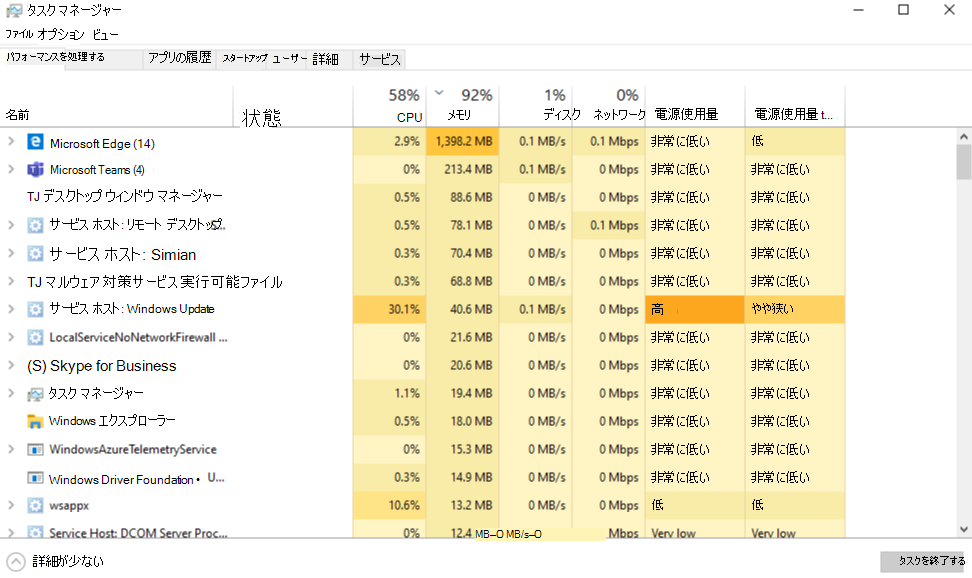

# Microsoft Teams のメモリ使用方法How Microsoft Teams uses memory

一部の Microsoft Teams ユーザーから、Teams によるメモリ使用方法について質問を受けています。Some Microsoft Teams users have questions about how Teams uses memory. この記事では、Teams がメモリを使用する方法を説明します。また、Teams デスクトップ アプリケーション (アプリ) と Teams Web アプリによって、同じコンピューター上の別のアプリとワークロードに最適な実行のための十分なメモリが渡されることが阻害されない理由を説明します。This article describes how memory is used by Teams, and why the Teams desktop application (app) and the Teams web app do not prevent other apps and workloads on the same computer from having enough memory to run optimally. Teams は先進の Web テクノロジを使用するように設計されています。Teams is designed to use modern web technology. これを実現するために、Teams のデスクトップ クライアントは Electron で開発されました。Electron はレンダリングに Chromium を使用します。To achieve this, the Teams desktop client was developed on Electron, which uses Chromium for rendering. これは、Microsoft Edge や Chrome など、現在人気のある多くのブラウザーで採用されているレンダリング エンジンと同じです。This is the same rendering engine behind many of today's most popular browsers, including Edge and Chrome.

## Teams のしくみHow Teams works

Electron で設計されている Teams を使用すると、迅速な展開が可能になります。また、異なるオペレーティング システム (Windows、Mac、Linux) 間の各種 Teams バージョン間で同一性を維持できます。Teams being designed on Electron allows for faster development, and it also maintains parity between Teams versions across different operating systems (Windows, Mac, and Linux). この同一性は、Electron と Chromium によってすべてのバージョンで同じコード ベースが維持されるので可能になります。This parity is possible because Electron and Chromium maintain a similar code base across all versions. このアーキテクチャのもう 1 つの利点は、Teams Web アプリとデスクトップのバージョンにおけるメモリ使用プロファイルが類似することです。Another advantage of this architecture is there's a similar memory usage profile between the Teams web app and the desktop version. Web アプリとデスクトップのどちらのバージョンでも、ブラウザーで使用する場合と同じようにメモリを使用します。Both the web app and the desktop versions use memory in a similar way to how a browser would use it. Electron について詳しくは、[こちらの Web サイト](https://electronjs.org/)を参照してください。More information about Electron is available at [their Web site](https://electronjs.org/).

詳しくは、「[Chromium のメモリ使用](https://www.chromium.org/developers/memory-usage-backgrounder)」および「[Chrome メモリにおける主要概念](https://chromium.googlesource.com/chromium/src.git/+/master/docs/memory/key_concepts.md)」をご覧ください。See [Chromium Memory Usage](https://www.chromium.org/developers/memory-usage-backgrounder) and [Key Concepts in Chrome Memory](https://chromium.googlesource.com/chromium/src.git/+/master/docs/memory/key_concepts.md) for more information.

次の画像では、Windows 用の Teams デスクトップ アプリと Teams Web アプリ (この例では Google Chrome で実行されています) のメモリ使用量を並べて示しています。The following image shows side-by-side memory usages of the Teams desktop app for Windows and the Teams Web app (in this example, running in Google Chrome).

## Teams でのメモリ使用量Memory usage in Teams

Teams がシステム メモリを使用する際に *予期される* 動作と、システム メモリの問題が実際に生じたときの症状について理解するのは重要です。It is important to understand the *expected* behavior of Teams when it comes to system memory, and to know the symptoms of truly problematic system memory issues.

### Teams による予期されるメモリ使用量Expected memory usage by Teams

Teams デスクトップ アプリと Teams Web アプリのどちらを実行しているとしても、使用可能なシステム メモリ量がChromium によって検出され、その中の十分な量のメモリを使用してレンダリング エクスペリエンスが最適化されます。Whether you're running the Teams desktop app or the Teams web app, Chromium detects how much system memory is available and utilizes enough of that memory to optimize the rendering experience. 他のアプリやサービスによってシステム メモリを必要とする場合、Chromium はそれらのプロセスにメモリを渡します。When other apps or services require system memory, Chromium gives up memory to those processes. Chromium は、現在実行中の他のものに影響を与えることなく Teams のパフォーマンスを最適化するために、Teams のメモリ使用量を継続的に調整します。Chromium tunes Teams memory usage on an ongoing basis in order to optimize Teams performance without impacting anything else currently running.

このようにして、Chromium ワークロードは、使用可能なシステム メモリ量に応じて変化するメモリ量を利用します。In this way, similar Chromium workloads can utilize varying amounts of memory, depending on the amount of system memory that is available.

次のグラフは、4 つの独立したシステムにおける Teams でのメモリ使用量を示しています。システムごとに使用できるメモリ量が異なります。The following graph depicts memory usage by Teams on four separate systems, each with different amounts of memory available. 各システムは同様のワークロードを処理しています (同じアプリを開いて実行しています)。Each of the systems is processing similar workloads (same apps open and running).

コンピューターに搭載されているメモリが多い場合、Teams はそのメモリを使用します。When computers have more memory, Teams will use that memory. メモリが十分にないシステムでは、Teams が使用するメモリは少なくなります。In systems where memory is scarce, Teams will use less.

### システム メモリの問題の症状Symptoms of system memory issues

使用しているコンピューターで、次の 1 つ以上の問題が発生する場合は、システム メモリに重大な問題がある可能性があります。If you see one or more of the following symptoms on your computer, you could have a serious system memory issue:

- 複数の大規模なアプリケーションを同時に実行しているときに、メモリ使用量が高くなります。High memory use when multiple large applications are running simultaneously.
- システムのパフォーマンスが低下する、またはアプリケーションがハングします。Slow system performance or applications hanging.
- すべてのアプリのシステム メモリ使用量全体が継続的に 90% 以上になります。Sustained overall system memory usage of 90% or higher across all apps. このメモリ使用量の場合、Teams は他のアプリおよびワークロードにメモリを戻す必要があります。With this amount of memory usage, Teams should be giving memory back to other apps and workloads. メモリ使用量が継続的に 90% になるということは、Teams がシステムにメモリを戻しておらず、問題が生じていることを示します。Sustained memory usage of 90% could mean Teams isn't giving memory back to the system, which indicates a problem.

次の画像は、システム メモリ使用率が異常に高い場合のタスク マネージャーのビューの例を示しています。The following images show examples of views in Task Manager when system memory usage is abnormally high.

