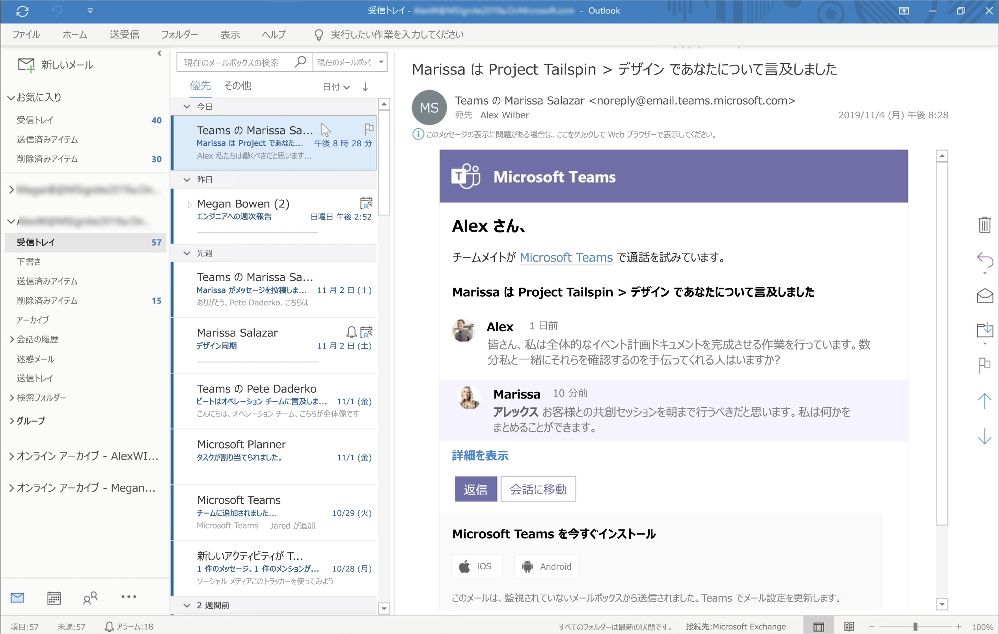
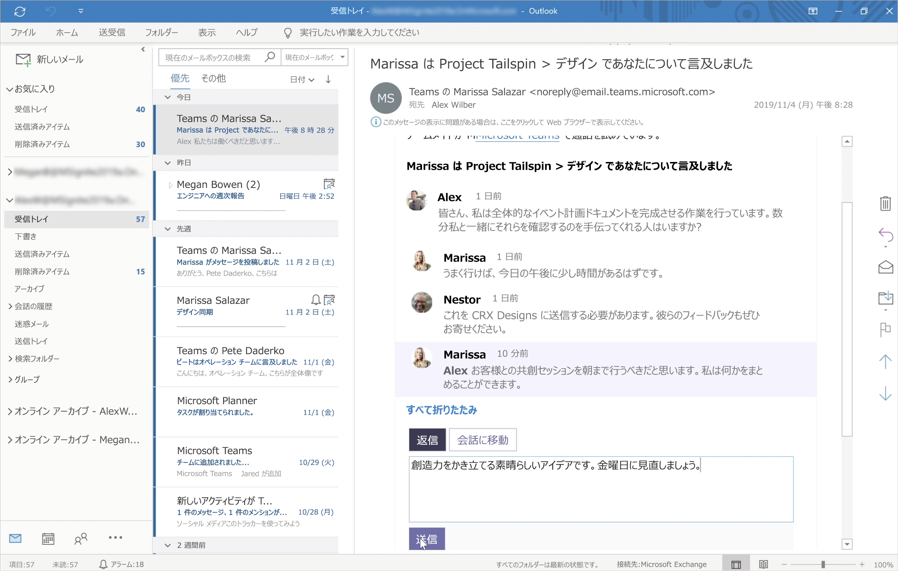

# Teams と Outlook のメールの統合

Microsoft Teams には、組織内のユーザーが Outlook のメールと Teams のチャットまたはチャネル会話の間で情報を簡単に共有し、見逃した会話を簡単に把握できる機能が含まれています。 この記事では、これらの機能と、適用される管理者のコントロールの概要について説明します。

## Outlook と共有

**Outlook と共有** すると、Teams を離れることなく、Outlook のメールに Teams の会話のコピーを共有できます。 この機能は、ユーザーが直属のチーム以外のユーザーや組織外のユーザーと会話やステータスの更新を共有する必要がある場合に便利です。  Teams で会話の一番上に移動し、[ **...その他のオプション**] を選択し、[**Outlook に共有する**] を選択します。  詳細については、「[Teams から Outlook に共有する](https://support.office.com/article/share-to-outlook-from-teams-f9dabbe9-9e9b-4e35-99dd-2eeeb67c4f6d)」をご覧ください。

![Teams の [Outlook に共有する] 機能を示すスクリーンショット](media/share-to-outlook.png)

この機能を使用するには、ユーザーに対して Outlook on the web がオンになっている必要があります。 Outlook on the web がオフになっている場合は、**Teams** のユーザーに対して、[Outlook に共有する] のオプションは表示されません。 Outlook on the web をオンまたはオフにする手順については、「[メールボックスメールボックス用に Outlook on the web を有効または無効にする](/exchange/recipients-in-exchange-online/manage-user-mailboxes/enable-or-disable-outlook-web-app)」をご覧ください。

## 操作可能なアクティビティ メール

ユーザーは、Teams で会話を見落としがあった際の助けになる、操作可能な見落としのあるアクティビティ メールを自動的に受け取ります。 見落としがあったアクティビティ メールには、見落としたメッセージの後に送信されたメッセージなど、会話の最新の返信が表示されます。ユーザーは、[**返信**] をクリックして Outlook から直接返信できます。 詳細については、「[Outlook から送信された、見落としがあったアクティビティ メールに返信する](https://support.office.com/article/reply-to-missed-activity-emails-from-outlook-bc0cf587-db26-4946-aac7-8eebd84f1381)」をご覧ください。 

> [!NOTE]
> この機能は、Outlook for Mac または一部の古いバージョンの Outlook for Windows ではサポートされていません。 詳細については、「[Outlook および Office 365 グループの操作可能なメッセージ](/outlook/actionable-messages/)」を参照してください。

[Set-OrganizationConfig](/powershell/module/exchange/organization/set-organizationconfig) コマンドレットと **SmtpActionableMessagesEnabled** パラメーターを使用して、操作可能なメールをオフにできます。 既定では、**smtpActionableMessagesEnabled** パラメーターは、**true** に設定されます。 パラメーターを **false** に設定すると、Office 365 全体で操作可能なメール メッセージがオフになります。  Teams ユーザーの場合、Outlook で直接 **返信** するオプションは、見落としがあったアクティビティ メールには利用できません。 その代わりに、見落としがあったアクティビティ メールには、[**Teams で返信する**] オプションが含まれ、ユーザーは Teams から返信することができます。

Outlook および Office [365 グループのアクション可能なメッセージも参照してください](https://docs.microsoft.com/outlook/actionable-messages/)。
