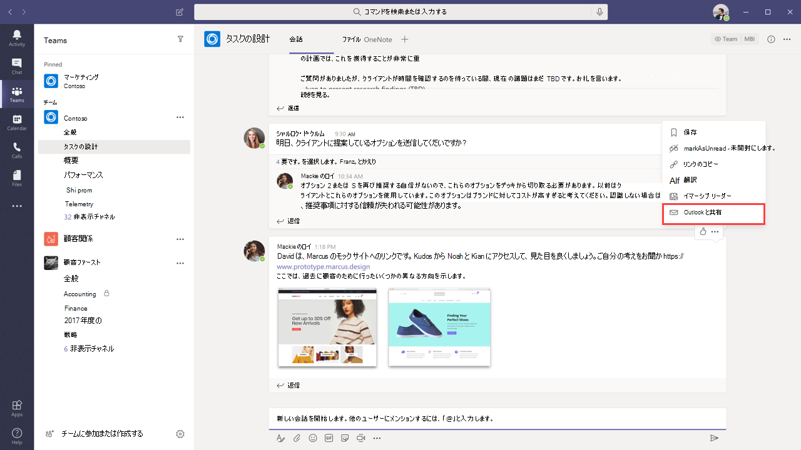

# チームと Outlook のメールの統合

Microsoft Teams には、Outlook のメール間で簡単に情報を共有したり、チーム内でチャットやチャネルで会話したりすることができるようにする機能が含まれています。 この記事では、これらの機能と、適用される管理コントロールの概要について説明します。

## Outlook に共有

[ **Outlook と共有] を**使用すると、チームの会話のコピーを outlook のメールに共有することができます。チームから脱退する必要はありません。 この機能は、ユーザーがすぐにチーム外のユーザーや組織のユーザーとの会話や状態の更新を共有する必要がある場合に便利です。 Teams のスレッドの一番上に移動して、[ **̇̇̇ More] オプション**を選び、[ **Outlook に共有**] を選びます。  詳細については、「 [Teams から Outlook への共有](https://support.office.com/article/share-to-outlook-from-teams-f9dabbe9-9e9b-4e35-99dd-2eeeb67c4f6d)」を参照してください。

この機能を使用するには、ユーザーに対して Outlook on the web を有効にする必要があります。 Outlook on the web がオフになっている場合、[ **outlook に共有** ] オプションはユーザーの Teams に表示されません。 Outlook on the web を有効または無効にする手順については、「 [outlook on the web on メールボックスを有効または無効](https://docs.microsoft.com/exchange/recipients-in-exchange-online/manage-user-mailboxes/enable-or-disable-outlook-web-app)にする」を参照してください。

## 操作可能なアクティビティのメール

ユーザーは、チーム内の不在着信した会話を把握するのに役立つ、利用可能な不在時のメールを自動的に取得します。 [不在時のアクティビティ] メールには、不在着信メッセージの後に送信されたメッセージなど、スレッドからの最新の返信が表示されます。ユーザーは [ **返信** ] をクリックして、Outlook 内から直接返信することができます。 詳細については、「outlook からの不在時の [メールへの返信](https://support.office.com/article/reply-to-missed-activity-emails-from-outlook-bc0cf587-db26-4946-aac7-8eebd84f1381) 」および「 [outlook および Office 365 グループの](https://docs.microsoft.com/outlook/actionable-messages/)操作可能なメッセージ」を参照してください。

**SmtpActionableMessagesEnabled**パラメーターと共に、設定された[組織構成](https://docs.microsoft.com/powershell/module/exchange/organization/set-organizationconfig)コマンドレットを使用して、アクション可能なメールをオフにすることができます。 既定では、 **SmtpActionableMessagesEnabled** パラメーターは **true**に設定されています。 このパラメーターを **false** に設定すると、Office 365 全体で操作可能なメールメッセージがオフになります。 Teams ユーザーの場合は、Outlook で直接応答する [ **返信** ] オプションは、不在時のメールでは利用できません。 代わりに、不在中のアクティビティのメールには、teams で返信するための **[teams で返信** ] オプションが含まれています。
