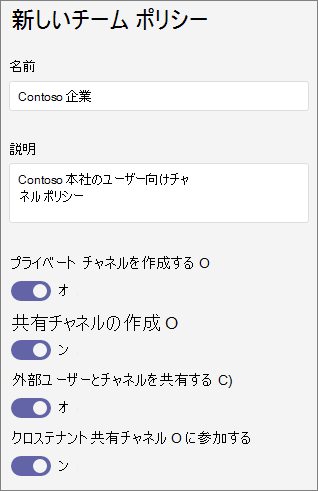

# <a name="manage-teams-policies-in-microsoft-teams"></a>Microsoft Teams でチーム ポリシーを管理する

管理者は、Microsoft Teams でチーム ポリシーを使用して、チームやチャネルで組織のユーザーが実行できる操作を制御できます。 たとえば、ユーザーが検索結果とチーム ギャラリーでプライベートのチームを検出できるかどうか、およびユーザーがプライベートのチャネルを作成できるかどうかを設定できます。

チーム ポリシーを管理するには、Microsoft Teams 管理センターで **[Teams]** > **[チーム ポリシー]** の順に移動します。 グローバル (組織全体の既定) ポリシーを使用することも、カスタム ポリシーを作成してユーザーに割り当てることもできます。 カスタム ポリシーを作成して割り当てていない場合、組織内のユーザーにはグローバル ポリシーが自動的に適用されます。

グローバル ポリシーを編集するか、カスタム ポリシーを作成して割り当てることもできます。 ユーザーにカスタム ポリシーが割り当てられると、そのポリシーがユーザーに適用されます。 ユーザーにカスタム ポリシーが割り当てられない場合は、グローバル ポリシーがユーザーに適用されます。 グローバルポリシーを編集するか、ポリシーを割り当てると、変更が有効になるまでに数時間かかることがあります。

## <a name="create-a-custom-teams-policy"></a>カスタムのチーム ポリシーを作成する

1. Microsoft Teams 管理センターの左側のナビゲーションで、**[Teams]** > **[チーム ポリシー]** の順に移動します。
2. **[追加]** をクリックします。
3. ポリシーの名前と説明を入力します。

    
4. 希望する設定を選びます。

- **プライベート チームの検索**:<a name="discoverteams"> </a> この設定をオンにすると、検索結果とチーム ギャラリーでプライベート チームを検出できるようになります。
- **プライベート チャネルの作成**: <a name="createchannels"> </a>この設定をオンにすると、ユーザーがプライベート チャネルを作成できるようになります。

5. **[保存]** をクリックします。

## <a name="edit-a-teams-policy"></a>チーム ポリシーの編集

グローバル ポリシー、または作成したカスタム ポリシーを編集できます。

1. Microsoft Teams 管理センターの左側のナビゲーションで、**[Teams]** > **[チーム ポリシー]** の順に移動します。
2. ポリシー名の左側をクリックしてポリシーを選び、**[編集]** をクリックします。
3. 希望する設定をオンまたはオフにしてから、**[保存]** をクリックします。

## <a name="assign-a-custom-teams-policy-to-users"></a>ユーザーにカスタムのチーム ポリシーを割り当てる

Microsoft Teams 管理センターを使用して、1 つ以上のユーザーまたは Skype for Business PowerShell モジュールにカスタム ポリシーを割り当てることで、セキュリティグループや配布グループなどのユーザーのグループにカスタム ポリシーを割り当てることができます。

### <a name="assign-a-custom-teams-policy-to-a-user"></a>ユーザーにカスタムのチーム ポリシーを割り当てる

1. Microsoft Teams 管理センターの左側のナビゲーションで、**[ユーザー]** に移動してユーザーをクリックします。
2. **[ポリシー]** をクリックし、**[割り当てられたポリシー]** の横にある **[編集]** をクリックします。
3. **[チーム ポリシー]** で割り当てるポリシーを選択し、**[保存]** をクリックします。

一度に複数のユーザーにカスタムのチーム ポリシーを割り当てる方法については、「[一括で Teams のユーザー設定を編集する](edit-user-settings-in-bulk.md)」を参照してください。

または、次の操作も実行できます。

1. Microsoft Teams 管理センターの左側のナビゲーションで、**[Teams]** > **[チーム ポリシー]** の順に移動します。
2. ポリシー名の左側をクリックしてポリシーを選びます。
3. [**ユーザーを管理**] を選択します。
4. [**ユーザーを管理**] ウィンドウで、表示名またはユーザー名でユーザーを検索し、名前を選択して [**追加**] を選びます。 追加するユーザーごとに、この手順を繰り返します。
5. ユーザーの追加が完了したら、[**保存**] をクリックします。

### <a name="assign-a-custom-teams-policy-to-users-in-a-group"></a>グループのユーザーにカスタムのチーム ポリシーを割り当てる

ユーザー設定のチームポリシーは、既に特定した複数のユーザーに割り当てることができます。 たとえば、セキュリティ グループのすべてのユーザーにポリシーを割り当てることができます。 これを行うには、Graph 用 Azure Active Directory PowerShell モジュールと Skype for Business PowerShell モジュールに接続します。 PowerShell を使用して Teams を管理する方法の詳細については、「[Teams での PowerShell の概要](teams-powershell-overview.md)」を参照してください。

この例では、「Marketing Teams Policy」という名前のチーム ポリシーを、Contoso マーケティング グループのすべてのユーザーに割り当てます。  

> [!NOTE]
> 「[単一の Windows PowerShell ウィンドウですべての Office 365 サービスに接続する](https://docs.microsoft.com/office365/enterprise/powershell/connect-to-all-office-365-services-in-a-single-windows-powershell-window)」の手順に従って、必ず最初に Azure Active Directory PowerShell for Graph モジュールと Skype for Business PowerShell モジュールに接続してください。

特定のグループの GroupObjectId を取得します。
```PowerShell
$group = Get-AzureADGroup -SearchString "Contoso Marketing"
```
指定したグループのメンバーを取得します。
```PowerShell
$members = Get-AzureADGroupMember -ObjectId $group.ObjectId -All $true | Where-Object {$_.ObjectType -eq "User"}
```
グループ内のすべてのユーザーを特定のチーム ポリシーに割り当てる。 この例では、Marketing Teams Policy です。
```PowerShell
$members | ForEach-Object { Grant-CsTeamsChannelsPolicy -PolicyName "Marketing Teams Policy" -Identity $_.UserPrincipalName}
``` 
グループ内のメンバー数によっては、このコマンドの実行に数分かかる場合があります。

## <a name="related-topics"></a>関連項目

- [Teams でプライベート チームの検索を管理する](manage-discovery-of-private-teams.md)
- [Teams のプライベート チャネル](private-channels.md)
