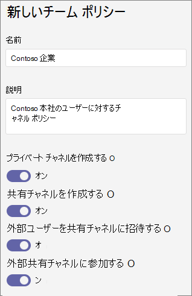

# <a name="manage-teams-policies-in-microsoft-teams"></a>Microsoft Teams でチームポリシーを管理する

管理者は、Microsoft Teams のチームポリシーを使って、チームとチャネルで組織内のユーザーが実行できる操作を制御することができます。 たとえば、検索結果とチームギャラリーでプライベートチームの検出を許可するかどうか、およびユーザーがプライベートチャネルの作成を許可されているかどうかを設定できます。

チームポリシーを管理するには、Microsoft teams 管理センターで**teams** > **teams のポリシー**に移動します。 グローバル (組織全体の既定) ポリシーを使用するか、カスタムポリシーを作成してユーザーに割り当てることができます。 組織内のユーザーは、カスタムポリシーを作成して割り当てる場合を除き、自動的にグローバルポリシーを取得します。

グローバルポリシーを編集するか、カスタムポリシーを作成して割り当てることができます。 ユーザーにカスタムポリシーが割り当てられている場合は、そのポリシーがユーザーに適用されます。 ユーザーにカスタムポリシーが割り当てられていない場合は、グローバルポリシーがユーザーに適用されます。 グローバルポリシーを編集するか、ポリシーを割り当てると、変更が有効になるまで最大24時間かかることがあります。

## <a name="create-a-custom-teams-policy"></a>カスタムチームポリシーを作成する

1. Microsoft Teams 管理センターの左のナビゲーションで、[**チーム** > **チームのポリシー**] に移動します。
2. [**追加**] をクリックします。
3. ポリシーの名前と説明を入力します。

    
4. 目的の設定を選択します。

- **プライベートチーム**を見つける<a name="discoverteams"></a> : この設定を有効にして、ユーザーが検索結果とチームギャラリーでプライベートチームを見つけられるようにします。
- **プライベートチャネル**を作成<a name="createchannels"></a>する: この設定を有効にして、ユーザーがプライベートチャネルを作成できるようにします。

5. [**保存**] をクリックします。

## <a name="edit-a-teams-policy"></a>Teams のポリシーを編集する

グローバルポリシーまたは作成したカスタムポリシーを編集できます。

1. Microsoft Teams 管理センターの左のナビゲーションで、[**チーム** > **チームのポリシー**] に移動します。
2. ポリシー名の左側をクリックしてポリシーを選択し、[**編集**] をクリックします。
3. 目的の設定をオンまたはオフにして、[**保存**] をクリックします。

## <a name="assign-a-custom-teams-policy-to-users"></a>ユーザーにカスタムチームポリシーを割り当てる

Microsoft Teams 管理センターを使用して、ユーザー設定のポリシーを1人以上のユーザーまたは Skype for Business PowerShell モジュールに割り当てて、セキュリティグループや配布グループなどのユーザーグループにカスタムポリシーを割り当てることができます。

### <a name="assign-a-custom-teams-policy-to-a-user"></a>ユーザーにカスタムのチームポリシーを割り当てる

1. Microsoft Teams 管理センターの左のナビゲーションで、[**ユーザー**] に移動し、ユーザーをクリックします。
2. [**ポリシー**] をクリックし、[**割り当てられたポリシー**] の横にある [**編集**] をクリックします。
3. [**チームポリシー**] で、割り当てるポリシーを選択し、[**保存**] をクリックします。

ユーザー設定のチームポリシーを一度に複数のユーザーに割り当てるには、「 [teams のユーザー設定を一括](edit-user-settings-in-bulk.md)して編集する」を参照してください。

または、次の操作も行うことができます。

1. Microsoft Teams 管理センターの左のナビゲーションで、[**チーム** > **チームのポリシー**] に移動します。
2. ポリシー名の左側をクリックして、ポリシーを選択します。
3. [**ユーザーの管理**] を選びます。
4. [**ユーザーの管理**] ウィンドウで、[表示名] または [ユーザー名] でユーザーを検索し、名前を選択して [**追加**] を選択します。 追加するユーザーごとに、この手順を繰り返します。
5. ユーザーの追加が完了したら、[**保存**] をクリックします。

### <a name="assign-a-custom-teams-policy-to-users-in-a-group"></a>ユーザー設定のチームポリシーをグループ内のユーザーに割り当てる

ユーザー設定のチームポリシーは、既に特定した複数のユーザーに割り当てることができます。 たとえば、セキュリティグループ内のすべてのユーザーにポリシーを割り当てることができます。 これを行うには、Azure Active Directory PowerShell for Graph モジュールと Skype for Business PowerShell モジュールに接続します。 PowerShell を使用して Teams を管理する方法の詳細については、「[Teams での PowerShell の概要](teams-powershell-overview.md)」を参照してください。

この例では、"マーケティングチームポリシー" というチームポリシーを、Contoso マーケティンググループのすべてのユーザーに割り当てています。  

> [!NOTE]
> 「[単一の Windows PowerShell ウィンドウですべての Office 365 サービスに接続する](https://docs.microsoft.com/office365/enterprise/powershell/connect-to-all-office-365-services-in-a-single-windows-powershell-window)」の手順に従って、必ず最初に Azure Active Directory PowerShell for Graph モジュールと Skype for Business PowerShell モジュールに接続してください。

特定のグループの GroupObjectId を取得します。
```
$group = Get-AzureADGroup -SearchString "Contoso Marketing"
```
指定したグループのメンバーを取得します。
```
$members = Get-AzureADGroupMember -ObjectId $group.ObjectId -All $true | Where-Object {$_.ObjectType -eq "User"}
```
グループ内のすべてのユーザーを特定のチームポリシーに割り当てます。 この例では、マーケティングチームポリシーについてご紹介します。
```
$members | ForEach-Object { Grant-CsTeamsChannelsPolicy -PolicyName "Marketing Teams Policy" -Identity $_.EmailAddress}
``` 
グループ内のメンバー数によっては、このコマンドの実行に数分かかる場合があります。

## <a name="related-topics"></a>関連項目

- [Teams でプライベート チームの検索を管理する](manage-discovery-of-private-teams.md)
- [Teams のプライベートチャネル](private-channels.md)
