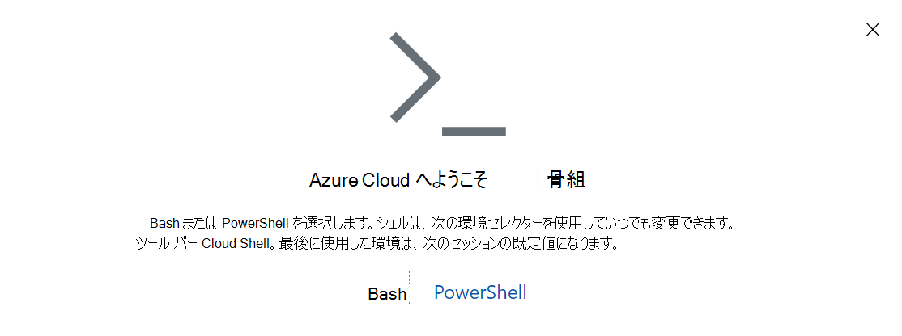

# <a name="manage-teams-with-microsoft-teams-powershell"></a>Microsoft Teams PowerShell を使用して Teams を管理する

この記事では、Microsoft Teams PowerShell を使用して Teams とSkype for Businessを管理する方法について説明します。

このガイダンスは、[Microsoft Teams コマンドレットリファレンス](/powershell/teams/?view=teams-ps)と[Skype for Businessコマンドレットリファレンス](/powershell/skype/intro?view=skype-ps)と組み合わせて使用します。

Teams 管理センターで Teams を管理するには、「[Azure Cloud Shellを使用した Teams の管理](#manage-teams-with-azure-cloud-shell)」を参照してください。

## <a name="create-and-manage-teams-using-powershell"></a>PowerShell を使用してチームを作成および管理する

チームを作成し管理するためのコマンドレットは、[Microsoft Teams PowerShell モジュール](https://www.powershellgallery.com/packages/MicrosoftTeams/)にあります。

Teams はOffice 365 グループによってサポートされるため、チームを作成するときはグループを作成します。 コア チームとその設定を操作するためのコマンドレット (``new-team``、``get-team``、``set-team``)、チームのユーザーを管理するためのコマンドレット (``add-teamuser``、``remove-teamuser``)、およびチームのチャネルを管理するためのコマンドレット (``new-teamchannel``、``remove-teamchannel``) のセットが用意されています。 これらのコマンドレットはすべてエンド ユーザーとして実行できますが、自分が所有している、またはメンバーであるチームのみが機能します。 グローバル 管理または Teams 管理者の場合は、組織内のすべてのチームを操作できます。

```powershell
New-Team -DisplayName "Contoso Marketing" -Description "Collaboration space for Contoso's Marketing department"
```

> [!NOTE]
> Microsoft Teams PowerShell モジュールのコマンドレットで使用されている **GroupId** は、Exchange PowerShell モジュールで ``Get-UnifiedGroup`` により返された **Identity** プロパティと同じです。

## <a name="manage-teams-with-azure-cloud-shell"></a>Azure Cloud Shellを使用して Teams を管理する

Cloud Shellは、リソースを管理できる、対話型で認証されたブラウザーからアクセス可能なシェルです。 Cloud Shellの詳細については、「[Azure Cloud Shell](/azure/cloud-shell/overview)」を参照してください。

Azure Cloud Shellにアクセスし、PowerShell を使用して Teams を管理するには、Teams 管理センターにサインインします。

1. 右上隅にあるCloud Shell アイコンを選択します。

    

1. メッセージが表示されたら、 **PowerShell** を選択します。

    

1. Teams PowerShell セッションを開始するには、次のコマンドを実行します。

    ```powershell
    Connect-MicrosoftTeams
    ```

これらの手順を完了したら、Teams PowerShell コマンドを実行する準備が整いました。

> [!IMPORTANT]
> Cs* コマンドレットを使用する場合は、最初にコマンドを使用して Teams に接続する ``Connect-MicrosoftTeams -UseDeviceAuthentication`` 必要があります。

## <a name="manage-policies-via-powershell"></a>PowerShell を使用してポリシーを管理する

> [!NOTE]
> - オンライン コネクタSkype for Business Teams PowerShell に統合されています。 現在、パブリック プレビューで利用できます。 Teams に適用されるSkype for Business Online コマンドレットは、Teams PowerShell モジュールでネイティブに使用できるようになります。 インストール手順については、 [Teams PowerShell のインストールに関する](teams-powershell-install.md) 記事を参照してください。
> - Skype for Business Online に接続すると、PowerShell セッションでコマンドレットを使用できるようになります。 詳細については、「[Office 365 PowerShell を使用して Skype for Business Online を管理する](/office365/enterprise/powershell/manage-skype-for-business-online-with-office-365-powershell)」を参照してください。

[Skype for Business コマンドレット モジュール](/powershell/module/teams)でポリシーを管理するためのコマンドレットを見つけます。

ポリシーは、個々のユーザーに細かく適用できる設定のまとまりです。 各ポリシーの種類にはポリシーそのものの作成、表示、削除、更新を行い、これらのポリシーをユーザーに割り当てるための独自のコマンドレットのセットがあります。 一般的な構成は次のとおりです。

- **GET** コマンド (たとえば): ``Get-CsTeamsMeetingPolicy``組織で割り当て可能なポリシー ドキュメントを返します。これには、Microsoft が使用するために作成したポリシーや、作成したカスタム ポリシーが含まれます。
  - 組織内で作成したカスタム ポリシーのみを検索するには、 ``-Filter "tag:*"``.

- **NEW** コマンド (たとえば): ``New-CsTeamsMeetingPolicy``組織内のユーザーに割り当てる組織の新しいポリシーを作成します。 すべてのポリシーがカスタム ポリシーの作成をサポートするわけではありません。 多くの場合、組織で使用するポリシーに、サポート対象の設定の組み合わせがあることを確認するためです。

- **SET** コマンド (たとえば): ``Set-CsTeamsMeetingPolicy``特定のポリシーの特定の値を設定します。 一部のポリシーには SET コマンドが使用できないか、ポリシーでカスタマイズできないパラメーターが含まれています。 PowerShell の説明では、カスタマイズできないパラメーターが示されています。
  - カスタム ポリシーが割り当てられていない組織内のユーザーに既定で割り当てられるポリシーを編集するには、``Set-Cs<PolicyName> -Identity Global`` を実行します。

- **REMOVE** コマンド (たとえば): ``Remove-CsTeamsMeetingPolicy``テナントに作成されたカスタム ポリシーを削除します。 組織内の少なくとも 1 人のユーザーに割り当てられているカスタム ポリシーを削除した場合、そのユーザーはグローバル ポリシーに戻ります。
  - 実際に組織内のグローバル ポリシーを削除することはできませんが、組織内のグローバル ポリシーを Microsoft が提供する既定の設定にリセットする場合は、実行 ``Remove-Cs<PolicyName> -Identity Global``します。

- **GRANT** コマンド (たとえば): ``Grant-CsTeamsMeetingPolicy``特定のユーザーにポリシーを割り当てます。
  - カスタム ポリシーの割り当てを削除し、組織の既定のポリシーにユーザーを戻すには、``Grant-Cs<PolicyName> -Identity <User Identity> -PolicyName $null`` を実行します。

> [!TIP]
> すべてのポリシーでカスタム ポリシーの作成が許可されているわけではなく、一部のポリシーにはカスタマイズできない設定が含まれています (そのため、設定は表示できますが、``set-`` と``new-`` の間にカスタム値を設定できません)。 各コマンドレットのドキュメントでは、お客様がパラメーターを使用できるかどうかを示しています。

共通パラメーター:

- **Identity**: ``Get-``、``Set-``、``New-``、``Remove-`` の場合、**Identity** パラメーターは常に特定のポリシー インスタンスを参照します。 ``Grant`` の場合、**Identity** パラメーターは、ポリシーが適用されている特定のユーザー オブジェクトを参照します。

## <a name="manage-configurations-via-powershell"></a>PowerShell を使用して構成を管理する

[Skype for Business コマンドレット モジュール](/powershell/module/skype)で、構成を管理するためのコマンドレットを見つけます。

構成は、ユーザー レベルでは指定できない、サービスで管理される設定のバケットです。 設定は常に組織全体に適用されます。 グローバル構成は、組織で唯一の有効な構成です。 各構成の種類には、次の 2 つの主なコマンドレットが用意されています。

- ``Get-Cs<ConfigurationName>`` (例: ``Get-CsTeamsClientConfiguration``):

- SET コマンド (例:``Set-CsTeamsClientConfiguration`` ): その種類の構成でプロパティを設定します。 変更するパラメーターを指定します。
    > [!NOTE]
    > **Identity Global** の指定、または ``Get-Cs<ConfigurationName>`` | ``Set-Cs<ConfigurationName>`` の実行のいずれかの方法で変更を行っている構成を参照できます。

## <a name="what-can-each-admin-role-do"></a>管理者の役割がそれぞれできること

[Microsoft Teams 管理者ロールを使用して Teams を管理し](using-admin-roles.md)、各 PowerShell コマンドレットを実行できる管理者ロールを理解する方法について説明します。

## <a name="related-topics"></a>関連項目

[Teams Powershell のインストール](teams-powershell-install.md)

[Teams PowerShell のリリース ノート](teams-powershell-release-notes.md)

[Teams コマンドレット リファレンス](/powershell/teams/?view=teams-ps)

[Skype for Business コマンドレット リファレンス](/powershell/skype/intro?view=skype-ps)

[Teams 管理者ロールを使用してTeams を管理します](using-admin-roles.md)
