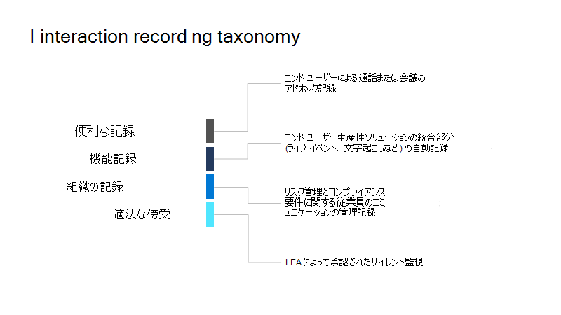
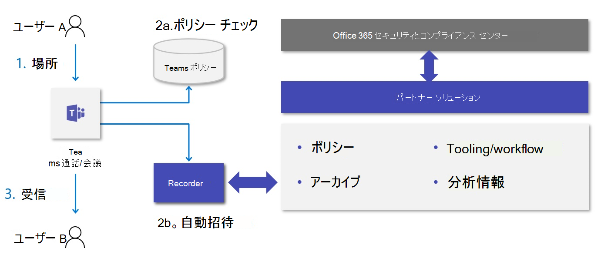

# <a name="introduction-to-teams-policy-based-recording-for-callings--meetings"></a>通話 & 会議用の Teams ポリシーベースのレコーディングの概要

ポリシーベースのレコーディングでは、管理ポリシーを使用して、通話や会議に Microsoft Teams を採用した組織が、関連する企業または規制ポリシーによって要求された後の処理および保存のために、通話やオンライン会議を自動的に記録してキャプチャする必要がある場合に利用できます。

Teams では、チームの通信を構成、管理、記録、保存、および分析するためのエンドツーエンドソリューションを提供するために必要なプラットフォーム機能、ユーザーエクスペリエンス、管理インターフェイスなど、サードパーティの記録ソリューションの統合をサポートするように強化されています。 これには、通信プラットフォーム Api と記録するイベントが含まれます。次の情報が提供されます。

- オーディオ、ビデオ、画面共有、およびチャットのための、デバイス間およびサポートされているすべてのエンドポイントにわたるシームレスな高品質メディアのキャプチャ。

- Teams ユーザーとサポートされている通話エンドポイント (Teams、Teams Mobile、Skype for Business、PSTN) の間での操作のキャプチャのサポート

- 既存のチーム管理者との統合、会議のツールとポリシーの統合など、コンプライアンスの記録用の新しい管理ポリシー

コンプライアンス記録を有効にするには、Microsoft 365 A3/A5/E3/E5/ビジネス Premium および Office 365 A3/A5/E3 ユーザーを使用できます。 

コンプライアンス記録ソリューションの統合機能も、 [<span class="underline">コンプライアンス記録と Microsoft Teams セッション</span>](https://myignite.techcommunity.microsoft.com/sessions/83184?source=sessions)の Ignite 2019 でレビューされています。

## <a name="teams-interaction-recording-overview"></a>チームの対話式記録の概要

相互作用記録ユースケースは、画像に示すように、便利、機能、組織、合法的なの4つの主要なカテゴリに実質的に分けることができます。



各カテゴリには、レコーディングの開始方法、記録される内容、レコーディングの保存場所、通知するユーザー、アクセスを制御するユーザー、および保持の処理方法について、さまざまな要件があります。

| 種類                   | 効率        | 機能         | 組織-一般      | 組織規制 | 合法的な切片   |
| ---------------------- | ------------------ | ------------------ | ------------------ | --------------- | ------------------ |
| ・              | ユーザー               | アプリ/ソリューション       | 管理 (システム)     | 管理 (システム)  | LEA                |
| Target                 | 電話ごと/会議 | 電話ごと/会議 | 電話ごと/会議 | ユーザーごと        | エンドポイント/DID |
| 記憶域の所有者          | ユーザー               | アプリ                | 同期              | コンプライアンス      | LEA                |
| 通知が必要ですか? | はい                | はい                | はい                | はい             | いいえ                 |
| Access の所有者           | ユーザー               | アプリ                | 同期              | コンプライアンス      | LEA                |
| アイテム保持ポリシー      | 省略可能           | はい                | はい                | はい             | はい                |

Teams には、会議やライブイベントに関する [<span class="underline">便利</span>](https://docs.microsoft.com/microsoftteams/cloud-recording) で機能的な記録のためのさまざまな機能が用意されています。 組織の記録とは、管理ポリシーを利用して、通話や会議のためのチームを採用する組織を、関連する企業または規制ポリシーによって要求された後の処理および保持のために自動的に記録し、キャプチャする必要がある場合に役立ちます。 このポリシーの下のユーザーは、チームとのデジタル操作が記録されているが、操作が完了するとレコーディングへのアクセスが許可されていないことを認識します。 レコーディングは、電子情報開示、法的保持、およびその他の企業留保の使用について、コンプライアンスおよび法務担当者が利用できる組織アーカイブの一部になります。

## <a name="example-user-needs"></a>ユーザーニーズの例

<table>
<thead>
<tr class="header">
<th><strong>代表</strong></th>
<th><strong>不要</strong></th>
</tr>
</thead>
<tbody>
<tr class="odd">
<td>記録されたユーザー</td>
<td><ul>
<li><p>レコーディングの進行中に通知されます。</p></li>
<li><p>ポリシーまたはレコーダーエラーが原因で、呼び出し動作の変更が発生した場合に通知されます。</p></li>
</ul></td>
</tr>
<tr class="even">
<td>通信管理者</td>
<td><ul>
<li><p>記録ポリシーを Teams ユーザー/エンドポイントに適用/適用する理由とその方法について説明します。</p></li>
<li><p>組織のチーム記録ポリシーを構成および管理します。</p></li>
<li><p>チームの通話と会議に関するレコーディング関連の問題を監視してトラブルシューティングします。</p></li>
<li><p>利用状況、品質、信頼性についての運用分析によって、社内の法令遵守責任者をサポートします。</p></li>
</ul></td>
</tr>
<tr class="odd">
<td>法令遵守責任者</td>
<td><ul>
<li><p>適切な地域境界でコンプライアンス義務を満たすために必要な方法で、すべてのチームの通信を収集します。</p></li>
<li><p>コミュニケーション関連のメタデータまたは操作の内容に基づいて、相互作用を検索します。 一般的な例を次に示します。</p>
<ul>
<li><p><strong>メタデータ</strong> - 参加者、時刻、方向、ダイヤル番号、発信者番号、カスタムビジネスデータ</p></li>
<li><p><strong>コンテンツ</strong> –議事録、感情、ふりがな、関連する操作</p></li>
</ul></li>
<li><p>収集された通信を監視して、収集された通信を監視する機能など、収集された通信を分析し、操作します。</p></li>
<li><p>収集された通信のセキュリティを確保し、すべての段階で改ざんされないようにします。</p></li>
</ul></td>
</tr>
</tbody>
</table>

## <a name="solution-architecture-overview"></a>ソリューションアーキテクチャの概要

コンプライアンス記録ソリューションは、次の図に示すように Teams に統合されています。



## <a name="recorder"></a>記録

コンプライアンス記録ソリューションのコアコンポーネントは記録ツールです。
レコーダーは、 [<span class="underline">microsoft の通信プラットフォームを利用</span>](https://docs.microsoft.com/graph/cloud-communications-concept-overview) し、microsoft Graph でアプリケーションを登録する、スケーラブルな Azure ベースのサービス (ボット) として構築されます。 レコーダーは、Teams の通話と会議 [<span class="underline">通信プラットフォーム api</span>](https://docs.microsoft.com/graph/api/resources/communications-api-overview?view=graph-rest-1.0) との直接操作を提供し、メディアの取り込みのエンドポイントを提供します。

[ [<span class="underline">コンプライアンス記録のサンプル] アプリケーションを使用</span>](https://github.com/microsoftgraph/microsoft-graph-comms-samples/tree/a3943bafd73ce0df780c0e1ac3428e3de13a101f/Samples/BetaSamples/LocalMediaSamples/ComplianceRecordingBot) すると、ボットの構成、アプリインスタンスの作成、コンプライアンスポリシーの割り当てを行うことができます。 また、このサンプルには、 [<span class="underline">着信通話</span>](https://github.com/microsoftgraph/microsoft-graph-comms-samples/blob/a3943bafd73ce0df780c0e1ac3428e3de13a101f/Samples/BetaSamples/LocalMediaSamples/ComplianceRecordingBot/FrontEnd/Http/Controllers/PlatformCallController.cs#L199-L244) ルーティングの処理、 [<span class="underline">記録状態の変更</span>](https://github.com/microsoftgraph/microsoft-graph-comms-samples/blob/a3943bafd73ce0df780c0e1ac3428e3de13a101f/Samples/BetaSamples/LocalMediaSamples/ComplianceRecordingBot/FrontEnd/Bot/CallHandler.cs#L135-L138)、記録されている [<span class="underline">ユーザーの削除</span>](https://github.com/microsoftgraph/microsoft-graph-comms-samples/blob/a3943bafd73ce0df780c0e1ac3428e3de13a101f/Samples/BetaSamples/LocalMediaSamples/ComplianceRecordingBot/FrontEnd/Bot/CallHandler.cs#L121-L126)など、特定の操作を記録するための API の使用例も用意されています。
[<span class="underline">UpdateRecordingStatus</span>](https://docs.microsoft.com/graph/api/call-updaterecordingstatus?view=graph-rest-1.0&tabs=http)と[<span class="underline">incomingContext</span>](https://docs.microsoft.com/graph/api/resources/incomingcontext?view=graph-rest-1.0)については、特定の api に関するグラフドキュメントを参照してください。

レコーダーサービスの正確な実装はパートナーによって異なりますが、展開の高可用性と地理的分布を実現するために、複数のレコーダーをサポートするように設計する必要があります。これは、チームの待機時間を削減するためです。 また、復元性と冗長性を考慮して設計されていることが想定されています。

パートナーは、コンプライアンスの記録統合の要件がすべてサポートされていることを確認するために、認定のために microsoft Graph communications Api と Sdk の最低限必要なリリースバージョンを確認する必要があります。

コンプライアンス記録シナリオの基本として、次の2つの要件があります。

- レコーダーボットは Azure に展開する必要があります

- レコーダーボットは Azure の Windows VM で実行する必要があります

Azure と Windows の VM の要件は、Teams ボットコンポーネントにのみ適用されます。つまり、パートナーは、コンプライアンスの記録に関連するパフォーマンスと機能要件を満たすことができる、選択肢のその他のプラットフォームを実装することができます。

## <a name="compliance-recording-policy-assignment-and-provisioning"></a>コンプライアンス記録ポリシーの割り当てとプロビジョニング

IT 管理者は、コンプライアンス記録ポリシーを作成して割り当てることによって、どのユーザーを記録し、各ユーザーにどのような記録を使用するかを決定することができます。 レコーダーは、通信操作が行われたときに、これらのポリシーの構成に基づいて、会話に参加するために自動的に招待されます。 コンプライアンス記録ポリシーは、 [<span class="underline">Microsoft Powershell</span>](https://docs.microsoft.com/microsoftteams/teams-powershell-overview) を使用して管理され、各組織のテナント、ユーザーごと、セキュリティグループのレベルで適用できます。 [<span class="underline">会議ポリシー</span>](https://docs.microsoft.com/microsoftteams/meeting-policies-in-teams)、[<span class="underline">通話ポリシー</span>](https://docs.microsoft.com/microsoftteams/teams-calling-policy) 、[<span class="underline">グループポリシー</span>](https://docs.microsoft.com/microsoftteams/assign-policies#assign-a-policy-to-a-group)の詳細については、Microsoft ドキュメントを参照してください。

1. テナントでアプリケーションインスタンスを作成します。

   ```powershell
   PS C:\> New-CsOnlineApplicationInstance -UserPrincipalName cr.instance@contoso.onmicrosoft.com -DisplayName ComplianceRecordingBotInstance -ApplicationId fcc88ff5-a42d-49cf-b3d8-f2e1f609d511

   RunspaceId        : 4c13efa6-77bc-42db-b5bf-bdd62cdfc5df
   ObjectId          : 5069aae5-c451-4983-9e57-9455ced220b7
   TenantId          : 5b943d7c-5e14-474b-8237-5022eb8e0dc9
   UserPrincipalName : cr.instance@contoso.onmicrosoft.com
   ApplicationId     : fcc88ff5-a42d-49cf-b3d8-f2e1f609d511
   DisplayName       : ComplianceRecordingBotInstance
   PhoneNumber       :
   ```

   ```powershell
   PS C:\> Sync-CsOnlineApplicationInstance -ObjectId 5069aae5-c451-4983-9e57-9455ced220b7
   ```

2. コンプライアンスの記録ポリシーを作成します。

   ```powershell
   PS C:\> New-CsTeamsComplianceRecordingPolicy -Identity TestComplianceRecordingPolicy -Enabled $true -Description "Test policy created by tenant admin"

   Identity                        : Global
   ComplianceRecordingApplications : {}
   Enabled                         : True
   WarnUserOnRemoval               : True
   Description                     : Test policy created by tenant admin
   ```

   ```powershell
   PS C:\> Set-CsTeamsComplianceRecordingPolicy -Identity TestComplianceRecordingPolicy `
   -ComplianceRecordingApplications @(New-CsTeamsComplianceRecordingApplication -Id 5069aae5-c451-4983-9e57-9455ced220b7 -Parent TestComplianceRecordingPolicy)
   ```

   [<span class="underline">Set-CsTeamsComplianceRecordingPolicy</span>](https://docs.microsoft.com/powershell/module/skype/set-csteamscompliancerecordingpolicy?view=skype-ps)

3. コンプライアンスの記録ポリシーをユーザーに割り当てます。

   ```powershell
   PS C:\> Grant-CsTeamsComplianceRecordingPolicy -Identity testuser@contoso.onmicrosoft.com -PolicyName TestComplianceRecordingPolicy
   ```

   [<span class="underline">Grant-CsTeamsComplianceRecordingPolicy</span>](https://docs.microsoft.com/powershell/module/skype/grant-csteamscompliancerecordingpolicy?view=skype-ps)

   ```powershell
   PS C:\> Get-CsOnlineUser testuser@contoso.onmicrosoft.com | select SipAddress, TenantId, TeamsComplianceRecordingPolicy | fl

   UserPrincipalName              : testuser@contoso.onmicrosoft.com
   TenantId                       : 5b943d7c-5e14-474b-8237-5022eb8e0dc9
   TeamsComplianceRecordingPolicy : TestComplianceRecordingPolicy
   ```

## <a name="user-experiences"></a>ユーザーエクスペリエンス

チームクライアントエクスペリエンスを使用して、通知のサポートを有効にします。 エクスペリエンスは、ビジュアルとオーディオのいずれかになります。

**チームクライアント-視覚的な通知**
- デスクトップ/web
- モバイル (iOS/Android)
- Teams 電話
- Teams のルーム

**その他のエンドポイント-音声通知**
- SIP 電話
- Skype for Business
- 電話会議
- PSTN 発信者

## <a name="compliance-recording-for-teams-certification-programs"></a>Teams 認定プログラムのコンプライアンス記録

一般に公開されている Api を公開することにより、パートナーは CCaaS ソリューションの開発とチームとの統合を行うことができるようになりました。 Microsoft Teams 認定プログラムのコンプライアンス記録が開発され、お客様が Microsoft ソリューションに期待する品質、互換性、および信頼性を提供できることを保証しています。  

以下のパートナーは、Microsoft Teams のソリューションを認定しています。

|パートナー|ソリューションの Web サイト |
|:--|:--|
|すばらしい |[https://www.niceactimize.com/compliance/ms-teams-recording.html](https://www.niceactimize.com/compliance/ms-teams-recording.html) |


以下のパートナーは、Microsoft Teams のソリューションを認定するプロセスを担当しています。

|パートナー|ソリューションの Web サイト |
|:--|:--|
|ASC テクノロジ |[https://www.asctechnologies.com/english/ASC_Recording_Insights_Compliance_Recording_for_Microsoft_Teams.html](https://www.asctechnologies.com/english/ASC_Recording_Insights_Compliance_Recording_for_Microsoft_Teams.html) |
|AudioCodes |[https://www.audiocodes.com/solutions-products/products/products-for-microsoft-365/smarttap-360-recording](https://www.audiocodes.com/solutions-products/products/products-for-microsoft-365/smarttap-360-recording) |
|CallCabinet |[https://www.callcabinet.com/compliance-microsoft-teams-call-recording](https://www.callcabinet.com/compliance-microsoft-teams-call-recording ) |
|Dubber |[https://www.dubber.net/call-recording/](https://www.dubber.net/call-recording/) |
|Landis Technologies |[https://landistechnologies.com/](https://landistechnologies.com/) |
|Luware |[https://luware.com/en/solution/microsoft-teams-recording/](https://luware.com/en/solution/microsoft-teams-recording/) |
|Numonix |[https://numonix.cloud](https://numonix.cloud)    |
|オークの革新 |[https://www.oakinnovate.com/call-recording](https://www.oakinnovate.com/call-recording) |
|赤いボックス |[https://www.redboxvoice.com/compliance-recording-for-microsoft-teams](https://www.redboxvoice.com/compliance-recording-for-microsoft-teams)  |
|Verint |[https://www.verba.com/solutions/microsoft-teams-recording](https://www.verba.com/solutions/microsoft-teams-recording) |

このリストは、パートナーが参加して認定条件を満たしたときに更新されます。

## <a name="next-steps"></a>次のステップ

認定プログラムに参加しようとしているベンダーの場合は、メール  <a href= "mailto:Teamscategorypartner@microsoft.com">Teamscategorypartner@microsoft.com</a>してください。
