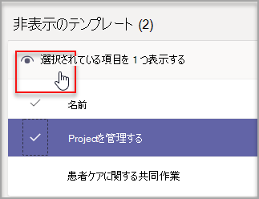
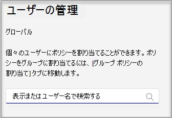
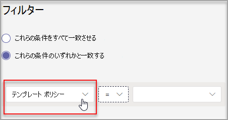

# 管理センターで Teams テンプレートを管理する

エンド ユーザーに表示される Teams テンプレートを管理するには、管理センターでテンプレート ポリシーを作成します。 各テンプレート ポリシー内で、表示または非表示のテンプレートを指定できます。
ユーザーが指定した Teams テンプレートのサブセットのみを表示するために、異なるユーザーを異なるテンプレート ポリシーに割り当てる。

テンプレート ポリシーを管理する方法については、この短いビデオをご覧ください。

> [!VIDEO https://www.microsoft.com/videoplayer/embed/RWyXL9]

## テンプレート ポリシーを作成し、使用可能なテンプレートを割り当てる

1. Teams 管理センターにサインインします。

2. **Teams テンプレート**  >  **ポリシーを展開します**。

3. **[追加]** を選択します。

    ![テンプレート ポリシーが選択され、[追加] が強調表示されている](media/template-policies-1.png)

1. [テンプレート ポリシー **の設定] セクションで** 、次のフィールドに入力します。

    - テンプレート ポリシー名

    - テンプレート ポリシーの簡単な説明

2. [表示可能 **なテンプレート] テーブル** で、非表示にするテンプレートを選択し、[非表示] を選択 **します**。

    ![[非表示] が強調表示された選択したテンプレート](media/template-policies-2.png)

    非表示に設定したテンプレートは、[非表示のテンプレート] テーブル **に表示** されます。

1. 特定のテンプレートを再表示するには、[非表示のテンプレート] テーブル **までスクロール** します。

2. 再表示するテンプレートを選択し、[表示] を選択 **します**。

   

   選択したテンプレートが表示可能なテンプレート **テーブルに表示** されます。
3. **[保存]** を選択します。

   新しいテンプレート ポリシーが [テンプレート ポリシー **] リストに表示** されます。

## テンプレート ポリシーにユーザーを割り当てる

ポリシーに割り当てられたユーザーは、そのポリシー内で表示可能なテンプレートのみを表示できます。

1. テンプレート **ポリシーからポリシーを選択** し、[ユーザーの管理] を **選択します**。

2. このポリシーに割り当てるユーザーを入力します。

   

3. **[適用]** を選択します。

> [!Note]
> 新しいポリシーがエンド ユーザーに有効になるには、最大で 24 時間かかる場合があります。

## テンプレート ポリシーのサイズ制限

ポリシーごとに最大 100 のテンプレートを非表示にできます。 特定 **のポリシー** に既に 100 のテンプレートが非表示になっている場合、[非表示] ボタンは無効になります。

## よく寄せられる質問

**Q: チーム テンプレート ポリシーにユーザーをバッチ割り当てできますか?**
  
A: はい、PowerShell のテンプレート ポリシーのバッチ割り当てをサポートしています。 このアクションのポリシーの種類は、TeamsTemplatePermissionPolicy です。 [詳細情報](https://docs.microsoft.com/powershell/module/teams/new-csbatchpolicyassignmentoperation)

**Q: グループはチーム テンプレート ポリシーに割り当てることができますか?**

A: 現在いいえ。 この機能は、今後利用できる予定です。

**Q: 新しいテンプレートを作成した場合、そのテンプレートはポリシーに含まれますか?**

A: 新しいテンプレートは既定で表示されます。 管理センターの [テンプレート ポリシー] セクションでテンプレートを非表示にできます。

**Q: テンプレートが削除された場合は、どうなるでしょうか。**

A: 削除されたテンプレートは、テンプレート ポリシーに表示されなくなりました。

**Q: Teams 管理センターで複数のユーザーをテンプレート ポリシーに割り当てできますか?**

A: はい。

1. 管理センターで、[ユーザー] に **移動します**。
1. [ユーザー] リスト テーブルで、特定のテンプレート ポリシーに割り当てるユーザーを選択します。
1. [設定の編集] を選択し、[テンプレート ポリシー] フィールドを変更します。
1. [適用] を選択します。
   Microsoft [Teams のユーザーへのポリシーの割り当てについて詳しくは、Microsoft Teams の Microsoft Docs \| をご覧ください](https://docs.microsoft.com/microsoftteams/assign-policies#assign-a-policy-to-a-batch-of-users)。

**Q: 特定のポリシーに割り当てられているすべてのユーザーを表示する方法**

A: 管理センターで、

1. [ユーザー] セクション **に移動** します。
2. [ユーザー] リスト テーブルでフィルターを選択し、チーム テンプレート ポリシーのフィルターを適用します。
3. **[適用]** を選択します。

**Q: PowerShell でテンプレート ポリシーを管理できますか?**

A: いいえ、PowerShell でのテンプレートの管理はサポートされていません。

**Q: テンプレート ポリシーは EDU に適用されますか?**

A: いいえ、EDU のテンプレート ポリシーはサポートされていません。

## 関連トピック

- [管理センターでチーム テンプレートの使用を開始する](https://docs.microsoft.com/MicrosoftTeams/get-started-with-teams-templates-in-the-admin-console)

- [カスタム チーム テンプレートを作成する](https://docs.microsoft.com/MicrosoftTeams/create-a-team-template)

- [既存のチームからテンプレートを作成する](https://docs.microsoft.com/MicrosoftTeams/create-template-from-existing-team)

- [既存のチーム テンプレートからチーム テンプレートを作成する](https://docs.microsoft.com/MicrosoftTeams/create-template-from-existing-template)

- [Microsoft Teams でユーザーにポリシーを割り当てる - Microsoft Teams \| Microsoft Docs](https://docs.microsoft.com/microsoftteams/assign-policies)

- [ポリシーにユーザーをバッチ割り当てる](https://docs.microsoft.com/powershell/module/teams/new-csbatchpolicyassignmentoperation)
