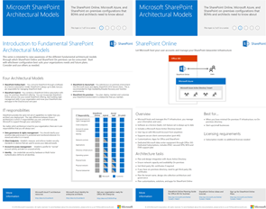

<<<<<<< 見出し<<<<<<< HEAD <<<<<<< HEAD
# SharePoint および OneDrive にようこそWelcome to SharePoint and OneDrive

SharePoint および OneDrive の情報を docs.microsoft.com で確認できます。SharePoint and OneDrive are now on docs.microsoft.com. 

SharePoint Server 2016 は、あらゆる規模の組織が利用でき、ビジネス プロセスの能率を高めることのできるコラボレーション環境です。SharePoint Server 2016 is a collaboration environment that organizations of all sizes can use to increase the efficiency of business processes. 

SharePoint Server 2016 サイトは、管理者が設定でき、文書およびその他の情報への個人的なアクセスを可能にする環境を提供します。SharePoint Server 2016 sites provide environments that administrators can configure to provide personalized access to documents and other information. ユーザーは検索機能を使用することで、データの物理的な場所を問わず効率的にコンテンツを検索することができます。Search features enable users to find content efficiently regardless of the physical location of data.

SharePoint で推奨されるソリューションについては、「[技術ダイアグラム](https://technet.microsoft.com/library/cc263199(v=office.16).aspx)」ページを確認するようにしてください。Make sure to check out our [Technical Diagrams](https://technet.microsoft.com/library/cc263199(v=office.16).aspx) page for recommended solutions for SharePoint.

=======
>>>>>>> マスターmaster

[アクセシビリティについてのガイダンスもチェックしてください](https://technet.microsoft.com/library/mt790686(v=office.16).aspx)[Check out the accessibility guidance as well](https://technet.microsoft.com/library/mt790686(v=office.16).aspx)
