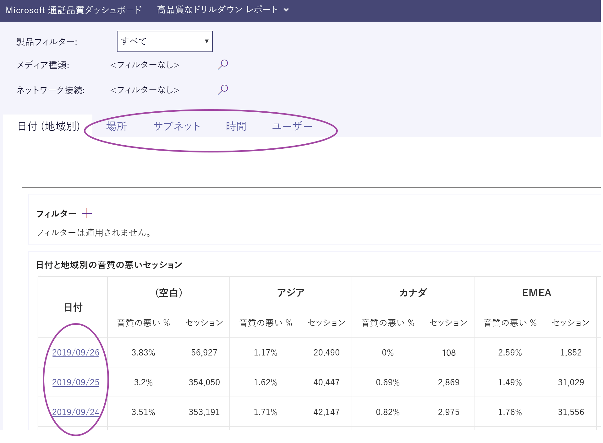
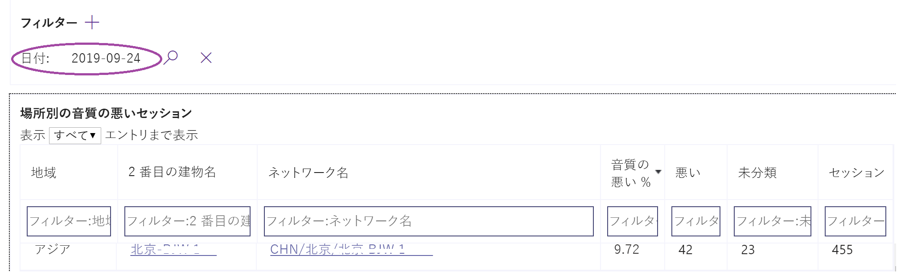
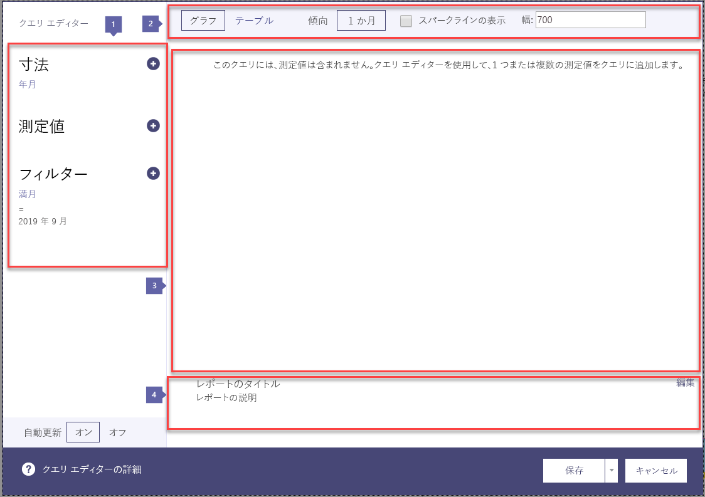

# Microsoft Teams および Skype for Business Online で通話品質ダッシュボードをオンにして使用する

通話品質ダッシュボードを使って通話品質を監視するために Microsoft 365 または Office 365 を構成する方法について説明します。
  
通話品質ダッシュボード (CQD) は、Microsoft Teams と Skype for Business Online サービスを使って発信した通話の品質を把握するのに適しています。 このトピックでは、通話品質の問題をトラブルシューティングするために使用できるデータの収集を開始する手順について説明します。

現在、Advanced CQD と CQD は両方とも使用できます。 Advanced CQD は、でhttps://cqd.teams.microsoft.comご利用いただけます。 新しい URL。ただし、管理者の資格情報を使ってログインします。

## Power BI を使用して CQD データを分析する

2020年1月の新[機能: POWER BI クエリテンプレートをダウンロードして CQD](https://github.com/MicrosoftDocs/OfficeDocs-SkypeForBusiness/blob/live/Teams/downloads/CQD-Power-BI-query-templates.zip?raw=true)します。 CQD データの分析と報告に使用できる、カスタマイズ可能な Power BI テンプレート。

詳細については、「 [POWER BI を使用して CQD データを分析する](CQD-Power-BI-query-templates.md)」を参照してください。

## 最新の変更と更新

更新された CQD (2019 年11月初頭) は、ほぼリアルタイムの CQD ダッシュボードを提供しています。 CQD データは、30分単位で平均で利用可能になります (前の CQD と比べて、24時間の平均値が表示されます)。  更新された CQD は、エンドユーザーを特定できる情報 (EUII) を使用し、管理者は、ドリルダウンとユーザーレベルのズームを行うことができます。 次のような新しいシナリオをサポートするためのレポート対話機能もあります。

- 地域別の通話品質:
  - 日付順
  - 1時間ごとの集計
  - 特定の場所
  - 特定のサブネット
  - 影響を受けるユーザーまたはユーザー

- 地域別の信頼性/障害への通話:
  - 日付順
  - 1時間ごとの集計
  - 特定の場所
  - 特定のサブネット
  - 影響を受けるユーザーまたはユーザー

- 地域によって通話 (RMC) を評価します。1か月ごとに、低い RMC 評価を提供しているユーザーを特定の場所に集約します。 CQD v3 には、その他のフィードバックも含まれています。
- ヘルプデスク: P2P の通話または会議の特定のユーザー、またはすべての参加者と通話の詳細について利用できます。 ネットワークの場所、デバイス、またはファームウェアに基づいて、発生する可能性があるシステムの問題を特定するのに役立ちます。  
- [クライアントバージョン]: 各クライアントバージョンのセッションとユーザーの数を表示するか、各クライアントバージョンのユーザー名にドリルダウンします。 製品とクライアントの種類の事前に構築されたフィルターによって、バージョンが特定のクライアントに焦点を当てていることがわかります。
- エンドポイント: PC/Mac のメーカー/モデルにマップされているコンピューターのエンドポイントを表示します。 メーカー別またはモデル別に集計された品質を示します。 マッピングデータは、データを作成する場合と同様にアップロードされます。

EUII access が利用できない場合、Advanced CQD (V3) は RBAC のサポートも提供します。  

管理者は、CQD バージョン3を介して Skype for business Server 2019 (Skype for Business Online および Microsoft Teams だけではなく) を管理できます。 これには、ハイブリッド実装と Call Data Connector の使用が必要です。 詳細については、「[通話データコネクタを計画](/SkypeForBusiness/hybrid/plan-call-data-connector)する」を参照してください。

CQD バージョン2が追加されました:

- Microsoft Teams および Skype for Business Online のデータ
- 概要レポートには、すべてのデータ、Microsoft Teams データ、または Skype for Business Online のデータを選択するための製品フィルターが含まれています。
- ビデオと VBSS ストリーム品質分類ロジックが更新されました。 分類子定義については、「[通話品質ダッシュボードのストリームの分類」](stream-classification-in-call-quality-dashboard.md)を参照してください。

[通話品質ダッシュボードで利用できるディメンションとメジャー](dimensions-and-measures-available-in-call-quality-dashboard.md)の一覧については、この記事を参照してください。
  
> [!NOTE]
> ダッシュボードの更新と変更に関する情報を表示するには、**適切なニュース**のリンクをクリックします。 ダッシュボードに表示されたバナー。

CQD バージョン1では、Skype for Business Server 2015 管理者が次の機能を提供しています。

- キャッシュされたレポートデータにアクセスしてすばやくアクセス
- 情報を共有および公開するためのレポートページへのディープリンク
- 合理化されたレポートの編集と作成、およびレポートの説明の編集可能なメタデータ
- カスタムダッシュボードで使用するために、プログラムによるキューブデータへのアクセスを提供する Web Api

## CQD (NRT) データのほぼリアルタイムのデータ

Advanced CQD (V3、2019年11月リリース) は、ほぼリアルタイムのデータフィードを使用します。 通話記録は、CQD ポータルで平均で30分で利用できます (前の CQD と比較して、24時間の平均値が表示されます)。 NRT パイプラインからの通話レコードは、データセットから削除されるまで数ヶ月分しか使用できません。 CQD v3 は、v3 パイプラインの NRT データで現在の v2 パイプラインからデータを結合します。 アーカイブ期間のデータに対する v2 と v3 ポータルのクエリでは、同じ結果が得られます。 NRT データと NRT データと PII 期間の V2 と v3 のデータクエリは、異なるものになります。

### PII/EUII データ

PII または EUII データは、v3 パイプラインからのみ取得されます。 コンプライアンスのため、PII/EUII データは30日間のみ保持されます。 NRT データは、30日間のマークに交差するため、pii/EUII フィールドは消去され、その結果、PII が無料の NRT データになります。 PII/EUII フィールドは次のとおりです。

- 完全な IP アドレス
- メディアアクセス制御 (MAC) アドレス
- 基本サービスセット識別子 (BSSID)
- セッション開始プロトコル (SIP) URI (Skype for Business のみ)
- ユーザー プリンシパル名 (UPN)
- マシンのエンドポイント名
- ユーザーからのフィードバック
- オブジェクト ID (エンドポイントのユーザーの Active Directory オブジェクト ID)

### 日付コントロール

CQD v3 では、次の新しいローリング傾向の種類が追加されます。

- 5日
- 7日間
- 30日間
- 60日
- 90日

URL Date パラメーターで Day フィールドを使用できるようになりました。 ローリングレポートでは、トレンドの最終日として YYYY-MM-DD 形式の日付が使用されます。  URL Date パラメーター "00" は "today" を示します。

|URL| ローリング日のトレンドの終了日|
|:---|:---|
|https://<cqdv3>/spd/#/ダッシュボード/<reportid>/2019-02/   |2019年2月の現在の日付|
|https://<cqdv3>/spd/#/ダッシュボード/<reportid>/2019-02-15/|2019年2月15日|
|https://<cqdv3>/spd/#/ダッシュボード/<reportid>/00/        |現在の日付|
|||

既定では、月の現在の日付が、ローリング日の傾向の最終日として使用されます。

### ドリルスルー機能

CQD v3 は、SPD レポートでのドリルスルーまたはドリルダウンフィールドの使用をサポートしています。 これらのディメンションフィールドが選択されている場合、レポートは自動的に別の [レポート] タブを開き、選択した値に基づいてフィルター処理されます。 ドリルスルーフィルターが割り当てられているフィールドは、マウスをポイントしたときに別のカーソルアイコン (ポインター) によって区別されます。

ドリルスルーフィールドが選択されると、ダッシュボードは自動的に新しい指定されたタブに移動し、選択した値のフィルターを適用します。 そのタブに独自のドリルスルーフィールドがあり、1つが選択されている場合は、前のドリルスルーフィルターと新しいフィルターがすべて順に伝達されます。 これにより、結果として得られたデータセットを段階的に絞り込むレポートを作成できます。

たとえば、通話品質ドリルスルーレポートでは、ユーザーは "ドリルスルー" の日付をクリックすると、[場所] タブに移動します。

[場所] タブでは、複数の日付を追加できます。たとえば、2019-09-22 を日付に追加します。 2019-09-24: 

> [!NOTE]
> 最後のタブに直接ジャンプしないでください。前のドリルスルーで選択したフィルターがないと、結果が大きすぎてテーブルに表示されません。

## Microsoft 通話品質ダッシュボード (CQD) の概要レポートを有効にする

CQD の使用を開始する前に、次のように Microsoft 365 または Office 365 でライセンス認証を行います。

 **Microsoft teams 管理センターを使用し**た microsoft teams ロゴを示すアイコン

1. Microsoft Teams service 管理者アカウントを使用して Microsoft 365 または Office 365 にサインインし、[**管理者**] タイルを選んで管理センターを開きます。
2. 左側のウィンドウの [**管理センター**] で、[ **microsoft teams** ] を選択して、microsoft teams 管理センターを開きます。
3. Microsoft Teams 管理センターで、左側のウィンドウの [**通話品質ダッシュボード**] を選択します。
4. Https:// \(cqd.teams.microsoft.com\)が開かれるページで、[**サインイン**] をクリックして、グローバル管理者アカウントまたは microsoft teams サービス管理者アカウント情報を入力します。

    
  
サインインすると、CQD によってデータの収集と処理が開始されます。  
> [!NOTE]
> レポートに意味のある結果を表示するために十分なデータの処理には、1時間以上かかる場合があります。

 **レガシポータルを使用し**た skype for business ロゴのアイコン

1. 管理者アカウントを使用して Microsoft 365 または Office 365 にサインインし、[**管理者**] タイルを選んで管理センターを開きます。
2. 左側のウィンドウの [**管理センター**] で、[ **microsoft teams** ] を選択して、microsoft teams 管理センターを開きます。
3. Microsoft Teams 管理センターで、左側のウィンドウで [**従来のポータル**] を選び、[**ツール**]、[ **Skype For business Online 通話品質ダッシュボード**] の順に選択します。

     

4. 表示されたページで、グローバル管理者アカウントでサインインし、メッセージが表示されたらアカウントの資格情報を入力します。

サインインすると、アクティブ化されると、通話品質ダッシュボードでデータの収集と処理が開始されます。

## Microsoft Teams および Skype for Business Online の通話品質ダッシュボードの機能

CQD の概要レポートには、詳細レポート用に計画されている機能のサブセットが用意されています。 各エディションの違いは次のとおりです。
  
|機能|概要レポート|詳細レポート|
|:--- |:--- |:--- |
|アプリケーション共有のメトリック | いいえ | はい |
|顧客の建物情報のサポート | はい | Yes |
|顧客エンドポイント情報のサポート | Cqd.teams.microsoft.com のみ | Cqd.teams.microsoft.com のみ |
|ドリルダウン分析のサポート   | いいえ   | はい   |
|メディアの信頼性のメトリック   | いいえ   | はい   |
|ボックスのないレポート   | はい   | Yes   |
|概要レポート   | はい   | Yes   |
|ユーザーごとのレポートセット   | いいえ   | はい   |
|レポートセットのカスタマイズ (レポートの追加、削除、変更)   | いいえ   | はい   |
|ビデオベースの画面共有のメトリック   | いいえ   | はい   |
|ビデオ指標   | いいえ   | はい   |
|利用可能なデータの量   | 過去12か月間   | 過去12か月間   |
|Microsoft Teams データ   | はい   | Yes   |
| | | |

### ボックスのないレポート

CQD のすべてのエディションでは、新しいレポートを作成することなく、品質指標を呼び出すことができるエクスペリエンスを提供しています。 バックエンドでデータが処理されると、レポートに通話品質データが表示されます。

2020年1月の新[機能: POWER BI クエリテンプレートをダウンロードして CQD](https://github.com/MicrosoftDocs/OfficeDocs-SkypeForBusiness/blob/live/Teams/downloads/CQD-Power-BI-query-templates.zip?raw=true)します。 CQD データの分析と報告に使用できる、カスタマイズ可能な Power BI テンプレート。
  
### 概要レポート

CQD のすべてのエディションでは、全体的な通話品質情報への上位レベルのエントリポイントが提供されますが、概要レポートでは情報の表示方法は詳細レポートとは異なります。  
  
概要レポートには、シンプルなタブ表示のページレポートビューが用意されているので、全体的な通話品質の状態と傾向を簡単に参照して理解できます。

次の4つのタブがあります。
  
- **全体的な通話品質**: すべてのストリームに関する情報を提供します。これは、毎月および1日の傾向を示す集計です。
  - サーバークライアントストリーム
  - クライアントクライアントストリーム
  - 個別のサーバークライアントとクライアント間のクライアントストリーム
- [**サーバー] — [クライアント**]-サーバーエンドポイントとクライアントエンドポイント間のストリームの詳細を提供します。
- **クライアント**-クライアント: 2 つのクライアントエンドポイント間のストリームの詳細を提供します。
- [**音声品質の sla** : Skype For business Online の音声品質の sla に含まれる通話に関する情報を提供します。

> [!NOTE]
> CQD バージョン3は、Microsoft Teams、Skype for Business Online、Skype for Business Server と連携しています。 Skype for Business Server 2019 で CQD を使用するには、[通話データコネクタを構成](https://docs.microsoft.com/skypeforbusiness/hybrid/configure-call-data-connector)する必要があります。 始める前に「[通話データコネクタを計画](https://docs.microsoft.com/skypeforbusiness/hybrid/plan-call-data-connector)する」を参照してください。

- 地域別の通話品質:

  - 日付順
  - 1時間ごとの集計
  - 特定の場所
  - 特定のサブネット
  - 影響を受けるユーザーまたはユーザー

- 地域別の信頼性/障害への通話:
  - 日付順
  - 1時間ごとの集計
  - 特定の場所
  - 特定のサブネット
  - 影響を受けるユーザーまたはユーザー

- 地域によって通話 (RMC) を評価します。1か月ごとに、低い RMC 評価を提供しているユーザーを特定の場所に集約します。 CQD v3 には、その他のフィードバックも含まれています。
- ヘルプデスク: P2P の通話または会議の特定のユーザー、またはすべての参加者と通話の詳細について利用できます。 ネットワークの場所、デバイス、またはファームウェアに基づいて、発生する可能性があるシステムの問題を特定するのに役立ちます。  
- [クライアントバージョン]: 各クライアントバージョンのセッションとユーザーの数を表示するか、各クライアントバージョンのユーザー名にドリルダウンします。 製品とクライアントの種類の事前に構築されたフィルターによって、バージョンが特定のクライアントに焦点を当てていることがわかります。
- エンドポイント: PC/Mac のメーカー/モデルにマップされているコンピューターのエンドポイントを表示します。 メーカー別またはモデル別に集計された品質を示します。 マッピングデータは、データを作成する場合と同様にアップロードされます。

### [全体的な通話品質] タブ

このタブのデータを使用して、通話品質の状態と、ストリーミングカウントと低い割合に基づいた傾向を評価します。 右上隅の凡例は、どの色と視覚要素がこれらのメトリックを表しているかを示しています。
  
![スクリーンショット: [通話品質] タブを表示する](media/c8d183b1-6592-49b0-a81d-35cc0568d5f0.png)
  
ストリームは、良好、低品質、未分類の3つのグループに分類されます。 また、分類されたストリームの合計数に*低品質*として分類されたストリームの比率を示す*低品質*の値が計算されます。 *低品質のストリーム/(不十分なストリーム + 良好なストリーム) * 100**は、* 複数の*未分類*ストリームの存在によって影響を受けません。 ストリームを低品質または良好な状態として分類する方法については、「[通話品質ダッシュボードでのストリームの分類」](stream-classification-in-call-quality-dashboard.md)を参照してください。
  
ストリーム数の値を測定するには、左側のスケールを使用します。
  

  
右側のスケールを使用して、低品質の値を測定します。
  

  
また、バーの上にマウスを置くと、実際の数値を取得できます。
  
> [!NOTE]
> 次の例は、非常に小さなサンプルデータセットからの値で、実際の展開には現実的ではありません。
  

  
全体的なストリームボリュームは、計算された低品質の割合の関連性を特定するのに役立ちます。 全体的なストリームの量が少ないほど、報告される低割合の値は、信頼性が低くなります。
  
### [サーバー-クライアント] タブと [クライアント-クライアント] タブ

次の2つのタブは、エンドポイント間のシナリオで発生したストリームの詳細を提供します。 [サーバー-クライアント] タブには、メディアストリームが流れる4つのシナリオを表す4つの折りたたみ可能なセクションがあります。
  
- 有線 (内部)
- 有線 (外部)
- Wifi (内部)
- Wifi (外部)

同様に、[クライアント-クライアント] タブには、5つの折りたたみ可能なセクションがあります。

- 有線 (内側)、有線
- 有線 (内部)-有線 (外部)
- 有線 (外部)-有線 (外部)
- 有線 (内部) — Wifi (内部)
- 有線 (内部) — Wifi (外部)

#### 内部テスト

処理中、CQD バックエンドは、構築情報を使用してストリームを*内部*または*外部*として分類します (存在する場合)。 各ストリームのエンドポイントは、サブネットアドレスと関連付けられます。 アップロードした建物情報の InsideCorp とマークされているサブネットの一覧にサブネットがある場合、そのサブネットは*内部*と見なされます。 作成情報がまだアップロードされていない場合は、内側のテストでは常に*外部*としてストリームを分類します。  

> [!NOTE]
> サーバークライアントシナリオの内部テストでは、クライアントエンドポイントのみが考慮されます。 サーバーは常にユーザーの視点から外れているため、これはテストでは考慮されません。
  
#### 有線と wifi の比較

名前が示すように、分類条件は、クライアント接続の種類に基づいています。 この場合も、サーバーは常に有線であり、計算に含まれていません。
  
> [!NOTE]
> 特定のストリームについて、2つのエンドポイントの一方が Wifi ネットワークに接続されていれば、CQD で Wifi として分類されます。
  
## レポートで表示する製品データの選択

概要と位置を拡張したレポートでは、[**製品フィルター** ] ドロップダウンを使用して、すべての製品データ、Microsoft Teams のデータのみ、または Skype For business Online データのみを表示することができます。
  

  
詳細レポートで**は、Is Teams**ディメンションを使用して、Microsoft Teams または Skype For business Online データにデータをフィルター処理することができます。
  
## テナントデータ情報をアップロードする

CQD Summary レポートダッシュボードには、右上隅にある [設定] メニューから [**テナントデータ**アップロード] を選択することによってアクセスできる**テナントデータアップロード**ページが含まれています。 このページは、管理者が次のような独自の情報をアップロードするために使用されます。

- IP アドレスと地理的情報のマップ
- 各ワイヤレス AP とその MAC アドレスの地図
- エンドポイントからエンドポイントの作成/モデル/型へのマップ。など
  
> [!NOTE]
> CQD にアップロードするレポートのラベルは、Office 365 の契約で*サポートデータ*として扱われます。これには、*顧客データ*や*個人データ*と見なされる情報も含まれます。 *サポートデータ*として microsoft に提供したくないデータは含めないでください。この情報は、サポート目的で microsoft エンジニアに表示されます。

  
1. [**テナントデータのアップロード**] ページで、ドロップダウンメニューを使用してアップロードするデータファイルの種類を選びます。 ファイルのデータ型は、ファイルの内容を示します (たとえば、"建物" は、IP アドレスと建物およびその他の地理情報のマッピングを指します)。 "Endpoint" は、エンドポイントの名前とエンドポイントの型情報のマッピングを指します。 現在、CQD では、cqd.teams.microsoft.com (プレビューステージでは、まだ公式利用可能ではない) の "建物" と "Endpoint" データ型がサポートされています。 cqd.lync.com は、"建物" データ型のみをサポートしています。

2. ファイルデータの種類を選んだら、[**参照**] をクリックしてデータファイルを選びます。

   - データファイルには、.tsv (タブ区切り値) ファイルまたは .csv (カンマ区切り値) ファイルを指定する必要があります。 .Csv ファイルでは、カンマが含まれているフィールドは引用符で囲む必要があります。または、コンマが削除されている必要があります。 たとえば、建物の名前が ny である場合は、.csv ファイルに "NY, NY" と入力します。
   - データファイルのサイズは、50 MB 以下でなければなりません。
   - Cqd.teams.microsoft.com にアップロードされたファイルの行数の上限は100万で、クエリのパフォーマンスが速くなります。 この制限は、CQDの CQD v2 にも適用されます。
   - データファイルの各列は、このトピックの後半で説明するように、定義済みのデータ型と一致している必要があります。
3. 次に、**開始日**を指定し、必要に応じて**終了日を指定**します。
4. 最後に、[**アップロード**] を選んで、CQD サーバーにファイルをアップロードします。
    ファイルがアップロードされる前に、まず検証されます。 検証が完了すると、Azure blob に格納されます。 検証に失敗した場合、またはファイルが Azure blob に保存されていない場合、エラーメッセージによってファイルに修正を要求します。 次の図は、データファイルの列数が正しくないエラーの例を示しています。

     
  
5. 検証中にエラーが発生しなかった場合、ファイルのアップロードは成功します。 アップロードされたデータファイルは、[**マイアップロード**] テーブルに表示できます。 このページの下部には、現在のテナントにアップロードされたすべてのファイルの一覧も表示されます。
    各レコードには、アップロードされたテナントデータファイルが1つ表示されます。これには、ファイルの種類、最終更新時刻、[期間]、[説明]、[削除] アイコン、ダウンロードアイコンがあります。 ファイルを削除するには、表のゴミ箱アイコンを選択します。 ファイルをダウンロードするには、表の [**ダウンロード**] 列の [ダウンロード] アイコンを選択します。

     

6. 複数の建物データファイルまたは複数のエンドポイントデータファイルを使用する場合、一部のレポートの生成速度が遅くなります。

### テナントデータファイルの形式と構造

### データファイルを作成する

CQD は、建物データファイルを使用します。これにより、有用な通話の詳細が提供されます。 [Subnet] 列を抽出するには、Network + NetworkRange 列を展開し、サブネット列を通話レコードの最初のサブネットまたは第2サブネット列に結合して、建物、市区町村、国、または地域の情報を表示します。 アップロードするデータファイルの形式は、次の条件に従って、アップロード前に検証チェックに合格する必要があります。

サンプルテンプレートは[こちら](https://github.com/MicrosoftDocs/OfficeDocs-SkypeForBusiness/blob/live/Teams/downloads/locations-template.zip?raw=true)からダウンロードできます。
  
- ファイルは、.tsv ファイル (列はタブで区切られます) または .csv ファイル (列はコンマで区切られます) のいずれかである必要があります。
- データファイルには、テーブルの見出し行が含まれていません。 データファイルの最初の行は、"Network" のようなヘッダーラベルではなく、実際のデータであると想定されています。
- ファイル内のデータ型に指定できるのは、String、Integer、またはブール値のみです。 整数データ型の場合、値は数値である必要があります。 ブール値は、0または1でなければなりません。
- 列に文字列データ型が使用されている場合、データフィールドは空でもかまいませんが、タブまたはコンマで区切る必要があります。 空のデータフィールドでは、空の文字列値が割り当てられます。
- 各行には14個の列がある必要があります。また、オプションの列を追加する場合は、各列のデータ型が適切であり、列が次の表の順序になっている必要があります。

||||||||||||||||
|:--- |:--- |:--- |:--- |:--- |:--- |:--- |:--- |:--- |:--- |:--- |:--- |:--- |:---  |:--- |:---|
|**列フィールド名**|NetworkIP  |NetworkName              |NetworkRange|BuildingName  |OwnershipType| BuildingType  |BuildingOfficeType|市区町村   |ZipCode|居住|都道府県 |Region|InsideCorp&dagger;|ExpressRoute&Dagger;|VPN (オプション)|
|**データ型**        | String    | String                  |数値      | String       | String      | String        |String            |String |String |String |String|String|Boolean   |Boolean     |Boolean|
|**値の例**    |192.168.1.0|米国/シアトル/シアトル-SEA-1| #         | シアトル-SEA-1| コントソ     | IT の終了|エンジニアリング       |調布市調布ヶ丘|98001  |プロセッサー     |WA    |MSUS  | 1        |0           | 0|
|||||||||||||||||

&dagger;この設定は、サブネットが企業ネットワーク内にあるかどうかを反映するために使用できます。 必要に応じて、他の目的の使用をカスタマイズすることができます。

&Dagger;この設定は、ネットワークが Azure ExpressRoute を使用しているかどうかを反映するために使用できます。 必要に応じて、他の目的の使用をカスタマイズすることができます。  

**サンプルの行:**

`192.168.1.0,USA/Seattle/SEATTLE-SEA-1,26,SEATTLE-SEA-1,Contoso,IT Termination,Engineering,Seattle,98001,US,WA,MSUS,1,0,0`

> [!IMPORTANT]
> ネットワーク範囲は、スーパーネット (単一のルーティングプレフィックスを持つ複数のサブネットの組み合わせ) を表すために使用できます。 新しくなったすべての文書のアップロードで、重複範囲が確認されます。 以前にビルドファイルをアップロードしたことがある場合は、現在のファイルをダウンロードして再アップロードし、重複を特定し、問題を解決してからもう一度アップロードする必要があります。 以前にアップロードされたファイルが重なっていると、サブネットとレポートの建物とのマッピングが間違っている可能性があります。 特定の VPN の実装では、サブネット情報が正確に報告されません。 構成ファイルに VPN サブネットを追加するときは、サブネットのエントリの1つではなく、個別の32ビットネットワークとして、VPN サブネットの各アドレスに個別のエントリを追加することをお勧めします。 各行には、同じビルドメタデータを含めることができます。 たとえば、172.16.18.0/24 の1行ではなく、256行と、172.16.18.0/32 と 172.16.18.255/32 の間の各アドレスに1つの行が含まれている必要があります。
>
> VPN 列はオプションであり、既定値は0に設定されます。  VPN 列の値が1に設定されている場合、その行で表されるサブネットは、サブネット内のすべての IP アドレスと一致するように完全に拡張されます。  これらのサブネットを完全に拡張すると、データの作成に関係するクエリのクエリ時間に悪影響を与える可能性があるため、このように慎重に使用してください。

### エンドポイントデータファイル

CQD はエンドポイントデータファイルを使用します。 列の値は、[通話記録の最初のクライアントエンドポイント名] または [第2のクライアントエンドポイント名] 列で使用され、エンドポイントの作成、モデル、または型の情報を表示します。 アップロードするデータファイルの形式は、次の条件に従って、アップロード前に検証チェックに合格する必要があります。

- ファイルは、.tsv ファイル (列はタブで区切られます) または .csv ファイル (列はコンマで区切られます) のいずれかである必要があります。
- データファイルの内容には、テーブル見出しは含まれません。 データファイルの最初の行は、"EndpointName" のような見出しラベルではなく、実際のデータである必要があります。
- 7つの列はすべて、文字列データ型のみを使用します。 使用できる最大文字数は64文字です。
- データフィールドは空白にすることもできますが、タブまたはコンマで区切る必要があります。 空のデータフィールドでは、空の文字列値が割り当てられます。
- EndpointName は一意である必要があります。そうでない場合、アップロードは失敗します。 重複している行が重複している場合、または2つの行に同じ EndpointName が含まれている場合は、競合が発生します。
- EndpointLabel1、EndpointLabel2、EndpointLabel3 はカスタマイズ可能なラベルです。 空の文字列や値にすることができるのは、"IT 部門が指定した2018ノート Pc" または "Asset Tag 5678" などです。
- 各行には7つの列があり、列は次の順序である必要があります。

  **フィールドの順序:**

EndpointName、EndpointMake、Endpointmake、Endpointmake、EndpointLabel1、EndpointLabel2、EndpointLabel3

  **サンプルの行:**

「1409W3534、123製造元、Fabrikam Model 123、ノート Pc、IT 指定の2018ノート Pc、アセットタグ5678、購入2018

## 以前のバージョンの CQD からレポートを移行する

Skype for Business の CQD にレポートまたはアップロードされたテナントデータ (マッピング) ファイルhttps://cqd.lync.com)を作成した場合 (その方法についhttps://cqd.teams.microsoft.com)ては、次のようにしてください。

1.    エクスポートする[https://cqd.lync.com/cqd/](https://cqd.lync.com/cqd/)レポートセットに移動して参照します。 
2.    レポートの上にマウスポインターを移動し、[...] を選びます。メニューの [**エクスポートレポートツリー**] を選びます。 エクスポートファイルを保存します。
3.    レポートを[https://cqd.teams.microsoft.com/cqd/](https://cqd.teams.microsoft.com/cqd/)インポートする場所に移動して参照します。
4.    左側のリンクから [**インポート**] をクリックし、エクスポートされたファイルを選択します。 
5.    レポートがインポートされると、"レポートのインポートが正常に完了しました。" というメッセージが表示されます。 レポートセットの最後に新しいレポートが追加されました。 " 

## ユーザー設定の詳細レポートを作成する

特定のレポートを作成して、提供された詳細レポートではないような方法でデータを分析するには、カスタムレポートを作成します。

ログイン\(時に表示される画面の上部にあるレポートのプルダウンリストで、[ **Summary Reports**レポートの概要\) ] 画面**を選択し**、[**新規作成**] をクリックします。クエリエディターを表示するには、レポートのアクションメニューで [編集] をクリックします。 それぞれのレポートは、キューブに対するクエリに基づきます。 レポートは、クエリから返されたデータを視覚化したものです。 クエリエディターを使用すると、これらのクエリやレポートの表示オプションを編集できます。 新しいレポートのクエリエディターを開くと、次のスクリーンショットのような画面が表示されます。

1. 左側のウィンドウでは、ディメンション、メジャー、およびフィルターを選択します。 見出しの横にあるプラス記号 (+) をクリックしてダイアログを開き、ディメンション、測定、またはフィルターを追加して、対応するボックスをオンにします。 既存のレポートを編集する場合は、既存の値をオフにして削除することができます。 詳しくは、「[通話品質ダッシュボードで利用できるディメンションとメジャー](dimensions-and-measures-available-in-call-quality-dashboard.md)」をご覧ください。
2. 最上部には、グラフをカスタマイズするためのオプションが表示されます。
3. レポートのプレビューは、クエリエディターで確認できます。
4. 詳細なレポート名と説明を作成するには、下部にある編集ボックスを使用します。

## よく寄せられる質問

### 1人以上の会議の出席者が不適切なエクスペリエンスをした場合、CQD は "Good" として通話をマークするのはなぜですか?

CQD で[ストリームの分類](stream-classification-in-call-quality-dashboard.md)に使用するルールを確認します。
 
オーディオストリームについては、呼び出しの長さに基づいて平均値に基づいて計算される5つの分類子のいずれかが "good" パラメーター内に存在する可能性があります。 これは、ユーザーがオーディオのドロップアウト、静的、または故障に寄与するものを経験していなかったことを意味します。 

ネットワークの問題であったかどうかを判断するには、セッションの平均値と最大値の間のデルタを確認します。 [最大値] は、セッション中に最大検出および報告された値です。
 
このような状況のトラブルシューティングを行う方法の例を次に示します。 通話中にネットワークトレースを取得したときに、最初の20分間のパケットが失われても、1.5 秒のパケットが残っていて、通話の残りの部分に適しているとします。 この平均値は、Wireshark trace RTP の分析であっても、10% (0.1) のパケット損失と <なります。 パケット損失の最大値は何ですか? 1.5 秒の間の秒数は、30% (0.3) です。 5番目のサンプリング期間内に発生しましたか (おそらく、サンプリング期間に分割されている可能性があります)?
 
ネットワークメトリックが [平均] と [最大値] に適切に表示される場合は、他のテレメトリデータを参照します。 
- CPU 不足イベント比率を確認して、検出された CPU リソースが不足していて、品質が低品質であるかどうかを確認します。 
- スピーカーに近いマイクによるフィードバックを防ぐため、半二重モードのオーディオデバイスになりましたか? 
- デバイスの半二重 AEC イベント比率を確認します。 ハブまたはドッキングステーションに接続したときに、USB オーディオのドロップアウトによって、デバイスグリッチノイズまたはマイクグリッチノイズ音が聞こえます。  
- デバイスのエラーとマイクのイベント比率を確認します。 デバイス自体が正常に機能していますか?  
- キャプチャとレンダリングデバイスが機能していないことを確認します。

CQD テレメトリで利用できるディメンションとメジャーの詳細については、「[通話品質ダッシュボードで利用可能なディメンションと測定値](dimensions-and-measures-available-in-call-quality-dashboard.md)」を参照してください。

バックグラウンドノイズの場合は、[ミュートイベント比率] チェックボックスをオンにして、参加者がミュートにした時間の長さを確認します。
 
CQD で詳細なレポートを作成し、会議 ID にフィルターを適用して、会議のすべてのユーザーとストリームを確認し、目的のフィールドを追加します。 問題を報告しているユーザーが、問題が発生しているユーザーでない可能性があります。 経験を報告しているだけです。
 
テレメトリによって問題が発生するとは限りませんが、お客様の意思決定を確認して通知する方法を理解するのに役立ちます。 ネットワーク、デバイス、ドライバーまたはファームウェアの更新、使用、またはユーザーのどちらを使用していますか?

### CQD v2 のレポートデータが CQD v3 のレポートデータと異なるのはなぜですか? 

CQD v2 と v3 のデータの違いが表示される場合は、データの比較または検証が、集計レベルではなく、"りんごからりんご" と "幅" レベルで行われていることを確認してください。 たとえば、"建物 30" の WiFi Teams のデスクトップクライアントデータの両方のレポートをフィルター処理する場合、低品質の割合は、v2 と v3 で同じである必要があります。

CQD v3 では CQD v2 に新しいシナリオが存在しないため、CQD v2 と CQD v3 の合計数は異なります。 フィルターを使用しない場合は、集計の合計または総計が異なる場合があります。  

使用シナリオに Skype for Business Server の2019通話が含まれている場合、CQD v3 のデータには、Skype ボット通話 (自動応答、CVI、仮想デスクトップインターフェイス)、ライブイベント、PSTN 通話が含まれます。 CQD v2 では、このデータは使用されません。 (CQD v3 には、クラウドデータコネクタが構成された Skype for Business Server 2019 が必要です。)

たとえば、CQD v2 の概要レポートで5000エラーが20万オーディオストリームで表示されている場合は、5500のエラーのある30万オーディオストリーム (Skype for Business Server 2019 通話、CVI 通話、PSTN 通話など) が CQD v3 のサマリーレポートに表示されることはありません。

予期しない違いを明確にするために、データ全体の1つ以上の内訳を確認します。 次のパラメーターの1つ以上を使ってデータにフィルターを適用します。

- User Agent Category Pair
- 第1の製品
- 第2の製品

### CQD v2 と CQD v3 とのその他の予想される違い

Teams では、Skype for Business Online ではなく、いくつかの品質と信頼性が向上しています。

- 自動再接続
- 高速ローミング
- 白黒管理の改善

次の2つのサービスのデータを比較する場合は、次のようにします。

- 会社の有線接続、Windows デスクトップ、または1つの地域や建物など、集中するシナリオを選択します。
- Teams の [MR]、[TR]、または [MP] の IP 範囲を確認します。 チームの範囲は Skype for Business Online よりも新しいものであり、ファイアウォールに関連する接続の問題が発生する可能性があります。
- サマリーまたはトップレベルの数値を比較しないでください。 これらの比較を行うことで、企業の有線接続での Skype for Business Online 通話の大きな通話音量と、LTE またはプライベートネットワーク上での少人数のチーム通話との比較を行うことができます。
- 位置のバイアスと母集団の相違点に注意してください。多すぎては、次のような違いがあります。
  - NOAM: APAC
  - NY: Goa
  - 有線 : WiFi
  - 企業ネットワーク: ホームネットワーク
  
### CQD で EUII が表示されるのはなぜですか?

次の管理者ロールは、CQD にアクセスできますが、EUII (エンドユーザーを特定できる情報) を表示することはできません。
- Microsoft 365 レポートリーダー
- Teams 通信サポート スペシャリスト

CQD にアクセスできる役割の詳細については、「 [CQD にアクセスするための役割の割り当て](quality-of-experience-review-guide.md#assign-roles-for-accessing-cqd)」を参照してください。

### チームのみを対象としてフィルター処理したときに、CQD に Skype for Business の情報が表示されるのはなぜですか?

CQD レポート (isTeams = 1) でのみチームをフィルター処理している場合、*第1のエンドポイント*が Teams であるすべての通話をフィルター処理します。 *第2のエンドポイント*が Skype for business の場合、その情報が CQD レポートに表示されます。

## 関連項目

[通話品質ダッシュボードで利用できるディメンションとメジャー](dimensions-and-measures-available-in-call-quality-dashboard.md)

[通話品質ダッシュボードでのストリームの分類](stream-classification-in-call-quality-dashboard.md)

[Skype for Business の通話分析をセットアップする](set-up-call-analytics.md)

[通話分析を使用して低品質の通話をトラブルシューティングする](use-call-analytics-to-troubleshoot-poor-call-quality.md)

[通話分析および通話品質ダッシュボード](difference-between-call-analytics-and-call-quality-dashboard.md)
 
