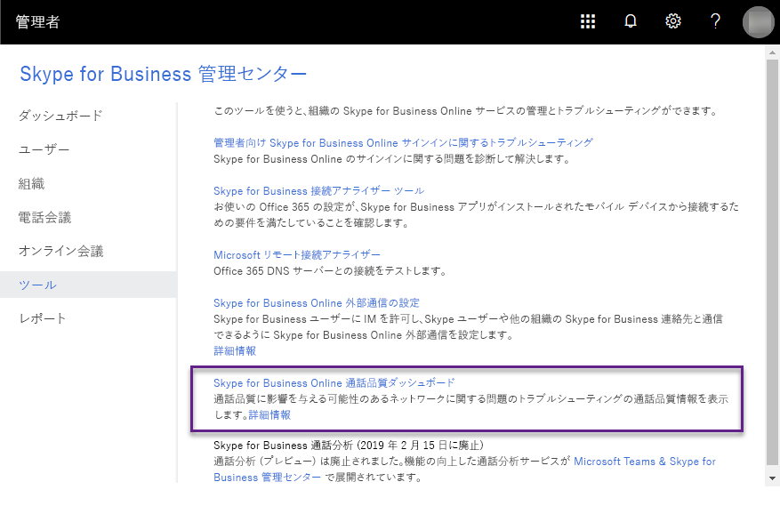
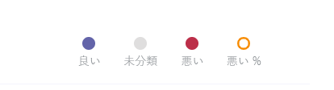
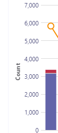
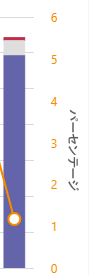
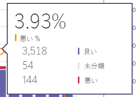
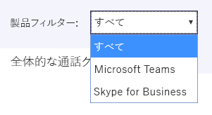
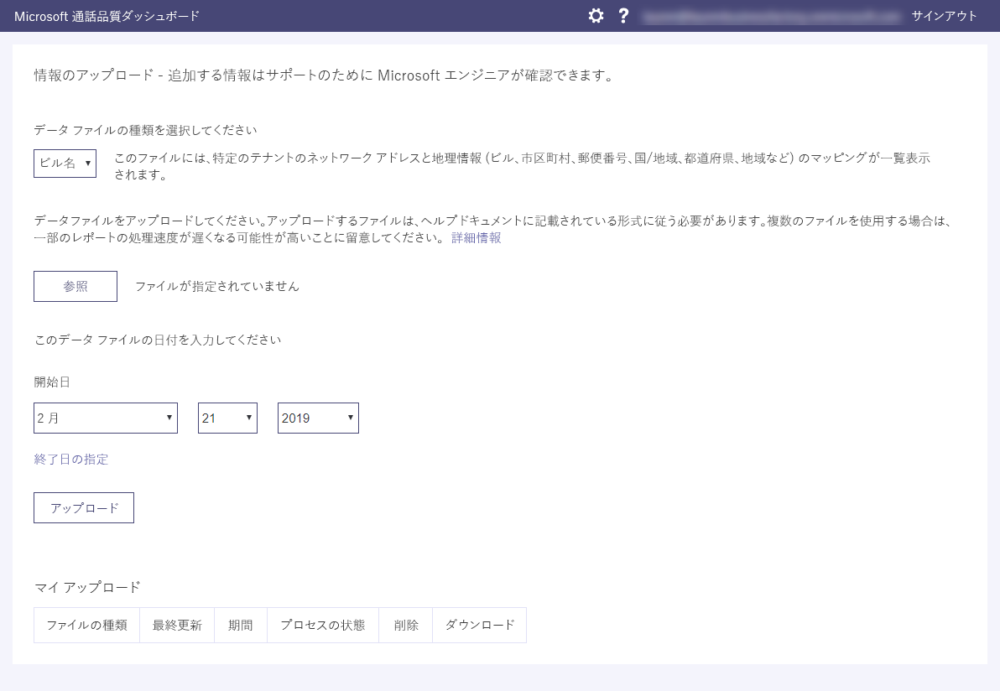
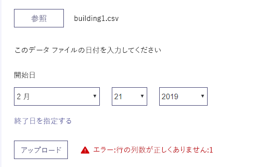
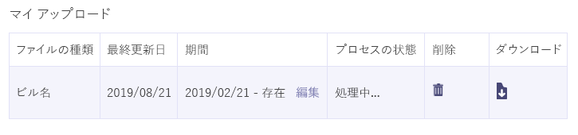

# 有効にして、マイクロソフトのチームと Skype のオンライン ビジネスの品質のダッシュ ボードの呼び出しを使用してTurning on and using Call Quality Dashboard for Microsoft Teams and Skype for Business Online

呼び出し品質ダッシュ ボードを使用して、通話の品質を監視するために Office 365 の組織を構成する方法について説明します。Learn how to configure your Office 365 organization to use the Call Quality Dashboard to monitor call quality.
  
マイクロソフト チームの呼び出し品質ダッシュ ボード (救難) とオンライン ビジネスの Skype では、ビジネス サービスのマイクロソフトのチームと Skype を使用して行われた通話の品質の洞察を得るために。The Call Quality Dashboard (CQD) for Microsoft Teams and Skype for Business Online allows you to gain insights into the quality of calls made using Microsoft Teams and Skype for Business services. このトピックでは、データの収集を開始するために完了する必要があります手順について説明します。This topic describes the steps you'll need to complete to start collecting data.
  
> [!NOTE]
> 救難の詳細なレポートは、現在テクニカル プレビューとして使用可能ですが、すべての顧客に利用できます。The CQD detailed reports are currently available as Tech Preview but available to all customers. 
  
## 最新の変更と更新Latest changes and updates

救難に最新の変更内容は次のとおりです。The most recent changes to CQD are as follows:
  
- ビジネスをオンラインでのデータの Skype の他のマイクロソフトのチーム データが含まれます。Includes Microsoft Teams data in addition to Skype for Business Online data.
    
- サマリー レポートには、ビジネスをオンラインでのデータのすべてのデータ、マイクロソフトのチームのデータ、または Skype を選択するのには製品のフィルターが含まれます。Summary reports include a product filter to select all data, Microsoft Teams data, or Skype for Business Online data.

- ビデオおよび VBSS のストリームの品質分類ロジックが更新されました。Video and VBSS stream quality classification logic has been updated. 最新の分類子の定義については、[品質のダッシュ ボードの呼び出しでストリームの分類](stream-classification-in-call-quality-dashboard.md)を参照してください。Refer to [Stream Classification in Call Quality Dashboard](stream-classification-in-call-quality-dashboard.md) for the latest classifier definitions.

[ディメンションとメジャーのコール品質のダッシュ ボードで使用可能な](dimensions-and-measures-available-in-call-quality-dashboard.md)一覧については、この資料を参照してください。Refer to this article for a list of [Dimensions and measures available in Call Quality Dashboard](dimensions-and-measures-available-in-call-quality-dashboard.md).
  
> [!NOTE]
> リンクをクリックしてダッシュ ボードに対する更新や変更についての情報を参照して、**朗報!**Information about updates and changes to the dashboard can be found by clicking the link in the **Good news!** ダッシュ ボードに表示する場合のバナーです。banner when it is displayed on the dashboard.
  
## Microsoft 呼び出し品質ダッシュ ボード (救難) の要約レポートをアクティブにします。Activate Microsoft Call Quality Dashboard (CQD) Summary Reports

救難を使用する前に、Office 365 の組織を有効にする必要があります。Before you can start using the CQD, you'll need to activate it for your Office 365 organization.
 
 **Skype for Business の管理センターを使用する** **Using the Skype for Business admin center**
 
1. 、管理者アカウントを使用して、Office 365 の組織にサインインし、管理センターを開くに**管理者**のタイルを選択します。Sign in to your Office 365 organization using an admin account, and then select the **Admin** tile to open the Admin center.
    
2. **管理センター**を、下の左側のウィンドウで開くには、Skype のビジネス管理センターに**ビジネス用の Skype**を選択します。In the left pane, under **Admin centers**, select **Skype for Business** to open the Skype for Business admin center.
    
3. Skype のビジネス管理センターでは、左側のウィンドウで**ツール**を選択し、 **Skype**ビジネス オンライン コール品質のダッシュ ボードのします。In the Skype for Business admin center, select **Tools** in the left pane, and then select **Skype for Business Online Call Quality Dashboard**.
    
     
  
4. [開く] ページで、グローバル管理者アカウントでサインインし、が表示されたら、アカウントの資格情報を提供します。On the page that opens, sign in with your Global Administrator account, and then provide the credentials for the account when prompted.
    
     
  
サインイン後、1 回だけをアクティブ化、CQD はデータの収集と処理を開始します。After you sign in, once activated, the CQD will begin collecting and processing data.
  
> [!NOTE]
> いくつかのレポートには意味のある結果を表示するための十分なデータの処理に時間がかかる場合があります。It may take a couple of hours to process enough data to display meaningful results in the reports. 
  
## オンライン ビジネスの Skype の通話品質のダッシュ ボードの機能Features of the Call Quality Dashboard for Skype for Business Online

救難の概要のレポートでは、計画の詳細なレポート機能のサブセットを提供します。CQD Summary Reports provide a subset of the features planned for Detailed Reports. ここで 2 つのエディションの相違点の概要します。The differences between the two editions are summarized here:
  
|**機能****Feature**|**サマリー ・ レポート****Summary Reports**|**詳細なレポート****Detailed Reports**|
|:-----|:-----|:-----|
|アプリケーション共有の指標Application sharing metric    |なしNo    |ありYes    |
|お客様の情報のサポートを構築します。Customer building information support    |ありYes    |ありYes    |
|ドリルダウン分析サポートDrill-down analysis support    |なしNo    |ありYes    |
|メディアの信頼性の指標Media reliability metrics    |なしNo    |ありYes    |
|ボックスのレポートOut-of-the-box reports    |ありYes    |ありYes    |
|プロジェクト概要のレポートOverview reports    |ありYes    |ありYes    |
|ユーザーごとにレポートのセットPer-user report set    |なしNo    |ありYes    |
|レポートのカスタマイズの設定 (追加、削除、レポートの変更)Report set customization (add, delete, modify reports)    |なしNo    |ありYes    |
|ビデオ ベースの画面の測定値を共有Video-based screen sharing metrics    |なしNo    |ありYes    |
|ビデオの測定基準Video metrics    |なしNo    |ありYes    |
|利用可能なデータ量です。Amount of data available    |過去 6 か月Last 6 months    |過去 6 か月Last 6 months    |
|マイクロソフト チームのデータMicrosoft Teams data    |ありYes    |ありYes    |
   
### ボックスのレポートOut-of-the-box reports

救難の両方のエディションは、- の標準を提供する経験をすることが、新しいレポートを作成する必要のない品質基準を呼び出します。Both editions of CQD provide an out-of-the-box experience, giving you call quality metrics without the need to create any new reports. 表示を開始するには、バックエンドのデータが処理されると、レポートのデータの品質を呼び出します。Once data is processed in the back-end, you can start seeing call quality data in the reports.
  
### プロジェクト概要のレポートOverview reports

救難の両方のエディションに、全体的な通話品質については、高度なエントリ ポイントを提供するが、サマリー レポートに情報を表示する方法の詳細なレポートの場合と異なる。Both editions of the CQD provide a high-level entry point to the overall call quality information, but the way information is presented in Summary Reports is different from that of Detailed Reports.
  
サマリー ・ レポートを簡単に参照し、全体的な通話品質のステータスと傾向を理解できるようにするシンプルなタブ付きページのレポート ビューを提供します。Summary Reports provide a simplified tabbed page report view that enables users to quickly browse and understand the overall call quality status and trends.
  
4 つのタブは次のとおりです。The four tabs include:
  
- **呼び出しの全体的な品質**のでは、すべてのストリームは、ストリームのクライアント サーバーの集約とクライアント ストリームと同様に別々 のサーバー ・ クライアントと毎月と毎日の傾向として、クライアントのストリームに関する情報を提供します。**Overall Call Quality** - provides information about all streams, which is an aggregation of Server-Client streams and Client-Client streams, as well as separate Server-Client and Client-Client streams, in the form of monthly and daily trends.
    
- **サーバ ・ クライアント**・ サーバーとクライアントのエンドポイント間でのストリームの追加の詳細情報を提供します。**Server - Client** - provides additional details for the streams between Server and Client endpoints.
    
- **クライアント - クライアント**- クライアントの 2 つのエンドポイント間でのストリームの追加の詳細情報を提供します。**Client - Client** - provides additional details for the streams between two Client endpoints.
    
- **音声品質の SLA**では、呼び出し、Skype ビジネス オンライン音声品質の SLA に含まれているに関する情報を提供します。**Voice Quality SLA** - provides information about calls that are included in the Skype for Business Online Voice Quality SLA.
    
### 全体的な品質の電話] タブOverall Call Quality tab

ストリームの数と割合の低下を見て、通話品質のステータスと傾向を評価するために、このタブでデータを使用します。Use the data on this tab to evaluate call quality status and trends by looking at the stream counts and poor percentages. 右上隅の凡例は、どの色と視覚的な要素は、これらの測定値を表すかを示しています。The legend in the upper-right corner shows which color and visual elements represent these metrics.
  

  
ストリームは、3 つのグループに分類されます: 良い、悪い、および未分類。Streams are classified in three groups: Good, Poor, and Unclassified. あるも計算 *% が不適切な*値はように分類されたストリームの合計数*が低い*と分類するストリームの比率です。There are also calculated  *Poor %*  values that give you the ratio of streams classified as *Poor*  to the total classified stream count. *% の低下 = 低下ストリーム/(不適切なストリーム + 良いストリーム) \* 100* 、これにより、 *% の低下*は、*未分類*の複数のストリームが存在することによって影響を受けていません。Since *Poor % = Poor streams/ (Poor streams+ Good streams) \* 100*  , this makes the *Poor %*  unaffected by the presence with multiple *Unclassified*  streams. 用途として不適切なまたは適切なストリームをクラス分けするため、[品質のダッシュ ボードの呼び出しでストリームの分類](stream-classification-in-call-quality-dashboard.md)を参照してください。For what is used for classifying a stream as poor or good, refer to [Stream Classification in Call Quality Dashboard](stream-classification-in-call-quality-dashboard.md).
  
左側のスケールを使用すると、ストリームの数の値を測定できます。Use the scale on the left to measure the stream count values.
  

  
右側のスケールを使用すると、低下の % 値を測定できます。Use the scale on the right to measure the Poor % values.
  

  
バーの上にマウスを合わせると、実際の数値を取得することもできます。You can also obtain the actual numerical values by hovering the mouse over a bar.
  
> [!NOTE]
> 次の例では、非常に小規模なサンプル データ セットから、値は実際の展開を写実的です。The following example is from a very small sample data set, and the values aren't realistic for an actual deployment. 
  

  
ストリームの全体のボリュームは、重要な要因を判断する方法に関連する集計の割合は低いのです。The overall stream volume is an important factor in determining how relevant the calculated Poor percentages are. 報告された不適切な割合の値は、ストリームの全体的な量が小さいほど、信頼性が低いです。The smaller the volume of overall streams, the less reliable the reported Poor percentage values are.
  
### クライアント サーバー] タブと [クライアントのタブServer-Client tab and Client-Client tabs

これら 2 つのタブは、そのエンドポイントのエンドポイントへのシナリオで行われたストリームの追加の詳細情報を提供します。These two tabs provide additional details for the streams that took place in their endpoint-to-endpoint scenarios. 両方のタブには、メディア ストリームがフローする 4 つのシナリオを表す 4 つの折りたたみ可能なセクションがあります。Both tabs have four collapsible sections, representing four scenarios under which media streams would flow.
  
- 内ワイヤード (有線)Wired Inside
    
- 外ワイヤード (有線)Wired Outside
    
- Wifi の内側Wifi Inside
    
- Wifi 外Wifi Outside
    
#### 内部テストInside Test

処理中に救難のバックエンドは、存在する場合*の内側*または*外側*建物の情報を使用してストリームを分類します。During processing, the CQD back-end classifies a stream as  *Inside*  or *Outside*  using Building information, if it exists. 各ストリームのエンドポイントでは、サブネット アドレスに関連付けられます。Endpoints of each stream are associated with a subnet address. アップロードされた建物の情報で InsideCorp をマークするサブネットの一覧で、サブネットがある場合は、*内部*見なされます。If the subnet is in the list of the subnets marked InsideCorp in the uploaded Building information, then it is considered *Inside*. 建物情報がまだアップロードされていない場合、テスト中は常にストリームとして分類*外側*。If Building information has not yet been uploaded, then Inside Test will always classify the streams as *Outside*. クライアント サーバー シナリオのテストの中にクライアント エンドポイントのみと見なされることに注意してください。Please note that Inside Test for Server-Client scenario only considers the client endpoint. サーバーであるため常に外部ユーザーの観点からこの加算されません、テストします。Because servers are always outside from a user's perspective, this isn't accounted for in the test.
  
#### Wifi とワイヤード (有線)Wired vs. wifi

名前が示す、これは、クライアント接続の種類に基づく分類の基準。As the names indicate, this is a classification criteria based on the type of client connections. もう一度、サーバーが常にワイヤード (有線) し、それは計算に含まれていません。Again, server is always wired and it isn't included in the calculation.
  
> [!NOTE]
> Wifi ネットワークに接続されている 2 つのエンドポイントのいずれかの場合に、ストリームを指定し、として分類されます救難の Wifi。Given a stream, if one of the two endpoints is connected to a Wifi network, then it is classified as Wifi in CQD. 
  
## レポートに表示する製品データを選択します。Selecting product data to see in reports

製品のすべてのデータを表示するのには**製品のフィルター**のドロップダウン メニューを使用する概要および強化されたレポートの場所では、マイクロソフトのチームのデータのみに使用する場合、またはオンライン ビジネスのデータを Skype だけです。In the Summary and Location Enhanced Reports, you can use the **Product Filter** drop-down to show all product data, only Microsoft Teams data, or only Skype for Business Online data.
  

  
詳細なレポートは、マイクロソフトのチームまたは Skype のオンライン ビジネスのデータをレポートの定義の一部としてデータをフィルター選択するのには **、チーム**の分析コードを使用できます。In Detailed reports, you can use the **Is Teams** dimension to filter the data to Microsoft Teams or Skype for Business Online data as part of defining the report.
  
## アップロードの構築についてUpload Building information

救難の概要レポートのダッシュ ボードには、**テナントのデータのアップロード**] ページで、右上隅で [設定] メニューから**テナントのデータのアップロード**を選択することによってアクセスが含まれています。The CQD Summary Reports dashboard includes a **Tenant Data Upload** page, accessed by selecting **Tenant Data Upload** from the settings menu in the top-right corner. このページは地理的な情報は、IP アドレスのマッピングなど、独自の情報をアップロードするのには管理者の使用などの各ワイヤレス AP とその MAC アドレスのマッピング、します。This page is used for admins to upload their own information, such as mapping of IP address and geographical information, mapping each wireless AP and its MAC address, etc.
  

  
1. **テナント データのアップロード**] ページで、アップロードするファイルの種類を選択するのにドロップ ダウン メニューを使用します。On the **Tenant Data Upload** page, use the drop-down menu to choose a data file type for uploading. ファイルのデータ型は、ファイルの内容を表します (たとえば、「建物」は、IP アドレスのマッピングと同様に他の地理的な情報を構築) します。The file data type denotes the content of the file (for example, "Building" refers to mapping of IP address and building as well as other geographical information). 現在構築のデータ型はサポートのみです。Currently we are only supporting the "Building" data type. 以降のリリースでは、いくつかの複数のデータ型が追加されます。A few more data types will be added with subsequent releases.
    
2. ファイルのデータ型を選択すると、データ ファイルを選択する**参照**ををクリックします。After selecting the file data type, click **Browse** to choose a data file.
    
   - .Tsv (タブ区切り) ファイルまたは .csv (コンマ区切り値) ファイル、データ ファイルがある必要があります。The data file must be a .tsv (Tab-separated values) file or a .csv (Comma-separated value) file. .Csv ファイルを使用する場合は、コンマを含む任意のフィールド引用符で囲む必要がありますもコンマを削除します。If using a .csv file, any field that contains a comma must be surrounded by quotes or have the comma removed. などの場合は、建物の名前は、ニューヨーク州、ニューヨーク州、.csv ファイルで、必要がありますとして入力する「ニューヨーク州、ニューヨーク州」。For example, if your building name is NY,NY, in the .csv file it should be entered as "NY,NY".
    
   - データ ファイルは、サイズが 50 MB を超えるする必要があります。The data file must be no larger than 50MB in size.
    
   - ファイル内の各列は、データ ファイルごとに、このトピックの後半で説明、定義済みのデータ型を一致しなければなりません。For each data file, each column in the file must match a predefined data type, discussed later in this topic.
    
3. データ ファイルを選択すると、**開始日**と、必要に応じて、**終了日を指定**を指定します。After selecting a data file, specify **Start date** and, optionally, **Specify an end date**.
    
4. **開始日**を選択すると、救難サーバーにファイルをアップロードして**アップロード**を選択します。After selecting **Start date**, select **Upload** to upload the file to the CQD server.
    
    ファイルをアップロードすると、前に、最初に検証されます。Before the file is uploaded, it is first validated. 検証、Azure blob に格納されます。Once validated, it is stored in an Azure blob. Azure blob に格納する検証が失敗した場合またはファイルが失敗したかどうか、ファイルへの修正を要求するエラー メッセージが表示されます。If validation fails or the file fails to be stored in an Azure blob, an error message is displayed requesting a correction to the file. 次の図は、データ ファイル内の列の数が正しくないときに発生するエラーを示しています。The following image shows an error occurring when the number of columns in the data file is incorrect.
    
     
  
5. 検証中にエラーが発生しない場合、ファイルのアップロードは成功します。If no errors occur during validation, the file upload will succeed. そのページの下部にある現在のテナントのすべてのアップロードされたファイルの完全な一覧を表示 **、アップロード**の表にデータがアップロードされたファイルを表示できます。You can then see the uploaded data file in the **My uploads** table, which shows the full list of all uploaded files for the current tenant at the bottom of that page.
    
    各レコードは、データ ファイル、ファイルの種類、最終更新時刻、期間、説明、[削除] アイコンと、ダウンロード アイコンのアップロードされたテナントの 1 つを示しています。Each record shows one uploaded tenant data file, with file type, last update time, time period, description, a remove icon, and a download icon. ファイルを削除するには、表に、ごみ箱] アイコンを選択します。To remove a file, select the trash bin icon in the table. ファイルをダウンロードするには、テーブルの [**ダウンロード**] 列でのダウンロード アイコンを選択します。To download a file, select the download icon in the **Download** column of the table.
    
     
  
### テナント データのファイル形式とデータ ファイルの構造を構築Tenant data file format and Building data file structure

アップロードするデータ ファイルの形式では、アップロードする前に検証チェックに合格するのには以下を満たす必要があります。The format of the data file you upload must meet the following to pass the validation check before uploading.
  
- .Tsv ファイルには、行ごとに列がタブで区切られたまたはコンマで区切られた各列を含む .csv ファイルのいずれか、ファイルがある必要があります。The file must be either a .tsv file, which means, in each row, columns are separated by a TAB, or a .csv file with each column separated by a comma.
    
- データ ファイルの内容には、テーブルの見出しが含まれていません。The content of the data file doesn't include table headers. ヘッダーではないなどの「ネットワーク」は、データ ファイルの最初の行には、実際のデータ必要があることなどです。That means the first line of the data file should be real data, not headers like "Network," etc.
    
- 列ごとにデータ型は、必ず文字列、数値、またはブール値です。For each column, the data type can only be String, Number, or Bool. 値が数値値をする必要があります数の場合は、Bool の場合、値は 0 または 1 のいずれかにする必要があります。If it is Number, the value must be a numeric value; if it is Bool, the value must be either 0 or 1.
    
- 列ごとにデータ型が文字列である場合、データ空にすることができます (ですが、まだ、適切な区切り文字 (つまり、タブまたはカンマ) で区切る必要があります。For each column, if the data type is string, the data can be empty (but still must be separated by an appropriate delimiter (i.e., a tab or comma). これだけでフィールドに割り当て、その空の文字列値。This just assigns that field an empty string value.
    
- 行ごとに 14 の列が存在する必要があります各列には、次のデータ型、および列は、次の表に記載されている順序である必要があります。There must be 14 columns for each row, each column must have the following data type, and the columns must be in the order listed in the following table:
    
|**列名****Column Name**|**データ型****Data type**|**例****Example**|
|:-----|:-----|:-----|
|ネットワークNetwork    |文字列String    |192.168.1.0192.168.1.0    |
|ネットワーク名リソースNetworkName    |文字列String    |米国/シアトル/シアトル-海-1USA/Seattle/SEATTLE-SEA-1    |
|NetworkRangeNetworkRange    |数値Number    |2626    |
|BuildingNameBuildingName    |文字列String    |シアトル-海-1SEATTLE-SEA-1    |
|OwnershipTypeOwnershipType    |文字列String    |Contoso 社Contoso    |
|BuildingTypeBuildingType    |文字列String    |IT 終了IT Termination    |
|BuildingOfficeTypeBuildingOfficeType    |文字列String    |エンジニア リングEngineering    |
|市区町村City    |文字列String    |調布市調布ヶ丘Seattle    |
|ZipCodeZipCode    |文字列String    |9800198001    |
|国Country    |文字列String    |ごUS    |
|都道府県State    |文字列String    |WAWA    |
|RegionRegion    |文字列String    |MSUMSUS    |
|InsideCorpInsideCorp    |ブール値Bool    |11    |
|ExpressRouteExpressRoute    |ブール値Bool    |00    |
   
> [!IMPORTANT]
> スーパー (1 つのルーティング プレフィックスを持つ複数のサブネットの組み合わせ) を表すには、ネットワークの範囲を使用できます。The network range can be used to represent a supernet (combination of several subnets with a single routing prefix). 任意の重複する範囲のすべての新しい文書のアップロードがチェックされます。All new building uploads will be checked for any overlapping ranges. 以前構築ファイルをアップロードした場合は、現在のファイルをダウンロードし、再すべての重複を識別し、再度アップロードする前に問題を修正するのには。If you have previously uploaded a building file, you should download the current file and re-upload it to identify any overlaps and fix the issue before uploading again. レポート内にある建物にサブネットの誤ったマッピング以前アップロードしたファイルの重複している可能性があります。Any overlap in previously uploaded files may result in the wrong mappings of subnets to buildings in the reports. 特定の VPN 実装では、サブネット情報は正確に報告はありません。Certain VPN implementations do not accurately report the subnet information. お勧めする、サブネットの 1 つのエントリではなく、ファイルを作成する VPN のサブネットを追加するときに別のエントリとして追加されます VPN のサブネットのアドレスごとに別の 32 ビット ネットワーク。It is recommended that when adding a VPN subnet to the building file, instead of one entry for the subnet, separate entries are added for each address in the VPN subnet as a separate 32-bit network. 各行には、同じ文書のメタデータを持つことができます。Each row can have the same building metadata. などの 172.16.18.0/24 の 1 つの行ではなく 256 行は、172.16.18.0/32 と 172.16.18.255/32、包括的なアドレスごとに 1 行を持つ必要があります。For example, instead of one row for 172.16.18.0/24, you should have 256 rows, with one row for each address between 172.16.18.0/32 and 172.16.18.255/32, inclusive. 
  
## 詳細なレポートにメディアの種類を選択します。Selecting media type in detailed reports

詳細なレポートでは、オーディオ、ビデオ、アプリケーション共有、および画面共有するメディアの種類のビデオ ・ ベースの品質とメディアの信頼性を見るをサポートします。The detailed reports support looking at quality and media reliability for audio, video, application sharing, and video-based screen-sharing media types. ディメンション、メジャー、および 1 つのメディアの種類に固有のフィルターをプレフィックスとして「オーディオ」、「ビデオ」、「AppSharing」、または「VBSS」があります。Dimensions, measures, and filters that are specific to a single media type have "Audio", "Video", "AppSharing", or "VBSS" as a prefix.
  

  
ディメンションと 1 つのメディア タイプのメジャーを表示する場合は、新しいメディアの種類のディメンションとフィルターが必要な可能性があります。If you want to view the dimensions and measures for a single media type, the new MediaType dimension and filter may be required. たとえば、合計のセッションは、別のメディアの種類を示すレポートを表示するには、メディアの種類のディメンションが含まれます。For example, to have a report that shows the total session counts across different media types, include the MediaType dimension.
  

## 関連トピックRelated topics
[Skype for Business の通話分析をセットアップするSet up Skype for Business Call Analytics](set-up-call-analytics.md)

[分析機能の呼び出しを使用して不適切な通話の音質をトラブルシューティングするにはUse Call Analytics to troubleshoot poor  call quality](use-call-analytics-to-troubleshoot-poor-call-quality.md)

[呼び出しを分析し、通話品質のダッシュ ボードCall Analytics and Call Quality Dashboard](difference-between-call-analytics-and-call-quality-dashboard.md)

  
 