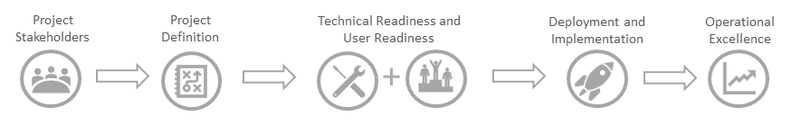

# アップグレードのフレームワークについてAbout the upgrade framework

アップグレードの過程から推量を行うため、microsoft は、変更を実装するための実証済みのフレームワークを採用しました。To help take the guesswork out of your upgrade journey, we've employed a proven framework for implementing change. 次に示すように、フレームワークの各手順は前の手順で構築されており、最適な結果を得るためには、次の手順に従うことをお勧めします。As illustrated below, each step in the framework builds on the step prior and, for optimal results, we recommend following the steps in order.  

まず、適切なステークホルダーを集めて、アップグレード計画を定義します (スコープ、目標、タイムラインなど)。Begin by bringing together the right stakeholders and defining your upgrade plan (e.g. scope, goals and timeline). 計画を立て、テクニカル環境とエンドユーザーが Teams を使用できるようになったことを確認します。With a plan in place, confirm your technical environment and your end-users are ready for Teams. 次に、準備が整った段階で、パイロットから組織全体のアップグレードに移行します。Then, implement your upgrade in stages, moving from a pilot to an organization-wide upgrade when ready. 組織がチームに参加したら、品質を監視し、ユーザーの導入を加速する運用計画を確立します。Once your organization is on Teams, establish an operational plan that monitors for quality and accelerates user adoption.

アップグレードプロセスの場所を特定するには、関連ページでこのフレームワークのグラフィックを探します。Look for this framework graphic on related pages to identify where you are in the upgrade process.

## アップグレードタイムラインの例Sample upgrade timeline

変更の計画を開始すると、アップグレードの過程が開始されます。Your upgrade journey begins when you start planning for the change. このガイドラインとして成功フレームワークを利用することで、アップグレード前のフェーズから、アップグレードの計画と準備を行うためのサンプルタイムラインと、アップグレード後の運用フェーズに移動して、結果を維持および向上させることができます。Leveraging the success framework as a guideline, below is a sample timeline that take you from the pre-upgrade phase where you will plan and prepare for your upgrade, through the upgrade and into the post-upgrade operational phase, designed to sustain and amplify your outcomes. 

> [!NOTE]
> チームへの旅には、複数の [モード](https://aka.ms/skypetoteams-coexist)の活用、   さまざまなタイミングでのユーザーのグループのアップグレードが含まれていることがわかっています。これにより、チームとの勢いを維持しながら、ユーザーのアップグレードエクスペリエンスを制御することができます。We understand that your journey to Teams might involve leveraging multiple [modes](https://aka.ms/skypetoteams-coexist) and upgrading groups of users at different times, which will enable you to control the user upgrade experience while maintaining momentum with Teams.  

アップグレード過程がどのように展開されるかを示すために、次のサンプル計画を用意しています。これにより、Skype for Business Online から部門間のモードへの移動が定義されています。To help demonstrate how your upgrade journey might unfold, we've provided a sample plan below that defines a journey going from Skype for Business Online to Islands mode to Teams only. さらに、サンプルの計画では、ユーザーを4つのアップグレードグループまたは cohorts に分類した組織の概要を示します。In addition, the sample plan outlines an organization that has divided their users into four upgrade groups, or cohorts. これをテンプレートとして使用して、チームへの具体的な旅をカバーし、使用しているさまざまな [モード](https://aka.ms/skypetoteams-coexist)   とユーザーのセグメント化を行うアップグレードグループの数を組み込み、プランをカスタマイズします。Using this as a template, customize the plan to encompass your specific journey to Teams, incorporating the various [modes](https://aka.ms/skypetoteams-coexist) you'll use and the number of upgrade groups you'll segment your users into. 

## アップグレード前Pre-upgrade

**チームの組織を準備**します。**Prepare your organization for Teams**. チームへのアップグレードを成功させるためには、準備のために十分な時間を割り当てることが重要です。To help ensure a successful upgrade to Teams, it's important to allocate adequate time for preparation. 組織が Teams の価値をすぐに実感できるだけでなく、チームの準備が整うとすぐに Skype for Business からアップグレードを迅速に開始できるようになります。Not only will your organization be able to quickly start realizing the value of Teams, you'll be able to accelerate your upgrade from Skype for Business as soon as Teams is ready for you. Skype for Business と共にチームを既に有効にしている場合は、これらのアップグレード前のアクティビティをチェックポイントとして使用して、ユーザーをチームにアップグレードする前に、組織の準備ができていることを確認します。If you've already enabled Teams alongside Skype for Business, use these pre-upgrade activities as a checkpoint to validate your organization's readiness before you upgrade users to Teams. 

> [!TIP]
>  [Upgrade Success Kit](https://aka.ms/UpgradeSuccessKit)   サンプルアップグレードプロジェクト計画とパイロットテスト計画に加えて、コミュニケーションやユーザーアンケートなどのテンプレートのユーザー準備資料のアップグレード成功キットをダウンロードします。Download the [Upgrade Success Kit](https://aka.ms/UpgradeSuccessKit) for template user readiness materials, such as communications and user surveys, in addition to a sample upgrade project plan and pilot test plan. このキットで利用できるアイテムには、以下のリストでアスタリスク (\*) が付いています。Items that are available in the kit are marked with an asterisk (\*) in the lists below.

### 計画: 組織が長期間の成功を確実に設定できるようにアップグレード計画を作成するPlan: Create your upgrade plan to help ensure your organization is set up for long-term success

| ステップStep |  | 概要Summary | 設備Resource |
|------|--|---------|----------|
| **1****1** | **関係者を定義する****Define your stakeholders** | アップグレードの成功のために責任を負うプロジェクトチームメンバーを割り当てます。Assign project team members accountable for driving upgrade success. | [関係者を登録するEnlist your stakeholders](upgrade-enlist-stakeholders.md) |
| **2****2** | **プロジェクトのビジョンとスコープを定義する****Define your project vision and scope** | "全体像" ビジョンと現在のプロジェクトスコープを設計して、アップグレードに向けた青写真を作成します。Design your "big picture" vision and current project scope to create a blueprint for your upgrade journey. | [プロジェクトビジョンProject vision](upgrade-define-project-scope.md#project-vision)    [プロジェクトのスコープProject scope](upgrade-define-project-scope.md#project-scope) |
| **3****3** | **プロジェクトの目標を定義する****Define your project goals** | 進捗状況とプロジェクトの成功率の測定を可能にするターゲット目標を設定します。Set targeted goals that enable you to measure progress as well as project success. | [プロジェクトの目標Project goals](upgrade-define-project-scope.md#project-goals) |
| **4****4** | **リスクと軽減計画を特定する****Identify risks and mitigation plans** | リスク軽減計画を確立して、プロジェクトをすぐに把握できるようにします。Establish a mitigation plan to ensure you can quickly get your project back on track should issues arise. | [リスクと軽減Risks and mitigation](upgrade-define-project-scope.md#risks-and-mitigation) |
| **5****5** | **タイムラインを定義する****Define your timeline** | タイムラインと主要なマイルストーンを設定して、プロジェクトを予算内に維持することができます。Set a timeline and key milestones to help your project stay on time and on budget. | [時間Timeline](upgrade-define-project-scope.md#timeline)    [アップグレード成功キットUpgrade Success Kit](https://aka.ms/UpgradeSuccessKit) |
| **6****6** | **適切な Skype for Business および Teams のアップグレードと共存戦略を定義する****Define the appropriate Skype for Business and Teams upgrade and coexistence strategy** | Skype for Business から組織のチームへの最適なパスを確保するために、自分の旅を地図にします。Map your journey to ensure the best path from Skype for Business to Teams for your organization. | [Microsoft Teams と Skype for Business の共存と相互運用性を理解するUnderstand Microsoft Teams and Skype for Business coexistence and interoperability](teams-and-skypeforbusiness-coexistence-and-interoperability.md)   [電話システムと PSTN の接続オプションについてUnderstand Phone System and PSTN connectivity options](cloud-voice-landing-page.md)    [アップグレードの行程を選択するChoose your upgrade journey](upgrade-and-coexistence-of-skypeforbusiness-and-teams.md) |

### 準備: Teams に対する組織の準備を評価するPrepare: Evaluate your organization's readiness for Teams

| ステップStep |  | 概要Summary | 設備Resource |
|------|--|---------|----------|
| **1****1** | **環境を評価して、チームのテクニカルオンボードを完成させる****Assess your environment and complete Teams technical onboarding** | 環境のユーザーエクスペリエンスを最適化し、時間の経過と共にアップグレードを容易にするために、チームでの準備が整っていることを確認します。Ensure your environment is ready for Teams to help optimize the user experience and facilitate your upgrade over time. | [Teams にアップグレードする前に、環境を評価して](upgrade-plan-journey-evaluate-environment.md)ください。[Evaluate your environment before upgrading to Teams](upgrade-plan-journey-evaluate-environment.md).   [Teams にアップグレードするためのサービスを準備するPrepare your service for upgrading to Teams](upgrade-prepare-environment-prepare-service.md) |
| **2****2** | **チーム用にネットワークを最適化する (特にリアルタイムのメディアシナリオ)****Optimize network for Teams, particularly for real-time media scenarios** | オーディオ、ビデオ、または会議を展開している場合は、その機能を利用できるようにネットワークを最適化するために、次の追加の手順を実行します。If you're deploying audio, video, or meetings, take these additional steps to optimize your network for that functionality. | [Teams にアップグレードするためにネットワークを準備するPrepare your network for upgrading to Teams](prepare-network.md) |
| **3****3** | **組織の変更の準備を評価し、チームワークのシナリオを定義する****Assess organizational change readiness and define teamwork scenarios** | ユーザのベースを理解して、適切な価値のあるメッセージと教育レベルを準備し、ユーザーの導入を容易にします。Understand your user base to prepare the right value messaging and level of education to facilitate and accelerate user adoption. | [組織変更の準備Organizational change readiness](upgrade-org-change-readiness.md#organizational-change-readiness) |
| **4****4** | **ユーザーによる通信、トレーニング、およびサポートの方法を定義するためのユーザーの準備計画を準備する****Prepare a user readiness plan to define how you will communicate, train, and support users** | コミュニケーション、トレーニング、サポート計画をカスタマイズして、新しいテクノロジに最適な receptiveness を実現します。Personalize your communications, training, and support plan to ensure optimal receptiveness to the new technology. | [ユーザーの研修計画を準備するPrepare a user readiness plan](upgrade-user-readiness.md)  [アップグレード成功キットUpgrade Success Kit](https://aka.ms/UpgradeSuccessKit) |
| **5****5** | **Microsoft Teams の保留中のリリースをアナウンスする****Announce the pending launch of Microsoft Teams** | 早い段階でコミュニケーションを行い、ユーザーの気持ちを抑え、混乱を減らし、興奮を生み出します。Communicate early to help users feel included, reduce confusion, and generate excitement. | [アップグレード成功キットUpgrade Success Kit](https://aka.ms/UpgradeSuccessKit) |
| **6****6** | **チームの IT スタッフを準備する****Prepare your IT staff for Teams** | テクニカルおよびサポート担当者が、チームの技術環境をサポートするために必要なすべての機能を備えていることを確認します。Confirm your technical and support staff has everything they need to ready and support your technical environment for Teams. | [Microsoft Teams の IT スタッフを準備するPrepare your IT staff for Microsoft Teams](upgrade-prepare-it-pros.md)    [アップグレード成功キットUpgrade Success Kit](https://aka.ms/UpgradeSuccessKit) |

### パイロット: パイロットを実行して、組織の準備ができていることを確認し、チームに最適な旅を通知します。Pilot: Run a pilot to confirm that your organization is ready and inform your optimal journey to Teams

| ステップStep |  | 概要Summary | 設備Resource |
|------|--|---------|----------|
| **1****1** | **パイロット物流の概要****Outline pilot logistics** | 組織がアップグレードまたは共存する準備ができているかどうかを検証するための、正式なパイロット物流を定義します。Define formal pilot logistics to help validate your organization's readiness to upgrade or coexist. | [パイロット物流の概要Outline pilot logistics](pilot-essentials.md#1-outline-pilot-logistics) |
| **2****2** | **パイロット参加者とテストシナリオを選択する****Select your pilot participants and test scenarios** | チームワークシナリオを検証し、チームの準備を確認できるユーザーを特定します。Identify users who can help validate teamwork scenarios and verify Teams readiness. | [パイロット参加者とテストシナリオを選択するSelect your pilot participants and test scenarios](pilot-essentials.md#2-select-your-pilot-participants-and-test-scenarios) |
| **3****3** | **テスト計画とフィードバックアンケートを設計する****Design your test plan and feedback survey** | 参加者が完了するための明確に定義されたタスクと、それらのユーザーがフィードバックを共有するための方法を特定します。Identify clearly defined tasks for participants to complete and a way for them to share their feedback. | [テスト計画とフィードバックアンケートを設計するDesign your test plan and feedback survey](pilot-essentials.md#3-design-your-test-plan-and-feedback-survey) |
| **4****4** | **パイロットのコミュニケーション計画を作成する****Create your pilot communications plan** | 何が起こっているか、いつ、なぜ、何が起こるのかについて、パイロットの参加者を教育します。Educate pilot participants on what's happening, when, and why, and what's expected of them. | [コミュニケーション計画を作成するCreate your communications plan](pilot-essentials.md#4-create-your-communications-plan)  [アップグレード成功キットUpgrade Success Kit](https://aka.ms/UpgradeSuccessKit) |
| **5****5** | **パイロットの実施****Conduct your pilot** | パイロットを開始し、進捗状況を追跡し、必要に応じて反復処理を行い、パイロットの結果を最適化します。Start your pilot, track progress and iterate as needed to optimize your pilot results. | [パイロットの実施Conduct your pilot](pilot-essentials.md#5-conduct-your-pilot) |
| **6****6** | **高い知識の評価と、繰越計画の評価****Assess learnings and evaluate your go-forward plan** | ユーザーからのフィードバック、ネットワークの統計情報、サポートチケットを収集して目標を分析し、繰越計画を決定します。Gather  user feedback, network stats, and support tickets for analysis against your goals and determine your go-forward plan. | [高い知識の評価と、繰越計画の評価Assess learnings and evaluate your go-forward plan](pilot-essentials.md#6-assess-learnings-and-evaluate-your-go-forward-plan)

### 展開: Skype for Business との共存で Teams を実行するDeploy: Run Teams in coexistence with Skype for Business

| ステップStep |  | 概要Summary | 設備Resource |
|------|--|---------|----------|
| **1****1** | **Teams の公式リリースを発表する****Announce the official launch of Teams** | Teams の準備ができたときに、正式な立ち上げのお知らせを送信して、興奮と勢いを生み出します。Generate excitement and momentum by sending an official launch announcement when Teams is ready. | [アップグレード成功キットUpgrade Success Kit](https://aka.ms/UpgradeSuccessKit) |
| **2****2** | **アップグレードを実装する****Implement your upgrade** | 実行する手順は、Skype for Business の現在の展開によって異なります。The steps you take depend on your current deployment of Skype for Business. | [アップグレードを実装するImplement your upgrade](upgrade-to-teams.md) |
| **3****3** | **チームロードマップについて常に情報を受け取る****Stay informed about the Teams roadmap** | チームロードマップを監視して、組織が Teams に移行するための適切な時間を特定します。Monitor the Teams roadmap to identify the right time for your organization to move to Teams. | [Teams のロードマップTeams roadmap](https://aka.ms/teamsroadmap) |
| **4****4** | **追加の通信を送信し、チームのエキスパートと協力して、チームの興奮と導入を推進する****Send additional communications and engage Teams champions to drive excitement and adoption of Teams** | 継続的なコミュニケーションとチャンピオンを利用して、チームの魅力をお勧めします。Encourage user adoption and maintain excitement for Teams with ongoing communications and champions. | [Microsoft 365 のチャンピオンプログラムMicrosoft 365 Champions Program](https://aka.ms/O365Champions) |

## UpgradeUpgrade 

**チームに正式な移行を行い**ます。**Make the official move to Teams**. ユーザーをアップグレードする場合は、ユーザーをチーム専用モードに移動します。When you upgrade your users, you move them into Teams only  mode. Teams は、チャット、会議、通話、共同作業のためのプライマリアプリとなり、Skype for Business アプリへのアクセスが無効になります。Teams becomes their primary app for chat, meetings, calling, and collaboration, and access to the Skype for Business app is disabled. このフェーズの技術的な側面は非常に単純ですが、変更によってユーザーエクスペリエンスがどのような影響を受ける可能性があるかを考慮し、ユーザーが自分のアクティビティを Skype for Business からチームに正式に移行できるようにすることを検討してください。Although the technical aspects of this phase are quite simple, consider the effect the change might have on user experience and allow time for users to officially transition their activities from Skype for Business to Teams. 異なるクライアントでさまざまなエクスペリエンスを持つユーザーを減らすには、エンドツーエンドのアップグレードウィンドウを45日間に制限してみてください。To reduce users having different experiences with different clients, try to limit the end-to-end upgrade window to 45 days or so.

### アップグレード: Skype for Business から Teams へのアップグレードの実装Upgrade: Implement your upgrade from Skype for Business to Teams

| ステップStep |  | 概要Summary | 設備Resource |
|------|--|---------|----------|
| **1****1** | **上記で説明したアップグレード前のアクティビティを完了したことを確認します。****Confirm that you've completed the pre-upgrade activities described above** | すべての計画および準備アクティビティの完了を確認して、アップグレードの成功を確認します。Help ensure upgrade success by confirming completion of all planning and preparation activities. | 上記すべてAll the above |
| **2****2** | **最初のアップグレードグループのユーザーとの通信を開始する****Initiate communications to users in your first upgrade group** | アップグレードが開始されたことをユーザーに通知し、プロセス全体を通じて通知された状態を維持します。Notify users that upgrades are starting, and keep them informed throughout the process. | [ユーザーの研修計画を準備するPrepare a user readiness plan](upgrade-user-readiness.md)    [アップグレード成功キットUpgrade Success Kit](https://aka.ms/UpgradeSuccessKit) |
| **3****3** | **最初のアップグレードグループのユーザーに対してのみ、共存モードをチームに有効にする****Enable the coexistence mode to Teams Only for users in your first upgrade group** | Skype for Business 環境に適した手順に従って、ユーザーの技術的な移行を実行します。Follow steps appropriate to your Skype for Business environment to perform the technical user migration. | [Skype for Business Online から Teams にアップグレードするUpgrade from Skype for Business Online to Teams](upgrade-to-Teams-execute-SkypeforBusinessOnline.md)   [Skype for Business オンプレミスから Teams にアップグレードするUpgrade from Skype for Business on-premises to Teams](upgrade-to-Teams-execute-SkypeforBusinessHybridOnprem.md)
| **4****4** | **ローリングサイクルで残りのアップグレードグループについて、上記のアップグレードアクティビティを繰り返す****Repeat the preceding upgrade activities for the remaining upgrade groups on a rolling cycle** | 引き続き継続的な通信計画を推進し、プランに基づいてユーザーグループをアップグレードします。Continue to drive your ongoing communications plan and upgrade user groups based on your plan. | |
| **5****5** | **アップグレード後のフィードバックアンケートをすべてのユーザーに送信する****Send post-upgrade feedback surveys to all users** | フィードバックアンケートを使用して、ユーザーからフィードバックや洞察を得ることができます。Use a feedback survey to capture feedback and insights from users. | [アップグレード成功キットUpgrade Success Kit](https://aka.ms/UpgradeSuccessKit) |

## アップグレード後Post-upgrade

**Teams でビジネス価値を最大限に活用**する。**Maximize business value with Teams**. 組織が Teams に完全にアップグレードされた後は、目標に対する成功を評価し、勢いを前進させる計画を実装します。After your organization is fully upgraded to Teams, take time to evaluate your success against your goals and implement a plan to continue forward momentum. 

### 動作: アップグレードの成否を評価するOperate: Measure the success of your upgrade

| ステップStep |  | 概要Summary | 設備Resource |
|------|--|---------|----------|
| **1****1** | **最初のアップグレード成功の評価****Assess your initial upgrade success** | アップグレード前のフェーズで確立した目標に対する進捗状況を評価します。Evaluate progress against the goals you established in the pre-upgrade phase. | [プロジェクトの目標Project goals](upgrade-define-project-scope.md#project-goals) |
| **2****2** | **トラッキングされていない目標に対するリスク軽減計画を実装する****Implement a mitigation plan for any goals that aren't on track** | 達成していない目標に対して、軽減またはコース修正の戦略を定義します。Define mitigation or course-correction strategies for goals that are not being met. | [プロジェクトの目標Project goals](upgrade-define-project-scope.md#project-goals) |
| **3****3** | **ネットワークの健全性と品質の監視****Monitor for network health and quality** | 良好なユーザーエクスペリエンスを確保し、サポートデスクへの通話を減らすための品質チェックと監視の計画を実装します。Implement a quality check and monitoring plan to help ensure a positive user experience as well as reduce calls to your support desk. | [ネットワークの健全性と品質の監視Monitor for network health and quality](continue-journey.md#monitor-for-network-health-and-quality) |
| **4****4** | **ユーザーの機運と導入を促進する****Drive user momentum and adoption** | 継続的な導入計画を使用して、ユーザーの採用を促し、チームの興奮を維持します。Encourage user adoption and maintain excitement for Teams with an ongoing adoption plan. | [ユーザーの機運と導入を促進するDrive user momentum and adoption](continue-journey.md#drive-user-momentum-and-adoption) |
| **5****5** | **新しい機能に対して準備する****Prepare for new functionality** | 新しい革新と製品の改善のために変更サイクルを確立して、最大の価値を実感してください。Realize maximum value by establishing a change cycle for new innovations and product improvements. | [新しい機能に対して準備するPrepare for new functionality](continue-journey.md#prepare-for-new-functionality)

> [!Note]
> アップグレードに関するコンテンツは、継続的に進化し続けています。Our Upgrade content is continually evolving. 最新のガイダンスを確認して、 [Teams のブログ](https://techcommunity.microsoft.com/t5/Microsoft-Teams-Blog/bg-p/MicrosoftTeamsBlog)を参照してください。Be sure to check back for the latest guidance, and read the [Teams blog](https://techcommunity.microsoft.com/t5/Microsoft-Teams-Blog/bg-p/MicrosoftTeamsBlog). 

> [!Important]
> Skype for Business Online は 2021 年 7 月 31 日に廃止される予定です。それ以降、アクセスとサポートが終了します。Skype for Business Online will be retired on July 31, 2021, after which it will no longer be accessible or supported. 移行によるメリットを最大限に高め、アップグレード実施のための時間を組織で十分確保できるよう、Microsoft Teams への移行をすぐに開始することをお勧めします。To maximize benefit realization and ensure your organization has proper time to implement your upgrade, we encourage you to begin your journey to Microsoft Teams today. アップグレードが成功すると、技術面およびユーザーの準備が整ったことになります。Microsoft Teams への移行を進める際には、必ずこのガイドを活用してください。Remember that a successful upgrade aligns technical and user readiness, so be sure to leverage the guidance herein as you navigate your journey to Microsoft Teams.
