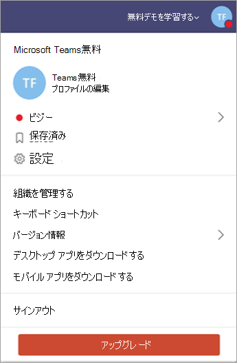

Microsoft Teams を無料で Office 365 月額プラン バージョンにアップグレードするUpgrade Microsoft Teams free to Office 365 subscription version
======================================================

組織は、マイクロソフトのチームの無料版を使用されている場合に簡単にアップグレードできます、完全なバージョンをユーザーの Office 365 サブスクリプション プランを購入することで。If your organization is using the free version of Microsoft Teams, you can easily upgrade to the full version by purchasing an Office 365 subscription plan for your users. 完全版には、チームの追加機能が用意されています-などのスケジュール設定、オーディオ会議、強化された管理、およびセキュリティ機能、無料版を提供しません。The full version provides additional Teams features — like scheduling, audio conferencing, enhanced administration, and security capabilities — that the free version doesn’t provide. Office 365 では、使い慣れた Microsoft Office デスクトップ スイートを組み合わせたクラウド ・ ベースのバージョンをマイクロソフトの次世代のコミュニケーションおよびコラボレーション サービスの-Exchange Online、SharePoint Online では、Office オンラインなど、ユーザーの生産性向上を支援するには事実上あらゆる場所からインターネットを経由します。Office 365 combines the familiar Microsoft Office desktop suite with cloud-based versions of Microsoft's next-generation communications and collaboration services — including Exchange Online, SharePoint Online, and Office Online — to help users be productive from virtually anywhere through the internet. チームをアップグレードするとき、既存のチーム データ失われません。様、すべてのチーム、チャネル、チャット、ファイル、およびアクセス許可には。When you upgrade Teams, your existing Teams data will not be lost; all your teams, channels, chats, files, and permissions come with you. 

> [!NOTE]
> Office 365 サブスクリプションが既にある、ならチームの試用版の対象となる (企業)、id を持つフリーのバージョンではありません。If you already have an Office 365 subscription, you’re eligible for the trial version of Teams (with your corporate identity), not the free version. 試用版のチームでは、限られた時間のチームの完全なバージョンを提供します。The Teams trial provides the full version of Teams for a limited time. 詳細については、[管理、Microsoft チーム商用クラウド試用版の提供](iw-trial-teams.md)を参照してください。For more information, see [Manage the Microsoft Teams Commercial Cloud Trial offer](iw-trial-teams.md).

## 空きチームはチームの完全なバージョンにどのような比較をするでしょうか。How does Teams free compare to the full version of Teams?

空きチームでは、中小企業向けし、次の機能を持ちます。Teams free is designed for small to medium businesses and has the following features:

- 最大ユーザー数 300300 maximum users
- 無制限のチャット メッセージと検索結果Unlimited chat messages and search
- ゲスト アクセスGuest access
- アプリケーションや Word、Excel、PowerPoint、および OneNote のオンライン バージョンを含め、サービスとの統合Integration with apps and services, including the Online versions of Word, Excel, PowerPoint, and OneNote
- ユーザーと共有ストレージの 10 GB あたりのストレージ容量の 2 GB2 GB of storage per user and 10 GB of shared storage
- 1 対 1 およびグループのオンラインのオーディオとビデオ通話1:1 and group online audio and video calling
- チャネル会議Channel meetings
- 画面共有Screen sharing

Office 365 のサブスクリプションに含まれているチームの完全なバージョンには、無料のチームが提供する機能だけでなく次の機能が用意されています。The full version of Teams included with an Office 365 subscription provides the following features in addition to the features that Teams free provides:

- (エンタープライズ ライセンス) を持つユーザーの制限はなしNo user limit (with an enterprise license)
- Exchange 電子メールをホストし、カスタムの電子メール ドメインExchange email hosting and custom email domain
- OneDrive、SharePoint、プランナー、Yammer、およびその他の Office 365 サービスOneDrive, SharePoint, Planner, Yammer, and more Office 365 services
- ユーザーあたりのストレージ容量の 1 TB1 TB of storage per user
- スケジュールされたミーティングScheduled meetings
- オーディオ会議Audio conferencing
- などの多要素認証では、シングル サインオン、および監査とレポート作成に高度な強化されたセキュリティおよびコンプライアンス機能Enhanced security and compliance features, including multi-factor authentication, single sign-on, and advanced auditing and reporting
- 管理機能と 24 x 7 電話や web などのサポート機能をサポートして、ユーザー、アプリケーション、Office 365 サービス、サービス ・ レベル契約では、構成可能なユーザー設定とポリシーの利用状況レポートを管理するための管理ツールAdministrative controls and support features, including 24 x 7 phone and web support, admin tools for managing users and apps, usage reporting for Office 365 services, service-level agreement, and configurable user settings and policies

空きチームとチームの機能の詳細な比較は、[比較のチームの計画](https://products.office.com/microsoft-teams/free)を参照してください。For a detailed comparison of Teams free and Teams features, see [Compare Teams plans](https://products.office.com/microsoft-teams/free).

## アップグレードの要件Upgrade requirements

次の要件に合致する場合は、チームの完全なバージョンにアップグレードできます。You can upgrade to the full version of Teams if you meet the following requirements:

- 既存のチームの無料サブスクリプションにサインアップした人としています。You are the person who signed up for the existing Teams free subscription.
- 場合は独自のドメインを導入するが、いない (O365 サブスクリプションの試用または購入した) 経由で Azure Active Directory に関連付けられています。If you are bringing your own domain, it isn’t already associated with Azure Active Directory (via trial or purchased O365 subscription).

> [!NOTE]
> アップグレードして、データを変換し、チームのアプリケーションでは、アップグレードのプロセスをサブスクリプションを購入する必要です。To upgrade and transfer your data, you have to buy your subscription through the upgrade process in the Teams application. アップグレード プロセスを経由せずにチームと Office 365 を購入した場合は、別のテナントが既に存在しているため、データを転送できません。If you purchased Office 365 with Teams without going through the upgrade process, you can’t transfer your data because you will already have a separate tenant.

## 制限Limitations

次の制限事項に留意してください。Keep the following limitations in mind:

- アップグレードした後は、チームを自由に切り替えることはできません。You can’t switch back to Teams free after you upgrade.
- 1 つの有料のテナントには、複数のチームの空きテナントをマージできません。You can’t merge multiple Teams free tenants into a single paid tenant.
- すべてのユーザーは、同じドメインにする必要があります。All users must be in the same domain. (*ユーザー名*の形式で、サインインのすべてのユーザーが表示されます@*domain.com*)。(All users will get a sign-in in the format *username*@*domain.com*.)
- すべてのユーザーをアップグレードする必要があります: さまざまなチームが同じテナント内の無料および有料のサブスクリプションのユーザーはサポートされていません。All users must be upgraded: a mix of Teams free and paid subscription users in the same tenant is not supported.

## 自分の所属組織をアップグレードする方法How do I upgrade my organization?

チームの完全なバージョンへのアップグレード、チームで**のアップグレード**を選択します。To upgrade to the full version of Teams, select **Upgrade** in Teams.

チームへのサインインに使用する電子メール アドレスを入力し、Office 365 のビジネス プレミアム プランを購入します。Enter the email address that you use to sign in to Teams, and then purchase an Office 365 Business Premium plan. Office 365 の業務に関する重要事項または[サポートに連絡](https://portal.office.com/support/altusupport.aspx?app=teamsfreeupgrade)して、Office 365 のエンタープライズ版を購入する場合は。If you would like to purchase Office 365 Business Essentials or an Enterprise edition of Office 365, [contact support](https://portal.office.com/support/altusupport.aspx?app=teamsfreeupgrade).

## 次は何ですか。What's next?

アップグレードが完了したらを参照してください[マイクロソフトのチームを開始](get-started-with-teams-quick-start.md)[マイクロソフト チームの採用](adopt-microsoft-teams-landing-page.md)および最初のステップのチームの導入を段階的に組織全体にわたって。After your upgrade is complete, see [Get started with Microsoft Teams](get-started-with-teams-quick-start.md) for first steps and [Adopt Microsoft Teams](adopt-microsoft-teams-landing-page.md) for a phased approach to Teams adoption across your organization.

## 詳細情報More information

- チームのバージョンとその機能の詳細については、[比較のチームの計画](https://products.office.com/microsoft-teams/free)を参照してください。To find out more about Teams versions and their capabilities, see [Compare Teams plans](https://products.office.com/microsoft-teams/free).
- チームの完全なバージョンへのアップグレードの詳細については、[自由にチームのチームからのアップグレード](https://support.office.com/article/Upgrade-from-Teams-free-to-Teams-29475bbd-a34f-4175-9b33-d44430f8ad39)を参照してください。For more information about upgrading to the full version of Teams, see [Upgrade from Teams free to Teams](https://support.office.com/article/Upgrade-from-Teams-free-to-Teams-29475bbd-a34f-4175-9b33-d44430f8ad39).
- ユーザー ライセンスの追加を含め、ユーザーのアップグレードに関連するその他の管理タスクのユーザー名を変更して、一時的なパスワードを割り当てることは、[管理者がサブスクリプションを購入する無料のチームからのアップグレードを](https://support.office.com/article/for-admins-upgrading-from-teams-free-to-a-paid-subscription-75a95e7f-001e-42d0-a787-ae8b992d5a52)参照してください。For additional admin tasks associated with upgrading users, including adding user licenses, changing user names, and assigning temporary passwords, see [For admins upgrading from Teams free to a paid subscription](https://support.office.com/article/for-admins-upgrading-from-teams-free-to-a-paid-subscription-75a95e7f-001e-42d0-a787-ae8b992d5a52).
- チーム、組織の自由を管理する方法の詳細については、[マイクロソフトのチームの無料版の管理](manage-freemium.md)を参照してください。For information about managing Teams free in your organization, see [Manage the free version of Microsoft Teams](manage-freemium.md).

