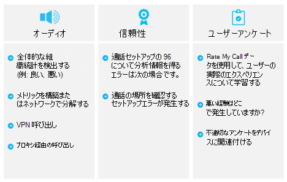

# QoE のレビュー ガイド

この記事は、Skype for BusinessからTeamsへのアップグレードが完了するとすぐに始まる、アップグレード体験のオペレーショナル エクセレンス ステージの一部です。

## 通話品質の向上と監視

[Teamsの通話品質の向上と監視](monitor-call-quality-qos.md)には、次に示すように、ユーザー エクスペリエンスの向上に最も大きな影響を与える主要な分野で修復ガイダンスを評価して提供する一連のアクティビティが含まれます。

ガイドで説明されている領域を継続的に評価して修復することで、ユーザー エクスペリエンスに悪影響を及ぼす可能性を減らすことができます。 展開で生じる多くのユーザー エクスペリエンスに関する問題は、次のカテゴリにグループ化されます。

- 不完全なファイアウォールまたはプロキシの構成

- 貧弱な Wi-Fi の有効範囲

- 不十分な帯域幅

- VPN

- 最適化されていない内蔵音声デバイスの使用

- 問題のあるサブネットまたはネットワーク デバイス

[Teamsの通話品質の向上と監視](monitor-call-quality-qos.md)に関するガイダンスでは、通話品質ダッシュボード (CQD) Online を主要なツールとして使用し、説明されている各領域を報告および調査し、導入と影響を最大化するためのオーディオに重点を置いています。 音声エクスペリエンスを改善するためにネットワークに対して行われた最適化は、ビデオおよびデスクトップ共有を改善することにも直接転用されます。

早い段階で品質チャンピオンを指名することを非常にお勧めします。 指名された後は、Teamsの[通話品質の向上と監視](monitor-call-quality-qos.md)に関するページの内容を理解し始める必要があります。

<!--ENDOFSECTION-->
