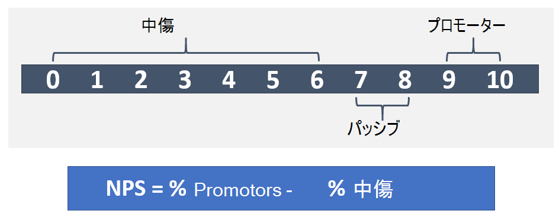

# サービスを運用する

この記事は、アップグレード体験の Operational Excellence ステージの一部です。これは、Skype for Business から Teams へのアップグレードが完了するとすぐに開始されます。

この記事では、アップグレード後に組織のTeams操作に関する要件の概要を説明します。 Teams サービスを適切に運用することで、組織に高品質で信頼性の高いエクスペリエンスを提供することができます。

## 運用ガイドの概要

操作ガイドでは、サービス管理機能の一部として必要なすべてのタスクとアクティビティの概要をMicrosoft Teams。

サービス管理の内容は、展開されてユーザーに対して利用できる状態にされている、Microsoft Teams サービスの日常的な運用を網羅するものです。 このTeamsには、Microsoft 365またはOffice 365、オンプレミスにデプロイされているインフラストラクチャ コンポーネント (ネットワークなど) が含まれます。

サービス管理の概念は、ほとんどの組織において、新しい概念ではない可能性が高いです。 既存のサービスに関連付けられているプロセスとタスクを既に実装している可能性があります。 しかし、将来のサービス管理をサポートするために、現在のプロセスを強化Teams可能性があります。

サービス管理には、サービスの管理に関わるすべてのアクティビティとプロセスTeamsエンド Teams含まれる。 前に説明したように、サービス管理の一部のコンポーネント (Microsoft 365 または Office 365 サービス自体が構成するインフラストラクチャ) は Microsoft の責任です。一方、お客様は、Teams、ネットワーク、エンドポイントのさまざまな側面をユーザーが管理する責任があります。

このガイドのタスクとアクティビティは、次の図に示す 8 つのカテゴリにグループ化されています。 これらの各カテゴリは、次のセクションで展開されます。

<table>
<tr><td>  判断ポイント</td><td><ul><li>操作を実装する方法を決定Teams。</li></ul></td></tr>

<tr><td> 次の手順</td><td><ul><li>操作ガイドの全文を確認してください。</li><li>組織の目標に沿った運用戦略を実装して、ワークロードの品質と信頼性Teamsします。</li><li>エクスペリエンスの品質レビュー ガイドを確認します。</li><li> 運用戦略を実装して、エクスペリエンスの品質レビューを定期的に実行し、Teamsがピーク時に動作している状態を確認します。</li></ul></td></tr>

</table>

### 運用の役割マッピング

最初のパイロット ユーザーが有効になっているときに運用アクティビティが開始されるので、計画フェーズ中に操作を行う計画は非常に重要です。 このガイドでは、高品質のデプロイを維持するために、日単位、週単位、月単位、または必要に応じて実行する必要があるアクティビティとTeamsします。 このガイドでは、これらの重要なアクティビティとタスクを実行する方法に関する知識とガイダンスを提供します。

デプロイの成功の重要な要素の 1 つは、計画フェーズの早い段階で実行する計画に、特定のアクティビティを実行する責任者を決定することが含まれることを確認する必要があります。 デプロイに適用されるタスクとアクティビティを把握した後は、そのタスクとアクティビティを理解し、それに割り当てるグループまたは個人を理解し、その後に続く必要があります。

特定した各チームは、特定されたタスクと責任を確認して同意し、準備を開始する必要があります。 これには、トレーニングと準備、スタッフ計画の更新プログラムの提供、外部プロバイダーの提供準備が含まれる場合があります。

このガイドで定義されているアクティビティとロールは、ほとんどのシナリオで有効である必要がありますが、デプロイTeams一意です。そのため、このガイドを開始点として、ニーズに合わせてアクティビティと既定のロールをカスタマイズできます。

各責任チームが、サービスの実行に必要なアクティビティを適切に理解している必要があります。 最初のパイロットが開始される前に、各チームが組織のアアカウント責任を受け入れてサインオフする必要があります。

契約が締結された後、対応するチームがロールの運用を開始する必要があります。

<table>
<tr><td> 次の手順</td>
<td><ul><li>このドキュメントを使用して、操作ロール マッピングの演習を容易に行います。</li><li>各サポート チームと会って、必要なアクティビティの一覧の各項目に名前を割り当てる。</li><li>割り当てられたロールに対する受け入れまたはサインオフを取得します。</li><li>対応するチームが、必要なアクティビティを完了するための適切なトレーニング、準備、およびリソースを持っている必要があります。</li></ul></td></table>

### Teamsの依存関係

Microsoft Teamsチームワークのハブを提供するために、Microsoft 365とOffice 365テクノロジを組み合わせています。 例を次に示します。

- Azure Active Directory (Azure AD) は、認証サービスと承認サービスを提供Teams。

- Exchange Online、法的ホールドや電子検出のような高度な機能を提供します。

- SharePointオンラインはチャネルでファイルを共有する機能を提供し、OneDrive for Businessチャット内でファイルを共有するためのメカニズムを提供します。

組織は、オンプレミスのインフラストラクチャに対する既存の投資を活用できます。 たとえば、既存のオンプレミスの Active Directory アカウントは、Azure アカウントを利用して認証に使用AD Connect。 特定のバージョンのExchange Serverの代Exchange Online。

これらのテクノロジが組み合わせて、ユーザーにリッチで共同作業的でインテリジェントなコミュニケーション スイートを提供します。 この緊密な統合は、Teamsの主な利点ですが、これらのテクノロジ全体のサービス管理の要件も推進します。

このガイドでは、サービスの管理に重点を置く重要Teamsします。 最も可能性が高い場合は、サポート テクノロジに依存するサービス管理Teams用意されています。 そうしない場合は、それらのテクノロジ コンポーネント (オンプレミスとオンラインの両方) に対して適切なサービス管理計画を確立する必要があります。 これにより、ユーザーが高品質で信頼性の高いエクスペリエンスを利用Teams。

#### 参照設定

[Microsoft Teams の概要](teams-overview.md)

[Exchange と Microsoft Teams の連携](exchange-teams-interact.md)

[Microsoft Teams との SharePoint Online と OneDrive for Business の連携](sharepoint-onedrive-interact.md)

[Microsoft TeamsとSkype for Business相互運用性](teams-and-skypeforbusiness-coexistence-and-interoperability.md)

<!--ENDOFSECTION-->

## 操作ガイドのアクティビティ

次のセクションでは、サービスを正常に運用するために必要なアクティビティの概要Microsoft Teamsします。 アクティビティを理解し、準備の取り組みを支援するために役立つツール、コンテキスト情報、追加コンテンツへの参照が含まれます。

<!--ENDOFSECTION-->

## サービス正常性の監視

サービスに影響を与えるイベントを組織内の他のユーザーに事前に通知できるよう、Microsoft Teams サービスの全体的な正常性を理解することが重要です。 前述のように、Teams は、Azure Active Directory、Exchange Online、SharePoint Online、OneDrive for Business などの他の Microsoft 365 および Office 365 サービスに依存します。 この理由から、依存サービスの正常性を監視するのも同様に重要です。

このアクティビティをインシデント管理プロセスに組み込み、ユーザー、ヘルプデスク、および運用チームに、ユーザーのエスカレーションを処理するための準備を事前に通知します。

次のセクションでは、サービスに影響を与えるサービス インシデントを監視するために利用できるツールTeamsします。 各ツールの利点と、各ツールを使用する必要がある場合の概要を次の表に示します。

| 監視ツール | 利点 | 使用する場合 |
|---|---|---|
| Microsoft 365 管理センター | サポートされているブラウザーを使用している任意のデバイスから使用できます。 | リアルタイム通知が不要な場合に使用します。 |
| Microsoft 365管理者アプリ | モバイル デバイスにプッシュ通知を提供します。 | 移動中にサービス インシデントの通知を受け取る必要がある場合に使用します。 |
| Microsoft System Center | Microsoft System Center との統合。 | 高度な監視機能と通知のサポートが必要な場合に使用します。 |
| Microsoft 365Service Communications API | プログラムによるサービス正常性Microsoft 365またはOffice 365アクセス。 | サードパーティの監視ツールとの統合が必要な場合、または独自のソリューションを構築する必要がある場合に使用します。 |

> [!NOTE]
> サービス正常性を表示できるのは、 **グローバル管理者** またはサービス管理者 **ロール** が割り当てられているユーザーのみです。

### 管理センター Microsoft 365監視

管理[Microsoft 365サービス](https://portal.office.com/)正常性ダッシュボードが提供されます。このダッシュボードでは、依存サービスに加えて、Teams サービスの現在の正常性を表示できます。

### モバイル アプリを使用した監視

このMicrosoft 365アプリは、Apple iOS、Android、および Windows (PC とモバイル) で利用できます。 このアプリは、サービス正常性と今後の変更に関する管理者情報を提供します。 このアプリは、勧告が投稿された直後に通知できるプッシュ通知をサポートしています。 これにより、状態、正常性、および今後のサービスの変更に関する最新の状態を確認できます。 通知のサポートにより、管理者に推奨される監視ツールになります。 詳細については、以下を参照してください。

[Microsoft 365管理モバイル アプリ](https://support.office.com/article/Office-365-Admin-Mobile-App-e16f6421-2a1a-4142-bf9d-9846600a060a)

[管理モバイル Microsoft 365をダウンロードする](https://products.office.com/business/manage-office-365-admin-app)

### Microsoft System Center を使用した監視

Microsoft System Center は、データセンター、クライアント デバイス、ハイブリッド クラウド IT 環境の管理に役立つ統合管理プラットフォームです。 Microsoft 365または Office 365 System Center を使用する管理者には、管理パックをインポートするオプションが追加され、System Center で Operations Manager 内のすべてのサービス通信を表示できます。 このツールを使用すると、サブスクライブしているサービスの状態、アクティブなサービス インシデントと解決済みサービス インシデント、およびメッセージ センターの通信 (今後の変更) にアクセスできます。 詳細については、次のブログ投稿を [参照してください](https://www.microsoft.com/en-us/microsoft-365/blog/2014/07/29/new-office-365-admin-tools/)。

System Center を利用して Teams サービスの正常性 (および依存サービス) を監視する場合は、管理パックをさらにカスタマイズして、インシデントへの対応が特定された特定のグループまたは個人に警告または通知することができます。
これらのグループには、サービス所有者、ヘルプデスク、第 2 レベルおよび第 3 レベルのサポート グループ、組織内のインシデント マネージャーを含めることができます。

### 高度なシナリオの監視

サービスの正常性と今後の変更を監視するには、Service Communications API を使用してプログラムでサービスの正常性と変更にアクセスします。 この API を使用して、独自の監視ツールを作成したり、既存の監視ツールを Microsoft 365 または Office 365 サービス通信に接続したりして、環境の監視方法を簡素化できる可能性があります。 詳細については、開発者向[けのMicrosoft 365またはOffice 365をEnterpriseしてください](/office/developer-program/microsoft-365-developer-program-faq)。

### 日単位/週単位/月単位/必要なタスク

| アクティビティ | 説明 | Cadence | チーム割り当て |
|---|---|---|---|
| サービス正常性の監視 | 利用可能なツールMicrosoft Teams、サービス正常性 (および依存サービス) を事前に監視します。 依存サービスには、Exchange Online、SharePoint Online、OneDrive for Business、Azure Active Directory が含まれます。 | リアルタイム | |
| インシデント通知 | サービスに影響を与えるイベントを内部関係者にTeamsします。 内部関係者には、ユーザー、ヘルプデスク、インシデント マネージャーを含めることができます。 | 必要に応じて | |

### 参照設定

[サービス正常性をMicrosoft 365またはOffice 365する方法](https://support.office.com/article/How-to-check-Office-365-service-health-932AD3AD-533C-418A-B938-6E44E8BC33B0)

[Microsoft Teams のサービスの正常性を確認する](service-health.md)

[サービス正常性と継続性](/office365/servicedescriptions/office-365-platform-service-description/service-health-and-continuity)

<!--ENDOFSECTION-->

## 組織の変更を管理する

Microsoft Teamsは、クラウドベースのサービスです。 この機能により、新しい機能を迅速に提供できます。 継続的なイノベーションを実現すると、組織にとって明らかなメリットが得されますが、ユーザーの抵抗やヘルプデスクへのエスカレーションを回避するには、組織内でこれらの変更を適切に管理する必要があります。

更新プログラムTeamsユーザーに自動的に展開されます。 ユーザーは、常に最新のクライアントと機能を Teamsします。 Teams 更新プログラムのロールアウトをユーザーに管理できないので、効果的なコミュニケーション、トレーニング、導入プログラムを通じて変更を管理することが非常に重要です。 ユーザーが変更を認識し、利点について教育を受け、新しい機能を活用する権限を持っている場合は、より迅速に適応し、変更を &mdash; 歓迎することができます。

### 変更の監視

変更管理の最初の手順は、変更に対して計画されている変更をTeams。 これらの変更を監視するための最適なソースは、Microsoft 365[ロードマップ](https://www.microsoft.com/microsoft-365/roadmap)です。このロードマップには、現在開発中の機能、お客様に展開されている機能、または完全に起動された機能が一覧表示されます。 提供されているフィルター Teams特定の機能を検索するか、ロードマップを Excel ファイルにダウンロードして詳細な分析を行います。 各機能について、ロードマップには、リリース予定日と共に簡単な説明が記載されています。

このブログ[Microsoft Teams、](https://techcommunity.microsoft.com/t5/Microsoft-Teams-Blog/bg-p/MicrosoftTeamsBlog)製品の更新プログラムに関するベスト プラクティス、傾向、ニュースTeams確認できます。 このページで発表される予定Teams機能の主要な更新プログラムを見つける予定です。 RSS フィードを通じてブログを購読できます。 その後[、RSS](https://techcommunity.microsoft.com/gxcuf89792/rss/board?board.id=MicrosoftTeamsBlog)フィードをチャネルに直接追加Teams、すべての重要なニュースが、そのチャネル内で直接配信Teams。

リリースされる機能はすべて、「リリース ノート」に記載[Microsoft Teams。](https://support.office.com/article/Release-notes-for-Microsoft-Teams-d7092a6d-c896-424c-b362-a472d5f105de)
ここでは、デスクトップ、Web、モバイル デバイス用にリリースされた機能の一覧を示します。 同じリリース ノートのセットは、ヘルプ の [新しい機能 **]** タブでも [使用できます](get-help-in-microsoft-teams.md)。

使用可能なリソースを理解し、変更を監視する適切な所有者を割り当て確認します。

### 変更の計画

Teams サービスに対する今後の変更を認識したので、次の手順は、必要に応じて準備して計画を立てます。 各変更を評価して、ユーザーへのコミュニケーションが必要な変更、意識向上キャンペーン、サポート チームまたはユーザーのトレーニング、機能評価および導入キャンペーンを決定します。 これは、組織内の変更管理チームの主要な役割です。 変更を計画するのに役立つサンプル テーブルのコレクションを次に示します。

#### 機能: クラウド録画 (リリース日: 2018 年 1 月)

**一般的なトラック**

| 準備を変更する | 状態 | メモ/次の手順 | 所有者 |
|---|---|---|---|
| 法的レビュー | 完了 | この機能は、トレーニング チームのオンボードの前提条件です。 | Project チーム |

**技術的な変更管理**

| 準備を変更する | 状態 | メモ/次の手順 | 所有者 |
|---|---|---|---|
| IT の変更が必要 | はい | 管理者は、識別されたユーザーの記録のみを有効にする必要があります。 | サポート チーム |
| 技術的な準備完了 | はい | | サポート チーム |
| | | | |

**ユーザー変更管理**

| 準備を変更する | 状態 | メモ/次の手順 | 所有者 |
|---|---|---|---|
| ユーザーへの影響 | 低 | | |
| ユーザーの準備が必要 | はい | | |
| 通信の準備完了 | いいえ | コミュニケーション メールの下書き (レビュー保留中)。 | コミュニケーション チーム |
| トレーニングの準備完了 | はい | トレーニングでは、既存の Microsoft ビデオを活用します。 | トレーニング チーム |

**ステータス トラック**

| 準備を変更する | 状態 | メモ/次の手順 | 所有者 |
|---|---|---|---|
| リリースの状態 | 進行中 | エグゼクティブ スポンサーによる保留中のレビュー。 | Change Management Team |
| リリース のサインオフ | | | |
| リリース日 | | | |

アプリケーションを使用した変更管理の計画の詳細については、「Teams の変更管理戦略を作成[する」をMicrosoft Teams。](change-management-strategy.md)

### 日単位/週単位/月単位/必要なタスク

| アクティビティ| 説明| Cadence| チーム割り当て |
|---|---|---|---|
| 変更を監視する| サービスに対する今後の変更Microsoft Teams監視します。| [毎日]||
| 変更の計画| コミュニケーション計画、意識向上キャンペーン、トレーニングなど、新機能を評価して計画します。| 必要に応じて ||
| ユーザーの準備| ターゲットを絞ったコミュニケーション、認識、またはトレーニング キャンペーンを実行して、ユーザーが今後の変更に対応する準備ができていることを確認します。| 必要に応じて ||
| サポート チームの準備 | サポート チームの準備ができていることを確認するために、対象を絞ったコミュニケーション、認識、またはトレーニング キャンペーンを実行します。 サポート チームには、"ホワイト ペーパー" チーム、ヘルプデスク、階層 2 または階層 3 のサポート、外部パートナーを含めることができます。 | 必要に応じて ||

<!--ENDOFSECTION-->

## 使用状況Teams評価する

最初のパイロットが開始された後は、実際の使用状況を測定するための定期的なTeamsがあります。 これにより、組織は、実際の使用状況が、構想フェーズで予測した使用量とどのように一致するのかについての洞察を得るのです。 このセクションでは、使用状況のTeamsを中心に説明しますが、全体的な使用状況の測定と評価Microsoft 365、Office 365する必要があります。

デプロイの早い段階で頻繁に使用状況を確認すると、次の機会が得されます。

- ユーザーがアカウントを使用Teams。

- 組織全体で重大な問題を作成する前に、潜在的な導入の課題を特定します。

- Envision フェーズの要件と実際の使用状況の間に不一致が生じているのかを理解します。

使用が予想外の場合は、デプロイの問題が原因か、導入計画が適切に実行されていないか、その他の問題が原因である可能性があります。 使用率が低い実際の理由に応じて、管理者は関連するチームと協力して、使用障壁を取り除く必要があります。

### 管理センターで使用状況Microsoft 365測定する

[レポート] ダッシュボードTeamsの使用状況データを使用できます。 Teamsデータは、3 つの異なるレポートで確認できます。 1 つ目のレポートでは、ユーザーがさまざまなサービスを使用してコミュニケーションや共同作業を行う方法を製品Microsoft 365表示Office 365。 このレポートは、管理センターの [Microsoft 365 レポート ] - [アクティブなユーザー][で確認できます。](https://support.office.com/article/Office-365-Reports-in-the-Admin-Center-Active-Users-FC1CF1D0-CD84-43FD-ADB7-A4C4DFA8112D)

他の 2 つのレポートはTeams固有であり、ユーザーとデバイスの観点からTeams使用状況の詳細を提供します。 両方のレポートは、次の場所で確認できます。

[Microsoft Teams のデバイス使用状況レポート](https://support.office.com/article/Office-365-Reports-in-the-Admin-Center-Microsoft-Teams-device-usage-917b3e1d-203e-4439-8539-634e80196687)

[Microsoft Teams ユーザー アクティビティ レポート](https://support.office.com/article/Office-365-Reports-in-the-Admin-Center-Microsoft-Teams-user-activity-07f67fc4-c0a4-4d3f-ad20-f40c7f6db524)

#### 必要なアクセス許可

管理センターの使用状況レポートには、グローバル管理者ロールが割り当てられているユーザー、または製品固有の管理者ロール **(Exchange 管理者**、Skype for Business **管理者**、SharePoint 管理者) が **アクセス** できます。

さらに、レポート閲覧 **者ロール** は、レポートへのアクセスを必要とするが、管理者レベルのアクセス許可を必要とするタスクを実行しないユーザーが使用できます。 このロールを割り当てると、関係者であるすべてのユーザーに使用状況レポートを提供し、導入を監視および推進できます。 使用できるさまざまなロールの詳細については、「管理者ロールについて[」Microsoft 365参照してください](https://support.office.com/article/About-Office-365-admin-roles-da585eea-f576-4f55-a1e0-87090b6aaa9d)。

### 使用状況の評価

レポート ダッシュボードを使用して使用状況を測定した後は、測定された使用状況を、プロジェクトの Envision フェーズで定義した主要な成功インジケーター (KSIs) と比較することが重要です。 アクティブな使用状況として定義される可能性がある KSI、またはアクティブな使用状況に間接的にリンクされている KSI を定義できます。

追加のサイトまたはユーザーにロールアウトを再び適用する前に、実際の使用状況と計画された使用状況の差異を特定することが重要です。 このアクティビティの一部として組織の学習を識別し、サイトまたはユーザーの次のバッチで同じ問題が発生しない可能性があります。

まず、これが導入か技術的な問題かを特定します。 まず、以下の項目を調べて、問題の場所を特定します。

1. Quality of Experience Review を実行 [して品質を検証します](upgrade-monitor-quality.md)。

2. ヘルプデスク チームと連絡を取り合い、ユーザーがサービスにアクセスまたは使用するのを妨げている技術的な問題がないか確認してください。 問題の傾向が存在する場合は、この記事の後半の「エンドポイントのトラブルシューティング」セクションを使用して、サポートに関与する前に問題を解決してください。

3. トレーニングおよび導入チームと一緒に、ユーザーからの直接のフィードバックを収集し (この記事の後半の「ユーザーセンチメントを評価する」を参照)、認識と導入アクティビティの有効性を確認します。

### 日単位/週単位/月単位/必要なタスク

| アクティビティ | 説明 | Cadence | チーム割り当て |
|---|---|---|---|
| 使用状況の測定 (有効化フェーズ) | サイトが有効化フェーズTeams引き続きオンボーディングを行う際に、使用状況を測定して評価します。 必要に応じて使用状況の問題に対処します。 | [毎週] | |
| 使用状況を測定する | ドライブ値フェーズTeamsの使用状況を測定して評価します (デプロイが完了した後)。 必要に応じて使用状況の問題に対処します。 | Biweekly | |
| (ドライブ値フェーズ) | | | |
| 導入計画を更新する | 測定された使用状況と計画ターゲットの比較に基づいて、導入計画を更新します。 | 必要に応じて | |

### 参照設定

[管理センター Microsoft 365について](https://support.office.com/article/About-the-Office-365-admin-center-758befc4-0888-4009-9f14-0d147402fd23)

[管理センターのアクティビティ Microsoft 365レポート](https://support.office.com/article/Activity-Reports-in-the-Office-365-admin-center-0d6dfb17-8582-4172-a9a9-aed798150263)

<!--ENDOFSECTION-->

## ユーザーのセンチメントを評価する

ユーザーセンチメントを理解すると、デプロイの成功を測定する重要なTeamsできます。 ユーザーフィードバックは、組織の変更を後で生み出す可能性があります。これには、コミュニケーション プラン、トレーニング プログラム、またはユーザーにサポートを提供する方法の変更が含まれる場合があります。

早い段階でフィードバックを受け取り、プロジェクトのライフサイクル全体を通じてユーザーのセンチメントを評価し続ける必要があります。 次のガイダンスを使用して、組織がフィードバックを求める間隔を決定します。

- **プロジェクトの開始**: プロジェクトの開始時にユーザーのセンチメントを評価することで、ユーザーが自分のエクスペリエンスに対してどのように感じTeamsできます。

- **主要なマイルストーンの後**: プロジェクトのライフサイクル全体にわたってフィードバックを収集することで、ユーザーのセンチメントを継続的に測定し、必要に応じて変更を加えます。 これは、主要なマイルストーンの後に特に便利です。

- **Project** まとめ: プロジェクトの最後にユーザーのセンチメントを評価すると、どれだけうまくやったか、どこで作業を行う必要があるのかを知ることができます。また、前回のアンケートと結果を比較できます。

- **継続的**: ユーザーのセンチメントを無期限に測定し続ける。 ユーザーセンチメントの変更は、組織の環境の変化や、サービスの変更Teamsがあります。 ユーザーのセンチメントを一定の間隔で測定することで、サービス管理チームのパフォーマンスと、Teams サービスの変更に対する組織の対応方法を理解できます。

ユーザーセンチメントは、さまざまな方法で評価できます。 これには、メールアンケート、対面または電話形式の面接、または単にフィードバック チャネルを作成する方法が含TeamsまたはYammer。 詳細については、「ユーザー フィードバックメソッド[のベスト プラクティス」を参照](best-practices-feedback.md)Microsoft Teams。

また、業界全体のアプローチを使用して、net promotor score (NPS) と呼ばれるユーザーのセンチメントを評価できます。これは、次のセクションで説明します。

### NPS

Net プロトロイター スコア (NPS) は、業界全体の顧客ロイヤルティ メトリックであり、ユーザーのセンチメントを評価するために使用する優れたアプローチです。 NPS は、次の 2 つの質問を行って計算できます。"Teams を同僚に勧める可能性はどのくらいですか?"、その後にフリーフォームの質問 "Why?" が続きます。

NPS は-100 から 100 までの範囲のインデックスで、会社の製品またはサービスを推奨する顧客の意識を測定します。 NPS は、電子メールなどの電子的手段を通じてユーザーに配信される匿名のアンケートに基づいて行います。 NPS は、プロバイダーとコンシューマーの間のロイヤルティを測定します。 これは 1 つの質問だけで構成され、ユーザーはエクスペリエンスを 1 から 10 まで評価し、追加のコメントを提供することができます。 その後、ユーザーは次のレーティングに基づいて分類されます。

- 9 または 10 は、プロモート: サービスを宣伝し、他のユーザーに燃料を供給する忠実な熱中者です。

- 7 または 8 はパッシブ: 満足しているが非アクティブで、別のサービスまたはオファリングに対して脆弱です。

- 1 から 6 の間は、サービスに損害を与え、成長を妨ねる可能性がある、不満を持つ顧客です。

ベース NPS 番号は便利ですが、ユーザーコメントの分析から最も価値があります。 ユーザーが他のユーザーにアクセスを推奨する (または推奨しない) 理由を理解Teams役立ちます。 これらのコメントは、プロジェクトまたはサービス管理チームが高品質のサービスを提供するために必要な調整を理解するのに役立つ貴重なフィードバックを提供できます。

NPS アンケートを組織に提供するには、お気に入りのオンラインアンケート ツールを利用できます。

### 日単位/週単位/月単位/必要なタスク

| アクティビティ | 説明 | Cadence | チーム割り当て |
|---|---|---|---|
| ユーザーのセンチメントを評価する | アンケートやインタビューを使用して、またはフィードバック チャネルを通じて、ユーザーのセンチメントをキャプチャして評価TeamsまたはYammer。 | 必要に応じて | |
| 導入計画を更新する | ユーザーのフィードバックに基づいて組織の変更を行います。これには、コミュニケーション プラン、トレーニング プログラム、またはユーザーにサポートを提供する方法の変更が含まれます。 | 必要に応じて | |

### 参照設定

[Net のプロロケーション スコア](https://en.wikipedia.org/wiki/Net_Promoter)

[フィードバックYammerを収集する](https://techcommunity.microsoft.com/t5/Yammer-Blog/The-Microsoft-Teams-team-uses-Yammer/ba-p/55210)

[ユーザー フィードバックのベスト プラクティス](best-practices-feedback.md)

<!--ENDOFSECTION-->

## ネットワーク品質の管理

多くの主要な計画要素は、ネットワーク インフラストラクチャの最適化、適切なサイズ変更、修復に取り組み、Microsoft Teams サービスへの高品質で効率的なパスを確保します。 計画タスクと要件については、ネットワーク準備ガイダンス [を参照](prepare-network.md) してください。 ネットワークは、多くの場合、アップグレード、拡張、その他のビジネス要件のために時間の経過と共に進化します。 ネットワーク計画アクティビティの要件をTeamsすることが重要です。

ネットワーク計画は Teams デプロイの重要な側面ですが、ビジネス要件や技術要件の変化に基づいて、ネットワークが正常な状態を維持し、最新の状態を維持することが同様に重要です。

ネットワークの正常性を確保するには、一定の間隔で多数の操作アクティビティを実行する必要があります。

### 日単位/週単位/月単位/必要なタスク

| アクティビティ | 説明 | Cadence | チーム割り当て |
|---|---|---|---|
| MICROSOFT 365またはOffice 365の監視 | 提供された[RSS](https://go.microsoft.com/fwlink/p/?linkid=236301)フィードを使用[Office 365 URL](/microsoft-365/enterprise/urls-and-ip-address-ranges)と IP アドレス範囲に対する変更を監視し、該当するネットワーク グループへの変更要求を開始します。 | [毎日] | |
| ネットワークの変更に基づいてネットワークを更新し、Microsoft 365またはOffice 365 URL に基づいて更新します。 | Office 365 URL と[IP](/microsoft-365/enterprise/urls-and-ip-address-ranges)アドレス範囲に対する変更を反映するために、該当するネットワーク コンポーネント (ファイアウォール、プロキシ サーバー、VPN、クライアント側ファイアウォールなど) を更新します。 | 必要に応じて | |
| 建物のデータを提供する | [CQD](/SkypeForBusiness/using-call-quality-in-your-organization/turning-on-and-using-call-quality-dashboard#upload-building-information)の建物の定義を最新の状態に保つには、品質のチャンピオン (または関連する関係者) に更新されたサブネット情報を提供します。 | 必要に応じて | |
| 変更を実装する | ビジネス要件と技術要件の変化をサポートTeamsに変更を実装します。 ネットワーク要素には、次のものが含まれます。<ul><li>ファイアウォール</li><li>VPN</li><li>有線ネットワークとWi-Fiネットワーク</li><li>インターネット接続と ExpressRoute</li><li>DNS</li></ul> | 必要に応じて | |
| ネットワークの監視とレポート | 既存のサード パーティ製のネットワーク管理ツールと、ネットワーク プロバイダーから利用できるレポート機能を使用して、可用性、使用率、容量の傾向をネットワーク エンド からエンド で監視します。 ネットワーク容量計画には、トレンド データを使用します。 | 毎日、毎週、毎月 | |
| 処理能力の計画 | 容量の変更をTeamsビジネス要件と技術要件を理解するために、サービス所有者と共同作業を行います。  | 必要に応じて | |
| ネットワークのトラブルシューティングと修復 | Teamsヘルプデスク、サービス所有者、および主要な関係者が、Teams の接続性、信頼性、または品質に関連する問題のトラブルシューティングと修復を支援します。 ネットワーク要素には、次のものが含まれます。<ul><li>ファイアウォール</li><li>VPN</li><li>有線ネットワークとWi-Fiネットワーク</li><li>インターネット接続と ExpressRoute</li><li>DNS</li></ul> | 必要に応じて | |
| ディザスター リカバリーと高可用性テスト | ネットワーク インフラストラクチャで定期的な高可用性とディザスター リカバリーのテストを実行して、Teams サービスの指定されたサービス レベル目標 (SLA) またはサービス レベル アグリーメント (SLA) を確実に満たします。 | 毎月 | |

### 参照設定

[Office 365 URL および IP アドレス範囲](/microsoft-365/enterprise/urls-and-ip-address-ranges)

[データ スキーマの構築](/SkypeForBusiness/using-call-quality-in-your-organization/turning-on-and-using-call-quality-dashboard#tenant-data-file-format-and-building-data-file-structure)

<!--ENDOFSECTION-->

## 品質を評価して確認する

すべての組織で、品質に対して責任を持つグループまたは個人が必要です。 これは、サービス管理において最も重要な役割です。 品質チャンピオン ロールは、ユーザーのエクスペリエンスに熱中しているユーザーまたはグループに割り当てられます。
この役割は、環境での傾向を特定するスキルと、修復を推進するために他のチームと協力するスポンサーシップを必要とします。 通常、品質チャンピオンに最適な候補はカスタマー サービスの所有者です。 組織の規模と複雑さによっては、高品質のユーザー エクスペリエンスを確保するための熱意を持つ任意のユーザーまたはグループである可能性があります。

品質のチャンピオンは、通話品質ダッシュボード (CQD) や Teams の通話品質の向上と監視[など](monitor-call-quality-qos.md)、既存のツールと文書化されたプロセスを利用して、ユーザー エクスペリエンスの監視、品質の傾向の特定、必要に応じて修復を行います。
品質のチャンピオンは、それぞれのチームと一緒に修復アクションを推進し、進行状況と開いている問題について運営委員会に報告する必要があります。

[Teams](monitor-call-quality-qos.md)の通話品質を向上および監視するには、ユーザー エクスペリエンスの向上に最も大きな影響を与える主要な領域で修復ガイダンスを評価して提供するアクティビティが含まれています。 品質エクスペリエンス レビュー ガイドで提供されるガイダンスでは、導入と影響を最大化するためにオーディオに重点を置いて、各領域をレポートおよび調査するための主要なツールとして CQD Online を使用する方法に重点を置いています。 音声エクスペリエンスを改善するためにネットワークに対して行われた最適化は、ビデオおよびデスクトップ共有を改善することにも直接転用されます。

早い段階で品質チャンピオンをノミネートすることを強く推奨します。 ノミネートされた後は、「通話品質の向上と監視」の内容に慣れ始める必要があります。Teams[関連する](monitor-call-quality-qos.md)トレーニング資料。

### 日単位/週単位/月単位/必要なタスク

| アクティビティ | 説明 | Cadence | チーム割り当て |
|---|---|---|---|
| 品質のチャンピオンをノミネートしてトレーニングする | 高品質のチャンピオンをノミネートしてトレーニングします。 | 必要に応じて | |
| エクスペリエンスの品質レビュー (QERs) を実行する | QER を実行して、品質と信頼性の傾向を特定し、定義されたターゲットに対して確認し、組織内の主要な利害関係者に報告します。 | 月単位 (デプロイ中は毎週) | |
| ドライブの修復 | QER の評価と結果に基づいて、組織全体の修復作業を調整します。 | 必要に応じて | |
| CQD での建物データの更新 | ネットワークに変更が加えたときに、CQD で新しい建物定義を更新または追加します[(「アップロード」を参照してください](/SkypeForBusiness/using-call-quality-in-your-organization/turning-on-and-using-call-quality-dashboard#upload-building-information))。 | 必要に応じて | |
| 品質チャンピオン の役割を満たす | 組織の品質に対するエンドツーエンドの責任。 これには、次の内容が含まれます。<ul><li>QER が定期的に実施されている必要があります。</li><li>品質の状態に関する主要な関係者に報告します。</li><li>建物のデータ定義が最新の情報に更新されている必要があります。</li><li>組織全体の修復作業を調整して、ユーザーが組織全体で高品質のエクスペリエンスをTeams。</li></ul> | [毎日] | |

### 参照設定

[アップロード建物情報](/SkypeForBusiness/using-call-quality-in-your-organization/turning-on-and-using-call-quality-dashboard#upload-building-information)

[Teams の通話品質の向上と監視](monitor-call-quality-qos.md)

<!--ENDOFSECTION-->

## エンドポイントの管理

Microsoft Teamsエンドポイントは、PC、Mac、タブレット、モバイル (またはクライアントを実行しているその他の) デバイスTeamsできます。 エンドポイントという用語は、デバイス自体だけでなく、ユーザーがデバイスに接続する方法 (デバイスの内蔵マイクまたはスピーカー、イヤーパッド、最適化されたヘッドセットなど) を含むものです。 デプロイ後は、エンドポイントを忘れられません。 このエンドポイントTeams、継続的な注意とメンテナンスが必要です。 次のセクションでは、重点を置く特定の領域について説明します。

### エンドポイントの要件

この機能の主な利点Teams、クライアントは自動的に最新の状態に維持されます。 PC と Mac 上のクライアントは、アプリがアイドル状態のときに新しいビルドがあるかを確認したり、新しいクライアントをダウンロードしたりする、バックグラウンド プロセスを使用して更新されます。 モバイル Teamsは、それぞれのアプリ ストアを通じて最新の状態に維持されます。

クライアントTeams基になるソフトウェア プラットフォームに関する最小要件があります。 これらの要件は時間の間に変化する可能性があります。そのため、変更を監視することが重要です。 たとえば、クライアントのTeams iOS バージョンが必要です。 クライアントがインターネット ブラウザーを使用する場合は、ブラウザーも最新の状態に保つ必要があります。 サポートされているプラットフォームの一覧については、「Get clients for Microsoft Teams 」[を参照してください](get-clients.md)。

### エンドポイントのファイアウォール

クライアント側のファイアウォールはユーザー エクスペリエンスに大きな影響をおよぼす可能性があります。
クライアント側のファイアウォールは、通話の品質に影響を与える可能性があります。また、通話が確立されるのを防ぐ場合があります。 クライアント ファイアウォールで適切な除外が構成された後は、Office 365 URL と IP アドレス範囲の情報に基づいて、クライアント ファイアウォールを最新の状態に保つ[必要があります](/microsoft-365/enterprise/urls-and-ip-address-ranges)。 サード パーティベンダーは、除外を更新する方法に関する具体的なガイダンスを提供します。

### Wi-Fi ドライバー

Wi-Fiは問題になる可能性があります。 たとえば、ドライバーはアクセス ポイント間で非常に積極的なローミング動作を行い、不必要なアクセス ポイントの切り替えを誘発し、低い通話品質につながる可能性があります。 パフォーマンスが低Wi-Fiドライバーは、エクスペリエンスの品質レビューを通じて検出される可能性があります (詳細については、「Teams の通話品質の向上と監視」を参照してください)。 新しい Wi-Fi ドライバーを監視し、一般的なユーザーにデプロイする前に確実にテストされる品質駆動型プロセスを実装する必要があります。

### エンドポイント管理

サポートされているエンドポイントとインターフェイス デバイス (ヘッドセットなど) のカタログを使用して管理する必要があります。 このカタログには、構想フェーズとオンボード フェーズの一環として選択および検証された承認済みデバイスの一覧が含まれます。 通常、特定のデバイスは、そのペルシャの属性のニーズを満たすために、組織内の各ペルシャの種類に対して選択されます。 すべてのエンドポイントにはライフサイクルがあります。これらのデバイスに関連付けられているベンダー契約、保証、交換、配布、および修復ポリシーを管理する必要があります。

### エンドポイントのトラブルシューティング

前のガイダンスに従った場合でも、組織内のユーザーが問題を引き続き発生Teams。 問題はエンドポイント自体にはない可能性があります。通常、問題の症状はクライアントを通じてユーザーに表示されます。 次のガイダンスは、問題を解決するために実行できる一般的な手順を提供することを目的としています。これは、包括的なトラブルシューティング ガイドではありません。 手順は特定の順序で提供されますが、明示的に従う必要はなし、問題の性質によっては適用できない場合があります。

1. **サービス正常性の検証:** ユーザーが発生している可能性がある問題は、サービスまたは依存サービスに悪影響を及ぼすTeamsに関連している可能性があります。 最初の手順として、アクティブなサービスの問題がないか確認することをお勧めします。 サービス[正常性を確認するMicrosoft 365を参照してください](/office365/enterprise/view-service-health)。 依存サービスの状態を確認してください (例: Exchange、SharePoint、OneDrive for Business)。 サービス正常性の監視については、前のセクション「サービス正常性の監視」 [で詳しく説明します](#monitor-service-health)。

2. **クライアント接続を検証する:** 接続の問題により、デバイスの機能やサインインの問題Teams。 サービスへの接続を検証することをお勧めします (特に新しいサイトまたは場所の場合)。 サイトごとに次[Office 365 URL と IP アドレス](/microsoft-365/enterprise/urls-and-ip-address-ranges)範囲のガイダンスに従います。 Microsoft ネットワーク評価ツールを[利用](https://www.microsoft.com/download/details.aspx?id=53885)して接続テストを実行し、メディア ポートが正常に開かされていることを検証し、Teamsできます。 接続テストを実行する方法の詳細な手順については、ネットワーク準備ガイダンス [を参照](prepare-network.md) してください。

3. **既知の問題の一覧を確認します。** ユーザー [Teams問題](/MicrosoftTeams/troubleshoot/teams)の 1 つによって悪影響を受けたかどうかを判断するには、トラブルシューティングに関するページを参照してください。 問題を解決するには、提供されている回避策 (ある場合) に従います。

4. **コミュニティにMicrosoft Teamsしてください。** この [コミュニティMicrosoft Teamsは、](https://techcommunity.microsoft.com/t5/Microsoft-Teams/ct-p/MicrosoftTeams)専用のスペースを提供し、Teams。 このTeamsコミュニティでは、ディスカッション リスト、ブログの投稿、お知らせを中心にTeams。 質問を投稿したり、以前のディスカッションで問題の解決策を検索することができます。

5. **Microsoft サポートにお問い合わせください。** Microsoft サポートに問い合わせ、オンラインまたは電話Teams関する問題を確認できます。 詳細については、「ビジネス製品の [サポートへのお問い合わせ - 管理者向けヘルプ」を参照してください](/microsoft-365/admin/contact-support-for-business-products)。 Premier のお客様の場合、サポートリクエストは、「お問い合わせ先 (Premier のお客様) のサポートに問[い合Microsoft Teams」のガイダンスに従って開始できます](https://support.microsoft.com/premier/contacts)。

### 日単位/週単位/月単位/必要なタスク

| アクティビティ | 説明 | Cadence | チーム割り当て |
|---|---|---|---|
| エンドポイントの要件 | 「Get clients for Teams for 」に記載されているすべてのソフトウェア要件を、Teams エンドポイントが引き続き満[たしていることをMicrosoft Teams。](get-clients.md) | 毎月 | |
| エンドポイントのファイアウォール | エンドポイント の URL と IP アドレス範囲の情報に基づいて、エンドポイント ファイアウォールOffice 365[を維持します](/microsoft-365/enterprise/urls-and-ip-address-ranges)。 サード パーティベンダーは、除外を維持する方法に関する具体的なガイダンスを提供します。 変更が自動的 [に通知](https://support.office.com/o365ip/rss) される RSS フィードをサブスクライブします。 | 必要に応じて | |
| Wi-Fi ドライバー | PC 上のWi-Fiをテストして更新します。 CQD を使用して結果を検証します ( の呼び出し品質を向上し[、監視Teams)。](monitor-call-quality-qos.md) | 必要に応じて | |
| エンドポイント管理 | サポートされているエンドポイントとインターフェイス デバイス (ヘッドセットなど) のカタログを保持します。 ベンダー契約、保証、配布、交換、修理のポリシーを管理します。 | 毎月 | |
| エンドポイントのトラブルシューティング | トラブルシューティング タスクには、接続の確認、既知の問題の一覧の参照、ログ収集、分析、Microsoft サポートまたはサード パーティ ベンダーへのエスカレーションが含まれます。 | 必要に応じて | |

### 参照設定

[Office 365 URL および IP アドレス範囲](/microsoft-365/enterprise/urls-and-ip-address-ranges)

[Microsoft Teams のクライアントを取得する](get-clients.md)

[Microsoft Teams コミュニティ](https://techcommunity.microsoft.com/t5/Microsoft-Teams/ct-p/MicrosoftTeams)

[Teams のトラブルシューティング](/MicrosoftTeams/troubleshoot/teams)

[Microsoft Teams のサービスの正常性を確認する](service-health.md)

[ビジネス製品についてサポートに問い合わせる - 管理者ヘルプ](https://support.office.com/article/Contact-support-for-business-products-Admin-Help-32a17ca7-6fa0-4870-8a8d-e25ba4ccfd4b)

[Premier サポートに問い合わせ](https://support.microsoft.com/premier/contacts)

[ビデオTeamsトラブルシューティング](https://www.youtube.com/watch?v=4O4d_7uZTQY)

<!--ENDOFSECTION-->

## Teams の管理

サービスMicrosoft Teams後、その管理に関連するいくつかのアクティビティを実行する必要があります。 アクティビティの範囲は、サービスと個々のユーザーの管理から、容量計画とプロビジョニングのライセンスと電話番号までです。 以下のセクションでは、これらの一般的な管理タスクの一部について説明します。

### サービス管理

Teamsサービスには、テナント全体で構成できる複数の設定があります。
テナント設定に加えた変更は、テナント設定が有効になっているすべてのユーザーにTeams。 これらの設定の詳細な一覧については、「Manage Microsoft Teams settings for your organization 」[を参照してください](enable-features-office-365.md)。

### ユーザー管理

ユーザーをサポートするには、組織が関連するタスクを必要とする場合があります。特定のタスクは、組織によって異なります。 最終的には、これらのタスクは、これらの運用業務が割り当てられているサポート チームによって管理される必要があります。 一般に、次のタスクは、ユーザーをサポートするために必要Teams。

#### 一般的なタスク

[Microsoft Teams へのユーザー アクセスを管理する](user-access.md)

### チームの作成 (省略可能)

既定では、メールボックスを持つすべてのユーザー Exchange Onlineグループを作成するアクセス許可Microsoft 365、そのため、グループ内のチームMicrosoft Teams。 より厳しい管理を行い、新しいチームの作成[(および](assign-roles-permissions.md#permissions-to-create-teams)新しい Microsoft 365 グループの作成) を制限する場合は、グループの作成と管理の権限を一連の管理者に委任できます。 組織でこのオプションを進める場合は、この記事で説明されているプロセスを参照して、割り当てられたチームによって処理された要求をユーザーが送信できます。

<!--ENDOFSECTION-->

### 日単位/週単位/月単位/必要なタスク

| アクティビティ | 説明 | Cadence | チーム割り当て |
|---|---|---|---|
| サービス管理 | テナント全体の設定Teams管理。 | 必要に応じて | |
| ユーザー管理 | ユーザー ベースの設定とライセンスの管理 (Teams)。 | 必要に応じて | |
| ライセンス管理 | PSTN 使用状況レポートと [PSTN](/skypeforbusiness/skype-for-business-online-reporting/pstn-usage-report) 分プール レポートを利用して、ユーザーベースと消費ベースのライセンス (通話プランと通信クレジット) の両方に関する現在および将来のニーズを [計画](/skypeforbusiness/skype-for-business-online-reporting/pstn-minute-pools-report) します。 | [毎週] | |
| 電話番号の管理 | 将来の成長に利用できる電話番号を管理し、組織のニーズに合わせて在庫レベルを調整します。 | [毎週] | |
| チームの作成 (省略可能) | チーム作成の要求を確認して処理します。 | 必要に応じて | |

<!--ENDOFSECTION-->