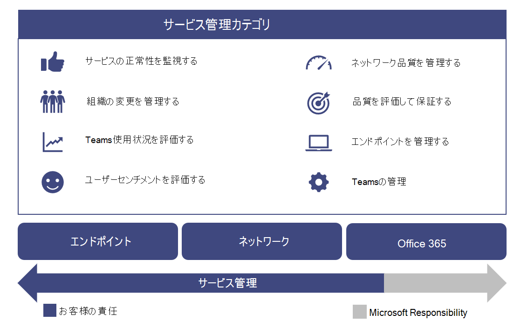

# サービスを運用する

この記事は、Skype for Business から Teams へのアップグレードが完了するとすぐに開始される、アップグレードの旅の"オペレーショナル・ディカリスト" ステージの一部です。

この記事では、アップグレード後に組織の Teams を正常に運用する場合の要件の概要を説明します。 Teams サービスを適切に運用することで、組織に高品質で信頼性の高いエクスペリエンスを提供することができます。

## 運用ガイドの概要

操作ガイドでは、Microsoft Teams のサービス管理機能の一部として必要なすべてのタスクとアクティビティの概要を説明します。

サービス管理の内容は、展開されてユーザーに対して利用できる状態にされている、Microsoft Teams サービスの日常的な運用を網羅するものです。 Teams サービスには、Microsoft 365 または Office 365 と、オンプレミスに展開されているインフラストラクチャ コンポーネント (ネットワークなど) が含まれます。

サービス管理の概念は、ほとんどの組織において、新しい概念ではない可能性が高いです。 既存のサービスに関連付けられているプロセスとタスクを既に実装している場合があります。 つまり、今後 Teams をサポートするために現在のサービス管理を計画する際に、現在のプロセスを強化できる可能性があります。

サービス管理には、Teams のエンドツーエンドの管理に関連するすべてのアクティビティとプロセスが含まれる。 前に説明したように、サービス管理の一部のコンポーネント (Microsoft 365 または Office 365 サービス自体が構成するインフラストラクチャ) は Microsoft の責任ですが、お客様は、お客様が提供する Teams、ネットワーク、エンドポイントのさまざまな側面を管理する責任をユーザーに負います。

このガイドのタスクとアクティビティは、次の図に示す 8 つのカテゴリにグループ化されています。 これらの各カテゴリは、次のセクションで展開されます。

<table>
<tr><td>  判断ポイント</td><td><ul><li>Teams の操作の実装方法を決定します。</li></ul></td></tr>

<tr><td> 次の手順</td><td><ul><li>操作ガイドを完全に確認してください。</li><li>Teams ワークロードの品質と信頼性を実現するために、組織の目標に合った運用戦略を実装します。</li><li>エクスペリエンスの品質レビュー ガイドを確認します。</li><li> 操作戦略を実装して、定期的にエクスペリエンスの品質レビューを実行し、Teams の展開が最大の機能で動作しているのを確認します。</li></ul></td></tr>

</table>

### 運用の役割マッピング

最初のパイロット ユーザーが有効になると、運用アクティビティが開始されるので、ビジョン フェーズ中に運用を計画する計画が重要です。 このガイドでは、高品質の Teams 展開を維持するために日単位、週単位、月単位、または必要に応じて実行する必要があるアクティビティとタスクを一覧表示します。 このガイドでは、これらの重要なアクティビティとタスクを実行する方法に関する知識とガイダンスを提供します。

展開を成功にするための重要な要素の 1 つは、ビジョン フェーズの早い段階で行う計画に、特定の活動を実行する責任者の決定が含まれることを確認する必要があります。 展開に適用されるタスクとアクティビティを把握した後、タスクとアクティビティを理解し、そのタスクに割り当てるグループまたは個人を理解し、その後に続く必要があります。

特定する各チームは、特定されたタスクと責任を確認して同意し、準備を開始する必要があります。 これには、トレーニングと準備、スタッフ計画の更新プログラムの提供、外部プロバイダーの提供準備が含まれる場合があります。

このガイドで定義されているアクティビティと役割は、ほとんどのシナリオで有効ですが、Teams のすべての展開は一意です。そのため、このガイドを基に、ニーズに合わせてアクティビティと既定の役割をカスタマイズできます。

責任を持つ各チームが、サービスの実行に必要なアクティビティについて適切に理解している必要があります。 最初のパイロットを開始する前に、各チームが組織の責任を承認し、承認を行う必要があります。

契約が設定された後、対応するチームは役割の運用を開始する必要があります。

<table>
<tr><td> 次の手順</td>
<td><ul><li>このドキュメントを使用して、運用上の役割マッピングの演習を容易に行います。</li><li>各サポート チームと会って、必要なアクティビティの一覧の各アイテムに名前を割り当てる。</li><li>割り当てられたロールに対する承認または承認を得る。</li><li>対応するチームが、必要なアクティビティを完了するための適切なトレーニング、準備、リソースを持っている必要があります。</li></ul></td></table>

### Teams サービスの依存関係

Microsoft Teams は、Microsoft 365 と Office 365 全体のテクノロジを組み合わせて、チームワークのハブを提供します。 例を次に示します。

- Azure Active Directory (Azure AD) は、Teams の認証サービスと承認サービスを提供します。

- Exchange Online は、法的ホールドや電子検出のような高度な機能を提供します。

- SharePoint Online はチャネル内でファイルを共有する機能を提供し、OneDrive for Business はプライベート チャット内でファイルを共有するメカニズムを提供します。

組織は、オンプレミス インフラストラクチャに対する既存の投資を活用できます。 たとえば、既存のオンプレミスの Active Directory アカウントを認証に使用するには、Azure AD Connect を利用します。 Exchange Online のExchange Server特定のバージョンを使用できます。

これらのテクノロジは、豊富で共同作業的でインテリジェントな通信スイートをユーザーに提供するために組み合わせています。 この緊密な統合は、Teams の主な利点ですが、これらのテクノロジ全体にわたるサービス管理の要件も推進します。

このガイドでは、Teams サービスを管理するための重要な領域について説明します。 多くの場合、Teams が依存するサポート テクノロジのサービス管理プランが用意されています。 インストールされていない場合は、それらのテクノロジ コンポーネント (オンプレミスとオンラインの両方) に対して適切なサービス管理計画を確立する必要があります。 これにより、ユーザーは Teams で高品質で信頼性の高いエクスペリエンスを利用できます。

#### 参照設定

[Microsoft Teams の概要](teams-overview.md)

[Exchange と Microsoft Teams の連携](exchange-teams-interact.md)

[Microsoft Teams との SharePoint Online と OneDrive for Business の連携](sharepoint-onedrive-interact.md)

[Microsoft Teams と Skype for Business の共存と相互運用性](teams-and-skypeforbusiness-coexistence-and-interoperability.md)

<!--ENDOFSECTION-->

## 操作ガイドのアクティビティ

次のセクションでは、Microsoft Teams サービスを正常に運用するために必要なアクティビティの概要を示します。 アクティビティを理解し、準備の取り組みを支援するために役立つツール、コンテキスト情報、その他のコンテンツへの参照が含まれます。

<!--ENDOFSECTION-->

## サービス正常性を監視する

サービスに影響を与えるすべてのイベントについて組織内の他のユーザーに積極的に通知するには、Microsoft Teams サービスの全体的な正常性を理解することが重要です。 前述のように、Teams は、Azure Active Directory、Exchange Online、SharePoint Online、OneDrive for Business などの他の Microsoft 365 および Office 365 サービスに依存しています。 この理由から、依存するサービスの正常性を監視することが同様に重要です。

このアクティビティをインシデント管理プロセスに取り込み、ユーザー、ヘルプデスク、および運用チームに事前に通知し、ユーザーのエスカレーションを処理するための準備を行います。

次のセクションでは、Teams サービスに影響するサービス インシデントを監視するために [利用できるツール](https://technet.microsoft.com/library/office-365-service-health.aspx#Anchor_1) について説明します。 各ツールの利点と、各ツールを使用する必要がある場合の概要を次の表に示します。

| 監視ツール | 利点 | 使用する場合 |
|---|---|---|
| Microsoft 365 管理センター | サポートされているブラウザーを使用して、どのデバイスからでも使用できます。 | リアルタイム通知が不要な場合に使用します。 |
| Microsoft 365 管理アプリ | モバイル デバイスにプッシュ通知を提供します。 | 移動中にサービス インシデントの通知を受け取る必要がある場合に使用します。 |
| Microsoft System Center | Microsoft System Center との統合。 | 高度な監視機能と通知サポートが必要な場合に使用します。 |
| Microsoft 365 Service Communications API | プログラムによる Microsoft 365 または Office 365 サービス正常性へのアクセス。 | サードパーティの監視ツールとの統合が必要な場合、または独自のソリューションを構築する場合に使用します。 |

> [!NOTE]
> サービス正常性を表示できるのは、グローバル **管理者** またはサービス管理者 **の役割が** 割り当てられているユーザーのみです。

### Microsoft 365 管理センターでの監視

[Microsoft 365](https://portal.office.com/)管理センターには、依存するサービスに加えて Teams サービスの現在の正常性を表示できるサービス正常性ダッシュボードが用意されています。

### モバイル アプリでの監視

Microsoft 365 管理アプリは、Apple iOS、Android、Windows (PC とモバイル) で利用できます。 このアプリは、サービス正常性と今後の変更に関するサービス管理者の情報を提供します。 このアプリはプッシュ通知をサポートし、勧告が投稿された直後に通知を受け取る可能性があります。 これにより、サービスの状態、正常性、今後の変更に関する最新の状態を常に確認できます。 通知のサポートにより、管理者に推奨される監視ツールになります。 詳細については、以下を参照してください。

[Microsoft 365 Admin Mobile アプリ](https://support.office.com/article/Office-365-Admin-Mobile-App-e16f6421-2a1a-4142-bf9d-9846600a060a)

[Microsoft 365 Admin モバイル アプリをダウンロードする](https://products.office.com/business/manage-office-365-admin-app)

### Microsoft System Center による監視

Microsoft System Center は、データセンター、クライアント デバイス、ハイブリッド クラウド IT 環境の管理に役立つ統合管理プラットフォームです。 システム センターを使用する Microsoft 365 管理者または Office 365 管理者は、管理パックをインポートして、システム センターの Operations Manager 内のすべてのサービス通信を表示することができます。 このツールを使用すると、サブスクライブしているサービスの状態、アクティブなサービス インシデントと解決済みサービス インシデント、およびメッセージ センターの通信 (今後の変更) にアクセスできます。 詳細については、次のブログ投稿を [参照してください](https://www.microsoft.com/en-us/microsoft-365/blog/2014/07/29/new-office-365-admin-tools/)。

システム センターを利用して Teams のサービス正常性 (および依存サービス) を監視する場合は、管理パックをさらにカスタマイズして、インシデントに対応すると特定のグループまたは個人に警告または通知することができます。
これらのグループには、サービス所有者、ヘルプデスク、第 2 レベルと第 3 レベルのサポート グループ、組織内のインシデント マネージャーを含めることができます。

### 高度なシナリオの監視

サービス正常性と今後の変更を監視するには、Service Communications API を利用してプログラムを使用してサービスの正常性と変更にアクセスします。 この API を使用して独自の監視ツールを作成するか、既存の監視ツールを Microsoft 365 または Office 365 サービス通信に接続すると、環境の監視方法が簡素化される可能性があります。 詳細については、Enterprise 開発者向け [Microsoft 365 または Office 365 を参照してください](https://docs.microsoft.com/office/developer-program/microsoft-365-developer-program-faq)。

### 日単位/週単位/月単位/必要なタスク

| アクティビティ | 説明 | [データの変更] | チームが割り当て済み |
|---|---|---|---|
| サービス正常性を監視する | 利用可能なツールを使用して、Microsoft Teams のサービス正常性 (および依存サービス) を積極的に監視します。 依存サービスには、Exchange Online、SharePoint Online、OneDrive for Business、Azure Active Directory が含まれます。 | リアルタイム | |
| インシデント通知 | Teams サービスに影響を与えるイベントについて、内部関係者に通知します。 内部関係者には、ユーザー、ヘルプデスク、インシデント マネージャーを含めることができます。 | 必要に応じて | |

### 参照設定

[Microsoft 365 または Office 365 のサービス正常性を確認する方法](https://support.office.com/article/How-to-check-Office-365-service-health-932AD3AD-533C-418A-B938-6E44E8BC33B0)

[Microsoft Teams のサービスの正常性を確認する](service-health.md)

[サービス正常性と継続性](https://technet.microsoft.com/library/office-365-service-health.aspx)

<!--ENDOFSECTION-->

## 組織の変更を管理する

Microsoft Teams は、クラウドベースのサービスです。 この機能を使用すると、新機能を迅速なペースで提供できます。 継続的な技術革新を実現すると、組織に明らかなメリットがありますが、ユーザーの抵抗やヘルプデスクへのエスカレーションを回避するには、組織内でこれらの変更を適切に管理する必要があります。

Teams の更新プログラムは、ユーザーに自動的に展開されます。 ユーザーは、Teams サービスで常に最新のクライアントと機能を利用できます。 ユーザーに対する Teams の更新プログラムのロールアウトを管理できないので、効果的なコミュニケーション、トレーニング、導入プログラムを通じて変更を管理することが非常に重要です。 ユーザーが変更を認識し、利点について教育し、新機能を活用する権限を与えれば、より迅速に適応し、変更を &mdash; 歓迎することができます。

### 変更の監視

変更管理の最初の手順は、Teams で計画されている変更を監視します。 これらの変更を監視する最適なソースは [、Microsoft 365 ロードマップです。Microsoft 365 ロードマップ](https://www.microsoft.com/microsoft-365/roadmap)には、現在開発中の機能、展開中の機能、または完全に起動した機能が一覧表示されます。 表示されたフィルターを使用して Teams 固有の機能を検索するか、ロードマップを Excel ファイルにダウンロードしてさらに分析することができます。 それぞれの機能について、ロードマップには、リリース予定日と共に簡単な説明が記載されています。

Microsoft [Teams ブログでは、Teams](https://techcommunity.microsoft.com/t5/Microsoft-Teams-Blog/bg-p/MicrosoftTeamsBlog)製品の更新に関するベスト プラクティス、傾向、ニュースについて学習できます。 Teams の主要な機能更新プログラムがここで発表される予定です。 RSS フィードを使用してブログを購読する方法もできます。 その後 [、RSS フィードを](https://techcommunity.microsoft.com/gxcuf89792/rss/board?board.id=MicrosoftTeamsBlog) Teams チャネルに直接追加して、すべての重要なニュースが Teams 内で直接配信されます。

リリースされる機能はすべて、Microsoft Teams の [リリース ノートに記載されています](https://support.office.com/article/Release-notes-for-Microsoft-Teams-d7092a6d-c896-424c-b362-a472d5f105de)。
デスクトップ、Web、モバイル デバイスでリリースされた機能の一覧を次に示します。 同じリリース ノートのセットは、ヘルプの **[新機能** ] タブでも使用 [できます](get-help-in-microsoft-teams.md)。

利用可能なリソースを理解し、変更を監視する該当する所有者を割り当て確認します。

### 変更の計画

Teams サービスの今後の変更を認識したので、次の手順は、必要に応じて準備して計画します。 各変更を評価して、ユーザーへのコミュニケーションが必要な変更、認識キャンペーン、サポート チームまたはユーザーのトレーニング、機能の評価と導入キャンペーンを決定します。 これは、組織内の変更管理チームの主要な役割です。 以下は、変更の計画に役立つサンプル テーブルのコレクションです。

#### 機能: クラウド録画 (リリース日: 2018 年 1 月)

**全般トラック**

| 準備を変更する | 状態 | メモ/次の手順 | 所有者 |
|---|---|---|---|
| 法的レビュー | 完了 | この機能は、トレーニング チームのオンボーディングの前提条件です。 | プロジェクト チーム |

**技術的な変更管理**

| 準備を変更する | 状態 | メモ/次の手順 | 所有者 |
|---|---|---|---|
| IT の変更が必要 | はい | 管理者は、識別されたユーザーにのみ記録を有効にする必要があります。 | サポート チーム |
| 技術的な準備完了 | はい | | サポート チーム |
| | | | |

**ユーザー変更管理**

| 準備を変更する | 状態 | メモ/次の手順 | 所有者 |
|---|---|---|---|
| ユーザーへの影響 | 低 | | |
| ユーザーの準備が必要 | はい | | |
| 通信の準備ができました | いいえ | コミュニケーション メールの下書きが作成されました。レビューが保留中です。 | コミュニケーション チーム |
| トレーニングの準備ができました | はい | トレーニングでは、既存の Microsoft ビデオを活用します。 | トレーニング チーム |

**ステータス トラック**

| 準備を変更する | 状態 | メモ/次の手順 | 所有者 |
|---|---|---|---|
| リリースの状態 | 進行中 | エグゼクティブ スポンサーによる審査待ち。 | 変更管理チーム |
| リリースのサインオフ | | | |
| リリース日 | | | |

Teams での変更管理の計画の詳細については、「Microsoft Teams の変更管理戦略を作成する」 [を参照してください](change-management-strategy.md)。

### 日単位/週単位/月単位/必要なタスク

| アクティビティ| 説明| [データの変更]| チームが割り当て済み |
|---|---|---|---|
| 変更を監視する| Microsoft Teams サービスに対する今後の変更を監視します。| [毎日]||
| 変更の計画| コミュニケーション計画、認識キャンペーン、トレーニングなどの新機能を評価して計画します。| 必要に応じて ||
| ユーザーの準備| 対象指定のコミュニケーション、認識、またはトレーニング キャンペーンを実行して、ユーザーが今後の変更に対応する準備が整います。| 必要に応じて ||
| サポート チームの準備 | 対象指定のコミュニケーション、認識、またはトレーニング キャンペーンを実行して、サポート チームの準備が整います。 サポート チームには、"ホワイト グラブ" チーム、ヘルプデスク、階層 2 または階層 3 のサポート、外部パートナーを含めることができます。 | 必要に応じて ||

<!--ENDOFSECTION-->

## Teams の使用状況を評価する

最初のパイロットが開始された後は、Teams の実際の使用状況を測定するための定期的な更新を確立する必要があります。 これにより、組織は、ビジョンフェーズで予測した使用状況と実際の使用状況がどのように一致するのかについて洞察することができます。 このセクションでは Teams の使用状況に重点を当てはっていますが、これは全体的な Microsoft 365 または Office 365 の使用状況を測定および評価するための広範な作業の一部である必要があります。

展開の早い段階で頻繁に利用状況を確認すると、次の機会を得る機会があります。

- ユーザーが Teams を使用するかどうかを検証します。

- 組織全体で重要な問題を作成する前に、潜在的な導入の課題を特定します。

- ビジョンのフェーズ要件と実際の使用との間に不一致が生じていかどうかを理解します。

使用が期待とは異なる場合は、展開の問題が原因か、導入計画が適切に実行されていないか、その他の問題が原因である可能性があります。 使用率が低い背景にある実際の理由に応じて、サービス管理者は、使用障壁を取り除く上で、関連するチームと協力する必要があります。

### Microsoft 365 管理センターでの使用状況の測定

Teams の利用状況データは、レポート ダッシュボードで使用できます。 Teams の利用状況データは、3 つの異なるレポートで確認できます。 最初のレポートでは、Microsoft 365 または Office 365 のさまざまなサービスを使用して、ユーザーが通信および共同作業を行う方法を示します。 このレポートは、管理センターの[Microsoft 365](https://support.office.com/article/Office-365-Reports-in-the-Admin-Center-Active-Users-FC1CF1D0-CD84-43FD-ADB7-A4C4DFA8112D)レポート - アクティブ ユーザーの場合に表示されます。

他の 2 つのレポートは Teams 固有であり、ユーザーとデバイスの観点から Teams の使用状況に関する詳細を提供します。 両方のレポートは、次の場所に表示されます。

[Microsoft Teams のデバイス使用状況レポート](https://support.office.com/article/Office-365-Reports-in-the-Admin-Center-Microsoft-Teams-device-usage-917b3e1d-203e-4439-8539-634e80196687)

[Microsoft Teams ユーザー アクティビティ レポート](https://support.office.com/article/Office-365-Reports-in-the-Admin-Center-Microsoft-Teams-user-activity-07f67fc4-c0a4-4d3f-ad20-f40c7f6db524)

#### 必要なアクセス許可

管理センターの利用状況レポートには、グローバル管理者ロールが割り当てられているユーザー、または製品固有の管理者の役割 **(Exchange** 管理者 **、Skype for Business** 管理者 **、SharePoint 管理者**) がアクセスできます。

さらに、 **レポートにアクセス** する必要があるが、管理者レベルのアクセス許可を必要とするタスクを実行しないユーザーは、レポート リーダーの役割を使用できます。 この役割を割り当てると、関係者であるすべてのユーザーに利用状況レポートを提供し、導入を監視および推進できます。 利用できるさまざまなロールの詳細については [、「Microsoft 365](https://support.office.com/article/About-Office-365-admin-roles-da585eea-f576-4f55-a1e0-87090b6aaa9d)管理者ロールについて」を参照してください。

### 使用状況の評価

レポート ダッシュボードを使用して使用状況を測定した後は、測定された使用状況を、プロジェクトのビジョン フェーズで定義した主要な成功インジケーター (KSIs) と比較することが重要です。 アクティブな利用状況として定義される可能性がある KSI、またはアクティブな利用状況に間接的にリンクされている KSI を定義できます。

追加のサイトまたはユーザーへのロールアウトを開始する前に、実際の使用状況と予定されている使用状況の差異を特定することが重要です。 このアクティビティの一環として組織の学習を特定し、次のサイトまたはユーザーのバッチで同じ問題が発生しなかからなことを確認できます。

まず、これが導入か技術的な問題かを特定します。 まず、問題の場所を特定するために、以下の項目を調査します。

1. 品質のレビューを実行して [品質を検証します](upgrade-monitor-quality.md)。

2. ヘルプデスク チームと一緒に、ユーザーがサービスにアクセスまたは使用するのを妨げている技術的な問題が発生しないか確認します。 問題の傾向が存在する場合は、サポートを受け取る前に、この記事の後半のエンドポイント トラブルシューティング セクションを使用して問題を解決してください。

3. トレーニングおよび導入チームと一緒に、ユーザーから直接フィードバックを収集し (この記事の後半でユーザーの感情を評価する)、認識と導入アクティビティの有効性を確認します。

### 日単位/週単位/月単位/必要なタスク

| アクティビティ | 説明 | [データの変更] | チームが割り当て済み |
|---|---|---|---|
| 使用状況を測定する (有効化フェーズ) | サイトが有効化フェーズ中も引き続きオンボーディングを行うので、Teams の使用状況を測定および評価します。 必要に応じて、使用状況の問題に対処します。 | [毎週] | |
| 使用状況を測定する | (展開が完了した後に) ドライブ値フェーズで Teams の使用状況を測定および評価します。 必要に応じて、使用状況の問題に対処します。 | Biweekly | |
| (ドライブ値フェーズ) | | | |
| 導入計画を更新する | 使用状況の測定と計画ターゲットの比較に基づいて、導入計画を更新します。 | 必要に応じて | |

### 参照設定

[Microsoft 365 管理センターについて](https://support.office.com/article/About-the-Office-365-admin-center-758befc4-0888-4009-9f14-0d147402fd23)

[Microsoft 365 管理センターのアクティビティ レポート](https://support.office.com/article/Activity-Reports-in-the-Office-365-admin-center-0d6dfb17-8582-4172-a9a9-aed798150263)

<!--ENDOFSECTION-->

## ユーザーの感情を評価する

ユーザー の感情を理解すると、Teams 展開の成功を測定する重要なインジケーターとして機能します。 ユーザーフィードバックは、組織の変更を後で行う可能性があります。これには、コミュニケーション プラン、トレーニング プログラム、またはユーザーにサポートを提供する方法の変更が含まれる場合があります。

早い段階でフィードバックを受け取り、プロジェクトのライフサイクル全体を通じて、さらにその先のユーザー の感情を評価し続ける必要があります。 次のガイダンスを使用して、組織がフィードバックを求める間隔を決定します。

- **プロジェクトの開始**: プロジェクトの開始時にユーザーの感情を評価することで、ユーザーが Teams のエクスペリエンスについてどのように感じるかについて、早期に確認できます。

- **主要なマイルストーンの** 後: プロジェクトのライフサイクル全体を通じてフィードバックを収集することで、継続的にユーザーの感情を評価し、必要に応じて変更を加えます。 これは、主なマイルストーンの後に特に便利です。

- **プロジェクトの** 結論: プロジェクトの最後にユーザーの感情を評価すると、どれだけの成果を上がり、どこで作業を行う必要があるのかを知ることができます。また、前回のアンケートと結果を比較できます。

- **進行中**: ユーザーの感情を無期限に測定し続ける。 ユーザー の感情の変化は、組織の環境の変更や Teams サービスの変更が原因である可能性があります。 一定の間隔でユーザーの感情を測定することで、サービス管理チームのパフォーマンスと、組織が Teams サービスの変更に対してどのように対応しているのかについて理解できます。

ユーザー の感情は、さまざまな方法で評価できます。 これには、メールアンケート、対面式または電話形式のインタビュー、Teams または Yammer でフィードバック チャネルを作成する方法があります。 詳細については [、Microsoft Teams のユーザー フィードバック方法のベスト プラクティスを参照してください](best-practices-feedback.md)。

また、業界全体のアプローチを使用して、net promotor score (NPS) と呼ばれるユーザー の感情を評価することができます。これは、次のセクションで説明します。

### NPS

ネット ベクター スコア (NPS) は、業界全体の顧客満足指標であり、ユーザーの感情を評価するために使用する適切なアプローチです。 NPS は、「Teams を同僚に薦める可能性はどのくらいですか?」という 2 つの質問に続いて、フリーフォームの質問 「なぜですか?」という質問をして計算できます。

NPS は-100 から 100 の範囲のインデックスで、企業の製品またはサービスを推奨する顧客の意識を測定します。 NPS は、メールや他の電子的手段を通じてユーザーに配信される匿名のアンケートに基づいて行います。 NPS は、プロバイダーとコンシューマーの間の忠実度を測定します。 これは 1 つの質問だけで構成され、ユーザーに 1 から 10 のエクスペリエンスを評価し、追加のコメントを提供するオプションを求める。 ユーザーは、次の評価に基づいて分類されます。

- 9 または 10 は、プロモーターです。サービスを宣伝し、他のユーザーに燃料を供給する熱心なファンです。

- 7 または 8 はパッシブです。満足していますが、非意識的で、別のサービスまたはサービスに対して脆弱です。

- 1 から 6 はデクレーターです。サービスに損害を与え、成長を妨がる可能性がある、不満を持つお客様。

ベースの NPS 番号は役に立ちますが、ユーザーコメントの分析から最も価値があります。 ユーザーが Teams を他のユーザーに勧め (または推奨しない) 理由を理解するのに役立ちます。 これらのコメントは、プロジェクトまたはサービス管理チームが品質サービスを提供するために必要な調整を理解するのに役立つ貴重なフィードバックを提供できます。

NPS アンケートを組織に提供するには、お気に入りのオンラインアンケート ツールを利用できます。

### 日単位/週単位/月単位/必要なタスク

| アクティビティ | 説明 | [データの変更] | チームが割り当て済み |
|---|---|---|---|
| ユーザーの感情を評価する | アンケートやインタビューを使用するか、Teams または組織のフィードバック チャネルを使用して、ユーザーの感情をキャプチャして評価Yammer。 | 必要に応じて | |
| 導入計画を更新する | ユーザーのフィードバックに基づいて組織の変更を行います。これには、コミュニケーション プラン、トレーニング プログラム、またはユーザーにサポートを提供する方法の変更が含まれる場合があります。 | 必要に応じて | |

### 参照設定

[Net のしがみスコア](https://en.wikipedia.org/wiki/Net_Promoter)

[フィードバックYammerを使用する](https://techcommunity.microsoft.com/t5/Yammer-Blog/The-Microsoft-Teams-team-uses-Yammer/ba-p/55210)

[ユーザー フィードバックのベスト プラクティス](best-practices-feedback.md)

<!--ENDOFSECTION-->

## ネットワーク品質を管理する

多くの主要な計画要素は、ネットワーク インフラストラクチャの最適化、適切なサイズ変更、修復に取り組み、Microsoft Teams サービスへの高品質で効率的なパスを確保します。 計画タスクと要件については、ネットワーク準備ガイダンス [で説明](prepare-network.md) します。 多くの場合、ネットワークはアップグレード、拡張、その他のビジネス要件のために時間の経過と共に進化します。 ネットワーク計画アクティビティにおける Teams の要件を考慮することが重要です。

ネットワーク計画は Teams 展開の重要な側面ですが、ビジネス要件や技術要件の変化に基づいて、ネットワークが正常な状態を維持し、最新の状態を維持することが同様に重要です。

ネットワークの正常性を確保するには、一定の間隔で多くの操作アクティビティを実行する必要があります。

### 日単位/週単位/月単位/必要なタスク

| アクティビティ | 説明 | [データの変更] | チームが割り当て済み |
|---|---|---|---|
| Microsoft 365 または 365 Office URL を監視する | 提供された[RSS](https://go.microsoft.com/fwlink/p/?linkid=236301)フィードを使用Office [365 URL](https://aka.ms/o365ips)と IP アドレス範囲に対する変更を監視し、該当するネットワーク グループへの変更要求を開始します。 | [毎日] | |
| Microsoft 365 または 365 OFFICE URL の変更に基づいてネットワークを更新する | [Office 365 URL](https://aka.ms/o365ips)と IP アドレス範囲の変更を反映するために、該当するネットワーク コンポーネント (ファイアウォール、プロキシ サーバー、VPN、クライアント側ファイアウォールなど) を更新します。 | 必要に応じて | |
| 建物データを提供する | [CQD](https://docs.microsoft.com/SkypeForBusiness/using-call-quality-in-your-organization/turning-on-and-using-call-quality-dashboard#upload-building-information)の建物の定義を最新の状態に保つには、品質チャンピオン (または関連する関係者) に更新されたサブネット情報を提供します。 | 必要に応じて | |
| 変更を実装する | ネットワークに変更を実装して、Teams のビジネス要件と技術的要件の変更をサポートします。 ネットワーク要素には、次の要素を含めできます。<ul><li>ファイアウォール</li><li>VPN</li><li>有線ネットワークとWi-Fi ネットワーク</li><li>インターネット接続と ExpressRoute</li><li>DNS</li></ul> | 必要に応じて | |
| ネットワークの監視とレポート | 既存のサード パーティのネットワーク管理ツールと、ネットワーク プロバイダーから利用できるレポート機能を使用して、ネットワークのエンドツーエンドで可用性、使用率、容量の傾向を監視します。 ネットワーク キャパシティ プランニングには、トレンド データを使用します。 | 日単位、週単位、月単位 | |
| 処理能力の計画 | Teams サービスの所有者と協力して、追加の容量変更を生み出す可能性のあるビジネス要件と技術的要件の変更を理解します。  | 必要に応じて | |
| ネットワークのトラブルシューティングと修復 | Teams の接続性、信頼性、または品質に関連する問題のトラブルシューティングと修復を行う Teams のヘルプデスク、サービス所有者、主要な関係者を支援します。 ネットワーク要素には、次の要素を含めできます。<ul><li>ファイアウォール</li><li>VPN</li><li>有線ネットワークとWi-Fi ネットワーク</li><li>インターネット接続と ExpressRoute</li><li>DNS</li></ul> | 必要に応じて | |
| 障害回復と高可用性のテスト | ネットワーク インフラストラクチャで定期的な高可用性および障害復旧テストを実行して、Teams サービスの指定されたサービス レベル目標 (SLA) またはサービス レベル アグリーメント (SLA) を満たします。 | 毎月 | |

### 参照設定

[Office 365 URL および IP アドレス範囲](https://aka.ms/o365ips)

[データ スキーマの構築](https://docs.microsoft.com/SkypeForBusiness/using-call-quality-in-your-organization/turning-on-and-using-call-quality-dashboard#tenant-data-file-format-and-building-data-file-structure)

<!--ENDOFSECTION-->

## 品質を評価して確認する

すべての組織で、品質に対する責任を持つグループまたは個人が必要です。 これは、サービス管理において最も重要な役割です。 品質チャンピオンの役割は、ユーザーのエクスペリエンスに熱心なユーザーまたはグループに割り当てられます。
この役割は、環境での傾向を特定するスキルと、修復を推進するために他のチームと協力するスポンサーシップを必要とします。 通常、品質チャンピオンに最適な候補はカスタマー サービスの所有者です。 組織の規模や複雑さによっては、高品質のユーザー エクスペリエンスを確保するための熱意を持つ任意のユーザーまたはグループである可能性があります。

品質チャンピオンは、通話品質ダッシュボード (CQD) や [Teams](monitor-call-quality-qos.md)の通話品質の向上と監視など、既存のツールと文書化されたプロセスを利用して、ユーザー エクスペリエンスの監視、品質の傾向の特定、必要に応じて修復を行います。
品質チャンピオンは、それぞれのチームと一緒に修復アクションを推進し、進捗状況や開いている問題について運営委員会に報告する必要があります。

[Teams の通話品質の](monitor-call-quality-qos.md) 向上と監視には、ユーザー エクスペリエンスの向上に最も大きな影響を与える主要な領域の修復ガイダンスを評価して提供するアクティビティが含まれています。 品質エクスペリエンス レビュー ガイドで提供されるガイダンスでは、導入と影響を最大化するためにオーディオに重点を置いて、各領域をレポートおよび調査するための主要なツールとして CQD Online を使用する方法に重点を置いています。 音声エクスペリエンスを改善するためにネットワークに対して行われた最適化は、ビデオおよびデスクトップ共有を改善することにも直接転用されます。

早い段階で品質チャンピオンを指名することを強く推奨します。 指名を受け、Teams および関連するトレーニング資料の通話品質の向上と監視のコンテンツに慣れ始める必要があります。

### 日単位/週単位/月単位/必要なタスク

| アクティビティ | 説明 | [データの変更] | 割り当てられたチーム |
|---|---|---|---|
| 指名およびトレーニング品質チャンピオン | 品質チャンピオンを指名し、トレーニングします。 | 必要に応じて | |
| 品質評価 (QERs) を実行する | QER を実行して、品質と信頼性の傾向を特定し、定義されたターゲットに対してレビューし、組織内の主要な関係者に報告します。 | 毎月 (展開中は毎週) | |
| ドライブ修復 | QER の評価と結果に基づいて、組織全体の修復作業を調整します。 | 必要に応じて | |
| CQD で建物データを更新する | ネットワークに変更を加えたときに、CQD で新しい建物の定義を更新または追加します (「建物情報をアップロードする [」を参照してください](https://docs.microsoft.com/SkypeForBusiness/using-call-quality-in-your-organization/turning-on-and-using-call-quality-dashboard#upload-building-information))。 | 必要に応じて | |
| 品質チャンピオンの役割を果たす | 組織の品質に対するエンドツーエンドの責任。 これには、次の内容が含まれます。<ul><li>QER が定期的に実施されるのを確認します。</li><li>品質の状態に関する主要な関係者に報告します。</li><li>建物のデータ定義を最新の情報にしてください。</li><li>組織全体の修復作業を調整して、ユーザーが Teams で高品質のエクスペリエンスを得る必要があります。</li></ul> | [毎日] | |

### 参照設定

[建物情報をアップロードする](https://docs.microsoft.com/SkypeForBusiness/using-call-quality-in-your-organization/turning-on-and-using-call-quality-dashboard#upload-building-information)

[Teams の通話品質の向上と監視](monitor-call-quality-qos.md)

<!--ENDOFSECTION-->

## エンドポイントを管理する

Microsoft Teams のエンドポイントは、Teams クライアントを実行している PC、Mac、タブレット、モバイル (または他の) デバイスとして定義できます。 用語のエンドポイントには、デバイス自体だけでなく、ユーザーがデバイスに接続する方法 (たとえば、デバイスの内蔵マイクまたはスピーカー、イヤーパッド、最適化されたヘッドセットを使用) が含されます。 展開後、エンドポイントを忘れてはいけなさそう。 Teams のエンドポイントには、継続的な注意とメンテナンスが必要です。 次のセクションでは、注目する特定の領域について説明します。

### エンドポイントの要件

Teams の主な利点の 1 つは、クライアントが自動的に最新の状態に維持されるという利点です。 PC と Mac 上のクライアントは、アプリがアイドル状態のときに新しいビルドがあるかを確認したり、新しいクライアントをダウンロードしたりする、バックグラウンド プロセスを使用して更新されます。 Teams モバイル アプリは、それぞれのアプリ ストアを通じて最新の状態を維持します。

Teams クライアントには、基になるソフトウェア プラットフォームに関する最低限の要件があります。 これらの要件は時間の変化に応じて変わる可能性があります。そのため、変更を監視することが重要です。 たとえば、Teams クライアントには最小 iOS バージョンがあります。 クライアントがインターネット ブラウザーを使用している場合は、ブラウザーも最新の状態に維持する必要があります。 サポートされているプラットフォームの一覧については、「Microsoft Teams のクライアントを取得する [」を参照してください](get-clients.md)。

### エンドポイントのファイアウォール

クライアント側のファイアウォールはユーザー エクスペリエンスに大きな影響をおよぼす可能性があります。
クライアント側ファイアウォールは通話品質に影響を与え、通話が確立されるのを防ぐ可能性があります。 クライアント ファイアウォールで適切な除外を構成した後は [、Office 365 URL](https://aka.ms/o365ips)と IP アドレス範囲の情報に基づいて、最新の状態を維持する必要があります。 サード パーティベンダーには、除外を更新する方法に関する特定のガイダンスが提供されます。

### Wi-Fi ドライバー

Wi-Fiが問題になる可能性があります。 たとえば、ドライバーがアクセス ポイント間で非常に積極的なローミング動作を行い、不要なアクセス ポイントの切り替えが発生し、通話品質が低下する可能性があります。 パフォーマンスの低いWi-Fiエクスペリエンスレビューを通じて検出される可能性があります (詳細については [、「Teams](monitor-call-quality-qos.md) の通話品質の向上と監視」を参照してください)。 新しい Wi-Fi ドライバーを監視し、一般的なユーザー人口に展開する前にテストを確実に行う、品質駆動型のプロセスを実装する必要があります。

### エンドポイント管理

サポートされているエンドポイントとインターフェイス デバイス (ヘッドセットなど) のカタログを利用して維持する必要があります。 このカタログには、ビジョンフェーズとオンボード フェーズの一部として選択および検証された承認済みデバイスの一覧が含まれます。 通常、特定のデバイスは、そのユーザーの属性のニーズを満たすために、組織内の各ユーザーの種類に対して選択されます。 すべてのエンドポイントにライフサイクルが設定され、これらのデバイスに関連付けられているベンダー契約、保証、交換、配布、修理ポリシーを管理する必要があります。

### エンドポイントのトラブルシューティング

前のガイダンスに従った場合でも、組織内のユーザーは引き続き Teams で問題が発生する可能性があります。 問題はエンドポイント自体にはない可能性があるが、通常、問題の現象はクライアントからユーザーに表示されます。 次のガイダンスは、問題を解決するために実行できる一般的な手順を提供することを目的としています。これは、包括的なトラブルシューティング ガイドを意図したのではありません。 手順は特定の順序で提供されますが、明示的に従う必要はなし、問題の性質によっては該当しない場合があります。

1. **サービス正常性を検証する:** ユーザーが発生している可能性がある問題は、Teams サービスまたは依存サービスに悪影響を与えるイベントに関連している可能性があります。 最初の手順として、アクティブなサービスの問題が発生することを確認することをお勧めします。 [Microsoft 365 サービスの正常性を確認する方法を参照してください](https://docs.microsoft.com/office365/enterprise/view-service-health)。 依存するサービス (Exchange、SharePoint、OneDrive for Business など) の状態を確認してください。 サービス正常性の監視については、前のセクション「サービス正常性の監視」 [で詳しく説明します](#monitor-service-health)。

2. **クライアント接続を検証します。** 接続の問題により、Teams の機能またはサインインの問題が発生します。 サービスへの接続を検証する (特に新しいサイトや場所の場合) お勧めします。 サイトごとに次 [Office 365 URL](https://aka.ms/o365ips) と IP アドレス範囲のガイダンスに従います。 Microsoft ネットワーク評価ツール [を利用して](https://www.microsoft.com/download/details.aspx?id=53885) 接続テストを実行し、Teams の機能に対してメディア ポートが正しく開いているか検証できます。 接続性テストを実行する方法の詳細な手順については、ネットワーク準備 [ガイダンスを参照](prepare-network.md) してください。

3. **既知の問題の一覧を確認します。**[Teams のトラブルシューティングを参照](https://docs.microsoft.com/MicrosoftTeams/troubleshoot/teams)して、ユーザーがこれらの問題の 1 つによって悪影響を受けたかどうかを確認します。 表示された回避策 (ある場合) に従って、問題を解決します。

4. **Microsoft Teams コミュニティにアクセスしてください。**[Microsoft Teams コミュニティには、Teams](https://techcommunity.microsoft.com/t5/Microsoft-Teams/ct-p/MicrosoftTeams)専用のスペースがあります。 Teams コミュニティは、Teams を中心にしたディスカッション リスト、ブログの投稿、お知らせを提供します。 問題の解決方法については、質問を投稿したり、以前のディスカッションを検索することができます。

5. **Microsoft サポートに問い合わせ:** オンラインまたは電話で Teams の問題が発生した場合は、Microsoft サポートにお問い合わせください。 詳細については、ビジネス製品 [のサポートへのお問い合わせ - 管理者向けヘルプを参照してください](https://docs.microsoft.com/microsoft-365/admin/contact-support-for-business-products)。 プレミアのお客様の場合は、Microsoft Teams のサポートに問い合わせ (プレミアのお客様) のガイダンスに従って、サポート要求 [を開始できます](https://support.microsoft.com/premier/contacts)。

### 日単位/週単位/月単位/必要なタスク

| アクティビティ | 説明 | [データの変更] | チームが割り当て済み |
|---|---|---|---|
| エンドポイントの要件 | Teams エンドポイントが、Microsoft Teams のクライアントを取得するに記載されている Teams のすべてのソフトウェア要件を引き続 [き満たしていることを確認します](get-clients.md)。 | 毎月 | |
| エンドポイントのファイアウォール | 365 URL と IP アドレス範囲の情報に基づいて、エンドポイント ファイアウォールOffice除外 [を維持します](https://aka.ms/o365ips)。 サード パーティベンダーは、除外を維持する方法に関する特定のガイダンスを提供します。 RSS フィードを [購読すると](https://support.office.com/o365ip/rss) 、変更が自動的に通知されます。 | 必要に応じて | |
| Wi-Fi ドライバー | PC でドライバーWi-Fiして更新します。 CQD (Teams の通話品質の向上と監視) を使用して[結果を検証します](monitor-call-quality-qos.md)。 | 必要に応じて | |
| エンドポイント管理 | サポートされているエンドポイントとインターフェイス デバイス (ヘッドセットなど) のカタログを管理します。 ベンダー契約、保証、配布、交換、修理のポリシーを管理します。 | 毎月 | |
| エンドポイントのトラブルシューティング | トラブルシューティングタスクには、接続の確認、既知の問題リストの参照、ログ収集、分析、Microsoft サポートまたはサードパーティ ベンダーへのエスカレーションが含まれます。 | 必要に応じて | |

### 参照設定

[Office 365 URL および IP アドレス範囲](https://aka.ms/o365ips)

[Microsoft Teams のクライアントを取得する](get-clients.md)

[Microsoft Teams コミュニティ](https://techcommunity.microsoft.com/t5/Microsoft-Teams/ct-p/MicrosoftTeams)

[Teams のトラブルシューティング](https://docs.microsoft.com/MicrosoftTeams/troubleshoot/teams)

[Microsoft Teams のサービスの正常性を確認する](service-health.md)

[ビジネス製品についてサポートに問い合わせる - 管理者ヘルプ](https://support.office.com/article/Contact-support-for-business-products-Admin-Help-32a17ca7-6fa0-4870-8a8d-e25ba4ccfd4b)

[プレミア サポートに問い合わせ](https://support.microsoft.com/premier/contacts)

[Teams ビデオのトラブルシューティング](https://www.youtube.com/watch?v=4O4d_7uZTQY)

<!--ENDOFSECTION-->

## Teams の管理

Microsoft Teams サービスが展開された後は、その管理に関連する複数のアクティビティを実行する必要があります。 アクティビティは、サービスと個々のユーザーの管理から、キャパシティ プランニングとプロビジョニング のライセンスと電話番号まで、さまざまな範囲で行います。 以下のセクションでは、これらの一般的な管理タスクの一部について説明します。

### サービス管理

Teams サービスには、テナント全体で構成できる複数の設定があります。
テナントの設定に加えた変更は、Teams で有効になっているすべてのユーザーに影響します。 これらの設定の詳細な一覧については、「組織の Microsoft Teams の [設定を管理する」を参照してください](enable-features-office-365.md)。

### ユーザー管理

ユーザーをサポートするために、組織が関連するタスクを必要とする場合があります。特定のタスクは組織によって異なります。 最終的には、これらのタスクは、これらの業務に割り当てられているサポート チームによって管理される必要があります。 Teams でユーザーをサポートするには、次のタスクが一般的に必要です。

#### 一般的なタスク

[Microsoft Teams へのユーザー アクセスを管理する](user-access.md)

### チームの作成 (オプション)

既定では、Exchange Online のメールボックスを持つすべてのユーザーには、Microsoft 365 グループを作成するアクセス許可と、Microsoft Teams のチームを作成する権限があります。 より厳しい制御を持ち、新しい [チームの作成](assign-roles-permissions.md#permissions-to-create-teams) (および新しい Microsoft 365 グループの作成) を制限する場合は、グループの作成と管理の権限を一連の管理者に委任できます。 組織でこのオプションを使用する場合は、この記事で説明されているプロセスを参照して、割り当てられたチームによって処理される要求をユーザーが送信できる必要があります。

<!--ENDOFSECTION-->

### 日単位/週単位/月単位/必要なタスク

| アクティビティ | 説明 | [データの変更] | チームが割り当て済み |
|---|---|---|---|
| サービス管理 | テナント全体の Teams 設定の管理。 | 必要に応じて | |
| ユーザー管理 | Teams でのユーザーベースの設定とライセンスの管理。 | 必要に応じて | |
| ライセンス管理 | [PSTN](https://docs.microsoft.com/skypeforbusiness/skype-for-business-online-reporting/pstn-usage-report)利用状況レポートと PSTN ミニデータ プール レポートを利用して、ユーザーと追加機能プランベースのライセンス (通話プランと通信クレジット) の両方の現在および将来のニーズを[計画](https://docs.microsoft.com/skypeforbusiness/skype-for-business-online-reporting/pstn-minute-pools-report)します。 | [毎週] | |
| 電話番号の管理 | 将来の成長に利用できる電話番号を管理し、組織のニーズに合わせて在庫レベルを調整します。 | [毎週] | |
| チームの作成 (オプション) | チーム作成の要求を確認して処理します。 | 必要に応じて | |

<!--ENDOFSECTION-->
