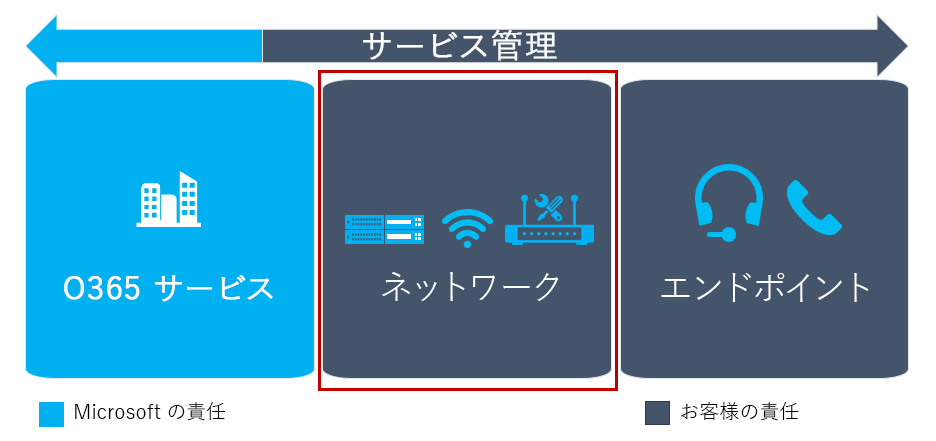

この資料は、ユーザーの準備段階と並行して、完了したアクティビティ、アップグレード、旅の技術的な準備段階の一部です。This article is part of the Technical Readiness stage of your upgrade journey, an activity you complete in parallel with the User Readiness stage. 次に進む前に前の段階からこれらの活動を完了していることを確認します。Before proceeding, confirm that you’ve completed these activities from previous stages:

-   [プロジェクトの利害関係者が参加しています。Enlisted your project stakeholders](upgrade-enlist-stakeholders.md)
-   [プロジェクト スコープの定義Defined your project scope](https://aka.ms/SkypetoTeams-Scope)
-   [ビジネスとチームの共存と Skype の相互運用性を理解します。Understood coexistence and interoperability of Skype for Business and Teams](https://aka.ms/SkypeToTeams-Coexist)
-   [アップグレード、旅を選択Chosen your upgrade journey](upgrade-and-coexistence-of-skypeforbusiness-and-teams.md)

# チームにアップグレードするためにネットワークを準備します。Prepare your network for upgrading to Teams

オーディオ、ビデオ、または会議を導入する場合は、その機能が、ネットワークを最適化するためにいくつか追加の手順を実行できます。If you’re deploying audio, video, or meetings, you can take some additional steps to optimize your network for that functionality. チーム技術を使用してオーディオおよびビデオ (コーデック) に対応する-下にあるためパフォーマンスが向上して、ネットワークの条件の最も。Teams uses audio and video technology (codecs) that can adapt to—and therefore perform better under—most network conditions. 最適な一貫したパフォーマンスを確保するには、チームのネットワークを準備する必要があります。To ensure optimal and consistent performance, you should prepare your network for Teams.

![の品質、およびサービスの管理がすべての 3 つのコンポーネントに重なっている 3 つのコンポーネントを説明する図。ネットワークに重点を置いた]。(media/evaluate-my-environment-image1.png "の品質、およびサービスの管理がすべての 3 つのコンポーネントに重なっている 3 つのコンポーネントを説明する図。ネットワークに重点を置いた")。

## ネットワークを準備するには、なぜ必要がありますか。Why should you prepare your network?

実行する手順を見ると、前に、どのようなパフォーマンスに影響、およびそれによってチームのユーザーの幸せと満足度を理解する必要が。Before we look at the steps to be taken, it’s important to understand what can affect the performance of Teams and thereby user happiness and satisfaction. 3 つの主要なリスク領域は、ユーザーがネットワークの品質を認識する方法に影響します。Three major risk areas can affect how users perceive network quality:

-   使用可能な帯域幅が不足Insufficient bandwidth available

-   ファイアウォールとプロキシのブロックFirewall and proxy blockers

-   ジッターとパケット損失などのネットワーク障害Network impairments such as jitter and packet loss

以下に示す手順を使用すると、解像度の方向に移動する、展開は、これらの要因の影響を受ける可能性があり、ヘルプがあるかどうかを決定できます。The steps described below will help you determine whether your deployment might be affected by any of these factors and will help you move toward a resolution. ネットワークを準備するのには失敗している可能性がありますユーザーの不満であると、コストがかかり、一時的な修正です。Failing to prepare your network will likely lead to dissatisfied users and costly, ad-hoc fixes. ネットワークを準備して- と、組織、チームを増やすことができます劇的に成功するチャンスです。By preparing your network—and your organization—for Teams, you can dramatically increase your chance of success.

<!--ENDOFSECTION-->

## 帯域幅の計画Bandwidth planning

ネットワーク上に必要な帯域幅の様相のチームは、ユーザーに提供されますが、ネットワークの準備の第一歩を確認します。The first step toward network readiness is ensuring your network has enough bandwidth available for the modalities Teams will provide to users. 比較的簡単な作業には十分な帯域幅を計画して、高品質チームの経験をユーザーを確実に低障壁の非常に開始することです。Planning for sufficient bandwidth is a fairly straightforward task and a very low-barrier start to help ensure your users will have a high-quality Teams experience.

帯域幅のネットワーク プランナーを使用して、チームの[アドバイザーを自分の web サイト](https://myadvisor.fasttrack.microsoft.com/)上の旅を計画を開始するとします。You start your bandwidth planning journey for Teams on the [My Advisor website](https://myadvisor.fasttrack.microsoft.com/) by using the Network Planner. ネットワーク プランナーは、計画チームのサイトごとの帯域幅を提供し、ネットワークのパフォーマンスを最適化するための推奨事項を提供します。The Network Planner provides per-site bandwidth planning for Teams and offers recommendations for optimizing network performance.

> [!IMPORTANT]
> 必要な帯域幅を使用できない場合は、チーム内のメディアのスタック コールまたは会議の品質に影響する使用可能な帯域幅の削減量に対応するためのオーディオ/ビデオ セッションの品質を低下します。If the required bandwidth isn’t available, the media stack inside Teams degrades the quality of the audio/video session to accommodate that lower amount of available bandwidth, which affects the quality of the call or meeting. チームのクライアントは、ビデオの品質でオーディオの品質を優先順位を設定しようとします。The Teams client attempts to prioritize the quality of audio over the quality of video. そのために必要な帯域幅利用可能な非常に重要な勧めします。It’s therefore extremely important to have the expected bandwidth available.

|アクティビティActivity  |帯域幅をダウンロードします。Download bandwidth  |帯域幅をアップロードします。Upload bandwidth  |トラフィック フローTraffic flow |
|---------|---------|---------|---------|
|**ピア ツー ピア音声通話****Peer-to-peer audio call**     |0.1 Mbps0.1 Mbps         |0.1 Mbps0.1 Mbps        |クライアント <> クライアントClient <> Client         |
|**ピア ツー ピア ビデオ通話 (フル スクリーン表示)****Peer-to-peer video call (full screen)**     |4 Mbps4 Mbps         |4 Mbps4 Mbps         |クライアント <> クライアントClient <> Client          |
|**デスクトップの共有のピア ツー ピア (1920 & #215; 1080 の解像度)****Peer-to-peer desktop sharing (1920&#215;1080 resolution)**     |4 Mbps4 Mbps         |4 Mbps4 Mbps         |クライアント <> クライアントClient <> Client          |
|**2 参加者のミーティング****Two-participant meeting**     |4 Mbps4 Mbps         |4 Mbps4 Mbps         |クライアント <> Office 365Client <> Office 365         |
|**3 参加者のミーティング****Three-participant meeting**     |8 Mbps8 Mbps         |6.5 Mbps6.5 Mbps         |クライアント <> Office 365Client <> Office 365           |
|**4 参加者のミーティング****Four-participant meeting**     |5.5 Mbps5.5 Mbps         |4 Mbps4 Mbps         |クライアント <> Office 365Client <> Office 365           |
|**5 つまたはより – 参加者会議****Five or more–participant meeting**     |6 Mbps6 Mbps         |1.5 Mbps1.5 Mbps         |クライアント <> Office 365Client <> Office 365           |

### ローカルのインターネットの出口Local internet egress

多くのネットワークは、ハブを使用して、スポークのトポロジを設計されました。Many networks were designed to use a hub and spoke topology. このトポロジでは、インターネット トラフィック通常走査 WAN 中央データ センターにインターネットに現れた (組み入れる) 前にします。In this topology, internet traffic typically traverses the WAN to a central datacenter before it emerges (egresses) to the internet. 全体的なコストの削減を目標として、ネットワーク セキュリティ デバイスを集中管理するこれは、多くの場合です。Often, this is done to centralize network security devices with the goal of reducing overall cost.

WAN 経由のトラフィックの背面の運搬は、遅延時間を増加し、品質とユーザー エクスペリエンスに悪影響を与えるには。Back-hauling traffic across the WAN increases latency and has a negative impact on quality and the user experience. マイクロソフト チームは、Microsoft の大規模なグローバル ・ ネットワーク上で稼働するために多くの場合ネットワーク ピアリングの場所、ユーザーの近くにBecause Microsoft Teams runs on Microsoft’s large global network, there’s often a network peering location close to the user. ユーザーができるだけ早くその場所に近いと、音声用に最適化されたネットワークにローカルのインターネット ポイントから egressing でパフォーマンスを向上させる可能性があります表示されます。A user will most likely get better performance by egressing out of a local internet point close to their location and on to our voice-optimized network as soon as possible. 一部のワークロードでは、DNS 要求を使用して、トラフィックの送受信をフロント エンド サーバーに最も近い。For some workloads, DNS requests are used to send traffic to the nearest front-end server. このような場合、ローカル出口ポイントを使用する場合はローカルの DNS 解決とペアリングされてが重要です。In such cases, it’s important that when using a local egress point, it’s paired with local DNS resolution.

マイクロソフトのグローバル ・ ネットワークへのネットワーク パスを最適化すると、パフォーマンスが向上し、最終的に最高のエクスペリエンスをユーザーに提供されます。Optimizing the network path to Microsoft’s global network will improve performance and ultimately provide the best experience for users. 詳細については、[最適な接続および Office 365 のパフォーマンス](https://techcommunity.microsoft.com/t5/Office-365-Blog/Getting-the-best-connectivity-and-performance-in-Office-365/ba-p/124694)を投稿するブログを参照してください。For more detail, see the blog post [Getting the best connectivity and performance in Office 365](https://techcommunity.microsoft.com/t5/Office-365-Blog/Getting-the-best-connectivity-and-performance-in-Office-365/ba-p/124694).

マイクロソフトのチーム内でのリアルタイムのメディアを使用して最適なエクスペリエンスを得るには、するには、Office 365 のネットワーク要件を満たす必要があります。To get an optimal experience using real-time media within Microsoft Teams, you must meet the networking requirements for Office 365. 詳細については、「[Skype for Business Online におけるメディアの品質とネットワーク接続性のパフォーマンス](/SkypeForBusiness/optimizing-your-network/media-quality-and-network-connectivity-performance)」をご覧ください。For more information, see [Media Quality and Network Connectivity Performance for Skype for Business Online](/SkypeForBusiness/optimizing-your-network/media-quality-and-network-connectivity-performance).

次の 2 つの重要なネットワーク セグメント (クライアントから Microsoft Edge、Customer Edge から Microsoft Edge) は、以下の要件を満たす必要があります。The two defining network segments (Client to Microsoft Edge and Customer Edge to Microsoft Edge) must meet the following requirements:

|**値****Value**  |**クライアントから Microsoft Edge****Client to Microsoft Edge**  |**Customer Edge から Microsoft Edge****Customer Edge to Microsoft Edge**  |
|---------|---------|---------|
|**遅延 (一方向)****Latency (one way)**     |< 50 ms< 50 ms          |< 30 ms< 30 ms          |
|**往復時間 (RTT) の待機時間****Latency (round-trip time, or RTT)** |< 100 ms< 100 ms         |< 60 ms< 60 ms         |
|**バースト パケット損失****Burst packet loss**    |< 任意 200 ミリ秒間隔で 10%<10% during any 200-ms interval         |< 任意 200 ミリ秒間隔で 1%<1% during any 200-ms interval         |
|**パケット損失****Packet loss**     |< 任意 15 秒間隔で 1%<1% during any 15-sec interval          |< 任意の 15 秒間隔中に 0.1%<0.1% during any 15-sec interval         |
|**パケット間到着ジッタ****Packet inter-arrival jitter**    |< 任意 15 秒間隔で 30 ms<30 ms during any 15-sec interval         |< 任意 15 秒間隔で 15 ms<15 ms during any 15-sec interval         |
|**パケットの並べ替え****Packet reorder**    |< 順序が適切でないパケットが 0.05%<0.05% out-of-order packets         |< 順序が適切でないパケットが 0.01%<0.01% out-of-order packets         |

両方のネットワーク セグメントをテストするために、[Network Assessment Tool](https://go.microsoft.com/fwlink/?linkid=855799) を使用することができます。To test both network segments, you can use the [Network Assessment Tool](https://go.microsoft.com/fwlink/?linkid=855799). このツールは、クライアント PC に直接展開したり、Customer Network Edge に接続された PC に展開したりすることができます。This tool can be deployed on both the client PC directly and on a PC connected to the Customer Network Edge. ツールに含まれているドキュメントは限定的ですが、ツールの使用についてのより詳細なドキュメントは「[Network Readiness Assessment (ネットワークの準備状況の評価)](https://go.microsoft.com/fwlink/?linkid=855800)」にあります。The tool includes limited documentation, but a deeper documentation around the usage of the tool can be found here: [Network Readiness Assessment](https://go.microsoft.com/fwlink/?linkid=855800). この Network Readiness Assessment を実行することによって、Microsoft Teams などのリアルタイム メディア アプリケーションを実行するためのネットワークの準備状況を検証することができます。By running this Network Readiness Assessment, you can validate your network’s readiness to run real-time media applications, such as Microsoft Teams.

> [!NOTE]
> これは、同じお客様にビジネス用の Skype を正常に展開を検討していることをお勧めするネットワーク対応の評価を実行します。This is the same Network Readiness Assessment that we recommend be run by customers who are looking to successfully deploy Skype for Business.

### VPNVPN

Vpn は、多くの組織に貴重なサービスを提供します。VPNs provide a valuable service to many organizations. 残念ながら、通常ないよう設計されていますやリアルタイム メディアをサポートするように構成します。Unfortunately, they’re typically not designed or configured to support real-time media. いくつかの Vpn にも UDP をサポートされて可能性があります。Some VPNs might also not support UDP. Vpn では、メディア トラフィックが既に暗号化されている上に暗号化の追加の層も紹介します。VPNs also introduce an extra layer of encryption on top of media traffic that’s already encrypted. さらに、チームのサービスへの接続は、VPN デバイス経由のトラフィックの髪の毛の固定のための効率的なできない場合があります。In addition, connectivity to the Teams service might not be efficient due to hair-pinning traffic through a VPN device. さらに、それらとは限りませんに設計されていない容量の観点からチームを必要とする予想される負荷に対応するためです。Furthermore, they aren’t necessarily designed from a capacity perspective to accommodate the anticipated loads that Teams will require.

チームのトラフィックを VPN を回避する代替パスを提供することをお勧めします。The recommendation is to provide an alternate path that bypasses the VPN for Teams traffic. これは通常、*分割トンネル VPN*として呼ばれます。This is commonly known as *split-tunnel VPN*. スプリット トンネリングを Office 365 へのトラフィックが VPN を経由しませんが、Office 365 に直接移動することを意味します。Split tunneling means that traffic for Office 365 won’t traverse the VPN but will go directly to Office 365. この変更は品質に良い影響を与えるがも VPN デバイスと組織のネットワークの負荷の軽減の第 2 の利点を提供します。This change will have a positive impact on quality, but also provides the secondary benefit of reducing load from the VPN devices and the organization’s network.

スプリット トンネルを実装するには、VPN のベンダーの構成の詳細を参照してください。To implement a split-tunnel, consult with your VPN vendor for the configuration details.

### Wi-fiWi-Fi

VPN と同様、Wi-fi ネットワークは必ずしもよう設計されています、またはリアルタイムのメディアをサポートするように構成します。Like VPN, Wi-Fi networks aren’t necessarily designed or configured to support real-time media. 計画、または最適化する、チームをサポートするために Wi-fi ネットワークとは、高品質の展開の重要な考慮事項です。Planning for, or optimizing, a Wi-Fi network to support Teams is an important consideration for a high-quality deployment.

Wi-fi ネットワークを最適化するために用意されているいくつかの要因があります。There are several factors that come into play for optimizing a Wi-Fi network:

-   メディア トラフィックをすることを確認するには、QoS または Wi-fi マルチ メディア (WMM) の実装を取得する優先度は、それに応じて Wi-fi ネットワークを経由します。Implementing QoS or Wi-Fi Multimedia (WMM) to ensure that media traffic is getting prioritized accordingly over the Wi-Fi networks.

-   計画および Wi-fi バンドとアクセスを最適化する位置をポイントします。Planning and optimizing the Wi-Fi bands and access point placement. 2.4 GHz の範囲は、アクセス ポイントの配置によって、十分な経験を提供できますが、アクセス ポイントの範囲で動作するその他の消費者向けデバイス影響を受けることがよくあります。The 2.4 GHz range might provide an adequate experience depending on access point placement, but access points are often affected by other consumer devices that operate in that range. 5 GHz の範囲はより高密度の範囲のため、リアルタイム メディアに適していますが、十分なカバレッジを取得するより多くのアクセス ポイントが必要です。The 5 GHz range is better suited to real-time media due to their dense range but requires more access points to get sufficient coverage. エンドポイントは、その範囲をサポートし、それに応じてそれらの帯域を活用するように構成する必要があります。Endpoints also need to support that range and be configured to leverage those bands accordingly.

-   デュアル バンド Wi-fi ネットワークを展開している場合は、バンドのステアリングを実装することを検討してください。If dual-band Wi-Fi networks are deployed, consider implementing band steering. _バンドのステアリング_は、5 GHz の範囲を使用するデュアル バンドのクライアントに影響を及ぼす Wi-fi ベンダーによって実装されている手法です。_Band steering_ is a technique implemented by Wi-Fi vendors to influence dual-band clients to use the 5 GHz range.

-   同じチャネルのアクセス ポイントが近すぎる場合は信号の重なりが発生することができます、誤って不適切なユーザーにとって、競争します。When access points of the same channel are too close together they can cause signal overlap and unintentionally compete, resulting in a bad experience for the user. 互いに連続してアクセス ポイントが重ならないチャネル上にあることを確認します。Ensure that access points that are next to each other are on channels that don’t overlap.

各ワイヤレス ベンダーでは、独自のワイヤレス ソリューションを展開するための推奨事項があります。Each wireless vendor has its own recommendations for deploying its wireless solution. 特定のガイダンスについては、仕入先を相談することをお勧めします。We recommend that you consult your vendor for specific guidance.

<!--ENDOFSECTION-->

## ファイアウォールとプロキシの要件Firewall and proxy requirements

マイクロソフト チームは、Microsoft Online Services に接続し、このインターネット接続を必要とします。Microsoft Teams connects to Microsoft Online Services and needs internet connectivity for this. 正常に機能するチームが、TCP ポート 80 および 443 は、クライアントからインターネット、および UDP ポートを通じて、クライアントからインターネットへの 3481 3478 を開く必要があります。For Teams to function correctly, you must open TCP ports 80 and 443 from the clients to the internet, and UDP ports 3478 through 3481 from the clients to the internet. TCP ポートは、SharePoint のオンライン、オンラインの Exchange チームのチャット サービスなどの web ベースのコンテンツへの接続に使用されます。The TCP ports are used to connect to web-based content such as SharePoint Online, Exchange Online, and the Teams Chat services. プラグインおよびコネクタは、これらの TCP ポート経由で接続もできます。Plug-ins and connectors also connect over these TCP ports. 4 つの UDP ポートは、これらの流れを正しくことを確認するのには、オーディオやビデオなどのメディアに使用されます。The four UDP ports are used for media such as audio and video, to ensure they flow correctly.

これらのポートを開くことは、信頼性の高いチームの展開に必要なです。Opening these ports is essential for a reliable Teams deployment. これらのポートのブロックはサポートされていませんし、メディアの品質に影響を与えます。Blocking these ports is unsupported and will affect media quality.

組織では、正確な IP アドレスの範囲とこれらのポートを開く必要がありますドメインを指定することを必要とする場合は、ターゲットの IP の範囲とこれらのポートのドメインを制限できます。If your organization requires that you specify the exact IP address ranges and domains to which these ports should be opened, you can restrict the target IP ranges and domains for these ports. 正確なポートの一覧は、プロトコル、および IP の範囲を参照してください[Office 365 の Url と IP アドレスの範囲](https://docs.microsoft.com/office365/enterprise/urls-and-ip-address-ranges)です。For a list of exact ports, protocols, and IP ranges, see [Office 365 URLs and IP address ranges](https://docs.microsoft.com/office365/enterprise/urls-and-ip-address-ranges). ドメインとターゲットの IP アドレスの範囲を制限する場合は、それらを変更する可能性があるためポートおよび範囲の一覧を最新の状態しておくことを行う必要があります。If you choose to restrict the target IP address ranges and domains, you must ensure that you keep the list of ports and ranges up to date because they might change. 変更が発生したときに更新する[この RSS フィード](https://go.microsoft.com/fwlink/p/?linkid=236301)を購読することができます。You can subscribe to [this RSS feed](https://go.microsoft.com/fwlink/p/?linkid=236301) to be updated when changes occur. 定期的に[Skype](https://www.microsoft.com/download/details.aspx?id=53885)を実行して、すべてのポートが開かれるかどうかをテストすることをお勧めします。It’s also a good practice to test whether all ports are opened by running the [Skype for Business Network Assessment Tool](https://www.microsoft.com/download/details.aspx?id=53885) on a regular basis. 次のセクションで、このツールの機能の詳細を検索ことができます。You can find out more about the functionality of this tool in the next section.

展開されているプロキシ サーバーが発生した場合は、チームのすべてのサービスにはプロキシ サーバーをバイパスすることをお勧めします。In the event of a proxy server being deployed, we recommend that you bypass the proxy server for all Teams services. プロキシを使用することがあるには、UDP ではなく TCP を使用するメディアの中のため品質が低下することが非常に高いです。Although using a proxy might work, it’s very likely that quality will be reduced due to media’s being forced to use TCP instead of UDP. プロキシ サーバーとバイパスの詳細については、 [Office 365 の Url と IP アドレスの範囲](https://docs.microsoft.com/MicrosoftTeams/office-365-urls-ip-address-ranges)を参照してください。For more information about proxy servers and bypassing, see [Office 365 URLs and IP address ranges](https://docs.microsoft.com/MicrosoftTeams/office-365-urls-ip-address-ranges).

<!--ENDOFSECTION-->

## ネットワークに関する追加の考慮事項Additional network considerations
### 外部の名前解決External name resolution

チーム クライアントを実行するすべてのクライアント コンピューターで Office 365 が提供するサービスを検出するのには外部の DNS クエリを解決できることを確認します。Ensure that all the client computers running the Teams client can resolve external DNS queries to discover the services provided by Office 365.

### NAT プール サイズNAT pool size

確認する必要がある複数のユーザーとデバイスのアクセス Office 365 ネットワーク アドレス変換 (NAT) またはポート アドレス変換 (PAT) を使用して、公的にルーティング可能な各 IP アドレスの背後にある非表示のデバイスはサポートされている数を超えていません。When multiple users and devices access Office 365 by using Network Address Translation (NAT) or Port Address Translation (PAT), you need to ensure that the devices hidden behind each publicly routable IP address don’t exceed the supported number.

このリスクを軽減するには、ポートの枯渇を防ぐために NAT プールに十分なのパブリック IP アドレスが割り当てられていることを確認します。To mitigate this risk, ensure adequate public IP addresses are assigned to the NAT pools to prevent port exhaustion. ポート枯渇は、Office 365 サービスに接続するときに発生するエンドユーザーやデバイスの問題の原因となります。Port exhaustion will cause internal end users and devices to face issues when connecting to the Office 365 services. 詳細については、「[Office 365 の NAT サポート](https://docs.microsoft.com/office365/enterprise/nat-support-with-office-365)」ガイドをご覧ください。For more information, see [NAT support with Office 365](https://docs.microsoft.com/office365/enterprise/nat-support-with-office-365).

### 侵入の検出および防止の方法Intrusion detection and prevention guidance

お客様の環境が、侵入検知システムや侵入防止システムの送信接続のセキュリティの追加レイヤーとして配置されている場合、そのターゲットが whitelisted であるため、Office 365 の Url を持つすべてのトラフィックを確認します。If your environment has an intrusion detection system and/or intrusion prevention system deployed for an extra layer of security for outbound connections, ensure that any traffic that has Office 365 URLs as its destination is whitelisted.

## ネットワークをテストします。Test the network

ネットワークの計画と準備が完了したら、帯域幅とファイアウォールのポートを開くのアップグレードを含む-ネットワークのパフォーマンスをテストする必要があります。After you’ve completed your planning and network preparation—including upgrading bandwidth and opening ports in the firewall—you should test your network’s performance. このは、テストの結果は、ネットワークの最適化や、チームの実装を成功させるために必要な改善策の明確な画像をペイントします。The results of this testing will paint a clearer picture of any network optimization or remediation required for the success of your Teams implementation.

ネットワークでは、チームの準備ができているかどうかをテストするのには[Skype](https://www.microsoft.com/download/details.aspx?id=53885)をダウンロードできます。You can download the [Skype for Business Network Assessment Tool](https://www.microsoft.com/download/details.aspx?id=53885) to test whether your network is ready for Teams. ツールには、2 つの機能が用意されています: すべての正しいポートが開かれているとのネットワークの障害をテストするかどうかをテストすることができます。The tool offers dual functionality: it can test whether all the correct ports have been opened, and it can test for network impairments.

ダウンロードして、ツールをインストールした後は c を見つけることができます\\Program Files\\ビジネス ネットワークの評価ツールの Microsoft の Skype です。After you download and install the tool, you can find it in C:\\Program Files\\Microsoft Skype for Business Network Assessment Tool. Usage.docx、ツールを使用する方法についての詳細なガイドは、そのディレクトリに含まれます。A detailed guide for how to use the tool, Usage.docx, is included in that directory.

### 開かれているポートのテストTest for opened ports

コマンド プロンプト ウィンドウを開き、入力してネットワーク評価ツールのディレクトリに移動**cd c:\\Program Files\\ビジネス ネットワークの評価ツールの Microsoft の Skype**。Open a Command prompt window and navigate to the Network Assessment Tool directory by entering **cd C:\\Program Files\\Microsoft Skype for Business Network Assessment Tool**. コマンド プロンプトでは、 **networkassessmenttool.exe/connectivitycheck**を入力して開いているポートのテストを開始します。At the command prompt, start the test for opened ports by entering **networkassessmenttool.exe /connectivitycheck**

チェックを実行すると、ツールは「検査正常に完了しました」メッセージが表示するか、ポートがブロックされていたことを報告します。After running the checks, the tool will either display the message “Verifications Completed Successfully” or report on the ports that were blocked. ツールからの出力が含まれていて、% のユーザー プロファイルに格納するには、Connectivity_results.txt をという名前のファイルも生成されます\\appdata\\ローカル\\ビジネス ネットワークの評価ツールの microsoft の skype\\ディレクトリです。It also generates a file named Connectivity_results.txt, which contains the output from the tool and stores it in the %userprofile%\\appdata\\local\\microsoft skype for business network assessment tool\\ directory.

ポートが開かれているし、正しく機能していることを確認するのには定期的に接続確認を実行することをお勧めします。We recommend that you run the connectivity checks on a regular basis to ensure the ports have been opened and are functioning correctly.

### ネットワーク障害のテストTest for network impairments

ユーザーの満足度を上げるためには、ネットワーク上の障害を制限する必要があります。To increase user satisfaction, you should limit any impairments on your network. 最も一般的なネットワークの障害遅延 (待ち時間) は、パケットの損失、ジッターします。The most common network impairments are delay (latency), packet loss, and jitter:

-   **遅延時間:** これは、ポイント A からポイント B をネットワーク上に IP パケットを取得するのにかかる時間です。**Latency:** This is the time it takes to get an IP packet from point A to point B on the network. このネットワーク伝播遅延は基本的に 2 つのポイントとさまざまなルーター間に実行する追加のオーバーヘッドを含む、光の速度との間の物理的な距離に関連付けられています。This network propagation delay is essentially tied to physical distance between the two points and the speed of light, including additional overhead taken by the various routers in between. 遅延時間は、一方向または往復の時間として測定されます。Latency is measured as one-way or round-trip time.

-   **パケット損失**: これは、指定した時間帯で損失したパケットの割合として定義があります。**Packet loss**: This is often defined as a percentage of packets that are lost in a given window of time. パケットが失われる音質に直接影響 — から小規模で個人消失したパケットを連続バースト損失への影響もほとんどありませんその原因のオーディオを完全にカットします。Packet loss directly affects audio quality—from small, individual lost packets having almost no impact to back-to-back burst losses that cause audio to cut out completely.

-   **間のパケットの到着ジッタ、または単にジッター:** これは、連続するパケットの遅延時間の平均の変更です。**Inter-packet arrival jitter, or simply jitter:** This is the average change in delay between successive packets. ビジネス、Skype を含め、最新の VoIP ソフトウェアは、ジッタ バッファーからのいくつかのレベルに適応できます。Most modern VoIP software, including Skype for Business, can adapt to some levels of jitter through buffering. 超えた場合にだけ、ジッター バッファーの参加者にジッタの影響が注目してください。It's only when the jitter exceeds the buffering that a participant will notice the effects of jitter.

[メディアの品質とネットワーク接続のパフォーマンス](/SkypeForBusiness/optimizing-your-network/media-quality-and-network-connectivity-performance)には、これらの障害の最大値を示します。The maximum values for these impairments are described in [Media quality and network connectivity performance](/SkypeForBusiness/optimizing-your-network/media-quality-and-network-connectivity-performance). これらの障害をテストするとき 2 つの別々 のセグメントの間で識別します。When testing for these impairments, we distinguish between two separate segments:

-   *エッジのセグメント*は、ルーターが存在するセグメントです。The *edge segment* is the segment in which your router lives. これは、それぞれの場所でインターネットに接続されている最も近い論理ネットワーク セグメントです。This is the closest logical network segment connected to the internet at each of your locations. ほとんどの場合、これは、ルーター、または可能性があります (とも呼ばれる*DMZ*、*非武装地帯*、および*スクリーンド サブネット*) は、境界ネットワークの接続ポイントです。In most cases, this is the connection point of the router, or possibly a perimeter network (also known as *DMZ*, *demilitarized zone*, and *screened subnet*). このセグメントと、インターネットの間でルータ以外のデバイスに影響を与える他のトラフィックは発生しません。No further traffic that affects devices other than the router should occur between this segment and the internet.

-   *クライアントのセグメント*は、クライアントが存在する論理ネットワーク セグメントです。The *client segment* is the logical network segment in which your clients reside.

ネットワーク評価ツールを使用して、両方のセグメントをテストする必要があります。You should test both segments by using the Network Assessment Tool. セグメントをテストするには、ディレクトリに移動し、コマンド プロンプトで**networkassessmenttool.exe**を入力します。To test the segment, navigate to the directory and enter **networkassessmenttool.exe** at the command prompt. 結果は、Results.tsv をという名前のファイルに書き込まれ、各セグメントの[要件](/SkypeForBusiness/optimizing-your-network/media-quality-and-network-connectivity-performance)を比較することができます。The results are written to a file named Results.tsv, and you can compare them to the [requirements](/SkypeForBusiness/optimizing-your-network/media-quality-and-network-connectivity-performance) for each segment.

両方のセグメントが高品質の展開の要件を満たす必要があることに注意してください。Note that both segments must meet the requirements for a high-quality deployment. ネットワークのパフォーマンスを示す優れた指標を取得するには、直線を 1 時間に 2 回ツールを実行することをお勧めします。We recommend that you run the tool multiple times for one hour straight to get a good indication of your network’s performance.

<!--ENDOFSECTION-->

## ネットワークの改善Network remediation

帯域幅計画、ポートは、次のテスト、およびネットワーク要件のテストの結果は、現在のネットワークでは、チームを配置する前に、修復が必要があることを表示する場合は、いくつかの方法でこれを実行できます。If the results of bandwidth planning, port testing, or network requirements testing show that your current network needs remediation before you deploy Teams, you can accomplish this in several ways: 

-   十分な帯域幅は、Office 365 は、そのトラフィックをやり取りできるように、アップグレードの接続が自由です。For insufficient bandwidth, upgrade connections so that traffic to Office 365 can flow unhindered.

-   ブロックされたポートは、ファイアウォール規則を変更し、ポートを再テストします。For blocked ports, change firewall rules and retest the ports.

-   ネットワークの障害の根本原因の分析を常に実行します。For network impairments, always perform a root-cause analysis.

サービスの品質 (QoS) は、優先順位を付けると、トラフィックを分離することによって戦いの障害に使用できます。Quality of service (QoS) can be used to battle impairments by prioritizing and separating traffic. QoS の帯域幅の問題を解決またはトラフィックの量を制限するを展開する一部の組織を選択します。Some organizations choose to deploy QoS to overcome bandwidth issues or restrict the amount of traffic flowing. これは、品質が向上しないし、新たな問題に 。This won’t improve quality and will lead to new problems. 根本原因の解析は、ネットワークの障害の要件を超える場合に常に実行してください。A root-cause analysis should always be performed when network impairments exceed requirements. QoS は、ソリューションをすることができます。QoS can be a solution. 詳細については、[マイクロソフトのチームでは、品質のサービス](qos-in-teams.md)を参照してください。For more information, see [Quality of Service in Microsoft Teams](qos-in-teams.md).

>[!NOTE]
>多くのネットワークは、アップグレード、拡張、またはその他のビジネス要件のための時間の経過とともに進化します。Many networks evolve over time due to upgrades, expansion, or other business requirements. サービス管理の計画の一部としてこれらの領域を管理する場所での運用プロセスがあることを確認します。Ensure that you have operational processes in place to maintain these areas as part of your service management planning.

<table>
<tr><td>  判断ポイントDecision point</td><td><ul><li>すべてのネットワーク セグメントと組織の位置の間で適切なネットワークの評価を完了するため管理するはだれですか。Who will be responsible for completing proper network assessments across all network segments and organization locations?</li></ul></td></tr>
<tr><td> 次のステップNext steps</td><td><ul><li>ネットワークでは、マイクロソフトのチームの配置の準備ができていることを確認に役立つ詳細なネットワークの評価を行うことができます。You can perform a detailed network assessment to help ensure your network is ready for your Microsoft Teams deployment. 詳細については、[ネットワーク対応の評価](https://myadvisor.fasttrack.microsoft.com/CloudVoice/Offers?pageState=NetworkReadiness)を参照してください。For more information, see [Network Readiness Assessment](https://myadvisor.fasttrack.microsoft.com/CloudVoice/Offers?pageState=NetworkReadiness).</li><li>すべてのネットワーク セグメントのネットワーク対応評価の結果に基づいてネットワークの修復を実行します。Perform network remediation based on the results of the Network Readiness Assessment for every network segment.</li></ul></td></tr>
</table>

<!--ENDOFSECTION-->

## 重要なポイントKey takeaways

これらは、このガイドの主なポイントです。These are the main takeaways from this guidance. しなきゃいけません：You must:

-   開いている TCP ポート 80 および 443 のチームを使用するクライアントから送信されます。Open TCP ports 80 and 443 outgoing from clients that will use Teams.

-   3481 【 チームを使用するクライアントによって UDP ポート 3478 を開きます。Open UDP ports 3478 through 3481 outgoing from clients that will use Teams.

-   [ネットワークの計画](https://myadvisor.fasttrack.microsoft.com/CloudVoice/NetworkPlanner)の完了によってチームを展開するための十分な帯域幅があることを確認します。Ensure that you have sufficient bandwidth for deploying Teams by completing the [Network Planner](https://myadvisor.fasttrack.microsoft.com/CloudVoice/NetworkPlanner).

-   [ネットワーク評価ツール](https://www.microsoft.com/download/details.aspx?id=53885)を実行し、エッジのセグメントと、クライアントのセグメントの両方の[メディアの品質とネットワーク接続のパフォーマンス](/SkypeForBusiness/optimizing-your-network/media-quality-and-network-connectivity-performance)で説明した要件を満たしていることを確認します。Run the [Network Assessment Tool](https://www.microsoft.com/download/details.aspx?id=53885) and ensure that you meet the requirements described in [Media quality and network connectivity performance](/SkypeForBusiness/optimizing-your-network/media-quality-and-network-connectivity-performance) from both the edge segment and the client segment.
