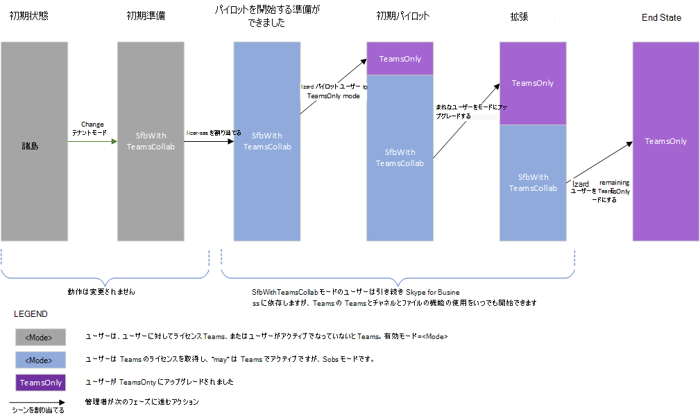

# <a name="upgrade-strategies-for-it-administrators"></a><span data-ttu-id="dbf74-103">IT 管理者向けアップグレード戦略</span><span class="sxs-lookup"><span data-stu-id="dbf74-103">Upgrade strategies for IT administrators</span></span>

<span data-ttu-id="dbf74-104"></span><span class="sxs-lookup"><span data-stu-id="dbf74-104"></span></span>

<span data-ttu-id="dbf74-105">この記事は、アプリケーションへのアップグレードを実装する IT 管理者向けTeamsをSkype for Business。</span><span class="sxs-lookup"><span data-stu-id="dbf74-105">This article is for IT administrators who want to implement their upgrade to Teams from Skype for Business.</span></span>

<span data-ttu-id="dbf74-106">アップグレードを実装する前に、アップグレードの重要な概念と共存動作について説明する次の記事をお勧めします。</span><span class="sxs-lookup"><span data-stu-id="dbf74-106">Before implementing your upgrade, we recommend the following articles which describe important upgrade concepts and coexistence behaviors:</span></span>

- [<span data-ttu-id="dbf74-107">Microsoft Teams と Skype for Business の共存と相互運用性を理解する</span><span class="sxs-lookup"><span data-stu-id="dbf74-107">Understand Microsoft Teams and Skype for Business coexistence and interoperability</span></span>](teams-and-skypeforbusiness-coexistence-and-interoperability.md)
- [<span data-ttu-id="dbf74-108">共存モード - リファレンス</span><span class="sxs-lookup"><span data-stu-id="dbf74-108">Coexistence modes - Reference</span></span>](migration-interop-guidance-for-teams-with-skype.md)
- [<span data-ttu-id="dbf74-109">Teams のクライアント エクスペリエンスおよび共存モードへの準拠</span><span class="sxs-lookup"><span data-stu-id="dbf74-109">Teams client experience and conformance to coexistence modes</span></span>](teams-client-experience-and-conformance-to-coexistence-modes.md)

## <a name="upgrade-options"></a><span data-ttu-id="dbf74-110">アップグレード方法</span><span class="sxs-lookup"><span data-stu-id="dbf74-110">Upgrade options</span></span>

<span data-ttu-id="dbf74-111">このセクションでは、次のいずれかのアップグレード オプションを使用してアップグレードを実装する方法について説明します。</span><span class="sxs-lookup"><span data-stu-id="dbf74-111">This section describes how to implement your upgrade by using one of the following upgrade options:</span></span>

- [<span data-ttu-id="dbf74-112">重複する機能のアップグレード (諸島モードを使用)</span><span class="sxs-lookup"><span data-stu-id="dbf74-112">Overlapping capabilities upgrade (using Islands mode)</span></span>](#overlapping-capabilities-upgrade-using-islands-mode)
- [<span data-ttu-id="dbf74-113">アプリケーションの使用をまだ開始していない組織の選択機能Teams</span><span class="sxs-lookup"><span data-stu-id="dbf74-113">A select capabilities upgrade for an organization that has not yet started using Teams</span></span>](#a-select-capabilities-upgrade-for-an-organization-that-has-not-yet-started-using-teams)
- [<span data-ttu-id="dbf74-114">諸島モードで既にアカウントを使用している組織のTeamsアップグレード</span><span class="sxs-lookup"><span data-stu-id="dbf74-114">A select capabilities upgrade for an organization that is already using Teams in Islands mode</span></span>](#a-select-capabilities-upgrade-for-an-organization-that-is-already-using-teams-in-islands-mode)

<span data-ttu-id="dbf74-115">オプションの詳細が必要な場合は、既に「Choose your upgrade [journey from](upgrade-and-coexistence-of-skypeforbusiness-and-teams.md)Skype for Business to Teams 」を参照してください。</span><span class="sxs-lookup"><span data-stu-id="dbf74-115">If you need more information about the options, make sure you have already read [Choose your upgrade journey from Skype for Business to Teams](upgrade-and-coexistence-of-skypeforbusiness-and-teams.md).</span></span>

## <a name="overlapping-capabilities-upgrade-using-islands-mode"></a><span data-ttu-id="dbf74-116">重複する機能のアップグレード (諸島モードを使用)</span><span class="sxs-lookup"><span data-stu-id="dbf74-116">Overlapping capabilities upgrade (using Islands mode)</span></span>

<span data-ttu-id="dbf74-117">重複する機能のアップグレード オプションの場合:</span><span class="sxs-lookup"><span data-stu-id="dbf74-117">For the overlapping capabilities upgrade option:</span></span>

- <span data-ttu-id="dbf74-118">組織全体の迅速なアップグレードを行うことができる場合は、このオプションを検討します。</span><span class="sxs-lookup"><span data-stu-id="dbf74-118">Consider this option if you can do a fast upgrade for your overall organization.</span></span>  <span data-ttu-id="dbf74-119">エンド ユーザーが両方のクライアントを実行すると混乱するリスクが生じる可能性があります。ユーザーが両方のクライアントを実行する必要がある期間を最小限に抑えるのが最善です。</span><span class="sxs-lookup"><span data-stu-id="dbf74-119">Since there is potential risk of confusion for end users with running both clients, it’s best if you can minimize the time period during which users must run both clients.</span></span> <span data-ttu-id="dbf74-120">管理者は、両方のクライアントを実行することをユーザーに周知する必要があります。</span><span class="sxs-lookup"><span data-stu-id="dbf74-120">You should ensure your users know to run both clients.</span></span>

- <span data-ttu-id="dbf74-121">このオプションは使用できないモデルであり、Microsoft 365 または Office 365 ライセンスを割り当てる以外は、Teams の使用を開始するために管理者の操作を必要とします。</span><span class="sxs-lookup"><span data-stu-id="dbf74-121">This option is the out-of-the box model, and doesn’t require administrator action to get started with Teams except to assign the Microsoft 365 or Office 365 license.</span></span> <span data-ttu-id="dbf74-122">ユーザーが既に Skype for Business Online を使用している場合は、このモデルを既に使用している可能性があります。</span><span class="sxs-lookup"><span data-stu-id="dbf74-122">If your users already have Skype for Business Online, you may already be in this model.</span></span>

- <span data-ttu-id="dbf74-123">重複する機能モードから抜け出して TeamsOnly に移行するのも困難な場合があります。</span><span class="sxs-lookup"><span data-stu-id="dbf74-123">It can be challenging getting out of overlapping capabilities mode and moving to TeamsOnly.</span></span> <span data-ttu-id="dbf74-124">アップグレード済みのユーザーは Teams でのみ通信するため、そのユーザーと通信する組織内の他のユーザーはすべて Teams を使用する必要があります。</span><span class="sxs-lookup"><span data-stu-id="dbf74-124">Because upgraded users only communicate via Teams, any other user in the organization communicating with that user must be using Teams.</span></span>  <span data-ttu-id="dbf74-125">Teams を使用し始めていないユーザーがいる場合、メッセージを受け取れない可能性が生じます。</span><span class="sxs-lookup"><span data-stu-id="dbf74-125">If you have users that have not started using Teams, they will be exposed to missing messages.</span></span> <span data-ttu-id="dbf74-126">さらに、そのようなユーザーには、オンラインの TeamsOnly ユーザーが Skype for Business に表示されません。</span><span class="sxs-lookup"><span data-stu-id="dbf74-126">Furthermore, they won’t see the TeamsOnly users online in Skype for Business.</span></span> <span data-ttu-id="dbf74-127">一部の組織では、これを回避するためにテナント 全体のグローバル ポリシーを使用してテナント全体のアップグレードを行います。ただし、これには、すべてのユーザーをアップグレードする準備が整うまで、先行計画と待機が必要です。</span><span class="sxs-lookup"><span data-stu-id="dbf74-127">Some organizations choose to do a tenant-wide upgrade using the Tenant global policy to avoid this, however that requires upfront planning as well as waiting until all users are ready to be upgraded.</span></span>


## <a name="a-select-capabilities-upgrade-for-an-organization-that-has-not-yet-started-using-teams"></a><span data-ttu-id="dbf74-128">アプリケーションの使用をまだ開始していない組織の選択機能Teams</span><span class="sxs-lookup"><span data-stu-id="dbf74-128">A select capabilities upgrade for an organization that has not yet started using Teams</span></span>

<span data-ttu-id="dbf74-129">Teams のアクティブなユーザーが 1 人もいない組織の場合、最初のステップとして、テナント全体に対する TeamsUpgradePolicy の既定のポリシーを、Skype for Business のモードの 1 つ (SfbWithTeamsCollab など) に設定します。</span><span class="sxs-lookup"><span data-stu-id="dbf74-129">If your organization does not yet have any active users in Teams, the first step is to set the default tenant-wide policy for TeamsUpgradePolicy to one of the Skype for Business modes, for example, SfbWithTeamsCollab.</span></span>  <span data-ttu-id="dbf74-130">Teams を使用し始めていないユーザーは、動作の違いに気付きません。</span><span class="sxs-lookup"><span data-stu-id="dbf74-130">Users who have not yet started using Teams won’t notice any difference in behavior.</span></span> <span data-ttu-id="dbf74-131">それでも、テナント レベルでこのポリシーを設定すると、TeamsOnly モードへのユーザーのアップグレードを開始でき、さらに、アップグレード済みユーザーはまだアップグレードしていないユーザーとの通信を行うことができます。</span><span class="sxs-lookup"><span data-stu-id="dbf74-131">However, setting this policy at the tenant level makes it possible to start upgrading users to TeamsOnly mode, and ensures that the upgraded users can still communicate with non-upgraded users.</span></span>  <span data-ttu-id="dbf74-132">パイロット ユーザーを特定したら、それらのユーザーを TeamsOnly にアップグレードできます。</span><span class="sxs-lookup"><span data-stu-id="dbf74-132">Once you have identified your pilot users you can upgrade them to TeamsOnly.</span></span>  <span data-ttu-id="dbf74-133">そのユーザーがオンプレミスの場合は、Move-CsUser を使用します。</span><span class="sxs-lookup"><span data-stu-id="dbf74-133">If they are on-premises, use Move-CsUser.</span></span> <span data-ttu-id="dbf74-134">オンラインの場合は、Grant-CsTeamsUpgradePolicy を使用して TeamsOnly モードを割り当てるだけで完了です。</span><span class="sxs-lookup"><span data-stu-id="dbf74-134">If they are online, simply assign them TeamsOnly mode by using Grant-CsTeamsUpgradePolicy.</span></span> <span data-ttu-id="dbf74-135">既定で、これらのユーザーによってスケジュールされている Skype for Business 会議は、Teams に移行されます。</span><span class="sxs-lookup"><span data-stu-id="dbf74-135">By default, any Skype for Business meetings scheduled by these users will be migrated to Teams.</span></span>

<span data-ttu-id="dbf74-136">主なコマンドを次に示します。</span><span class="sxs-lookup"><span data-stu-id="dbf74-136">Following are the key commands:</span></span>

1. <span data-ttu-id="dbf74-137">次のようにして、テナント全体の既定値をモードの SfbWithTeamsCollab に設定します。</span><span class="sxs-lookup"><span data-stu-id="dbf74-137">Set the tenant-wide default to mode SfbWithTeamsCollab as follows:</span></span>

   ```PowerShell
   Grant-CsTeamsUpgradePolicy -PolicyName SfbWithTeamsCollab -Global
   ```

2. <span data-ttu-id="dbf74-138">次のように、パイロット ユーザーを TeamsOnly にアップグレードします。</span><span class="sxs-lookup"><span data-stu-id="dbf74-138">Upgrade the pilot users to TeamsOnly as follows:</span></span>

   - <span data-ttu-id="dbf74-139">オンラインのユーザーの場合:</span><span class="sxs-lookup"><span data-stu-id="dbf74-139">For a user who is online:</span></span>

     ```PowerShell
     Grant-CsTeamsUpgradePolicy -PolicyName UpgradeToTeams -Identity $username 
     ```

   - <span data-ttu-id="dbf74-140">オンプレミスのユーザーの場合:</span><span class="sxs-lookup"><span data-stu-id="dbf74-140">For a user who is on-premises:</span></span>

     ```PowerShell
     Move-CsUser -identity $user -Target sipfed.online.lync.com -MoveToTeams -credential $cred 
     ```

<span data-ttu-id="dbf74-141">メモ</span><span class="sxs-lookup"><span data-stu-id="dbf74-141">Notes</span></span>
 
- <span data-ttu-id="dbf74-142">テナント全体のポリシーを SfbWithTeamsCollab に設定する代わりに、SfbWithTeamsCollabAndMeetings に設定することもできます。</span><span class="sxs-lookup"><span data-stu-id="dbf74-142">Instead of setting the tenant-wide policy to SfbWithTeamsCollab, you could set it to SfbWithTeamsCollabAndMeetings.</span></span> <span data-ttu-id="dbf74-143">そのようにすると、すべてのユーザーが新しい会議すべてを Teams でスケジュールするようになります。</span><span class="sxs-lookup"><span data-stu-id="dbf74-143">This causes all users to schedule all new meetings in Teams.</span></span>
- <span data-ttu-id="dbf74-144">`Move-CsUser` は、オンプレミスのツールのコマンドレットです。</span><span class="sxs-lookup"><span data-stu-id="dbf74-144">`Move-CsUser` is a cmdlet in the on-premises tools.</span></span> <span data-ttu-id="dbf74-145">この `MoveToTeams` スイッチには、CU8 以降Skype for Business Server 2019 Skype for Business Server 2015 以降が必要です。</span><span class="sxs-lookup"><span data-stu-id="dbf74-145">The `MoveToTeams` switch requires Skype for Business Server 2019 or Skype for Business Server 2015 with CU8 or later.</span></span> <span data-ttu-id="dbf74-146">以前のバージョンを使用している場合は、最初にユーザーを Skype for Business Online に移行してから、そのユーザーに TeamsOnly モードを付与できます。</span><span class="sxs-lookup"><span data-stu-id="dbf74-146">If you are using a prior version, you can first move the user to Skype for Business Online, and then grant TeamsOnly mode to that user.</span></span>
- <span data-ttu-id="dbf74-147">既定で、TeamsOnly モードへのアップグレードや SfbWithTeamsCollabAndMeetings モードの割り当てを実行すると、Skype for Business 会議は Teams に移行されます。</span><span class="sxs-lookup"><span data-stu-id="dbf74-147">By default, Skype for Business meetings are migrated to Teams when upgrading to TeamsOnly mode or when assigning SfbWithTeamsCollabAndMeetings mode.</span></span>  

> [!NOTE]
> <span data-ttu-id="dbf74-148">Skype for Business Online の提供が近日提供される予定で、Microsoft は近い将来、組織が Teamsに移行する方法を簡略化する予定です。</span><span class="sxs-lookup"><span data-stu-id="dbf74-148">In preparation for the upcoming retirement of Skype for Business Online, Microsoft will be simplifying how organizations move to Teams in the near future.</span></span> <span data-ttu-id="dbf74-149">ユーザーをオンプレミスから Teams に移行する場合、ユーザーをオンプレミスから `-MoveToTeams` TeamsOnly に直接移動する切り替えの指定は間もなく `Move-CsUser` 不要になります。</span><span class="sxs-lookup"><span data-stu-id="dbf74-149">When moving a user from on-premises to Teams, it will soon no longer be required to specify the `-MoveToTeams` switch in `Move-CsUser` to move users directly from on-premises to TeamsOnly.</span></span> <span data-ttu-id="dbf74-150">現在、このスイッチが指定されていない場合、ユーザーはオンプレミスの Skype for Business Server にホームから Skype for Business Online に移行し、モードは変更されません。</span><span class="sxs-lookup"><span data-stu-id="dbf74-150">Currently if this switch is not specified, users transition from being homed in Skype for Business Server on-premises to Skype for Business Online, and their mode remains unchanged.</span></span> <span data-ttu-id="dbf74-151">提供終了後に、 を使用してユーザーをオンプレミスからクラウドに移動すると、ユーザーには TeamsOnly モードが自動的に割り当てられます。また、スイッチが実際に指定されているかどうかに関係なく、オンプレミスからの会議は Teams 会議に自動的に変換されます。 `Move-CsUser` `-MoveToTeams switch had been specified`</span><span class="sxs-lookup"><span data-stu-id="dbf74-151">After retirement, when moving a user from on-premises to the cloud with `Move-CsUser`, users will automatically be assigned TeamsOnly mode and their meetings from on-premises will be automtically converted to Teams meetings, just as if the `-MoveToTeams switch had been specified`, regardless of whether the switch is actually specified.</span></span> <span data-ttu-id="dbf74-152">この機能は、2021 年 7 月 31 日の実際の提供が解除される前にリリースされる予定です。</span><span class="sxs-lookup"><span data-stu-id="dbf74-152">We expect to release this functionality before the actual retirement of July 31, 2021.</span></span>


<span data-ttu-id="dbf74-153">次の図は、組織の選択機能のアップグレードの概念的なフェーズを示しています。以前に使用Teams。</span><span class="sxs-lookup"><span data-stu-id="dbf74-153">The diagram below shows the conceptual phases of select capabilities upgrade for an organization with no prior usage of Teams.</span></span> <span data-ttu-id="dbf74-154">バーの高さは、ユーザー数を表します。</span><span class="sxs-lookup"><span data-stu-id="dbf74-154">The height of the bars represents number of users.</span></span> <span data-ttu-id="dbf74-155">アップグレードのどのフェーズでも、すべてのユーザーが相互に通信できます。</span><span class="sxs-lookup"><span data-stu-id="dbf74-155">During any phase of the upgrade, all users can communicate with each other.</span></span>  <span data-ttu-id="dbf74-156">Skype for Business ユーザーは TeamsOnly ユーザーと相互運用を使用して通信します。逆の場合も同様です。</span><span class="sxs-lookup"><span data-stu-id="dbf74-156">Skype for Business users communicate with TeamsOnly users using Interop, and vice versa.</span></span> <span data-ttu-id="dbf74-157">Islands モードのユーザーは、両方のクライアントを実行する必要があります。</span><span class="sxs-lookup"><span data-stu-id="dbf74-157">Users in Islands mode must be sure to run both clients.</span></span>




## <a name="a-select-capabilities-upgrade-for-an-organization-that-is-already-using-teams-in-islands-mode"></a><span data-ttu-id="dbf74-159">諸島モードで既にアカウントを使用している組織のTeamsアップグレード</span><span class="sxs-lookup"><span data-stu-id="dbf74-159">A select capabilities upgrade for an organization that is already using Teams in Islands mode</span></span>

<span data-ttu-id="dbf74-160">組織内の一部のユーザーが Teams をアイランド モードでアクティブに使用している場合、既存のユーザーから機能を削除することは望ましくない場合があります。</span><span class="sxs-lookup"><span data-stu-id="dbf74-160">If some users in your organization are actively using Teams in Islands mode, you probably do not want to remove functionality from existing users.</span></span> <span data-ttu-id="dbf74-161">その場合、テナント全体のポリシーを変更する前に、もう 1 つステップが必要になります。</span><span class="sxs-lookup"><span data-stu-id="dbf74-161">Therefore, an extra step is required before changing the tenant-wide policy.</span></span> <span data-ttu-id="dbf74-162">この問題の解決策は、テナント全体のポリシーを SfbWithTeamsCollab に設定する前に、既存のアクティブな Teams ユーザーをアイランド モードで grandfather 化することです。</span><span class="sxs-lookup"><span data-stu-id="dbf74-162">The solution is to “grandfather” these existing active Teams users into Islands mode, before setting the tenant-wide policy to SfbWithTeamsCollab.</span></span>  <span data-ttu-id="dbf74-163">これが完了したら、上述のように展開を実行できます。ただし、TeamsOnly に移行する 2 グループのユーザーが存在することになります。つまり、Teams でアクティブだったユーザーはアイランド モードになり、残りのユーザーは SfbWithTeamsCollab モードになります。</span><span class="sxs-lookup"><span data-stu-id="dbf74-163">Once you’ve done that, you can proceed with deployment as above, however, you’ll have two groups of users who are moving to TeamsOnly:  the users who were active in Teams will be in Islands mode, and the remaining users will be in SfbWithTeamsCollab mode.</span></span> <span data-ttu-id="dbf74-164">管理者は、これらのユーザーを TeamsOnly モードに段階的に移行できます。</span><span class="sxs-lookup"><span data-stu-id="dbf74-164">You can progressively move these users to TeamsOnly mode.</span></span>

1. <span data-ttu-id="dbf74-165">Teams でアクティブなユーザーを見つけるには、次のようにします。</span><span class="sxs-lookup"><span data-stu-id="dbf74-165">Find users who are active in Teams as follows:</span></span>

   1. <span data-ttu-id="dbf74-166">管理センター Microsoft 365左側のナビゲーションで、[レポート] に移動し、[使用状況] に移動します。</span><span class="sxs-lookup"><span data-stu-id="dbf74-166">From the Microsoft 365 admin center, in the left-hand navigation, go to Reports, and then Usage.</span></span> 
   2. <span data-ttu-id="dbf74-167">[レポートの選択] ドロップダウンで、[Microsoft Teams]、[ユーザー アクティビティ] の順に選択します。</span><span class="sxs-lookup"><span data-stu-id="dbf74-167">In the “Select a report” dropdown, choose Microsoft Teams, and then User Activity.</span></span> <span data-ttu-id="dbf74-168">このようにすると、Teams でアクティブになっているユーザーのエクスポート可能なテーブルが提供されます。</span><span class="sxs-lookup"><span data-stu-id="dbf74-168">This will provide an exportable table of users who have been active in Teams.</span></span> 
   3. <span data-ttu-id="dbf74-169">[エクスポート] をクリックして、Excel を開き、フィルタリングして、Teams でアクティブなユーザーのみを表示します。</span><span class="sxs-lookup"><span data-stu-id="dbf74-169">Click Export, open Excel, and filter to show only the users who are active in Teams.</span></span>

2. <span data-ttu-id="dbf74-170">ステップ 1 で見つかったアクティブな Teams ユーザーそれぞれに対して、リモート PowerShell でアイランド モードを割り当てます。</span><span class="sxs-lookup"><span data-stu-id="dbf74-170">For each active Teams user found in step 1, assign them Islands mode in remote PowerShell.</span></span> <span data-ttu-id="dbf74-171">これで次のステップに進むことができます。ユーザー エクスペリエンスは変更されません。</span><span class="sxs-lookup"><span data-stu-id="dbf74-171">This allows you to go to the next step, and ensures you don’t change the user experience.</span></span>  

   ```PowerShell
   $users=get-content “C:\MyPath\users.txt” 
    foreach ($user in $users){ 
    Grant-CsTeamsUpgradePolicy -identity $user -PolicyName Islands} 
   ```

3. <span data-ttu-id="dbf74-172">テナント全体のポリシーを SfbWithTeamsCollab に設定します。</span><span class="sxs-lookup"><span data-stu-id="dbf74-172">Set the tenant-wide policy to SfbWithTeamsCollab:</span></span>

   ```PowerShell
   Grant-CsTeamsUpgradePolicy -Global -PolicyName SfbWithTeamsCollab 
   ```

4. <span data-ttu-id="dbf74-173">選択したユーザーを TeamsOnly モードにアップグレードします。</span><span class="sxs-lookup"><span data-stu-id="dbf74-173">Upgrade selected users to TeamsOnly mode.</span></span> <span data-ttu-id="dbf74-174">ユーザーがアイランド モードの場合に生じる可能性のある混乱を最小限に抑えるため、アイランド モードのユーザーを優先的にまずアップグレードすることが望ましい場合もありますが、アイランド モードのユーザーと SfbWithTeamsCollab モードのユーザーのどちらをアップグレードするかは管理者が選択できます。</span><span class="sxs-lookup"><span data-stu-id="dbf74-174">You can choose to upgrade either users in Islands mode or SfbWithTeamsCollab mode, although you might want to prioritize upgrading the users in Islands mode first to minimize the potential for confusion that can arise when users are in Islands mode.</span></span>   

   <span data-ttu-id="dbf74-175">Skype for Business Online に所属しているユーザーの場合:</span><span class="sxs-lookup"><span data-stu-id="dbf74-175">For users homed in Skype for Business Online:</span></span>  

   ```PowerShell
   Grant-CsTeamsUpgradePolicy -Identity $user -PolicyName UpgradeToTeams 
   ```

   <span data-ttu-id="dbf74-176">Skype for Business Server オンプレミスに所属しているユーザーの場合:</span><span class="sxs-lookup"><span data-stu-id="dbf74-176">For users homed in Skype for Business Server on-premises:</span></span>  

   ```PowerShell
   Move-CsUser -Identity $user -Target sipfed.online.lync.com -MoveToTeams -credential $cred 
   ```

<span data-ttu-id="dbf74-177">次の図は、選択機能の移行の概念的なフェーズを示しています。この移行では、最初にアクティブな諸島のユーザーがいます。</span><span class="sxs-lookup"><span data-stu-id="dbf74-177">The diagram below shows the conceptual phases of a select capabilities transition in which there are active Islands users at the start.</span></span> <span data-ttu-id="dbf74-178">バーの高さは、ユーザー数を表します。</span><span class="sxs-lookup"><span data-stu-id="dbf74-178">The height of the bars represents the number of users.</span></span> <span data-ttu-id="dbf74-179">アップグレードのどのフェーズでも、すべてのユーザーが相互に通信できます。</span><span class="sxs-lookup"><span data-stu-id="dbf74-179">During any phase of the upgrade, all users can communicate with each other.</span></span>  <span data-ttu-id="dbf74-180">Skype for Business ユーザーは TeamsOnly ユーザーと相互運用を使用して通信します。逆の場合も同様です。</span><span class="sxs-lookup"><span data-stu-id="dbf74-180">Skype for Business users communicate with TeamsOnly users using interop, and vice versa.</span></span> 


   


## <a name="related-links"></a><span data-ttu-id="dbf74-182">関連リンク</span><span class="sxs-lookup"><span data-stu-id="dbf74-182">Related links</span></span>

[<span data-ttu-id="dbf74-183">Teams を Skype for Business と一緒に使用する組織向けの移行と相互運用に関するガイダンス</span><span class="sxs-lookup"><span data-stu-id="dbf74-183">Migration and interoperability guidance for organizations using Teams together with Skype for Business</span></span>](migration-interop-guidance-for-teams-with-skype.md) 

[<span data-ttu-id="dbf74-184">Skype for Business Server と Microsoft 365 または Office 365 間のハイブリッド接続を構成する</span><span class="sxs-lookup"><span data-stu-id="dbf74-184">Configure hybrid connectivity between Skype for Business Server and Microsoft 365 or Office 365</span></span>](/SkypeForBusiness/hybrid/configure-hybrid-connectivity)

[<span data-ttu-id="dbf74-185">オンプレミスとクラウドの間でユーザーを移動する</span><span class="sxs-lookup"><span data-stu-id="dbf74-185">Move users between on-premises and cloud</span></span>](/SkypeForBusiness/hybrid/move-users-between-on-premises-and-cloud)

[<span data-ttu-id="dbf74-186">共存およびアップグレードを設定する</span><span class="sxs-lookup"><span data-stu-id="dbf74-186">Setting your coexistence and upgrade settings</span></span>](setting-your-coexistence-and-upgrade-settings.md)

[<span data-ttu-id="dbf74-187">Grant-CsTeamsUpgradePolicy</span><span class="sxs-lookup"><span data-stu-id="dbf74-187">Grant-CsTeamsUpgradePolicy</span></span>](/powershell/module/skype/grant-csteamsupgradepolicy?view=skype-ps)

[<span data-ttu-id="dbf74-188">会議移行サービス (MMS) を使用する</span><span class="sxs-lookup"><span data-stu-id="dbf74-188">Using the Meeting Migration Service (MMS)</span></span>](/skypeforbusiness/audio-conferencing-in-office-365/setting-up-the-meeting-migration-service-mms)
