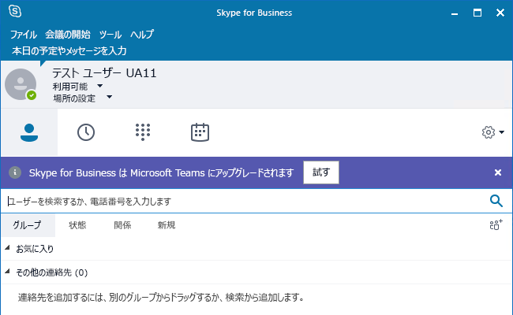
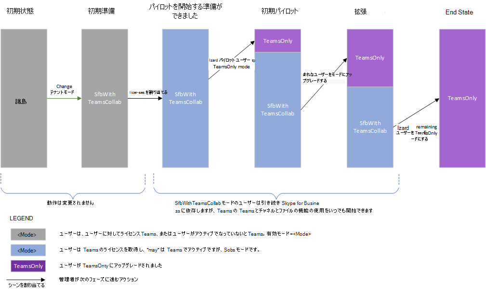
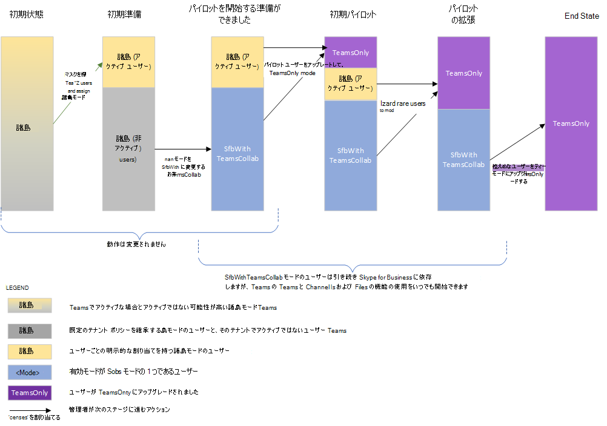
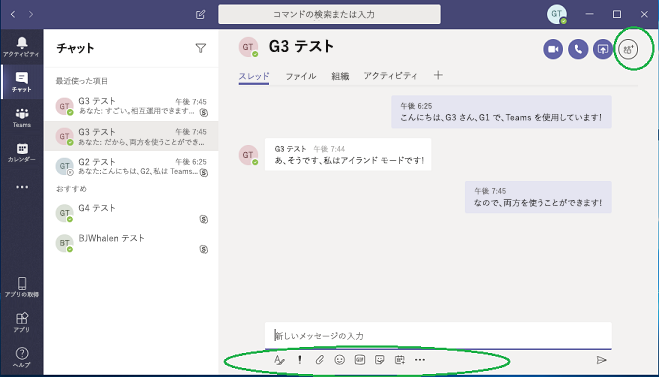
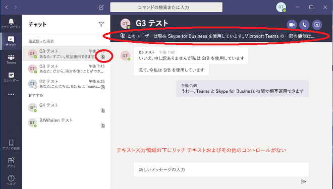
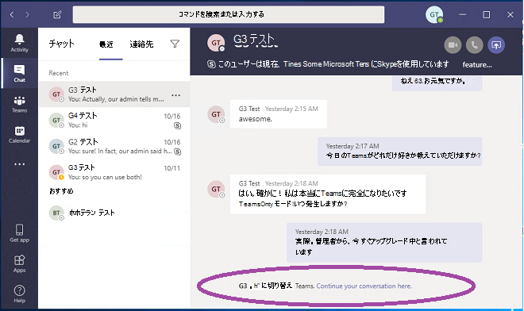

# <a name="upgrade-from-skype-for-business-to-teams-mdash-for-it-administrators"></a><span data-ttu-id="b3898-103">Skype for Business から Teams へのアップグレード &mdash; IT 管理者向け</span><span class="sxs-lookup"><span data-stu-id="b3898-103">Upgrade from Skype for Business to Teams &mdash; for IT administrators</span></span>

## <a name="overview"></a><span data-ttu-id="b3898-104">概要</span><span class="sxs-lookup"><span data-stu-id="b3898-104">Overview</span></span>

<span data-ttu-id="b3898-105">Skype for Business から Teams にアップグレードする場合、一部の組織では、その組織の IT 部門によって計画と管理が実施されるプログレッシブ ロールアウトが必要になります。</span><span class="sxs-lookup"><span data-stu-id="b3898-105">When upgrading from Skype for Business to Teams, some organizations require a progressive rollout that is planned and managed by their IT departments.</span></span> <span data-ttu-id="b3898-106">この記事は、大規模なオンプレミスの組織の IT 管理者を主に対象としていますが、一部の Skype for Business Online 組織にも適用されます。</span><span class="sxs-lookup"><span data-stu-id="b3898-106">This article is primarily targeted to IT administrators in large, on-premises organizations, but it might also apply to some Skype for Business Online organizations.</span></span>  <span data-ttu-id="b3898-107">この記事を読む前に、「[チームのアップグレードの](upgrade-start-here.md)概要」と「[アップグレードフレームワークについ](upgrade-framework.md)て」を参照してください。</span><span class="sxs-lookup"><span data-stu-id="b3898-107">Before reading this article, be sure to read [Getting started with your Teams Upgrade](upgrade-start-here.md) and [About the Upgrade framework](upgrade-framework.md).</span></span>

>[!NOTE]
><span data-ttu-id="b3898-108">この記事では、Skype for Business Online、Skype for Business オンプレミス、および Skype for Business という用語を使用します。</span><span class="sxs-lookup"><span data-stu-id="b3898-108">This article uses the terms Skype for Business Online, Skype for Business on-premises, and Skype for Business.</span></span>  <span data-ttu-id="b3898-109">最後の用語は、オンライン バージョンとオンプレミス バージョンの両方を指します。</span><span class="sxs-lookup"><span data-stu-id="b3898-109">The latter term refers to both online and on-premises versions.</span></span>

<span data-ttu-id="b3898-110">Teams に移行されたユーザーは、Skype for Business で開催される会議に参加する目的以外には Skype for Business クライアントを使用しません。</span><span class="sxs-lookup"><span data-stu-id="b3898-110">A user that has been migrated to Teams no longer uses a Skype for Business client except to join a meeting hosted in Skype for Business.</span></span>  <span data-ttu-id="b3898-111">着信したチャットや通話すべては、送信者が Teams と Skype for Business のいずれを使用しているかに関わらず、ユーザーの Teams クライアントに配信されます。</span><span class="sxs-lookup"><span data-stu-id="b3898-111">All incoming chats and calls land in the user’s Teams client, regardless of whether the sender uses Teams or Skype for Business.</span></span> <span data-ttu-id="b3898-112">移行済みユーザーによって開催される新しい会議は、Teams 会議としてスケジュールされます。</span><span class="sxs-lookup"><span data-stu-id="b3898-112">Any new meetings organized by the migrated user will be scheduled as Teams meetings.</span></span> <span data-ttu-id="b3898-113">ユーザーが Skype for Business クライアントを使用しようとすると、チャットと通話の開始がブロックされます。</span><span class="sxs-lookup"><span data-stu-id="b3898-113">If the user attempts to use the Skype for Business client, initiation of chats and calls is blocked.</span></span>  <span data-ttu-id="b3898-114">ただし、招待された会議に参加する場合は、ユーザーは Skype for Business クライアントを引き続き使用できます (使用する必要があります)。</span><span class="sxs-lookup"><span data-stu-id="b3898-114">However, the user can (and must) still use the Skype for Business client to join meetings they are invited to.</span></span> <span data-ttu-id="b3898-115">(2017 年より前に出荷された以前の Skype for Business クライアントでは、TeamsUpgradePolicy は優先されません。</span><span class="sxs-lookup"><span data-stu-id="b3898-115">(Older Skype for Business clients that shipped before 2017 do not honor TeamsUpgradePolicy.</span></span> <span data-ttu-id="b3898-116">最新の Skype for Business クライアントを使用していることをご確認ください)。</span><span class="sxs-lookup"><span data-stu-id="b3898-116">Make sure you are using the latest Skype for Business client.)</span></span>
 
<span data-ttu-id="b3898-117">管理者は、[TeamsUpgradePolicy](https://docs.microsoft.com/powershell/module/skype/grant-csteamsupgradepolicy?view=skype-ps) のプロパティである "[モード](migration-interop-guidance-for-teams-with-skype.md#coexistence-modes)" という概念を使用して Teams への移行を管理します。</span><span class="sxs-lookup"><span data-stu-id="b3898-117">Administrators manage their transition to Teams using the concept of [mode](migration-interop-guidance-for-teams-with-skype.md#coexistence-modes), which is a property of [TeamsUpgradePolicy](https://docs.microsoft.com/powershell/module/skype/grant-csteamsupgradepolicy?view=skype-ps).</span></span> <span data-ttu-id="b3898-118">上述の、Teams への移行が完了したユーザーは、TeamsOnly モードになります。</span><span class="sxs-lookup"><span data-stu-id="b3898-118">A user that has been migrated to Teams as described above is in “TeamsOnly” mode.</span></span>  <span data-ttu-id="b3898-119">Teams に移行する組織の最終的な目標は、すべてのユーザーを TeamsOnly モードに移行することです。</span><span class="sxs-lookup"><span data-stu-id="b3898-119">For an organization that is migrating to Teams, the ultimate goal is to move all users to TeamsOnly mode.</span></span>

<span data-ttu-id="b3898-120">Skype for Business (オンラインまたはオンプレミス) を使用する既存の組織を Teams に移行するには、次の 2 つの方式があります。</span><span class="sxs-lookup"><span data-stu-id="b3898-120">There are two methods for migrating an existing organization with Skype for Business (whether online or on-premises) to Teams:</span></span>

- <span data-ttu-id="b3898-121">**機能のオーバーラップ方法**(孤島モードを使用): 既存の Skype for business 組織のユーザーは、移行フェーズで両方のクライアントを使用できるように、チームに導入されています。</span><span class="sxs-lookup"><span data-stu-id="b3898-121">**Overlapping capabilities method** (using Islands mode):  Users in an existing Skype for Business organization are introduced to Teams so that they can use both clients during a transitional phase.</span></span> <span data-ttu-id="b3898-122">この期間中、これらのユーザーは Teams のほとんどの機能 (全部ではありません) を利用できます。</span><span class="sxs-lookup"><span data-stu-id="b3898-122">During this period, most--but not all--functionality of Teams is available to them.</span></span> <span data-ttu-id="b3898-123">この構成のモードは、"アイランド" と呼ばれ、これは Skype for Business を使用する既存の組織の既定のモードです。</span><span class="sxs-lookup"><span data-stu-id="b3898-123">The mode for this configuration is referred to as Islands, and this is the default mode for any existing organization with Skype for Business.</span></span> <span data-ttu-id="b3898-124">組織での準備が整ったら、管理者はユーザーを TeamsOnly モードに移行します。</span><span class="sxs-lookup"><span data-stu-id="b3898-124">Once the organization is ready, the administrator moves the users to TeamsOnly mode.</span></span>

- <span data-ttu-id="b3898-125">**選択的機能方式** (Skype for Business の 1つまたは複数のモードを使用): 管理者は、組織内のユーザーのためにチャット、通話、会議スケジュール機能の Skype for Business から Teams への移行を管理します。</span><span class="sxs-lookup"><span data-stu-id="b3898-125">**Select capabilities method** (using one or more of the Skype for Business modes): The administrator manages the transition (from Skype for Business to Teams) of chat, calling, and meeting scheduling functionality for users in their organization.</span></span>  <span data-ttu-id="b3898-126">これらの機能はいずれも、Skype for Business または Teams のいずれかで使用できますが、両方で使用することはできません。</span><span class="sxs-lookup"><span data-stu-id="b3898-126">Each of these functions is available either in Skype for Business or Teams, but not both.</span></span> <span data-ttu-id="b3898-127">管理者は、ユーザーのためにこの機能を Teams に移行するタイミングを制御するのに TeamsUpgradePolicy を使用します。</span><span class="sxs-lookup"><span data-stu-id="b3898-127">Administrators use TeamsUpgradePolicy to control when to shift this functionality to Teams for their users.</span></span> <span data-ttu-id="b3898-128">まだ TeamsOnly モードになっていないユーザーは、引き続き Skype for Business を使用してチャットと通話を行います。2 つのグループのユーザーは、相互運用機能を使用して通信できます。</span><span class="sxs-lookup"><span data-stu-id="b3898-128">Users who are not yet in TeamsOnly mode continue to use Skype for Business for chat and calling, and the two sets of users can communicate via interop functionality.</span></span> <span data-ttu-id="b3898-129">管理者は、段階的により多くのユーザーを Teams に移行させることにより、移行を管理します。</span><span class="sxs-lookup"><span data-stu-id="b3898-129">Administrators manage the transition by progressively migrating more users into TeamsOnly mode.</span></span>  

<span data-ttu-id="b3898-130">この記事では、お客様の組織に適した方式を選択していただく助けとして、両方の方式について概観し、それぞれの長所と短所を説明します。</span><span class="sxs-lookup"><span data-stu-id="b3898-130">This article helps you choose the right method for your organization by describing both methods and presenting the pros and cons of each.</span></span> 

## <a name="overlapping-capabilities-method-using-islands-mode"></a><span data-ttu-id="b3898-131">重複機能方式 (アイランド モードを使用)</span><span class="sxs-lookup"><span data-stu-id="b3898-131">Overlapping capabilities method (using Islands mode)</span></span>

<span data-ttu-id="b3898-132">重複機能方式の場合、チャット、VoIP 通話、および会議を行うために、ユーザーは Teams と Skype for Business クライアントの両方を使用できます。</span><span class="sxs-lookup"><span data-stu-id="b3898-132">With the overlapping capabilities method, users can use both Teams and Skype for Business clients for chat, VoIP calling, and meetings.</span></span> <span data-ttu-id="b3898-133">この状態は、"アイランド" モードと呼ばれます。これは、Skype for Business と Teams の通信トラフィックは (たとえ同一ユーザーのものであっても) 別々に保たれ、2 つの異なるクライアント同士が通信しないからです (同じ組織内のユーザーの場合)。</span><span class="sxs-lookup"><span data-stu-id="b3898-133">This state is referred to as “Islands” mode because the communication traffic for Skype for Business and Teams remains separate (even for the same user) and the two different clients never communicate with each other (for users within the same organization).</span></span> <span data-ttu-id="b3898-134">たとえば、受信者ユーザー A がアイランド モードであるとします。</span><span class="sxs-lookup"><span data-stu-id="b3898-134">For example, assume recipient User A is in Islands mode:</span></span>

- <span data-ttu-id="b3898-135">別のユーザーの Skype for Business クライアントから開始される通信は、常にユーザー A の Skype for Business クライアントに配信されます。</span><span class="sxs-lookup"><span data-stu-id="b3898-135">Communication initiated from another user’s Skype for Business client will always land in User A’s Skype for Business client.</span></span>
- <span data-ttu-id="b3898-136">別のユーザーの Teams クライアントから開始される通信は、*そのユーザーが同じ組織内に存在する場合*、常にユーザー A の Teams クライアントに配信されます。</span><span class="sxs-lookup"><span data-stu-id="b3898-136">Communication initiated from another user’s Teams client will always land in User A’s Teams client, *if the other user is in the same organization*.</span></span> 
- <span data-ttu-id="b3898-137">別のユーザーの Teams クライアントから開始される通信は、*そのユーザーがフェデレーション組織内に存在する場合*、常にユーザー A の Skype for Business クライアントに配信されます。</span><span class="sxs-lookup"><span data-stu-id="b3898-137">Communication initiated from another user’s Teams client will always land in User A’s Skype for Business client, *if the other user is in a federated organization*.</span></span>

<span data-ttu-id="b3898-138">アイランド モードは、まだ TeamsOnly ではないすべての既存の組織に対する TeamsUpgradePolicy の既定モードです。</span><span class="sxs-lookup"><span data-stu-id="b3898-138">Islands mode is the default mode of TeamsUpgradePolicy for any existing organization that is not yet TeamsOnly.</span></span> <span data-ttu-id="b3898-139">Office 365 ライセンスを割り当てると、Teams と Skype for Business Online の両方のライセンスが既定で割り当てられます。</span><span class="sxs-lookup"><span data-stu-id="b3898-139">When you assign an Office 365 license, both Teams and Skype for Business Online licenses are assigned by default.</span></span> <span data-ttu-id="b3898-140">(これは、ユーザーが Skype for Business Server でオンプレミスに所属している場合でも同じです。</span><span class="sxs-lookup"><span data-stu-id="b3898-140">(This is true even if the user is homed on-premises in Skype for Business Server.</span></span> <span data-ttu-id="b3898-141">ユーザーの所属がオンプレミスとオンラインのいずれであっても、Teams の機能をすべて使用するには Skype for Business Online が現状では必要なため、Skype for Business Online のライセンスを有効にしたままにします)。実際、既定の構成を変更する手順をまだ何も実行していない段階でも、ユーザーは自分の組織で Teams をかなりの程度使用できます。</span><span class="sxs-lookup"><span data-stu-id="b3898-141">Whether the user is homed on-premises or online, leave the Skype for Business Online license enabled, because it is currently needed for full Teams functionality.) In fact, if you have not taken any steps to change the default configuration, you may already have significant usage of Teams in your organization.</span></span>  <span data-ttu-id="b3898-142">これは、機能のオーバーラップ方法の1つです。</span><span class="sxs-lookup"><span data-stu-id="b3898-142">This is one of the benefits of the overlapping capabilities approach.</span></span> <span data-ttu-id="b3898-143">この方式を採用すると、迅速かつエンドユーザー主導の導入を組織内で実現できます。</span><span class="sxs-lookup"><span data-stu-id="b3898-143">It allows for rapid, end-user driven adoption within an organization.</span></span>

<span data-ttu-id="b3898-144">この方式が効果をもたらすには、すべてのユーザーが両方のクライアントを同時に実行している必要があります。</span><span class="sxs-lookup"><span data-stu-id="b3898-144">For this method to work effectively, it requires all users to run both clients simultaneously.</span></span> <span data-ttu-id="b3898-145">組織内から着信したアイランド モードのユーザー宛てのチャットと通話は、Skype for Business クライアントと Teams クライアントのいずれにも配信される可能性があり、受信者はこれを制御できません。</span><span class="sxs-lookup"><span data-stu-id="b3898-145">Incoming chats and calls from within the organization to a user in Islands mode can land in either the Skype for Business or Teams client--and this is not under the control of the recipient.</span></span> <span data-ttu-id="b3898-146">これは、送信者が通信を開始するために使用するクライアントにより左右されます。</span><span class="sxs-lookup"><span data-stu-id="b3898-146">It depends on what client the sender uses to initiate the communication.</span></span> <span data-ttu-id="b3898-147">送信者と受信者の組織が異なる場合、アイランド モードのユーザー宛ての着信チャットと通話は、常に Skype for Business クライアントに配信されます。</span><span class="sxs-lookup"><span data-stu-id="b3898-147">If the sender and recipient are in different organizations, incoming calls and chats to a user in Islands mode always land in the Skype for Business client.</span></span>  

<span data-ttu-id="b3898-148">たとえば、アイランド モードの受信者が Skype for Business は実行しているものの、Teams は実行していない場合、他のユーザーが Teams からメッセージを送信すると、メッセージはそのアイランド モードの受信者には表示されません (ただし、Teams で受け取れなかったメッセージがあることを伝えるメールが後から受信者に送信されます)。</span><span class="sxs-lookup"><span data-stu-id="b3898-148">For example, if an Islands mode recipient is running Skype for Business but not Teams, and someone messages them from Teams, the Islands mode recipient will not see the message (but they will eventually get an email saying they missed a message in Teams).</span></span> <span data-ttu-id="b3898-149">同様に、ユーザーが Skype for Business を実行し、Teams を実行していない場合、他のユーザーが Skype for Business からそのユーザー宛てにメッセージを送信すると、チャットはそのユーザーに表示されません。</span><span class="sxs-lookup"><span data-stu-id="b3898-149">Likewise, if a user is running Teams but not Skype for Business, and someone messages that user from Skype for Business, the user will not see that chat.</span></span>  <span data-ttu-id="b3898-150">そのユーザーには、受け取れなかったメッセージがあることを通知するメールが送信されます。</span><span class="sxs-lookup"><span data-stu-id="b3898-150">They will get an email saying there was a missed message.</span></span> <span data-ttu-id="b3898-151">これらのシナリオでの動作は、通話の場合も同様です。</span><span class="sxs-lookup"><span data-stu-id="b3898-151">The behavior in each of these cases is similar for calling.</span></span> <span data-ttu-id="b3898-152">ユーザーがどちらかのクライアントを実行していない場合、フラストレーションが生じる可能性があります。</span><span class="sxs-lookup"><span data-stu-id="b3898-152">If users do not run both clients, it can easily lead to frustration.</span></span>

<span data-ttu-id="b3898-153">ユーザー A がアイランド モードの場合、ユーザー A のプレゼンスは、他のユーザーからは Teams と Skype for Business とで別のものとして認識されます。</span><span class="sxs-lookup"><span data-stu-id="b3898-153">When User A is in Islands mode, User A’s presence as seen by other users in Teams and in Skype for Business is independent:</span></span>

- <span data-ttu-id="b3898-154">他のユーザーが Teams を使用している場合、ユーザー A の Teams でのアクティビティに基づくプレゼンスが表示されます。</span><span class="sxs-lookup"><span data-stu-id="b3898-154">Other users, when using Teams, will see presence based on User A’s activity in Teams.</span></span> 
- <span data-ttu-id="b3898-155">他のユーザーが Skype for Business を使用している場合、ユーザー A の Skype for Business でのアクティビティに基づくプレゼンスが表示されます。</span><span class="sxs-lookup"><span data-stu-id="b3898-155">Other users, when using Skype for Business, will see presence based on User A’s activity in Skype for Business.</span></span> 

<span data-ttu-id="b3898-156">つまり、他のユーザーには、使用しているクライアントによって、ユーザー A の異なるプレゼンス状態が表示される可能性があります。</span><span class="sxs-lookup"><span data-stu-id="b3898-156">This means other users may see different presence states for User A, depending on which client they use.</span></span> <span data-ttu-id="b3898-157">詳細については、「[プレゼンス](#presence)」を参照してください。</span><span class="sxs-lookup"><span data-stu-id="b3898-157">For more details, see [Presence](#presence).</span></span>

<span data-ttu-id="b3898-158">ユーザーを TeamsOnly モードにアップグレードする準備ができたら、ユーザーを個別にアップグレードすることも、テナント全体のポリシーを使用してテナント全体を一度にアップグレードすることもできます。</span><span class="sxs-lookup"><span data-stu-id="b3898-158">Once you are ready to upgrade users to TeamsOnly mode, you can upgrade users individually or you can upgrade the entire tenant at once using the tenant-wide policy.</span></span> <span data-ttu-id="b3898-159">ユーザーが TeamsOnly モードにアップグレードされると、そのユーザーは着信したすべてのチャットと通話を Teams で受け取ります。</span><span class="sxs-lookup"><span data-stu-id="b3898-159">Once a user is upgraded to TeamsOnly mode, they receive all incoming chats and calls in Teams.</span></span> <span data-ttu-id="b3898-160">(Skype for Business 会議から Teams 会議への移行は、個別のユーザーに TeamsUpgradePolicy を適用した場合にのみトリガーされます。テナント単位に適用してもトリガーされません。</span><span class="sxs-lookup"><span data-stu-id="b3898-160">(Note that migration of Skype for Business meetings to Teams meetings is only triggered when applying TeamsUpgradePolicy to individual users, not on a per tenant basis.</span></span> <span data-ttu-id="b3898-161">詳細については、「[会議の移行](#meeting-migration)」を参照してください)。</span><span class="sxs-lookup"><span data-stu-id="b3898-161">See [Meeting Migration](#meeting-migration) for details.)</span></span>

<span data-ttu-id="b3898-162">ただし、アイランド モードに設定されているアップグレード済みでない受信者の場合、TeamsOnly ユーザーからのチャットと通話は、引き続き Skype for Business クライアントまたは Teams クライアントのいずれでも受信できます。</span><span class="sxs-lookup"><span data-stu-id="b3898-162">However, non-upgraded recipients in Islands mode may continue to receive chats and calls from a TeamsOnly user in either their Skype for Business or Teams clients.</span></span>  <span data-ttu-id="b3898-163">これは、Teams クライアントでは、"Teams から Teams" の通信と "Teams から Skype for Business" の通信について、たとえ同一のユーザーのものであっても、個別の会話スレッドが維持されることによります。</span><span class="sxs-lookup"><span data-stu-id="b3898-163">This is because the Teams client maintains separate conversation threads for Teams-to-Teams and Teams-to-Skype for Business communication, even for the same user.</span></span>  <span data-ttu-id="b3898-164">(「[Teams の会話 - 相互運用スレッドとネイティブ スレッド](#teams-conversations---interop-versus-native-threads)」を参照してください)。たとえば、アイランド ユーザー A が Teams を使用して TeamsOnly ユーザー B にメッセージを送信するとします。ユーザー B がそのチャットに返信すると、その通信はユーザー A の Teams クライアントに配信されます。</span><span class="sxs-lookup"><span data-stu-id="b3898-164">(See [Teams Conversations - Interop versus native threads](#teams-conversations---interop-versus-native-threads).)  For example, assume Islands User A uses Teams to message TeamsOnly User B. When User B replies to that chat, the communication will land in User A’s Teams client.</span></span> <span data-ttu-id="b3898-165">今度は、ユーザー A が自分の Skype for Business クライアントを使用して TeamsOnly ユーザー B にメッセージを送信するとします。ユーザー B は Teams でそのチャットを受信しますが、このメッセージは、もう 1 つの会話と比べて、ユーザー B の Teams クライアントでは別個の会話になります。</span><span class="sxs-lookup"><span data-stu-id="b3898-165">Now assume User A uses his Skype for Business client to message TeamsOnly User B. User B will receive the chat in Teams, but this will be a separate conversation in User B's Teams client compared to the other conversation.</span></span> <span data-ttu-id="b3898-166">ユーザー B がユーザー A とのこの会話に返信すると、その返信はユーザー A の Skype for Business クライアントに配信されます。</span><span class="sxs-lookup"><span data-stu-id="b3898-166">If User B replies to this conversation with User A, it will land in User A’s Skype for Business client.</span></span> 

<span data-ttu-id="b3898-167">次の表に、アイランド モードと TeamsOnly モードの両方について Teams エクスペリエンスをまとめて示します。</span><span class="sxs-lookup"><span data-stu-id="b3898-167">The following table summarizes the Teams experience for both Islands mode and TeamsOnly mode:</span></span>  

| <span data-ttu-id="b3898-168">Teams エクスペリエンス</span><span class="sxs-lookup"><span data-stu-id="b3898-168">Teams experience</span></span> | <span data-ttu-id="b3898-169">アイランド モードの場合</span><span class="sxs-lookup"><span data-stu-id="b3898-169">In Islands mode</span></span> | <span data-ttu-id="b3898-170">TeamsOnly モードの場合</span><span class="sxs-lookup"><span data-stu-id="b3898-170">In TeamsOnly mode</span></span> |
|:------------------ | :------------------- | :------------------ |
| <span data-ttu-id="b3898-171">着信したチャットと通話の配信先:</span><span class="sxs-lookup"><span data-stu-id="b3898-171">Incoming chats and calls received in:</span></span>|  <span data-ttu-id="b3898-172">Teams または Skype for Business</span><span class="sxs-lookup"><span data-stu-id="b3898-172">Teams or Skype for Business</span></span> | <span data-ttu-id="b3898-173">Teams</span><span class="sxs-lookup"><span data-stu-id="b3898-173">Teams</span></span> |
| <span data-ttu-id="b3898-174">PSTN 通話の配信先:</span><span class="sxs-lookup"><span data-stu-id="b3898-174">PSTN calls received in:</span></span> | <span data-ttu-id="b3898-175">Skype for Business</span><span class="sxs-lookup"><span data-stu-id="b3898-175">Skype for Business</span></span> <br><span data-ttu-id="b3898-176">(Teams での PSTN 機能の使用は、アイランド モードではサポートされていません)。</span><span class="sxs-lookup"><span data-stu-id="b3898-176">(Using PSTN functionality in Teams is not supported in Islands mode.)</span></span>    | <span data-ttu-id="b3898-177">Teams</span><span class="sxs-lookup"><span data-stu-id="b3898-177">Teams</span></span> |   
 |<span data-ttu-id="b3898-178">プレゼンス</span><span class="sxs-lookup"><span data-stu-id="b3898-178">Presence</span></span>  | <span data-ttu-id="b3898-179">Skype for Business と Teams のプレゼンスは独立しています。</span><span class="sxs-lookup"><span data-stu-id="b3898-179">Presence in Skype for Business and Teams is independent.</span></span> <span data-ttu-id="b3898-180">他のユーザーが使用するクライアントによって、同一のアイランド ユーザーであっても異なる状態が表示される可能性があります。</span><span class="sxs-lookup"><span data-stu-id="b3898-180">Users may see different states for the same Islands user, depending on which client they use.</span></span> | <span data-ttu-id="b3898-181">プレゼンスは、Teams でのユーザーのアクティビティにのみに基づきます。</span><span class="sxs-lookup"><span data-stu-id="b3898-181">Presence is based solely on the user’s activity in Teams.</span></span> <span data-ttu-id="b3898-182">他のすべてのユーザーには、使用するクライアントに関係なく、そのプレゼンスが表示されます。</span><span class="sxs-lookup"><span data-stu-id="b3898-182">All other users, regardless of which client they use, see that presence.</span></span> | 
 | <span data-ttu-id="b3898-183">会議のスケジュール</span><span class="sxs-lookup"><span data-stu-id="b3898-183">Meeting Scheduling</span></span>   | <span data-ttu-id="b3898-184">ユーザーは、Teams または Skype for Business のいずれでも会議をスケジュールできます。</span><span class="sxs-lookup"><span data-stu-id="b3898-184">Users can schedule meetings in either Teams or Skype for Business.</span></span> <span data-ttu-id="b3898-185">ユーザーの Outlook には両方のアドインが表示されます。</span><span class="sxs-lookup"><span data-stu-id="b3898-185">They will see both add-ins in Outlook.</span></span> |   <span data-ttu-id="b3898-186">会議のスケジュールは、Teams のみで行います。</span><span class="sxs-lookup"><span data-stu-id="b3898-186">Users only schedule meetings in Teams.</span></span> <span data-ttu-id="b3898-187">Outlook では、Teams アドインのみを使用できます。</span><span class="sxs-lookup"><span data-stu-id="b3898-187">Only the Teams add-in is available in Outlook.</span></span> | 

<span data-ttu-id="b3898-188">次の表は、組織を Teams へ移行させるために重複機能方式を使用する場合のメリットとデメリットをまとめたものです。</span><span class="sxs-lookup"><span data-stu-id="b3898-188">The following table summarizes the pros and cons of using the overlapping capabilities method to migrate your organization to Teams.</span></span>

| <span data-ttu-id="b3898-189">メリット</span><span class="sxs-lookup"><span data-stu-id="b3898-189">Pros</span></span>     |       <span data-ttu-id="b3898-190">デメリット</span><span class="sxs-lookup"><span data-stu-id="b3898-190">Cons</span></span> |
| :------------------ | :---------------- |
| <span data-ttu-id="b3898-191">組織内での迅速な導入が可能になります。</span><span class="sxs-lookup"><span data-stu-id="b3898-191">Allows for rapid adoption within an organization.</span></span>| <span data-ttu-id="b3898-192">この 2 つのクライアントの機能は似通っている一方、ユーザー インターフェイスが異なるため、エンド ユーザーが混乱する可能性があります。</span><span class="sxs-lookup"><span data-stu-id="b3898-192">Potential for end user confusion because there are two clients with similar functionality, but different user interfaces.</span></span> <span data-ttu-id="b3898-193">また、着信したチャットや通話の配信先クライアントをユーザーは制御できません。</span><span class="sxs-lookup"><span data-stu-id="b3898-193">Also, they have no control over which client the incoming chats/calls land in.</span></span> |
| <span data-ttu-id="b3898-194">Skype for Business へアクセスを 100% 維持しつつ、Teams の学習と理解を深めることができます。</span><span class="sxs-lookup"><span data-stu-id="b3898-194">Allows users to learn and get familiar with Teams while still having full access to Skype for Business.</span></span> | <span data-ttu-id="b3898-195">ユーザーが両方のクライアントを実行していない場合、受け取れなかったメッセージが原因でエンド ユーザーが不満に感じる可能性があります。</span><span class="sxs-lookup"><span data-stu-id="b3898-195">Potential for end user dissatisfaction due to missed messages if the user is not running both clients.</span></span> <span data-ttu-id="b3898-196">メッセージが届かないという苦情がユーザーから寄せられる可能性があります。</span><span class="sxs-lookup"><span data-stu-id="b3898-196">Users may complain that they are not receiving messages.</span></span>|
| <span data-ttu-id="b3898-197">最小限の管理作業で Teams の使用を開始できます。</span><span class="sxs-lookup"><span data-stu-id="b3898-197">Minimal administration effort to get started in Teams.</span></span> | <span data-ttu-id="b3898-198">組織内のすべてのユーザーが Teams を使用していない場合、特に、すべてのユーザーが Teams でアクティブではない場合は、アイランド モードから TeamsOnly モードに移行するのが困難な場合があります。</span><span class="sxs-lookup"><span data-stu-id="b3898-198">Can be challenging to “get out of Islands” mode and move to TeamsOnly mode if not everyone in the organization is using Teams, especially if not all users are active in Teams.</span></span> <span data-ttu-id="b3898-199">たとえば、ユーザーの一部が TeamsOnly モードにアップグレードされると、それらのユーザーは Teams でのみ送信します。</span><span class="sxs-lookup"><span data-stu-id="b3898-199">For example, once a subset of users is upgraded to TeamsOnly mode, those users will only send in Teams.</span></span> <span data-ttu-id="b3898-200">アイランド モードの他のユーザーには、それらのメッセージは常に Teams に配信されます。</span><span class="sxs-lookup"><span data-stu-id="b3898-200">For the rest of the population in Islands mode, those messages will always land in Teams.</span></span> <span data-ttu-id="b3898-201">しかし、ユーザーの一部が Teams を実行していない場合、それらのメッセージは受け取れていないものとして認識されます。</span><span class="sxs-lookup"><span data-stu-id="b3898-201">But if some of that population is not running Teams, they will perceive these messages as missed.</span></span> |
|  | <span data-ttu-id="b3898-202">Teams を使用する場合、Skype for Business Server のオンプレミス アカウントを持つユーザーには、相互運用性やフェデレーションのサポートはありません。</span><span class="sxs-lookup"><span data-stu-id="b3898-202">When using Teams, users who have an on-premises account in Skype for Business Server do not have interop or federation support.</span></span>  <span data-ttu-id="b3898-203">このため、アイランド ユーザーの中に Skype for Business Online に所属しているユーザーと Skype for Business オンプレミスに所属しているユーザーが混在している場合、混乱を生じる可能性があります。</span><span class="sxs-lookup"><span data-stu-id="b3898-203">This can potentially create confusion if you have a mix of Islands users--some who are homed in Skype for Business Online and some in Skype for Business on-premises.</span></span>   |

## <a name="select-capabilities-method-using-skype-for-business-modes"></a><span data-ttu-id="b3898-204">選択的機能方式 (Skype for Business の各モードを使用)</span><span class="sxs-lookup"><span data-stu-id="b3898-204">Select capabilities method (using Skype for Business modes)</span></span>

<span data-ttu-id="b3898-205">一部の組織では、組織を Skype for Business から Teams に移行する際に、シンプルで予測がより容易なエクスペリエンスをエンド ユーザーに提供することを優先する場合があります。</span><span class="sxs-lookup"><span data-stu-id="b3898-205">Some organizations may prefer to provide their end users a simpler, more predictable experience as their organization transitions from Skype for Business to Teams.</span></span> <span data-ttu-id="b3898-206">このモデルでは、IT 管理者は TeamsUpgradePolicy 内の Skype for Business モードのいずれかを使用して、TeamsOnly モードに移行する前に Skype for Business に残るユーザーを明示的に指定します。</span><span class="sxs-lookup"><span data-stu-id="b3898-206">In this model, IT administrators use one of the Skype for Business modes in TeamsUpgradePolicy to explicitly designate which users remain in Skype for Business prior to migrating to TeamsOnly mode.</span></span> <span data-ttu-id="b3898-207">管理者は、選択したユーザーを TeamsOnly モードに移行する準備ができたら、これらのユーザーのモードを TeamsOnly に更新します。</span><span class="sxs-lookup"><span data-stu-id="b3898-207">As they are ready to shift selected users to TeamsOnly mode, the administrator updates the mode for those users to TeamsOnly.</span></span> <span data-ttu-id="b3898-208">展開が進行するにつれて、Skype for Business から TeamsOnly モードへと徐々にユーザーが移行されます。</span><span class="sxs-lookup"><span data-stu-id="b3898-208">As the deployment progresses, more and more users are transitioned from Skype for Business to TeamsOnly mode.</span></span>  <span data-ttu-id="b3898-209">この移行中の動作は次のようになります。</span><span class="sxs-lookup"><span data-stu-id="b3898-209">During this transition:</span></span>

- <span data-ttu-id="b3898-210">Skype for Business をまだ使用しているユーザーの場合、通信の発信元が相手側ユーザーの Teams クライアントであっても Skype for Business クライアントであっても、着信したすべてのチャットと通話は Skype for Business クライアントで受け取ります。</span><span class="sxs-lookup"><span data-stu-id="b3898-210">Users still on Skype for Business receive all incoming chats and calls in their Skype for Business client, regardless of whether the communication originated from the other user’s Teams or Skype for Business client.</span></span> <span data-ttu-id="b3898-211">また、これらの Skype for Business ユーザーに対しては、エンド ユーザーの混乱を防ぎ、適切なルーティングを確保するために、Teams クライアントでの通話とチャットの機能は無効になっています。</span><span class="sxs-lookup"><span data-stu-id="b3898-211">In addition, for these Skype for Business users, calling and chat functionality in the Teams client are disabled to help prevent end user confusion and to ensure proper routing.</span></span> 

- <span data-ttu-id="b3898-212">通信の発信元が Teams、Skype for Business、またはいかなる種類のフェデレーション ユーザーであった場合も、TeamsOnly モードのユーザーは着信したすべてのチャットと通話を Teams クライアントで受信します。</span><span class="sxs-lookup"><span data-stu-id="b3898-212">Users in TeamsOnly mode receive all incoming chats and calls in their Teams client, regardless of where the communication originated from:  Teams, Skype for Business, or any kind of federated user.</span></span> 

<span data-ttu-id="b3898-213">孤島メソッドとは異なり、select capabilities メソッドでは、Skype for Business のユーザーとチームが互いに連絡を取ることができます。</span><span class="sxs-lookup"><span data-stu-id="b3898-213">Unlike the Islands method, in the select capabilities method, Skype for Business users and TeamsOnly users can communicate with each other.</span></span> <span data-ttu-id="b3898-214">Skype for Business ユーザーと Teams ユーザーの間の通信は、相互運用性と呼ばれます。</span><span class="sxs-lookup"><span data-stu-id="b3898-214">Communication between a Skype for Business user and Teams user is known as interoperability or “interop”.</span></span> <span data-ttu-id="b3898-215">(「[相互運用性](#interoperability)」を参照)。相互運用通信は、Skype for Business のユーザーと Teams の別のユーザーとの間の 1 対 1 ベースのチャットと通話で利用できます。</span><span class="sxs-lookup"><span data-stu-id="b3898-215">(See [Interoperability](#interoperability).) Interop communication is possible on a one-to-one basis for chats and calls between a user in Skype for Business and another user in Teams.</span></span> <span data-ttu-id="b3898-216">また、招待されたユーザーはいつでも Skype for Business 会議または Teams 会議に参加できますが、会議の種類に対応するクライアントを使用する必要があります。</span><span class="sxs-lookup"><span data-stu-id="b3898-216">In addition, invited users can always join either a Skype for Business or Teams meeting, however, they must use a client that corresponds to the type of meeting.</span></span> <span data-ttu-id="b3898-217">詳細については、「[会議](#meetings)」を参照してください。</span><span class="sxs-lookup"><span data-stu-id="b3898-217">For more information, see [Meetings](#meetings).</span></span>

<span data-ttu-id="b3898-218">選択機能移行のユーザーは、通常は島々のモードではないため、ユーザーのプレゼンスは、他のユーザーがどのクライアントを使用しているかに関係なく一貫しています。</span><span class="sxs-lookup"><span data-stu-id="b3898-218">Because users in a select capabilities transition are typically not in Islands mode, presence for a user is consistent regardless of which client is used by the other user.</span></span> <span data-ttu-id="b3898-219">ユーザーが Skype for Business モードのいずれかのモードに設定されている場合、他のすべてのユーザーに表示されるプレゼンスは、そのユーザーの Skype for Business でのアクティビティに基づきます。</span><span class="sxs-lookup"><span data-stu-id="b3898-219">If the user is in one of the Skype for Business modes, all other users see presence based on that user’s activity in Skype for Business.</span></span> <span data-ttu-id="b3898-220">同様に、ユーザーが TeamsOnly モードの場合は、他のすべてのユーザーに表示されるプレゼンスは、そのユーザーの Teams でのアクティビティに基づきます。</span><span class="sxs-lookup"><span data-stu-id="b3898-220">Similarly, if a user is in TeamsOnly mode, all other users see presence based on that user’s activity in Teams.</span></span> <span data-ttu-id="b3898-221">詳細については、「[プレゼンス](#presence)」を参照してください。</span><span class="sxs-lookup"><span data-stu-id="b3898-221">For details, see [Presence](#presence).</span></span>

<span data-ttu-id="b3898-222">まだ Teams を使用し始めていない組織の場合、管理者はテナント全体のモードをアイランドから SfbWithTeamsCollab に変更する必要があります。</span><span class="sxs-lookup"><span data-stu-id="b3898-222">For an organization that has not yet started using Teams, the administrator should change the tenant-wide mode from Islands to SfbWithTeamsCollab.</span></span> <span data-ttu-id="b3898-223">(既に Teams を部分的に使用している組織の場合は、管理者は Teams でアクティブなユーザーを grandfather 化することにより、この変更がそれらのユーザーに適用されないようにする必要があります。</span><span class="sxs-lookup"><span data-stu-id="b3898-223">(For organizations that already have some Teams usage, the administrator should “grandfather” users already active in Teams to ensure this change does not apply to them.</span></span> <span data-ttu-id="b3898-224">詳細について[は、「アイランドモードで Teams を既に使用している組織の select 機能のアップグレード](#a-select-capabilities-upgrade-for-an-organization-that-is-already-using-teams-in-islands-mode)」を参照してください。)</span><span class="sxs-lookup"><span data-stu-id="b3898-224">For details, see [A select capabilities upgrade for an organization that is already using Teams in Islands mode](#a-select-capabilities-upgrade-for-an-organization-that-is-already-using-teams-in-islands-mode).)</span></span>

<span data-ttu-id="b3898-225">モードがアイランドから SfbWithTeamsCollab に変わっても、Teams を一度も使用したことがないユーザーは、Skype for Business の使い方に違いはないように感じます。</span><span class="sxs-lookup"><span data-stu-id="b3898-225">When mode changes from Islands to SfbWithTeamsCollab, a user that has never used Teams will see no difference in how they use Skype for Business.</span></span> <span data-ttu-id="b3898-226">しかし、そのユーザーが Teams を使い始めた際に利用できる機能は、チームとチャネル、およびファイルなどに限定されます。</span><span class="sxs-lookup"><span data-stu-id="b3898-226">However, should that user start to use Teams, they would only be exposed to functionality such as Teams & Channel and Files.</span></span> <span data-ttu-id="b3898-227">チャット、通話、会議のスケジュールは、優先クライアントとして Skype for Business が管理者により (現在は) 指定されているため、Teams では利用できません。</span><span class="sxs-lookup"><span data-stu-id="b3898-227">Chat, calling and meeting scheduling would not be available in Teams, since the administrator has (for now) designated Skype for Business as the desired client for those functions.</span></span>  

<span data-ttu-id="b3898-228">注: ユーザー A のモードがアイランドから Skype for Business のモードのいずれかに変わった場合、ユーザー A への通信を適切なクライアントにルーティングできるよう、ユーザー A と通信する他のユーザーの Teams クライアントでは、ユーザー A のモードが変更されたことが認識される必要があります。既にユーザー A との間にネイティブの "Teams から Teams" チャットを確立しているユーザーの場合、アイランドから Skype for Business のモードへのモード変更がこれらの他のユーザーの Teams クライアントで認識されるまでに、最大 36 時間がかかる場合があります。</span><span class="sxs-lookup"><span data-stu-id="b3898-228">Note: When User A changes from Islands to one of the Skype for Business modes, the Teams client of any other user that communicates with User A needs to know that User A’s mode changed so it can route the communication to the appropriate client for User A.  For any users who have already established native Teams-to-Teams chats with User A, it can take up to 36 hours for these other users' Teams clients to be aware of the mode change from Islands to any Skype for Business mode.</span></span>   <span data-ttu-id="b3898-229">一方、TeamsOnly モードへの既存のユーザーの変更は、他のクライアントによって 2 時間以内に検出されます。</span><span class="sxs-lookup"><span data-stu-id="b3898-229">In contrast, changes for an existing user to TeamsOnly mode are discovered by other clients within 2 hours.</span></span>

<span data-ttu-id="b3898-230">管理者は、準備が整い次第、特定のユーザーのモードを TeamsOnly に更新することにより、そのユーザーのチャット、通話、会議のスケジュールを Teams に一度に移行できます。</span><span class="sxs-lookup"><span data-stu-id="b3898-230">When administrators are ready, they can shift chat, calling, and meeting scheduling for a given user to Teams all at once by updating the user’s mode to TeamsOnly.</span></span>  

<span data-ttu-id="b3898-231">別の方法として、SfBWithTeamsCollabAndMeetings モードを使用することで、管理者はチャットと通話機能を Skype for Business に残したまま、まずは会議のスケジュールのみを Teams に移すことができます。</span><span class="sxs-lookup"><span data-stu-id="b3898-231">Alternatively, the administrator can first shift only meeting scheduling to Teams, while leaving chat and calling functions in Skype for Business using the SfBWithTeamsCollabAndMeetings mode.</span></span> <span data-ttu-id="b3898-232">このモードを使用すると、ユーザーを TeamsOnly モードに移行させる準備が整っていない場合でも (既存の PSTN 機能を移行するためにさらに時間が必要である場合など)、組織は会議を Teams に移行できます。</span><span class="sxs-lookup"><span data-stu-id="b3898-232">This mode allows organizations to transition to Teams for meetings--if users are not yet ready to move to TeamsOnly mode (typically because more time may be needed to migrate existing PSTN functionality).</span></span> <span data-ttu-id="b3898-233">この移行シナリオは、[Meetings First](meetings-first.md) と呼ばれます。</span><span class="sxs-lookup"><span data-stu-id="b3898-233">This transitional scenario is referred to as [Meetings First](meetings-first.md).</span></span>


<span data-ttu-id="b3898-234">次の表に、TeamsOnly モードへの移行段階として Skype for Business のモードを使用する場合のメリットとデメリットをまとめて示します。</span><span class="sxs-lookup"><span data-stu-id="b3898-234">The following table summarizes the pros and cons of using Skype for Business modes as a transitional step toward TeamsOnly mode.</span></span>


| <span data-ttu-id="b3898-235">メリット</span><span class="sxs-lookup"><span data-stu-id="b3898-235">Pros</span></span>     |       <span data-ttu-id="b3898-236">デメリット</span><span class="sxs-lookup"><span data-stu-id="b3898-236">Cons</span></span> |
| :------------------ | :---------------- |
| <span data-ttu-id="b3898-237">エンド ユーザーにとって予測可能なルーティングです。</span><span class="sxs-lookup"><span data-stu-id="b3898-237">Predictable routing for the end user.</span></span>  <span data-ttu-id="b3898-238">すべての通話とチャットは、管理者の選択に基づき、Skype for Business または Teams のいずれかに配信されます。</span><span class="sxs-lookup"><span data-stu-id="b3898-238">All calls and chats either land in Skype for Business or Teams (but not both), based on administrator selection.</span></span>  | <span data-ttu-id="b3898-239">相互運用会話では、リッチ テキスト、ファイル共有、画面共有はサポートされていません。</span><span class="sxs-lookup"><span data-stu-id="b3898-239">Interop conversations lack support for rich text, file sharing, and screen sharing.</span></span>  <span data-ttu-id="b3898-240">これはオンデマンド会議で回避できますが、同じほどシームレスではありません。</span><span class="sxs-lookup"><span data-stu-id="b3898-240">This can be worked around with on-demand meetings but this is not as seamless.</span></span>  |
| <span data-ttu-id="b3898-241">各機能は 1 つのクライアントでのみ使用可能であるため、エンド ユーザーの混乱を排除できます。</span><span class="sxs-lookup"><span data-stu-id="b3898-241">Eliminate end user confusion because a given functionality is only available in one client.</span></span>  | <span data-ttu-id="b3898-242">同じ機能セットについて、ユーザーは両方のクライアントを並べて試すことはできません。</span><span class="sxs-lookup"><span data-stu-id="b3898-242">Users can’t try both clients side by side for the same set of functionality.</span></span> <span data-ttu-id="b3898-243">これは特に、Skype for Business から Teams への移行をパラダイムの大きな変更であるとユーザーが感じている場合、考慮すべき要素となる可能性があります。</span><span class="sxs-lookup"><span data-stu-id="b3898-243">This may especially be a factor if the users perceive the shift from Skype for Business to Teams as a major paradigm shift.</span></span> |
| <span data-ttu-id="b3898-244">Teams の段階的な導入が可能です。</span><span class="sxs-lookup"><span data-stu-id="b3898-244">Allows for incremental introduction of Teams.</span></span>  |  | |
| <span data-ttu-id="b3898-245">管理者は、Skype for Business から Teams への移行を完全に制御できます。</span><span class="sxs-lookup"><span data-stu-id="b3898-245">Administrator is in full control of the transition from Skype for Business to Teams.</span></span> |  | | 
| <span data-ttu-id="b3898-246">組織を TeamsOnly モードへ完全に移行する準備ができていない場合でも、組織は会議のために Teams を使用できます。</span><span class="sxs-lookup"><span data-stu-id="b3898-246">Allows an organization to use Teams for meetings, even if it is not yet ready to move entirely to TeamsOnly mode.</span></span> |  | |
| <span data-ttu-id="b3898-247">他のユーザーに表示される特定のユーザーのプレゼンスは、使用するクライアントに関係なく同じです。</span><span class="sxs-lookup"><span data-stu-id="b3898-247">Presence of a given user as viewed by others is the same, regardless of which client they use.</span></span>  |  | |

## <a name="summary-of-upgrade-methods"></a><span data-ttu-id="b3898-248">アップグレード方式のまとめ</span><span class="sxs-lookup"><span data-stu-id="b3898-248">Summary of upgrade methods</span></span>

<span data-ttu-id="b3898-249">次の表に、アップグレード方式をまとめて示します。</span><span class="sxs-lookup"><span data-stu-id="b3898-249">The following table summarizes the upgrade methods:</span></span>

| <span data-ttu-id="b3898-250">重複機能 (アイランド モードを使用)</span><span class="sxs-lookup"><span data-stu-id="b3898-250">Overlapping capabilities (using Islands mode)</span></span>     |      <span data-ttu-id="b3898-251">機能を選択する (Skype for Business モードを使用)</span><span class="sxs-lookup"><span data-stu-id="b3898-251">Select capabilities (using Skype for Business modes)</span></span> |
| :------------------ | :---------------- |
| <span data-ttu-id="b3898-252">着信したチャットと通話はいずれのクライアントにも配信される可能性があるため、TeamsOnly にアップグレードされる前は、ユーザーは両方のクライアントを同時に実行する必要があります。</span><span class="sxs-lookup"><span data-stu-id="b3898-252">Prior to being upgraded to TeamsOnly, users must run both clients simultaneously since incoming chats and calls may land in either client.</span></span>   | <span data-ttu-id="b3898-253">チャットと通話は、受信者のモードに基づき、1 つのクライアントにのみ配信されます。</span><span class="sxs-lookup"><span data-stu-id="b3898-253">Chats and calls only land in one client, based on the recipient’s mode.</span></span> <span data-ttu-id="b3898-254">アップグレード済みではないユーザーは両方のクライアントを実行することができますが、機能は重複しません (通話とチャットは Teams では利用できません)。</span><span class="sxs-lookup"><span data-stu-id="b3898-254">Non-upgraded users may run both clients, but there is no functional overlap (calling and chat are not available in Teams).</span></span>  <span data-ttu-id="b3898-255">管理者は、ユーザーが会議のスケジュールを Teams と Skype for Business のどちらで行うかも制御できます。</span><span class="sxs-lookup"><span data-stu-id="b3898-255">Administrators can also control whether users schedule meetings in Teams or Skype for Business.</span></span>   |
| <span data-ttu-id="b3898-256">ユーザーは、同じ機能について、Skype for Business と Teams を併用できます。</span><span class="sxs-lookup"><span data-stu-id="b3898-256">Users can use Skype for Business and Teams side by side for same functionality.</span></span>   | <span data-ttu-id="b3898-257">管理者は、Skype for Business にも備わっているものと同じ機能を提供することなく、Teams の純粋な新機能 (チームとチャネル) をエンド ユーザーに提供できます。</span><span class="sxs-lookup"><span data-stu-id="b3898-257">Allows administrators to introduce net new functionality of Teams to end users (Teams and Channels), without providing same functionality that also exists in Skype for Business.</span></span>   |
|<span data-ttu-id="b3898-258">両方のユーザーがアイランド モードである間は、Skype for Business と Teams との間に相互運用性は生まれません。</span><span class="sxs-lookup"><span data-stu-id="b3898-258">Interop between Skype for Business and Teams does not exist while both users are in Islands mode.</span></span> <span data-ttu-id="b3898-259">一部のユーザーが TeamsOnly にアップグレードされると、それらのユーザーとアイランド モードのままの他のユーザーとの間に相互運用会話が発生する場合があります。</span><span class="sxs-lookup"><span data-stu-id="b3898-259">Once some users are upgraded to TeamsOnly, interop conversation may occur between those users and other users still in Islands mode.</span></span> <span data-ttu-id="b3898-260">ただし、アイランド ユーザーは、Teams を使用して、相互運用会話を行わないことも選択できます。</span><span class="sxs-lookup"><span data-stu-id="b3898-260">However, the Islands user could choose to use Teams and avoid the interop conversation.</span></span> | <span data-ttu-id="b3898-261">Skype for Business ユーザーと Teams ユーザーの間のコミュニケーションには、相互運用性が必要です。</span><span class="sxs-lookup"><span data-stu-id="b3898-261">Interop is required for communication between Skype for Business and Teams users.</span></span>   |

## <a name="tools-for-managing-the-upgrade"></a><span data-ttu-id="b3898-262">アップグレードの管理ツール</span><span class="sxs-lookup"><span data-stu-id="b3898-262">Tools for managing the upgrade</span></span>

<span data-ttu-id="b3898-263">上述の方式のどちらを使用する場合でも、ユーザーの共存モードを制御する [TeamsUpgradePolicy](https://docs.microsoft.com/powershell/module/skype/grant-csteamsupgradepolicy?view=skype-ps) を使用することにより、管理者は TeamsOnly への移行を管理します。</span><span class="sxs-lookup"><span data-stu-id="b3898-263">For either of the methods described above, administrators manage the transition to TeamsOnly using [TeamsUpgradePolicy](https://docs.microsoft.com/powershell/module/skype/grant-csteamsupgradepolicy?view=skype-ps), which controls a user’s coexistence mode.</span></span> <span data-ttu-id="b3898-264">各モードの詳細については、「[共存モード](migration-interop-guidance-for-teams-with-skype.md#coexistence-modes)」を参照してください。</span><span class="sxs-lookup"><span data-stu-id="b3898-264">For more information on each of the modes, see [Coexistence modes](migration-interop-guidance-for-teams-with-skype.md#coexistence-modes).</span></span>

<span data-ttu-id="b3898-265">管理者が Skype for Business モードを使って select 機能の切り替えを実行するかどうか、または既定の孤島の構成から TeamsOnly モードにアップグレードするかどうかは、TeamsUpgradePolicy がプライマリツールです。</span><span class="sxs-lookup"><span data-stu-id="b3898-265">Whether the administrator performs a select capabilities transition using Skype for Business modes or simply upgrades to TeamsOnly mode from the default Islands configuration, TeamsUpgradePolicy is the primary tool.</span></span>  <span data-ttu-id="b3898-266">Teams の他のポリシーと同様、TeamsUpgradePolicy はユーザーに直接割り当てることも、テナント全体の既定値として設定することもできます。</span><span class="sxs-lookup"><span data-stu-id="b3898-266">Like any other policy in Teams, TeamsUpgradePolicy can be assigned directly to a user, and it can also be set as the tenant-wide default.</span></span> <span data-ttu-id="b3898-267">ユーザーへの割り当ては、テナントの既定の設定よりも優先されます。</span><span class="sxs-lookup"><span data-stu-id="b3898-267">Any assignment to a user takes precedence over the tenant default setting.</span></span>  <span data-ttu-id="b3898-268">これは、Teams の管理コンソールでも PowerShell でも管理できます。</span><span class="sxs-lookup"><span data-stu-id="b3898-268">It can be managed both in the Teams Admin Console and in PowerShell.</span></span>

<span data-ttu-id="b3898-269">管理者は、ユーザーが Skype for Business Online と Skype for Business オンプレミスのどちらに所属しているかにかかわらず、TeamsUpgradePolicy の任意のモードをユーザーに割り当てることができます。ただし、TeamsOnly モードは、既に Skype for Business Online に所属しているユーザーにのみ割り当てることができます。</span><span class="sxs-lookup"><span data-stu-id="b3898-269">Administrators can assign any mode of TeamsUpgradePolicy to users whether the user is homed in Skype for Business Online or on-premises, except that TeamsOnly mode can only be assigned to a user who is already homed in Skype for Business Online.</span></span> <span data-ttu-id="b3898-270">これは、Skype for Business ユーザーとの相互運用とフェデレーションが、そのユーザーが Skype for Business Online に所属している場合にのみ可能になるためです。</span><span class="sxs-lookup"><span data-stu-id="b3898-270">This is because interop with Skype for Business users and federation are only possible if the user is homed in Skype for Business Online.</span></span>

<span data-ttu-id="b3898-271">オンプレミスに所属する Skype for Business アカウントを持つユーザーは、Skype for Business オンプレミスのツールセットに含まれる Move-CsUser を使用して、Skype for Business Online か直接 Teams のどちらかの[オンラインに移行する必要があります](https://docs.microsoft.com/SkypeForBusiness/hybrid/move-users-from-on-premises-to-teams)。</span><span class="sxs-lookup"><span data-stu-id="b3898-271">Users with Skype for Business accounts homed on-premises [must be moved online](https://docs.microsoft.com/SkypeForBusiness/hybrid/move-users-from-on-premises-to-teams) (either to Skype for Business Online or direct to Teams) using Move-CsUser in the Skype for Business on-premises toolset.</span></span> <span data-ttu-id="b3898-272">これらのユーザーは、1 つか 2 つのステップで TeamsOnly に移行できます。</span><span class="sxs-lookup"><span data-stu-id="b3898-272">These users can be moved to TeamsOnly in either 1 or 2 steps:</span></span>

-   <span data-ttu-id="b3898-273">1 ステップ: Move-CsUser で  -MoveToTeams スイッチを指定します。</span><span class="sxs-lookup"><span data-stu-id="b3898-273">1 step:  Specify the -MoveToTeams switch in Move-CsUser.</span></span> <span data-ttu-id="b3898-274">これには、Skype for Business Server 2019 か Skype for Business Server 2015 with CU8 が必要です。</span><span class="sxs-lookup"><span data-stu-id="b3898-274">This requires Skype for Business Server 2019 or Skype for Business Server 2015 with CU8.</span></span>

-   <span data-ttu-id="b3898-275">2 ステップ: Move-CsUser を実行した後で、TeamsUpgradePolicy を使用して、そのユーザーに TeamsOnly モードを付与します。</span><span class="sxs-lookup"><span data-stu-id="b3898-275">2 steps: After running Move-CsUser, grant TeamsOnly mode to the user using TeamsUpgradePolicy.</span></span>

<span data-ttu-id="b3898-276">他のポリシーとは異なり、Office 365 で TeamsUpgradePolicy の新しいインスタンスを作成することはできません。</span><span class="sxs-lookup"><span data-stu-id="b3898-276">Unlike other policies, it is not possible to create new instances of TeamsUpgradePolicy in Office 365.</span></span> <span data-ttu-id="b3898-277">既存のインスタンスはすべて、このサービスに組み込まれています。</span><span class="sxs-lookup"><span data-stu-id="b3898-277">All the existing instances are built into the service.</span></span>  <span data-ttu-id="b3898-278">(モードは、TeamsUpgradePolicy 内のプロパティであり、ポリシー インスタンスの名前ではありません)。ポリシー インスタンスの名前がモードと同一である場合もありますが、必ず一致するわけではありません。</span><span class="sxs-lookup"><span data-stu-id="b3898-278">(Note that mode is a property within TeamsUpgradePolicy, rather than the name of a policy instance.) In some--but not all--cases, the name of the policy instance is the same as mode.</span></span> <span data-ttu-id="b3898-279">特に、ユーザーに TeamsOnly モードを割り当てる場合は、TeamsUpgradePolicy の UpgradeToTeams インスタンスをそのユーザーに付与します。</span><span class="sxs-lookup"><span data-stu-id="b3898-279">In particular, to assign TeamsOnly mode to a user, you will grant the “UpgradeToTeams” instance of TeamsUpgradePolicy to that user.</span></span> <span data-ttu-id="b3898-280">すべてのインスタンスの一覧を表示するには、次のコマンドを実行します。</span><span class="sxs-lookup"><span data-stu-id="b3898-280">To see a list of all instances, you can run the following command:</span></span>

```PowerShell
Get-CsTeamsUpgradePolicy|ft Identity, Mode, NotifySfbUsers
```

<span data-ttu-id="b3898-281">オンライン ユーザーを TeamsOnly モードにアップグレードするには、次のようにして UpgradeToTeams インスタンスを割り当てます。</span><span class="sxs-lookup"><span data-stu-id="b3898-281">To upgrade an online user to TeamsOnly mode, assign the “UpgradeToTeams” instance:</span></span> 

```PowerShell
Grant-CsTeamsUpgradePolicy -PolicyName UpgradeToTeams -Identity $user 
```

<span data-ttu-id="b3898-282">オンプレミスの Skype for Business ユーザーを TeamsOnly モードにアップグレードするには、次のようにしてオンプレミス ツールセットに含まれる Move-CsUser を使用します。</span><span class="sxs-lookup"><span data-stu-id="b3898-282">To upgrade an on-premise Skype for Business user to TeamsOnly mode, use Move-CsUser in the on-premises toolset:</span></span>

```PowerShell
Move-CsUser -identity $user -Target sipfed.online.lync.com -MoveToTeams -credential $cred
```

<span data-ttu-id="b3898-283">ユーザーごとに明示的に付与されているユーザー (その設定が優先される) を除くテナント内のすべてのユーザーのモードを変更するには、次のコマンドを実行します。</span><span class="sxs-lookup"><span data-stu-id="b3898-283">To change the mode for all users in the tenant, except those who have an explicit per-user grant (which takes precedence), run the following command:</span></span>

```PowerShell
Grant-CsTeamsUpgradePolicy -PolicyName SfbWithTeamsCollab -Global
```


>[!NOTE]
><span data-ttu-id="b3898-284">オンプレミスの Skype for business アカウントを使用しているユーザーがいる場合は、オンプレミスの Skype for Business アカウントを使用しているすべてのユーザーに明示的に他のモードを割り当てるのでない限り、テナント レベルで TeamsOnly モードを割り当てないでください。</span><span class="sxs-lookup"><span data-stu-id="b3898-284">If you have any users with Skype for Business accounts on-premises, you should not assign TeamsOnly mode at the tenant level, unless you explicitly assign some other mode to all users with on-premises Skype for Business accounts.</span></span>


### <a name="using-notifications-in-skype-for-business-clients"></a><span data-ttu-id="b3898-285">Skype for Business クライアントで通知を使用する</span><span class="sxs-lookup"><span data-stu-id="b3898-285">Using notifications in Skype for Business clients</span></span>

<span data-ttu-id="b3898-286">管理者は、Skype for Business クライアントでエンド ユーザー通知を提供して、ユーザーがまもなく Teams にアップグレードされることを通知できます。次の図にサンプルを示します。</span><span class="sxs-lookup"><span data-stu-id="b3898-286">Administrators have the option to provide end user notifications in the Skype for Business client to inform users that they will soon be upgraded to Teams, as shown in the following diagram.</span></span> <span data-ttu-id="b3898-287">たとえば、管理者は、ユーザーのグループを TeamsOnly モードにアップグレードしようと考えている日の 1 週間前に、そのグループのユーザーに対する通知をオンにできます。</span><span class="sxs-lookup"><span data-stu-id="b3898-287">For example, a week before the administrator plans to upgrade a group of users to TeamsOnly mode, the administrator might want to turn on these notifications for that group of users.</span></span> <span data-ttu-id="b3898-288">これらの通知は、TeamsUpgradePolicy のインスタンスを使用し、NotifySfbUsers=true に設定して有効にできます。</span><span class="sxs-lookup"><span data-stu-id="b3898-288">These notifications are enabled using an instance of TeamsUpgradePolicy with NotifySfbUsers=true.</span></span>  <span data-ttu-id="b3898-289">TeamsOnly 以外のすべてのモードでは、実際には、NotifySfbUsers の 2 つの値に対応する 2 つのインスタンスがモードごとに存在します。</span><span class="sxs-lookup"><span data-stu-id="b3898-289">For all modes other than TeamsOnly, there are actually two instances per mode, corresponding to the two values of NotifySfbUsers.</span></span>  <span data-ttu-id="b3898-290">TeamsOnly 以外のすべてのモードでは、実際には、NotifySfbUsers の 2 つの値に対応する 2 つのインスタンスがモードごとに存在します。</span><span class="sxs-lookup"><span data-stu-id="b3898-290">For all modes other than TeamsOnly, there are actually two instances per mode, corresponding to the two values of NotifySfbUsers.</span></span> 



<span data-ttu-id="b3898-292">ユーザーが Skype for Business Online に所属している場合は、そのユーザーと同じモードを持つポリシー インスタンスを割り当てるだけです。ただし、NotifySfbUsers=true に設定します。</span><span class="sxs-lookup"><span data-stu-id="b3898-292">If your users are homed in Skype for Business Online, simply assign the policy instance that has the same mode as the user, but with NotifySfbUsers=true.</span></span> 

<span data-ttu-id="b3898-293">ユーザーが Skype for Business Server オンプレミスに所属している場合は、オンプレミスのツールセットを使用する必要があります。Skype for Business Server 2019 か、または Skype for Business Server 2015 用の CU8 が必要になります。</span><span class="sxs-lookup"><span data-stu-id="b3898-293">If your users are homed in Skype for Business Server on-premises, you’ll need to use the on-premises toolset and you’ll need Skype for Business Server 2019 or CU8 for Skype for Business Server 2015.</span></span> <span data-ttu-id="b3898-294">オンプレミスの PowerShell ウィンドウで、TeamsUpgradePolicy の新しいインスタンスを作成し、次のようにして NotifySfbUsers=true に設定します。</span><span class="sxs-lookup"><span data-stu-id="b3898-294">In the on-premises PowerShell window, create a new instance of TeamsUpgradePolicy with NotifySfbUsers=true:</span></span>

```PowerShell
New-CsTeamsUpgradePolicy -Identity EnableNotification -NotifySfbUsers $true
```

<span data-ttu-id="b3898-295">次に、同じオンプレミスの PowerShell ウィンドウを使用して、その新しいポリシーを目的のユーザーに割り当てます。</span><span class="sxs-lookup"><span data-stu-id="b3898-295">Then, using the same on-premises PowerShell window, assign that new policy to the desired users:</span></span>

```PowerShell
Grant-CsTeamsUpgradePolicy -Identity $user -PolicyName EnableNotification
```

### <a name="meeting-migration"></a><span data-ttu-id="b3898-296">会議の移行</span><span class="sxs-lookup"><span data-stu-id="b3898-296">Meeting migration</span></span>

<span data-ttu-id="b3898-297">ユーザーが TeamsOnly に移行されると、既定では、そのユーザーによって開催された既存の Skype for Business 会議は Teams に変換されます。</span><span class="sxs-lookup"><span data-stu-id="b3898-297">When a user is migrated to TeamsOnly mode, by default their existing Skype for Business meetings that they organized will be converted to Teams.</span></span> <span data-ttu-id="b3898-298">この規定の動作は、ユーザーに TeamsOnly モードを割り当てる際に必要に応じて無効にできます。</span><span class="sxs-lookup"><span data-stu-id="b3898-298">You can optionally disable the default behavior when assigning TeamsOnly mode to a user.</span></span> <span data-ttu-id="b3898-299">ユーザーをオンプレミスから移行する場合、そのオンライン ユーザー アカウントで機能するように会議をクラウドに移行する必要がありますが、-MoveToTeams を指定していない場合、その会議は Skype for Business 会議として移行され、Teams には変換されません。</span><span class="sxs-lookup"><span data-stu-id="b3898-299">When moving users from on-premises, meetings must be migrated to the cloud to function with the online user account, but if you do not specify -MoveToTeams, the meetings will be migrated as Skype for Business meetings, rather than converted to Teams.</span></span> 

<span data-ttu-id="b3898-300">TeamsOnly モードをテナント レベルで割り当てる場合は、どのユーザーに対しても会議の移行はトリガーされません。</span><span class="sxs-lookup"><span data-stu-id="b3898-300">When assigning TeamsOnly mode at the tenant level, meeting migration is not triggered for any users.</span></span> <span data-ttu-id="b3898-301">テナント レベルで TeamsOnly モードを割り当てて会議を移行する場合は、PowerShell を使用してテナント内のユーザーのリストを取得し (必要なフィルターを指定して Get-CsOnlineUser を使用するなど)、その後に、それらのユーザーそれぞれにループ処理を実行して、Start-CsExMeetingMigration を使用して会議の移行をトリガーできます。</span><span class="sxs-lookup"><span data-stu-id="b3898-301">If you wish to assign TeamsOnly mode at the tenant level and migrate meetings, you can use PowerShell to get a list of users in the tenant (for example, using Get-CsOnlineUser with whatever filters are needed) and then loop through each of these users to trigger meeting migration using Start-CsExMeetingMigration.</span></span> <span data-ttu-id="b3898-302">詳細については、「[Meeting Migration Service (MMS) の使用](https://docs.microsoft.com/skypeforbusiness/audio-conferencing-in-office-365/setting-up-the-meeting-migration-service-mms)」を参照してください。</span><span class="sxs-lookup"><span data-stu-id="b3898-302">For details, see [Using the Meeting Migration Service (MMS)](https://docs.microsoft.com/skypeforbusiness/audio-conferencing-in-office-365/setting-up-the-meeting-migration-service-mms).</span></span>


### <a name="additional-considerations-for-organizations-with-skype-for-business-server-on-premises"></a><span data-ttu-id="b3898-303">Skype for Business Server オンプレミスを使用している組織に関するその他の考慮事項</span><span class="sxs-lookup"><span data-stu-id="b3898-303">Additional considerations for organizations with Skype for Business Server on-premises</span></span>

- <span data-ttu-id="b3898-304">Skype for Business Hybrid のセットアップは、TeamsOnly モードへの移行の前提条件です。</span><span class="sxs-lookup"><span data-stu-id="b3898-304">Setting up Skype for Business hybrid is a prerequisite to migrate to TeamsOnly mode.</span></span> <span data-ttu-id="b3898-305">ハイブリッドを使用せずにアイランド モードで Teams を使用することは可能ですが、そのユーザーが Skype for Business オンプレミスから Skype for Business Online に移行されるまで ([Move-CsUser](https://docs.microsoft.com/SkypeForBusiness/hybrid/move-users-between-on-premises-and-cloud) を使用して) は、TeamsOnly モードには移行できません。</span><span class="sxs-lookup"><span data-stu-id="b3898-305">While it is possible to use Teams in Islands mode without hybrid, the transition to TeamsOnly mode cannot be made until the user is moved from Skype for Business on-premises to Skype for Business Online (using [Move-CsUser](https://docs.microsoft.com/SkypeForBusiness/hybrid/move-users-between-on-premises-and-cloud)).</span></span> <span data-ttu-id="b3898-306">詳細については、「[ハイブリッド接続を構成する](https://docs.microsoft.com/skypeforbusiness/hybrid/configure-hybrid-connectivity)」を参照してください。</span><span class="sxs-lookup"><span data-stu-id="b3898-306">For more information, see [Configure hybrid connectivity](https://docs.microsoft.com/skypeforbusiness/hybrid/configure-hybrid-connectivity).</span></span>

- <span data-ttu-id="b3898-307">オンプレミスの Skype for Business アカウントを所有している Teams ユーザー (つまり、Move-CsUser を使用してクラウドにまだ移行していないユーザー) は、Skype for Business ユーザーとの相互運用や、外部ユーザーとのフェデレーションを行うことができません。</span><span class="sxs-lookup"><span data-stu-id="b3898-307">Teams users who have a Skype for Business account on-premises (that is, they have not yet been moved to the cloud by using Move-CsUser) cannot interoperate with any Skype for Business users, nor can they federate with external users.</span></span> <span data-ttu-id="b3898-308">この機能は、そのユーザーがクラウドに移行した場合 (アイランド モードか TeamsOnly ユーザーとして) にのみ利用できます。</span><span class="sxs-lookup"><span data-stu-id="b3898-308">This functionality is only available once the users are moved to the cloud (either in Islands mode, or as TeamsOnly users).</span></span> 

- <span data-ttu-id="b3898-309">オンプレミスの Skype for business アカウントを使用しているユーザーがいる場合は、オンプレミスの Skype for Business アカウントを使用しているすべてのユーザーに明示的に他のモードを割り当てるのでない限り、テナント レベルで TeamsOnly モードを割り当てないでください。</span><span class="sxs-lookup"><span data-stu-id="b3898-309">If you have any users with Skype for Business accounts on-premises, you should not assign TeamsOnly mode at the tenant level, unless you explicitly assign some other mode to all users with on-premises Skype for Business accounts.</span></span> 

- <span data-ttu-id="b3898-310">ユーザーが適切な Skype for Business 属性を使用して Azure AD に正しく同期されていることを確認する必要があります。</span><span class="sxs-lookup"><span data-stu-id="b3898-310">You must ensure your users are properly synchronized into Azure AD with the correct Skype for Business attributes.</span></span> <span data-ttu-id="b3898-311">これらの属性すべてには、プレフィックスとして msRTCSIP- が付きます。</span><span class="sxs-lookup"><span data-stu-id="b3898-311">These attributes are all prefixes with “msRTCSIP-”.</span></span> <span data-ttu-id="b3898-312">ユーザーが Azure AD に正しく同期されていない場合、Teams の管理ツールでそのユーザーを管理できなくなります。</span><span class="sxs-lookup"><span data-stu-id="b3898-312">If users are not synchronized properly to Azure AD, the management tools in Teams will not be able to manage these users.</span></span> <span data-ttu-id="b3898-313">詳細については、「[Teams と Skype for Business の Azure AD Connect を構成する](https://docs.microsoft.com/SkypeForBusiness/hybrid/configure-azure-ad-connect)」を参照してください。</span><span class="sxs-lookup"><span data-stu-id="b3898-313">For more information, see [Configure Azure AD Connect for Teams and Skype for Business](https://docs.microsoft.com/SkypeForBusiness/hybrid/configure-azure-ad-connect).</span></span>

- <span data-ttu-id="b3898-314">ハイブリッド組織で新しい TeamsOnly ユーザーや Skype for Business Online のユーザーを作成するには、*最初にユーザーを Skype for Business Server オンプレミスで有効にしてから*、その後に、そのユーザーを Move-CsUser を使用してオンプレミスからクラウドに移行する必要があります。</span><span class="sxs-lookup"><span data-stu-id="b3898-314">To create a new TeamsOnly or Skype for Business Online user in a hybrid organization, *you must first enable the user in Skype for Business Server on-premises*, and then move the user from on-premises to the cloud using Move-CsUser.</span></span>  <span data-ttu-id="b3898-315">最初にオンプレミスでユーザーを作成することにより、残りのオンプレミスの Skype for Business ユーザーは新しく作成されたユーザーに確実にルーティングできるようになります。</span><span class="sxs-lookup"><span data-stu-id="b3898-315">Creating the user in on-premises first ensures that any other remaining on-premises Skype for Business users will be able route to the newly created user.</span></span> <span data-ttu-id="b3898-316">すべてのユーザーのオンラインへの移行が完了しているなら、最初にオンプレミスでユーザーを有効にする必要はありません。</span><span class="sxs-lookup"><span data-stu-id="b3898-316">Once all users have been moved online, it is no longer necessary to first enable users in on-premises.</span></span>

- <span data-ttu-id="b3898-317">オンプレミスからクラウドにユーザーが移行されると、そのユーザーによって開催される会議は、-MoveToTeams スイッチが指定されているかどうかに基づいて、Skype for Business Online か Teams のいずれかに移行されます。</span><span class="sxs-lookup"><span data-stu-id="b3898-317">When a user is moved from on-premises to the cloud, meetings organized by that user are migrated to either Skype for Business Online or Teams--depending on whether or not the -MoveToTeams switch is specified.</span></span>

- <span data-ttu-id="b3898-318">オンプレミスのユーザーに対して Skype for Business クライアントで通知を表示する場合は、オンプレミスのツールセットで TeamsUpgradePolicy を使用する必要があります。</span><span class="sxs-lookup"><span data-stu-id="b3898-318">If you would like display notifications in the Skype for Business client for on-premises users, you must use TeamsUpgradePolicy in the on-premises toolset.</span></span> <span data-ttu-id="b3898-319">オンプレミスのユーザーに関係があるのは、NotifySfbUsers パラメーターのみです。</span><span class="sxs-lookup"><span data-stu-id="b3898-319">Only the NotifySfbUsers parameter is relevant for on-premises users.</span></span>  <span data-ttu-id="b3898-320">オンプレミスのユーザーは、TeamsUpgradePolicy のオンライン インスタンスから自分のモードを受け取ります。</span><span class="sxs-lookup"><span data-stu-id="b3898-320">On-premises users receive their mode from the online instances of TeamsUpgradePolicy.</span></span> <span data-ttu-id="b3898-321">「[Grant-CsTeamsUpgradePolicy](https://docs.microsoft.com/powershell/module/skype/grant-csteamsupgradepolicy?view=skype-ps)」のメモを参照してください。</span><span class="sxs-lookup"><span data-stu-id="b3898-321">See the notes in [Grant-CsTeamsUpgradePolicy](https://docs.microsoft.com/powershell/module/skype/grant-csteamsupgradepolicy?view=skype-ps).</span></span> 

>[!NOTE]
> <span data-ttu-id="b3898-322">2019 年 9 月 3 日以降に作成された新しいテナントは、TeamsOnly テナントとして作成されており、管理者はダウングレードできません。</span><span class="sxs-lookup"><span data-stu-id="b3898-322">Any new tenants created after Sept 3, 2019 are created as TeamsOnly tenants without the ability for admins to downgrade.</span></span> <span data-ttu-id="b3898-323">Skype for Business Server オンプレミスを使用している組織のうち、2019 年 9 月 3 日より前には Office 365 サブスクリプションを一度も所有したことがない組織は、Office 365 を使用するサブスクリプションを入手した場合、テナントをダウングレードするために Microsoft サポートに連絡する必要があります。</span><span class="sxs-lookup"><span data-stu-id="b3898-323">Organizations with Skype for Business Server on-premises that previously never had an Office 365 subscription prior to Sept 3, 2019 will need to contact Microsoft Support to have their tenant downgraded, once they acquire a subscription with Office 365.</span></span> 


## <a name="perform-the-upgrade-for-your-organization"></a><span data-ttu-id="b3898-324">組織のアップグレードを実行する</span><span class="sxs-lookup"><span data-stu-id="b3898-324">Perform the upgrade for your organization</span></span>

<span data-ttu-id="b3898-325">このセクションでは、次のアップグレード オプションについて説明します。</span><span class="sxs-lookup"><span data-stu-id="b3898-325">This section describes the following upgrade options:</span></span>

- <span data-ttu-id="b3898-326">機能のアップグレード (孤島モードを使用)</span><span class="sxs-lookup"><span data-stu-id="b3898-326">Overlapping capabilities upgrade (using Islands mode)</span></span>
- <span data-ttu-id="b3898-327">Teams の使用を開始していない組織の select 機能アップグレード</span><span class="sxs-lookup"><span data-stu-id="b3898-327">A select capabilities upgrade for an organization that has not yet started using Teams</span></span>
- <span data-ttu-id="b3898-328">既に孤島モードで Teams を使用している組織の select 機能アップグレード</span><span class="sxs-lookup"><span data-stu-id="b3898-328">A select capabilities upgrade for an organization that is already using Teams in Islands mode</span></span>

### <a name="overlapping-capabilities-upgrade-using-islands-mode"></a><span data-ttu-id="b3898-329">機能のアップグレード (孤島モードを使用)</span><span class="sxs-lookup"><span data-stu-id="b3898-329">Overlapping capabilities upgrade (using Islands mode)</span></span>

<span data-ttu-id="b3898-330">重複機能のアップグレードオプションの場合:</span><span class="sxs-lookup"><span data-stu-id="b3898-330">For the overlapping capabilities upgrade option:</span></span>

- <span data-ttu-id="b3898-331">組織全体の迅速なアップグレードを行うことができる場合は、このオプションを検討します。</span><span class="sxs-lookup"><span data-stu-id="b3898-331">Consider this option if you can do a fast upgrade for your overall organization.</span></span>  <span data-ttu-id="b3898-332">両方のクライアントを実行することに伴う混乱が生じる可能性があるので、この期間を最小限にとどめることをお勧めします。</span><span class="sxs-lookup"><span data-stu-id="b3898-332">Since there is potential risk of confusion with running both clients, it’s best if you can minimize this time period.</span></span> <span data-ttu-id="b3898-333">管理者は、両方のクライアントを実行することをユーザーに周知する必要があります。</span><span class="sxs-lookup"><span data-stu-id="b3898-333">You should ensure your users know to run both clients.</span></span>

- <span data-ttu-id="b3898-334">このオプションはすぐに使用できるモデルで、管理者は、Office 365 ライセンスを割り当てること以外、特別なアクションなしで Teams の使用を開始できます。</span><span class="sxs-lookup"><span data-stu-id="b3898-334">This option is the out-of-the box model, and doesn’t require administrator action to get started with Teams except to assign the Office 365 license.</span></span> <span data-ttu-id="b3898-335">ユーザーが既に Skype for Business Online を使用している場合は、このモデルを既に使用している可能性があります。</span><span class="sxs-lookup"><span data-stu-id="b3898-335">If your users already have Skype for Business Online, you may already be in this model.</span></span>

- <span data-ttu-id="b3898-336">機能のオーバーラップモードの使用を終了して、TeamsOnly に移動することは難しい場合があります。</span><span class="sxs-lookup"><span data-stu-id="b3898-336">It can be challenging getting out of overlapping capabilities mode and moving to TeamsOnly.</span></span> <span data-ttu-id="b3898-337">アップグレード済みのユーザーは Teams でのみ通信するため、そのユーザーと通信する組織内の他のユーザーはすべて Teams を使用する必要があります。</span><span class="sxs-lookup"><span data-stu-id="b3898-337">Because upgraded users only communicate via Teams, any other user in the organization communicating with that user must be using Teams.</span></span>  <span data-ttu-id="b3898-338">Teams を使用し始めていないユーザーがいる場合、メッセージを受け取れない可能性が生じます。</span><span class="sxs-lookup"><span data-stu-id="b3898-338">If you have users that have not started using Teams, they will be exposed to missing messages.</span></span> <span data-ttu-id="b3898-339">さらに、そのようなユーザーには、オンラインの TeamsOnly ユーザーが Skype for Business に表示されません。</span><span class="sxs-lookup"><span data-stu-id="b3898-339">Furthermore, they won’t see the TeamsOnly users online in Skype for Business.</span></span> <span data-ttu-id="b3898-340">これを回避するために、テナントのグローバル ポリシーを使用してテナント全体のアップグレードを実行する組織もありますが、これにはすべてのユーザーのアップグレード準備が整うまで待つ必要があります。</span><span class="sxs-lookup"><span data-stu-id="b3898-340">Some organizations choose to do a tenant-wide upgrade using the Tenant global policy to avoid this, however that requires waiting until all users are ready to be upgraded.</span></span>


### <a name="a-select-capabilities-upgrade-for-an-organization-that-has-not-yet-started-using-teams"></a><span data-ttu-id="b3898-341">Teams の使用を開始していない組織の select 機能アップグレード</span><span class="sxs-lookup"><span data-stu-id="b3898-341">A select capabilities upgrade for an organization that has not yet started using Teams</span></span>

<span data-ttu-id="b3898-342">Teams のアクティブなユーザーが 1 人もいない組織の場合、最初のステップとして、テナント全体に対する TeamsUpgradePolicy の既定のポリシーを、Skype for Business のモードの 1 つ (SfbWithTeamsCollab など) に設定します。</span><span class="sxs-lookup"><span data-stu-id="b3898-342">If your organization does not yet have any active users in Teams, the first step is to set the default tenant-wide policy for TeamsUpgradePolicy to one of the Skype for Business modes, for example, SfbWithTeamsCollab.</span></span>  <span data-ttu-id="b3898-343">Teams を使用し始めていないユーザーは、動作の違いに気付きません。</span><span class="sxs-lookup"><span data-stu-id="b3898-343">Users who have not yet started using Teams won’t notice any difference in behavior.</span></span> <span data-ttu-id="b3898-344">それでも、テナント レベルでこのポリシーを設定すると、TeamsOnly モードへのユーザーのアップグレードを開始でき、さらに、アップグレード済みユーザーはまだアップグレードしていないユーザーとの通信を行うことができます。</span><span class="sxs-lookup"><span data-stu-id="b3898-344">However, setting this policy at the tenant level makes it possible to start upgrading users to TeamsOnly mode, and ensures that the upgraded users can still communicate with non-upgraded users.</span></span>  <span data-ttu-id="b3898-345">パイロット ユーザーを特定したら、それらのユーザーを TeamsOnly にアップグレードできます。</span><span class="sxs-lookup"><span data-stu-id="b3898-345">Once you have identified your pilot users you can upgrade them to TeamsOnly.</span></span>  <span data-ttu-id="b3898-346">そのユーザーがオンプレミスの場合は、Move-CsUser を使用します。</span><span class="sxs-lookup"><span data-stu-id="b3898-346">If they are on-premises, use Move-CsUser.</span></span> <span data-ttu-id="b3898-347">そのユーザーがオンラインの場合は、TeamsUpgradePolicy を使用して、 TeamsOnly モードを割り当てます。</span><span class="sxs-lookup"><span data-stu-id="b3898-347">If they are online, simply assign them TeamsOnly mode by using TeamsUpgradePolicy.</span></span>  <span data-ttu-id="b3898-348">既定で、これらのユーザーによってスケジュールされている Skype for Business 会議は、Teams に移行されます。</span><span class="sxs-lookup"><span data-stu-id="b3898-348">By default, any Skype for Business meetings scheduled by these users will be migrated to Teams.</span></span>

<span data-ttu-id="b3898-349">主なコマンドを次に示します。</span><span class="sxs-lookup"><span data-stu-id="b3898-349">Following are the key commands:</span></span>

1. <span data-ttu-id="b3898-350">次のようにして、テナント全体の既定値をモードの SfbWithTeamsCollab に設定します。</span><span class="sxs-lookup"><span data-stu-id="b3898-350">Set the tenant-wide default to mode SfbWithTeamsCollab as follows:</span></span>

   ```PowerShell
   Grant-CsTeamsUpgradePolicy -PolicyName SfbWithTeamsCollab -Global
   ```

2. <span data-ttu-id="b3898-351">次のようにして、ユーザーを TeamsOnly にアップグレードします。</span><span class="sxs-lookup"><span data-stu-id="b3898-351">Upgrade the user to TeamsOnly as follows:</span></span>

   - <span data-ttu-id="b3898-352">ユーザーが既にオンラインの場合:</span><span class="sxs-lookup"><span data-stu-id="b3898-352">If the user is already online:</span></span>

     ```PowerShell
     Grant-CsTeamsUpgradePolicy -PolicyName UpgradeToTeams -Identity $username 
     ```

   - <span data-ttu-id="b3898-353">ユーザーがオンプレミスの場合:</span><span class="sxs-lookup"><span data-stu-id="b3898-353">If the user is on-premises:</span></span>

     ```PowerShell
     Move-CsUser -identity $user -Target sipfed.online.lync.com -MoveToTeams -credential $cred 
     ```

<span data-ttu-id="b3898-354">メモ</span><span class="sxs-lookup"><span data-stu-id="b3898-354">Notes</span></span>
 
- <span data-ttu-id="b3898-355">テナント全体のポリシーを SfbWithTeamsCollab に設定する代わりに、SfbWithTeamsCollabAndMeetings に設定することもできます。</span><span class="sxs-lookup"><span data-stu-id="b3898-355">Instead of setting the tenant-wide policy to SfbWithTeamsCollab, you could set it to SfbWithTeamsCollabAndMeetings.</span></span> <span data-ttu-id="b3898-356">そのようにすると、すべてのユーザーが新しい会議すべてを Teams でスケジュールするようになります。</span><span class="sxs-lookup"><span data-stu-id="b3898-356">This causes all users to schedule all new meetings in Teams.</span></span>
- <span data-ttu-id="b3898-357">Move-CsUser は、オンプレミス ツールのコマンドレットです。</span><span class="sxs-lookup"><span data-stu-id="b3898-357">Move-CsUser is a cmdlet in the on-premises tools.</span></span> <span data-ttu-id="b3898-358">MoveToTeams スイッチを使用するには、Skype for Business Server 2019 か Skype for Business Server 2015 with CU8 が必要です。</span><span class="sxs-lookup"><span data-stu-id="b3898-358">The MoveToTeams switch requires Skype for Business Server 2019 or Skype for Business Server 2015 with CU8.</span></span> <span data-ttu-id="b3898-359">以前のバージョンを使用している場合は、最初にユーザーを Skype for Business Online に移行してから、そのユーザーに TeamsOnly モードを付与できます。</span><span class="sxs-lookup"><span data-stu-id="b3898-359">If you are using a prior version, you can first move the user to Skype for Business Online, and then grant TeamsOnly mode to that user.</span></span>
- <span data-ttu-id="b3898-360">既定で、TeamsOnly モードへのアップグレードや SfbWithTeamsCollabAndMeetings モードの割り当てを実行すると、Skype for Business 会議は Teams に移行されます。</span><span class="sxs-lookup"><span data-stu-id="b3898-360">By default, Skype for Business meetings are migrated to Teams when upgrading to TeamsOnly mode or when assigning SfbWithTeamsCollabAndMeetings mode.</span></span>  

<span data-ttu-id="b3898-361">次の図は、Teams の使用を前に使用していない組織の選択機能アップグレードの概念フェーズを示しています。</span><span class="sxs-lookup"><span data-stu-id="b3898-361">The diagram below shows the conceptual phases of select capabilities upgrade for an organization with no prior usage of Teams.</span></span> <span data-ttu-id="b3898-362">バーの高さは、ユーザー数を表します。</span><span class="sxs-lookup"><span data-stu-id="b3898-362">The height of the bars represents number of users.</span></span> <span data-ttu-id="b3898-363">アップグレードのどのフェーズでも、すべてのユーザーが相互に通信できます。</span><span class="sxs-lookup"><span data-stu-id="b3898-363">During any phase of the upgrade, all users can communicate with each other.</span></span>  <span data-ttu-id="b3898-364">Skype for Business ユーザーは TeamsOnly ユーザーと相互運用を使用して通信します。逆の場合も同様です。</span><span class="sxs-lookup"><span data-stu-id="b3898-364">Skype for Business users communicate with TeamsOnly users using Interop, and vice versa.</span></span>




### <a name="a-select-capabilities-upgrade-for-an-organization-that-is-already-using-teams-in-islands-mode"></a><span data-ttu-id="b3898-366">既に孤島モードで Teams を使用している組織の select 機能アップグレード</span><span class="sxs-lookup"><span data-stu-id="b3898-366">A select capabilities upgrade for an organization that is already using Teams in Islands mode</span></span>

<span data-ttu-id="b3898-367">組織内の一部のユーザーが Teams をアイランド モードでアクティブに使用している場合、既存のユーザーから機能を削除することは望ましくない場合があります。</span><span class="sxs-lookup"><span data-stu-id="b3898-367">If some users in your organization are actively using Teams in Islands mode, you probably do not want to remove functionality from existing users.</span></span> <span data-ttu-id="b3898-368">その場合、テナント全体のポリシーを変更する前に、もう 1 つステップが必要になります。</span><span class="sxs-lookup"><span data-stu-id="b3898-368">Therefore, an extra step is required before changing the tenant-wide policy.</span></span> <span data-ttu-id="b3898-369">この問題の解決策は、テナント全体のポリシーを SfbWithTeamsCollab に設定する前に、既存のアクティブな Teams ユーザーをアイランド モードで grandfather 化することです。</span><span class="sxs-lookup"><span data-stu-id="b3898-369">The solution is to “grandfather” these existing active Teams users into Islands mode, before setting the tenant-wide policy to SfbWithTeamsCollab.</span></span>  <span data-ttu-id="b3898-370">これが完了したら、上述のように展開を実行できます。ただし、TeamsOnly に移行する 2 グループのユーザーが存在することになります。つまり、Teams でアクティブだったユーザーはアイランド モードになり、残りのユーザーは SfbWithTeamsCollab モードになります。</span><span class="sxs-lookup"><span data-stu-id="b3898-370">Once you’ve done that, you can proceed with deployment as above, however, you’ll have two groups of users who are moving to TeamsOnly:  the users who were active in Teams will be in Islands mode, and the remaining users will be in SfbWithTeamsCollab mode.</span></span> <span data-ttu-id="b3898-371">管理者は、これらのユーザーを TeamsOnly モードに段階的に移行できます。</span><span class="sxs-lookup"><span data-stu-id="b3898-371">You can progressively move these users to TeamsOnly mode.</span></span>

1. <span data-ttu-id="b3898-372">Teams でアクティブなユーザーを見つけるには、次のようにします。</span><span class="sxs-lookup"><span data-stu-id="b3898-372">Find users who are active in Teams as follows:</span></span>

   1. <span data-ttu-id="b3898-373">Office 365 管理ポータルの左側のナビゲーションで、[レポート]、[使用状況] の順に移動します。</span><span class="sxs-lookup"><span data-stu-id="b3898-373">From the Office 365 Admin Portal, in the left-hand navigation, go to Reports, and then Usage.</span></span> 
   2. <span data-ttu-id="b3898-374">[レポートの選択] ドロップダウンで、[Microsoft Teams]、[ユーザー アクティビティ] の順に選択します。</span><span class="sxs-lookup"><span data-stu-id="b3898-374">In the “Select a report” dropdown, choose Microsoft Teams, and then User Activity.</span></span> <span data-ttu-id="b3898-375">このようにすると、Teams でアクティブになっているユーザーのエクスポート可能なテーブルが提供されます。</span><span class="sxs-lookup"><span data-stu-id="b3898-375">This will provide an exportable table of users who have been active in Teams.</span></span> 
   3. <span data-ttu-id="b3898-376">[エクスポート] をクリックして、Excel を開き、フィルタリングして、Teams でアクティブなユーザーのみを表示します。</span><span class="sxs-lookup"><span data-stu-id="b3898-376">Click Export, open Excel, and filter to show only the users who are active in Teams.</span></span>

2. <span data-ttu-id="b3898-377">ステップ 1 で見つかったアクティブな Teams ユーザーそれぞれに対して、リモート PowerShell でアイランド モードを割り当てます。</span><span class="sxs-lookup"><span data-stu-id="b3898-377">For each active Teams user found in step 1, assign them Islands mode in remote PowerShell.</span></span> <span data-ttu-id="b3898-378">これで次のステップに進むことができます。ユーザー エクスペリエンスは変更されません。</span><span class="sxs-lookup"><span data-stu-id="b3898-378">This allows you to go to the next step, and ensures you don’t change the user experience.</span></span>  

   ```PowerShell
   $users=get-content “C:\MyPath\users.txt” 
    foreach ($user in $users){ 
    Grant-CsTeamsUpgradePolicy -identity $user -PolicyName Islands} 
   ```

3. <span data-ttu-id="b3898-379">テナント全体のポリシーを SfbWithTeamsCollab に設定します。</span><span class="sxs-lookup"><span data-stu-id="b3898-379">Set the tenant-wide policy to SfbWithTeamsCollab:</span></span>

   ```PowerShell
   Grant-CsTeamsUpgradePolicy -Global -PolicyName SfbWithTeamsCollab 
   ```

4. <span data-ttu-id="b3898-380">選択したユーザーを TeamsOnly モードにアップグレードします。</span><span class="sxs-lookup"><span data-stu-id="b3898-380">Upgrade selected users to TeamsOnly mode.</span></span> <span data-ttu-id="b3898-381">ユーザーがアイランド モードの場合に生じる可能性のある混乱を最小限に抑えるため、アイランド モードのユーザーを優先的にまずアップグレードすることが望ましい場合もありますが、アイランド モードのユーザーと SfbWithTeamsCollab モードのユーザーのどちらをアップグレードするかは管理者が選択できます。</span><span class="sxs-lookup"><span data-stu-id="b3898-381">You can choose to upgrade either users in Islands mode or SfbWithTeamsCollab mode, although you might want to prioritize upgrading the users in Islands mode first to minimize the potential for confusion that can arise when users are in Islands mode.</span></span>   

   <span data-ttu-id="b3898-382">Skype for Business Online に所属しているユーザーの場合:</span><span class="sxs-lookup"><span data-stu-id="b3898-382">For users homed in Skype for Business Online:</span></span>  

   ```PowerShell
   Grant-CsTeamsUpgradePolicy -Identity $user -PolicyName UpgradeToTeams 
   ```

   <span data-ttu-id="b3898-383">Skype for Business Server オンプレミスに所属しているユーザーの場合:</span><span class="sxs-lookup"><span data-stu-id="b3898-383">For users homed in Skype for Business Server on-premises:</span></span>  

   ```PowerShell
   Move-CsUser -Identity $user -Target sipfed.online.lync.com -MoveToTeams -credential $cred 
   ```

<span data-ttu-id="b3898-384">次の図は、アクティブな孤島ユーザーが開始時にある select 機能移行の概念フェーズを示しています。</span><span class="sxs-lookup"><span data-stu-id="b3898-384">The diagram below shows the conceptual phases of a select capabilities transition in which there are active Islands users at the start.</span></span> <span data-ttu-id="b3898-385">バーの高さは、ユーザー数を表します。</span><span class="sxs-lookup"><span data-stu-id="b3898-385">The height of the bars represents the number of users.</span></span> <span data-ttu-id="b3898-386">アップグレードのどのフェーズでも、すべてのユーザーが相互に通信できます。</span><span class="sxs-lookup"><span data-stu-id="b3898-386">During any phase of the upgrade, all users can communicate with each other.</span></span>  <span data-ttu-id="b3898-387">Skype for Business ユーザーは TeamsOnly ユーザーと相互運用を使用して通信します。逆の場合も同様です。</span><span class="sxs-lookup"><span data-stu-id="b3898-387">Skype for Business users communicate with TeamsOnly users using interop, and vice versa.</span></span>




   

## <a name="considerations-for-pstn-calling"></a><span data-ttu-id="b3898-389">PSTN 通話に関する考慮事項</span><span class="sxs-lookup"><span data-stu-id="b3898-389">Considerations for PSTN calling</span></span>

<span data-ttu-id="b3898-390">PSTN 通話機能が関係している場合、TeamsOnly モードへの移行に際して次の 4 つのシナリオが考えられます。</span><span class="sxs-lookup"><span data-stu-id="b3898-390">If PSTN calling functionality is involved, there are four possible scenarios when moving to TeamsOnly mode:</span></span>

- <span data-ttu-id="b3898-391">*Microsoft 通話プランを使用している Skype for Business Online のユーザー*。</span><span class="sxs-lookup"><span data-stu-id="b3898-391">*A user in Skype for Business Online, with a Microsoft Calling Plan*.</span></span> <span data-ttu-id="b3898-392">アップグレードすると、このユーザーは Microsoft 通話プランを引き続き使用します。</span><span class="sxs-lookup"><span data-stu-id="b3898-392">Upon upgrade, this user will continue to have a Microsoft Calling plan.</span></span>

- <span data-ttu-id="b3898-393">Skype for Business オンプレミスまたはクラウド コネクタ エディションで*オンプレミス音声機能を使用している Skype for Business Online のユーザー*。</span><span class="sxs-lookup"><span data-stu-id="b3898-393">*A user in Skype for Business Online, with on-premises voice functionality* via Skype for Business on-premises or Cloud Connector Edition.</span></span> <span data-ttu-id="b3898-394">このユーザーの Teams へのアップグレードは、その TeamsOnly ユーザーが確実に PSTN 機能を持てるようにするため、ユーザーのダイレクト ルーティングへの移行に合わせた調整が必要になります。</span><span class="sxs-lookup"><span data-stu-id="b3898-394">The user’s upgrade to Teams needs to be coordinated with migration of the user to Direct Routing to ensure the TeamsOnly user has PSTN functionality.</span></span>

- <span data-ttu-id="b3898-395">*エンタープライズ VoIP を使用している Skype for Business オンプレミスのユーザーのうち、オンラインに移行して、オンプレミスの PSTN 接続を維持するユーザー*。</span><span class="sxs-lookup"><span data-stu-id="b3898-395">*A user in Skype for Business on-premises with Enterprise Voice, who will be moving to online and keeping on-premises PSTN connectivity*.</span></span>  <span data-ttu-id="b3898-396">このユーザーを Teams に移行するには、そのユーザーのオンプレミスの Skype for Business アカウントをクラウドに移行し、移行をそのユーザーのダイレクト ルーティングへの移行に合わせて調整する必要があります。</span><span class="sxs-lookup"><span data-stu-id="b3898-396">Migrating this user to Teams requires moving the user’s on-premises Skype for Business account to the cloud, and coordinating that move with migration of the user to Direct Routing.</span></span> 

- <span data-ttu-id="b3898-397">*エンタープライズ VoIP を使用している Skype for Business オンプレミスのユーザー*のうち、オンラインに移行して、Microsoft 通話プランを使用するユーザー。</span><span class="sxs-lookup"><span data-stu-id="b3898-397">*A user in Skype for Business on-premises with Enterprise Voice*, who will be moving to online and using a Microsoft Calling plan.</span></span>  <span data-ttu-id="b3898-398">このユーザーを Teams に移行するには、そのユーザーのオンプレミスの Skype for Business アカウントをクラウドに移行し、移行を A) Microsoft 通話プランへのユーザーの電話番号のポートに合わせて調整するか、B) 利用可能な地域から新しいサブスクライバー番号を割り当てる必要があります。</span><span class="sxs-lookup"><span data-stu-id="b3898-398">Migrating this user to Teams requires moving the user’s on-premises Skype for Business account to the cloud, and coordinating that move with either A) the port of that user’s phone number to a Microsoft Calling Plan or B) assigning a new subscriber number from available regions.</span></span>

<span data-ttu-id="b3898-399">この記事では、概要のみを説明します。</span><span class="sxs-lookup"><span data-stu-id="b3898-399">This article provides a high-level overview only.</span></span> <span data-ttu-id="b3898-400">詳細については、「[電話システムのダイレクト ルーティング](direct-routing-landing-page.md)」および「[通話プラン](calling-plan-landing-page.md)」を参照してください。</span><span class="sxs-lookup"><span data-stu-id="b3898-400">For more information, see [Phone System Direct Routing](direct-routing-landing-page.md) and [Calling Plans](calling-plan-landing-page.md).</span></span> <span data-ttu-id="b3898-401">また、Teams での電話システムの使用は、そのユーザーが TeamsOnly モードの場合にのみサポートされることにご注意ください。</span><span class="sxs-lookup"><span data-stu-id="b3898-401">In addition, note that using Phone System with Teams is only supported when the user is in TeamsOnly mode.</span></span>  <span data-ttu-id="b3898-402">ユーザーがアイランド モードの場合、電話システムは Skype for Business でのみサポートされます。</span><span class="sxs-lookup"><span data-stu-id="b3898-402">If the user is in Islands mode, Phone System is only supported with Skype for Business.</span></span> 

### <a name="from-skype-for-business-online-with-microsoft-calling-plans"></a><span data-ttu-id="b3898-403">Microsoft 通話プランを使用している Skype for Business Online からの場合</span><span class="sxs-lookup"><span data-stu-id="b3898-403">From Skype for Business Online with Microsoft Calling Plans</span></span> 

<span data-ttu-id="b3898-404">これは、音声が関係する最も簡単なアップグレード シナリオです。</span><span class="sxs-lookup"><span data-stu-id="b3898-404">This is the simplest upgrade scenario involving voice.</span></span> 

1. <span data-ttu-id="b3898-405">ユーザーに Teams ライセンスが割り当てられていることを確認します。</span><span class="sxs-lookup"><span data-stu-id="b3898-405">Make sure users have been assigned a Teams license.</span></span> <span data-ttu-id="b3898-406">既定で、Office 365 ライセンスを割り当てると Teams が有効になるので、その Teams ライセンスを無効にしていない限り、アクションは必要ありません。</span><span class="sxs-lookup"><span data-stu-id="b3898-406">By default, when you assign an Office 365 license, Teams is enabled, so unless you previously disabled the Teams license, no action should be necessary.</span></span>

2.  <span data-ttu-id="b3898-407">ユーザーが既に電話番号を指定して Microsoft 通話プランを使用している場合に必要な変更は、そのユーザーに TeamsUpgradePolicy で TeamsOnly モードを割り当てることのみです。</span><span class="sxs-lookup"><span data-stu-id="b3898-407">If users already have a Microsoft Calling Plan with a phone number, the only required change is to assign the user TeamsOnly mode in TeamsUpgradePolicy.</span></span>  <span data-ttu-id="b3898-408">TeamsOnly モードを割り当てる前は、着信 PSTN 通話はユーザーの Skype for Business クライアントに配信されます。</span><span class="sxs-lookup"><span data-stu-id="b3898-408">Prior to assigning TeamsOnly mode, incoming PSTN calls will land in the user’s Skype for Business client.</span></span> <span data-ttu-id="b3898-409">TeamsOnly モードにアップグレードすると、着信 PSTN 通話はユーザーの Teams クライアントに配信されます。</span><span class="sxs-lookup"><span data-stu-id="b3898-409">After the upgrade to TeamsOnly mode, incoming PSTN calls will land in the user’s Teams client.</span></span>  

### <a name="from-skype-for-business-online-with-on-premises-voice"></a><span data-ttu-id="b3898-410">オンプレミス音声を使用している Skype for Business Online からの場合</span><span class="sxs-lookup"><span data-stu-id="b3898-410">From Skype for Business Online with on-premises voice</span></span>

<span data-ttu-id="b3898-411">このシナリオでは、ユーザーは既に Skype for Business Online を使用していますが、PSTN 接続はオンプレミスで、ハイブリッド モードかクラウド コネクタ エディションの Skype for Business Server を使用しています。</span><span class="sxs-lookup"><span data-stu-id="b3898-411">In this scenario, the user is already in Skype for Business Online, but their PSTN connectivity is on-premises, either using Skype for Business Server in hybrid mode or Cloud Connector Edition.</span></span> <span data-ttu-id="b3898-412">PSTN 機能を使用してこれらのユーザーを TeamsOnly モードに移行することは、そのユーザーにダイレクト ルーティングを許可することを意味します。ダイレクト ルーティングでは、PSTN トランクは、オンプレミス セッション ボーダー コントローラー (SBC) を介して、クラウドのダイレクト ルーティング サービスに直接接続します。</span><span class="sxs-lookup"><span data-stu-id="b3898-412">Migrating these users to TeamsOnly mode with PSTN functionality means enabling them for Direct Routing, in which PSTN trunks connect directly to the Direct Routing service in the cloud, via your on-premises Session Border Controller (SBC).</span></span>

<span data-ttu-id="b3898-413">基本的なステップを次に示します。</span><span class="sxs-lookup"><span data-stu-id="b3898-413">The basic steps are listed below.</span></span>  <span data-ttu-id="b3898-414">ステップ 1 から 4 は、提案されている順序で並んでいますが、任意の順序で実行できます。</span><span class="sxs-lookup"><span data-stu-id="b3898-414">Steps 1-4 are listed in the suggested sequence, but they can be done in any order.</span></span> <span data-ttu-id="b3898-415">重要なのは、これらすべてをステップ 5 の前に完了する必要があるということです。</span><span class="sxs-lookup"><span data-stu-id="b3898-415">The key is that all of these should be completed before Step 5.</span></span>

1. <span data-ttu-id="b3898-416">テナント全体のポリシーを Skype for Business のモードの 1 つに設定する予定の場合は、前述のように既存のアイランド ユーザーにアイランド モードを明示的に割り当てることにより、それらのユーザーを必ず grandfather 化してください。</span><span class="sxs-lookup"><span data-stu-id="b3898-416">If you are setting the tenant-wide policy to one of the Skype for Business modes, be sure to grandfather any existing Islands users by explicitly assigning them Islands mode, as previously described.</span></span>

2. <span data-ttu-id="b3898-417">ダイレクト ルーティング用にテナントを構成します。</span><span class="sxs-lookup"><span data-stu-id="b3898-417">Configure your tenant for Direct Routing.</span></span> <span data-ttu-id="b3898-418">「[ダイレクト ルーティングのテナントごとの構成の概要](#summary-of-per-tenant-configuration-of-direct-routing)」を参照してください。</span><span class="sxs-lookup"><span data-stu-id="b3898-418">See [Summary of per-tenant configuration of Direct Routing](#summary-of-per-tenant-configuration-of-direct-routing).</span></span>

3. <span data-ttu-id="b3898-419">必要に応じて、これらのユーザーに対してさまざまな Teams ポリシーを構成します (TeamsMessagingPolicy や TeamsMeetingPolicy など)。</span><span class="sxs-lookup"><span data-stu-id="b3898-419">If desired, configure various Teams policies for these users (for example, TeamsMessagingPolicy, TeamsMeetingPolicy, etc.).</span></span> <span data-ttu-id="b3898-420">この操作はいつでも行えますが、ユーザーをアップグレードした時にユーザーが確実に正しく構成されているようにするには、ユーザーを TeamsOnly モードにアップグレードする前にこれを行なっておくのが最善です。</span><span class="sxs-lookup"><span data-stu-id="b3898-420">This can be done at any time, but if you want to ensure that users have the correct configuration when they are upgraded, it’s best to do this before the user is upgraded to TeamsOnly mode.</span></span>

4. <span data-ttu-id="b3898-421">選択したユーザーに音声移行の準備をします。</span><span class="sxs-lookup"><span data-stu-id="b3898-421">Prepare select users for voice migration:</span></span> 
   - <span data-ttu-id="b3898-422">必要に応じて、Teams ライセンスを割り当てます。</span><span class="sxs-lookup"><span data-stu-id="b3898-422">If necessary, assign the Teams license.</span></span>  <span data-ttu-id="b3898-423">ユーザーが既に Skype for Business Online のオンプレミス音声を使用できているなら、そのユーザーは Microsoft 電話システムだけでなく、Skype for Business プラン 2 も所有しています。</span><span class="sxs-lookup"><span data-stu-id="b3898-423">Assuming the user is already functional in Skype for Business Online on-premises voice, the user already has Skype for Business Plan 2 as well as Microsoft Phone System.</span></span> <span data-ttu-id="b3898-424">両方のプラン (Skype for Business Online プラン 2 のライセンスを含む) を有効なままにしておきます。</span><span class="sxs-lookup"><span data-stu-id="b3898-424">Leave both those plans enabled, including the Skype for Business Online Plan 2 license.</span></span>  
   - <span data-ttu-id="b3898-425">目的の OnlineVoiceRoutingPolicy を割り当てます。</span><span class="sxs-lookup"><span data-stu-id="b3898-425">Assign the desired OnlineVoiceRoutingPolicy.</span></span> 

5. <span data-ttu-id="b3898-426">これらのステップは相互に合うように調整する必要があります。</span><span class="sxs-lookup"><span data-stu-id="b3898-426">Upgrade the user: These steps should be coordinated.</span></span> 

   - <span data-ttu-id="b3898-427">Office 365 で、ユーザーを TeamsOnly モードにアップグレードします (Grant-CsTeamsUpgradePolicy)。</span><span class="sxs-lookup"><span data-stu-id="b3898-427">In Office 365, upgrade the user to TeamsOnly mode (Grant-CsTeamsUpgradePolicy).</span></span>
   - <span data-ttu-id="b3898-428">SBC で、通話をオンプレミスの仲介サーバーではなくダイレクト ルーティングに送信することにより、音声ルーティングが着信通話を許可するように構成します。</span><span class="sxs-lookup"><span data-stu-id="b3898-428">On the SBC, configure voice routing to enable incoming calls by sending calls to Direct Routing instead of to the on-premises Mediation Server.</span></span>


### <a name="from-skype-for-business-server-on-premises-with-enterprise-voice-to-direct-routing"></a><span data-ttu-id="b3898-429">エンタープライズ VoIP を使用している Skype for Business Server オンプレミスからダイレクト ルーティングに移行する場合</span><span class="sxs-lookup"><span data-stu-id="b3898-429">From Skype for Business Server on-premises, with Enterprise Voice, to Direct Routing</span></span>

<span data-ttu-id="b3898-430">このシナリオでは、ユーザーは Skype for Business オンプレミスにまだ所属しており、PSTN 接続もオンプレミスです。</span><span class="sxs-lookup"><span data-stu-id="b3898-430">In this scenario, the user is still homed in Skype for Business on-premises, and their PSTN connectivity is also on-premises.</span></span> <span data-ttu-id="b3898-431">PSTN 機能を使用してこれらのユーザーを TeamsOnly モードに移行することは、そのユーザーにダイレクト ルーティングを許可して、クラウドに移行することを意味します。</span><span class="sxs-lookup"><span data-stu-id="b3898-431">Migrating these users to TeamsOnly mode with PSTN functionality means enabling them for Direct Routing and then moving the user to the cloud.</span></span> 
 
<span data-ttu-id="b3898-432">基本的なステップを次に示します。</span><span class="sxs-lookup"><span data-stu-id="b3898-432">The basic steps are listed below.</span></span>  <span data-ttu-id="b3898-433">ステップ 1 から 5 は、提案されている順序で並んでいますが、任意の順序で実行できます。</span><span class="sxs-lookup"><span data-stu-id="b3898-433">Steps 1-5 are listed in the suggested sequence, but they can be done in any order.</span></span> <span data-ttu-id="b3898-434">重要なのは、これらすべてをステップ 6 の前に完了する必要があるということです。</span><span class="sxs-lookup"><span data-stu-id="b3898-434">The key is that all of these should be completed before Step 6.</span></span>

1. <span data-ttu-id="b3898-435">テナント全体のポリシーを Skype for Business のモードの 1 つに設定する予定の場合は、前述のように既存のアイランド ユーザーにアイランド モードを明示的に割り当てることにより、それらのユーザーを必ず grandfather 化してください。</span><span class="sxs-lookup"><span data-stu-id="b3898-435">If you will be setting the tenant-wide policy to one of the Skype for Business modes, be sure to grandfather existing Islands users by explicitly assigning them Islands mode, as previously described.</span></span>

2. <span data-ttu-id="b3898-436">まだ構成していない場合は、[Skype for Business Hybrid 用に組織を構成](https://docs.microsoft.com/SkypeForBusiness/hybrid/configure-hybrid-connectivity)します。</span><span class="sxs-lookup"><span data-stu-id="b3898-436">If you haven’t already done so, [configure the organization for Skype for Business hybrid](https://docs.microsoft.com/SkypeForBusiness/hybrid/configure-hybrid-connectivity).</span></span>

3. <span data-ttu-id="b3898-437">ダイレクト ルーティング用にテナントを構成します。</span><span class="sxs-lookup"><span data-stu-id="b3898-437">Configure your tenant for Direct Routing.</span></span> <span data-ttu-id="b3898-438">「[ダイレクト ルーティングのテナントごとの構成の概要](#summary-of-per-tenant-configuration-of-direct-routing)」を参照してください。</span><span class="sxs-lookup"><span data-stu-id="b3898-438">See [Summary of per-tenant configuration of Direct Routing](#summary-of-per-tenant-configuration-of-direct-routing).</span></span>

4. <span data-ttu-id="b3898-439">必要に応じて、これらのユーザーに対してさまざまな Teams ポリシーを構成します (TeamsMessagingPolicy や TeamsMeetingPolicy など)。</span><span class="sxs-lookup"><span data-stu-id="b3898-439">If desired, configure various Teams policies for these users (e.g. TeamsMessagingPolicy, TeamsMeetingPolicy, etc.).</span></span> <span data-ttu-id="b3898-440">この操作はいつでも行えますが、ユーザーをアップグレードした時にユーザーが確実に正しく構成されているようにするには、ユーザーを TeamsOnly アップグレードする前にこれを行なっておくのが最善です。</span><span class="sxs-lookup"><span data-stu-id="b3898-440">This can be done at any time, but if you want to ensure that users have the correct configuration when they are upgraded, it’s best to do this before the user is upgraded to TeamsOnly.</span></span>

5. <span data-ttu-id="b3898-441">必要に応じて、Office 365 ライセンスを割り当てます。</span><span class="sxs-lookup"><span data-stu-id="b3898-441">Assign the Office 365 licenses if necessary.</span></span>  <span data-ttu-id="b3898-442">ユーザーは、電話システムに加えて、Teams と Skype for Business Online プラン 2 の両方が必要です。</span><span class="sxs-lookup"><span data-stu-id="b3898-442">The user should have both Teams and Skype for Business Online Plan 2, as well as Phone System.</span></span> <span data-ttu-id="b3898-443">Skype for Business Online プラン 2 が無効になっている場合は、もう一度有効にします。</span><span class="sxs-lookup"><span data-stu-id="b3898-443">If the Skype for Business Online Plan 2 is disabled, re-enable it.</span></span>  

6. <span data-ttu-id="b3898-444">これらのステップは相互に合うように調整する必要があります。</span><span class="sxs-lookup"><span data-stu-id="b3898-444">Upgrade the user: These steps should be coordinated.</span></span> 

   - <span data-ttu-id="b3898-445">オンプレミスの Skype for Business ツールを使用し、-MoveToTeams スイッチを指定して Move-CsUser を実行します。</span><span class="sxs-lookup"><span data-stu-id="b3898-445">Using the on-premises Skype for Business tools, run Move-CsUser with -MoveToTeams switch.</span></span> <span data-ttu-id="b3898-446">-MoveToTeams スイッチをサポートしていないバージョンの Skype for Business Server を使用している場合は、まず Move-CsUser を実行してから、テナントのリモート PowerShell か Teams 管理コンソールで、TeamsOnly モードを割り当てます。</span><span class="sxs-lookup"><span data-stu-id="b3898-446">If you are using a version of Skype for Business Server that does not support the -MoveToTeams switch, first run Move-CsUser and then assign TeamsOnly mode in tenant remote PowerShell or Teams Admin Console.</span></span>

   - <span data-ttu-id="b3898-447">SBC で、通話をオンプレミスの仲介サーバーではなくダイレクト ルーティングに送信することにより、音声ルーティングが着信通話を許可するように構成します。</span><span class="sxs-lookup"><span data-stu-id="b3898-447">On the SBC, configure voice routing to enable incoming calls by sending calls to Direct Routing instead of to the on-premises Mediation Server.</span></span> 

   - <span data-ttu-id="b3898-448">Office 365 で: 関連する OnlineVoiceRoutingPolicy を割り当てて、発信通話を有効にします。</span><span class="sxs-lookup"><span data-stu-id="b3898-448">In Office 365: Assign the relevant OnlineVoiceRoutingPolicy to enable outgoing calls.</span></span> 


### <a name="from-skype-for-business-server-on-premises-with-enterprise-voice-to-microsoft-calling-plan"></a><span data-ttu-id="b3898-449">エンタープライズ VoIP を使用している Skype for Business Server オンプレミスから Microsoft 通話プランに移行する場合</span><span class="sxs-lookup"><span data-stu-id="b3898-449">From Skype for Business Server on-premises, with Enterprise Voice, to Microsoft Calling Plan</span></span>

<span data-ttu-id="b3898-450">このシナリオでは、ユーザーは Skype for Business オンプレミスにまだ所属しており、PSTN 接続もオンプレミスです。</span><span class="sxs-lookup"><span data-stu-id="b3898-450">In this scenario, the user is still homed in Skype for Business on-premises, and their PSTN connectivity is also on-premises.</span></span> <span data-ttu-id="b3898-451">PSTN 機能を使用してこれらのユーザーを TeamsOnly モードに移行することは、そのユーザーをクラウドに移行して、そのユーザーの番号を元の通信事業者から Microsoft 通話プランに移植するか、そのユーザーに新しい番号を割り当てるかを意味します。</span><span class="sxs-lookup"><span data-stu-id="b3898-451">Migrating these users to TeamsOnly mode with PSTN functionality means moving the user to the cloud and either porting their number from the old carrier to a Microsoft Calling plan or assigning the user a new number.</span></span> 

<span data-ttu-id="b3898-452">基本的なステップを次に示します。</span><span class="sxs-lookup"><span data-stu-id="b3898-452">The basic steps are listed below.</span></span><span data-ttu-id="b3898-453">ステップ 1 から 5 は、提案されている順序で並んでいますが、任意の順序で実行できます。</span><span class="sxs-lookup"><span data-stu-id="b3898-453">  Steps 1-5 are listed in the suggested sequence, but they can be done in any order.</span></span> <span data-ttu-id="b3898-454">重要なのは、これらすべてをステップ 6 の前に完了する必要があるということです。</span><span class="sxs-lookup"><span data-stu-id="b3898-454">The key is that all of these should be completed before Step 6.</span></span> 

1. <span data-ttu-id="b3898-455">テナント全体のポリシーを Skype for Business のモードの 1 つに設定する予定の場合は、前述のように既存のアイランド ユーザーにアイランド モードを明示的に割り当てることにより、それらのユーザーを必ず grandfather 化してください。</span><span class="sxs-lookup"><span data-stu-id="b3898-455">If you will be setting the tenant-wide policy to one of the Skype for Business modes, be sure to grandfather existing Islands users by explicitly assigning them Islands mode, as previously described.</span></span> 

2. <span data-ttu-id="b3898-456">まだ構成していない場合は、[Skype for Business Hybrid 用に組織を構成](https://docs.microsoft.com/SkypeForBusiness/hybrid/configure-hybrid-connectivity)します。</span><span class="sxs-lookup"><span data-stu-id="b3898-456">If you haven’t already done so, [configure the organization for Skype for Business hybrid](https://docs.microsoft.com/SkypeForBusiness/hybrid/configure-hybrid-connectivity).</span></span> 

3. <span data-ttu-id="b3898-457">必要に応じて、これらのユーザーに対してさまざまな Teams ポリシーを構成します (TeamsMessagingPolicy や TeamsMeetingPolicy など)。</span><span class="sxs-lookup"><span data-stu-id="b3898-457">If desired, configure various Teams policies for these users (for example, TeamsMessagingPolicy, TeamsMeetingPolicy, etc.).</span></span> <span data-ttu-id="b3898-458">この操作はいつでも行えますが、ユーザーをアップグレードした時にユーザーが確実に正しく構成されているようにするには、ユーザーを TeamsOnly アップグレードする前にこれを行なっておくのが最善です。</span><span class="sxs-lookup"><span data-stu-id="b3898-458">This can be done at any time, but if you want to ensure that users have the correct configuration when they are upgraded, it’s best to do this before the user is upgraded to TeamsOnly.</span></span> 

4. <span data-ttu-id="b3898-459">必要に応じて、Office 365 ライセンスを割り当てます。</span><span class="sxs-lookup"><span data-stu-id="b3898-459">Assign the Office 365 licenses if necessary.</span></span><span data-ttu-id="b3898-460">ユーザーは、電話システムに加えて、Teams と Skype for Business Online プラン 2 の両方が必要です。</span><span class="sxs-lookup"><span data-stu-id="b3898-460">  The user should have both Teams and Skype for Business Online Plan 2, as well as Phone System.</span></span> <span data-ttu-id="b3898-461">Skype for Business Online プラン 2 が無効になっている場合は、もう一度有効にします。</span><span class="sxs-lookup"><span data-stu-id="b3898-461">If the Skype for Business Online Plan 2 is disabled, re-enable it.</span></span>  

5. <span data-ttu-id="b3898-462">ユーザーの電話番号を取得します。</span><span class="sxs-lookup"><span data-stu-id="b3898-462">Get phone numbers for your users.</span></span> <span data-ttu-id="b3898-463">(詳細については、「[組織の電話番号を管理する](https://docs.microsoft.com/MicrosoftTeams/manage-phone-numbers-for-your-organization/manage-phone-numbers-for-your-organization)」を参照してください)。</span><span class="sxs-lookup"><span data-stu-id="b3898-463">(For details see [Manage phone numbers for your organization](https://docs.microsoft.com/MicrosoftTeams/manage-phone-numbers-for-your-organization/manage-phone-numbers-for-your-organization).)</span></span>

   - <span data-ttu-id="b3898-464">番号を再利用する場合は、通信事業者に移植要求を提出します。</span><span class="sxs-lookup"><span data-stu-id="b3898-464">If you will be re-using the numbers, submit a porting request to your carrier.</span></span>  
   - <span data-ttu-id="b3898-465">または、直接 Microsoft から新しい番号を取得することもできます。</span><span class="sxs-lookup"><span data-stu-id="b3898-465">Alternatively, you can acquire new numbers directly from Microsoft.</span></span> 

6. <span data-ttu-id="b3898-466">ユーザーをアップグレードします。</span><span class="sxs-lookup"><span data-stu-id="b3898-466">Upgrade the user.</span></span> <span data-ttu-id="b3898-467">オンプレミスの Skype for Business ツールを使用し、-MoveToTeams スイッチを指定して Move-CsUser を実行します。</span><span class="sxs-lookup"><span data-stu-id="b3898-467">Using the on-premises Skype for Business tools, run Move-CsUser with the -MoveToTeams switch.</span></span>  

    - <span data-ttu-id="b3898-468">番号を Microsoft に移植する場合は、この操作のタイミングを調整して、ポートが発生するときに発生するようにする必要があります。</span><span class="sxs-lookup"><span data-stu-id="b3898-468">If you are porting numbers to Microsoft, you should coordinate the timing of this operation to occur when the port occurs.</span></span> 

    - <span data-ttu-id="b3898-469">Microsoft から新しい番号を取得して使用する場合は、そのユーザーの LineUri を変更することが必要になります。</span><span class="sxs-lookup"><span data-stu-id="b3898-469">If you are using new numbers from Microsoft, you’ll need to change the LineUri for the user.</span></span><span data-ttu-id="b3898-470">これは、オンプレミス ツールで実行して、その後に Azure AD Connect 経由でクラウドに同期する必要があります。</span><span class="sxs-lookup"><span data-stu-id="b3898-470">  This should be done in the on-prem tools and then synchronized to the cloud via Azure AD Connect.</span></span> <span data-ttu-id="b3898-471">Move-CsUser の操作が Azure AD Connect で変更を同期するのと同時に行われるように、タイミングを調整する必要があります。</span><span class="sxs-lookup"><span data-stu-id="b3898-471">You should time the Move-CsUser operation to be concurrent with when Azure AD Connect synchronizes the change.</span></span> 

### <a name="summary-of-per-tenant-configuration-of-direct-routing"></a><span data-ttu-id="b3898-472">ダイレクト ルーティングのテナントごとの構成の概要</span><span class="sxs-lookup"><span data-stu-id="b3898-472">Summary of per-tenant configuration of Direct Routing</span></span> 

1. <span data-ttu-id="b3898-473">[このリスト](direct-routing-border-controllers.md)を確認して、ご利用のセッション ボーダー コントローラー (SBC) がダイレクト ルーティングでサポートされていることを確認します。</span><span class="sxs-lookup"><span data-stu-id="b3898-473">Ensure that your Session Border Controller (SBC) is supported with Direct Routing by reviewing [this list](direct-routing-border-controllers.md).</span></span> <span data-ttu-id="b3898-474">正しいバージョンのファームウェアを使用していることも確認する必要があります。</span><span class="sxs-lookup"><span data-stu-id="b3898-474">You must also ensure that you have correct version of firmware.</span></span>  

2. <span data-ttu-id="b3898-475">オンプレミスの SBC と Teams のダイレクト ルーティング サービスをペアリングします。</span><span class="sxs-lookup"><span data-stu-id="b3898-475">Pair your on-premises SBC with the Teams Direct Routing service.</span></span> <span data-ttu-id="b3898-476">詳細については、「[SBC を電話システムのダイレクト ルーティング サービスにペアリングする](direct-routing-configure.md#pair-the-sbc-to-the-direct-routing-service-of-phone-system)」を参照してください。</span><span class="sxs-lookup"><span data-stu-id="b3898-476">For details, see [Pair the SBC to the Direct Routing service of Phone System](direct-routing-configure.md#pair-the-sbc-to-the-direct-routing-service-of-phone-system).</span></span> 

3. <span data-ttu-id="b3898-477">この構成は、実質的にオンプレミス構成のミラーです。</span><span class="sxs-lookup"><span data-stu-id="b3898-477">This configuration is essentially a mirror of the on-premises configuration.</span></span> <span data-ttu-id="b3898-478">オンライン構成は次の内容で構成されます。</span><span class="sxs-lookup"><span data-stu-id="b3898-478">The online configuration consists of:</span></span> 
   - <span data-ttu-id="b3898-479">OnlineVoiceRoutingPolicy (Skype for Business Online のユーザーを移行する場合はオンプレミスの VoiceRoutingPolicy に基づき、エンタープライズ VoIP を使用してオンプレミスからユーザーを移行する場合は VoicePolicy に基づく)。</span><span class="sxs-lookup"><span data-stu-id="b3898-479">OnlineVoiceRoutingPolicy (based on the on-premises VoiceRoutingPolicy if migrating users from Skype for Business   Online, and based on VoicePolicy if migrating users from on-premises with Enterprise Voice).</span></span>
   - <span data-ttu-id="b3898-480">OnlinePSTNUsage オブジェクト (オンプレミスの PSTN 使用法に基づく)。</span><span class="sxs-lookup"><span data-stu-id="b3898-480">OnlinePSTNUsage objects (based on on-premises PSTN usage).</span></span> 
   - <span data-ttu-id="b3898-481">OnlineVoiceRoute オブジェクト (オンプレミスの VoiceRoute に基づく)。</span><span class="sxs-lookup"><span data-stu-id="b3898-481">OnlineVoiceRoute objects (based on-premises VoiceRoute).</span></span> 

<span data-ttu-id="b3898-482">詳細については、「[ダイレクト ルーティングを構成する](direct-routing-configure.md)」を参照してください。</span><span class="sxs-lookup"><span data-stu-id="b3898-482">For more information, see [Configure Direct Routing](direct-routing-configure.md).</span></span> 

### <a name="manage-enterprisevoiceenabled-property-during-migration"></a><span data-ttu-id="b3898-483">移行時に EnterpriseVoiceEnabled プロパティを管理する</span><span class="sxs-lookup"><span data-stu-id="b3898-483">Manage EnterpriseVoiceEnabled property during migration</span></span> 

<span data-ttu-id="b3898-484">ダイレクト ルーティングや Microsoft 通話プランを使用する場合、ユーザーは、PSTN 機能を利用できるようにするため、Azure AD で EnterpriseVoiceEnabled=true に指定する必要があります。</span><span class="sxs-lookup"><span data-stu-id="b3898-484">Whether using Direct Routing or a Microsoft Calling plan, a user must have EnterpriseVoiceEnabled=true in Azure AD for the user to have PSTN functionality.</span></span>  <span data-ttu-id="b3898-485">EnterpriseVoiceEnabled (EV-enabled) は、オンプレミスのディレクトリとクラウドの両方に存在するプロパティです (ポリシーではない)。</span><span class="sxs-lookup"><span data-stu-id="b3898-485">EnterpriseVoiceEnabled (“EV-enabled”) is a property (not a policy) that exists in both an on-premises directory and in the cloud.</span></span> <span data-ttu-id="b3898-486">Teams で重要なのは、クラウドの値です。</span><span class="sxs-lookup"><span data-stu-id="b3898-486">The value in the cloud is what matters for Teams.</span></span>  <span data-ttu-id="b3898-487">EV-enabled がどのようにして true に設定されるかの正確なロジックは、次のシナリオによって決定されます。</span><span class="sxs-lookup"><span data-stu-id="b3898-487">The exact logic for how EV-enabled gets set to true depends on the following scenario:</span></span> 

- <span data-ttu-id="b3898-488">ユーザーがオンプレミスの Skype for Business Server で EV-enabled になっており、Move-CsUser を使用してそのユーザーをクラウドに移行する前に電話システムのライセンスがそのユーザーに割り当てられている場合、そのオンライン ユーザーは EV-enabled=true でプロビジョニングされます。</span><span class="sxs-lookup"><span data-stu-id="b3898-488">If the user is EV-enabled in on-premises Skype for Business Server and a Phone System license is assigned to the user prior to moving the user to the cloud with Move-CsUser, the online user will be provisioned with EV-enabled=true.</span></span> 

- <span data-ttu-id="b3898-489">既存の TeamsOnly または Skype for Business Online ユーザーに電話システムのライセンスが割り当てられる場合は、EV-enabled は既定では true に設定されません。</span><span class="sxs-lookup"><span data-stu-id="b3898-489">If an existing TeamsOnly or Skype for Business Online user is assigned a Phone System license, EV-enabled is not set to true by default.</span></span>  <span data-ttu-id="b3898-490">オンプレミスのユーザーが、電話システムのライセンスを割り当てる前にクラウドに移行される場合も同様です。</span><span class="sxs-lookup"><span data-stu-id="b3898-490">This also is the case if an on-premises user is moved to the cloud prior to assigning the Phone System license.</span></span> <span data-ttu-id="b3898-491">どちらの場合も、管理者は次のコマンドレットを指定する必要があります。</span><span class="sxs-lookup"><span data-stu-id="b3898-491">In either case, the admin must specify the following cmdlet:</span></span> 

  ```PowerShell
  Set-CsUser -EnterpriseVoiceEnabled $True 
  ```

## <a name="coexistence-of-teams-with-skype-for-business"></a><span data-ttu-id="b3898-492">Teams と Skype for Business の共存</span><span class="sxs-lookup"><span data-stu-id="b3898-492">Coexistence of Teams with Skype for Business</span></span>

<span data-ttu-id="b3898-493">このセクションでは、使用するモードやアップグレード方式にかかわらず、Teams と Skype for Business の両方のクライアントを同じ組織内で実行する場合に経験する可能性のある動作をまとめて説明します。</span><span class="sxs-lookup"><span data-stu-id="b3898-493">This section summarizes behavior that may be experienced when running both Teams and Skype for Business clients in the same organization, regardless of what mode and what upgrade method is used:</span></span>

- [<span data-ttu-id="b3898-494">会議</span><span class="sxs-lookup"><span data-stu-id="b3898-494">Meetings</span></span>](#meetings)
- [<span data-ttu-id="b3898-495">相互運用性</span><span class="sxs-lookup"><span data-stu-id="b3898-495">Interoperability</span></span>](#interoperability)
- [<span data-ttu-id="b3898-496">Teams の会話 - 相互運用とネイティブ スレッドの違い</span><span class="sxs-lookup"><span data-stu-id="b3898-496">Teams conversations-Interop versus native threads</span></span>](#teams-conversations---interop-versus-native-threads)
- [<span data-ttu-id="b3898-497">プレゼンス</span><span class="sxs-lookup"><span data-stu-id="b3898-497">Presence</span></span>](#presence)
- [<span data-ttu-id="b3898-498">フェデレーション</span><span class="sxs-lookup"><span data-stu-id="b3898-498">Federation</span></span>](#federation)
- [<span data-ttu-id="b3898-499">連絡先</span><span class="sxs-lookup"><span data-stu-id="b3898-499">Contacts</span></span>](#contacts)

### <a name="meetings"></a><span data-ttu-id="b3898-500">会議</span><span class="sxs-lookup"><span data-stu-id="b3898-500">Meetings</span></span>

<span data-ttu-id="b3898-501">モードに関係なく、ユーザーは、Skype for Business であれ Teams であれ、招待されたすべての種類の会議にいつでも参加できます。</span><span class="sxs-lookup"><span data-stu-id="b3898-501">Regardless of their mode, users can always join any type of meeting they are invited to, whether it is Skype for Business or Teams.</span></span>  <span data-ttu-id="b3898-502">ただし、ユーザーは、会議の種類に合った対応するクライアントを使用してその会議に参加する必要があります。</span><span class="sxs-lookup"><span data-stu-id="b3898-502">However, users must join the meeting with a corresponding client that matches the meeting type:</span></span>

- <span data-ttu-id="b3898-503">会議が Teams 会議の場合、参加者全員 (TeamsOnly、アイランド、Skype for Business のいずれのユーザーであっても) が、Teams クライアントを使用して会議に参加します。</span><span class="sxs-lookup"><span data-stu-id="b3898-503">If the meeting is a Teams meeting, all participants (whether they are TeamsOnly, Islands, or Skype for Business users) use the Teams client to join the meeting.</span></span> <span data-ttu-id="b3898-504">Teams がインストールされていない場合、そのユーザーが会議に参加しようとすると、Web に移動されます。</span><span class="sxs-lookup"><span data-stu-id="b3898-504">If Teams is not installed, the user will be directed to the web, upon attempting to join a meeting.</span></span>

- <span data-ttu-id="b3898-505">会議が Skype for Business 会議の場合、参加者全員 (TeamsOnly、アイランド、Skype for Business のいずれのユーザーであっても) が、Skype for Business クライアントを使用して会議に参加します。</span><span class="sxs-lookup"><span data-stu-id="b3898-505">If the meeting is a Skype for Business meeting, all participants (whether they are TeamsOnly, Islands, or Skype for Business users) use the Skype for Business client to join the meeting.</span></span> <span data-ttu-id="b3898-506">Skype for Business クライアントがインストールされていない場合、そのユーザーは、Skype 会議アプリ経由で参加できるように Web に移動されます。</span><span class="sxs-lookup"><span data-stu-id="b3898-506">If the Skype for Business client is not installed, the user will be directed to the web to join via the Skype Meeting App.</span></span>

<span data-ttu-id="b3898-507">会議を開催する場合、スケジュールされる会議の種類は、次の表に示すように開催者のモードに基づいて決定されます。</span><span class="sxs-lookup"><span data-stu-id="b3898-507">When organizing meetings, the meeting type that gets scheduled is based on the mode of the organizer, as shown in the following table:</span></span>

| <span data-ttu-id="b3898-508">開催者のモード</span><span class="sxs-lookup"><span data-stu-id="b3898-508">Mode of organizer</span></span>    |      <span data-ttu-id="b3898-509">動作</span><span class="sxs-lookup"><span data-stu-id="b3898-509">Behavior</span></span> |
| :------------------ | :---------------- |
| <span data-ttu-id="b3898-510">TeamsOnly、SfbWithTeamsCollabAndMeetings</span><span class="sxs-lookup"><span data-stu-id="b3898-510">TeamsOnly, SfbWithTeamsCollabAndMeetings</span></span> |    <span data-ttu-id="b3898-511">すべての会議が Teams でスケジュールされます。</span><span class="sxs-lookup"><span data-stu-id="b3898-511">All meetings scheduled in Teams.</span></span> <span data-ttu-id="b3898-512">Skype for Business アドインは Outlook では使用できません。</span><span class="sxs-lookup"><span data-stu-id="b3898-512">Skype for Business add-in is not available in Outlook.</span></span> | 
| <span data-ttu-id="b3898-513">SfbWithTeamsCollab、SfbOnly</span><span class="sxs-lookup"><span data-stu-id="b3898-513">SfbWithTeamsCollab, SfbOnly</span></span>   | <span data-ttu-id="b3898-514">すべての会議が Skype for Business でスケジュールされます。</span><span class="sxs-lookup"><span data-stu-id="b3898-514">All meetings scheduled in Skype for Business.</span></span> <span data-ttu-id="b3898-515">Teams アドインは Outlook では使用できません。</span><span class="sxs-lookup"><span data-stu-id="b3898-515">Teams add-in is not available in Outlook.</span></span> | 
| <span data-ttu-id="b3898-516">アイランド</span><span class="sxs-lookup"><span data-stu-id="b3898-516">Islands</span></span> |     <span data-ttu-id="b3898-517">会議は Skype for Business でも Teams でもスケジュールできます。</span><span class="sxs-lookup"><span data-stu-id="b3898-517">Meetings can be scheduled in either Skype for Business or Teams.</span></span> <span data-ttu-id="b3898-518">両方のアドインを Outlook で使用できます。</span><span class="sxs-lookup"><span data-stu-id="b3898-518">Both add-ins are available in Outlook.</span></span> | 


### <a name="interoperability"></a><span data-ttu-id="b3898-519">相互運用性</span><span class="sxs-lookup"><span data-stu-id="b3898-519">Interoperability</span></span>

<span data-ttu-id="b3898-520">Teams では、特定のシナリオで Skype for Business との相互運用性をサポートしています。</span><span class="sxs-lookup"><span data-stu-id="b3898-520">Teams supports interoperability (“interop”) with Skype for Business in certain scenarios.</span></span> <span data-ttu-id="b3898-521">相互運用通信とは、Skype for Business ユーザーと Teams ユーザーとの間のチャットや通話を意味しています。</span><span class="sxs-lookup"><span data-stu-id="b3898-521">Interop communication refers to a chat or call between a Skype for Business user and a Teams user.</span></span>  <span data-ttu-id="b3898-522">相互運用通信は、2 人のユーザー間でのみ可能です。マルチパーティ チャットや通信、別のユーザーを追加することはサポートされていません。</span><span class="sxs-lookup"><span data-stu-id="b3898-522">Interop communication is only possible between two users; multi-party chat/calling or adding additional users is not supported.</span></span>

<span data-ttu-id="b3898-523">2 人のユーザー間での相互運用チャットや通信は、次の各条件が満たされている場合に作成されます。</span><span class="sxs-lookup"><span data-stu-id="b3898-523">An interop chat or call between two users is created when each of the following are true:</span></span>

- <span data-ttu-id="b3898-524">一方のユーザーは Teams を使用し、他方のユーザーは Skype for Business を使用している。</span><span class="sxs-lookup"><span data-stu-id="b3898-524">One user is using Teams and the other is using Skype for Business.</span></span>

- <span data-ttu-id="b3898-525">どちらも同じ組織内のユーザーである場合は、最初の通信の受信者のモードがアイランドではない (アイランド モードの場合、通信は同一のクライアントに配信される)。</span><span class="sxs-lookup"><span data-stu-id="b3898-525">The mode of the recipient of the initial communication is NOT Islands (otherwise the communication would land in the same client) if both users are in the same organization.</span></span> <span data-ttu-id="b3898-526">フェデレーション シナリオの場合、送信側のユーザーは Teams を使用しており、受信者は TeamsOnly モードではない。</span><span class="sxs-lookup"><span data-stu-id="b3898-526">In federated scenarios, the sending user is using Teams, and the recipient is not in TeamsOnly mode.</span></span> 

- <span data-ttu-id="b3898-527">Teams ユーザーは、オンプレミスに所属している Skype for Business アカウントも所有してはいない。</span><span class="sxs-lookup"><span data-stu-id="b3898-527">The Teams user does NOT also have a Skype for Business account homed on-premises.</span></span> 

<span data-ttu-id="b3898-528">相互運用通信では、チャットはプレーンテキストのみです。</span><span class="sxs-lookup"><span data-stu-id="b3898-528">Within the interop communication, chat is plain-text only.</span></span> <span data-ttu-id="b3898-529">また、*相互運用チャット自体*では、ファイル共有や画面共有は行えません。</span><span class="sxs-lookup"><span data-stu-id="b3898-529">In addition, file sharing and screen sharing are not possible *in the interop chat itself*.</span></span> <span data-ttu-id="b3898-530">ただし、次のようにして相互運用チャット内からオンデマンド会議を作成することにより、相互運用会話中のユーザーは簡単にファイル共有や画面共有を実現できます。</span><span class="sxs-lookup"><span data-stu-id="b3898-530">However, users in an interop conversation can easily achieve file and/or screen sharing by creating an on-demand meeting, from within the interop chat, as described below:</span></span>

- <span data-ttu-id="b3898-531">Teams ユーザーが画面を共有しようとすると、オンデマンドの Teams 会議が自動的に作成され、Skype for Business ユーザーのクライアントにその会議への招待リンクが送信されます。</span><span class="sxs-lookup"><span data-stu-id="b3898-531">If the Teams user attempts to share their screen, an on-demand Teams meeting is automatically created and an invite link to that meeting is sent to the Skype for Business user’s client.</span></span> <span data-ttu-id="b3898-532">リンクをクリックすると、Skype for Business ユーザーの Teams が開き、会議に参加できます。</span><span class="sxs-lookup"><span data-stu-id="b3898-532">Upon clicking the link, the Skype for Business user will open Teams and join the meeting.</span></span> <span data-ttu-id="b3898-533">これで、両方のユーザーが Teams 会議に参加する形になり、必要に応じて共有を行なえます。</span><span class="sxs-lookup"><span data-stu-id="b3898-533">Both users are now in a Teams meeting and can share as needed.</span></span>

- <span data-ttu-id="b3898-534">Skype for Business ユーザーが 2018 以降のクライアントを使用していて、任意のコンテンツを共有しようとすると、オンデマンドの Skype for Business 会議が自動的に作成され、Teams ユーザーのクライアントにその会議への招待リンクが送信されます。</span><span class="sxs-lookup"><span data-stu-id="b3898-534">If the Skype for Business user is using a client from 2018 or later and attempts to share any content, an on-demand Skype for Business meeting is automatically created and an invite link to that meeting is sent to the Teams user’s client.</span></span> <span data-ttu-id="b3898-535">リンクをクリックすると、Teams ユーザーがその Skype for Business 会議に参加するための試行が実行されます。</span><span class="sxs-lookup"><span data-stu-id="b3898-535">Upon clicking the link, the Teams user will attempt to join the Skype for Business meeting.</span></span> <span data-ttu-id="b3898-536">その Teams ユーザーが Skype for Business クライアントをインストール済みの場合は、そのクライアントが開き、ユーザーはログインするように求められます (ログインしていない場合)。</span><span class="sxs-lookup"><span data-stu-id="b3898-536">If the Teams user has the Skype for Business client installed, it will open and the user is prompted to sign in (if not already signed in).</span></span>  <span data-ttu-id="b3898-537">その Teams ユーザーが Skype for Business クライアントをインストールしていない場合は、Web バージョンを使用するように求められます。</span><span class="sxs-lookup"><span data-stu-id="b3898-537">If the Teams user does not have the Skype for Business client installed, the user will be prompted to use the web version.</span></span> <span data-ttu-id="b3898-538">両方のユーザーがログインすると、どちらも Skype for Business 会議に参加している形になり、必要に応じて共有を行なえます。</span><span class="sxs-lookup"><span data-stu-id="b3898-538">Once both users are signed in, they are in a Skype for Business meeting and can share as needed.</span></span>

### <a name="teams-conversations---interop-versus-native-threads"></a><span data-ttu-id="b3898-539">Teams の会話 - 相互運用とネイティブ スレッドの違い</span><span class="sxs-lookup"><span data-stu-id="b3898-539">Teams conversations - Interop versus native threads</span></span>

<span data-ttu-id="b3898-540">相互運用通信はネイティブな Teams の会話の一部の機能をサポートしていないため、Teams クライアントは、"Teams から Teams" の通信と "Teams から Skype for Business" の通信の会話スレッドを別個に維持します。</span><span class="sxs-lookup"><span data-stu-id="b3898-540">Because interop communications do not support all the features of native Teams conversation, the Teams client maintains separate conversation threads for Teams-to-Teams and Teams-to-Skype for Business communication.</span></span> <span data-ttu-id="b3898-541">これらの会話は、ユーザー インターフェイスに異なる方法で表示されます。相互運用スレッドは、通常のネイティブな Teams スレッドと次の点で区別できます。</span><span class="sxs-lookup"><span data-stu-id="b3898-541">These conversations are rendered differently in the user interface: Interop threads can be differentiated from a regular native Teams thread by:</span></span>

- <span data-ttu-id="b3898-542">リッチ テキスト、ファイル/画面共有、ユーザー追加禁止のコントロールが表示されない。</span><span class="sxs-lookup"><span data-stu-id="b3898-542">Lack of controls for rich text, file/screen sharing, inability to add users.</span></span>
- <span data-ttu-id="b3898-543">ターゲット ユーザーのアイコンが変更され、Skype for Business を意味する S が表示される。</span><span class="sxs-lookup"><span data-stu-id="b3898-543">A modification to the target user’s icon, showing an “S” for Skype for Business.</span></span>

<span data-ttu-id="b3898-544">これらの違いを次のスクリーンショットに示します。</span><span class="sxs-lookup"><span data-stu-id="b3898-544">These differences are shown in the following screenshots:</span></span>

<span data-ttu-id="b3898-545">ユーザー G3 Test とのネイティブな "Teams から Teams" の会話</span><span class="sxs-lookup"><span data-stu-id="b3898-545">A native Teams-to-Teams conversation with User G3 Test</span></span>



<span data-ttu-id="b3898-547">同じユーザー G3 Test との相互運用会話</span><span class="sxs-lookup"><span data-stu-id="b3898-547">An interop conversation with the same User G3 Test</span></span>



<span data-ttu-id="b3898-549">会話スレッドが一旦作成されると、その種類は変更されません。</span><span class="sxs-lookup"><span data-stu-id="b3898-549">Once a conversation thread is created, its type never changes.</span></span> <span data-ttu-id="b3898-550">作成された Teams の相互運用スレッドは、常にターゲット ユーザーの Skype for Business クライアントにルーティングされます。</span><span class="sxs-lookup"><span data-stu-id="b3898-550">Once created, an interop thread in Teams will always route to the target user’s Skype for Business client.</span></span> <span data-ttu-id="b3898-551">ネイティブ スレッドは、常にターゲット ユーザーの Teams クライアントにルーティングされます。</span><span class="sxs-lookup"><span data-stu-id="b3898-551">A native thread will always route to the target user’s Teams client.</span></span>  <span data-ttu-id="b3898-552">受信者ユーザーのモードが変わると、そのユーザーに対する既存の Teams スレッドは機能しなくなり、次のスクリーンショットに示すように、メモと、ネイティブな会話を新たに始めるためのリンクがそのチャット上に表示されます。</span><span class="sxs-lookup"><span data-stu-id="b3898-552">If a recipient user’s mode changes, existing Teams threads to that user will no longer function and a note will be displayed on that chat with a link to start a new native conversation as shown in the following screenshot.</span></span> <span data-ttu-id="b3898-553">詳細については、「[既存のスレッドからのチャットと通話](coexistence-chat-calls-presence.md#chats-and-calls-from-pre-existing-threads)」を参照してください。</span><span class="sxs-lookup"><span data-stu-id="b3898-553">For more details, see [Chats and calls from pre-existing threads](coexistence-chat-calls-presence.md#chats-and-calls-from-pre-existing-threads).</span></span>




### <a name="presence"></a><span data-ttu-id="b3898-555">プレゼンス</span><span class="sxs-lookup"><span data-stu-id="b3898-555">Presence</span></span>

<span data-ttu-id="b3898-556">特定のユーザーのプレゼンスは、クライアントを介したサービスでのユーザーのアクティビティに基づきます。</span><span class="sxs-lookup"><span data-stu-id="b3898-556">Presence for a given user is based on the user’s activity in the service via the client.</span></span> <span data-ttu-id="b3898-557">プレゼンスは、他のユーザーが表示できるように公開されます。</span><span class="sxs-lookup"><span data-stu-id="b3898-557">The presence is then published for other users to see.</span></span>  <span data-ttu-id="b3898-558">Skype for Business と Teams は、別個のクライアントを持つ別個のサービスなので、各サービスはユーザーに関する独自のプレゼンス状態を持ちます。</span><span class="sxs-lookup"><span data-stu-id="b3898-558">Skype for Business and Teams are separate services with separate clients, so each service has its own presence state for a user.</span></span>   <span data-ttu-id="b3898-559">Teams と Skype for Business Online のプレゼンス サービスの間では、同期も行われます。</span><span class="sxs-lookup"><span data-stu-id="b3898-559">There is also synchronization between the presence services in Teams and in Skype for Business Online.</span></span>  <span data-ttu-id="b3898-560">これにより、必要に応じて一方のサービスが他方のサービスからユーザーのプレゼンスを公開することが可能になります。</span><span class="sxs-lookup"><span data-stu-id="b3898-560">This allows one service to potentially publish the presence of the user from the other service if needed.</span></span> 

<span data-ttu-id="b3898-561">プレゼンスの公開動作は、ユーザーのモードに基づいて決定されます。</span><span class="sxs-lookup"><span data-stu-id="b3898-561">Presence publishing behavior is based on the user’s mode.</span></span> <span data-ttu-id="b3898-562">次の 3 つの基本的なケースがあります。</span><span class="sxs-lookup"><span data-stu-id="b3898-562">There are three basic cases:</span></span>

- <span data-ttu-id="b3898-563">ユーザーが TeamsOnly モードの場合、他のすべてのユーザーには、使用するクライアントに関係なく、そのユーザーの Teams プレゼンスが表示されます。</span><span class="sxs-lookup"><span data-stu-id="b3898-563">If a user is in TeamsOnly mode, all other users see Teams presence for that user, regardless of which client they use.</span></span>

- <span data-ttu-id="b3898-564">ユーザーが Skype for Business のいずれかのモードの場合、他のすべてのユーザーには、使用するクライアントに関係なく、そのユーザーの Skype for Business プレゼンスが表示されます。</span><span class="sxs-lookup"><span data-stu-id="b3898-564">If a user is in any of the Skype for Business modes, all other users see Skype for Business presence for that user, regardless of which client they use.</span></span>

- <span data-ttu-id="b3898-565">ユーザーがアイランド モードの場合、Skype for Business と Teams で公開されるプレゼンスは独立しているため、同一組織内のユーザーに表示されるプレゼンスは、相手側ユーザーのクライアントによって決まります。</span><span class="sxs-lookup"><span data-stu-id="b3898-565">If a user is in Islands mode, presence published in Skype for Business and Teams are independent, so the presence shown to users within the same organization will depend on the client of the other user.</span></span> <span data-ttu-id="b3898-566">フェデレーション組織のユーザーには、Skype for Business のアクティビティに基づいてそのユーザーのプレゼンスが表示されます。これは、アイランド モードのユーザーに対するフェデレーション トラフィックが Skype for Business に配信されるためです。</span><span class="sxs-lookup"><span data-stu-id="b3898-566">Users in federated organizations will see presence of that user based on their Skype for Business activity, since federated traffic to an Islands mode user lands in Skype for Business.</span></span>

<span data-ttu-id="b3898-567">たとえば、ユーザー A がアイランド モードであるとします。</span><span class="sxs-lookup"><span data-stu-id="b3898-567">For example, Assume User A is in Islands mode.</span></span> <span data-ttu-id="b3898-568">ユーザー A が Teams ではアクティブで Skype for Business にはサインインしていない場合、他のユーザーには、Teams クライアントからはユーザー A はアクティブであるように見えますが、Skype for Business クライアントではユーザー A はオフラインであるように見えます。</span><span class="sxs-lookup"><span data-stu-id="b3898-568">If User A is active in Teams but is not signed in to Skype for Business, other users would see User A as active from their Teams client, but in their Skype for Business client they would see User A as offline.</span></span> <span data-ttu-id="b3898-569">これは仕様です。クライアントを実行していない場合、ユーザー A にはアクセスできません。</span><span class="sxs-lookup"><span data-stu-id="b3898-569">This is by design, since User A cannot be reached if they are not running the client.</span></span> 

<span data-ttu-id="b3898-570">詳細については、「[プレゼンス](coexistence-chat-calls-presence.md#presence)」を参照してください。</span><span class="sxs-lookup"><span data-stu-id="b3898-570">For additional information, see [Presence](coexistence-chat-calls-presence.md#presence).</span></span>

### <a name="federation"></a><span data-ttu-id="b3898-571">フェデレーション</span><span class="sxs-lookup"><span data-stu-id="b3898-571">Federation</span></span>

<span data-ttu-id="b3898-572">Skype for Business を使用している他のユーザーへの Teams からのフェデレーションには、Teams ユーザーが Skype for Business のオンラインに所属している必要があります。</span><span class="sxs-lookup"><span data-stu-id="b3898-572">Federation from Teams to another user using Skype for Business requires the Teams user to be homed online in Skype for Business.</span></span> <span data-ttu-id="b3898-573">TeamsUpgradePolicy は、着信するフェデレーションされたチャットと通話のルーティングを制御します。</span><span class="sxs-lookup"><span data-stu-id="b3898-573">TeamsUpgradePolicy governs routing for incoming federated chats and calls.</span></span> <span data-ttu-id="b3898-574">フェデレーションされたルーティングの動作は、同じテナントの場合のシナリオと同じものです (アイランド モードの場合を除く)。</span><span class="sxs-lookup"><span data-stu-id="b3898-574">Federated routing behavior is the same as for same-tenant scenarios, except in Islands mode.</span></span> <span data-ttu-id="b3898-575">受信者がアイランド モードの場合の動作は、次のようになります。</span><span class="sxs-lookup"><span data-stu-id="b3898-575">When recipients are in Islands mode:</span></span>

- <span data-ttu-id="b3898-576">Teams から開始されたチャットと通話は、受信者がフェデレーションされたテナントにいる場合、Skype for Business に配信されます。</span><span class="sxs-lookup"><span data-stu-id="b3898-576">Chats and calls initiated from Teams land in Skype for Business if the recipient is in a federated tenant.</span></span>
- <span data-ttu-id="b3898-577">Teams から開始されたチャットと通話は、受信者が同じテナントにいる場合、Teams に配信されます。</span><span class="sxs-lookup"><span data-stu-id="b3898-577">Chats and calls initiated from Teams land in Teams if the recipient is in the same tenant.</span></span>
- <span data-ttu-id="b3898-578">Skype for Business から開始されたチャットと通話は常に、Skype for Business に配信されます。</span><span class="sxs-lookup"><span data-stu-id="b3898-578">Chats and calls initiated from Skype for Business always land in Skype for Business.</span></span>

<span data-ttu-id="b3898-579">Teams ユーザーと Skype for Business の間のフェデレーション チャットは、相互運用スレッドであるため、リッチ テキストや共有は使用できません。</span><span class="sxs-lookup"><span data-stu-id="b3898-579">A federated chat between a Teams user and a Skype for Business is an interop thread, so rich text and sharing are not possible.</span></span> <span data-ttu-id="b3898-580">ユーザー インターフェイスには、そのユーザーが外部ユーザーであることを示すメモがあることを除けば、同一テナントの相互運用スレッドと同様の方法でフェデレーション チャットが表示されます。</span><span class="sxs-lookup"><span data-stu-id="b3898-580">The user interface exposes federated chats in a similar manner to same-tenant interop threads, except there is a note indicating the user is external.</span></span>

<span data-ttu-id="b3898-581">Teams が最初にフェデレーションを導入した時点では、2 人の Teams ユーザー間のフェデレーション チャットも相互運用スレッドでした。しかし、将来的には、ネイティブな Teams フェデレーションが導入され、TeamsOnly モードのユーザー間の会話に完全な機能が提供される予定です。</span><span class="sxs-lookup"><span data-stu-id="b3898-581">When Teams first introduced federation, a federated chat between two Teams users was also an interop thread, but in the future, native Teams federation will be introduced which provides full functionality for conversations between users who are in TeamsOnly mode.</span></span> <span data-ttu-id="b3898-582">。</span><span class="sxs-lookup"><span data-stu-id="b3898-582">.</span></span> 

<span data-ttu-id="b3898-583">詳細については、「[新しいチャットまたは通話のフェデレーション ルーティング](coexistence-chat-calls-presence.md#federated-routing-for-new-chats-or-calls)」を参照してください。</span><span class="sxs-lookup"><span data-stu-id="b3898-583">For more details, see [Federated routing for new chats or calls](coexistence-chat-calls-presence.md#federated-routing-for-new-chats-or-calls).</span></span>

### <a name="contacts"></a><span data-ttu-id="b3898-584">連絡先</span><span class="sxs-lookup"><span data-stu-id="b3898-584">Contacts</span></span>

<span data-ttu-id="b3898-585">Teams と Skype for Business は、連絡先の別個のリストを保持します。</span><span class="sxs-lookup"><span data-stu-id="b3898-585">Teams and Skype for Business have separate lists of contacts.</span></span> <span data-ttu-id="b3898-586">これは、一方のシステムでなされた連絡先の追加、削除、変更が、他方のシステムには同期されないことを意味します。</span><span class="sxs-lookup"><span data-stu-id="b3898-586">This means that contact additions, removal, and modifications made in one system are not synchronized to the other system.</span></span> <span data-ttu-id="b3898-587">ただし、次の 2 つの特定のイベントのどちらかが発生すると、Skype for Business の連絡先が Teams に自動的にコピーされます。</span><span class="sxs-lookup"><span data-stu-id="b3898-587">However, contacts from Skype for Business are automatically copied over to Teams when either of two specific events occur:</span></span> 

- <span data-ttu-id="b3898-588">Skype for Business Online ユーザーが初めて Teams にログオンすると、Skype for Business の連絡先が Teams にコピーされます。</span><span class="sxs-lookup"><span data-stu-id="b3898-588">For any Skype for Business Online user, the first time they log onto Teams, contacts from Skype for Business will be copied over to Teams.</span></span>  <span data-ttu-id="b3898-589">この動作は、Skype for Business Server のオンプレミス アカウントを持つユーザーには利用できません。</span><span class="sxs-lookup"><span data-stu-id="b3898-589">This behavior is not available for users with an on-premises account in Skype for Business Server.</span></span>  

- <span data-ttu-id="b3898-590">ユーザーが TeamsOnly にアップグレードされ (TeamsUpgradePolicy を割り当てるか Move-CsUser -MoveToTeams で) た後に、次にユーザーが Teams にログインすると、Skype for Business の既存の連絡先が Teams の既存の連絡先とマージされます。</span><span class="sxs-lookup"><span data-stu-id="b3898-590">After a user is upgraded to TeamsOnly (either via assigning TeamsUpgradePolicy or via Move-CsUser -MoveToTeams), the next time a user logs into Teams, existing contacts in Skype for Business will be merged with existing contacts already in Teams.</span></span> <span data-ttu-id="b3898-591">この動作は、ユーザーの Skype for Business アカウントがオンプレミスかオンラインである場合に発生します。</span><span class="sxs-lookup"><span data-stu-id="b3898-591">This behavior happens whether the user’s Skype for Business Account is homed on-premises or online.</span></span> 

<span data-ttu-id="b3898-592">どちらの場合も、Skype for Business から Teams への連絡先の転送は非同期なので、連絡先が Teams に表示されるまでに数分かかることがあります。</span><span class="sxs-lookup"><span data-stu-id="b3898-592">In both cases, the transfer of contacts from Skype for Business to Teams is asynchronous so it may be a few minutes before contacts appear in Teams.</span></span> <span data-ttu-id="b3898-593">上述の 2 つのイベントがコピーをトリガーします。</span><span class="sxs-lookup"><span data-stu-id="b3898-593">The two events above are what trigger the copy.</span></span>  

## <a name="related-links"></a><span data-ttu-id="b3898-594">関連リンク</span><span class="sxs-lookup"><span data-stu-id="b3898-594">Related links</span></span>

[<span data-ttu-id="b3898-595">Teams を Skype for Business と一緒に使用する組織向けの移行と相互運用に関するガイダンス</span><span class="sxs-lookup"><span data-stu-id="b3898-595">Migration and interoperability guidance for organizations using Teams together with Skype for Business</span></span>](migration-interop-guidance-for-teams-with-skype.md) 

[<span data-ttu-id="b3898-596">Skype for Business Server と Office 365 の間のハイブリッド接続を構成する</span><span class="sxs-lookup"><span data-stu-id="b3898-596">Configure hybrid connectivity between Skype for Business Server and Office 365</span></span>](https://docs.microsoft.com/SkypeForBusiness/hybrid/configure-hybrid-connectivity)

[<span data-ttu-id="b3898-597">オンプレミスとクラウドの間でユーザーを移動する</span><span class="sxs-lookup"><span data-stu-id="b3898-597">Move users between on-premises and cloud</span></span>](https://docs.microsoft.com/SkypeForBusiness/hybrid/move-users-between-on-premises-and-cloud)

[<span data-ttu-id="b3898-598">共存およびアップグレードを設定する</span><span class="sxs-lookup"><span data-stu-id="b3898-598">Setting your coexistence and upgrade settings</span></span>](setting-your-coexistence-and-upgrade-settings.md)

[<span data-ttu-id="b3898-599">Grant-CsTeamsUpgradePolicy</span><span class="sxs-lookup"><span data-stu-id="b3898-599">Grant-CsTeamsUpgradePolicy</span></span>](https://docs.microsoft.com/powershell/module/skype/grant-csteamsupgradepolicy?view=skype-ps)

[<span data-ttu-id="b3898-600">会議移行サービス (MMS) を使用する</span><span class="sxs-lookup"><span data-stu-id="b3898-600">Using the Meeting Migration Service (MMS)</span></span>](https://docs.microsoft.com/skypeforbusiness/audio-conferencing-in-office-365/setting-up-the-meeting-migration-service-mms)

