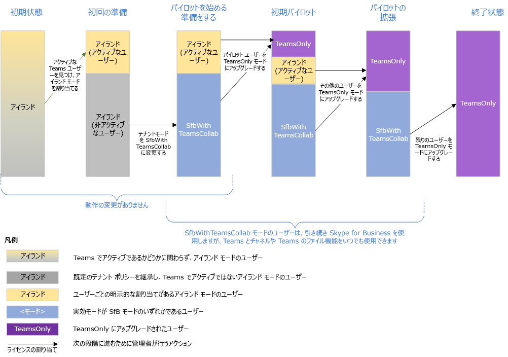

# <a name="upgrade-from-skype-for-business-to-teams-mdash-for-it-administrators"></a>Skype for Business から Teams へのアップグレード &mdash; IT 管理者向け

## <a name="overview"></a>概要

Skype for Business から Teams にアップグレードする場合、一部の組織では、その組織の IT 部門によって計画と管理が実施されるプログレッシブ ロールアウトが必要になります。 この記事は、大規模なオンプレミスの組織の IT 管理者を主に対象としていますが、一部の Skype for Business Online 組織にも適用されます。  この記事を読む前に、「[Microsoft Teams へのアップグレードを開始する](upgrade-start-here.md)」および「[アップグレードのフレームワークについて](upgrade-framework.md)」を必ずご覧ください。

>[!NOTE]
>この記事では、Skype for Business Online、Skype for Business オンプレミス、および Skype for Business という用語を使用します。  最後の用語は、オンライン バージョンとオンプレミス バージョンの両方を指します。

Teams に移行されたユーザーは、Skype for Business で開催される会議に参加する目的以外には Skype for Business クライアントを使用しません。  着信したチャットや通話すべては、送信者が Teams と Skype for Business のいずれを使用しているかに関わらず、ユーザーの Teams クライアントに配信されます。 移行済みユーザーによって開催される新しい会議は、Teams 会議としてスケジュールされます。 ユーザーが Skype for Business クライアントを使用しようとすると、チャットと通話の開始がブロックされます。  ただし、招待された会議に参加する場合は、ユーザーは Skype for Business クライアントを引き続き使用できます (使用する必要があります)。 (2017 年より前に出荷された以前の Skype for Business クライアントでは、TeamsUpgradePolicy は優先されません。 最新の Skype for Business クライアントを使用していることをご確認ください)。
 
管理者は、[TeamsUpgradePolicy](https://docs.microsoft.com/powershell/module/skype/grant-csteamsupgradepolicy?view=skype-ps) のプロパティである "[モード](migration-interop-guidance-for-teams-with-skype.md#coexistence-modes)" という概念を使用して Teams への移行を管理します。 上述の、Teams への移行が完了したユーザーは、TeamsOnly モードになります。  Teams に移行する組織の最終的な目標は、すべてのユーザーを TeamsOnly モードに移行することです。

Skype for Business (オンラインまたはオンプレミス) を使用する既存の組織を Teams に移行するには、次の 2 つの方式があります。

- **併用方式** (アイランド モードを使用): 既存の Skype for Business 組織のユーザーが Teams に追加されることにより、これらのユーザーは移行期間中に両方のクライアントを併用できます。 この期間中、これらのユーザーは Teams のほとんどの機能 (全部ではありません) を利用できます。 この構成のモードは、"アイランド" と呼ばれ、これは Skype for Business を使用する既存の組織の既定のモードです。 組織での準備が整ったら、管理者はユーザーを TeamsOnly モードに移行します。

- **マネージド方式** (Skype for Business の 1 つまたは複数のモードを使用): 管理者は、組織内のユーザーのためにチャット、通話、会議スケジュール機能の Skype for Business から Teams への移行を管理します。  これらの機能はいずれも、Skype for Business または Teams のいずれかで使用できますが、両方で使用することはできません。 管理者は、ユーザーのためにこの機能を Teams に移行するタイミングを制御するのに TeamsUpgradePolicy を使用します。 まだ TeamsOnly モードになっていないユーザーは、引き続き Skype for Business を使用してチャットと通話を行います。2 つのグループのユーザーは、相互運用機能を使用して通信できます。 管理者は、段階的により多くのユーザーを Teams に移行させることにより、移行を管理します。  

この記事では、お客様の組織に適した方式を選択していただく助けとして、両方の方式について概観し、それぞれの長所と短所を説明します。 

## <a name="side-by-side-method-using-islands-mode"></a>併用方式 (アイランド モードを使用)

併用方式の場合、チャット、VoIP 通話、および会議を行うために、ユーザーは Teams と Skype for Business クライアントの両方を使用できます。 この状態は、"アイランド" モードと呼ばれます。これは、Skype for Business と Teams の通信トラフィックは (たとえ同一ユーザーのものであっても) 別々に保たれ、2 つの異なるクライアント同士が通信しないからです (同じ組織内のユーザーの場合)。 たとえば、受信者ユーザー A がアイランド モードであるとします。

- 別のユーザーの Skype for Business クライアントから開始される通信は、常にユーザー A の Skype for Business クライアントに配信されます。
- 別のユーザーの Teams クライアントから開始される通信は、*そのユーザーが同じ組織内に存在する場合*、常にユーザー A の Teams クライアントに配信されます。 
- 別のユーザーの Teams クライアントから開始される通信は、*そのユーザーがフェデレーション組織内に存在する場合*、常にユーザー A の Skype for Business クライアントに配信されます。

アイランド モードは、まだ TeamsOnly ではないすべての既存の組織に対する TeamsUpgradePolicy の既定モードです。 Office 365 ライセンスを割り当てると、Teams と Skype for Business Online の両方のライセンスが既定で割り当てられます。 (これは、ユーザーが Skype for Business Server でオンプレミスに所属している場合でも同じです。 ユーザーの所属がオンプレミスとオンラインのいずれであっても、Teams の機能をすべて使用するには Skype for Business Online が現状では必要なため、Skype for Business Online のライセンスを有効にしたままにします)。実際、既定の構成を変更する手順をまだ何も実行していない段階でも、ユーザーは自分の組織で Teams をかなりの程度使用できます。  これは、併用方式のメリットの 1 つです。 この方式を採用すると、迅速かつエンドユーザー主導の導入を組織内で実現できます。

この方式が効果をもたらすには、すべてのユーザーが両方のクライアントを同時に実行している必要があります。 組織内から着信したアイランド モードのユーザー宛てのチャットと通話は、Skype for Business クライアントと Teams クライアントのいずれにも配信される可能性があり、受信者はこれを制御できません。 これは、送信者が通信を開始するために使用するクライアントにより左右されます。 送信者と受信者の組織が異なる場合、アイランド モードのユーザー宛ての着信チャットと通話は、常に Skype for Business クライアントに配信されます。  

たとえば、アイランド モードの受信者が Skype for Business は実行しているものの、Teams は実行していない場合、他のユーザーが Teams からメッセージを送信すると、メッセージはそのアイランド モードの受信者には表示されません (ただし、Teams で受け取れなかったメッセージがあることを伝えるメールが後から受信者に送信されます)。 同様に、ユーザーが Skype for Business を実行し、Teams を実行していない場合、他のユーザーが Skype for Business からそのユーザー宛てにメッセージを送信すると、チャットはそのユーザーに表示されません。  そのユーザーには、受け取れなかったメッセージがあることを通知するメールが送信されます。 これらのシナリオでの動作は、通話の場合も同様です。 ユーザーがどちらかのクライアントを実行していない場合、フラストレーションが生じる可能性があります。

ユーザー A がアイランド モードの場合、ユーザー A のプレゼンスは、他のユーザーからは Teams と Skype for Business とで別のものとして認識されます。

- 他のユーザーが Teams を使用している場合、ユーザー A の Teams でのアクティビティに基づくプレゼンスが表示されます。 
- 他のユーザーが Skype for Business を使用している場合、ユーザー A の Skype for Business でのアクティビティに基づくプレゼンスが表示されます。 

つまり、他のユーザーには、使用しているクライアントによって、ユーザー A の異なるプレゼンス状態が表示される可能性があります。 詳細については、「[プレゼンス](#presence)」を参照してください。

ユーザーを TeamsOnly モードにアップグレードする準備ができたら、ユーザーを個別にアップグレードすることも、テナント全体のポリシーを使用してテナント全体を一度にアップグレードすることもできます。 ユーザーが TeamsOnly モードにアップグレードされると、そのユーザーは着信したすべてのチャットと通話を Teams で受け取ります。 (Skype for Business 会議から Teams 会議への移行は、個別のユーザーに TeamsUpgradePolicy を適用した場合にのみトリガーされます。テナント単位に適用してもトリガーされません。 詳細については、「[会議の移行](#meeting-migration)」を参照してください)。

ただし、アイランド モードに設定されているアップグレード済みでない受信者の場合、TeamsOnly ユーザーからのチャットと通話は、引き続き Skype for Business クライアントまたは Teams クライアントのいずれでも受信できます。  これは、Teams クライアントでは、"Teams から Teams" の通信と "Teams から Skype for Business" の通信について、たとえ同一のユーザーのものであっても、個別の会話スレッドが維持されることによります。  (「[Teams の会話 - 相互運用スレッドとネイティブ スレッド](#teams-conversations---interop-versus-native-threads)」を参照してください)。たとえば、アイランド ユーザー A が Teams を使用して TeamsOnly ユーザー B にメッセージを送信するとします。ユーザー B がそのチャットに返信すると、その通信はユーザー A の Teams クライアントに配信されます。 今度は、ユーザー A が自分の Skype for Business クライアントを使用して TeamsOnly ユーザー B にメッセージを送信するとします。ユーザー B は Teams でそのチャットを受信しますが、このメッセージは、もう 1 つの会話と比べて、ユーザー B の Teams クライアントでは別個の会話になります。 ユーザー B がユーザー A とのこの会話に返信すると、その返信はユーザー A の Skype for Business クライアントに配信されます。 

次の表に、アイランド モードと TeamsOnly モードの両方について Teams エクスペリエンスをまとめて示します。  

| Teams エクスペリエンス | アイランド モードの場合 | TeamsOnly モードの場合 |
|:------------------ | :------------------- | :------------------ |
| 着信したチャットと通話の配信先:|  Teams または Skype for Business | Teams |
| PSTN 通話の配信先: | Skype for Business <br>(Teams での PSTN 機能の使用は、アイランド モードではサポートされていません)。    | Teams |   
 |プレゼンス  | Skype for Business と Teams のプレゼンスは独立しています。 他のユーザーが使用するクライアントによって、同一のアイランド ユーザーであっても異なる状態が表示される可能性があります。 | プレゼンスは、Teams でのユーザーのアクティビティにのみに基づきます。 他のすべてのユーザーには、使用するクライアントに関係なく、そのプレゼンスが表示されます。 | 
 | 会議のスケジュール   | ユーザーは、Teams または Skype for Business のいずれでも会議をスケジュールできます。 ユーザーの Outlook には両方のアドインが表示されます。 |   会議のスケジュールは、Teams のみで行います。 Outlook では、Teams アドインのみを使用できます。 | 

次の表に、組織を Teams へ移行するために併用方式を使用する場合のメリットとデメリットをまとめて示します。

| メリット     |       デメリット |
| :------------------ | :---------------- |
| 組織内での迅速な導入が可能になります。| この 2 つのクライアントの機能は似通っている一方、ユーザー インターフェイスが異なるため、エンド ユーザーが混乱する可能性があります。 また、着信したチャットや通話の配信先クライアントをユーザーは制御できません。 |
| Skype for Business へアクセスを 100% 維持しつつ、Teams の学習と理解を深めることができます。 | ユーザーが両方のクライアントを実行していない場合、受け取れなかったメッセージが原因でエンド ユーザーが不満に感じる可能性があります。 メッセージが届かないという苦情がユーザーから寄せられる可能性があります。|
| 最小限の管理作業で Teams の使用を開始できます。 | 組織内のすべてのユーザーが Teams を使用していない場合、特に、すべてのユーザーが Teams でアクティブではない場合は、アイランド モードから TeamsOnly モードに移行するのが困難な場合があります。 たとえば、ユーザーの一部が TeamsOnly モードにアップグレードされると、それらのユーザーは Teams でのみ送信します。 アイランド モードの他のユーザーには、それらのメッセージは常に Teams に配信されます。 しかし、ユーザーの一部が Teams を実行していない場合、それらのメッセージは受け取れていないものとして認識されます。 |
|  | Teams を使用する場合、Skype for Business Server のオンプレミス アカウントを持つユーザーには、相互運用性やフェデレーションのサポートはありません。  このため、アイランド ユーザーの中に Skype for Business Online に所属しているユーザーと Skype for Business オンプレミスに所属しているユーザーが混在している場合、混乱を生じる可能性があります。   |

## <a name="managed-transition-method-using-skype-for-business-modes"></a>マネージド移行方式 (Skype for Business のモードを使用)

一部の組織では、組織を Skype for Business から Teams に移行する際に、シンプルで予測がより容易なエクスペリエンスをエンド ユーザーに提供することを優先する場合があります。 このモデルでは、IT 管理者は TeamsUpgradePolicy 内の Skype for Business モードのいずれかを使用して、TeamsOnly モードに移行する前に Skype for Business に残るユーザーを明示的に指定します。 管理者は、選択したユーザーを TeamsOnly モードに移行する準備ができたら、これらのユーザーのモードを TeamsOnly に更新します。  展開が進行するにつれて、Skype for Business から TeamsOnly モードへと徐々にユーザーが移行されます。  この移行中の動作は次のようになります。

- Skype for Business をまだ使用しているユーザーの場合、通信の発信元が相手側ユーザーの Teams クライアントであっても Skype for Business クライアントであっても、着信したすべてのチャットと通話は Skype for Business クライアントで受け取ります。 また、これらの Skype for Business ユーザーに対しては、エンド ユーザーの混乱を防ぎ、適切なルーティングを確保するために、Teams クライアントでの通話とチャットの機能は無効になっています。 

- 通信の発信元が Teams、Skype for Business、またはいかなる種類のフェデレーション ユーザーであった場合も、TeamsOnly モードのユーザーは着信したすべてのチャットと通話を Teams クライアントで受信します。 

アイランド方式とは異なり、マネージド移行方式では、Skype for Business ユーザーと TeamsOnly ユーザーは相互に通信できます。 Skype for Business ユーザーと Teams ユーザーの間の通信は、相互運用性と呼ばれます。 (「[相互運用性](#interoperability)」を参照)。相互運用通信は、Skype for Business のユーザーと Teams の別のユーザーとの間の 1 対 1 ベースのチャットと通話で利用できます。 また、招待されたユーザーはいつでも Skype for Business 会議または Teams 会議に参加できますが、会議の種類に対応するクライアントを使用する必要があります。 詳細については、「[会議](#meetings)」を参照してください。

通常、マネージド移行されるユーザーはアイランド モードではないため、相手側のユーザーが使用するクライアントに関係なく、ユーザーのプレゼンスは一貫しています。 ユーザーが Skype for Business モードのいずれかのモードに設定されている場合、他のすべてのユーザーに表示されるプレゼンスは、そのユーザーの Skype for Business でのアクティビティに基づきます。 同様に、ユーザーが TeamsOnly モードの場合は、他のすべてのユーザーに表示されるプレゼンスは、そのユーザーの Teams でのアクティビティに基づきます。 詳細については、「[プレゼンス](#presence)」を参照してください。

まだ Teams を使用し始めていない組織の場合、管理者はテナント全体のモードをアイランドから SfbWithTeamsCollab に変更する必要があります。 (既に Teams を部分的に使用している組織の場合は、管理者は Teams でアクティブなユーザーを grandfather 化することにより、この変更がそれらのユーザーに適用されないようにする必要があります。 詳細については、「[Teams をアイランド モードで既に使用している組織のマネージド アップグレード](#a-managed-upgrade-for-an-organization-that-is-already-using-teams-in-islands-mode)」を参照してください)。

モードがアイランドから SfbWithTeamsCollab に変わっても、Teams を一度も使用したことがないユーザーは、Skype for Business の使い方に違いはないように感じます。 しかし、そのユーザーが Teams を使い始めた際に利用できる機能は、チームとチャネル、およびファイルなどに限定されます。 チャット、通話、会議のスケジュールは、優先クライアントとして Skype for Business が管理者により (現在は) 指定されているため、Teams では利用できません。  

注: ユーザー A のモードがアイランドから Skype for Business のモードのいずれかに変わった場合、ユーザー A への通信を適切なクライアントにルーティングできるよう、ユーザー A と通信する他のユーザーの Teams クライアントでは、ユーザー A のモードが変更されたことが認識される必要があります。既にユーザー A との間にネイティブの "Teams から Teams" チャットを確立しているユーザーの場合、アイランドから Skype for Business のモードへのモード変更がこれらの他のユーザーの Teams クライアントで認識されるまでに、最大 36 時間がかかる場合があります。   一方、TeamsOnly モードへの既存のユーザーの変更は、他のクライアントによって 2 時間以内に検出されます。

管理者は、準備が整い次第、特定のユーザーのモードを TeamsOnly に更新することにより、そのユーザーのチャット、通話、会議のスケジュールを Teams に一度に移行できます。  

別の方法として、SfBWithTeamsCollabAndMeetings モードを使用することで、管理者はチャットと通話機能を Skype for Business に残したまま、まずは会議のスケジュールのみを Teams に移すことができます。 このモードを使用すると、ユーザーを TeamsOnly モードに移行させる準備が整っていない場合でも (既存の PSTN 機能を移行するためにさらに時間が必要である場合など)、組織は会議を Teams に移行できます。 この移行シナリオは、[Meetings First](meetings-first.md) と呼ばれます。


次の表に、TeamsOnly モードへの移行段階として Skype for Business のモードを使用する場合のメリットとデメリットをまとめて示します。


| メリット     |       デメリット |
| :------------------ | :---------------- |
| エンド ユーザーにとって予測可能なルーティングです。  すべての通話とチャットは、管理者の選択に基づき、Skype for Business または Teams のいずれかに配信されます。  | 相互運用会話では、リッチ テキスト、ファイル共有、画面共有はサポートされていません。  これはオンデマンド会議で回避できますが、同じほどシームレスではありません。  |
| 各機能は 1 つのクライアントでのみ使用可能であるため、エンド ユーザーの混乱を排除できます。  | ユーザーは、同じ機能セットについて、両方のクライアントを併用して試行することはできません。 これは特に、Skype for Business から Teams への移行をパラダイムの大きな変更であるとユーザーが感じている場合、考慮すべき要素となる可能性があります。 |
| Teams の段階的な導入が可能です。  |  | |
| 管理者は、Skype for Business から Teams への移行を完全に制御できます。 |  | | 
| 組織を TeamsOnly モードへ完全に移行する準備ができていない場合でも、組織は会議のために Teams を使用できます。 |  | |
| 他のユーザーに表示される特定のユーザーのプレゼンスは、使用するクライアントに関係なく同じです。  |  | |

## <a name="summary-of-upgrade-methods"></a>アップグレード方式のまとめ

次の表に、アップグレード方式をまとめて示します。

| 併用 (アイランド モードを使用)     |      マネージド (Skype for Business のモードを使用) |
| :------------------ | :---------------- |
| 着信したチャットと通話はいずれのクライアントにも配信される可能性があるため、TeamsOnly にアップグレードされる前は、ユーザーは両方のクライアントを同時に実行する必要があります。   | チャットと通話は、受信者のモードに基づき、1 つのクライアントにのみ配信されます。 アップグレード済みではないユーザーは両方のクライアントを実行することができますが、機能は重複しません (通話とチャットは Teams では利用できません)。  管理者は、ユーザーが会議のスケジュールを Teams と Skype for Business のどちらで行うかも制御できます。   |
| ユーザーは、同じ機能について、Skype for Business と Teams を併用できます。   | 管理者は、Skype for Business にも備わっているものと同じ機能を提供することなく、Teams の純粋な新機能 (チームとチャネル) をエンド ユーザーに提供できます。   |
|両方のユーザーがアイランド モードである間は、Skype for Business と Teams との間に相互運用性は生まれません。 一部のユーザーが TeamsOnly にアップグレードされると、それらのユーザーとアイランド モードのままの他のユーザーとの間に相互運用会話が発生する場合があります。 ただし、アイランド ユーザーは、Teams を使用して、相互運用会話を行わないことも選択できます。 | Skype for Business ユーザーと Teams ユーザーの間のコミュニケーションには、相互運用性が必要です。   |

## <a name="tools-for-managing-the-upgrade"></a>アップグレードの管理ツール

上述の方式のどちらを使用する場合でも、ユーザーの共存モードを制御する [TeamsUpgradePolicy](https://docs.microsoft.com/powershell/module/skype/grant-csteamsupgradepolicy?view=skype-ps) を使用することにより、管理者は TeamsOnly への移行を管理します。 各モードの詳細については、「[共存モード](migration-interop-guidance-for-teams-with-skype.md#coexistence-modes)」を参照してください。

管理者が Skype for Business のモードを使用してマネージド移行を実行する場合でも、既定のアイランド構成から TeamsOnly モードに単純にアップグレードする場合でも、TeamsUpgradePolicy が主要なツールになります。  Teams の他のポリシーと同様、TeamsUpgradePolicy はユーザーに直接割り当てることも、テナント全体の既定値として設定することもできます。 ユーザーへの割り当ては、テナントの既定の設定よりも優先されます。  これは、Teams の管理コンソールでも PowerShell でも管理できます。

管理者は、ユーザーが Skype for Business Online と Skype for Business オンプレミスのどちらに所属しているかにかかわらず、TeamsUpgradePolicy の任意のモードをユーザーに割り当てることができます。ただし、TeamsOnly モードは、既に Skype for Business Online に所属しているユーザーにのみ割り当てることができます。 これは、Skype for Business ユーザーとの相互運用とフェデレーションが、そのユーザーが Skype for Business Online に所属している場合にのみ可能になるためです。

オンプレミスに所属する Skype for Business アカウントを持つユーザーは、Skype for Business オンプレミスのツールセットに含まれる Move-CsUser を使用して、Skype for Business Online か直接 Teams のどちらかの[オンラインに移行する必要があります](https://docs.microsoft.com/SkypeForBusiness/hybrid/move-users-from-on-premises-to-teams)。 これらのユーザーは、1 つか 2 つのステップで TeamsOnly に移行できます。

-   1 ステップ: Move-CsUser で  -MoveToTeams スイッチを指定します。 これには、Skype for Business Server 2019 か Skype for Business Server 2015 with CU8 が必要です。

-   2 ステップ: Move-CsUser を実行した後で、TeamsUpgradePolicy を使用して、そのユーザーに TeamsOnly モードを付与します。

他のポリシーとは異なり、Office 365 で TeamsUpgradePolicy の新しいインスタンスを作成することはできません。 既存のインスタンスはすべて、このサービスに組み込まれています。  (モードは、TeamsUpgradePolicy 内のプロパティであり、ポリシー インスタンスの名前ではありません)。ポリシー インスタンスの名前がモードと同一である場合もありますが、必ず一致するわけではありません。 特に、ユーザーに TeamsOnly モードを割り当てる場合は、TeamsUpgradePolicy の UpgradeToTeams インスタンスをそのユーザーに付与します。 すべてのインスタンスの一覧を表示するには、次のコマンドを実行します。

```
Get-CsTeamsUpgradePolicy|ft Identity, Mode, NotifySfbUsers
```

オンライン ユーザーを TeamsOnly モードにアップグレードするには、次のようにして UpgradeToTeams インスタンスを割り当てます。 

```
Grant-CsTeamsUpgradePolicy -PolicyName UpgradeToTeams -Identity $user 
```

オンプレミスの Skype for Business ユーザーを TeamsOnly モードにアップグレードするには、次のようにしてオンプレミス ツールセットに含まれる Move-CsUser を使用します。

```
Move-CsUser -identity $user -Target sipfed.online.lync.com -MoveToTeams -credential $cred
```

ユーザーごとに明示的に付与されているユーザー (その設定が優先される) を除くテナント内のすべてのユーザーのモードを変更するには、次のコマンドを実行します。

```
Grant-CsTeamsUpgradePolicy -PolicyName SfbWithTeamsCollab -Global
```


>[!NOTE]
>オンプレミスの Skype for business アカウントを使用しているユーザーがいる場合は、オンプレミスの Skype for Business アカウントを使用しているすべてのユーザーに明示的に他のモードを割り当てるのでない限り、テナント レベルで TeamsOnly モードを割り当てないでください。


### <a name="using-notifications-in-skype-for-business-clients"></a>Skype for Business クライアントで通知を使用する

管理者は、Skype for Business クライアントでエンド ユーザー通知を提供して、ユーザーがまもなく Teams にアップグレードされることを通知できます。次の図にサンプルを示します。 たとえば、管理者は、ユーザーのグループを TeamsOnly モードにアップグレードしようと考えている日の 1 週間前に、そのグループのユーザーに対する通知をオンにできます。 これらの通知は、TeamsUpgradePolicy のインスタンスを使用し、NotifySfbUsers=true に設定して有効にできます。  TeamsOnly 以外のすべてのモードでは、実際には、NotifySfbUsers の 2 つの値に対応する 2 つのインスタンスがモードごとに存在します。  TeamsOnly 以外のすべてのモードでは、実際には、NotifySfbUsers の 2 つの値に対応する 2 つのインスタンスがモードごとに存在します。 


ユーザーが Skype for Business Online に所属している場合は、そのユーザーと同じモードを持つポリシー インスタンスを割り当てるだけです。ただし、NotifySfbUsers=true に設定します。 

ユーザーが Skype for Business Server オンプレミスに所属している場合は、オンプレミスのツールセットを使用する必要があります。Skype for Business Server 2019 か、または Skype for Business Server 2015 用の CU8 が必要になります。 オンプレミスの PowerShell ウィンドウで、TeamsUpgradePolicy の新しいインスタンスを作成し、次のようにして NotifySfbUsers=true に設定します。

```
New-CsTeamsUpgradePolicy -Identity EnableNotification -NotifySfbUsers $true
```

次に、同じオンプレミスの PowerShell ウィンドウを使用して、その新しいポリシーを目的のユーザーに割り当てます。

```
Grant-CsTeamsUpgradePolicy -Identity $user -PolicyName EnableNotification
```

### <a name="meeting-migration"></a>会議の移行

ユーザーが TeamsOnly に移行されると、既定では、そのユーザーによって開催された既存の Skype for Business 会議は Teams に変換されます。 この規定の動作は、ユーザーに TeamsOnly モードを割り当てる際に必要に応じて無効にできます。 ユーザーをオンプレミスから移行する場合、そのオンライン ユーザー アカウントで機能するように会議をクラウドに移行する必要がありますが、-MoveToTeams を指定していない場合、その会議は Skype for Business 会議として移行され、Teams には変換されません。 

TeamsOnly モードをテナント レベルで割り当てる場合は、どのユーザーに対しても会議の移行はトリガーされません。 テナント レベルで TeamsOnly モードを割り当てて会議を移行する場合は、PowerShell を使用してテナント内のユーザーのリストを取得し (必要なフィルターを指定して Get-CsOnlineUser を使用するなど)、その後に、それらのユーザーそれぞれにループ処理を実行して、Start-CsExMeetingMigration を使用して会議の移行をトリガーできます。 詳細については、「[Meeting Migration Service (MMS) の使用](https://docs.microsoft.com/skypeforbusiness/audio-conferencing-in-office-365/setting-up-the-meeting-migration-service-mms)」を参照してください。


### <a name="additional-considerations-for-organizations-with-skype-for-business-server-on-premises"></a>Skype for Business Server オンプレミスを使用している組織に関するその他の考慮事項

- Skype for Business Hybrid のセットアップは、TeamsOnly モードへの移行の前提条件です。 ハイブリッドを使用せずにアイランド モードで Teams を使用することは可能ですが、そのユーザーが Skype for Business オンプレミスから Skype for Business Online に移行されるまで ([Move-CsUser](https://docs.microsoft.com/SkypeForBusiness/hybrid/move-users-between-on-premises-and-cloud) を使用して) は、TeamsOnly モードには移行できません。 詳細については、「[ハイブリッド接続を構成する](https://docs.microsoft.com/SkypeForBusiness/hybrid/configure-hybrid-connectivity)」を参照してください。

- オンプレミスの Skype for Business アカウントを所有している Teams ユーザー (つまり、Move-CsUser を使用してクラウドにまだ移行していないユーザー) は、Skype for Business ユーザーとの相互運用や、外部ユーザーとのフェデレーションを行うことができません。 この機能は、そのユーザーがクラウドに移行した場合 (アイランド モードか TeamsOnly ユーザーとして) にのみ利用できます。 

- オンプレミスの Skype for business アカウントを使用しているユーザーがいる場合は、オンプレミスの Skype for Business アカウントを使用しているすべてのユーザーに明示的に他のモードを割り当てるのでない限り、テナント レベルで TeamsOnly モードを割り当てないでください。 

- ユーザーが適切な Skype for Business 属性を使用して Azure AD に正しく同期されていることを確認する必要があります。 これらの属性すべてには、プレフィックスとして msRTCSIP- が付きます。 ユーザーが Azure AD に正しく同期されていない場合、Teams の管理ツールでそのユーザーを管理できなくなります。 詳細については、「[Teams と Skype for Business の Azure AD Connect を構成する](https://docs.microsoft.com/SkypeForBusiness/hybrid/configure-azure-ad-connect)」を参照してください。

- ハイブリッド組織で新しい TeamsOnly ユーザーや Skype for Business Online のユーザーを作成するには、*最初にユーザーを Skype for Business Server オンプレミスで有効にしてから*、その後に、そのユーザーを Move-CsUser を使用してオンプレミスからクラウドに移行する必要があります。  最初にオンプレミスでユーザーを作成することにより、残りのオンプレミスの Skype for Business ユーザーは新しく作成されたユーザーに確実にルーティングできるようになります。 すべてのユーザーのオンラインへの移行が完了しているなら、最初にオンプレミスでユーザーを有効にする必要はありません。

- オンプレミスからクラウドにユーザーが移行されると、そのユーザーによって開催される会議は、-MoveToTeams スイッチが指定されているかどうかに基づいて、Skype for Business Online か Teams のいずれかに移行されます。

- オンプレミスのユーザーに対して Skype for Business クライアントで通知を表示する場合は、オンプレミスのツールセットで TeamsUpgradePolicy を使用する必要があります。 オンプレミスのユーザーに関係があるのは、NotifySfbUsers パラメーターのみです。  オンプレミスのユーザーは、TeamsUpgradePolicy のオンライン インスタンスから自分のモードを受け取ります。 「[Grant-CsTeamsUpgradePolicy](https://docs.microsoft.com/powershell/module/skype/grant-csteamsupgradepolicy?view=skype-ps)」のメモを参照してください。 

>[!NOTE]
> 2019 年 9 月 3 日以降に作成された新しいテナントは、TeamsOnly テナントとして作成されており、管理者はダウングレードできません。 Skype for Business Server オンプレミスを使用している組織のうち、2019 年 9 月 3 日より前には Office 365 サブスクリプションを一度も所有したことがない組織は、Office 365 を使用するサブスクリプションを入手した場合、テナントをダウングレードするために Microsoft サポートに連絡する必要があります。 


## <a name="perform-the-upgrade-for-your-organization"></a>組織のアップグレードを実行する

このセクションでは、次のアップグレード オプションについて説明します。

- 併用アップグレード (アイランド モードを使用)
- Teams をまだ使用し始めていない組織のマネージド アップグレード
- Teams をアイランド モードで既に使用している組織のマネージド アップグレード

### <a name="side-by-side-upgrade-using-islands-mode"></a>併用アップグレード (アイランド モードを使用)

併用アップグレード オプションの場合:

- 組織全体の迅速なアップグレードを行うことができる場合は、このオプションを検討します。  両方のクライアントを実行することに伴う混乱が生じる可能性があるので、この期間を最小限にとどめることをお勧めします。 管理者は、両方のクライアントを実行することをユーザーに周知する必要があります。

- このオプションはすぐに使用できるモデルで、管理者は、Office 365 ライセンスを割り当てること以外、特別なアクションなしで Teams の使用を開始できます。 ユーザーが既に Skype for Business Online を使用している場合は、このモデルを既に使用している可能性があります。

- 併用モードから TeamsOnly に移行するのが困難な場合があります。 アップグレード済みのユーザーは Teams でのみ通信するため、そのユーザーと通信する組織内の他のユーザーはすべて Teams を使用する必要があります。  Teams を使用し始めていないユーザーがいる場合、メッセージを受け取れない可能性が生じます。 さらに、そのようなユーザーには、オンラインの TeamsOnly ユーザーが Skype for Business に表示されません。 これを回避するために、テナントのグローバル ポリシーを使用してテナント全体のアップグレードを実行する組織もありますが、これにはすべてのユーザーのアップグレード準備が整うまで待つ必要があります。


### <a name="a-managed-upgrade-for-an-organization-that-has-not-yet-started-using-teams"></a>Teams をまだ使用し始めていない組織のマネージド アップグレード

Teams のアクティブなユーザーが 1 人もいない組織の場合、最初のステップとして、テナント全体に対する TeamsUpgradePolicy の既定のポリシーを、Skype for Business のモードの 1 つ (SfbWithTeamsCollab など) に設定します。  Teams を使用し始めていないユーザーは、動作の違いに気付きません。 それでも、テナント レベルでこのポリシーを設定すると、TeamsOnly モードへのユーザーのアップグレードを開始でき、さらに、アップグレード済みユーザーはまだアップグレードしていないユーザーとの通信を行うことができます。  パイロット ユーザーを特定したら、それらのユーザーを TeamsOnly にアップグレードできます。  そのユーザーがオンプレミスの場合は、Move-CsUser を使用します。 そのユーザーがオンラインの場合は、TeamsUpgradePolicy を使用して、 TeamsOnly モードを割り当てます。  既定で、これらのユーザーによってスケジュールされている Skype for Business 会議は、Teams に移行されます。

主なコマンドを次に示します。

1. 次のようにして、テナント全体の既定値をモードの SfbWithTeamsCollab に設定します。

   ```
   Grant-CsTeamsUpgradePolicy -PolicyName SfbWithTeamsCollab -Global
   ```

2. 次のようにして、ユーザーを TeamsOnly にアップグレードします。

   - ユーザーが既にオンラインの場合:

     ```
     Grant-CsTeamsUpgradePolicy -PolicyName UpgradeToTeams -Identity $username 
     ```

   - ユーザーがオンプレミスの場合:

     ```
     Move-CsUser -identity $user -Target sipfed.online.lync.com -MoveToTeams -credential $cred 
     ```

メモ
 
- テナント全体のポリシーを SfbWithTeamsCollab に設定する代わりに、SfbWithTeamsCollabAndMeetings に設定することもできます。 そのようにすると、すべてのユーザーが新しい会議すべてを Teams でスケジュールするようになります。
- Move-CsUser は、オンプレミス ツールのコマンドレットです。 MoveToTeams スイッチを使用するには、Skype for Business Server 2019 か Skype for Business Server 2015 with CU8 が必要です。 以前のバージョンを使用している場合は、最初にユーザーを Skype for Business Online に移行してから、そのユーザーに TeamsOnly モードを付与できます。
- 既定で、TeamsOnly モードへのアップグレードや SfbWithTeamsCollabAndMeetings モードの割り当てを実行すると、Skype for Business 会議は Teams に移行されます。  

次の図に、Teams をこれまでに使用していない組織のマネージド アップグレードの概念フェーズを示します。 バーの高さは、ユーザー数を表します。 アップグレードのどのフェーズでも、すべてのユーザーが相互に通信できます。  Skype for Business ユーザーは TeamsOnly ユーザーと相互運用を使用して通信します。逆の場合も同様です。


### <a name="a-managed-upgrade-for-an-organization-that-is-already-using-teams-in-islands-mode"></a>Teams をアイランド モードで既に使用している組織のマネージド アップグレード

組織内の一部のユーザーが Teams をアイランド モードでアクティブに使用している場合、既存のユーザーから機能を削除することは望ましくない場合があります。 その場合、テナント全体のポリシーを変更する前に、もう 1 つステップが必要になります。 この問題の解決策は、テナント全体のポリシーを SfbWithTeamsCollab に設定する前に、既存のアクティブな Teams ユーザーをアイランド モードで grandfather 化することです。  これが完了したら、上述のように展開を実行できます。ただし、TeamsOnly に移行する 2 グループのユーザーが存在することになります。つまり、Teams でアクティブだったユーザーはアイランド モードになり、残りのユーザーは SfbWithTeamsCollab モードになります。 管理者は、これらのユーザーを TeamsOnly モードに段階的に移行できます。

1. Teams でアクティブなユーザーを見つけるには、次のようにします。

   1. Office 365 管理ポータルの左側のナビゲーションで、[レポート]、[使用状況] の順に移動します。 
   2. [レポートの選択] ドロップダウンで、[Microsoft Teams]、[ユーザー アクティビティ] の順に選択します。 このようにすると、Teams でアクティブになっているユーザーのエクスポート可能なテーブルが提供されます。 
   3. [エクスポート] をクリックして、Excel を開き、フィルタリングして、Teams でアクティブなユーザーのみを表示します。

2. ステップ 1 で見つかったアクティブな Teams ユーザーそれぞれに対して、リモート PowerShell でアイランド モードを割り当てます。 これで次のステップに進むことができます。ユーザー エクスペリエンスは変更されません。  

   ```
   $users=get-content “C:\MyPath\users.txt” 
    foreach ($user in $users){ 
    Grant-CsTeamsUpgradePolicy -identity $user -PolicyName Islands} 
   ```

3. テナント全体のポリシーを SfbWithTeamsCollab に設定します。

   ```
   Grant-CsTeamsUpgradePolicy -Global -PolicyName SfbWithTeamsCollab 
   ```

4. 選択したユーザーを TeamsOnly モードにアップグレードします。 ユーザーがアイランド モードの場合に生じる可能性のある混乱を最小限に抑えるため、アイランド モードのユーザーを優先的にまずアップグレードすることが望ましい場合もありますが、アイランド モードのユーザーと SfbWithTeamsCollab モードのユーザーのどちらをアップグレードするかは管理者が選択できます。   

   Skype for Business Online に所属しているユーザーの場合:  

   ```
   Grant-CsTeamsUpgradePolicy -Identity $user -PolicyName UpgradeToTeams 
   ```

   Skype for Business Server オンプレミスに所属しているユーザーの場合:  

   ```
   Move-CsUser -Identity $user -Target sipfed.online.lync.com -MoveToTeams -credential $cred 
   ```

次の図に、アクティブなアイランド ユーザーが既に存在する場合のマネージド移行の概念フェーズを示します。 バーの高さは、ユーザー数を表します。 アップグレードのどのフェーズでも、すべてのユーザーが相互に通信できます。  Skype for Business ユーザーは TeamsOnly ユーザーと相互運用を使用して通信します。逆の場合も同様です。




   

## <a name="considerations-for-pstn-calling"></a>PSTN 通話に関する考慮事項

PSTN 通話機能が関係している場合、TeamsOnly モードへの移行に際して次の 4 つのシナリオが考えられます。

- *Microsoft 通話プランを使用している Skype for Business Online のユーザー*。 アップグレードすると、このユーザーは Microsoft 通話プランを引き続き使用します。

- Skype for Business オンプレミスまたはクラウド コネクタ エディションで*オンプレミス音声機能を使用している Skype for Business Online のユーザー*。 このユーザーの Teams へのアップグレードは、その TeamsOnly ユーザーが確実に PSTN 機能を持てるようにするため、ユーザーのダイレクト ルーティングへの移行に合わせた調整が必要になります。

- *エンタープライズ VoIP を使用している Skype for Business オンプレミスのユーザーのうち、オンラインに移行して、オンプレミスの PSTN 接続を維持するユーザー*。  このユーザーを Teams に移行するには、そのユーザーのオンプレミスの Skype for Business アカウントをクラウドに移行し、移行をそのユーザーのダイレクト ルーティングへの移行に合わせて調整する必要があります。 

- *エンタープライズ VoIP を使用している Skype for Business オンプレミスのユーザー*のうち、オンラインに移行して、Microsoft 通話プランを使用するユーザー。  このユーザーを Teams に移行するには、そのユーザーのオンプレミスの Skype for Business アカウントをクラウドに移行し、移行を A) Microsoft 通話プランへのユーザーの電話番号のポートに合わせて調整するか、B) 利用可能な地域から新しいサブスクライバー番号を割り当てる必要があります。

この記事では、概要のみを説明します。  詳細については、「[電話システムのダイレクト ルーティング](direct-routing-landing-page.md)」および「[通話プラン](calling-plan-landing-page.md)」を参照してください。 また、Teams での電話システムの使用は、そのユーザーが TeamsOnly モードの場合にのみサポートされることにご注意ください。  ユーザーがアイランド モードの場合、電話システムは Skype for Business でのみサポートされます。 

### <a name="from-skype-for-business-online-with-microsoft-calling-plans"></a>Microsoft 通話プランを使用している Skype for Business Online からの場合 

これは、音声が関係する最も簡単なアップグレード シナリオです。 

1. ユーザーに Teams ライセンスが割り当てられていることを確認します。 既定で、Office 365 ライセンスを割り当てると Teams が有効になるので、その Teams ライセンスを無効にしていない限り、アクションは必要ありません。

2.  ユーザーが既に電話番号を指定して Microsoft 通話プランを使用している場合に必要な変更は、そのユーザーに TeamsUpgradePolicy で TeamsOnly モードを割り当てることのみです。  TeamsOnly モードを割り当てる前は、着信 PSTN 通話はユーザーの Skype for Business クライアントに配信されます。 TeamsOnly モードにアップグレードすると、着信 PSTN 通話はユーザーの Teams クライアントに配信されます。  

### <a name="from-skype-for-business-online-with-on-premises-voice"></a>オンプレミス音声を使用している Skype for Business Online からの場合

このシナリオでは、ユーザーは既に Skype for Business Online を使用していますが、PSTN 接続はオンプレミスで、ハイブリッド モードかクラウド コネクタ エディションの Skype for Business Server を使用しています。 PSTN 機能を使用してこれらのユーザーを TeamsOnly モードに移行することは、そのユーザーにダイレクト ルーティングを許可することを意味します。ダイレクト ルーティングでは、PSTN トランクは、オンプレミス セッション ボーダー コントローラー (SBC) を介して、クラウドのダイレクト ルーティング サービスに直接接続します。

基本的なステップを次に示します。  ステップ 1 から 4 は、提案されている順序で並んでいますが、任意の順序で実行できます。 重要なのは、これらすべてをステップ 5 の前に完了する必要があるということです。

1. テナント全体のポリシーを Skype for Business のモードの 1 つに設定する予定の場合は、前述のように既存のアイランド ユーザーにアイランド モードを明示的に割り当てることにより、それらのユーザーを必ず grandfather 化してください。

2. ダイレクト ルーティング用にテナントを構成します。 「[ダイレクト ルーティングのテナントごとの構成の概要](#summary-of-per-tenant-configuration-of-direct-routing)」を参照してください。

3. 必要に応じて、これらのユーザーに対してさまざまな Teams ポリシーを構成します (TeamsMessagingPolicy や TeamsMeetingPolicy など)。 この操作はいつでも行えますが、ユーザーをアップグレードした時にユーザーが確実に正しく構成されているようにするには、ユーザーを TeamsOnly モードにアップグレードする前にこれを行なっておくのが最善です。

4. 選択したユーザーに音声移行の準備をします。 
   - 必要に応じて、Teams ライセンスを割り当てます。  ユーザーが既に Skype for Business Online のオンプレミス音声を使用できているなら、そのユーザーは Microsoft 電話システムだけでなく、Skype for Business プラン 2 も所有しています。 両方のプラン (Skype for Business Online プラン 2 のライセンスを含む) を有効なままにしておきます。  
   - 目的の OnlineVoiceRoutingPolicy を割り当てます。 

5. これらのステップは相互に合うように調整する必要があります。 

   - Office 365 で、ユーザーを TeamsOnly モードにアップグレードします (Grant-CsTeamsUpgradePolicy)。
   - SBC で、通話をオンプレミスの仲介サーバーではなくダイレクト ルーティングに送信することにより、音声ルーティングが着信通話を許可するように構成します。


### <a name="from-skype-for-business-server-on-premises-with-enterprise-voice-to-direct-routing"></a>エンタープライズ VoIP を使用している Skype for Business Server オンプレミスからダイレクト ルーティングに移行する場合

このシナリオでは、ユーザーは Skype for Business オンプレミスにまだ所属しており、PSTN 接続もオンプレミスです。 PSTN 機能を使用してこれらのユーザーを TeamsOnly モードに移行することは、そのユーザーにダイレクト ルーティングを許可して、クラウドに移行することを意味します。 
 
基本的なステップを次に示します。  ステップ 1 から 5 は、提案されている順序で並んでいますが、任意の順序で実行できます。 重要なのは、これらすべてをステップ 6 の前に完了する必要があるということです。

1. テナント全体のポリシーを Skype for Business のモードの 1 つに設定する予定の場合は、前述のように既存のアイランド ユーザーにアイランド モードを明示的に割り当てることにより、それらのユーザーを必ず grandfather 化してください。

2. まだ構成していない場合は、[Skype for Business Hybrid 用に組織を構成](https://docs.microsoft.com/SkypeForBusiness/hybrid/configure-hybrid-connectivity)します。

3. ダイレクト ルーティング用にテナントを構成します。 「[ダイレクト ルーティングのテナントごとの構成の概要](#summary-of-per-tenant-configuration-of-direct-routing)」を参照してください。

4. 必要に応じて、これらのユーザーに対してさまざまな Teams ポリシーを構成します (TeamsMessagingPolicy や TeamsMeetingPolicy など)。 この操作はいつでも行えますが、ユーザーをアップグレードした時にユーザーが確実に正しく構成されているようにするには、ユーザーを TeamsOnly アップグレードする前にこれを行なっておくのが最善です。

5. 必要に応じて、Office 365 ライセンスを割り当てます。  ユーザーは、電話システムに加えて、Teams と Skype for Business Online プラン 2 の両方が必要です。 Skype for Business Online プラン 2 が無効になっている場合は、もう一度有効にします。  

6. これらのステップは相互に合うように調整する必要があります。 

   - オンプレミスの Skype for Business ツールを使用し、-MoveToTeams スイッチを指定して Move-CsUser を実行します。 -MoveToTeams スイッチをサポートしていないバージョンの Skype for Business Server を使用している場合は、まず Move-CsUser を実行してから、テナントのリモート PowerShell か Teams 管理コンソールで、TeamsOnly モードを割り当てます。

   - SBC で、通話をオンプレミスの仲介サーバーではなくダイレクト ルーティングに送信することにより、音声ルーティングが着信通話を許可するように構成します。 

   - Office 365 で: 関連する OnlineVoiceRoutingPolicy を割り当てて、発信通話を有効にします。 


### <a name="from-skype-for-business-server-on-premises-with-enterprise-voice-to-microsoft-calling-plan"></a>エンタープライズ VoIP を使用している Skype for Business Server オンプレミスから Microsoft 通話プランに移行する場合

このシナリオでは、ユーザーは Skype for Business オンプレミスにまだ所属しており、PSTN 接続もオンプレミスです。 PSTN 機能を使用してこれらのユーザーを TeamsOnly モードに移行することは、そのユーザーをクラウドに移行して、そのユーザーの番号を元の通信事業者から Microsoft 通話プランに移植するか、そのユーザーに新しい番号を割り当てるかを意味します。 

基本的なステップを次に示します。ステップ 1 から 5 は、提案されている順序で並んでいますが、任意の順序で実行できます。 重要なのは、これらすべてをステップ 6 の前に完了する必要があるということです。 

1. テナント全体のポリシーを Skype for Business のモードの 1 つに設定する予定の場合は、前述のように既存のアイランド ユーザーにアイランド モードを明示的に割り当てることにより、それらのユーザーを必ず grandfather 化してください。 

2. まだ構成していない場合は、[Skype for Business Hybrid 用に組織を構成](https://docs.microsoft.com/SkypeForBusiness/hybrid/configure-hybrid-connectivity)します。 

3. 必要に応じて、これらのユーザーに対してさまざまな Teams ポリシーを構成します (TeamsMessagingPolicy や TeamsMeetingPolicy など)。 この操作はいつでも行えますが、ユーザーをアップグレードした時にユーザーが確実に正しく構成されているようにするには、ユーザーを TeamsOnly アップグレードする前にこれを行なっておくのが最善です。 

4. 必要に応じて、Office 365 ライセンスを割り当てます。ユーザーは、電話システムに加えて、Teams と Skype for Business Online プラン 2 の両方が必要です。 Skype for Business Online プラン 2 が無効になっている場合は、もう一度有効にします。  

5. ユーザーの電話番号を取得します。 (詳細については、「[組織の電話番号を管理する](https://docs.microsoft.com/MicrosoftTeams/manage-phone-numbers-for-your-organization/manage-phone-numbers-for-your-organization)」を参照してください)。

   - 番号を再利用する場合は、通信事業者に移植要求を提出します。  
   - または、直接 Microsoft から新しい番号を取得することもできます。 

6. ユーザーをアップグレードします。 オンプレミスの Skype for Business ツールを使用し、-MoveToTeams スイッチを指定して Move-CsUser を実行します。  

    - 番号を Microsoft に移植する場合は、この操作のタイミングを調整して、ポートが発生するときに発生するようにする必要があります。 

    - Microsoft から新しい番号を取得して使用する場合は、そのユーザーの LineUri を変更することが必要になります。これは、オンプレミス ツールで実行して、その後に Azure AD Connect 経由でクラウドに同期する必要があります。 Move-CsUser の操作が Azure AD Connect で変更を同期するのと同時に行われるように、タイミングを調整する必要があります。 

### <a name="summary-of-per-tenant-configuration-of-direct-routing"></a>ダイレクト ルーティングのテナントごとの構成の概要 

1. [このリスト](direct-routing-border-controllers.md)を確認して、ご利用のセッション ボーダー コントローラー (SBC) がダイレクト ルーティングでサポートされていることを確認します。 正しいバージョンのファームウェアを使用していることも確認する必要があります。  

2. オンプレミスの SBC と Teams のダイレクト ルーティング サービスをペアリングします。 詳細については、「[SBC を電話システムのダイレクト ルーティング サービスにペアリングする](direct-routing-configure.md#pair-the-sbc-to-the-direct-routing-service-of-phone-system)」を参照してください。 

3. この構成は、実質的にオンプレミス構成のミラーです。 オンライン構成は次の内容で構成されます。 
   - OnlineVoiceRoutingPolicy (Skype for Business Online のユーザーを移行する場合はオンプレミスの VoiceRoutingPolicy に基づき、エンタープライズ VoIP を使用してオンプレミスからユーザーを移行する場合は VoicePolicy に基づく)。
   - OnlinePSTNUsage オブジェクト (オンプレミスの PSTN 使用法に基づく)。 
   - OnlineVoiceRoute オブジェクト (オンプレミスの VoiceRoute に基づく)。 

詳細については、「[ダイレクト ルーティングを構成する](direct-routing-configure.md)」を参照してください。 

### <a name="manage-enterprisevoiceenabled-property-during-migration"></a>移行時に EnterpriseVoiceEnabled プロパティを管理する 

ダイレクト ルーティングや Microsoft 通話プランを使用する場合、ユーザーは、PSTN 機能を利用できるようにするため、Azure AD で EnterpriseVoiceEnabled=true に指定する必要があります。  EnterpriseVoiceEnabled (EV-enabled) は、オンプレミスのディレクトリとクラウドの両方に存在するプロパティです (ポリシーではない)。 Teams で重要なのは、クラウドの値です。  EV-enabled がどのようにして true に設定されるかの正確なロジックは、次のシナリオによって決定されます。 

- ユーザーがオンプレミスの Skype for Business Server で EV-enabled になっており、Move-CsUser を使用してそのユーザーをクラウドに移行する前に電話システムのライセンスがそのユーザーに割り当てられている場合、そのオンライン ユーザーは EV-enabled=true でプロビジョニングされます。 

- 既存の TeamsOnly または Skype for Business Online ユーザーに電話システムのライセンスが割り当てられる場合は、EV-enabled は既定では true に設定されません。  オンプレミスのユーザーが、電話システムのライセンスを割り当てる前にクラウドに移行される場合も同様です。 どちらの場合も、管理者は次のコマンドレットを指定する必要があります。 

  ```
  Set-CsUser -EnterpriseVoiceEnabled $True 
  ```

## <a name="coexistence-of-teams-with-skype-for-business"></a>Teams と Skype for Business の共存

このセクションでは、使用するモードやアップグレード方式にかかわらず、Teams と Skype for Business の両方のクライアントを同じ組織内で実行する場合に経験する可能性のある動作をまとめて説明します。

- [会議](#meetings)
- [相互運用性](#interoperability)
- [Teams の会話 - 相互運用とネイティブ スレッドの違い](#teams-conversations---interop-versus-native-threads)
- [プレゼンス](#presence)
- [フェデレーション](#federation)
- [連絡先](#contacts)

### <a name="meetings"></a>会議

モードに関係なく、ユーザーは、Skype for Business であれ Teams であれ、招待されたすべての種類の会議にいつでも参加できます。  ただし、ユーザーは、会議の種類に合った対応するクライアントを使用してその会議に参加する必要があります。

- 会議が Teams 会議の場合、参加者全員 (TeamsOnly、アイランド、Skype for Business のいずれのユーザーであっても) が、Teams クライアントを使用して会議に参加します。 Teams がインストールされていない場合、そのユーザーが会議に参加しようとすると、Web に移動されます。

- 会議が Skype for Business 会議の場合、参加者全員 (TeamsOnly、アイランド、Skype for Business のいずれのユーザーであっても) が、Skype for Business クライアントを使用して会議に参加します。 Skype for Business クライアントがインストールされていない場合、そのユーザーは、Skype 会議アプリ経由で参加できるように Web に移動されます。

会議を開催する場合、スケジュールされる会議の種類は、次の表に示すように開催者のモードに基づいて決定されます。

| 開催者のモード    |      動作 |
| :------------------ | :---------------- |
| TeamsOnly、SfbWithTeamsCollabAndMeetings |    すべての会議が Teams でスケジュールされます。 Skype for Business アドインは Outlook では使用できません。 | 
| SfbWithTeamsCollab、SfbOnly   | すべての会議が Skype for Business でスケジュールされます。 Teams アドインは Outlook では使用できません。 | 
| アイランド |     会議は Skype for Business でも Teams でもスケジュールできます。 両方のアドインを Outlook で使用できます。 | 


### <a name="interoperability"></a>相互運用性

Teams では、特定のシナリオで Skype for Business との相互運用性をサポートしています。 相互運用通信とは、Skype for Business ユーザーと Teams ユーザーとの間のチャットや通話を意味しています。  相互運用通信は、2 人のユーザー間でのみ可能です。マルチパーティ チャットや通信、別のユーザーを追加することはサポートされていません。

2 人のユーザー間での相互運用チャットや通信は、次の各条件が満たされている場合に作成されます。

- 一方のユーザーは Teams を使用し、他方のユーザーは Skype for Business を使用している。

- どちらも同じ組織内のユーザーである場合は、最初の通信の受信者のモードがアイランドではない (アイランド モードの場合、通信は同一のクライアントに配信される)。 フェデレーション シナリオの場合、送信側のユーザーは Teams を使用しており、受信者は TeamsOnly モードではない。 

- Teams ユーザーは、オンプレミスに所属している Skype for Business アカウントも所有してはいない。 

相互運用通信では、チャットはプレーンテキストのみです。 また、*相互運用チャット自体*では、ファイル共有や画面共有は行えません。 ただし、次のようにして相互運用チャット内からオンデマンド会議を作成することにより、相互運用会話中のユーザーは簡単にファイル共有や画面共有を実現できます。

- Teams ユーザーが画面を共有しようとすると、オンデマンドの Teams 会議が自動的に作成され、Skype for Business ユーザーのクライアントにその会議への招待リンクが送信されます。 リンクをクリックすると、Skype for Business ユーザーの Teams が開き、会議に参加できます。 これで、両方のユーザーが Teams 会議に参加する形になり、必要に応じて共有を行なえます。

- Skype for Business ユーザーが 2018 以降のクライアントを使用していて、任意のコンテンツを共有しようとすると、オンデマンドの Skype for Business 会議が自動的に作成され、Teams ユーザーのクライアントにその会議への招待リンクが送信されます。 リンクをクリックすると、Teams ユーザーがその Skype for Business 会議に参加するための試行が実行されます。 その Teams ユーザーが Skype for Business クライアントをインストール済みの場合は、そのクライアントが開き、ユーザーはログインするように求められます (ログインしていない場合)。  その Teams ユーザーが Skype for Business クライアントをインストールしていない場合は、Web バージョンを使用するように求められます。 両方のユーザーがログインすると、どちらも Skype for Business 会議に参加している形になり、必要に応じて共有を行なえます。

### <a name="teams-conversations---interop-versus-native-threads"></a>Teams の会話 - 相互運用とネイティブ スレッドの違い

相互運用通信はネイティブな Teams の会話の一部の機能をサポートしていないため、Teams クライアントは、"Teams から Teams" の通信と "Teams から Skype for Business" の通信の会話スレッドを別個に維持します。 これらの会話は、ユーザー インターフェイスに異なる方法で表示されます。相互運用スレッドは、通常のネイティブな Teams スレッドと次の点で区別できます。

- リッチ テキスト、ファイル/画面共有、ユーザー追加禁止のコントロールが表示されない。
- ターゲット ユーザーのアイコンが変更され、Skype for Business を意味する S が表示される。

これらの違いを次のスクリーンショットに示します。

ユーザー G3 Test とのネイティブな "Teams から Teams" の会話


同じユーザー G3 Test との相互運用会話


会話スレッドが一旦作成されると、その種類は変更されません。 作成された Teams の相互運用スレッドは、常にターゲット ユーザーの Skype for Business クライアントにルーティングされます。 ネイティブ スレッドは、常にターゲット ユーザーの Teams クライアントにルーティングされます。  受信者ユーザーのモードが変わると、そのユーザーに対する既存の Teams スレッドは機能しなくなり、次のスクリーンショットに示すように、メモと、ネイティブな会話を新たに始めるためのリンクがそのチャット上に表示されます。 詳細については、「[既存のスレッドからのチャットと通話](coexistence-chat-calls-presence.md#chats-and-calls-from-pre-existing-threads)」を参照してください。


### <a name="presence"></a>プレゼンス

特定のユーザーのプレゼンスは、クライアントを介したサービスでのユーザーのアクティビティに基づきます。 プレゼンスは、他のユーザーが表示できるように公開されます。  Skype for Business と Teams は、別個のクライアントを持つ別個のサービスなので、各サービスはユーザーに関する独自のプレゼンス状態を持ちます。   Teams と Skype for Business Online のプレゼンス サービスの間では、同期も行われます。  これにより、必要に応じて一方のサービスが他方のサービスからユーザーのプレゼンスを公開することが可能になります。 

プレゼンスの公開動作は、ユーザーのモードに基づいて決定されます。 次の 3 つの基本的なケースがあります。

- ユーザーが TeamsOnly モードの場合、他のすべてのユーザーには、使用するクライアントに関係なく、そのユーザーの Teams プレゼンスが表示されます。

- ユーザーが Skype for Business のいずれかのモードの場合、他のすべてのユーザーには、使用するクライアントに関係なく、そのユーザーの Skype for Business プレゼンスが表示されます。

- ユーザーがアイランド モードの場合、Skype for Business と Teams で公開されるプレゼンスは独立しているため、同一組織内のユーザーに表示されるプレゼンスは、相手側ユーザーのクライアントによって決まります。 フェデレーション組織のユーザーには、Skype for Business のアクティビティに基づいてそのユーザーのプレゼンスが表示されます。これは、アイランド モードのユーザーに対するフェデレーション トラフィックが Skype for Business に配信されるためです。

たとえば、ユーザー A がアイランド モードであるとします。 ユーザー A が Teams ではアクティブで Skype for Business にはサインインしていない場合、他のユーザーには、Teams クライアントからはユーザー A はアクティブであるように見えますが、Skype for Business クライアントではユーザー A はオフラインであるように見えます。 これは仕様です。クライアントを実行していない場合、ユーザー A にはアクセスできません。 

詳細については、「[プレゼンス](coexistence-chat-calls-presence.md#presence)」を参照してください。

### <a name="federation"></a>フェデレーション

Skype for Business を使用している他のユーザーへの Teams からのフェデレーションには、Teams ユーザーが Skype for Business のオンラインに所属している必要があります。 TeamsUpgradePolicy は、着信するフェデレーションされたチャットと通話のルーティングを制御します。 フェデレーションされたルーティングの動作は、同じテナントの場合のシナリオと同じものです (アイランド モードの場合を除く)。 受信者がアイランド モードの場合の動作は、次のようになります。

- Teams から開始されたチャットと通話は、受信者がフェデレーションされたテナントにいる場合、Skype for Business に配信されます。
- Teams から開始されたチャットと通話は、受信者が同じテナントにいる場合、Teams に配信されます。
- Skype for Business から開始されたチャットと通話は常に、Skype for Business に配信されます。

Teams ユーザーと Skype for Business の間のフェデレーション チャットは、相互運用スレッドであるため、リッチ テキストや共有は使用できません。 ユーザー インターフェイスには、そのユーザーが外部ユーザーであることを示すメモがあることを除けば、同一テナントの相互運用スレッドと同様の方法でフェデレーション チャットが表示されます。

Teams が最初にフェデレーションを導入した時点では、2 人の Teams ユーザー間のフェデレーション チャットも相互運用スレッドでした。しかし、将来的には、ネイティブな Teams フェデレーションが導入され、TeamsOnly モードのユーザー間の会話に完全な機能が提供される予定です。 。 

詳細については、「[新しいチャットまたは通話のフェデレーション ルーティング](coexistence-chat-calls-presence.md#federated-routing-for-new-chats-or-calls)」を参照してください。

### <a name="contacts"></a>連絡先

Teams と Skype for Business は、連絡先の別個のリストを保持します。 これは、一方のシステムでなされた連絡先の追加、削除、変更が、他方のシステムには同期されないことを意味します。 ただし、次の 2 つの特定のイベントのどちらかが発生すると、Skype for Business の連絡先が Teams に自動的にコピーされます。 

- Skype for Business Online ユーザーが初めて Teams にログオンすると、Skype for Business の連絡先が Teams にコピーされます。  この動作は、Skype for Business Server のオンプレミス アカウントを持つユーザーには利用できません。  

- ユーザーが TeamsOnly にアップグレードされ (TeamsUpgradePolicy を割り当てるか Move-CsUser -MoveToTeams で) た後に、次にユーザーが Teams にログインすると、Skype for Business の既存の連絡先が Teams の既存の連絡先とマージされます。 この動作は、ユーザーの Skype for Business アカウントがオンプレミスかオンラインである場合に発生します。 

どちらの場合も、Skype for Business から Teams への連絡先の転送は非同期なので、連絡先が Teams に表示されるまでに数分かかることがあります。 上述の 2 つのイベントがコピーをトリガーします。  

## <a name="related-links"></a>関連リンク

[Teams を Skype for Business と一緒に使用する組織向けの移行と相互運用に関するガイダンス](migration-interop-guidance-for-teams-with-skype.md) 

[Skype for Business Server と Office 365 の間のハイブリッド接続を構成する](https://docs.microsoft.com/SkypeForBusiness/hybrid/configure-hybrid-connectivity)

[オンプレミスとクラウドの間でユーザーを移動する](https://docs.microsoft.com/SkypeForBusiness/hybrid/move-users-between-on-premises-and-cloud)

[共存およびアップグレードを設定する](setting-your-coexistence-and-upgrade-settings.md)

[Grant-CsTeamsUpgradePolicy](https://docs.microsoft.com/powershell/module/skype/grant-csteamsupgradepolicy?view=skype-ps)

[会議移行サービス (MMS) を使用する](https://docs.microsoft.com/skypeforbusiness/audio-conferencing-in-office-365/setting-up-the-meeting-migration-service-mms)

