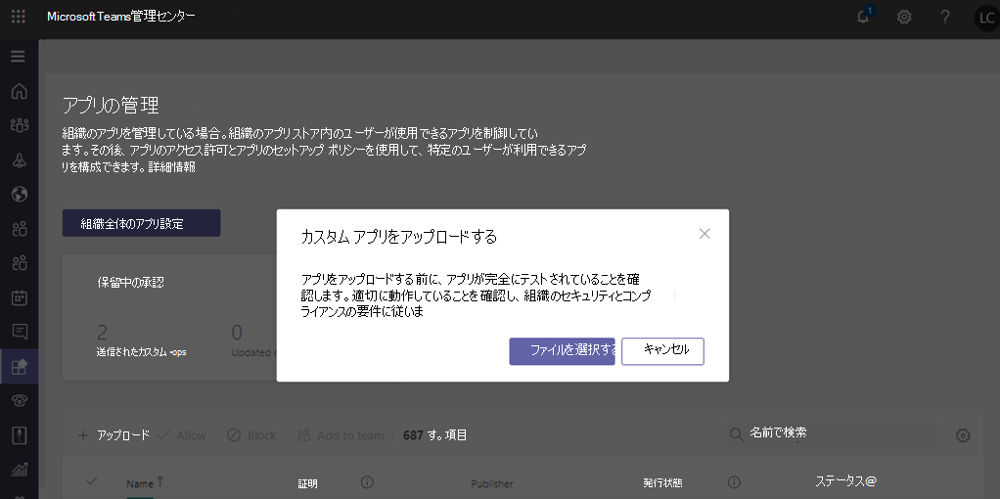
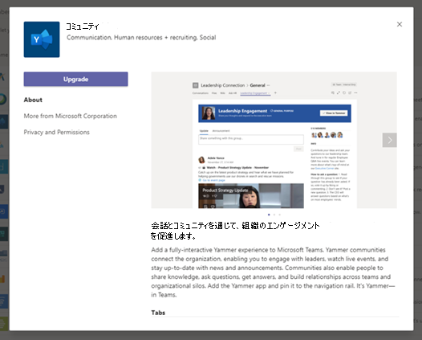

# アプリパッケージをアップロードしてカスタムアプリを公開するPublish a custom app by uploading an app package

> [!NOTE]
> カスタム Teams アプリを公開すると、組織のアプリストア内のユーザーがそのアプリを利用できるようになります。When you publish a custom Teams app, it's available to users in your organization's app store. カスタムアプリを公開する方法は2つあります。また、アプリの入手方法によって異なります。There are two ways to publish a custom app and the way that you use depends on how you get the app. **この記事では、開発者から送信されたアプリパッケージ (.zip 形式) をアップロードして、カスタムアプリを公開する方法について説明**します。**This article focuses on how to publish a custom app by uploading an app package (in .zip format) that a developer sends you**. その他の方法 (カスタムアプリを承認する) は、開発者が Teams アプリ申請 API を使用してアプリの<a href="https://docs.microsoft.com/microsoftteams/manage-apps" target="_blank">管理</a>ページに直接アプリを送信するときに使用されます。The other method, approving a custom app, is used when a developer submits an app directly to the <a href="https://docs.microsoft.com/microsoftteams/manage-apps" target="_blank">Manage apps</a> page through the Teams App Submission API. このメソッドの詳細については、「 <a href="https://docs.microsoft.com/microsoftteams/submit-approve-custom-apps" target="_blank">Teams アプリ申請 API を通じて送信されたカスタムアプリを公開</a>する」を参照してください。To learn more about that method, see <a href="https://docs.microsoft.com/microsoftteams/submit-approve-custom-apps" target="_blank">Publish a custom app submitted through the Teams App Submission API</a>.

この記事では、チームアプリを開発から展開に移動する方法についてのエンドツーエンドのガイダンスについて説明します。This article provides end-to-end guidance for how to take your Teams app from development to deployment to discovery. このガイダンスは、アプリの Teams の側面を中心としており、管理者と IT プロフェッショナルを対象としています。This guidance focuses on the Teams aspects of the app and is intended for admins and IT pros. Teams アプリの開発の詳細については、 <a href="https://docs.microsoft.com/microsoftteams/platform" target="_blank">teams の開発者向けドキュメント</a>を参照してください。For more information about developing Teams apps, see the <a href="https://docs.microsoft.com/microsoftteams/platform" target="_blank">Teams developer documentation</a>.

## 開発Develop

### アプリを作成するCreate your app

Microsoft Teams の開発者は、開発者が独自のアプリとサービスを統合して生産性を向上させ、意思決定を迅速化し、既存のコンテンツとワークフローを取り巻くコラボレーションを作成することが容易になります。The Microsoft Teams developer platform makes it easy for developers to integrate your own apps and services to improve productivity, make decisions faster, and create collaboration around existing content and workflows. Teams プラットフォームで構築されたアプリは、Teams クライアントとサービスとワークフローの間のブリッジであり、コラボレーションプラットフォームのコンテキストに直接移行します。Apps built on the Teams platform are bridges between the Teams client and your services and workflows, bringing them directly into the context of your collaboration platform. 詳細については、「 <a href="https://docs.microsoft.com/microsoftteams/platform" target="_blank">Teams の開発者向けドキュメント</a>」を参照してください。For more information, go to the <a href="https://docs.microsoft.com/microsoftteams/platform" target="_blank">Teams developer documentation</a>.

## 有効性Validate

### アプリパッケージを取得するGet the app package

アプリを運用環境で使う準備ができたら、開発者はアプリパッケージを生成する必要があります。When the app is ready for use in production, the developer should produce an app package. そのためには、<a href="https://docs.microsoft.com/microsoftteams/platform/get-started/get-started-app-studio" target="_blank">アプリ Studio</a>を使うことができます。They can use <a href="https://docs.microsoft.com/microsoftteams/platform/get-started/get-started-app-studio" target="_blank">App Studio</a> for that. ファイルを .zip 形式で送信します。They'll send you the file in .zip format.

Microsoft は、<a href="https://docs.microsoft.com/microsoftteams/platform/publishing/office-store-approval" target="_blank">これらのガイドライン</a>を使用して、アプリがグローバルチームアプリストアの品質とセキュリティ標準に準拠していることを確認します。Microsoft uses <a href="https://docs.microsoft.com/microsoftteams/platform/publishing/office-store-approval" target="_blank">these guidelines</a> to ensure apps comply with the quality and security standards of the global Teams apps store.

### 信頼されたユーザーによるカスタムアプリのアップロードを許可するAllow trusted users to upload custom apps

プロダクションテナントでアプリが正常に動作していることを検証するには、ユーザー自身や信頼されたユーザーが、プロダクションテナントでカスタムアプリをアップロードすることを許可する必要があります。To validate that the app is working correctly in your production tenant, you need to allow yourself and/or trusted users to upload custom apps in the production tenant. これを行うには、<a href="https://docs.microsoft.com/microsoftteams/teams-app-setup-policies" target="_blank">アプリセットアップポリシー</a>を使います。You use <a href="https://docs.microsoft.com/microsoftteams/teams-app-setup-policies" target="_blank">app setup policies</a> to do this.

> [!NOTE]
> 自分や信頼されたユーザーであっても、検証のためにアプリを運用テナントにアップロードすることを希望している場合は、この手順をスキップし、「セクションの[アップロード](#upload)と[設定および管理](#set-up-and-manage)」の手順に従って、unvalidated アプリを組織のアプリストアに公開してください。If you're uncomfortable with uploading the app to your production tenant for validation, even for yourself or trusted users, you can skip this step and follow the steps in the [Upload](#upload) and [Set up and manage](#set-up-and-manage) sections to publish the unvalidated app to your organization's app store. その後、そのアプリへのアクセスを、信頼できる自分とユーザーのみに制限します。Then, restrict access to that app to only yourself and users you trust. 次に、これらのユーザーは、組織のアプリストアからアプリを取得して検証を実行することができます。These users can then get the app from your organization's app store to perform validation. アプリを検証した後で、同じアクセス許可ポリシーを使用して access を開き、運用のためにアプリをロールアウトします。After the app is validated, use the same permission policies to open access and roll the app out for production use.

信頼されたユーザーに対してカスタムアプリのアップロードを許可するには、次の手順を実行します。To allow trusted users to upload custom apps, follow these steps:

1. [**カスタムアプリの組織全体での操作を許可する**] 設定をオンにします。Turn on the **Allow interaction with custom apps** org-wide app setting. その手順は次のとおりです。To do this:
    1. Microsoft Teams 管理センターの左のナビゲーションで、[ **Teams アプリ**の管理] に移動し、  >  **Manage apps**[**組織全体のアプリの設定**] をクリックします。In the left navigation of the Microsoft Teams admin center, go to **Teams apps** > **Manage apps**, and then click **Org-wide app settings**.
    2. [**カスタムアプリ**] の下で、[**カスタムアプリでの操作を許可**する] をオンにし、[**保存**] をクリックします。Under **Custom apps**, turn on **Allow interaction with custom apps**, and then click **Save**.
2. グローバルアプリセットアップポリシーで [**カスタムアプリのアップロード**] 設定をオフにします。Turn off the **Upload custom apps** setting in the global app setup policy. その手順は次のとおりです。To do this:
    1. Microsoft Teams 管理センターの左のナビゲーションで、[ **Teams アプリ**  >  **セットアップポリシー**] に移動し、[**グローバル (組織全体の既定)** ] ポリシーをクリックします。In the left navigation of the Microsoft Teams admin center, go to **Teams apps** > **Setup policies**, and then click the **Global (Org-wide default)** policy.
    2. [**カスタムアプリのアップロード**] をオフにして、[**保存**] をクリックします。Turn off **Upload custom apps**, and then click **Save**.
3. カスタムアプリをアップロードして、信頼されたユーザーのセットに割り当てることができる新しいアプリのセットアップポリシーを作成します。Create a new app setup policy that allows uploading custom apps and assign it to your set of trusted users. その手順は次のとおりです。To do this:
    1. Microsoft Teams 管理センターの左のナビゲーションで、[ **Teams アプリ**  >  **セットアップポリシー**] に移動し、[**追加**] をクリックします。In the left navigation of the Microsoft Teams admin center, go to **Teams apps** > **Setup policies**, and then click the **Add**. 新しいポリシーに名前と説明を付け、[**カスタムアプリのアップロード**] をオンにして、[**保存**] をクリックします。Give the new policy a name and description, turn on **Upload custom apps**, and then click **Save**.
    2. 作成した新しいポリシーを選択し、[**ユーザーの管理**] をクリックします。Select the new policy you created, and then click **Manage users**. ユーザーを検索し、[**追加**] をクリックして、[**適用**] をクリックします。Search for a user, click **Add**, and then click **Apply**. この手順を繰り返して、すべての信頼できるユーザーにポリシーを割り当てます。Repeat this step to assign the policy to all your trusted users.

        ![[アプリセットアップポリシーの追加] ページのスクリーンショット](media/manage-your-lob-apps-new-app-setup-policy.png)

    これらのユーザーは、アプリマニフェストをアップロードして、アプリが運用テナントで正常に動作していることを確認できます。These users can now upload the app manifest to validate that the app is working correctly in the production tenant.

## アルバムUpload

組織の app store のユーザーがアプリを利用できるようにするには、アプリをアップロードします。To make the app available to users in your organization's app store, upload the app. これは、Microsoft Teams 管理センターの [<a href="https://docs.microsoft.com/microsoftteams/manage-apps" target="_blank">アプリの管理</a>] ページで行うことができます。You can do this on the <a href="https://docs.microsoft.com/microsoftteams/manage-apps" target="_blank">Manage apps</a> page of the Microsoft Teams admin center.

1. Microsoft Teams 管理センターの左のナビゲーションで、[ **Teams アプリ**の管理] に移動  >  **Manage apps**します。In the left navigation of the Microsoft Teams admin center, go to **Teams apps** > **Manage apps**.
2. [**アップロード**] をクリックし、[**ファイルの選択**] をクリックして、開発者から受け取ったアプリパッケージを選択します。Click **Upload**, click **Select a file**, and then select the app package that you received from the developer.

    

## 設定と管理Set up and manage

### アプリへのアクセスを制御するControl access to the app

既定では、組織内のすべてのユーザーが、組織のアプリストアのアプリにアクセスできます。By default, all users in your organization can access the app in your organization's app store. アプリを使う権限を持つユーザーを制限および制御するには、アプリのアクセス許可ポリシーを作成して割り当てることができます。To restrict and control who has permission to use the app, you can create and assign an app permission policy. 詳細については、「 <a href="https://docs.microsoft.com/microsoftteams/teams-app-permission-policies" target="_blank">Teams でアプリのアクセス許可ポリシーを管理</a>する」を参照してください。To learn more, see <a href="https://docs.microsoft.com/microsoftteams/teams-app-permission-policies" target="_blank">Manage app permission policies in Teams</a>.

### ユーザーが検出できるようにアプリを固定してインストールするPin and install the app for users to discover

既定では、ユーザーがアプリを見つけるには、組織のアプリストアに移動し、それを参照または検索する必要があります。By default, for users to find the app they have to go to your organization's app store and browse or search for it. ユーザーがアプリを簡単に利用できるようにするために、アプリを Teams のアプリバーにピン留めすることができます。To make it easy for users to get to the app, you can pin the app to the app bar in Teams. これを行うには、アプリのセットアップポリシーを作成し、ユーザーに割り当てます。To do this, create an app setup policy and assign it to users. 詳細については、「 <a href="https://docs.microsoft.com/microsoftteams/teams-app-setup-policies" target="_blank">Teams でアプリセットアップポリシーを管理</a>する」を参照してください。To learn more, see <a href="https://docs.microsoft.com/microsoftteams/teams-app-setup-policies" target="_blank">Manage app setup policies in Teams</a>.

### チームアプリイベントの監査ログを検索するSearch the audit log for Teams app events

監査ログを検索して、組織内の Teams アプリのアクティビティを表示できます。You can search the audit log to view Teams apps activity in your organization. 監査ログを検索し、監査ログに記録されている Teams アクティビティの一覧を表示する方法の詳細については、「 <a href="https://docs.microsoft.com/microsoftteams/audit-log-events" target="_blank">Teams のイベントの監査ログを検索</a>する」を参照してください。To learn more about how to search the audit log and to see a list of Teams activities that are logged in the audit log, see <a href="https://docs.microsoft.com/microsoftteams/audit-log-events" target="_blank">Search the audit log for events in Teams</a>.

監査ログを検索する前に、まず<a href="https://protection.office.com" target="_blank">セキュリティ & コンプライアンスセンター</a>で監査を有効にする必要があります。Before you can search the audit log, you have to first turn on auditing in the <a href="https://protection.office.com" target="_blank">Security & Compliance Center</a>. 詳細については、「<a href="https://support.office.com/article/Turn-Office-365-audit-log-search-on-or-off-e893b19a-660c-41f2-9074-d3631c95a014" target="_blank">監査ログの検索を有効または無効に</a>する」を参照してください。To learn more, see <a href="https://support.office.com/article/Turn-Office-365-audit-log-search-on-or-off-e893b19a-660c-41f2-9074-d3631c95a014" target="_blank">Turn audit log search on or off</a>. 監査データは、監査を有効にした時点でのみ利用可能であることに注意してください。Keep in mind that audit data is only available from the point at which you turned on auditing.

## 発見と採用Discover and adopt

アプリへのアクセス許可を持つユーザーは、そのアプリを組織のアプリストアで見つけることができます。Users who have permissions to the app can find it in your organization's app store. [アプリ] ページで [ \***組織名に合わせ\*て作成**済み] に移動して、組織のカスタムアプリを見つけます。Go to **Built for *Your Organization Name*** on the Apps page to find your organization's custom apps.

![公開されたアプリが表示されている [アプリ] ページのスクリーンショットScreenshot of Apps page showing published app ](media/custom-app-lifecycle-discovery.png)

アプリのセットアップポリシーを作成して割り当てた場合、アプリは、ポリシーが割り当てられたユーザーに対して簡単にアクセスできるように、Teams のアプリバーに固定されます。If you created and assigned an app setup policy, the app is pinned to the app bar in Teams for easy access for those users who were assigned the policy.

## 更新するUpdate

アプリを更新するには、開発者はセクション「[開発](#develop)と[検証](#validate)」の手順に従って続行する必要があります。To update an app, developers should continue to follow the steps in the [Develop](#develop) and [Validate](#validate) sections.

Microsoft Teams 管理センターの [アプリの管理] ページでアプリを更新することができます。You can update the app on the Manage apps page in the Microsoft Teams admin center. これを行うには、Microsoft Teams 管理センターの左のナビゲーションで、[ **Teams アプリ**の管理] に移動  >  **Manage apps**します。To do this, in the left navigation of the Microsoft Teams admin center, go to **Teams apps** > **Manage apps**. アプリ名をクリックし、[**更新**] をクリックします。Click the app name, and then click **Update**. この操作を行うと既存のアプリが置き換えられ、アプリのすべてのアクセス許可ポリシーとアプリのセットアップポリシーは、更新されたアプリに適用されたままになります。Doing this replaces the existing app, and all app permission policies and app setup policies remain enforced for the updated app.

### エンドユーザーによる更新エクスペリエンスEnd user update experience

ほとんどの場合、アプリの更新が完了すると、新しいバージョンはエンドユーザーに対して自動的に表示されます。In most cases, after you complete an app update the new version automatically appears for end users. ただし、 <a href="https://docs.microsoft.com/microsoftteams/platform/resources/schema/manifest-schema" target="_blank">Microsoft Teams マニフェスト</a>には、ユーザーの承認を必要とする次のような更新があります。However, there are some updates to the <a href="https://docs.microsoft.com/microsoftteams/platform/resources/schema/manifest-schema" target="_blank">Microsoft Teams manifest</a> that require user acceptance to complete:

* ボットが追加または削除されたA bot was added or removed
* 既存のボットの "botId" プロパティが変更されましたAn existing bot's "botId" property changed
* 既存のボットの "isNotificationOnly" プロパティが変更されましたAn existing bot's "isNotificationOnly" property changed
* ボットの "supportsFiles" プロパティが変更されましたThe bot's "supportsFiles" property changed
* メッセージング拡張機能が追加または削除されましたA Messaging extension was added or removed
* 新しいコネクタが追加されましたA new connector was added
* 新しい静的タブが追加されましたA new static tab was added
* 新しい [構成可能] タブが追加されましたA new configurable tab was added
* "WebApplicationInfo" 内のプロパティが変更されましたProperties inside "webApplicationInfo" changed

## 関連トピックRelated topics

- [Teams アプリ申請 API を通じて送信されたカスタムアプリを公開するPublish a custom app submitted through the Teams App Submission API](submit-approve-custom-apps.md)
- [Microsoft Teams 管理センターでアプリを管理するManage your apps in the Microsoft Teams admin center](manage-apps.md)
- [Teams のカスタム アプリのポリシーと設定を管理するManage custom app policies and settings in Teams](teams-custom-app-policies-and-settings.md)
- [Teams のアプリのアクセス許可ポリシーを管理するManage app permission policies in Teams](teams-app-permission-policies.md)
- [Teams のアプリのセットアップ ポリシーを管理するManage app setup policies in Teams](teams-app-setup-policies.md)
