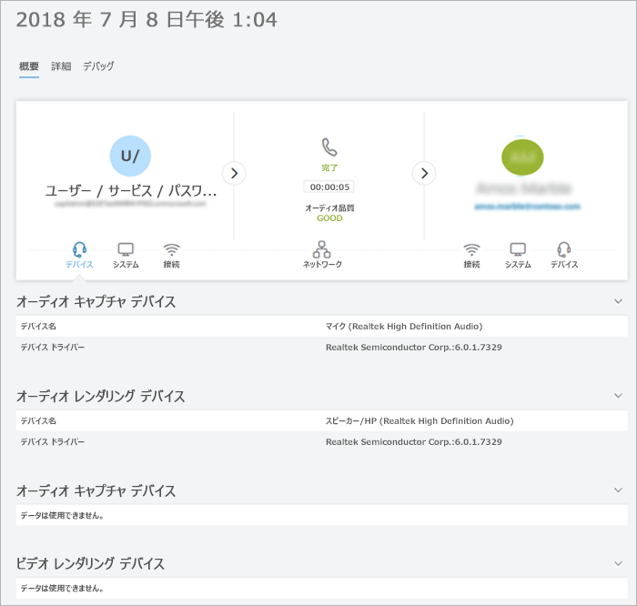

# 通話分析を使用して通話品質の低下をトラブルシューティングする

この記事では、チームの管理者またはチームのコミュニケーションサポートスペシャリストまたはエンジニアの場合に、通話分析を使用して、個々のユーザーに対して、Microsoft Teams の不十分な通話や会議の品質をトラブルシューティングする方法について説明します。

  
## 通話分析のアクセス許可

この記事では、既に通話分析を設定済みであることを前提としています。 まだお持ちでない場合は、「 [Teams での通話分析のセットアップ](set-up-call-analytics.md)」を参照してください。

## 通話分析の概要

通話分析には、Office 365 アカウントの各ユーザーのチームの通話と会議に関する詳細情報が表示されます。 デバイス、ネットワーク、接続性、通話品質についての情報が含まれています (いずれの場合も、通話品質や会議の品質に影響する可能性があります)。 建物、サイト、テナントの情報をアップロードすると、通話と会議ごとにこの情報が表示されます。 通話分析を使用して、ユーザーが不適切な通話や会議の操作を行った理由を確認します。

通話分析では、1人の参加者から2つ目の参加者に、通話や会議の各区間が表示されます。 これらの詳細を分析することで、チーム管理者は問題のある領域を特定し、低品質の根本原因を特定することができます。
   
Teams 管理者として、各ユーザーのすべての通話分析データにアクセスできるようになります。 さらに、Azure Active Directory の役割をサポートスタッフに割り当てることができます。 これらの役割の詳細については、「[サポートおよびヘルプデスクスタッフへのアクセス許可を付与](set-up-call-analytics.md#give-permission-to-support-and-helpdesk-staff)する」を参照してください。 [各チームがどのような役割をサポート](#what-does-each-teams-support-role-do)していても、次のようにしてください。

## ユーザーごとの通話分析を表示する場所

ユーザーのすべての通話情報とデータを表示するには、 [Teams 管理センター](https://admin.teams.microsoft.com)に移動します。 [**ユーザー**] の下でユーザーを選択し、ユーザーのプロファイルページで [**通話履歴**] タブを開きます。 ここでは、過去30日間、そのユーザーのすべての通話と会議が検索されます。

詳細なメディアとネットワークの統計情報など、特定のセッションに関する追加情報を取得するには、セッションをクリックして詳細を表示します。

  
## 各チームはどのような役割をサポートしていますか?

**チームのコミュニケーションサポートスペシャリスト**(Tier 1 のサポート) が、基本的な通話品質の問題を処理します。 会議に関する問題は調査しません。 代わりに、関連情報を収集し、コミュニケーション サポート エンジニアにエスカレートします。 

**Teams 通信サポートエンジニア**(Tier 2 サポート) では、チーム通信サポートスペシャリストから非表示になっている詳細な通話ログに情報が表示されます。 以下の表は、各 Teams コミュニケーションサポートロールで利用できる情報を示しています。

次の表は、各コミュニケーションサポートロールで利用可能なユーザーごとの情報を示しています。

|**アクティビティ**|**詳しく**|コミュニケーションサポート**スペシャリスト**が表示する内容|通信サポート**エンジニア**が見ることができる内容|
|:-----|:-----|:-----|:-----|
|**通話**   |発信者の名前    |エージェントが検索したユーザーの名前のみ。    |ユーザー名。    |
||受信者の名前    |内部ユーザーまたは外部ユーザーとして表示されます。    |受信者の名前。    |
||発信者の電話番号    |最後の3桁を除くすべての電話番号は、アスタリスク記号で隠蔽されています。 たとえば、15552823 * * * とします。    |最後の3桁を除くすべての電話番号は、アスタリスク記号で隠蔽されています。 たとえば、15552823 * * * とします。    |
||受信者の電話番号    |最後の3桁を除くすべての電話番号は、アスタリスク記号で隠蔽されています。 たとえば、15552823 * * * とします。    |最後の3桁を除くすべての電話番号は、アスタリスク記号で隠蔽されています。 たとえば、15552823 * * * とします。    |
||**通話の詳細**  > **[詳細設定**] タブ   |情報は表示されません。    |デバイス名、IP アドレス、サブネットマッピングなど、すべての詳細が表示されます。    |
||**通話の詳細**  > **[詳細設定**  >  ][**デバッグ**] タブ   |情報は表示されません。    |DNS サフィックスや SSID などのすべての詳細が表示されます。    |
|**会議**   |参加者名    |エージェントが検索したユーザーの名前のみ。 内部ユーザーまたは外部ユーザーとして識別された他の参加者。    |すべての名前が表示されます。    |
||参加者数    |参加者の数。    |参加者の数。    |
||セッションの詳細    |例外と共に表示されるセッションの詳細。 エージェントで検索されたユーザーの名前のみが表示されます。 内部ユーザーまたは外部ユーザーとして識別された他の参加者。 アスタリスク記号が付いた、電話番号の最後の3桁が隠蔽されています。    |セッションの詳細が表示されます。 ユーザー名とセッションの詳細が表示されます。 アスタリスク記号が付いた、電話番号の最後の3桁が隠蔽されています。    |
||||
  
## ユーザーの通話品質の問題のトラブルシューティング 

1. Teams 管理センターを開き ( https://admin.teams.microsoft.com) チーム通信サポートまたは teams 管理者の資格情報でサインインします。

2. **ダッシュボード**の [**ユーザー検索**] で、通話のトラブルシューティングを行うユーザーの名前または SIP アドレスの入力を開始するか、[**ユーザーの表示**] を選択してユーザーのリストを表示します。

3. リストからユーザーを選択します。

4. [**通話履歴**] を選択し、トラブルシューティングする通話または会議を選択します。
    
5. [**詳細**] タブを選択して、通話の品質が低下したり、接続の問題が発生していることを示す黄色と赤色アイテムを探します。
    
    各通話や会議のセッションの詳細において、小さな問題は黄色で表示されます。 黄色で表示されているものは、通常の範囲外であり、問題の原因となっている可能性がありますが、この問題の主な原因ではない可能性があります。 赤色の場合は重大な問題であり、このセッションの通話が低品質である主な原因の可能性があります。 
      
まれなケースとして、オーディオセッションの品質エクスペリエンスデータが受信されないことがあります。 多くの場合、これは、ドロップされた通話、またはクライアントとの接続が終了したときに発生します。 このような場合、セッションの評価は**使用**できません。
  
Quality of Experience (QoE) データを持つオーディオセッションについては、次の表では、セッションが**低**品質と見なされる主な問題について説明します。
  
|**問題**|**領域**|**説明**|
|:-----|:-----|:-----|
|通話設定    |セッション    |エラー コード Ms-diag 20-29 は、設定が失敗したことを示します。 ユーザーが通話または会議に参加できませんでした。    |
|音声ネットワークよって低品質と分類された通話    |セッション    |ネットワーク品質の問題 (パケット損失、ジッタ、NMOS 劣化、RTT、隠し比率) が発生しました。    |
|デバイスが機能しない    |デバイス    | デバイスが正常に機能していない。 機能していないデバイスの割合:    DeviceRenderNotFunctioningEventRatio >= 0.005    DeviceCaptureNotFunctioningEventRatio >= 0.005   |
   

## 関連トピック

[ユーザーごとの通話分析を設定する](set-up-call-analytics.md)

  
 
