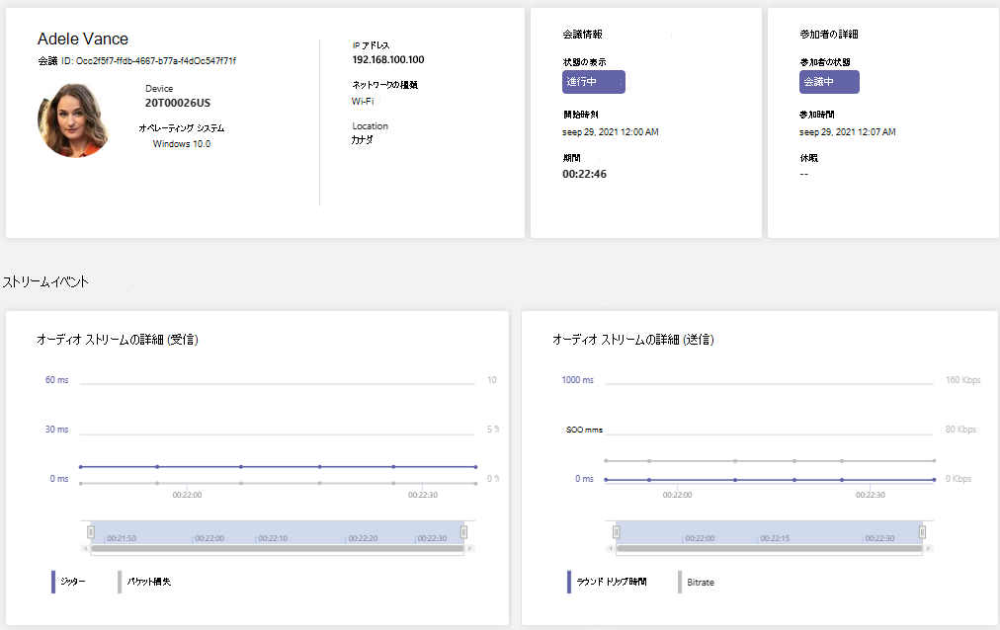

# リアルタイム テレメトリを使用して低品質の会議のトラブルシューティングを行う

> [!NOTE]
> この機能は現在パブリック プレビュー中です。

この記事では、リアルタイム テレメトリを使用して、個々のユーザーの低品質の会議Microsoft Teamsをトラブルシューティングする方法について説明します。 次のいずれかのロールがある場合は、リアルタイム テレメトリを確認できます。

- Teams 管理者
- Teams 通信サポート スペシャリスト
- Teams 通信サポート エンジニア

管理者ロールの詳細についてはTeams管理者ロールを使用した管理Microsoft Teamsを[参照](/MicrosoftTeams/using-admin-roles)Teams。

リアルタイム テレメトリを使用すると、IT 管理者は重要なユーザーのスケジュールされた会議を確認し、音声、ビデオ、コンテンツ共有、ネットワーク関連の問題を確認できます。 管理者は、テレメトリを使用して会議中にこれらの問題を調査し、リアルタイムでトラブルシューティングを行います。

## リアルタイム テレメトリとは

現在、個々の会議のトラブルシューティングは、会議Teams後に通話分析を通じて[管理者が利用](use-call-analytics-to-troubleshoot-poor-call-quality.md)できます。 リアルタイム テレメトリを使用すると、管理者は進行中のスケジュールされた会議のトラブルシューティングを行います。

リアルタイム テレメトリには、リアルタイムで更新された Teams アカウント内の各ユーザーのOffice 365に関する詳細情報が表示されます。 これには、デバイス、ネットワーク、接続、オーディオ、ビデオ、コンテンツ共有の問題に関する情報が含まれます。これは、管理者が通話品質のトラブルシューティングを効果的に行うのに役立ちます。

管理者Teams、各ユーザーのすべてのリアルタイム テレメトリ データにフル アクセスできます。 さらに、Azure Active Directory の役割をサポートスタッフに割り当てることができます。 これらのロールの詳細については、「サポートおよびヘルプ デスクスタッフに [アクセス許可を付与する」を参照してください](set-up-call-analytics.md#give-permission-to-support-and-helpdesk-staff)。

## ユーザーごとのリアルタイム トラブルシューティング テレメトリの場所

ユーザーのすべての会議情報とデータを表示するには、管理センターのTeams[移動します](https://admin.teams.microsoft.com)。 [**ユーザー**  >  **管理ユーザー] で** ユーザーを選択し、ユーザーのプロファイル **ページ**& [通話] タブを開きます。 [**最近の会議**] の下に、ユーザーが過去 24 時間以内に出席した会議の一覧が表示されます。この一覧には、進行中の会議も含め、リアルタイムテレメトリが利用できます。 会議が進行中ではない場合、またはリアルタイムのテレメトリ データが存在しない場合は、[過去の会議] に **表示されます**。

デバイス、ネットワーク、音声の統計情報など、進行中の会議の参加者に関する追加情報を取得するには、[最近の会議] で会議を見つけ、[参加者] 列の下にあるリンク **を選択** します。

デバイス、ネットワーク、音声、ビデオ、コンテンツ共有の詳細に関する情報など、進行中の会議について特定のユーザーのリアルタイム テレメトリを確認するには、[会議 **ID] を選択します**。

## リアルタイム テレメトリでサポートされるプラットフォーム

- Windows
- macOS
- Linux
- Android
- iOS

## Teamsデバイスのリアルタイム テレメトリのサポート

- (香港) - Surface Hub
- [MTR - Teams Display]
- [アクセス設定] - [コラボレーション] バー
- IP 電話 デバイス

## 制限事項

- リアルタイム テレメトリは、スケジュールされた会議でのみ使用できます。 [今すぐ会議]、PSTN、1 対 1 の通話、グループ通話のような臨時の会議では、リアルタイム テレメトリは機能しません。
- リアルタイム テレメトリは、スケジュールされたライブ イベントの発表者にのみ使用できます。 現在、ライブ イベントの出席者は利用できません。
- リアルタイム テレメトリ データは、会議が終了した後24 時間、最近の会議の下の会議で使用できます。 24 時間が過ぎた場合、データにアクセスできないので、会議は [過去の会議] **に移動します**。 会議が 3 時間を超える場合、リアルタイム テレメトリは過去 3 時間のみ *使用できます*。
- テレメトリは、以前のバージョンのアプリケーションではTeams。 利用できるテレメトリがない場合は、クライアントを更新してみてください。
- 外部参加者または匿名ユーザーが会議に参加した場合、表示名はテナント間のプライバシーを保持できないと表示されます。

## 関連項目

[ユーザーごとの呼び出し分析を設定する](set-up-call-analytics.md)

[管理者Microsoft Teamsロールを使用して、 を管理Teams。](/MicrosoftTeams/using-admin-roles)
