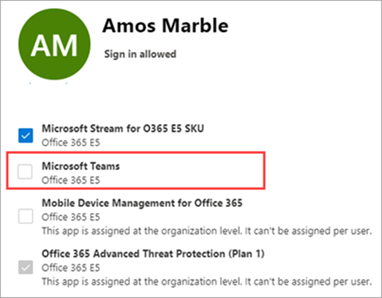

# <a name="manage-user-access-to-teams"></a>Teams へのユーザー アクセスを管理する

ユーザー レベルで Teams へのアクセスを管理するには、Microsoft Teams 製品ライセンスを割り当てるか削除します。 Teams 会議に匿名で参加する場合を除き、組織内の各ユーザーは Teams を使用する前に Teams ライセンスを持っている必要があります。 新しいユーザー アカウントが作成された場合、または既存のアカウントを持つユーザーに Teams ライセンスを割り当てできます。

既定では、ライセンスプラン (Microsoft 365 Enterprise E3 や Microsoft 365 Business Premium など) がユーザーに割り当てられると、Teams のライセンスが自動的に割り当て、ユーザーが Teams に対して有効になります。 いつでもライセンスを削除または割り当てると、ユーザーの Teams を無効または有効にできます。

<a href="https://go.microsoft.com/fwlink/p/?linkid=2024339" target="_blank">Teams</a>管理センターから管理されるメッセージング ポリシーを使用して、Teams のユーザーが利用できるチャットおよびチャネル メッセージング機能を制御します。 既定のポリシーを使用するか、組織内のユーザー用に 1 つ以上のカスタム メッセージング ポリシーを作成できます。 詳細については [、「Teams でメッセージング ポリシーを管理する」を参照してください](messaging-policies-in-teams.md)。
Teams のライセンスは、Microsoft 365 管理センターまたは PowerShell を使用して管理します。 ライセンスを管理するには、グローバル管理者またはユーザー管理管理者である必要があります。

> [!NOTE]
> チームをプロジェクトや他の動的なイニシアティブに対して有機的に形成できるよう、すべてのユーザーに Teams を有効にすることをお勧めします。 パイロットを実行している場合でも、Teams をすべてのユーザーに対して有効に保ち、パイロット グループのユーザーへの通信のみを対象とすると役に立つ場合があります。

## <a name="using-the-microsoft-365-admin-center"></a>Microsoft 365 管理センターを使用する

Teams のユーザー レベル ライセンスは、Microsoft 365 管理センターのユーザー管理インターフェイスを通じて直接管理されます。 管理者は、新しいユーザー アカウントを作成するときに、または既存のアカウントを持つユーザーにライセンスを割り当てできます。 

> [!IMPORTANT]
> Microsoft Teams ライセンスを管理するには、管理者にグローバル管理者またはユーザー管理管理者の権限が必要です。
Microsoft 365 管理センターを使用して、個々のユーザーまたは一度に少人数のユーザーの Teams ライセンスを管理します。 Teams のライセンスは、[ライセンス] ページ (同時に最大 20 人のユーザー) または [アクティブなユーザー]**ページで管理** できます。 選択する方法は、特定のユーザーの製品ライセンスを管理するか、特定の製品のユーザー ライセンスを管理するかによって異なります。

数百から数千のユーザーなど、多数のユーザーの Teams ライセンスを管理する必要がある場合は[、PowerShell または Azure Active Directory (Azure AD)](/azure/active-directory/users-groups-roles/licensing-groups-assign)で[PowerShell](#using-powershell)またはグループベースのライセンスを使用します。 

### <a name="assign-a-teams-license"></a>Teams ライセンスを割り当てる

手順は、[ライセンス] ページと [アクティブなユーザー] ページの違い **によって異** なります。  詳しい手順については、「ライセンスをユーザーに割り当てる [」を参照してください](/microsoft-365/admin/manage/assign-licenses-to-users)。

|||
|---------|---------|
|    |         |

### <a name="remove-a-teams-license"></a>Teams のライセンスを削除する

> [!IMPORTANT]
> Teams SKU を無効にして有効にするのに約 24 時間かかります。

ユーザーから Teams ライセンスを削除すると、そのユーザーの Teams は無効になり、アプリ起動ツールまたはホーム ページに Teams が表示されなくなりました。 詳細な手順については、「ユーザーからのライセンス [の割り当て解除」を参照してください](/microsoft-365/admin/manage/remove-licenses-from-users)。

|||
|---------|---------|
|    |         |

## <a name="using-powershell"></a>PowerShell の使用

PowerShell を使用して、ユーザーの Teams ライセンスを一括で管理します。 他のサービス プラン ライセンスの場合と同じ方法で、PowerShell を使用して Teams を有効または無効にします。 Teams のサービス プランの識別子が必要です。これは次のとおりです。

- Microsoft Teams: TEAMS1
- Microsoft Teams for GCC: TEAMS_GOV
- Microsoft Teams for DoD: TEAMS_DOD

### <a name="assign-teams-licenses-in-bulk"></a>Teams ライセンスを一括で割り当てる

詳細な手順については、「PowerShell でライセンスをユーザー アカウントに割 [り当てる」を参照してください](/office365/enterprise/powershell/assign-licenses-to-user-accounts-with-office-365-powershell)。

### <a name="remove-teams-licenses-in-bulk"></a>Teams のライセンスを一括で削除する

詳細な手順については [、「PowerShell](/office365/enterprise/powershell/disable-access-to-services-with-office-365-powershell) を使用してサービスへのアクセスを無効にする」および「ユーザー ライセンスの割り当て中にサービスへのアクセス [を無効にする」を参照してください](/office365/enterprise/powershell/disable-access-to-services-while-assigning-user-licenses)。

#### <a name="example"></a>例 

次に示すのは [、New-MsolLicenseOptions](/powershell/module/msonline/new-msollicenseoptions) コマンドレットと [Set-MsolUserLicense](/powershell/module/msonline/set-msoluserlicense) コマンドレットを使用して、特定のライセンスプランを持つユーザーの Teams を無効にする方法の例です。 たとえば、次の手順に従って、特定のライセンス プランを持つすべてのユーザーに対して Teams を無効にします。 次に、Teams にアクセスする必要がある個々のユーザーごとに Teams を有効にしてください。

> [!IMPORTANT]
> [New-MsolLicenseOptions](/powershell/module/msonline/new-msollicenseoptions)コマンドレットは、カスタム スクリプトで明示的に識別されない限り、以前に無効にされたすべてのサービスを有効にします。 たとえば、Exchange と Sway の両方を無効にして Teams を無効にする場合は、スクリプトにこの設定を含める必要があります。または、Exchange と Sway の両方が、特定したユーザーに対して有効になります。

次のコマンドを実行して、組織内で利用可能なすべてのライセンスプランを表示します。 詳細については [、「PowerShell でライセンスとサービスを表示する」を参照してください](/office365/enterprise/powershell/view-licenses-and-services-with-office-365-powershell)。


```powershell
Get-MsolAccountSku
```

前の手順で取得したライセンス計画の組織名と識別子は、次の \<CompanyName:License> コマンドを実行します。 たとえば、ContosoSchool:ENTERPRISEPACK_STUDENT。

```powershell
$acctSKU="<CompanyName:License>
$x = New-MsolLicenseOptions -AccountSkuId $acctSKU -DisabledPlans "TEAMS1"
```

次のコマンドを実行して、ライセンス プランのアクティブなライセンスを持つすべてのユーザーに対して Teams を無効にします。

```powershell
Get-MsolUser | Where-Object {$_.licenses[0].AccountSku.SkuPartNumber -eq  ($acctSKU).Substring($acctSKU.IndexOf(":")+1,  $acctSKU.Length-$acctSKU.IndexOf(":")-1) -and $_.IsLicensed -eq $True} |  Set-MsolUserLicense -LicenseOptions $x
```

## <a name="related-topics"></a>関連項目

- [Teams アドオン ライセンス](teams-add-on-licensing/microsoft-teams-add-on-licensing.md)
- [Teams アドオン ライセンスを割り当てる](teams-add-on-licensing/assign-teams-add-on-licenses.md)
- [PowerShell でライセンスとサービスを表示する](/office365/enterprise/powershell/view-licenses-and-services-with-office-365-powershell)
- [ライセンスのための製品名とサービス プラン識別子](/azure/active-directory/users-groups-roles/licensing-service-plan-reference)
- [Education SKU リファレンス](sku-reference-edu.md)
