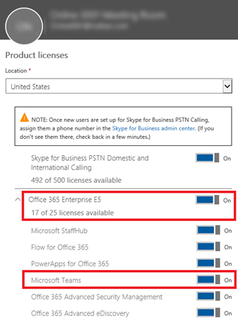
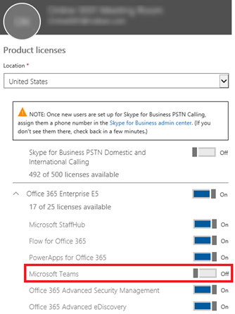

Microsoft Teams へのユーザー アクセスを管理するManage user access to Microsoft Teams
=====================================

Microsoft Teams へのユーザーレベルのアクセスは、Microsoft Teams 製品ライセンスの割り当てと削除によってユーザーごとに有効化または無効化することができます。At the user-level, access to Microsoft Teams can be enabled of disabled on a per-user basis by assigning or removing the Microsoft Teams product license.

現時点では、ライセンス以外の手段を使用して、個々のユーザーの Microsoft Teams または Microsoft Teams 機能のサブセットをオンまたはオフにするポリシー オプションはありません。Currently, there are no policy options for turning Microsoft Teams, or a subset of Microsoft Teams features on or off at an individual user level outside of licensing.

| | |
|---------|---------|
|  注意Note |会社のすべてのユーザーに対して Microsoft Teams を有効にすることをお勧めします。そうすることで、プロジェクトやその他の動的なイニシアチブで組織的にチームを編成することが可能になります。パイロットを行う場合でも、すべてのユーザーで Microsoft Teams を有効のままにしておき、パイロット グループのユーザーに対してのみ通信を行うことができます。Microsoft recommends that Microsoft Teams is enabled for all users in a company so that teams can be formed organically for projects and other dynamic initiatives. Even if you are deciding to pilot, it may still be helpful to keep Microsoft Teams enabled for all users, but only target communications to the pilot group of users. |

Microsoft Teams のユーザーレベルのライセンスは Office 365 管理センターのユーザー管理インターフェースから直接行います。管理者は、新しいユーザー アカウントを作成するときに新しいユーザーにライセンスを割り当てたり、既存のアカウントのユーザーにライセンスを割り当てることができます。Microsoft Teams のライセンスを管理する管理者は Office 365 グローバル管理またはユーザー管理の管理者の権限が必要です。Microsoft Teams user-level licenses are managed directly through the Office 365 admin center user management interfaces. An administrator can assign licenses to new users when new user accounts are created, or to users with existing accounts. The administrator must have Office 365 Global Administrator or User Management Administrator privileges to manage Microsoft Teams licenses.

E3 または E5 といったライセンス SKU をユーザーに割り当てる場合、Microsoft Teams ライセンスが自動的に割り当てられ、そのユーザーには Microsoft Teams が有効化されます。管理者はすべての Office 365 サービスとライセンスを細かく制御できます。特定のユーザーまたはグループの Microsoft Teams ライセンスを有効または無効にすることができます。When a license SKU like E3 or E5 is assigned to a user, a Microsoft Teams license is automatically assigned, and the user is enabled for Microsoft Teams. Administrators can have a granular control over all the Office 365 services and licenses, and the Microsoft Teams license for a specific user or a group of users can be enabled or disabled.

  

Microsoft Teams のユーザー ライセンスはいつでも無効にできます。いったん無効にすると、そのユーザーは Microsoft Teams にアクセスできなくなり、Office 365 アプリのランチャーやホームページで Microsoft Teams を表示できなくなります。A Microsoft Teams user license can be disabled at any time. Once the license is disabled, the users access to Microsoft Teams will be prevented and the user will no longer be able to see Microsoft Teams in the Office 365 app launcher and homepage.

Office 365 の管理者は、Office 365 管理センターに加えて、Office 365 PowerShell を使用してもライセンスの割り当てと割り当て解除を行うことができます。ユーザーにライセンスを割り当てるには、次の構文を使用します。In addition to using the Office 365 admin center, Office 365 admins can also use Office 365 PowerShell to assign and remove licenses. To assign a license to a user, use the following syntax:

Set-MsolUserLicense -UserPrincipalName "\<Account\>" -AddLicenses "\<AccountSkuId\>"Set-MsolUserLicense -UserPrincipalName "\<Account\>" -AddLicenses "\<AccountSkuId\>"

次の例では、litwareinc:ENTERPRISEPACK (Office 365 Enterprise E3) ライセンス プランのライセンスを、ライセンスのないユーザー belindan@litwareinc.com に割り当てます。The following example assigns a license from the litwareinc:ENTERPRISEPACK (Office 365 Enterprise E3) licensing plan to the unlicensed user belindan@litwareinc.com.

Set-MsolUserLicense -UserPrincipalName "belindan@litwareinc.com" -AddLicenses "litwareinc:ENTERPRISEPACK"Set-MsolUserLicense -UserPrincipalName "belindan@litwareinc.com" -AddLicenses "litwareinc:ENTERPRISEPACK"

詳細と例については、「[*Office 365 PowerShell を使用してライセンスをユーザー アカウントに割り当てる*](https://go.microsoft.com/fwlink/?linkid=855755)」をご覧ください。For more details and examples, see [*Assign licenses to user accounts with Office 365 PowerShell*](https://go.microsoft.com/fwlink/?linkid=855755).

既存のユーザー アカウントからライセンスを割り当て解除するには、次の構文を使用します。To remove licenses from an existing user account, use the following syntax:

Set-MsolUserLicense -UserPrincipalName \<Account\> -RemoveLicenses "\<AccountSkuId1\>", "\<AccountSkuId2\>"Set-MsolUserLicense -UserPrincipalName \<Account\> -RemoveLicenses "\<AccountSkuId1\>", "\<AccountSkuId2\>"

次の例では、litwareinc:ENTERPRISEPACK (Office 365 Enterprise E3) ライセンスを、ユーザー アカウントBelindaN@litwareinc.com から割り当て解除します。The following example removes the litwareinc:ENTERPRISEPACK (Office 365 Enterprise E3) license from the user account BelindaN@litwareinc.com.

Set-MsolUserLicense -UserPrincipalName belindan@litwareinc.com -RemoveLicenses "litwareinc:ENTERPRISEPACK"Set-MsolUserLicense -UserPrincipalName belindan@litwareinc.com -RemoveLicenses "litwareinc:ENTERPRISEPACK"

詳細と例については、「[*Office 365 PowerShell を使用してライセンスをユーザー アカウントから割り当て解除する*](https://go.microsoft.com/fwlink/?linkid=855756)」をご覧ください。For more details and examples, see [*Remove licenses from user accounts with office 365 PowerShell*](https://go.microsoft.com/fwlink/?linkid=855756).

| | | |
|---------|---------|---------|
|     |判断ポイントDecision Point         |<ul><li>組織全体での Microsoft Teams への関与を促進するための計画を教えてください (パイロットまたはオープン)。What is your organization’s plan for Microsoft Teams onboarding across the organization?  (Pilot or Open)</li></ul>         |
|     |次のステップNext Steps         |<ul><li>閉じられたパイロットで関与促進を行う場合は、ライセンスまたは対象を絞った通信のいずれかの手段で実施するかを決定します。If onboarding via a closed Pilot, decide if you would like to do so via licensing, or targetted communication.</li><li>この決定に応じて、Microsoft Teams へのアクセスが許可されているユーザーがパイロット ユーザーのみであることを確認する手順を行います (必要な場合)。Depending on decision, take steps to make sure only Pilot users who are allowed to access Microsoft Teams (if needed).</li><li>次の資料を使用して、Microsoft Teams にアクセスできる (またはアクセスできない) ユーザー向けのガイドラインを文書化します。Document the guidelines for which users who will (or will not) have access to Microsoft Teams below.</li></ul>         |
