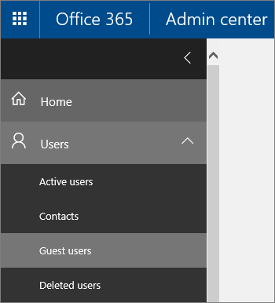

チームのゲスト ユーザーを表示するView guest users in a team
==========================
チーム内のすべてのユーザーは、マイクロソフトのチームで**管理チーム**を使用して、来園者を含め、チームのすべてのメンバーを参照してくださいことができます。Anyone in a team can see all members of a team, including guests, via **Manage team** in Microsoft Teams.  詳細については、[チームまたはチャネルでは、ユーザーを参照してください](https://support.office.com/article/see-who-s-on-a-team-or-in-a-channel-5c6be9be-9c45-4a0f-a1a0-f332b23cb6b7)。[See who's on a team or in a channel ](https://support.office.com/article/see-who-s-on-a-team-or-in-a-channel-5c6be9be-9c45-4a0f-a1a0-f332b23cb6b7) has more details.

管理者として、テナントにゲスト ユーザーを表示するのには Office 365 の管理センターを使用できます。As an admin, you can use the Office 365 Admin center to view guest users in the tenant. ただし、表示*すべて*ゲスト ユーザーのテナントでマイクロソフトのチームのゲスト ユーザーだけでなく。However, this view shows *all* guest users in the tenant,  not just guest users in Microsoft Teams.
1. Office 365 のグローバル管理者アカウントを使用してサインイン[https://portal.office.com/adminportal/home](https://portal.office.com/adminportal/home)。Sign in with your Office 365 global admin account at [https://portal.office.com/adminportal/home](https://portal.office.com/adminportal/home).
2. [**ユーザー**]  >  [**ゲスト ユーザー**] に移動します。Go to **Users** > **Guest users**.

  
