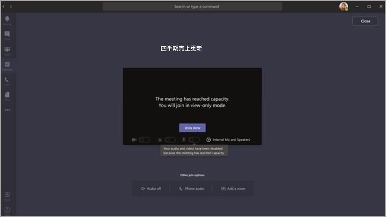

# <a name="teams-view-only-meeting-experience"></a>Teams の表示限定の会議エクスペリエンス

> [!Note]
> 表示限定のブロードキャストは、Microsoft 365 E3/E5 および Microsoft 365 A3/A5 で利用できます。 この機能は2021 年 3 月 1 日に有効になりますが、既定でオフになっています。 Microsoft 365 Government Community Cloud (GCC) の機能は、2021 年 3 月末にロールアウトが開始される予定です。 Government Community Cloud High (GCCH) と Department of Defense (DoD) は後日ロールアウトされる予定です。 この機能を既定でオンにしたい場合は、その日付以降に既定のポリシーを変更する必要があります。 PowerShell を使用して、ポリシー`Set-CsTeamsMeetingPolicy -Identity Global -StreamingAttendeeMode Enabled`を有効にする。

> [!Note]
> 会議やウェビナーが容量を超えた場合、Teams は 10,000 人に対応できる表示限定のブロードキャスト エクスペリエンスにシームレスに拡大縮小されます。 さらに、リモート 作業が増加したこの期間中は、今年の終わりまでさらに大規模な 20,000 人のブロードキャストを利用することができます。

Microsoft Teams では、最大 10,000 人の参加者がTeams 会議に参加できます。 メイン会議の容量に達すると (1,000 人のユーザーが会議に入った場合)、追加の出席者が表示専用のエクスペリエンスで参加します。

メイン会議の容量まで、最初に会議に参加する出席者は、会議の完全なTeamsを取得します。 音声とビデオの共有、共有ビデオの表示、会議チャットへの参加ができます。

主要な会議の容量に達した後に参加する出席者には、表示限定のエクスペリエンスを利用できます。

出席者は、デスクトップ、Web、モバイル (Android および iOS) を通じてTeamsエクスペリエンスに参加できます。

> [!Note]
> "メイン会議" の現在の制限容量、つまり、完全に対話的なユーザーの数は 1000 であり、GCC。

## <a name="teams-view-only-experience-controls"></a>Teamsのエクスペリエンス コントロール

PowerShell を使用して、表示専用エクスペリエンスを有効にできます。

```PowerShell
Set-CsTeamsMeetingPolicy -Identity Global -StreamingAttendeeMode Enabled
```

表示専用のエクスペリエンスを無効にするには、PowerShell を使用できます。

```PowerShell
Set-CsTeamsMeetingPolicy -Identity Global -StreamingAttendeeMode Disabled
```

今後は、管理センターで表示専用のエクスペリエンスを有効またはTeamsできます。

## <a name="impact-to-users"></a>ユーザーへの影響

ユーザーのエクスペリエンスは、いくつかの要因によって異なります。

メイン会議の容量に達すると、次の場合、出席者は会議に参加できません。

- 管理者が、開催者またはTeamsのビュー専用エクスペリエンスを無効にしました。
- 表示専用の出席者はロビーをバイパスできない。 たとえば、会議の開催者が自分の組織内のユーザーだけがロビーをバイパスし、組織外の出席者がビュー専用の出席者として参加しようとした場合、参加者は参加できます。

メイン会議の容量に達すると、会議の開催者と発表者には、新しい出席者が表示専用の出席者として参加すると通知するバナーが表示されます。

  

メイン会議の容量に達すると、会議の出席者は参加前の画面で、表示限定モードで参加しているという通知が表示されます。

  

スペースがある場合は、ユーザーは常にメイン会議に参加します。 メイン会議が容量に達してから、1 人または複数の出席者がメイン会議を離れると、メイン会議には利用可能な容量ができます。 会議に参加 (または再参加) した出席者は、再び容量に達するまでメイン会議に参加します。 表示専用のエクスペリエンスに参加している出席者は、メイン会議に自動的に昇格されません。また、手動でメイン会議に昇格することはできません。

発表者と出席者の役割が設定され、発表者がメイン会議の容量に達した後に会議への参加を試みる場合、発表者は表示専用の出席者として参加し、他の表示専用出席者と同じ制限を持つ。 すべての発表者がメイン会議に参加するためのサポートは、後日展開されます。 開催者は、常にメイン会議のスペースが保証されます。

## <a name="impact-to-meeting-presenters-and-organizers"></a>発表者と開催者との会議への影響

会議の発表者と開催者の制限事項は次のとおりです。

- 表示限定の出席者に関する情報はありません。 E-Discovery は、表示限定の出席者に対してサポートしません。
- メイン会議のユーザーは、表示専用の出席者を表示できない。
- 会議から表示限定の出席者を削除できません。

> [!Note]
> 出席者数には、メイン会議の参加者だけが反映され、表示専用ルームのユーザーは反映されません。 そのため、発表者は、表示限定エクスペリエンスのユーザー数を正確にカウントすることができません。

## <a name="experience-for-view-only-attendees"></a>表示限定出席者のエクスペリエンス

Teams の表示限定エクスペリエンスでは、参加者は次の機能を利用できます。

- Teams のメイン会議の参加者の話を聞きます。
- アクティブなスピーカーのビデオ フィードを見ます (アクティブなスピーカーがビデオを共有している場合)。
- 共有デスクトップまたは画面機能を使用して、共有されているコンテンツを確認します。

表示限定出席者は、会議で次のオプションを利用できません。

- 設定したロビー ポリシーまたはオプションに基づく、ロビーをバイパスするアクセス許可を持っていてない場合は、会議に参加すること。
- オーディオ会議を使用して、表示限定の部屋に参加すること。
- クラウド システムまたは Cloud Video Interop (CVI) サービスMicrosoft Teams ミーティング使用して、ビュー専用のルームに参加します。
- オーディオまたはビデオを共有すること。
- 会議チャットを参照または参加すること。
- 参加者がアクティブな発表者でない場合は、会議参加者のビデオ フィードを参照すること。
- 「PowerPoint Live 機能または個々のアプリケーション共有 (デスクトップPowerPoint画面共有以外) を使用して共有されているファイルの一覧を参照してください。
- 会議で手を挙げる。
- 反応を送信または表示します。
- 投票を含む、Teams 3P アプリと対話します。

## <a name="view-only-feature-limitations"></a>表示限定機能の制限

- 表示専用の出席者は、デスクトップと Web でのみライブ キャプションを表示できます。 現時点でサポートされているのは英語のキャプションのみです。
- 表示限定の出席者はストリーミング テクノロジでサポートされます。
- 参加レポートには、表示限定の出席者は含まれません。
- 表示限定の出席者は、1 つのビデオ機能を利用できます。 アクティブな発表者を見ること、または共有されているコンテンツの閲覧はできますが、両方はできません。
- 現在、**ギャラリー**、 **大きなギャラリー**、または表示限定の出席者用の **Together モード** レイアウトはサポートされていません。  
- 表示限定の出席者は、通常の出席者と同じ待機時間ではありません。 <sup>1</sup>

  <sup>1</sup> 表示限定の出席者は、会議で 30 秒のビデオと音声の遅延が発生します。  
