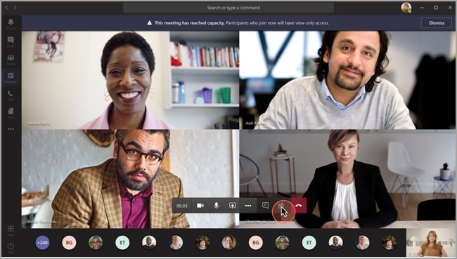
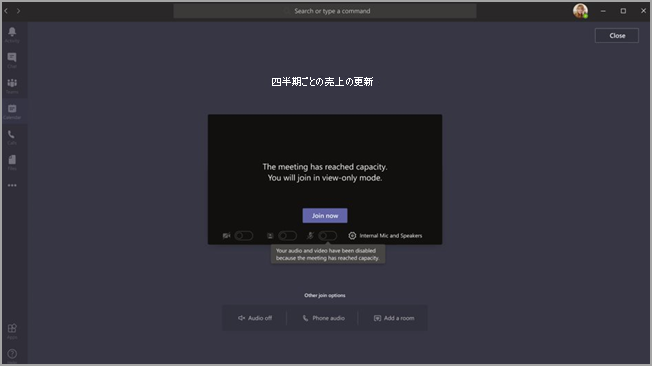

# <a name="teams-view-only-meeting-experience"></a><span data-ttu-id="477fb-103">Teams の表示限定の会議エクスペリエンス</span><span class="sxs-lookup"><span data-stu-id="477fb-103">Teams view-only meeting experience</span></span>

> [!Note]
> <span data-ttu-id="477fb-104">表示限定のブロードキャストは、Microsoft 365 E3/E5 および Microsoft 365 A3/A5 で利用できます。</span><span class="sxs-lookup"><span data-stu-id="477fb-104">View-only broadcasts is available in Microsoft 365 E3/E5 and Microsoft 365 A3/A5.</span></span> <span data-ttu-id="477fb-105">この機能は2021 年 3 月 1 日に有効になりますが、既定でオフになっています。</span><span class="sxs-lookup"><span data-stu-id="477fb-105">This feature will be enabled March 1, 2021 as default OFF.</span></span> <span data-ttu-id="477fb-106">Microsoft 365 Government Community Cloud (GCC) の機能は、2021 年 3 月末にロールアウトが開始される予定です。</span><span class="sxs-lookup"><span data-stu-id="477fb-106">The feature in Microsoft 365 Government Community Cloud (GCC) will begin to roll out at the end of March 2021.</span></span> <span data-ttu-id="477fb-107">Government Community Cloud High (GCCH) と Department of Defense (DoD) は後日ロールアウトされる予定です。</span><span class="sxs-lookup"><span data-stu-id="477fb-107">Government Community Cloud High (GCCH) and Department of Defense (DoD) will roll out at a later date.</span></span> <span data-ttu-id="477fb-108">この機能を既定でオンにしたい場合は、その日付以降に既定のポリシーを変更する必要があります。</span><span class="sxs-lookup"><span data-stu-id="477fb-108">You must change the default policy after that date if you want to have the feature be default ON.</span></span> <span data-ttu-id="477fb-109">PowerShell を使用して、ポリシー`Set-CsTeamsMeetingPolicy -Identity Global -StreamingAttendeeMode Enabled`を有効にする。</span><span class="sxs-lookup"><span data-stu-id="477fb-109">Use PowerShell to enable the policy `Set-CsTeamsMeetingPolicy -Identity Global -StreamingAttendeeMode Enabled`.</span></span>

> [!Note]
> <span data-ttu-id="477fb-110">会議やウェビナーが容量を超えた場合、Teams は 10,000 人に対応できる表示限定のブロードキャスト エクスペリエンスにシームレスに拡大縮小されます。</span><span class="sxs-lookup"><span data-stu-id="477fb-110">If your meeting or webinar hits capacity, Teams will seamlessly scale to accommodate a 10,000-person view-only broadcast experience.</span></span> <span data-ttu-id="477fb-111">さらに、リモート 作業が増加したこの期間中は、今年の終わりまでさらに大規模な 20,000 人のブロードキャストを利用することができます。</span><span class="sxs-lookup"><span data-stu-id="477fb-111">Plus, during this time of increased remote work, take advantage of even larger 20,000-person broadcasts through the end of this year.</span></span>

<span data-ttu-id="477fb-112">Microsoft Teams では、最大 10,000 人の参加者がTeams 会議に参加できます。</span><span class="sxs-lookup"><span data-stu-id="477fb-112">Microsoft Teams allows up to 10,000 attendees to join a Teams meeting.</span></span> <span data-ttu-id="477fb-113">メイン会議の容量に達すると (300 人のユーザーが会議に参加すると)、追加の出席者がビュー専用のエクスペリエンスで参加します。</span><span class="sxs-lookup"><span data-stu-id="477fb-113">After the capacity of the main meeting has been reached (which is when 300 users enter a meeting), additional attendees will join with a view-only experience.</span></span>

<span data-ttu-id="477fb-114">最初に会議に参加する出席者は、メイン会議の容量まで、Teams の完全な会議エクスペリエンスを取得します。</span><span class="sxs-lookup"><span data-stu-id="477fb-114">Attendees who join the meeting first, up to the capacity of the main meeting, will get the full Teams meeting experience.</span></span> <span data-ttu-id="477fb-115">音声とビデオの共有、共有ビデオの表示、会議チャットへの参加ができます。</span><span class="sxs-lookup"><span data-stu-id="477fb-115">They can share audio and video, see shared videos, and participate in meeting chat.</span></span>

<span data-ttu-id="477fb-116">主要な会議の容量に達した後に参加する出席者には、表示限定のエクスペリエンスを利用できます。</span><span class="sxs-lookup"><span data-stu-id="477fb-116">Attendees who join after the main meeting capacity has been reached will have a view-only experience.</span></span>

<span data-ttu-id="477fb-117">出席者は、デスクトップ、Web、Teams モバイル (Android および iOS) を通じてビュー専用エクスペリエンスに参加できます。</span><span class="sxs-lookup"><span data-stu-id="477fb-117">Attendees will be able to join the view-only experience through desktop, web, and Teams mobile (Android and iOS).</span></span>

> [!Note]
> <span data-ttu-id="477fb-118">"メイン 会議" の現在の制限容量、つまり、完全に対話的なユーザーの数は 300 です。</span><span class="sxs-lookup"><span data-stu-id="477fb-118">The current limit capacity of the "main meeting", or in other words, the number of fully interactive users, is 300.</span></span>

## <a name="teams-view-only-experience-controls"></a><span data-ttu-id="477fb-119">Teams の表示専用エクスペリエンス コントロール</span><span class="sxs-lookup"><span data-stu-id="477fb-119">Teams view-only experience controls</span></span>

<span data-ttu-id="477fb-120">PowerShell を使用してビュー専用エクスペリエンスを有効にできます。</span><span class="sxs-lookup"><span data-stu-id="477fb-120">You enable the view-only experience using PowerShell.</span></span>

```PowerShell
Set-CsTeamsMeetingPolicy -Identity Global -StreamingAttendeeMode Enabled
```

<span data-ttu-id="477fb-121">表示専用エクスペリエンスを無効にするには、PowerShell を使用できます。</span><span class="sxs-lookup"><span data-stu-id="477fb-121">To disable the view-only experience, you can also use PowerShell.</span></span>

```PowerShell
Set-CsTeamsMeetingPolicy -Identity Global -StreamingAttendeeMode Disabled
```

<span data-ttu-id="477fb-122">今後は、Teams 管理センターでビュー専用エクスペリエンスを有効または無効にできます。</span><span class="sxs-lookup"><span data-stu-id="477fb-122">In the future, you'll be able to enable or disable the view-only experience in the Teams admin center.</span></span>

## <a name="impact-to-users"></a><span data-ttu-id="477fb-123">ユーザーへの影響</span><span class="sxs-lookup"><span data-stu-id="477fb-123">Impact to users</span></span>

<span data-ttu-id="477fb-124">ユーザーのエクスペリエンスは、いくつかの要因によって異なります。</span><span class="sxs-lookup"><span data-stu-id="477fb-124">A user's experience will vary depending on several factors.</span></span>

<span data-ttu-id="477fb-125">メイン会議の容量に達すると、次の場合、出席者は会議に参加できません。</span><span class="sxs-lookup"><span data-stu-id="477fb-125">When the capacity of the main meeting has been reached, an attendee will be unable to join the meeting if any of the following are true:</span></span>

- <span data-ttu-id="477fb-126">管理者は、オーガナイザーまたはテナント全体に対して Teams ビュー専用エクスペリエンスを無効にしました。</span><span class="sxs-lookup"><span data-stu-id="477fb-126">An administrator has disabled the Teams view-only experience for either the organizer or for the entire tenant.</span></span>
- <span data-ttu-id="477fb-127">ビュー専用の出席者は、ロビーをバイパスできない。</span><span class="sxs-lookup"><span data-stu-id="477fb-127">The view-only attendee can't bypass the lobby.</span></span> <span data-ttu-id="477fb-128">たとえば、会議の開催者が自分の組織内の人だけがロビーをバイパスし、組織外の出席者がビュー専用の出席者として参加しようとすると、参加できない場合があります。</span><span class="sxs-lookup"><span data-stu-id="477fb-128">As an example, if an organizer of a meeting chooses to have only **People in my organization** bypass the lobby, and an attendee who is outside of the organization attempts to join as a view-only attendee, they won't be able to join.</span></span>

<span data-ttu-id="477fb-129">メイン会議の容量に達すると、会議の開催者と発表者に、新しい出席者がビュー専用の出席者として参加する通知バナーが表示されます。</span><span class="sxs-lookup"><span data-stu-id="477fb-129">When the capacity of the main meeting has been reached, the meeting organizer and presenters will see a banner informing them that new attendees will join as view-only attendees.</span></span>

  

<span data-ttu-id="477fb-131">メイン会議の容量に達すると、会議の出席者は参加前の画面で、表示限定モードで参加しているという通知が表示されます。</span><span class="sxs-lookup"><span data-stu-id="477fb-131">When the capacity of the main meeting has been reached, meeting attendees will be informed on the pre-join screen that they're joining in view-only mode.</span></span>

  

<span data-ttu-id="477fb-133">スペースがある場合は、ユーザーは常にメイン会議に参加します。</span><span class="sxs-lookup"><span data-stu-id="477fb-133">If there's space, a user will always join the main meeting.</span></span> <span data-ttu-id="477fb-134">メイン会議が容量に達してから、1 人または複数の出席者がメイン会議を離れると、メイン会議には利用可能な容量ができます。</span><span class="sxs-lookup"><span data-stu-id="477fb-134">If the main meeting reaches capacity, and one or more attendees leave the main meeting, the main meeting has available capacity.</span></span> <span data-ttu-id="477fb-135">会議に参加 (または再参加) した出席者は、再び容量に達するまでメイン会議に参加します。</span><span class="sxs-lookup"><span data-stu-id="477fb-135">Attendees who join (or rejoin) the meeting will join the main meeting until it reaches capacity again.</span></span> <span data-ttu-id="477fb-136">ビュー専用エクスペリエンスに参加している出席者は、メイン会議に自動的に昇格されません。メイン会議に手動で昇格することはできません。</span><span class="sxs-lookup"><span data-stu-id="477fb-136">Attendees who are in the view-only experience won't automatically be promoted to the main meeting and can't be manually promoted to the main meeting.</span></span>

<span data-ttu-id="477fb-137">発表者と出席者のロールが設定され、発表者がメイン会議の容量に達した後に会議に参加しようとすると、その参加者はビュー専用の出席者として参加し、他のビュー専用出席者と同じ制限を持つ。</span><span class="sxs-lookup"><span data-stu-id="477fb-137">If presenter and attendee roles have been set, and a presenter attempts to join a meeting after the main meeting has reached capacity, they'll join as a view-only attendee and have the same limitations as other view-only attendees.</span></span> <span data-ttu-id="477fb-138">すべての発表者がメイン会議に参加するためのサポートは、後日展開されます。</span><span class="sxs-lookup"><span data-stu-id="477fb-138">Support to ensure all presenters join the main meeting will roll out at a later date.</span></span> <span data-ttu-id="477fb-139">開催者は、常にメイン会議のスペースが保証されます。</span><span class="sxs-lookup"><span data-stu-id="477fb-139">The organizer will always be guaranteed space in the main meeting.</span></span>

## <a name="impact-to-meeting-presenters-and-organizers"></a><span data-ttu-id="477fb-140">発表者と開催者の会議への影響</span><span class="sxs-lookup"><span data-stu-id="477fb-140">Impact to meeting presenters and organizers</span></span>

<span data-ttu-id="477fb-141">会議の発表者と開催者の制限事項は次のとおりです。</span><span class="sxs-lookup"><span data-stu-id="477fb-141">Limitations for meeting presenters and organizers include:</span></span>

- <span data-ttu-id="477fb-142">表示限定の出席者に関する情報はありません。</span><span class="sxs-lookup"><span data-stu-id="477fb-142">You'll have no information about the view-only attendee.</span></span> <span data-ttu-id="477fb-143">E-Discovery は、表示限定の出席者に対してサポートしません。</span><span class="sxs-lookup"><span data-stu-id="477fb-143">We don't support E-discovery for view-only attendees.</span></span>
- <span data-ttu-id="477fb-144">メイン会議のユーザーには、ビュー専用の出席者が表示されます。</span><span class="sxs-lookup"><span data-stu-id="477fb-144">Users in the main meeting can't see the view-only attendees.</span></span>
- <span data-ttu-id="477fb-145">会議から表示限定の出席者を削除できません。</span><span class="sxs-lookup"><span data-stu-id="477fb-145">You can't remove a view-only attendee from the meeting.</span></span>

> [!Note]
> <span data-ttu-id="477fb-146">出席者数はメイン会議のユーザーのみを反映し、ビュー専用ルームのユーザーは反映されません。</span><span class="sxs-lookup"><span data-stu-id="477fb-146">Attendee count will only reflect the people in the main meeting and not the people in the view-only room.</span></span> <span data-ttu-id="477fb-147">そのため、発表者は、表示限定エクスペリエンスのユーザー数を正確にカウントすることができません。</span><span class="sxs-lookup"><span data-stu-id="477fb-147">Therefore, presenters can't get an exact count of who is in the view-only experience.</span></span>

## <a name="experience-for-view-only-attendees"></a><span data-ttu-id="477fb-148">表示限定出席者のエクスペリエンス</span><span class="sxs-lookup"><span data-stu-id="477fb-148">Experience for view-only attendees</span></span>

<span data-ttu-id="477fb-149">Teams の表示限定エクスペリエンスでは、参加者は次の機能を利用できます。</span><span class="sxs-lookup"><span data-stu-id="477fb-149">The Teams view-only experience allows attendees to:</span></span>

- <span data-ttu-id="477fb-150">Teams のメイン会議の参加者の話を聞きます。</span><span class="sxs-lookup"><span data-stu-id="477fb-150">Listen to the participants in the main Teams meeting.</span></span>
- <span data-ttu-id="477fb-151">アクティブなスピーカーのビデオ フィードを見ます (アクティブなスピーカーがビデオを共有している場合)。</span><span class="sxs-lookup"><span data-stu-id="477fb-151">See the video feed for the active speaker (if the active speaker is sharing video).</span></span>
- <span data-ttu-id="477fb-152">共有デスクトップまたは画面機能を使用して共有されているコンテンツを参照してください。</span><span class="sxs-lookup"><span data-stu-id="477fb-152">See content being shared using the share desktop or screen functionality.</span></span>

<span data-ttu-id="477fb-153">表示限定出席者は、会議で次のオプションを利用できません。</span><span class="sxs-lookup"><span data-stu-id="477fb-153">The view-only attendee won't be able to experience the following options in meetings:</span></span>

- <span data-ttu-id="477fb-154">設定したロビー ポリシーまたはオプションに基づく、ロビーをバイパスするアクセス許可を持っていてない場合は、会議に参加すること。</span><span class="sxs-lookup"><span data-stu-id="477fb-154">Join the meeting if the attendee doesn't have permission to bypass the lobby based on set lobby policies or options.</span></span>
- <span data-ttu-id="477fb-155">オーディオ会議を使用して、表示限定の部屋に参加すること。</span><span class="sxs-lookup"><span data-stu-id="477fb-155">Join the view-only room using Audio Conferencing.</span></span>
- <span data-ttu-id="477fb-156">Microsoft Teams Rooms システムを使用するか、Cloud Video Interop (CVI) サービスを使用してビュー専用ルームに参加します。</span><span class="sxs-lookup"><span data-stu-id="477fb-156">Join the view-only room using Microsoft Teams Rooms system or using Cloud Video Interop (CVI) services.</span></span>
- <span data-ttu-id="477fb-157">オーディオまたはビデオを共有すること。</span><span class="sxs-lookup"><span data-stu-id="477fb-157">Share their audio or video.</span></span>
- <span data-ttu-id="477fb-158">会議チャットを参照または参加すること。</span><span class="sxs-lookup"><span data-stu-id="477fb-158">See or participate in the meeting chat.</span></span>
- <span data-ttu-id="477fb-159">参加者がアクティブな発表者でない場合は、会議参加者のビデオ フィードを参照すること。</span><span class="sxs-lookup"><span data-stu-id="477fb-159">See the video feed of meeting participants unless the participant is the active speaker.</span></span>
- <span data-ttu-id="477fb-160">PowerPoint Live 機能または個々のアプリケーション共有 (デスクトップまたは画面共有以外) を使用して共有される PowerPoint ファイルに関するページを参照してください。</span><span class="sxs-lookup"><span data-stu-id="477fb-160">See PowerPoint files that are shared using the PowerPoint Live functionality or individual application shares (other than desktop or screen sharing).</span></span>
- <span data-ttu-id="477fb-161">会議で手を挙げる。</span><span class="sxs-lookup"><span data-stu-id="477fb-161">Raise their hand in the meeting.</span></span>
- <span data-ttu-id="477fb-162">反応を送信または表示します。</span><span class="sxs-lookup"><span data-stu-id="477fb-162">Send or see reactions.</span></span>
- <span data-ttu-id="477fb-163">投票を含む、Teams 会議に統合されている任意の 3P アプリと対話します。</span><span class="sxs-lookup"><span data-stu-id="477fb-163">Interact with any 3P App integrating into the Teams Meeting, including Polls.</span></span>

## <a name="view-only-feature-limitations"></a><span data-ttu-id="477fb-164">表示限定機能の制限</span><span class="sxs-lookup"><span data-stu-id="477fb-164">View-only feature limitations</span></span>

- <span data-ttu-id="477fb-165">表示専用の出席者は、デスクトップと Web 上のライブ キャプションのみを表示できます。</span><span class="sxs-lookup"><span data-stu-id="477fb-165">View-only attendees will only be able to see Live Captions on Desktop and Web.</span></span> <span data-ttu-id="477fb-166">現時点でサポートされているのは英語のキャプションのみです。</span><span class="sxs-lookup"><span data-stu-id="477fb-166">Only English Captions are supported at this time.</span></span>
- <span data-ttu-id="477fb-167">表示限定の出席者はストリーミング テクノロジでサポートされます。</span><span class="sxs-lookup"><span data-stu-id="477fb-167">View-only attendees will be supported by streaming technology.</span></span>
- <span data-ttu-id="477fb-168">参加レポートには、表示限定の出席者は含まれません。</span><span class="sxs-lookup"><span data-stu-id="477fb-168">View-only attendees won't be included in the attendance report.</span></span>
- <span data-ttu-id="477fb-169">表示限定の出席者は、1 つのビデオ機能を利用できます。</span><span class="sxs-lookup"><span data-stu-id="477fb-169">View-only attendees will have a single video experience.</span></span> <span data-ttu-id="477fb-170">アクティブな発表者を見ること、または共有されているコンテンツの閲覧はできますが、両方はできません。</span><span class="sxs-lookup"><span data-stu-id="477fb-170">They can see either the active speaker or the content being shared, but not both.</span></span>
- <span data-ttu-id="477fb-171">現在、**ギャラリー**、 **大きなギャラリー**、または表示限定の出席者用の **Together モード** レイアウトはサポートされていません。</span><span class="sxs-lookup"><span data-stu-id="477fb-171">We don't currently support **Gallery**, **Large gallery**, or **Together mode** layouts for view-only attendees.</span></span>  
- <span data-ttu-id="477fb-172">表示限定の出席者は、通常の出席者と同じ待機時間ではありません。</span><span class="sxs-lookup"><span data-stu-id="477fb-172">View-only attendees won't have the same latency as a regular attendee.</span></span> <span data-ttu-id="477fb-173"><sup>1</sup></span><span class="sxs-lookup"><span data-stu-id="477fb-173"><sup>1</sup></span></span>

  <span data-ttu-id="477fb-174"><sup>1</sup> 表示限定の出席者は、会議で 30 秒のビデオと音声の遅延が発生します。</span><span class="sxs-lookup"><span data-stu-id="477fb-174"><sup>1</sup> View-only attendees will be at a 30-second video and audio delay in the meeting.</span></span>  
