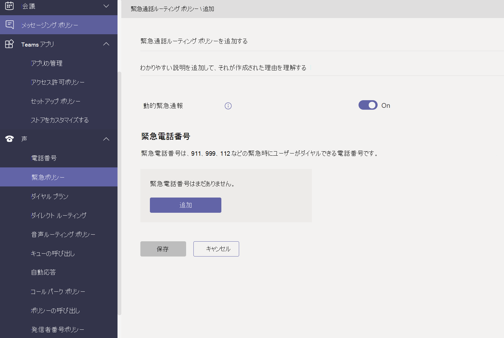
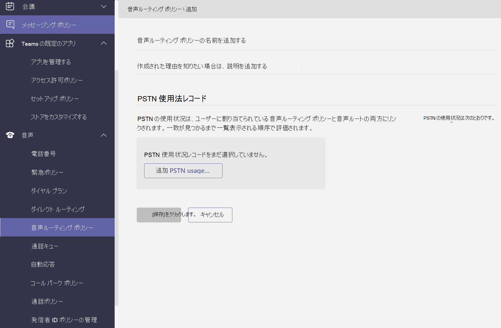

# Microsoft Teams で音声と通話のポリシーを管理するManage voice and calling policies in Microsoft Teams

音声と通話のポリシーは、Microsoft Teams での音声と通話を制御するために使用されます。Voice and calling policies are used to control voice and calling in Microsoft Teams.

## 緊急通話ポリシーEmergency calling policies

緊急通話 [ポリシーを使用して](manage-emergency-calling-policies.md) 、組織内のユーザーが緊急通話を行った場合の対応を構成します。You use [emergency calling policies](manage-emergency-calling-policies.md) to configure what happens when a user in your organization makes an emergency call. これらのポリシーは、Teams 管理センターで管理するか、組織のWindows PowerShell。These policies are managed in the Teams admin center or using Windows PowerShell.

## 緊急通話ルーティング ポリシーEmergency call routing policies

組織が電話システムダイレクトルーティングを展開している場合は、緊急通話ルーティング ポリシーを使用して、緊急通話のルーティング先、拡張緊急サービスが有効かどうか、緊急サービスに使用する番号を決定できます。If your organization has deployed **Phone System Direct Routing**, you can use [emergency call routing policies](manage-emergency-call-routing-policies.md) to determine where emergency calls are routed, whether enhanced emergency services are enabled, and which numbers are used for emergency services. これらのポリシーは、PowerShell または Microsoft Teams 管理センターを使用して管理されます。These policies are managed using PowerShell or in the Microsoft Teams admin center.

## 発信者番号ポリシーCaller ID policies

[発信者番号ポリシーは、](caller-id-policies.md) 発信者番号を変更またはブロックするために使用されます。[Caller ID policies](caller-id-policies.md) are used to change or block caller ID.

## 音声ルーティング ポリシーVoice routing policies

音声 [ルーティング ポリシーは、](manage-voice-routing-policies.md) 公衆交換電話網 (PSTN) 利用状況レコードのコンテナーです。A [voice routing policy](manage-voice-routing-policies.md) is a container for Public Switched Telephone Network (PSTN) usage records. 組織が電話システムダイレクト ルーティングを展開している場合は、 **これらのポリシーを使用できます**。You can use these policies if your organization has deployed **Phone System Direct Routing**. 音声ルーティング ポリシーは、PowerShell または Teams 管理センターで管理できます。Voice routing policies can be managed with PowerShell or in the Teams admin center.

## 通話ポリシーCalling policies

[通話ポリシーは](teams-calling-policy.md) 、ユーザーがプライベート通話を行うかどうか、通話グループに通話を送信できるかどうか、通話をボイスメールにルーティングできるかどうかなど、ユーザーが使用できる通話と着信の転送機能を制御します。[Calling policies](teams-calling-policy.md) control which calling and call forwarding features are available to users including whether a user can make private calls, send calls to call groups, and route calls to voicemail.

## コール パークと取得ポリシーCall park and retrieve policies

[コール パークと取得により](call-park-and-retrieve.md) 、ユーザーは他のユーザーを保留にし、同じユーザーまたは他のユーザーが通話を継続できます。[Call park and retrieve](call-park-and-retrieve.md) lets users put other users on hold and enables the same user or someone else to continue the call.

## ダイヤル プランを作成および管理するCreate and manage dial plans

[ダイヤル プランは、](create-and-manage-dial-plans.md) 通話の承認とルーティングのためにダイヤルされた電話番号を翻訳します。[Dial plans](create-and-manage-dial-plans.md) translate dialed phone numbers for call authorization and routing. ダイヤル プランは、PowerShell または Microsoft Teams 管理センターで作成および管理できます。You can create and manage dial plans through PowerShell or in the Microsoft Teams admin center.

## 関連トピックRelated topics

* [Microsoft Teams で緊急通話ポリシーを管理するManage emergency calling policies in Microsoft Teams](manage-emergency-calling-policies.md)
* [緊急通話のルーティング ポリシーを管理するManage emergency call routing policies](manage-emergency-call-routing-policies.md)
* [Microsoft Teams で発信者番号ポリシーを管理するManage caller ID policies in Microsoft Teams](caller-id-policies.md)
* [音声ルーティング ポリシーを管理するManage voice routing policies](manage-voice-routing-policies.md)
* [Microsoft Teams の発信通話制限ポリシーCalling policies in Microsoft Teams](teams-calling-policy.md)
* [Microsoft Teams でのコール パークおよび保留解除Call park and retrieve in Microsoft Teams](call-park-and-retrieve.md)
* [ダイヤル プランを作成および管理するCreate and manage dial plans](create-and-manage-dial-plans.md)
* [ポリシーを使用して Teams を管理するManage Teams with policies](manage-teams-with-policies.md)
