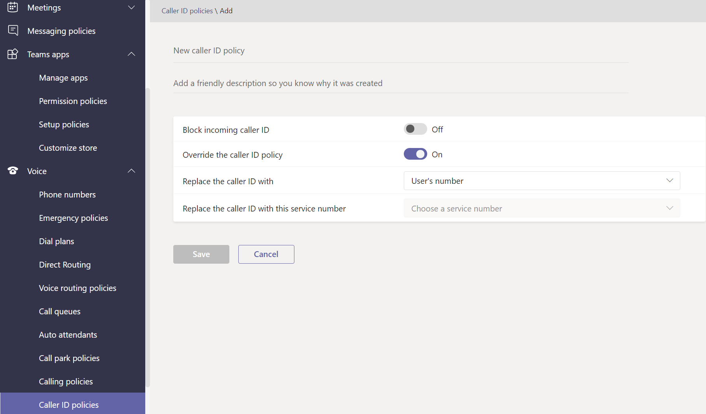

# 音声ポリシーと通話ポリシーを管理Microsoft Teams

音声と通話のポリシーは、音声と通話を制御するために使用Microsoft Teams。

## 緊急通話ポリシー

緊急通話 [ポリシーを使用して](manage-emergency-calling-policies.md) 、組織内のユーザーが緊急通話を行った場合の対応を構成します。 これらのポリシーは、管理センターまたはTeamsで管理Windows PowerShell。

## 緊急通話ルーティング ポリシー

組織が **電話システム** ダイレクト ルーティング を展開している場合は、緊急通話ルーティング ポリシーを使用して、緊急通話のルーティング先、強化された緊急サービスが有効かどうか、緊急サービスに使用される番号を特定できます。 これらのポリシーは、PowerShell または管理センターの Microsoft Teams使用して管理されます。

## 呼び出し元 ID ポリシー

[発信者番号ポリシーは、発信者](caller-id-policies.md) 番号を変更またはブロックするために使用されます。

## 音声ルーティング ポリシー

音声 [ルーティング ポリシーは](manage-voice-routing-policies.md) 、公衆交換電話網 (PSTN) 使用レコードのコンテナーです。 組織が直接ルーティング を使用してデプロイしている場合は、**これらの電話システム使用できます**。 音声ルーティング ポリシーは、PowerShell または管理センターでTeamsできます。

## 通話ポリシー

[通話ポリシーは](teams-calling-policy.md) 、ユーザーがプライベート通話を行うかどうか、通話グループに通話を送信できるかどうか、ボイスメールに通話をルーティングできるかどうかなど、ユーザーが使用できる通話と着信の転送機能を制御します。

## パークを呼び出してポリシーを取得する

[呼び出しパークと取得](call-park-and-retrieve.md) を使用すると、ユーザーは他のユーザーを保留にし、同じユーザーまたは他のユーザーが通話を続行できます。

## ダイヤル プランを作成および管理する

[ダイヤル プランは、](create-and-manage-dial-plans.md) 通話の承認とルーティングのためにダイヤルされた電話番号を変換します。 ダイヤル プランの作成と管理は、PowerShell または管理センター Microsoft Teamsできます。

## 関連トピック

* [緊急通話ポリシーを管理Microsoft Teams](manage-emergency-calling-policies.md)
* [緊急通話のルーティング ポリシーを管理する](manage-emergency-call-routing-policies.md)
* [Microsoft Teams で発信者番号ポリシーを管理する](caller-id-policies.md)
* [音声ルーティング ポリシーを管理する](manage-voice-routing-policies.md)
* [Microsoft Teams の発信通話制限ポリシー](teams-calling-policy.md)
* [Microsoft Teams でのコール パークおよび保留解除](call-park-and-retrieve.md)
* [ダイヤル プランを作成および管理する](create-and-manage-dial-plans.md)
* [ポリシー Teamsを管理する](manage-teams-with-policies.md)
