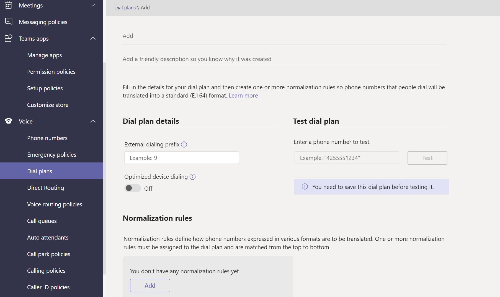

# Microsoft Teamsで音声ポリシーと通話ポリシーを管理する

音声ポリシーと通話ポリシーは、Microsoft Teamsで音声と通話を制御するために使用されます。

## 緊急通話ポリシー

[緊急通話ポリシー](manage-emergency-calling-policies.md)を使用して、組織内のユーザーが緊急通報を行った場合の動作を構成します。 これらのポリシーは、Teams管理センターまたはWindows PowerShellを使用して管理されます。

## 緊急通話ルーティング ポリシー

組織が **ダイレクト ルーティング電話システム** 展開している場合は、[緊急通報ルーティング ポリシー](manage-emergency-call-routing-policies.md)を使用して、緊急通報のルーティング先、強化された緊急サービスが有効になっているかどうか、および緊急サービスに使用される番号を決定できます。 これらのポリシーは、PowerShell またはMicrosoft Teams管理センターで管理されます。

## 発信者番号ポリシー

[発信者番号ポリシーは、発信者番号](caller-id-policies.md) を変更またはブロックするために使用されます。

## 音声ルーティング ポリシー

[音声ルーティング ポリシー](manage-voice-routing-policies.md)は、公衆交換電話網 (PSTN) の使用レコードのコンテナーです。 組織が **ダイレクト ルーティング電話システム** 展開している場合は、これらのポリシーを使用できます。 音声ルーティング ポリシーは、PowerShell またはTeams管理センターで管理できます。

## 通話ポリシー

[通話ポリシーは、](teams-calling-policy.md) ユーザーがプライベート通話を行うかどうか、通話グループに通話を送信できるかどうか、ボイスメールに通話をルーティングできるかどうかなど、ユーザーが利用できる通話と通話の転送機能を制御します。

## コール パークとポリシーの取得

[コール パークと取得](call-park-and-retrieve.md) を使用すると、ユーザーは他のユーザーを保留にし、同じユーザーまたは他のユーザーが通話を続行できるようになります。

## ダイヤル プランを作成および管理する

[ダイヤル プランでは](create-and-manage-dial-plans.md) 、通話の承認とルーティングのためにダイヤルされた電話番号が変換されます。 ダイヤル プランは、PowerShell またはMicrosoft Teams管理センターで作成および管理できます。

## 関連項目

* [Microsoft Teamsで緊急通報ポリシーを管理する](manage-emergency-calling-policies.md)
* [緊急通話のルーティング ポリシーを管理する](manage-emergency-call-routing-policies.md)
* [Microsoft Teams で発信者番号ポリシーを管理する](caller-id-policies.md)
* [音声ルーティング ポリシーを管理する](manage-voice-routing-policies.md)
* [Microsoft Teams の発信通話制限ポリシー](teams-calling-policy.md)
* [Microsoft Teams でのコール パークおよび保留解除](call-park-and-retrieve.md)
* [ダイヤル プランを作成および管理する](create-and-manage-dial-plans.md)
* [ポリシーを使用してTeamsを管理する](manage-teams-with-policies.md)
