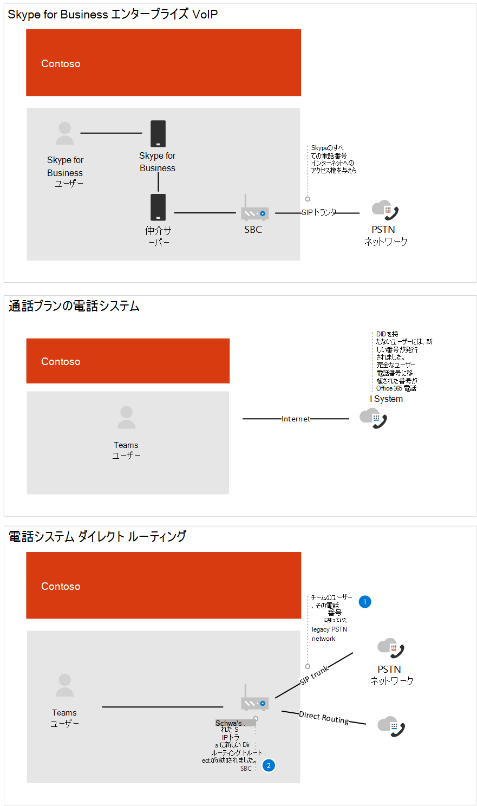
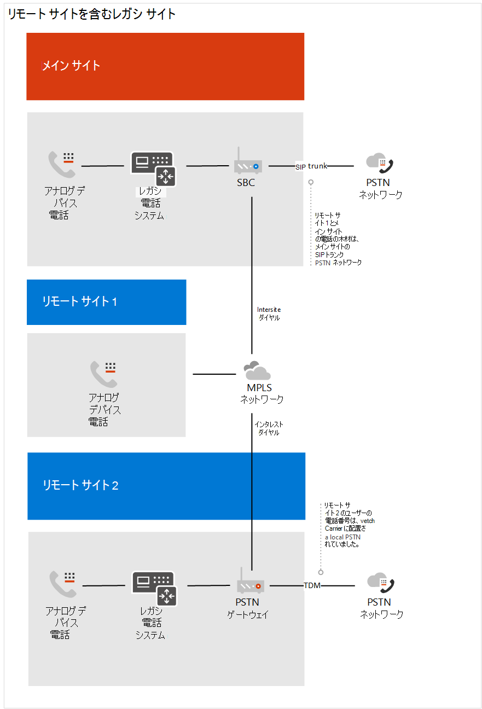
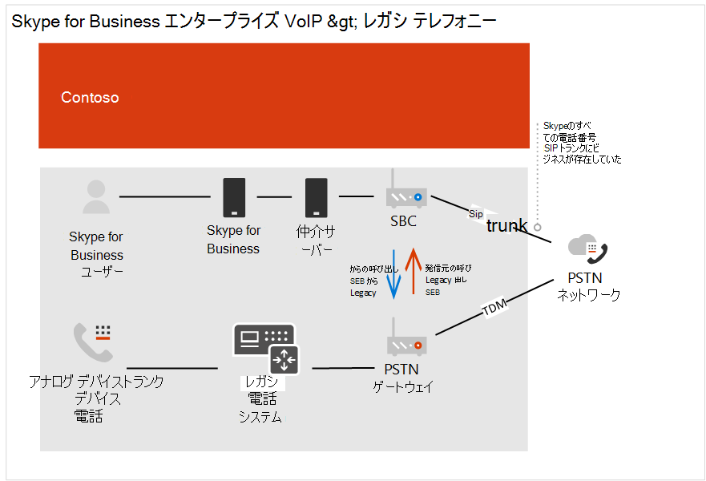

# Contoso のケース スタディ: 電話システム

地理的な場所や他の要因に応じて、Contoso には次のテレフォニー ソリューションを使用するオフィスがあります。

- サイトの種類 A: Skype for Business エンタープライズ VoIP

- サイトの種類 B: 従来のレガシ テレフォニー システム

- サイトの種類 C: Skype for Business エンタープライズ VoIP従来のテレフォニー システムの組み合わせ

組織全体に Microsoft Phone System ソリューションを実装するには、Contoso は、公衆交換電話網 &mdash; (PSTN) に接続するために電話システムで使用される次のオプションの中から、サイトの種類ごとに決定する必要がありました &mdash; 。

- 通話プラン付き電話システム 

- ダイレクト ルーティングを通じて独自の PSTN キャリアを使用する電話システム 

- 通話プランを使用した電話システムと、ダイレクト ルーティングによる独自の PSTN 通信事業者との電話システムの組み合わせ
 
Contoso は、組織に適切なソリューションを決定するために [、Microsoft](/SkypeForBusiness/hybrid/msft-telephony-solutions) テレフォニー ソリューションと、Microsoft Teams での Ignite 2019 セッションの呼び出 [しを使用しました](https://myignite.techcommunity.microsoft.com/sessions/83170?source=sessions)。  

## サイトの種類 A: Skype for Business エンタープライズ VoIP 

Contoso Skype for Business エンタープライズ VoIPハブと音声として設定されています。 国の Skype for Business ユーザーに PSTN への接続を提供する地域で PSTN ゲートウェイを維持エンタープライズ VoIP場所がありました。 多くの場合、これらの衛星オフィスには独自のインターネット出口はなかった。 これらのユーザーの番号は、既存の SBC に接続する SIP トランクに存在しました。 

既に展開されている SBC がダイレクト ルーティングとメディア バイパスの認定を受けたかどうかを確認するために、Contoso は直接ルーティングの認定を受けたセッション ボーダー コントローラーのリスト [を確認しました](direct-routing-border-controllers.md)。  

ユーザーのダイヤルの習慣は、ユーザーがピアツーピア音声で利用できる Skype for Business クライアントを使用している場合でも、拡張機能を使用して従来のテレフォニー システムでユーザーをダイヤルする方法でした。 

Contoso は、次の質問に基づいて決定します。

- Q. オンプレミス展開によって提供される機能を保持する必要がありますか? 
  A. いいえ 

- Q. サードパーティ PBX システムや他のテレフォニー機器と相互運用する必要がありますか? 
  A. いいえ 

- Q. 現在のサードパーティの通信事業者を保持する必要がありますか?  A.○ (規制対象国) および No 

- Q. SPC の ROI を展開する必要がありますか?  A.さあ何とも言えません  

- Q. Microsoft PSTN 通話プランは、この地域で利用できますか?  A.さあ何とも言えません 

Contoso は、質問に対する回答に基づいて、次の点を決定しました。

- PSTN 通話プランが通話プランを含む電話システムで利用できる地域にあるユーザーを移動します。 

- PSTN 通話プランが利用可能な地域に存在しないユーザー、SBC の ROI がまだ満たされていないサイトに存在するユーザー、および直接ルーティングを使用する電話システムに対するテレフォニー規制がある国に住んでいるユーザーを移動します。 

次の図は、初期の Skype for Business エンタープライズ VoIP展開と、この展開が Microsoft 通話プランと直接ルーティングの両方に移行された方法を示しています。

## サイトの種類 B: 従来のレガシ テレフォニー システム

Contoso には、従来のテレフォニー システムを利用する多くのオフィスがありました。 E1.64 電話番号を持つユーザーのサブセットと、内線番号のみを持つユーザーがいました。 これらの番号は、PSTN ゲートウェイへの TDM トランクに存在します。 サイト内ダイヤルは、通話をルーティングする場所を決定するために、拡張機能の前にあるサイト コードを利用して構成されました。 ユーザーのダイヤルの習慣は、内線番号でダイヤルすることでした。   

Contoso は、次の質問に基づいて決定します。

- Q. オンプレミス展開によって提供される機能を保持する必要がありますか? 
  A. いいえ 

- Q. サードパーティ PBX システムや他のテレフォニー機器と相互運用する必要がありますか?  A.うん

- Q. 現在のサードパーティの通信事業者を保持する必要がありますか?  A.違います 

- Q. Microsoft PSTN の通話プランは地域で利用できますか?  A.さあ何とも言えません 

Contoso は、質問に対する回答に基づいて、次の点を決定しました。 

- PSTN 通話プランが通話プランを含む電話システムで利用できる地域にあるユーザーを移動します。 

- PSTN 通話プランが直接ルーティングされた電話システムで利用できる地域にはないユーザーを移動します。 

- 業務上重要なアナログ デバイスへの PSTN 接続を維持します。

次の図は、リモート サイトを使用した元の従来のシステム展開と、ローカル メディア最適化を使用したダイレクト ルーティング展開への移行を示しています。

**従来の展開**  
 

**直接ルーティングを使用した展開**

 
## サイトの種類 C: Skype for Business エンタープライズ VoIP従来のテレフォニー システムの組み合わせ

Contoso Skype for Business エンタープライズ VoIPの電話番号は、通信事業者から SBC への SIP トランク上に存在します。 PSTN ゲートウェイへの TDM トランクに存在する従来のテレフォニー システムの番号。   

Contoso は、次の質問に基づいて決定します。

- Q. オンプレミス展開によって提供される機能を保持する必要がありますか? 
  A. いいえ 

- Q. サードパーティ PBX システムや他のテレフォニー機器と相互運用する必要がありますか?  A.違います 

- Q. 現在のサードパーティの通信事業者を保持する必要がありますか?  A.違います 

- Q. SPC の ROI を展開する必要がありますか?  A.さあ何とも言えません  

- Q. Microsoft の PSTN 通話プランは、この地域で利用できますか?  A.違います 

Contoso は、質問に対する回答に基づいて、次の点を決定しました。 

- ダイレクト ルーティングが有効になる従来のテレフォニー ユーザーの場合、Contoso は、SBC がダイレクト ルーティングの認定を受けたので、TDM トランクから SBC の SIP トランクに番号を移植しました。 

- 電話システムに移行するユーザーのサブセットをサポートし、従来のシステムを介した継続ルーティングを許可するために、従来のテレフォニー システムは SBC への次のホップとして設定されています。   

- さらに、ユーザーの動作の変更を促し、サイト間およびサイト内内の内線ダイヤルへの依存を取り除く方法について、Contoso は、すべての内部呼び出しに Teams を使用するガイダンスを提供しました。  

次の図は、元の Skype for Business エンタープライズ VoIPおよび従来のテレフォニー システムの展開と、ダイレクト ルーティングを使用した複合展開への移行を示しています。

**元の複合配置** 
 

**ダイレクト ルーティングを使用した複合展開** 
 

## 通話プラン

通話プランの構成要件を決定するために、Contoso は通話プランの主要な展開決定 [を確認しました](calling-plan-landing-page.md#core-deployment-decisions)。 その結果、次のような決定が行われた。 

- Q. ユーザーは国際電話を利用する必要がありますか?  A.うん 

- Q. ユーザーそれぞれに内向き DID 電話番号はありますか?  A. 今日ではありません。 有効になっているすべてのユーザーは DID を受け取る。 

- Q. 発信者 ID のマスクや無効化を行いますか?  A.ユーザーの発信者番号は Contoso のローカル番号にマスクされます。 

## ダイレクト ルーティング

Contoso は Ignite に参加し、電話システムと直接ルーティングでOffice 365 の機能を最新の状態に更新しました。 技術的な指導者と設計者は、Ignite 2019 で提供されたガイダンスを使用して方向を決定しました。  使用されたキー セッション: 

- [Microsoft Teams ダイレクト ルーティングを使用して成功を計画する](https://myignite.techcommunity.microsoft.com/sessions/80381?source=sessions)

- [ダイレクト ルーティングの更新](https://myignite.techcommunity.microsoft.com/sessions/80381?source=sessions)

## 構成

### 通話プラン サイト

ライセンスを取得し、ユーザーに電話番号を割り当てるには、Contoso は「通話プランをセットアップする [」の手順に従いました](set-up-calling-plans.md)。 

電話番号を割り当てる必要があるユーザーの数のため、Contoso は PowerShell を使用して電話番号を割り当てしました。 他の設定に加えて PowerShell を使用して数値を割り当てる方法については、Contoso が &mdash; &mdash; Teams PowerShell の [概要を使用しました](teams-powershell-overview.md)。  

### ダイレクト ルーティング サイト

Contoso のオンプレミス テレフォニー インフラストラクチャを Microsoft Teams に接続するために、Contoso の管理者は「ダイレクト ルーティングを構成する」の手順に従い、ガイダンスを得るビデオの[Microsoft Teams](https://www.youtube.com/watch?v=1ASftX_Msb8&index=10&list=PLaSOUojkSiGnKuE30ckcjnDVkMNqDv0Vl)のダイレクト ルーティングを確認しました。  Contoso は、認定された SBC ベンダーによるダイレクト ルーティング展開のドキュメントにも言及しました。 

SBC と Microsoft Phone System の間で直接ルーティングが構成された後、Contoso が構成をテストする必要があります。 これを行うには、Contoso 管理者は [Ignite 2019](https://myignite.techcommunity.microsoft.com/sessions/83178?source=sessions)の直接ルーティング セッションの更新プログラムで説明した SIP テスター クライアントを使用しました。 SIP Tester クライアント のスクリプトとドキュメントは、PowerShell スクリプトからダウンロードされ、直接ルーティング セッション ボーダー コントローラー接続をテストしました。   

### ローカル メディアの最適化

Contoso は、世界中の異なる地域でローカル メディア最適化を活用する機会を見ていました。 Contoso でサポートされるシナリオについては、「直接ルーティング用 [のローカル メディアの最適化」を参照してください](direct-routing-media-optimization.md)。 ローカル メディアの最適化の構成は、SBC ベンダーと Microsoft の両方のガイダンスに従って完了しました。 ローカル メディアの最適化の構成手順は次のとおりです。 

- ユーザーと SBC サイトを構成する 

- SBC ベンダーの仕様に従って SBC を構成します。 

- ローカル メディアの最適化に使用する各サイトに外部の信頼済み IP アドレスを追加する    

- ネットワーク トポロジを定義する 

- 仮想ネットワーク トポロジを定義する 

- モードを決定する: ローカル ユーザーの場合は常にバイパスまたはのみ 

## ネットワークに関する考慮事項

Contoso には、電話システムを有効にした後、リモートで作業する必要があるユーザーが多数いました。 ユーザーは VPN を使用して特定の Line of Business アプリケーションにアクセスしました。 VPN を使用している間、電話システムユーザーは通話品質の低下を経験しました。 

品質の問題を解決するために、Contoso は VPN 分割トンネリングを実装しました。この方法では、内部アプリへの接続が VPN 上に残っている間、Office 365 トラフィックがインターネットをトラバースする許可を与えました。 VPN 分割トンネリングを実装するために、Contoso は [365](/office365/enterprise/office-365-vpn-implement-split-tunnel)用の VPN 分割トンネリングを実装するOffice従いました。  

