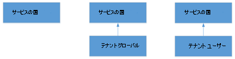

# ダイヤル プランについてWhat are dial plans?

[] ダイヤル プランは、個別のユーザーによってダイヤルされた電話番号を、通話承認と通話ルーティングの目的で別の形式 (通常は E.164) に変換する、正規化ルールの名前付きのセットです。A dial plan is a named set of normalization rules that translate dialed phone numbers by an individual user into an alternate format (typically E.164) for purposes of call authorization and call routing.

ダイヤル プランは、さまざまな形式で表される電話番号が別の 1 つの形式にどのように変換されるかを定義する 1 つ以上の正規化ルールで構成されます。A dial plan consists of one or more normalization rules that define how phone numbers expressed in various formats are translated to an alternate format. 同じダイヤル文字列が、ダイヤル プランによって異なる形で解釈、変換される可能性があるため、指定されたユーザーに割り当てられているダイヤル プランに応じて、同じダイヤル番号が異なる形で変換、ルーティングされることがあります。The same dial string may be interpreted and translated differently in different dial plans, so depending on which dial plan is assigned to a given user, the same dialed number may be translated and routed differently. 最大 1,000 のテナント ダイヤル プランを使用できます。There can be a maximum of 1,000 tenant dial plans.

テナントのダイヤル プランを作成および管理する場合は「[ダイヤル プランを作成および管理する](create-and-manage-dial-plans.md)」をご覧ください。See [Create and manage dial plans](create-and-manage-dial-plans.md) to create and manage tenant dial plans.

## テナント ダイヤル プランのスコープTenant dial plan scope

ダイヤル プランのスコープによって、ダイヤル プランを適用できる階層レベルが決まります。A dial plan's scope determines the hierarchical level at which the dial plan can be applied. クライアントはプロビジョニング設定を通じて適切なダイヤル プランを取得します。この設定は、ユーザーがサインインするときに自動的に提供Teams。Clients get the appropriate dial plan through provisioning settings that are automatically provided when users sign in to Teams. 管理者は、管理者センターまたはリモート PowerShell を使用して、ダイヤル プランのスコープ レベルMicrosoft Teams割り当てできます。As an admin, you can manage and assign dial plan scope levels by using the Microsoft Teams admin center or Remote PowerShell.

このTeams、サービス スコープとテナント スコープ (組織用) の 2 種類のダイヤル プランがあります。In Teams, there are two types of dial plans: service-scoped and tenant-scoped (which is for your organization). サービス スコープのダイヤル プランは、利用可能な国または地域電話システム定義されます。A service-scoped dial plan is defined for every country or region where Phone System is available. 各ユーザーには、ユーザーに割り当てられた使用場所に一致するサービス国のダイヤル プランが自動的に割り当てられます。Each user is automatically assigned the service country dial plan that matches the usage location assigned to the user. サービスの国のダイヤル プランは変更できませんが、テナント スコープのダイヤル プランを作成して、サービスの国のダイヤル プランを拡張することができます。You can't change the service country dial plan, but you can create tenant scoped dial plans, which augment the service country dial plan. クライアントがプロビジョニングされるに応じて、サービスの国のダイヤル プランと適切にスコープが設定されたテナント ダイヤル プランの組み合わせである "有効なダイヤル プラン" が取得されます。As clients are provisioned, they obtain an "effective dial plan," which is a combination of the service country dial plan and the appropriately scoped tenant dial plan. そのため、サービス国のダイヤル プランに既に存在する可能性があるテナント ダイヤル プラン内のすべての正規化ルールを定義する必要はありません。Therefore, it's not necessary to define all normalization rules in tenant dial plans as they might already exist in the service country dial plan.

テナント ダイヤル プランは、テナント スコープとユーザー スコープの 2 つのスコープにさらに分割できます。Tenant dial plans can be further broken into two scopes - tenant-scope or user-scope. テナントがユーザー スコープのダイヤル プランを定義して割り当てる場合、そのユーザーは、ユーザーのサービス国のダイヤル プランと割り当てられたユーザー ダイヤル プランの有効なダイヤル プランでプロビジョニングされます。If a tenant defines and assigns a user-scoped dial plan, that user will be provisioned with an effective dial plan of the user's service country dial plan and the assigned user dial plan. テナントがテナント スコープのダイヤル プランを定義しているが、ユーザースコープのダイヤル プランを割り当てない場合、そのユーザーは、ユーザーのサービス国のダイヤル プランとテナント ダイヤル プランの有効なダイヤル プランでプロビジョニングされます。If a tenant defines a tenant-scoped dial plan but doesn't assign a user-scoped dial plan, then that user will be provisioned with an effective dial plan of the user's service country dial plan and the tenant dial plan.

次に示すのは、Teams のダイヤル プランの継承モデルです。The following is the inheritance model of dial plans in Teams.

次に、考えられる有効なダイヤル プランを示します。The following are the possible effective dial plans:

 **サービスの国** テナント スコープのダイヤル プランが定義されていない場合、テナント ユーザー スコープのダイヤル プランがプロビジョニングされたユーザーに割り当てられていない場合、ユーザーは、使用場所に関連付けられているサービス国にマップされた有効なダイヤル プランを受け取る必要があります。**Service Country** If no tenant scoped dial plan is defined and no tenant user scoped dial plan is assigned to the provisioned user, the user will receive an effective dial plan mapped to the service country associated with their usage location.

 **テナント グローバル - サービスの国** テナント ユーザー ダイヤル プランが定義されているが、ユーザーに割り当てられていない場合、プロビジョニングされたユーザーは、結合されたテナント ダイヤル プランと、その使用場所に関連付けられているサービス国のダイヤル プランで構成される有効なダイヤル プランを受け取る。**Tenant Global - Service Country** If a tenant user dial plan is defined but not assigned to a user, the provisioned user will receive an effective dial plan consisting of a merged tenant dial plan and the service country dial plan associated with their usage location.

 **テナント ユーザー - サービスの国** テナント ユーザー ダイヤル プランが定義され、ユーザーに割り当てられている場合、プロビジョニングされたユーザーは、結合されたテナント ユーザー ダイヤル プランと、その使用場所に関連付けられているサービス国のダイヤル プランで構成される有効なダイヤル プランを受け取る必要があります。**Tenant User - Service Country** If a tenant user dial plan is defined and assigned to a user, the provisioned user will receive an effective dial plan consisting of the merged tenant user dial plan and the service country dial plan associated with their usage location.

テナントのダイヤル プランを作成する場合は「[ダイヤル プランを作成および管理する](create-and-manage-dial-plans.md)」をご覧ください。See [Create and manage dial plans](create-and-manage-dial-plans.md) to create your tenant dial plans.

> [!NOTE]
> ダイヤル プランの正規化ルールがダイヤル番号に適用されないシナリオでは、ダイヤルされた文字列は"+CC" の前に付加するために正規化されます。CC はダイヤル ユーザーの使用場所の国コードです。In the scenario where no dial plan normalization rules apply to a dialed number, the dialed string is still normalized to prepend "+CC" where CC is the country code of the dialing user's usage location. これは、通話プラン、直接ルーティング、PSTN 電話会議のダイヤルアウトシナリオに適用されます。This applies to Calling Plans, Direct Routing and PSTN Conference dial-out scenarios.

## テナント ダイヤル プランの計画Planning for tenant dial plans

カスタム ダイヤル プランを計画するには、次の手順を実行します。To plan custom dial plans, follow these steps:

- **手順 1** ユーザーのダイヤル エクスペリエンスを高めるためにカスタム ダイヤル プランが必要かどうかを決定します。通常は、内線または省略された国内ダイヤルなど、E.164 以外のダイヤルに対応する場合に必要となります。**Step 1** Decide whether a custom dial plan is needed to enhance the user dialing experience. Typically, the need for one would be to support non-E.164 dialing, such as extensions or abbreviated national dialing.

- **手順 2** テナント グローバルまたはテナント ユーザー スコープのダイヤル プランのどちらが必要か、または両方とも必要であるかを決定します。ユーザーに複数のローカル ダイヤル要件がある場合は、ユーザー スコープのダイヤル プランが必要となります。**Step 2** Determine whether tenant global or tenant user scoped dial plans are needed, or both. User scoped dial plans are needed if users have different local dialing requirements.

- **手順 3** 各必須ダイヤル プランに対応する有効な番号バターンを特定します。サービス レベル国のダイヤル プランで定義されていない番号パターンのみが必要となります。**Step 3** Identify valid number patterns for each required dial plan. Only the number patterns that are not defined in the service level country dial plans are required.

- **手順 4** ダイヤル プランの名前付けについて組織全体のスキームを策定します。標準的な名前付けスキームを採用することにより、組織全体にわたり一貫した方針を実現でき、メンテナンスや更新作業が簡素化されます。**Step 4** Develop an organization-wide scheme for naming dial plans. Adopting a standard naming scheme assures consistency across an organization and makes maintenance and updates easier.

## 新しいダイヤル プランの作成Creating your new dial plan

ダイヤル プランを新規作成する場合、必要な情報を把握しておく必要があります。When you create a new dial plan, you must put in the information that is required.

### 名前と簡易名Name and simple name

ユーザー ダイヤル プランの場合は、ダイヤル プランが割り当てられるユーザーを識別するわかりやすい名前を指定する必要があります。For user dial plans, you should specify a descriptive name that identifies the users to which the dial plan will be assigned. ダイヤル プランの [簡易名] には、ダイヤル プラン名から派生した文字列が事前に入力されています。The dial plan Simple Name is pre-populated with a string that is derived from the dial plan name. [単純名] フィールドは編集可能で、ダイヤル プラン用のより説明的な名前付け規則を作成することができます。The Simple Name field is editable, which enables you to create a more descriptive naming convention for your dial plans. [単純名] の値は空にすることはできず、一意でなければなりません。The Simple Name value cannot be empty and must be unique. 最適な方法は、組織全体の名前付け規則を作成してから、その規則の一貫性をすべてのサイトとユーザーに使用することです。A best practice is to develop a naming convention for your entire organization and then use this convention consistently across all sites and users.

### 説明Description

地理的な場所または対応するダイヤル プランが適用されるユーザーのグループに関する一般的で認識可能な名前を入力することをお勧めします。We recommend that you type the common, recognizable name of the geographic location or group of users to which the corresponding dial plan applies.

### 外部アクセス プレフィックスExternal access prefix

ユーザーが外線につなぐために 1 つ以上の追加の先頭数字 (9 など) をダイヤルする必要がある場合は、最大 4 文字 (#、\*、0～9) の外部アクセス プレフィックスを指定できます。You can specify an external access prefix of up to four characters (#, \*, and 0-9) if users need to dial one or more additional leading digits (for example, 9) to get an external line.

> [!NOTE]
> 外部アクセス プレフィックスを指定する場合、プレフィックスを適応させるための正規化ルールを追加で作成する必要はありません。If you specify an external access prefix, you don't need to create an additional normalization rule to accommodate the prefix.

テナントのダイヤル プランを作成する場合は「[ダイヤル プランを作成および管理する](create-and-manage-dial-plans.md)」をご覧ください。See [Create and manage dial plans](create-and-manage-dial-plans.md) to create your tenant dial plans.

## 正規化ルールNormalization rules

正規化ルールによって、さまざまな形式で表される電話番号をどのように変換するかが定義されます。ダイヤル元のロケールに応じて、同じ番号文字列が異なる方法で解釈および変換される場合があります。正規化ルールは、ユーザーが省略された内線または外線番号をダイヤルできるようにする必要がある場合に、必須となることがあります。Normalization rules define how phone numbers expressed in various formats are to be translated. The same number string may be interpreted and translated differently, depending on the locale from which it is dialed. Normalization rules may be necessary if users need to be able to dial abbreviated internal or external numbers.

1 つ以上の正規化ルールをダイヤル プランに割り当てる必要があります。One or more normalization rules must be assigned to the dial plan. 正規化ルールは上から下の順に照合されるため、テナント ダイヤル プランにおける順序が重要になります。Normalization rules are matched from top to bottom, so the order in which they appear in a tenant dial plan is important. たとえば、テナント ダイヤル プランに 10 個の正規化ルールがある場合、ダイヤルされた番号の一致ロジックは 1 番目のルールから試行され、一致がみられない場合は 2 番目、というように順次実行されます。For example, if a tenant dial plan has 10 normalization rules, the dialed number matching logic will be tried starting with the first normalization rule, if there isn't a match then the second, and so forth. 一致がみられた場合、そのルールが使用され、定義済みのそれ以外のルールとの照合は実行されません。If a match is made, that rule is used and there is no effort to match any other rules that are defined. 特定のテナント ダイヤル プランには、最大 50 の正規化ルールを設定できます。There can be a maximum of 50 normalization rules in a given tenant dial plan.

### 必要な正規化ルールの指定Determining the required normalization rules

テナント ダイヤル プランは、特定のユーザーのサービスの国のダイヤル プランと効果的に結合されます。テナント ダイヤル プランの正規化ルールを決定するために、サービス国ダイヤル プランの正規化ルールを評価する必要がある可能性があります。Because any tenant dial plan is effectively merged with a given user's service country dial plan, it is likely that the service country dial plan's normalization rules need to be evaluated in order to determine which tenant dial plan normalization rules are needed. この目的で **Get-CsEffectiveTenantDialPlan** コマンドレットを使用できます。The **Get-CsEffectiveTenantDialPlan** cmdlet can be used for this purpose. コマンドレットは入力パラメータとしてユーザー ID を必要とし、ユーザーに適用可能なすべての正規化ルールを返します。The cmdlet takes the user's identity as the input parameter and will return all normalization rules that are applicable to the user.

### 正規化ルールの作成Creating normalization rules

正規化ルールでは、.NET Frameworkを使用して、サーバーがダイヤル文字列を E.164 形式に変換するために使用する数値の一致パターンを指定します。Normalization rules use .NET Framework regular expressions to specify numeric match patterns that the server uses to translate dial strings to E.164 format. 正規化ルールは、一致に対する正規表現と、一致が見つかったときに行う変換を指定することで作成できます。Normalization rules can be created by specifying the regular expression for the match and the translation to be done when a match is found. 作業が完了したら、テスト番号を入力して、正規化ルールが正常に機能することを確認できます。When you finish, you can enter a test number to verify that the normalization rule works as expected.

.NET Framework の正規表現を使用する場合の詳細については、「[.NET Framework の正規表現](/dotnet/standard/base-types/regular-expressions)」を参照してください。For details about using .NET Framework regular expressions, see [.NET Framework Regular Expressions](/dotnet/standard/base-types/regular-expressions).

テナントのダイヤル プランの正規化ルールを作成および管理する場合は「[ダイヤル プランを作成および管理する](create-and-manage-dial-plans.md)」をご覧ください。See [Create and manage dial plans](create-and-manage-dial-plans.md) to create and manage normalization rules for your tenant dial plans.

> [!NOTE]
> 3pip デバイス (Polycom VVX 601 モデルなど) では、最初のトークンが省略可能な正規化ルールは現在サポートされていません。Normalization rules with the first token as optional are currently not supported on 3pip devices (for example, Polycom VVX 601 model). 3pip デバイスにオプションの正規化ルールを適用する場合は、1 つではなく 2 つの正規化ルールを作成する必要があります。If you want to apply normalization rules with optionality on 3pip devices, you should create two normalization rules instead of one. たとえば、ルール ^0?(999)$ は、(999)$ (Translation:$1) と ^0(999)$ (Translation:$1) の 2 つのルールに置き換える必要があります。For example, the rule ^0?(999)$ should be replaced by the following two rules: (999)$ (Translation:$1) and ^0(999)$ (Translation:$1).

### 正規化ルールのサンプルSample normalization rules

次の表に, .NET Framework の正規表現として記述される正規化ルールのサンプルを示します。これらのサンプルは例示するためのもので、独自の正規化ルールを作成する際の規定リファレンスとして提示するものではありません。The following table shows sample normalization rules that are written as .NET Framework regular expressions. The samples are examples only and are not meant to be a prescriptive reference for creating your own normalization rules.

 
 **正規表現を使用.NET Framework正規化ルール**
**Normalization rules using .NET Framework regular expressions**

| ルール名Rule name  | 説明Description  | 番号のパターンNumber pattern  | 変換Translation  | 例Example  |
|:-----|:-----|:-----|:-----|:-----|
|4digitExtension4digitExtension    |4 桁の内線番号を変換します。Translates 4-digit extensions.    |^(\\d{4})$^(\\d{4})$    |+1425555$1+1425555$1    |0100 は +14255550100 に変換されます0100 is translated to +14255550100    |
|5digitExtension5digitExtension    |5 桁の内線番号を変換します。Translates 5-digit extensions.    |^5(\\d{4})$^5(\\d{4})$    |+1425555$1+1425555$1    |50100 は +14255550100 に変換されます50100 is translated to +14255550100    |
|7digitcallingRedmond7digitcallingRedmond    |7 桁の番号をレドモンドの電話番号に変換します。Translates 7-digit numbers to Redmond local numbers.    |^(\\d{7})$^(\\d{7})$    |+1425$1+1425$1    |5550100 は +14255550100 に変換されます5550100 is translated to +14255550100   |
|RedmondOperatorRedmondOperator    |0 をレドモンドのオペレーター呼び出し番号に変換します。Translates 0 to Redmond Operator.    |^0$^0$    |+14255550100+14255550100    |0 は +14255550100 に変換されます0 is translated to +14255550100    |
|RedmondSitePrefixRedmondSitePrefix    |オンネット プレフィックス (6) およびレドモンドのサイト コード (222) 付きの番号を変換します。Translates numbers with on-net prefix (6) and Redmond site code (222).    |^6222(\\d{4})$^6222(\\d{4})$    |+1425555$1+1425555$1    |62220100 は +14255550100 に変換されます62220100 is translated to +14255550100    |
|5digitRange5digitRange    |3 から 7 を含むその範囲で始まる 5 桁の内線番号を変換します。Translates 5-digit extensions starting with the digit range between 3-7 inclusive.    |^([3-7]\\d{4})$^([3-7]\\d{4})$    |+142555$1+142555$1   |54567 は +14255554567 に変換されます54567 is translated to +14255554567    |
|PrefixAddedPrefixAdded    |1 桁目と 3 桁目に制限を付けて、9 桁の番号の前に国番号を追加します。Adds a country prefix in front of a 9 digit number with restrictions on the first and third digits.    |^([2-9]\\d\\d[2-9]\\d{6})$^([2-9]\\d\\d[2-9]\\d{6})$    |1$11$1    |4255554567 は 14255554567 に変換されます4255554567 is translated to 14255554567    |
|NoTranslationNoTranslation    |5 桁と一致しますが、変換は行いません。Match 5 digits but no translation.    |^(\\d{5})$^(\\d{5})$    |$1$1    |34567 は 34567 に変換されます34567 is translated to 34567    |

 **上に示す正規化ルールに基づくレドモンドのダイヤル プラン****Redmond dial plan based on normalization rules shown above.**

 次の表に、前の表に示される正規化ルールに基づく、レドモンド、ワシントン、米国のサンプル ダイヤル プランを示します。The following table illustrates a sample dial plan for Redmond, Washington, United States, based on the normalization rules shown in the previous table.

| レドモンドのダイヤル プランRedmond dial plan  |
|:-----------------------|                                                                                                                      
| 5digitExtension5digitExtension   |                                                                                                                                    
| 7digitcallingRedmond7digitcallingRedmond   |
| RedmondSitePrefixRedmondSitePrefix   |
| RedmondOperatorRedmondOperator   |

> [!NOTE]
> 前の表に示す正規化ルール名にはスペースは含めることはできませんが、これは選択の問題です。The normalization rules names shown in the preceding table don't include spaces, but this is a matter of choice. たとえば、表に最初に示されている名前は、「5 digit extension」と「5-digit Extension」のどちらの形式で記述しても有効になります。The first name in the table, for example, could have been written "5 digit extension" or "5-digit Extension" and still be valid.

## 関連トピックRelated topics

[ダイヤル プランを作成および管理するCreate and manage dial plans](create-and-manage-dial-plans.md)

[通話プランで使用されるさまざまな種類の電話番号Different kinds of phone numbers used for Calling Plans](different-kinds-of-phone-numbers-used-for-calling-plans.md)

[組織の電話番号を管理するManage phone numbers for your organization](manage-phone-numbers-for-your-organization/manage-phone-numbers-for-your-organization.md)

[緊急通話の利用条件Emergency calling terms and conditions](emergency-calling-terms-and-conditions.md)

[緊急通話の免責事項ラベル](https://github.com/MicrosoftDocs/OfficeDocs-SkypeForBusiness/blob/live/Teams/downloads/emergency-calling/emergency-calling-label-(en-us)-(v.1.0).zip?raw=true)[Emergency Calling disclaimer label](https://github.com/MicrosoftDocs/OfficeDocs-SkypeForBusiness/blob/live/Teams/downloads/emergency-calling/emergency-calling-label-(en-us)-(v.1.0).zip?raw=true)